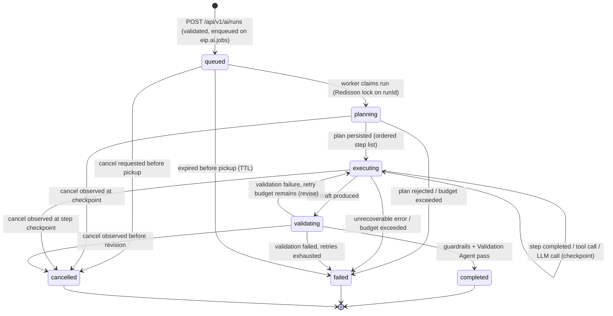

# Agent Architecture

Agentic AI backend design for the Engineering Intelligence Platform (EIP). All generative capabilities in EIP are delivered by a fleet of 18 canonical agents running inside the `eip-ai` module of the backend modular monolith, executed asynchronously on the `eip-workers` runtime. This document defines the runtime architecture, execution model, tool-calling contract, the full agent catalog, multi-agent composition, the LLM provider SPI, prompt management, evaluation, cost controls, auditability, and degradation behavior.

Related documents: `../ai/RAGArchitecture.md`, `../ai/MCPArchitecture.md`, `../architecture/SecurityModel.md`.

Requirements traceability: this document implements PRD FR-080–FR-089 — agent runtime with budgets and guardrails (FR-080, FR-088), full LLM-call audit (FR-081), the canonical agent roster (FR-082), phased agent delivery (FR-083), the LLM provider SPI (FR-084), per-tenant/per-agent routing with fallbacks and budgets (FR-085), async run lifecycle with status, cancellation, and retry semantics (FR-086), citation-checked validation (FR-087), and optional isolated Python workers (FR-089) — and honors FR-130 (per-tenant quotas including concurrent agent runs), NFR-013 (AI job latency SLOs), and NFR-041 (tenant isolation across agent contexts).

## 1. Design Principles

1. **On-premise first.** Agents run against local LLMs (Ollama, vLLM) by default; SaaS LLM providers are optional and explicitly configured per tenant. The platform must run fully air-gapped.
2. **AI is additive, never load-bearing.** Ingestion, analytics, dashboards, and RBAC function with zero LLM providers configured (see Section 13).
3. **Deterministic scaffolding, generative filling.** Agents fetch facts through typed tools (domain queries, metric queries, RAG retrieval); the LLM composes narrative around verifiable data. Numbers in outputs come from tools, not model recall.
4. **Everything budgeted, everything audited.** Every run has token/step/cost/time budgets; every LLM call is persisted with prompt, model, tokens, cost, and latency (prompts redacted per policy).
5. **Anti-surveillance stance.** No agent produces individual rankings or individual productivity scores. Team Health outputs are team-level only, with context, uncertainty, and limitations stated — consistent with the platform anti-goals.
6. **Java-first orchestration.** Default orchestration is Java 21 + LangChain4j inside `eip-ai`. Python is allowed only for optional AI workers, isolated behind Kafka queues/REST.

## 2. Runtime Architecture in `eip-ai`

### 2.1 Components

| Component | Responsibility |
|---|---|
| `AgentOrchestrator` | Owns the run lifecycle. Consumes run requests from `eip.ai.jobs`, drives the plan/execute loop, enforces budgets and guardrails, persists step state, publishes results to `eip.ai.results`. |
| `AgentRegistry` | Catalog of the 18 canonical agent definitions: identity, version, required tools, default model routing key, budget defaults, output JSON Schema, guardrail policy. Loaded at startup, tenant overrides applied at run time. |
| `ToolRegistry` | Typed tool catalog (Section 4). Resolves the tool set an agent may see for a given run: intersection of the agent definition, tenant configuration, and the RBAC permissions of the initiating principal. |
| `LlmProviderRegistry` | Registered LLM provider instances (Section 7) plus the per-tenant + per-agent routing table and fallback chains. |
| `PromptTemplateService` | Versioned prompt templates from PostgreSQL with per-tenant overrides (Section 8). |
| `RunStore` | PostgreSQL persistence of `agent_run`, `agent_run_step`, `llm_call` rows (tenant_id + RLS, like all EIP tables). |
| `GuardrailPipeline` | Pre-call input policies (redaction, injection screening) and post-call output policies (schema validation, citation checks, banned-content rules). |

`AgentOrchestrator` instances run in `eip-workers` deployments; the `eip-app` API app only enqueues runs, serves run status/results, and accepts cancellation requests (`POST /api/v1/ai/runs/{id}/cancel`, Section 2.2). This keeps long LLM calls off the request path.

### 2.2 Run lifecycle

An agent run moves through a fixed state machine. Transitions are persisted; a crashed worker resumes from the last persisted step.



State semantics:

- **queued** — request row exists, message published to `eip.ai.jobs` (key: `tenantId:runId`). Idempotency key on the enqueue endpoint prevents duplicate runs.
- **planning** — the orchestrator asks the routed model for a bounded plan (max steps from budget), or uses the agent's static plan when the agent is non-generative in its planning (most single-purpose agents ship a fixed plan template).
- **executing** — steps run sequentially (parallel fan-out only in Report Composition, Section 6). Each step's inputs/outputs are persisted before advancing, so runs are resumable.
- **validating** — output-schema check, citation check, and (for user-facing outputs) a mandatory Validation Agent pass.
- **completed / failed** — result envelope published to `eip.ai.results`; artifacts written to object storage (MinIO) and registered as `GeneratedReport` / `Artifact` domain entities where applicable.
- **cancelled** — terminal state entered via `POST /api/v1/ai/runs/{id}/cancel` (FR-086), authorized for the initiating principal and tenant admins. Cancellation is **cooperative**: the endpoint sets a persisted cancel flag; a `queued` run is cancelled before pickup, a claimed run observes the flag at each step checkpoint (before the next tool or LLM call) and stops there, persisting `cancelled` with all completed steps intact. In-flight LLM calls are abandoned client-side but still audited. Staged `writeArtifact` output is discarded — a cancelled run never publishes partial artifacts. A terminal result envelope with `status=cancelled` is published to `eip.ai.results` so parent compositions and API pollers observe the outcome. Cancelling an already-terminal run is an idempotent no-op returning the current state; every cancel request is audited with the requesting principal. Note the two distinct retry notions: the **validation-retry loop** (`validating → executing`, bounded by `maxValidationRetries`) is internal to a run, while **run-level retry** is always a new run explicitly enqueued by the caller — cancellation halts the former and never triggers the latter.

## 3. Execution Model

### 3.1 Async jobs on Kafka

- Request topic: `eip.ai.jobs`. Result topic: `eip.ai.results`. Consumer-group DLQs follow the platform convention `<group>.dlq` (e.g. the `eip.ai.orchestrator` consumer group dead-letters to `eip.ai.orchestrator.dlq`).
- Envelope: the standard EIP event envelope (`eventId (UUIDv7), tenantId, source, entityType=AgentRun, entityId=runId, eventType, occurredAt, ingestedAt, schemaVersion, payload, traceparent`). `AgentRun` is an AI-runtime entity type used on the AI topics only — it is deliberately not part of the FR-034 canonical domain vocabulary (agent runs are operational records, not ingested domain entities).
- Guarantees: at-least-once delivery with idempotent consumers (dedup on `eventId`), ordered per key (`tenantId:entityId`, per EventModel §7). Offset handling on `eip.ai.jobs` is **commit-on-claim** — Kafka delivers the job, the database owns the run from claim onward (Section 3.5).
- Triggers: interactive API calls, report schedules (`eip.reports.jobs` fan-in), domain-event reactions (e.g. Incident Analysis on incident-closed events from `eip.domain.ops`), and MCP server invocations (see `../ai/MCPArchitecture.md`).

### 3.2 Resumable steps

Every step is persisted in `agent_run_step` (`runId, stepIndex, stepType, input, output, status, startedAt, finishedAt, llmCallIds[]`). On worker restart, the orchestrator reloads the run, skips completed steps, and resumes from the first non-terminal step. Tool calls are designed to be idempotent or replay-safe (reads are naturally safe; the artifact writer uses content-hash keys).

### 3.3 Budgets

Each run carries a resolved budget — agent defaults, overridden per tenant, capped by platform limits:

| Budget | Default | Enforcement point |
|---|---|---|
| `maxTokensTotal` | 64k (per run, prompt + completion) | before each LLM call; exceeding transitions to `failed` with `BUDGET_EXCEEDED` |
| `maxSteps` | 12 | plan acceptance + step loop |
| `maxCost` | tenant-configured currency amount, computed from provider price table | before each LLM call |
| `maxWallClock` | 10 min interactive / 60 min scheduled | watchdog per run; timeout → `failed` |
| `maxToolCalls` | 40 | ToolRegistry interceptor |
| `maxValidationRetries` | 2 | validating → executing loop |

Budget consumption is recorded per step and surfaced in run status responses and in the tenant quota ledger (Section 11).

Budgets are hard-stop ceilings, not latency targets. The performance targets are NFR-013's SLOs — interactive agent runs complete within 5 min p95, long-running report jobs within 30 min p95, on reference hardware with local models — and alerting/capacity planning key on those SLOs (Section 10.1), not on the budgets. `maxWallClock` (10 min interactive / 60 min scheduled) deliberately sits well above the p95 SLOs so that slow-but-succeeding runs finish while runaway runs are cut off; a run that finishes inside its budget can still breach the SLO and burn error budget.

### 3.4 Context-window management

Multi-step runs accumulate context — plan, tool results, prior drafts — across up to `maxSteps` steps and `maxToolCalls` tool calls. The orchestrator manages this against the routed model's `ModelDescriptor.contextWindow` (Section 7.1):

- **Assembly.** The context for each LLM call is assembled fresh from: the system prompt and rendered template, the retained plan, the full outputs of the most recent steps, and a running summarized history of older steps. Step summaries are produced at checkpoint time and persisted with the step, so assembly is deterministic and resumable.
- **Compaction.** When the assembled context would exceed a configured fraction (default 80%) of `contextWindow`, the orchestrator compacts: the oldest full step outputs are replaced by their persisted summaries, and oversized tool results are re-truncated per Section 4, rule 5 (truncation flagged so the agent can paginate).
- **Overflow.** If a single step's mandatory inputs (template + output schema + the evidence the step is instructed to use) cannot fit even after compaction, the run fails with `BUDGET_EXCEEDED` (reason `CONTEXT`). The orchestrator never silently drops mandatory evidence to make a prompt fit — that path produces confidently wrong output.

Compaction and truncation events are recorded on the step, so audits can reconstruct exactly what context each LLM call saw.

### 3.5 Job claim & offset semantics

Agent runs last 10–60 minutes — orders of magnitude longer than a Kafka poll loop tolerates (`max.poll.interval.ms` defaults to 5 minutes; holding a message un-acked for a run's duration would evict the consumer and trigger rebalance storms). The `eip.ai.jobs` consumer (`eip.ai.orchestrator` group) therefore decouples message consumption from run execution:

- **Commit-on-claim.** On receiving a job message, the consumer claims the run — it persists the `queued → planning` transition and takes the Redisson lock on `runId` with a watchdog-renewed lease covering `maxWallClock` — and **commits the Kafka offset immediately**. From that point the `agent_run` row is the source of truth for the run; Kafka's delivery role is complete.
- **Dedicated run executor.** Run execution happens on a dedicated executor pool, never on the consumer poll thread, so `max.poll.interval.ms` never bounds run duration and the consumer keeps polling and claiming while runs execute.
- **Quota-held runs are parked in the database, not on the partition.** A run that cannot start because its tenant is at `maxConcurrentRuns` (the Section 10 queue-hold) is *not* held un-acked on the partition: the offset is committed and the run row remains `queued` (parked). A DB-backed dispatch check — the Redis per-tenant concurrency counter plus a poll of parked runs, oldest first — claims parked runs as slots free. One tenant sitting at its cap therefore never head-of-line-blocks other tenants' jobs on the same partition.
- **Crash/rebalance recovery is RunStore-driven, never Kafka-redelivery-driven.** If a worker dies after claim, its Redisson lease expires and another worker's recovery sweep reclaims the run from the database, resuming from the last persisted step (Section 3.2). Kafka redelivery plays no role after the claim commit; duplicate deliveries before the commit are absorbed by `eventId` dedup and the claim's lock-plus-state-check uniqueness.
- **Autoscaling signal.** Because offsets are committed at claim time, consumer lag is a poor load signal for ai workers; autoscaling keys on **run-backlog depth and age** (parked/queued run count and oldest-queued age), per `../architecture/DeploymentModel.md` §6.

## 4. Tool-Calling Contract

Agents interact with the platform exclusively through **typed tools**: each tool has a name, JSON Schema for input and output, an RBAC permission requirement, and a tenant scope. LangChain4j tool specifications are generated from these definitions.

| Tool family | Examples | Backing module | Notes |
|---|---|---|---|
| Domain queries | `getWorkItems`, `getSprint`, `getPullRequests`, `getIncidents`, `getDependencies`, `getReleases` | `eip-core` read APIs | Cursor-paginated, hard row caps, canonical entities only (WorkItem, Sprint, Incident, ...). |
| Metric queries | `getMetricSeries`, `getMetricSnapshot`, `getDoraMetrics`, `getFlowMetrics`, `getReleaseReadiness` | `eip-analytics` | Returns metric values with grain, formula version, and caveats attached — agents must propagate caveats into outputs. |
| RAG retrieval | `ragSearch`, `ragFetchChunk` | `eip-ai` RAG subsystem | Permission-aware, citation-bearing (see `../ai/RAGArchitecture.md`). |
| MCP tools | admin-allow-listed external tools via `McpClientGateway` | `eip-ai` | Treated as untrusted input; see `../ai/MCPArchitecture.md`. |
| Artifact writer | `writeArtifact` (markdown/HTML/PDF/PPTX/Mermaid/CSV) | `eip-reports` + MinIO | Only mutating tool available to agents; writes are staged until the run completes. HTML content is sanitized at write time (rule 6). |

Contract rules:

1. **Principal propagation.** Every tool call executes with the RBAC scope of the run's *initiating principal* (user or service token) and the run's tenant. Agents never escalate: a run started by a user who cannot see Project X cannot retrieve Project X data through any tool, including RAG.
2. **Tenant scoping.** `tenantId` is injected by the ToolRegistry from the run context; it is never a model-controllable parameter. Postgres RLS is the backstop.
3. **Schema validation both ways.** Tool inputs produced by the model are validated against the input schema before execution (invalid → structured error returned to the model, counted against `maxToolCalls`); tool outputs are validated before being appended to the context.
4. **Read-mostly.** Except `writeArtifact` and explicitly allow-listed MCP tools, all tools are read-only. No agent tool mutates canonical domain data.
5. **Result size limits.** Tool results are truncated/summarized above a configurable size to protect the context window; truncation is flagged so agents can paginate instead of guessing.
6. **Artifact sanitization (stored-XSS defense).** `writeArtifact` sanitizes HTML content against a strict allow-list before staging: no `script`/`style` elements, no event-handler attributes, no non-allow-listed URI schemes or external resource loads. Markdown is rendered to HTML through the same sanitizer in `eip-reports`. The Validation Agent's `POLICY` check additionally flags unsafe markup that survives generation. Render paths treat artifacts as untrusted regardless — the SPA sanitizes generated report HTML again before render (see `../implementation/FrontendPlan.md`), so a single missed layer never becomes an exploit.

## 5. Canonical Agent Catalog

The 18 canonical agents. Names are fixed vocabulary; do not invent variants.

| # | Agent | Category | Phase | Primary output | Typical trigger | User-facing (Validation Agent mandatory) |
|---|---|---|---|---|---|---|
| 1 | Data Ingestion Agent | Operations | 4 | Connector configuration/mapping suggestions, sync diagnostics | Admin request, sync failure event | No (admin-facing, advisory) |
| 2 | Data Quality Agent | Operations | 4 | Data quality findings report | Schedule, post-sync | No (admin-facing) |
| 3 | Engineering Metrics Agent | Analytics narrative | 4 | Metric interpretation narrative | Dashboard "explain", report section | Yes |
| 4 | Delivery Risk Agent | Analytics narrative | 3 | Risk assessment per epic/project/release | Schedule, risk threshold event | Yes |
| 5 | Sprint Review Agent | Reporting | 3 | Sprint review report | Sprint close, schedule | Yes |
| 6 | Release Notes Agent | Reporting | 3 | Release notes document | Release event, on demand | Yes |
| 7 | Documentation Agent | Reporting | 4 | Technical/process documentation drafts | On demand | Yes |
| 8 | Use Case Diagram Agent | Diagramming | 4 | Mermaid/PlantUML use case diagrams | On demand, report section | Yes |
| 9 | Architecture Diagram Agent | Diagramming | 4 | Mermaid/PlantUML architecture diagrams | On demand, report section | Yes |
| 10 | Executive Summary Agent | Reporting | 4 | Executive-level narrative summary | Schedule, report section | Yes |
| 11 | Incident Analysis Agent | Analytics narrative | 4 | Incident/postmortem analysis | Incident closed, on demand | Yes |
| 12 | Code Quality Agent | Analytics narrative | 4 | Code quality narrative and hotspot analysis | Schedule, quality gate event | Yes |
| 13 | Team Health Agent | Analytics narrative | 4 | Team-level health narrative (anti-ranking guardrails) | Schedule | Yes |
| 14 | RAG Retrieval Agent | Infrastructure | 4 | Ranked, cited context bundles | Invoked by other agents / MCP server | No (feeds other agents) |
| 15 | Report Composition Agent | Orchestration | 4 | Composed multi-section reports | Report schedule, on demand | Yes (composes validated sections; final pass) |
| 16 | Validation Agent | Quality | 3 | Validation verdict + issue list | Mandatory post-step of user-facing runs | No (it *is* the validator) |
| 17 | Security Review Agent | Analytics narrative | 4 | Security posture narrative (finding aging, gate status) | Schedule, security finding events | Yes |
| 18 | Configuration Assistant Agent | Operations | 4 | Guided platform configuration answers/suggestions | Admin interactive session | No (admin-facing, advisory, never applies changes itself) |

Phase assignments follow FR-083: Phase 3 delivers at minimum the Sprint Review, Release Notes, and Delivery Risk agents; the remaining canonical agents ship in Phase 4. The Validation Agent also ships in Phase 3 (FR-087, P0/Phase 3) because it gates publication of every user-facing output — the Phase-3 agents cannot publish without it. Two Phase-3 dependencies are worth calling out explicitly: (a) the RAG retrieval subsystem (`ragSearch`/`ragFetchChunk`, FR-095–FR-101) is part of the Phase-3 AI core even though the dedicated RAG Retrieval Agent (LLM query decomposition, Section 5.14) completes in Phase 4 — Phase-3 agents call the deterministic retrieval tools directly; (b) the Phase-3 agents run under the full validation pipeline from day one, so validation behavior does not change when the rest of the fleet arrives in Phase 4.

### 5.1 Data Ingestion Agent

- **Purpose:** Assist admins in configuring connectors and diagnosing sync problems: propose field mappings from source payload samples to the canonical model, explain checkpoint/rate-limit failures, suggest webhook vs. polling setups.
- **Inputs:** Connector type and config draft, `raw_*` staging samples, sync error logs, checkpoint state.
- **Tools:** Domain queries (connector registry, checkpoint tables), raw-sample reader (size-capped, secret-masked), RAG retrieval (connector docs).
- **Output contract:** JSON — `suggestions[] {area, currentValue, proposedValue, rationale, confidence}`, plus a markdown diagnostic summary. Never applies configuration; admin confirms in UI.
- **Guardrails:** Secrets are masked before any payload reaches the model; suggestions are advisory; raw samples truncated and PII-screened.
- **Prompt skeleton:** system role (connector expert, advisory-only) → canonical-model field reference → connector config draft → error/sample evidence blocks → task instruction → output JSON Schema.

### 5.2 Data Quality Agent

- **Purpose:** Detect and narrate data quality issues in ingested data: orphaned `ExternalRef`s, stale syncs, duplicate WorkItems, gap detection in time series, suspicious cardinality shifts.
- **Inputs:** Data quality rule results (computed deterministically in `eip-ingestion`/`eip-analytics`), sync statistics, checkpoint lag.
- **Tools:** Metric queries (freshness/completeness metrics), domain queries, artifact writer.
- **Output contract:** JSON findings list `{severity, entityType, description, evidenceRefs[], remediation}` + markdown report artifact.
- **Guardrails:** Findings must reference rule IDs and entity IDs returned by tools; the model interprets and prioritizes, it does not invent findings.
- **Prompt skeleton:** system role (data steward) → rule-result table → sync stats → prioritization instruction → schema.

### 5.3 Engineering Metrics Agent

- **Purpose:** Explain metric values, trends, and anomalies from the canonical metric set (flow, DORA, quality, delivery risk, ops, team health) in plain language with caveats.
- **Inputs:** Metric selection, time range, grain (team/project/sprint), audience level.
- **Tools:** Metric queries (`getMetricSeries`, `getDoraMetrics`, `getFlowMetrics`), domain queries for context (sprint boundaries, releases), RAG retrieval (metric definitions).
- **Output contract:** Markdown narrative with an embedded `dataPoints[]` appendix; every number must match a tool result; caveats/limitations section is mandatory (metric definitions ship caveats and gaming risks — the agent must include them).
- **Guardrails:** No individual-level attribution; anomaly language must state uncertainty; numbers cross-checked by the Validation Agent against the same metric queries.
- **Prompt skeleton:** system role (metrics analyst, anti-ranking policy) → metric definitions with formulas and caveats → data tables → audience instruction → structure template (Summary / Trends / Anomalies / Caveats).

### 5.4 Delivery Risk Agent

- **Purpose:** Assess delivery risk for Epics, Projects, and Releases: delay prediction inputs, dependency risk, scope churn, blocked time, release readiness score interpretation.
- **Inputs:** Target entity (Epic/Project/Release), horizon.
- **Tools:** Metric queries (epic delivery risk, project delay prediction, dependency risk, release readiness score), domain queries (Dependencies, Risks, WorkItems, Milestones), RAG retrieval (DecisionRecords, planning docs).
- **Output contract:** JSON `{riskLevel, drivers[] {factor, evidence, weight}, recommendations[], confidence, limitations}` + markdown narrative.
- **Guardrails:** Risk scores come from `eip-analytics` risk scoring, not the model; the model explains drivers and recommends mitigations. Confidence and limitations fields are required.
- **Prompt skeleton:** system role (delivery risk analyst) → risk-score breakdown from analytics → dependency graph excerpt → historical analogs → explanation + recommendation instruction → schema.

### 5.5 Sprint Review Agent

- **Purpose:** Generate sprint review reports: commitment vs. done, scope churn, velocity context, notable WorkItems, blockers, carry-over, next-sprint risks.
- **Inputs:** Sprint ID (or Board + date range for kanban cadence reviews).
- **Tools:** Domain queries (Sprint, WorkItems, WorkflowState history), metric queries (velocity, sprint predictability, scope churn, blocked time, WIP), RAG retrieval (sprint goal docs), artifact writer.
- **Output contract:** Structured markdown per the sprint-review template (versioned, tenant-overridable) with a machine-readable summary block; registered as a `GeneratedReport`.
- **Guardrails:** Team-level framing only; carried-over items listed factually without individual blame language (enforced by guardrail lexicon + Validation Agent).
- **Prompt skeleton:** system role (facilitator, neutral tone) → sprint data tables → metric snapshots with caveats → template section outline → per-section length limits.

### 5.6 Release Notes Agent

- **Purpose:** Produce release notes from Release contents: merged PullRequests, resolved WorkItems, deployment info, breaking-change candidates, known issues.
- **Inputs:** Release ID, audience (internal/customer), format profile.
- **Tools:** Domain queries (Release, Deployments, PullRequests, WorkItems, Commits), RAG retrieval (linked docs), artifact writer.
- **Output contract:** Markdown/HTML release notes grouped by change type; every entry cites its source WorkItem/PullRequest via `ExternalRef` URLs.
- **Guardrails:** Entries without a resolvable source reference are dropped, not paraphrased into existence; customer-audience profile strips internal identifiers per redaction policy.
- **Prompt skeleton:** system role (release manager) → change inventory table → audience/format profile → grouping rules → entry format spec with citation requirement.

### 5.7 Documentation Agent

- **Purpose:** Draft and update technical/process documentation: runbooks, onboarding guides, connector setup docs, metric explainers — grounded in platform data and RAG sources.
- **Inputs:** Doc request (topic, audience, outline or existing doc to revise).
- **Tools:** RAG retrieval (heavy user), domain queries, artifact writer.
- **Output contract:** Markdown document with per-section citations; revision mode returns a change summary plus the new draft.
- **Guardrails:** Claims about the environment must carry citations; uncited sections are flagged `[needs-source]` rather than asserted; drafts are never auto-published.
- **Prompt skeleton:** system role (technical writer, US spelling) → outline or existing doc → retrieved context bundles with chunk IDs → citation rules → style guide excerpt.

### 5.8 Use Case Diagram Agent

- **Purpose:** Generate use case diagrams (Mermaid, optionally PlantUML) from Features/Stories, roles, and documented flows.
- **Inputs:** Scope (Product/Project/Epic), actor hints, notation choice.
- **Tools:** Domain queries (Features, Stories, Roles), RAG retrieval (requirement docs), artifact writer.
- **Output contract:** Diagram source block + legend + assumption list; diagram source must parse (syntax-checked deterministically before validation).
- **Guardrails:** Parse-check is a hard gate with bounded auto-repair retries; assumptions about actors not present in data are listed explicitly.
- **Prompt skeleton:** system role (analyst) → entity inventory → notation grammar reminder → diagram size limits → output fencing rules.

### 5.9 Architecture Diagram Agent

- **Purpose:** Generate architecture/deployment/data-flow diagrams from Services, ApiEndpoints, Repositories, Deployments, Environments, and documented architecture decisions.
- **Inputs:** Scope (Product/Service set/Environment), view type (context, container, deployment, data flow), notation.
- **Tools:** Domain queries (Services, ApiEndpoints, Deployments, Environments, Dependencies), RAG retrieval (DecisionRecords, architecture docs), artifact writer.
- **Output contract:** Diagram source + component-to-source mapping table + confidence notes for inferred edges.
- **Guardrails:** Edges not backed by domain data or cited documents are rendered dashed and labeled "inferred"; parse-check hard gate as in 5.8.
- **Prompt skeleton:** system role (architect) → component inventory with relationships → view-type conventions → inference labeling rules → notation grammar.

### 5.10 Executive Summary Agent

- **Purpose:** Produce executive-level narrative summaries across portfolios: delivery health, risk posture, quality trend, incident posture — concise, caveated, decision-oriented.
- **Inputs:** Scope (Organization/BusinessUnit/Product portfolio), period, prior summary (for continuity).
- **Tools:** Metric queries (aggregated grains only), Delivery Risk Agent outputs (via composition), RAG retrieval (prior GeneratedReports), artifact writer.
- **Output contract:** Fixed-structure markdown (Headline / Highlights / Risks / Asks / Data notes) with strict length budget; machine-readable KPI block.
- **Guardrails:** Aggregate grains only — no team-member data; every KPI traces to a metric query; trend claims require at least two periods of data or are marked insufficient-data.
- **Prompt skeleton:** system role (chief-of-staff voice) → KPI table with period deltas → risk register excerpt → prior summary → length and structure constraints.

### 5.11 Incident Analysis Agent

- **Purpose:** Analyze Incidents: timeline reconstruction, contributing factors, MTTR context, related Alerts/Deployments/Changes, draft postmortem sections.
- **Inputs:** Incident ID (or incident set for trend analysis).
- **Tools:** Domain queries (Incident, Alerts, Deployments, LogReference/TraceReference metadata), metric queries (incident frequency/impact, MTTR, SLO health), RAG retrieval (runbooks, prior postmortems), artifact writer.
- **Output contract:** Postmortem draft per template: Timeline (tool-sourced timestamps only) / Impact / Contributing factors (each cited) / Follow-ups; blameless-language enforced.
- **Guardrails:** Blameless policy lexicon; timeline entries must carry source event IDs; causal language limited to "contributing factor" phrasing unless a documented root cause exists.
- **Prompt skeleton:** system role (blameless postmortem facilitator) → event timeline table → related-change list → template sections → language policy.

### 5.12 Code Quality Agent

- **Purpose:** Narrate code quality state and trends: coverage, code smells, duplication, quality gate status, escaped defects, bug aging, technical debt ratio; identify hotspots and debt-paydown candidates.
- **Inputs:** Scope (Repository/Project/Product), period.
- **Tools:** Metric queries (quality metric family), domain queries (Repositories, QualityGates, TechnicalDebtItems, Bugs), RAG retrieval (coding standards docs), artifact writer.
- **Output contract:** Markdown narrative + hotspot table `{repo, path/module, signal, trend, suggestedAction}`; all signals tool-sourced.
- **Guardrails:** Repository/module granularity — never author granularity; suggested actions framed as options with effort/impact caveats.
- **Prompt skeleton:** system role (quality coach) → metric snapshot/trend tables → gate status list → hotspot detection instruction → anti-attribution rule.

### 5.13 Team Health Agent

- **Purpose:** Team-level health narrative: load balance, review bottlenecks, knowledge concentration (bus factor), WIP pressure — explicitly anti-toxic-ranking, framed as systemic signals with limitations.
- **Inputs:** Team ID(s), period.
- **Tools:** Metric queries (team health family — team-level aggregates only), domain queries (Team, Board, WorkflowState distribution), artifact writer.
- **Output contract:** Markdown with mandatory sections: Signals / What this does and does not mean / Limitations / Suggested conversations. No individual names in analytical statements.
- **Guardrails:** Strictest guardrail profile: individual-identifier suppression in outputs, ranking-language lexicon block, mandatory limitations section; Validation Agent runs with the anti-ranking checklist enabled.
- **Prompt skeleton:** system role (org-health facilitator, explicit anti-surveillance charter) → team-level aggregates → interpretation guardrail text → required section structure.

### 5.14 RAG Retrieval Agent

- **Purpose:** Infrastructure agent providing high-quality, permission-aware, cited context bundles to other agents and to the MCP server's retrieval capability. Performs query decomposition, hybrid search invocation, re-rank, deduplication, and citation assembly.
- **Inputs:** Retrieval request `{query, scopeFilters, k, diversity, callerPrincipal}` from a calling agent run.
- **Tools:** RAG retrieval primitives (`ragSearch`, `ragFetchChunk`) — no domain mutation, no artifact writer.
- **Output contract:** `contextBundle {chunks[] {chunkId, snippet, source, sourceUrl, score, retrievalAuditId}, coverageNotes, unresolvedAspects[]}` — field names match the RAG chunk metadata model and retrieval API (`../ai/RAGArchitecture.md` Sections 7 and 11); `retrievalAuditId` carries the `rag_retrieval_audit` reference from the ragSearch response into the bundle so every downstream citation is independently verifiable against the audit trail (citation contract, `../ai/RAGArchitecture.md` Section 12).
- **Guardrails:** Inherits the calling run's principal — cannot widen scope; returns empty-with-explanation rather than lowering the relevance floor.
- **Prompt skeleton:** system role (retrieval planner) → query decomposition instruction → filter vocabulary → bundle assembly rules. (Query decomposition is the only LLM step; search itself is deterministic.)

### 5.15 Report Composition Agent

- **Purpose:** Orchestrate multi-section reports by delegating to section agents (Sprint Review, Executive Summary, Delivery Risk, Code Quality, etc.), then unifying tone, deduplicating content, and assembling final artifacts. Detailed in Section 6.
- **Inputs:** Report template ID, scope parameters, output formats.
- **Tools:** Agent-invocation tool (spawn child runs — the only agent with this tool), artifact writer, RAG retrieval (prior reports for continuity).
- **Output contract:** Composed `GeneratedReport` (markdown + optional HTML/PDF/PPTX via `eip-reports`) with per-section provenance (child runId, agent, version).
- **Guardrails:** Child runs inherit principal, tenant, and a partitioned share of the parent budget (equal split with a 20% compose reserve — Section 6.1); composition may reorder/trim but not alter section facts; final Validation Agent pass over the composed document.
- **Prompt skeleton:** system role (editor-in-chief) → template outline with section contracts → child section outputs → unification instruction (tone, dedup, cross-references) → no-new-facts rule.

### 5.16 Validation Agent

- **Purpose:** Mandatory post-step for all user-facing outputs. Performs three checks: **fact-check** (numbers/claims re-verified against source data via the same tools), **citation check** (every citation resolves; uncited factual claims flagged), **schema check** (output conforms to the agent's output contract — deterministic validation, LLM used for claim extraction only).
- **Inputs:** Candidate output, producing agent's output contract, list of tool calls/results from the producing run.
- **Tools:** Same read tools as the producing run (same principal — validation must not see more than the producer), citation resolver.
- **Output contract:** `verdict {pass|fail}, issues[] {type: FACT|CITATION|SCHEMA|POLICY, location, detail, severity}`; on fail, issues feed the producing run's revision loop (bounded by `maxValidationRetries`).
- **Guardrails:** Runs with a different model than the producer where the routing table allows (cross-model checking); its own budget is charged to the producing run — within a Report Composition, per-section passes charge the child section's budget partition and only the final composed-document pass charges the compose reserve (Section 6.1).
- **Prompt skeleton:** system role (adversarial fact-checker) → claim-extraction instruction → per-claim verification protocol (query tool, compare, verdict) → issue schema.

### 5.17 Security Review Agent

- **Purpose:** Narrate security posture from ingested signals: SecurityFinding aging, severity distribution, quality gate security conditions, dependency risk signals, incident overlap; draft security review summaries for release readiness.
- **Inputs:** Scope (Project/Release/Organization), period.
- **Tools:** Domain queries (SecurityFindings, QualityGates, Releases), metric queries (security finding aging, release readiness score), RAG retrieval (security policies), artifact writer.
- **Output contract:** Markdown security review with severity-ordered findings table and remediation-status summary; all findings tool-sourced with IDs.
- **Guardrails:** Never generates new vulnerability claims — it reports and contextualizes ingested findings only; exploit details are excluded from outputs by policy; report access restricted by dedicated RBAC permission.
- **Prompt skeleton:** system role (security analyst, report-not-scan charter) → finding inventory → gate/policy context → summary structure → exclusion rules.

### 5.18 Configuration Assistant Agent

- **Purpose:** Interactive admin assistant for platform configuration: explain settings, propose connector/metric/RBAC/report configurations from natural-language intent, generate JSON config drafts against the relevant JSON Schemas.
- **Inputs:** Admin chat turns, current configuration context (secret-masked).
- **Tools:** Domain queries (configuration registries, JSON Schemas), RAG retrieval (this /docs tree, indexed), MCP tools where allow-listed for admin context.
- **Output contract:** Chat responses plus optional `configDraft {schemaRef, json, diff}` blocks that the admin explicitly applies through the normal validated API — the agent has no write access to configuration.
- **Guardrails:** Strictly advisory (no mutation tool); secrets never enter context; drafts are schema-validated before display; admin RBAC required to start a session.
- **Prompt skeleton:** system role (platform SME, advisory-only) → relevant JSON Schemas → current masked config → conversation history → draft-formatting rules.

### 5.19 Representative output contract (JSON Schema)

Every agent's output contract is a versioned JSON Schema stored with the agent definition in the `AgentRegistry` and enforced twice: as a structured-output request where the provider supports native JSON Schema output (Section 7.2), and deterministically in the `validating` state. Representative example — the Delivery Risk Agent contract (Section 5.4):

```json
{
  "$schema": "https://json-schema.org/draft/2020-12/schema",
  "$id": "eip:agent-output:delivery-risk:1",
  "type": "object",
  "required": ["riskLevel", "drivers", "recommendations", "confidence", "limitations", "citations"],
  "additionalProperties": false,
  "properties": {
    "riskLevel": { "enum": ["LOW", "MEDIUM", "HIGH", "CRITICAL"] },
    "drivers": {
      "type": "array", "minItems": 1, "maxItems": 10,
      "items": {
        "type": "object",
        "required": ["factor", "evidence", "weight"],
        "additionalProperties": false,
        "properties": {
          "factor": { "type": "string", "maxLength": 200 },
          "evidence": { "type": "string", "maxLength": 1000 },
          "weight": { "type": "number", "minimum": 0, "maximum": 1 }
        }
      }
    },
    "recommendations": { "type": "array", "maxItems": 8, "items": { "type": "string", "maxLength": 500 } },
    "confidence": { "type": "number", "minimum": 0, "maximum": 1 },
    "limitations": { "type": "array", "minItems": 1, "items": { "type": "string", "maxLength": 500 } },
    "citations": {
      "type": "array",
      "items": {
        "type": "object",
        "required": ["n", "chunkId", "sourceUrl"],
        "additionalProperties": false,
        "properties": {
          "n": { "type": "integer", "minimum": 1 },
          "chunkId": { "type": "string", "format": "uuid" },
          "sourceUrl": { "type": "string", "format": "uri" },
          "retrievalAuditId": { "type": "string", "format": "uuid" }
        }
      }
    }
  }
}
```

Conventions shared by all agent output schemas: `additionalProperties: false` everywhere (no model-invented fields), explicit array/string maxima (context and budget protection), a mandatory `limitations` (or equivalent caveats) element on user-facing contracts, and citation entries matching the machine-readable citation contract in `../ai/RAGArchitecture.md` Section 12 (`sourceUrl`/`snippet` field naming, `retrievalAuditId` back-reference).

## 6. Multi-Agent Composition

### 6.1 Report Composition Agent as orchestrator

The Report Composition Agent is the only agent permitted to spawn child runs. Composition flow:

1. Resolve the report template (versioned; per-tenant overrides) into an ordered section list, each bound to a section agent and parameter mapping.
2. Spawn child runs on `eip.ai.jobs` (fan-out; independent sections run in parallel across workers). Each child inherits `tenantId`, initiating principal, `traceparent`, and a budget partition. **Partitioning rule:** the parent's remaining token, cost, and tool-call budgets are split **equally across the spawned sections after reserving 20% for the compose-and-validate pass**; wall-clock is shared (children run against the parent's `maxWallClock`), not split. A child that exhausts its partition fails with `BUDGET_EXCEEDED` and its section degrades to the "unavailable" placeholder (step 3) — child exhaustion never draws down the compose reserve or sibling partitions, so one runaway section cannot starve the rest of the report.
3. Await child results on `eip.ai.results` (correlation by parent runId); a failed non-critical section (including budget-exhausted children) degrades to an "unavailable" placeholder with the failure reason, a failed critical section fails the composition.
4. Compose: unify tone, dedupe overlapping facts, build cross-references and table of contents. Composition may not introduce facts absent from section outputs.
5. Final Validation Agent pass over the composed document (in addition to per-section validation).
6. Render output formats via `eip-reports` and register the `GeneratedReport`.

**Concurrency admission (no self-deadlock).** Children count against the tenant's `maxConcurrentRuns` like any other run (Section 10), so composition is admitted only when the tenant cap is **≥ 2** — at cap 1 the parent would hold the sole slot while its children wait for one, a guaranteed deadlock; enqueueing a composition run for a cap-1 tenant is rejected with RFC 7807 `quota-exceeded` and an explanatory detail. While in the await-children state (step 3 — the parent holds no executor and makes no LLM calls), the **parent releases its concurrency slot** and re-acquires one before the compose pass (step 4; re-acquisition queue-holds like any other claim). Children respect the cap among themselves, so a wide fan-out at cap *N* runs at most *N* sections in parallel and the rest queue-hold.

**Validation budget attribution.** Per-section Validation Agent passes draw from **that child's budget partition** — validation is part of producing the section, and a section whose validation exhausts its partition degrades exactly like any other budget-exhausted child. Only the final composed-document pass (step 5) draws from the **20% compose reserve**. This is the precise reading of Section 5.16's "charged to the parent run": for a standalone run the producing run pays; inside a composition the child's partition pays for its own section's validation.

### 6.2 Validation Agent as mandatory post-step

Every agent marked user-facing in the catalog table has `validating` wired to a Validation Agent pass. The three checks (fact, citation, schema) are non-negotiable platform policy — tenants may add checks (e.g., custom lexicons) but cannot disable the baseline. Validation failures trigger a revision loop: the producing agent receives the issue list and re-executes its final drafting step, up to `maxValidationRetries`; exhaustion fails the run rather than shipping unvalidated output.

## 7. LLM Provider SPI

### 7.1 Interface sketch

```java
public interface LlmProvider {
    String id();                          // e.g. "ollama-local", "vllm-cluster-a"
    List<ModelDescriptor> models();       // per-model contract — capabilities live here, not on the provider
    ChatResponse chat(ChatRequest req);   // messages, tools, responseSchema?, budgetGuard
    Flux<ChatChunk> chatStream(ChatRequest req);
    HealthStatus health();                // used by routing/fallback and admin UI
}

public record ModelDescriptor(
    String id,
    Set<LlmCapability> capabilities,      // CHAT, TOOL_CALLING, STRUCTURED_OUTPUT, STREAMING, EMBEDDINGS — declared per model
    int contextWindow,
    int maxOutputTokens,
    BigDecimal pricePer1kTokens           // 0 for local
) {}
```

Capabilities are declared **per model, not per provider**: one Ollama or vLLM endpoint routinely serves models with divergent tool-calling, structured-output, and context-window support, so a provider-level capability set is unimplementable — there is no provider-level `capabilities()` method (streaming support is likewise a per-model capability). This granularity is fixed **before** the SPI is published under semver (NFR-060), so no breaking SPI change is needed later. Capability discovery for admin-registered local models: capabilities are **admin-declared at registration** and **verified by a startup/health probe** — a tool-call smoke test and a JSON-schema structured-output smoke test per declared capability; a model that fails its probe is marked capability-degraded in the admin UI and excluded from routes requiring the failed capability. Routing resolution (Section 7.2) reads per-model capabilities.

Implementations (all configurable per tenant, secrets via the platform secret vault):

| Provider | Transport | Notes |
|---|---|---|
| Ollama | HTTP (local) | Air-gapped default for chat + embeddings. |
| vLLM (OpenAI-compatible) | HTTP | On-prem GPU serving; OpenAI wire format. |
| OpenAI-compatible generic | HTTP | Any endpoint speaking the OpenAI API (LiteLLM, gateways). |
| Anthropic-compatible | HTTP | Anthropic Messages API wire format. |
| Custom enterprise endpoint | HTTP (adapter) | Thin adapter SPI for bespoke internal gateways. |

Tenant isolation on shared inference (NFR-041): when multiple tenants share an inference endpoint (a shared vLLM cluster or Ollama host), cross-request optimizations that could carry state between requests — prefix/KV-cache reuse, server-side prompt caching, speculative-decoding caches — are **disabled or tenant-partitioned** (cache keys include `tenantId`); the provider adapter refuses to route to a shared endpoint whose configuration cannot guarantee one of the two. Embedding batches never mix tenants (see `../ai/RAGArchitecture.md` Section 3.1). Tenants with stricter requirements can pin dedicated workers or endpoints via the routing table. The CI isolation test suite (NFR-041) includes a shared-endpoint scenario asserting that no cross-tenant prompt or cache residue is observable in responses.

### 7.2 Routing, fallbacks, streaming, structured output

- **Routing table** (`llm_route`, DB-managed, admin UI): key = `(tenantId, agentName, purpose)` where purpose ∈ {PLANNING, DRAFTING, VALIDATION, EMBEDDING}; value = ordered provider+model list. Resolution: exact match → tenant default → platform default.
- **Fallback chains:** on provider error/timeout/health failure, the orchestrator advances down the route list; each hop is audited; capability mismatches (e.g., no tool calling) are excluded at resolution time against the per-model `ModelDescriptor.capabilities` (Section 7.1), not discovered at call time.
- **Streaming:** interactive surfaces (Configuration Assistant, dashboard "explain") stream via SSE from `eip-app`; batch runs consume non-streaming. Streamed responses are buffered server-side so audit records and guardrail post-checks always see the complete output.
- **Structured output enforcement:** where the provider supports native JSON Schema output, it is used; otherwise the orchestrator applies constrained-prompt + parse-and-repair (bounded retries) and the schema check in `validating` remains the final gate.

## 8. Prompt & Template Management

- Prompt templates are **versioned rows in PostgreSQL** (`prompt_template`: templateKey, version, agentName, purpose, locale, body, variablesSchema, createdBy, createdAt, status ∈ DRAFT|ACTIVE|RETIRED). Rendering uses a strict variable whitelist; unknown variables fail the render.
- **Per-tenant overrides** shadow platform templates by templateKey; override diffs are visible in the admin UI and audited. Platform upgrades never silently replace an overridden template — admins see an upgrade-available flag.
- Every run records the exact `(templateKey, version)` pairs used, so any historical output can be reproduced and template regressions can be bisected.
- Template changes route through the evaluation harness (Section 9) before promotion to ACTIVE.

## 9. Evaluation & Quality

- **Golden datasets from simulation mode.** The `/simulation` data packs provide deterministic tenants with known ground truth (planted risks, known sprint outcomes, seeded incidents). Golden cases pair inputs with expected structured outputs/claims.
- **Regression evals per agent — never on the merge path.** The CC-5 merge gate runs only **deterministic prompt-contract tests**: golden prompt and tool-schema assertions exercised against `FakeLlmProvider` — no live model anywhere in gating CI, consistent with `../testing/TestingStrategy.md` (which places model-based evals nightly) and the EOS AI validation workflow. The **model-based eval suite** — scored on schema validity, fact accuracy vs. ground truth, citation resolution rate, guardrail compliance (e.g., anti-ranking lexicon for Team Health), and budget adherence — runs **nightly** and at **release gates** (RG1 for AI-phase releases) on reference hardware against the pinned local model, and on demand against tenant-routed models. Promotion of a prompt template or agent version requires non-regression on its eval suite, evidenced by the nightly/release-gate runs — eval results never gate PR merges (ADR-020).
- **Human feedback loop:** every user-facing output carries accept/edit/reject feedback affordances; feedback rows link runId + templateKey/version + verdict + optional comment, feeding eval-case candidates and template tuning. Feedback is about outputs, never about people, consistent with platform anti-goals.

## 10. Cost & Quota Management

- Provider price tables (per model, per 1k prompt/completion tokens; zero for local) are admin-maintained; every `llm_call` row stores computed cost.
- Quota ledger per tenant: daily/monthly token and cost ceilings, per-agent sub-quotas optional, and a per-tenant **`maxConcurrentRuns`** cap (FR-130). Token/cost enforcement happens at enqueue (reject with RFC 7807 `quota-exceeded`) and pre-call (fail run with `BUDGET_EXCEEDED`). Concurrency enforcement happens at **claim time** in the `AgentOrchestrator`: a Redis-backed per-tenant counter gates run claims, so a worker never claims a run that would exceed the tenant's cap — the run stays `queued` (queue-hold) until a slot frees or its TTL expires; interactive enqueues beyond a configurable queued-run depth are rejected immediately with RFC 7807 `quota-exceeded` rather than silently piling up. Queue-held runs are parked in the database with their Kafka offsets already committed (Section 3.5), so a capped tenant never blocks the partition for other tenants. Child runs spawned by Report Composition count against the cap like any other run; composition admission therefore requires `maxConcurrentRuns` ≥ 2, and the parent releases its slot while awaiting children (Section 6.1).
- **LLM response cache.** The cache behind the "cache-hit rate" dashboards is an **exact-prompt response cache**: entries are keyed on `tenantId` + `principalGrantHash` + `(templateKey, templateVersion)` + the hash of the exact rendered prompt + model id. Keying on `principalGrantHash` means results are never shared across differing permission sets (same rule as the retrieval cache, `../ai/RAGArchitecture.md` Section 8), and keying on the template version makes every template change an implicit cache invalidation. Only deterministic, non-interactive calls (temperature 0 / fixed seed where the provider supports it) are cache-eligible; entries are TTL-bounded (default 24 h) and tenant-scoped in Redis. Cache hits are still audited as `llm_call` rows (`cacheHit=true`, zero cost, zero provider latency), so audit completeness (Section 11) is unaffected.
- Dashboards (Grafana + in-product admin) show spend by tenant/agent/model, cache-hit and fallback rates, and eval scores over time via the Micrometer/OTel metrics in Section 10.1.

### 10.1 AI metrics

Micrometer → OTel → Prometheus/Grafana, consistent with the RAG and MCP metric catalogs (`../ai/RAGArchitecture.md` Section 15, `../ai/MCPArchitecture.md` Section 6):

| Metric | Type | Labels | Alerting guidance |
|---|---|---|---|
| `eip.ai.run.latency` | histogram | tenant, agent, trigger (interactive/scheduled) | Alert against NFR-013: interactive p95 > 5 min or scheduled-report p95 > 30 min over the SLO window. |
| `eip.ai.run.failures` | counter | tenant, agent, reason (BUDGET, CONTEXT, VALIDATION, PROVIDER, TIMEOUT, TTL) | Alert on failure-rate threshold; a VALIDATION spike is a quality-regression signal (template or model drift), not an ops signal. |
| `eip.ai.llm.tokens` | counter | tenant, agent, model, kind (prompt/completion) | Quota forecasting; warn at 80% of the tenant ceiling. |
| `eip.ai.llm.cost` | counter | tenant, agent, model | Warn at a configurable share of the tenant budget; hard enforcement is the quota ledger, not the metric. |
| `eip.ai.validation.fail_rate` | gauge | tenant, agent | Alert on sustained rise above the agent's eval baseline. |
| `eip.ai.provider.fallback` | counter | tenant, provider, model | Any sustained nonzero rate → provider health review; correlates with `HealthStatus` flips. |
| `eip.ai.eval.score` | gauge | agent, suite | Alert on regression below the suite baseline (Section 9); gates template promotion. |

Alerting is keyed to the NFR-013 SLOs, not to the budget ceilings in Section 3.3 — budgets are hard stops sitting above the p95 SLOs, so "no budget breaches" does not mean "SLO met".

## 11. Auditability

Every LLM call is audited without exception: `llm_call (id, runId, stepIndex, tenantId, principal, provider, model, templateKey, templateVersion, promptRedacted, completionRedacted, promptTokens, completionTokens, cost, latencyMs, finishReason, cacheHit, error?)`. Redaction policy (per tenant) controls whether full prompts, hashed prompts, or metadata-only are retained. Tool calls, MCP calls, and RAG retrievals are audited in their own trails (see sibling docs). All audit rows are tenant-scoped (RLS), immutable, and exportable; `traceparent` links audit rows to OTel traces.

## 12. Acceptance Criteria

These criteria trace to FR-080–FR-089, FR-130, NFR-013, and NFR-041.

- [ ] Given a run request from a principal lacking permission to an entity, when any tool call touches that entity, then the tool returns an authorization error and no data reaches the model (FR-088, NFR-041).
- [ ] Given a worker crash mid-run, when another worker claims the run, then it resumes from the last persisted step with no duplicated `writeArtifact` effects (FR-086).
- [ ] Given a user-facing agent output, when validation runs, then fact, citation, and schema checks all execute and a failure with exhausted retries yields `failed`, never an unvalidated `completed` (FR-087).
- [ ] Given any completed or failed run, when an auditor queries it, then every LLM call, tool call, template version, token count, and cost is retrievable (FR-081).
- [ ] Given a provider outage, when a routed call fails, then the fallback chain is attempted in order and each hop is audited (FR-085).
- [ ] Given a running agent run, when an authorized principal calls `POST /api/v1/ai/runs/{id}/cancel`, then the run reaches `cancelled` at the next step checkpoint, no staged artifact is published, a `status=cancelled` envelope is published to `eip.ai.results`, and the cancellation is audited (FR-086).
- [ ] Given a tenant at its `maxConcurrentRuns` cap, when further runs are enqueued, then no worker claim exceeds the cap — additional runs queue-hold, and interactive enqueues beyond the queued-depth limit are rejected with RFC 7807 `quota-exceeded` (FR-130).
- [ ] Given a run whose mandatory step inputs cannot fit the routed model's context window after compaction, when the step executes, then the run fails with `BUDGET_EXCEEDED` reason `CONTEXT` rather than silently dropping evidence (FR-088, NFR-013).
- [ ] Given a shared inference endpoint serving two tenants, when the isolation suite runs, then no cross-tenant prompt or cache residue is observable in any response (NFR-041).
- [ ] Given an agent produces HTML containing script or event-handler markup, when `writeArtifact` stages it, then sanitization strips the disallowed markup and the Validation Agent `POLICY` check flags the attempt (FR-088).

## 13. Degradation Behavior Without an LLM

When no LLM provider is configured (or all are unhealthy) the platform remains **fully functional minus generative features**:

| Capability | Without LLM |
|---|---|
| Ingestion, normalization, connectors | Unaffected. |
| Metrics, dashboards, alerting | Unaffected (metric engines are deterministic, in `eip-analytics`). |
| Deterministic report exports (tables, charts) | Unaffected via `eip-reports`. |
| Agent runs | Enqueue rejected with RFC 7807 `llm-unavailable`; scheduled generative reports skipped with an audited notice. |
| RAG indexing | Continues if the embedding route uses a local model; otherwise paused with connector-style health status. |
| MCP server capabilities | Non-generative capabilities (query metrics, query work items) unaffected; generative ones report unavailable. |
| UI | Generative panels render an explicit "AI not configured" state with admin guidance — never blank or broken. |
