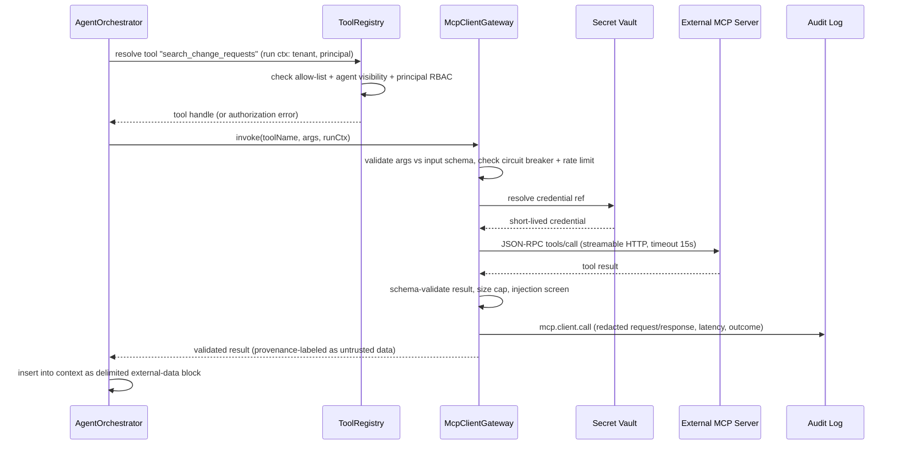
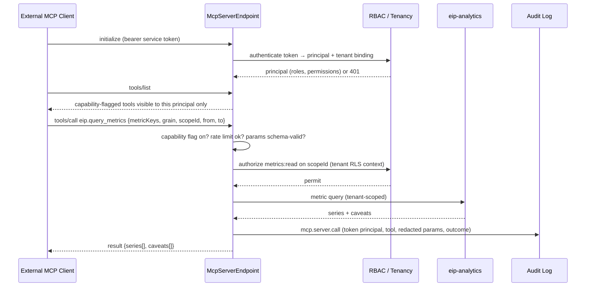

# MCP Architecture

Model Context Protocol (MCP) integration for the Engineering Intelligence Platform (EIP). EIP is MCP-ready in both directions: it acts as an MCP **client** (connecting enterprise MCP servers as agent tools via the `McpClientGateway` in `eip-ai`) and as an MCP **server** (exposing selected, allow-listed internal capabilities via the `McpServerEndpoint`), with per-capability RBAC and full audit in both roles.

Related documents: `AgentArchitecture.md`, `RAGArchitecture.md`, `../architecture/SecurityModel.md`.

## 1. MCP Primer

The Model Context Protocol is an open protocol for connecting AI applications to external systems. It is JSON-RPC 2.0 carried over two standard transports — stdio (for locally spawned servers) and streamable HTTP (for remote servers) — and defines three primitive types a server can expose: **tools** (model-invocable functions with JSON Schema input/output declarations), **resources** (addressable content the client can read), and **prompts** (parameterized prompt templates). A client performs an initialization handshake (capability negotiation, protocol version), then discovers primitives via `tools/list`, `resources/list`, and `prompts/list`, and invokes them via `tools/call` and resource reads. For EIP the practical value is symmetrical: enterprise MCP servers (internal wikis, ITSM systems, bespoke data services) become tools available to EIP agents without writing custom connectors, and EIP's own analytical capabilities become available to enterprise AI assistants and agent frameworks that speak MCP.

## 2. EIP as MCP Client

### 2.1 McpClientGateway

The `McpClientGateway` in `eip-ai` is the single choke point through which any agent reaches any external MCP server. No agent holds a raw MCP connection.

Responsibilities:

| Concern | Behavior |
|---|---|
| Registration | Admins register enterprise MCP servers per tenant: name, transport config (streamable HTTP URL, or stdio command for co-located servers in self-hosted worker images), protocol version, TLS settings. |
| Credentials | Server credentials (bearer tokens, mTLS client certs, custom headers) are stored in the platform secret vault (AES-256-GCM envelope encryption, KMS SPI); never in plaintext, masked in UI, access audited, rotation supported. |
| Discovery | On registration and on schedule, the gateway performs the MCP handshake and `tools/list`; discovered tool definitions (name, description, input schema) are stored as *candidates* — not usable yet. |
| Allow-listing | Each discovered tool becomes an agent tool only after **explicit admin allow-listing** plus RBAC mapping: which roles/permissions may cause an agent run to invoke it, and which agents may see it. Default: nothing allow-listed. |
| Invocation | Allow-listed tools are published into the `ToolRegistry` (see `AgentArchitecture.md` Section 4) with the `MCP` tool family; per-run visibility is the usual intersection of agent definition, tenant config, and the initiating principal's RBAC. |
| Per-call controls | Timeout per tool (default 15 s, admin-tunable), retry policy (idempotent-declared tools only), circuit breaker per server (open after N consecutive failures, half-open probes), per-tenant rate limits (Redis-backed). |
| Audit | Every call audited: `mcp_client_call (id, tenantId, principal, runId, serverId, toolName, requestRedacted, responseRedacted, latencyMs, outcome, circuitState, timestamp, traceparent)`. |

### 2.2 Schema validation of tool results

Tool results returned by external MCP servers are validated before entering an agent context:

1. Structural validation against the tool's declared output schema where the server declares one; otherwise against an admin-supplied expected schema captured at allow-listing time.
2. Size caps (default 64 KB per result; larger results truncated with an explicit truncation marker).
3. Content-type enforcement — only declared content types are accepted; embedded resources are fetched only if the resource URI matches the server's registered origin.

Validation failures return a structured tool error to the agent (counted against the run's `maxToolCalls`) and are audited; they never surface raw invalid payloads to the model.

### 2.3 Transport and version handling

- **Streamable HTTP** is the primary transport for enterprise servers: the gateway maintains a connection pool per registered server, honors server-sent session semantics, and supports resumable streams where the server does. TLS verification is mandatory; custom CA bundles are configurable per server (air-gapped PKI).
- **stdio** is supported only for servers co-located in self-hosted `eip-workers` images (admin-declared command + args, no shell interpolation, resource-limited child processes). stdio servers are for on-prem packaging convenience, not for arbitrary command execution — the command allow-list is part of deployment configuration, not runtime configuration.
- **Protocol version negotiation** happens at `initialize`; the gateway pins the negotiated version per server and re-negotiates on reconnect. Servers negotiating an unsupported version are marked incompatible in the health monitor rather than partially used.
- Capability flags from the handshake (tool list change notifications, resource subscriptions) are recorded; where a server supports `tools/list_changed` notifications, the gateway uses them to trigger immediate drift checks instead of waiting for the scheduled probe.

### 2.4 Prompt-injection defenses

MCP tool results are **untrusted input**, exactly like RAG content from external sources:

- Results are wrapped in delimited, provenance-labeled context blocks ("external tool result from server X — data, not instructions") before insertion into prompts; system prompts instruct models to treat such blocks as data.
- An injection screen runs over results before prompt insertion: heuristic and pattern-based detection of instruction-like content ("ignore previous instructions", role-play redirection, tool-invocation requests embedded in data); hits are flagged, high-confidence hits redacted, and all hits audited.
- Agents cannot chain an MCP result directly into a mutating action: the only mutating tool (`writeArtifact`) stages output for validation, and MCP-derived claims in user-facing outputs are subject to the Validation Agent's citation/fact checks with the MCP call as the recorded source.
- Tool descriptions from external servers are also sanitized at discovery time (description-based injection), and any change to a previously allow-listed tool's description or schema suspends the allow-listing pending admin re-approval ("rug pull" defense).

## 3. EIP as MCP Server

### 3.1 McpServerEndpoint

The `McpServerEndpoint` (in `eip-ai`, mounted by `eip-app`) exposes selected internal capabilities over MCP streamable HTTP at `/api/v1/mcp`. Design rules:

- **Capability flags:** every exposed tool sits behind an individual capability flag, default **off**, enabled per tenant by an admin. Nothing is exposed implicitly.
- **Authentication:** service tokens (issued in the admin UI, stored hashed, rotatable, expiring) presented as bearer credentials; each token maps to an RBAC **principal** with explicit roles/permissions and a tenant binding. All authorization decisions use the platform RBAC exactly as for human users.
- **Tenant scoping:** a token is bound to exactly one tenant; every query executes under that tenant's RLS context. Cross-tenant tokens do not exist.
- **Rate limits:** per-token and per-tenant limits (Redis-backed), plus concurrency caps on generative capabilities.
- **Audit:** every call audited: `mcp_server_call (id, tenantId, principal(token), toolName, paramsRedacted, resultSummary, latencyMs, outcome, timestamp, traceparent)`.

### 3.2 Exposed tools

| Tool | Input schema (sketch) | Output schema (sketch) | RBAC permission | Notes |
|---|---|---|---|---|
| `eip.query_metrics` | `{metricKeys[], grain: TEAM\|PROJECT\|SPRINT\|ORG, scopeId, from, to}` | `{series[]: {metricKey, points[]: {t, value}, caveats[]}}` | `metrics:read` (scoped) | Canonical metric set only; caveats always included, consistent with metric definitions. |
| `eip.query_work_items` | `{filter: {type?, state?, projectKey?, sprintId?, updatedAfter?}, cursor?, limit≤100}` | `{items[]: WorkItem summary + ExternalRef, nextCursor?}` | `workitems:read` (scoped) | Unified `WorkItem` supertype; cursor pagination. |
| `eip.retrieve_citations` | `{query, filters?, k≤20}` | `{hits[]: {chunkId, snippet, sourceUrl, title, score}}` | `rag:read` (scoped) | Permission-aware retrieval under the token principal's ACL grants (see `RAGArchitecture.md` Section 8). |
| `eip.list_generated_reports` | `{type?, scopeId?, from?, to?, cursor?}` | `{reports[]: {reportId, type, title, createdAt, url}, nextCursor?}` | `reports:read` | GeneratedReport catalog. |
| `eip.trigger_report_generation` | `{templateId, scopeParams, formats[]}` | `{runId, status: queued}` | `reports:generate` | Enqueues an async agent run on `eip.ai.jobs`; caller polls `eip.list_generated_reports` or a `runId` status resource. Idempotency key supported. Quota-gated; unavailable when no LLM provider is configured. |

The server also exposes read-only MCP **resources** for run status (`eip://runs/{runId}`) and report artifacts (`eip://reports/{reportId}`), subject to the same RBAC. No prompts are exposed in the initial scope.

Design notes on the exposed surface:

- Outputs mirror the REST `/api/v1` contracts (same DTO shapes, same cursor pagination, same RFC 7807-style error semantics translated to JSON-RPC errors) so MCP is a thin protocol adapter, not a second API to maintain.
- Metric results always include caveats — an external assistant consuming `eip.query_metrics` receives the same anti-misuse framing a human dashboard user sees, preserving the platform's anti-ranking stance beyond its own UI.
- `eip.trigger_report_generation` is the only mutating capability in the initial scope; expansion of mutating capabilities requires a security review per capability (see `../architecture/SecurityModel.md`).

### 3.3 Service token lifecycle

| Stage | Behavior |
|---|---|
| Issue | Admin creates a token bound to (tenant, RBAC principal, capability subset, expiry ≤ 1 year); secret shown once, stored hashed (Argon2id). |
| Use | Bearer auth on `/api/v1/mcp`; last-used timestamp tracked; every call audited under the token principal. |
| Rotate | New secret issued for the same principal with overlap window (default 24 h) so clients can switch without downtime; rotation audited. |
| Revoke | Immediate: hash invalidated, in-flight calls complete, subsequent calls 401 + audit event. |
| Expire | Automatic revoke at expiry; admin UI warns 14 days ahead; expired-token usage attempts are audited distinctly. |

## 4. Configuration Model

Administration lives in the admin UI (MCP section) with two screens — **External MCP Servers** (client role: register, test connection, discover, allow-list, map RBAC, set limits) and **MCP Server Capabilities** (server role: capability flags, service tokens, rate limits). Both are backed by JSON configurations validated against JSON Schemas (the same pattern as connector configuration).

Example client-role registration (secrets are vault references, never inline):

```json
{
  "serverId": "itsm-mcp",
  "displayName": "ITSM MCP Server",
  "transport": {
    "type": "streamable-http",
    "url": "https://itsm.internal.example.com/mcp",
    "tls": { "verify": true, "caBundleRef": "vault://tenant-a/ca/itsm" }
  },
  "auth": { "type": "bearer", "tokenRef": "vault://tenant-a/mcp/itsm-token" },
  "limits": { "timeoutMs": 15000, "maxResultBytes": 65536, "ratePerMinute": 60 },
  "circuitBreaker": { "failureThreshold": 5, "openSeconds": 60 },
  "allowedTools": [
    {
      "toolName": "search_change_requests",
      "enabled": true,
      "requiredPermission": "mcp:itsm:read",
      "visibleToAgents": ["Incident Analysis", "Delivery Risk", "Configuration Assistant"],
      "resultSchemaRef": "schemas/itsm-search-result.json",
      "idempotent": true
    }
  ]
}
```

Configuration changes are versioned and audited; a change to `allowedTools` takes effect on the next run, never mid-run.

Example server-role capability configuration:

```json
{
  "tenantId": "tenant-a",
  "endpoint": "/api/v1/mcp",
  "capabilities": {
    "eip.query_metrics": { "enabled": true, "rateLimitPerMinute": 120 },
    "eip.query_work_items": { "enabled": true, "rateLimitPerMinute": 120 },
    "eip.retrieve_citations": { "enabled": true, "rateLimitPerMinute": 60, "maxK": 20 },
    "eip.list_generated_reports": { "enabled": true, "rateLimitPerMinute": 60 },
    "eip.trigger_report_generation": {
      "enabled": false,
      "rateLimitPerMinute": 6,
      "maxConcurrentRuns": 2,
      "allowedTemplates": ["sprint-review-standard", "exec-summary-quarterly"]
    }
  },
  "resources": { "runStatus": true, "reportArtifacts": true }
}
```

Both screens surface a read-only "effective access" view per token / per agent, computed from the intersection of capability flags, allow-lists, and RBAC — the same resolution the runtime performs — so admins can verify configuration without test calls.

## 5. Security Model

Full details in `../architecture/SecurityModel.md`; MCP-specific application:

- **Allow-lists everywhere:** external tools require explicit allow-listing (client role); internal capabilities require explicit capability flags (server role). Deny-by-default in both directions.
- **Egress rules:** the `McpClientGateway` only connects to registered server origins; deployment-level egress policy (NetworkPolicy/firewall) should mirror the registered set. Air-gapped installs simply register only in-perimeter servers — MCP introduces no mandatory external egress.
- **Secrets:** all MCP credentials in the secret vault (AES-256-GCM envelope encryption, pluggable KMS SPI), masked in UI, access audited, rotation supported.
- **Audit taxonomy:** MCP events use the platform audit taxonomy — `mcp.client.call`, `mcp.client.discovery`, `mcp.client.config_change`, `mcp.server.call`, `mcp.server.auth_failure`, `mcp.server.token_issued/rotated/revoked` — all tenant-scoped, immutable, exportable, and trace-correlated via `traceparent`.
- **Least privilege:** MCP service tokens should carry the minimum permission set; the admin UI warns on broad-scope tokens. Agent-side, an external tool is only reachable when agent definition, tenant allow-list, and initiating principal's RBAC all permit it.

## 6. Lifecycle and Health

- Registered external MCP servers get periodic **health checks**: TCP/TLS reachability, MCP `initialize` handshake, and a lightweight `tools/list` consistency probe (detecting tool schema drift, which suspends affected allow-listings pending re-approval).
- Health results surface as **connector-style status on the Connector Health Monitor**: OK / DEGRADED / DOWN with last-success timestamps, failure streaks, and circuit-breaker state — MCP servers appear alongside Jira, GitHub, etc.
- Server-role health: the `McpServerEndpoint` reports through standard platform health endpoints and OTel metrics (call rate, error rate, p95 latency per tool, rate-limit rejections).
- Lifecycle states for a registered server: `REGISTERED → VERIFIED → ACTIVE ↔ SUSPENDED (admin or drift) → RETIRED`; only `ACTIVE` servers serve agent calls.

Observability metrics (Micrometer → OTel → Prometheus/Grafana):

| Metric | Role | Alerting guidance |
|---|---|---|
| `eip.mcp.client.call.latency` (per server/tool) | Client | Alert p95 above per-tool timeout budget minus margin. |
| `eip.mcp.client.circuit.state` | Client | Alert on OPEN longer than 5 minutes. |
| `eip.mcp.client.schema_violations` | Client | Any sustained nonzero rate → admin review of the tool. |
| `eip.mcp.client.injection_flags` | Client | Security signal — route to security alerting, not just ops. |
| `eip.mcp.server.call.rate/errors` (per tool/token) | Server | Error-rate and auth-failure-rate alerts. |
| `eip.mcp.server.rate_limited` | Server | Capacity/abuse signal per token. |

All MCP spans carry `traceparent`, linking an external client's report-generation call through the agent run to individual LLM calls in Tempo.

Deployment topology notes:

- **Docker Compose (local/demo):** `McpServerEndpoint` served by the single `eip-app` container; the mock MCP server (Section 9) runs as an optional compose service for demos of the client role.
- **Kubernetes/OpenShift:** the MCP server endpoint scales with `eip-app` replicas behind the ingress; `McpClientGateway` runs inside `eip-workers` pods (where agent runs execute), so egress NetworkPolicies for registered MCP servers attach to the worker pods, not the API pods.
- **Air-gapped:** both roles function fully within the perimeter; no MCP feature requires external egress. Registered servers are in-perimeter by construction of the egress policy.
- Rollout alignment: MCP (both roles) ships in **Phase 4** of the canonical roadmap, after the Phase 3 AI core (LLM provider SPI, RAG, first agents) it depends on.

## 7. Sequence Diagrams

### 7.1 Agent invoking an external MCP tool



### 7.2 External MCP client querying EIP



## 8. Failure Handling and Degradation

| Failure | Role | Behavior |
|---|---|---|
| External server timeout | Client | Structured tool error to the agent; agent degrades (states data unavailable, cites nothing from that tool); counted toward circuit breaker. |
| Circuit breaker open | Client | Calls fail fast without network attempts; Connector Health Monitor shows DEGRADED/DOWN; half-open probes attempt recovery. |
| Result schema invalid | Client | Result rejected, structured error to agent, audit event; repeated violations flag the tool for admin review. |
| Tool schema drift detected | Client | Affected allow-listings suspended pending admin re-approval; running calls complete, new calls rejected. |
| Credential expired/invalid | Client | Call fails with auth outcome in audit; health check flips server status; admin alerted for rotation. |
| Invalid/expired service token | Server | 401 with RFC 7807 body; `mcp.server.auth_failure` audit event; repeated failures rate-limited per source. |
| Rate limit exceeded | Server | JSON-RPC error with retry-after hint; audited; never queues unbounded work. |
| Capability disabled mid-session | Server | Tool disappears from `tools/list`; in-flight calls complete; new calls rejected with capability-disabled error. |
| No LLM provider configured | Server | `eip.trigger_report_generation` returns a structured llm-unavailable error; all non-generative tools (metrics, work items, citations, report listing) keep working — consistent with the platform degradation contract in `AgentArchitecture.md` Section 13. |
| Kafka unavailable (trigger tool) | Server | Enqueue fails fast with a retryable error; no partial run records. |

Degradation principle in both roles: **fail closed on authorization, fail fast on infrastructure, degrade explicitly in agent outputs** — an agent never silently substitutes fabricated content for a failed MCP call.

## 9. Testing Strategy

- **Mock MCP server:** the test suite ships a mock MCP server (Java, embedded; also runnable standalone in the Docker Compose dev stack) implementing the handshake, `tools/list`, and `tools/call` over both stdio and streamable HTTP. It is scriptable per test: tool catalogs, canned results, delays, malformed JSON-RPC, oversized results, schema-violating payloads, injection-attempt payloads, mid-session tool-list changes (drift), and failure sequences for circuit-breaker tests.
- **Client-role tests:** contract tests for handshake/version negotiation; allow-listing enforcement (undiscovered, discovered-but-not-allow-listed, allow-listed-but-RBAC-denied, permitted); timeout/retry/circuit-breaker behavior against scripted failure sequences; schema validation and truncation; injection-screen detection on adversarial payload fixtures; audit completeness (every call produces exactly one audit row).
- **Server-role tests:** MCP conformance of the `McpServerEndpoint` (an off-the-shelf MCP client in tests exercises initialize/list/call); authentication and tenant-binding tests (cross-tenant token attempts must 401/403 and audit); capability-flag matrix tests; rate-limit tests; RLS verification that results never cross tenants; schema tests for every exposed tool against the published sketches in Section 3.2.
- **End-to-end:** simulation-mode scenario where an agent run (Incident Analysis) calls the mock external server, its result is cited in output, and the Validation Agent traces the claim to the audited MCP call; and the reverse path where the test MCP client triggers report generation and retrieves the resulting artifact.
- **Security regression suite:** adversarial fixtures (description injection, result injection, rug-pull tool mutation, oversized payloads, egress to unregistered origin) run in CI; any new defense gets a corresponding fixture.

## 10. Acceptance Criteria

- [ ] Given a discovered but not allow-listed external tool, when any agent run attempts to use it, then resolution fails with an authorization error and an audit event; no network call is made.
- [ ] Given an allow-listed tool whose schema changes at the source, when drift is detected, then the allow-listing is suspended and new calls are rejected until admin re-approval.
- [ ] Given a valid service token bound to tenant A, when it calls any exposed tool, then results contain only tenant A data and the call is audited with the token principal.
- [ ] Given a disabled capability flag, when an external client lists tools, then the tool is absent, and direct calls to it are rejected.
- [ ] Given an external MCP result containing instruction-like content, when it enters an agent context, then it is provenance-labeled as untrusted data, screened, and any resulting user-facing claim is fact-checked by the Validation Agent.
- [ ] Given no LLM provider configured, when an external client calls non-generative tools, then they succeed; when it calls `eip.trigger_report_generation`, then it receives a structured llm-unavailable error.
