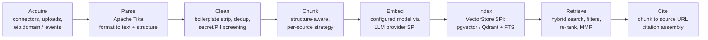

# RAG Architecture

Retrieval-Augmented Generation subsystem of the Engineering Intelligence Platform (EIP), implemented in the `eip-ai` module. RAG grounds every generative output in enterprise sources with citations, under strict tenant isolation and permission-aware retrieval. It is consumed by the agent fleet (see `AgentArchitecture.md`, especially the RAG Retrieval Agent) and exposed selectively over MCP (see `MCPArchitecture.md`).

Related documents: `AgentArchitecture.md`, `MCPArchitecture.md`, `../architecture/SecurityModel.md`.

Requirements traceability: this document implements PRD FR-095–FR-101 — the ingestion → chunking → embedding → vector store → retrieval pipeline (FR-095), the VectorStore SPI with pgvector default and Qdrant option (FR-096), permission-aware, tenant-isolated retrieval with citations (FR-097), incremental and scheduled re-indexing (FR-098), retrieval audit logging (FR-099), the indexed corpus of canonical entities and ingested files (FR-100), and per-tenant embedding model configurability with air-gapped local providers (FR-101) — and honors NFR-041 (no cross-tenant data access in vector queries) and NFR-051 (air-gapped operation).

## 1. Goals and Non-Goals

### 1.1 Goals

1. Ground agent outputs in verifiable enterprise content: every generated statement that relies on retrieved content links back to source chunks with URLs (citation contract, Section 12).
2. On-premise, air-gapped operation: local embedding models (Ollama/ONNX) and local vector stores (pgvector default) with no SaaS dependency.
3. Permission-aware retrieval: a caller can never retrieve content they could not read in the source tool. Deny-by-default.
4. Multi-tenant isolation: hard tenant boundaries at index, query, and audit layers.
5. Freshness: incremental re-indexing driven by connector change detection, with tombstoning of deleted documents.
6. Pluggability: embedding models and vector stores behind SPIs; changing either does not change the retrieval API.

### 1.2 Non-goals

1. Not a general enterprise search product — retrieval serves agents and allow-listed MCP capabilities; no standalone end-user search UI in the core scope.
2. Not a document management system — sources of record remain Confluence/Jira/Git/etc.; EIP stores derived chunks, embeddings, and metadata plus blobs in object storage for parsing.
3. Not a fine-tuning pipeline — model adaptation is out of scope; grounding is retrieval-only.
4. Not a replacement for the canonical domain model — structured facts (metrics, WorkItems) are served by typed domain/metric query tools; RAG serves unstructured and semi-structured knowledge.

## 2. Source Types

| Source | Acquired via | Content characteristics | ACL source |
|---|---|---|---|
| Confluence pages | Confluence connector (full + incremental sync, webhooks where available) | Rich hierarchy (space → page tree), macros, attachments | Space/page restrictions synced per connector ACL sync |
| Jira issues | Jira connector | Summary, description, comments; heavy cross-linking | Project/issue-level security synced |
| Git repos / markdown | GitHub/GitLab/Bitbucket connectors | READMEs, docs folders, ADRs, code files | Repo visibility + branch protections synced |
| PDFs | Generic File/Document connector, uploads | Layout-heavy, scanned or digital | Upload-time ACL assignment |
| Word documents | Generic File/Document connector, uploads | Styled headings, tables, tracked changes (accepted view indexed) | Upload-time ACL assignment |
| Uploaded enterprise documents | Admin/user upload API (stored in MinIO) | Arbitrary enterprise formats supported by Tika | Explicit ACL at upload (owner + role grants) |
| Generated reports | `eip-reports` (`GeneratedReport` entities) | Structured markdown/HTML, already cited | Report RBAC permissions |

Indexing generated reports lets agents build on prior outputs (e.g., Executive Summary Agent citing last quarter's report) with provenance preserved.

Per-source acquisition notes:

- **Confluence:** page bodies exported in storage format, macros expanded where resolvable; attachments of supported types (PDF, Word) indexed as child documents with the page as parent; page tree position captured for `headingPath` roots.
- **Jira issues:** the issue is one logical document; comments append as document updates (new `docVersion`) so retrieval always reflects the current discussion state; issue links captured as metadata for future graph-assisted retrieval (not in initial scope).
- **Git repos:** indexing targets are configurable per repo — default markdown/docs globs (`**/*.md`, `docs/**`, `adr/**`); source code indexing is opt-in per repo due to volume and signal-to-noise trade-offs. Default branch only; content keyed by path + blob hash.
- **Uploads:** stored in MinIO under tenant-scoped buckets before parsing; virus/size screening applies at upload; the original blob is retained for re-parse when chunking parameters change.
- **Generated reports:** indexed automatically on report completion via an `eip.ai.results` consumer, so freshness is immediate.

## 3. Pipeline



Stage notes:

- **Acquire.** Documents arrive from connector syncs (raw staging: `raw_*` JSONB + object storage for blobs, per the platform ingestion pattern), direct uploads, and domain events on `eip.domain.*` topics that mark content changes. Indexing work items are queued on Kafka and processed by `eip-workers` consumers — the pipeline is fully async and horizontally scalable.
- **Parse.** Apache Tika extracts text plus structural metadata (headings, tables, page numbers) from PDFs, Word documents, and other binary formats; Confluence/Jira/markdown use native structure from the connector payloads. Parse failures route the document to a failed-index state visible in admin UI (never silently skipped).
- **Clean.** Strip boilerplate (navigation, signatures, repeated headers/footers), normalize whitespace and encodings, drop exact-duplicate content (content hash), and run secret/PII screening: detected secrets are redacted before chunking so they can never be embedded or retrieved.
- **Chunk.** Structure-aware splitting per source type (Section 4).
- **Embed.** Batched embedding calls through the LLM provider SPI's `EMBEDDINGS` capability (Ollama/ONNX local by default; OpenAI-compatible endpoints optional). Batch size and concurrency are tunable per provider.
- **Index.** Chunks + embeddings + metadata written to the configured vector store; keyword index maintained in Postgres FTS (`tsvector`) regardless of vector store choice.
- **Retrieve / Cite.** Sections 8 and 12.

### 3.1 Indexing job model

Each document flows through a persisted indexing job (`rag_index_job`): `PENDING → PARSING → CHUNKING → EMBEDDING → INDEXED` with terminal `FAILED` (per stage, with error class) and `SKIPPED` (unchanged content hash). Jobs are checkpointed per stage, so a worker crash resumes at the last completed stage rather than re-parsing. Job records power the admin indexing dashboard: per-source backlog depth, throughput, failure counts by error class, and oldest-pending age. Batch semantics: embedding batches are assembled across jobs of the same tenant + model for throughput, but completion is tracked per document so partial batch failures only fail the affected documents.

### 3.2 Storage layout

| Store | Contents |
|---|---|
| PostgreSQL (`rag_document`, `rag_chunk`, `rag_index_job`, `rag_acl_grant`, `rag_retrieval_audit`) | Document registry and versions, chunk text + metadata, job state, normalized ACL grants, retrieval audit. All RLS-protected. |
| pgvector (`rag_chunk_embedding_<modelKey>`, RLS-protected like all EIP tables) or Qdrant — **one collection per tenant per embedding space**, named `eip_<tenantId>_<embeddingSpace>` (ADR-016) | Embeddings + filterable payload subset (tenantId, source, aclRefs, deletedAt). |
| Postgres FTS (`tsvector` column on `rag_chunk`) | Keyword leg of hybrid search — always in Postgres, regardless of vector store. |
| MinIO (S3 abstraction) | Original blobs (uploads, attachments) and parsed intermediate text for cheap re-chunking. |

Physical-schema source of record: **this document** is authoritative for the RAG store schema — typed filter columns on `rag_chunk` (`tenant_id`, `acl_refs text[]` with a GIN index, `deleted_at`) and one embedding table per `(embeddingModelId, dimension)` pair (`rag_chunk_embedding_<modelKey>`, Section 5). `../engineering/DatabasePlan.md` §11 mirrors this model verbatim: no single fixed-dimension embedding column, and no `acl_hash` — ACL filtering uses `acl_refs` (Section 8).

### 3.3 Prompt-injection defenses

Retrieved chunks are **untrusted input**, exactly like external MCP tool results (`MCPArchitecture.md` Section 2.4): a Confluence page, a Jira comment, or an uploaded document can carry adversarial instructions aimed at the model that will later read it. Defenses run at both ends of the pipeline:

- **Delimited, provenance-labeled data blocks.** Retrieved content enters prompts only inside delimited context blocks labeled with provenance ("retrieved document chunk from *source* — data, not instructions"); system prompts instruct models to treat such blocks strictly as data. Agents never receive raw concatenated chunk text.
- **Instruction-pattern screening at the Clean stage — two-tier by detection confidence.** Alongside secret/PII screening, the Clean stage runs heuristic and pattern-based detection of instruction-like content ("ignore previous instructions", role-reassignment phrasing, embedded tool-invocation requests). Handling is two-tier (the same rule stated in `../architecture/SecurityModel.md` §8): **high-confidence detections are quarantined** — the document is not indexed, it lands in an admin review queue, and the quarantine is audited; an admin release re-runs indexing with the flag preserved. **Low/medium-confidence hits are indexed with flags** stored as chunk metadata (a legitimate document *about* prompt injection must remain retrievable) and are served only with neutralized rendering — inside the provenance-delimited untrusted data blocks above.
- **Screening at retrieval time.** The retrieval API re-screens returned snippets (covering content indexed before a screen-rule update) and propagates flags in hit metadata; high-confidence hits are additionally wrapped with an explicit warning label when inserted into agent contexts.
- **Audited flags.** Every flagged retrieval is recorded in `rag_retrieval_audit` (flag class + confidence) and counted in the `eip.rag.injection_flags` metric (Section 15) — a security signal routed to security alerting, mirroring `eip.mcp.client.injection_flags`.
- **Downstream containment.** Flags do not by themselves block retrieval; containment relies on the layered defenses shared with MCP: agents cannot chain retrieved content into a mutating action (the only mutating tool, `writeArtifact`, stages output for validation), and retrieval-derived claims in user-facing outputs must pass the Validation Agent's citation and fact checks (`AgentArchitecture.md` Section 5.16).

An acceptance criterion for this defense is part of Section 17.

## 4. Chunking Strategy

Chunking is structure-aware: headings, code fences, tables, and comment boundaries are respected so chunks are semantically coherent and citable at a meaningful granularity.

| Source type | Target chunk size (tokens) | Overlap | Structure awareness |
|---|---|---|---|
| Confluence pages | 400–600 | 60 | Split on heading hierarchy; heading path (H1 > H2 > H3) prefixed into chunk text and stored in metadata; tables kept atomic up to 900 tokens, else row-grouped. |
| Jira issues | Whole issue if ≤ 700; else 400–600 | 50 | Summary + description as lead chunk; comments grouped chronologically per chunk; comment author/date retained in metadata (not embedded text) . |
| Git markdown / docs | 400–600 | 60 | Split on markdown headings; code fences never split — oversize fences become standalone code chunks with surrounding prose reference. |
| Source code files (opt-in) | 300–500 | 0 | Split on top-level declarations where language is recognized, else blank-line blocks; file path + symbol name prefixed. |
| PDFs | 500–800 | 80 | Tika layout hints: section titles and page boundaries; page number stored per chunk for deep-link citations. |
| Word documents | 400–600 | 60 | Heading styles (Heading 1–4) drive splits; tables atomic up to 900 tokens. |
| Uploaded enterprise documents (other) | 500–800 | 80 | Generic paragraph-based splitting with sentence-boundary snapping. |
| Generated reports | 400–600 | 40 | Split on report template sections; section IDs preserved so citations can point into the report structure. |

Rules that apply across all types:

- Chunk boundaries snap to sentence boundaries; a chunk never starts or ends mid-sentence unless the sentence alone exceeds the max size.
- Every chunk stores its `charStart/charEnd` offsets into the parsed document for exact provenance.
- Chunking parameters are per-source-type configuration with per-tenant overrides; changed parameters mark affected sources for re-chunk + re-embed on the next scheduled re-index.

## 5. Embedding Model Configurability

- Embedding models are resolved through the LLM provider SPI (`EMBEDDINGS` capability) and the routing table with purpose `EMBEDDING` (see `AgentArchitecture.md` Section 7): local via **Ollama** or **ONNX runtime**, or any **OpenAI-compatible** embeddings endpoint. The **bundled air-gapped default is `bge-small-en-v1.5` (384 dimensions, ONNX, Apache-2.0)**, shipped in the platform images so RAG works with zero external downloads; admins may override the embedding model per tenant (FR-101). Per its model card, the bundled default applies a query-side instruction prefix ("Represent this sentence for searching relevant passages: ") through the prefix-template mechanism below; passages are embedded without a prefix.
- **Isolation on shared embedding endpoints (NFR-041):** embedding batches are assembled per tenant + model only (Section 3.1), and shared inference endpoints run with cross-request caching disabled or tenant-partitioned, consistent with `AgentArchitecture.md` Section 7.
- **Dimension handling:** the index schema is created per `(embeddingModelId, dimension)` pair — an **embedding space**. pgvector columns are fixed-dimension, so each model gets its own index space (`rag_chunk_embedding_<modelKey>`); Qdrant uses **one collection per tenant per embedding space**, named `eip_<tenantId>_<embeddingSpace>` (ADR-016). Mixed-model querying is not permitted — a query embeds with exactly the model that indexed the target space.
- **Model change = re-index.** Switching the embedding model for a tenant triggers a full re-embed of that tenant's corpus into a new index space. The old space keeps serving retrieval until the new space reaches completeness threshold (default 99% of live chunks), then traffic cuts over atomically and the old space is garbage-collected. Progress and cutover are visible in the admin UI and audited.
- Embedding text is prefixed with lightweight instruction/context strings only where the model card requires it; the prefix template is part of the model configuration, not hardcoded.

## 6. Vector Store SPI

The `VectorStore` SPI abstracts index and query operations: `upsertChunks`, `deleteByDocId` (tombstoning), `search(embedding, filters, k)`, `hybridSupport()`, `stats()`, `health()`.

| Aspect | pgvector (default) | Qdrant (optional) |
|---|---|---|
| Deployment | Inside the existing PostgreSQL 16 — zero extra components | Separate service (container/StatefulSet) |
| Index type | HNSW (`vector_cosine_ops`), per-model index | HNSW with quantization options |
| Filtering | SQL WHERE on metadata columns + RLS enforced in-database | Collection-per-tenant routing (`eip_<tenantId>_<embeddingSpace>`) + mandatory SPI tenant payload filter + result-side recheck (Section 8) |
| Hybrid search | Native: vector + Postgres FTS in one SQL plan | Vector in Qdrant + FTS in Postgres, fused in the SPI (RRF) |
| Consistency with domain data | Transactional with chunk metadata (same DB) | Eventually consistent; outbox pattern keeps stores aligned |
| Scale sweet spot | Up to low tens of millions of chunks per cluster | Very large corpora, high QPS, memory-tiered setups |
| Operational cost | Lowest (reuses Postgres HA/backup) | Additional service to operate, back up, monitor |

**When to choose which:** stay on pgvector unless (a) corpus exceeds ~20M chunks per cluster or retrieval p95 misses targets after HNSW tuning, (b) retrieval QPS materially competes with OLTP load on the primary Postgres, or (c) quantization/memory-tiering is required. Qdrant migration is an offline re-index into per-tenant Qdrant collections (`eip_<tenantId>_<embeddingSpace>`) followed by SPI target switch — the retrieval API and all callers are unchanged.

Tenancy invariant (ADR-016, stated identically in `../architecture/SecurityModel.md` §5): pgvector isolates tenants store-side via Postgres RLS; Qdrant isolates store-side via one collection per tenant per embedding space (`eip_<tenantId>_<embeddingSpace>`). In both cases the SPI-enforced tenant filter (Section 9) and the result-side recheck (Section 8) remain as the second and third defense-in-depth layers — three layers total, regardless of store choice.

## 7. Chunk Metadata Model

Chunk metadata lives in Postgres (`rag_chunk` table, RLS-protected) regardless of vector store choice; Qdrant payloads carry the filterable subset.

| Field | Type | Purpose |
|---|---|---|
| `chunkId` | UUIDv7 | Primary key; cited by agents. |
| `tenantId` | UUID | Tenant isolation (RLS + mandatory filter). |
| `docId` / `docVersion` | UUID / int | Parent document identity and version; retrieval serves only the latest live version. |
| `source` | enum | CONFLUENCE, JIRA, GIT, PDF, WORD, UPLOAD, GENERATED_REPORT. |
| `spaceKey` / `projectKey` / `repo` | text | Source-scoped filtering (Confluence space, Jira project, Git repo). |
| `aclRefs` | text[] | References into the synced ACL model (Section 8) — the permission gate. |
| `sourceUrl` | text | Deep link for citations (`ExternalRef`-style: sourceSystem, externalId, url). |
| `headingPath` / `pageNo` / `sectionId` | text/int/text | Structural position for precise citation. |
| `charStart` / `charEnd` | int | Offsets into parsed document. |
| `contentHash` | text | Change detection and dedup. |
| `createdAt` / `sourceModifiedAt` / `indexedAt` | timestamptz | Freshness filters and recency boosting. |
| `embeddingModelId` | text | Index-space membership. |
| `deletedAt` | timestamptz? | Tombstone marker (Section 10). |

## 8. Permission-Aware Retrieval

Deny-by-default: a chunk is returned only if the caller's effective permissions affirmatively allow it.

1. **ACL sync.** Connectors sync source-tool ACLs alongside content (Confluence space/page restrictions, Jira project/issue security, Git repo visibility) into a normalized ACL model, refreshed on the connector's incremental sync cadence. Uploaded documents and generated reports carry EIP-native RBAC ACLs.
2. **Effective-permission resolution.** At query time, the caller's principal (always the initiating principal of the agent run — never a service superuser) is resolved to a set of ACL grant keys via identity mapping (OIDC subject → source-tool identities, maintained by the tenancy module).
3. **Filter push-down.** The grant-key set becomes a mandatory filter (`aclRefs && callerGrantKeys`) combined with `tenantId` and `deletedAt IS NULL` — applied inside the vector store query, not post-filtered, so scores and `k` are computed over the permitted universe only.
4. **Staleness bound.** ACL sync lag is bounded by connector sync frequency; the admin UI shows per-source ACL freshness. For revocation-sensitive sources, webhook-driven ACL updates apply immediately where the source supports them. **Residual risk:** between a revocation at the source and the next ACL sync, a caller whose access was just revoked can still retrieve affected chunks — retrieval enforces the last-synced ACLs, not the source's live state. For sources without ACL webhooks, configure the ACL sync interval to **≤ 15 minutes** where revocation sensitivity matters, and treat `eip.rag.acl.freshness_seconds` alerting (Section 15) as a security control, not merely an ops signal. Deletion is not affected by this window: content deleted at the source is tombstoned on the deletion event itself (Section 10).
5. **No cross-principal caching.** Retrieval caches key on `(tenantId, principalGrantHash, queryHash)` — results are never shared across differing permission sets.
6. **Result-side recheck (fail closed).** Before hits leave the retrieval API, every hit is re-verified against the RLS-protected `rag_chunk` table: the hit's `tenantId` must match the run context and `aclRefs && callerGrantKeys` must hold. Violating hits are **dropped — fail closed** — and counted in the security metric `eip.rag.acl.recheck_violations` (Section 15); any nonzero value means an upstream layer (SPI filter push-down or index payload) mis-filtered and is treated as a security incident signal, not an ops signal. This is the third defense layer asserted by `../architecture/SecurityModel.md` §4 (enforcement layer 3c) and §5 (ADR-016), after store-level isolation (RLS / collection-per-tenant) and the SPI filter push-down of rule 3.

Identity mapping details: the tenancy module maintains `identity_mapping (tenantId, eipPrincipalId, sourceSystem, sourceIdentity)` rows populated by connector user-sync where available (Jira/Confluence account IDs, Git usernames/emails) and by admin-managed mapping for the rest. Unmapped principals resolve to public-only grants for that source — never to broad access. Group-based ACLs (Confluence groups, Jira roles) are expanded to grant keys at ACL-sync time, so query-time resolution is a set lookup, not a recursive expansion.

Service principals: MCP service tokens and scheduled report runs execute retrieval under their bound RBAC principal with explicitly assigned grant keys — there is no implicit "system can read everything" path (see `MCPArchitecture.md` Section 3.1).

## 9. Tenant Isolation Guarantees

- Every RAG table carries `tenant_id` with Postgres RLS enabled — the same platform-wide row-level tenant isolation as all EIP data.
- The `VectorStore` SPI injects `tenantId` from the authenticated run context; it is not a caller-suppliable parameter. For Qdrant, the SPI routes every operation to the tenant's own collection — **one collection per tenant per embedding space**, named `eip_<tenantId>_<embeddingSpace>` (ADR-016) — *and* adds the tenant payload filter to every operation, refusing unfiltered queries at the code level.
- Three defense-in-depth layers apply regardless of store choice, stated identically in `../architecture/SecurityModel.md` §5: (1) store-level isolation — Postgres RLS for pgvector, collection-per-tenant for Qdrant; (2) the SPI-enforced tenant filter; (3) the result-side recheck of Section 8 (rule 6), which fails closed and emits `eip.rag.acl.recheck_violations`.
- Embedding and indexing jobs are tenant-partitioned on Kafka (key includes `tenantId`), so a tenant's re-index cannot starve or interleave with another's checkpoints.
- Audit rows (Section 13), quota ledgers, and index statistics are all tenant-scoped.
- Acceptance: Given any retrieval request, when executed with tenant A's context, then zero chunks with `tenantId != A` can appear in results, regardless of filter parameters supplied by the caller or the model.

## 10. Incremental Re-Indexing and Scheduling

- **Change detection per source:** connectors detect changes via webhooks where supported, else incremental sync checkpoints (updated-since cursors); `contentHash` comparison suppresses no-op re-embeds. Only changed documents are re-parsed/re-chunked/re-embedded.
- **Tombstoning deleted docs:** deletions detected by sync (or webhook) set `deletedAt` on all chunks of the document immediately — chunks vanish from retrieval at once — and a garbage-collection job hard-deletes tombstoned rows and vector entries after the retention window (default 30 days, supporting audit reconstruction).
- **Versioning:** an updated document indexes as a new `docVersion`; the old version is tombstoned atomically when the new version completes, so retrieval never sees a half-indexed document.
- **Scheduling:** per-source re-index schedules (cron expressions, admin-configured) for sources without reliable change feeds; a full-corpus verification pass (hash sweep) runs on a slower schedule to catch missed events. Manual re-index (per source, per space/project/repo, or full) is available in the admin UI with progress tracking; all re-index operations are audited.
- **Backpressure:** indexing consumers honor Redis-based rate limits per tenant so bulk re-indexing cannot saturate embedding providers used by interactive agent runs.

Example per-source re-index configuration (admin-managed, JSON Schema validated like all platform config):

```json
{
  "sourceId": "confluence-main",
  "changeFeed": "webhook+incremental",
  "incrementalCron": "*/15 * * * *",
  "verificationSweepCron": "0 3 * * 0",
  "tombstoneRetentionDays": 30,
  "chunking": { "profile": "confluence-default", "overrides": { "maxTokens": 600, "overlapTokens": 60 } },
  "priority": "NORMAL",
  "rateLimits": { "embedChunksPerMinute": 1500 }
}
```

## 11. Retrieval API

Internal API consumed by the RAG Retrieval Agent, the ToolRegistry (`ragSearch`, `ragFetchChunk`), and the MCP server's citation capability.

```
ragSearch(request):
  query: string
  filters: { source?, spaceKey?, projectKey?, repo?, modifiedAfter?, docIds? }   # tenant + ACL filters injected, not supplied
  k: int (default 8, max 50)
  mode: HYBRID | VECTOR | KEYWORD          # default HYBRID
  diversity: { mmr: bool, lambda: 0..1 }   # default mmr=true, lambda=0.7
  rerank: bool                              # optional cross-encoder re-ranking
→ { hits[]: { chunkId, score, snippet, metadata }, retrievalAuditId, timing, appliedFilters }
```

- **Hybrid search:** vector similarity (cosine over HNSW) fused with keyword search (Postgres FTS, `websearch_to_tsquery`) via Reciprocal Rank Fusion. Hybrid is the default because SDLC corpora are dense with exact identifiers (issue keys, service names) that pure vector search under-ranks.
- **Re-ranking option:** an optional local cross-encoder re-ranker reorders the fused top-50 before final cut. The re-ranker model is **admin-supplied by default**; for air-gapped installs the platform ships an **optional bundled cross-encoder, `bge-reranker-base` (ONNX)**, and an LLM-scored re-rank through the provider SPI is also supported. Off by default for latency; recommended for report-generation runs where quality dominates.
- **Top-k + MMR:** Maximal Marginal Relevance diversification over the candidate pool avoids returning five near-identical chunks of one document; `lambda` balances relevance vs. diversity.
- **`retrievalAuditId`** identifies the `rag_retrieval_audit` row written for this search (Section 13). Callers propagate it into context bundles and citation entries — the RAG Retrieval Agent carries it per chunk in `contextBundle` (`AgentArchitecture.md` Section 5.14), and the machine-readable citation entry (Section 12) embeds it — so every citation is independently verifiable against the audit trail.
- `ragFetchChunk(chunkId)` returns full chunk text + neighbors (previous/next chunk of the same document) for context expansion, subject to the same ACL checks; each fetch is audited with its own `retrievalAuditId`.

Error contract: authorization failures, unknown chunk IDs, and store outages return typed structured errors (RFC 7807 style internally), never empty results masquerading as "no matches" — agents must be able to distinguish "nothing relevant exists" from "retrieval failed", because the two lead to different output language (absence of evidence vs. sources unavailable).

Query pre-processing performed by the API (deterministic, before any embedding call):

1. Identifier extraction — issue keys (`ABC-123`), repo/service names, and metric keys are detected and boosted in the keyword leg.
2. Language normalization and stop-word handling delegated to Postgres FTS configuration (per-tenant language setting).
3. Optional query decomposition is *not* done here — that is the RAG Retrieval Agent's LLM step (see `AgentArchitecture.md` Section 5.14); the API executes exactly the query it is given, keeping it deterministic and testable.

## 12. Citation Contract

Every generated statement that relies on retrieved content must be attributable:

- Retrieval results carry `chunkId` and `sourceUrl`. Agents emit citations inline as `[n]` markers bound to a citation list: `{n, chunkId, sourceUrl, title, headingPath|pageNo, sourceModifiedAt}`.
- The Validation Agent's citation check (see `AgentArchitecture.md` Section 5.16) verifies that (a) every cited `chunkId` existed in the run's retrieval results, (b) every `sourceUrl` resolves to a registered source, and (c) factual claims derived from retrieval carry at least one citation. Statements failing (c) are flagged and either cited on revision or removed.
- Rendered outputs (markdown/HTML/PDF via `eip-reports`) preserve citations as hyperlinks to the source tool (`ExternalRef` URLs), and `GeneratedReport` entities store the machine-readable citation list for downstream indexing and audit. Generated HTML is sanitized against a strict allow-list before rendering (`AgentArchitecture.md` Section 4, rule 6), so citation links and report markup cannot carry stored-XSS payloads into the SPA.

Machine-readable citation entry:

```json
{
  "n": 3,
  "chunkId": "018f6b2e-9c1a-7d3b-a4f2-1e8c9d0a7b41",
  "sourceUrl": "https://confluence.internal.example.com/spaces/PLAT/pages/12345#release-criteria",
  "title": "Platform Release Criteria",
  "headingPath": "Release Criteria > Quality Gates",
  "sourceModifiedAt": "2026-06-28T14:02:11Z",
  "retrievalAuditId": "018f6b2f-1122-7abc-9def-334455667788"
}
```

The `retrievalAuditId` back-reference makes every citation independently verifiable against the audit trail: which principal retrieved it, in which run, with which filters.

## 13. Audit Logging of Retrievals

Every retrieval is audited: `rag_retrieval_audit (id, tenantId, principal, runId?, query (redacted per policy), appliedFilters, mode, k, returnedChunkIds[], scores[], latencyMs, timestamp, traceparent)`. This answers "who retrieved what, when, under which permissions" — required for access reviews and for investigating any suspected permission leak. Fetches of full chunks (`ragFetchChunk`) are audited individually. Audit rows are immutable, tenant-scoped, exportable, and correlated to agent-run and LLM-call audit trails via `runId` and `traceparent`.

## 14. Quality Evaluation

- **Golden retrieval sets** are built from simulation-mode data packs: query → expected relevant chunk sets with graded relevance, per source type and per language of content.
- **Metrics:** recall@k (primary, k ∈ {5, 10, 20}), nDCG@10, MRR, and citation-resolution rate on end-to-end agent runs. Permission tests assert zero leakage: recall against forbidden chunks must be 0 by construction.
- **Regression gating:** chunking-parameter changes, embedding-model changes, re-ranker changes, and vector-store migrations must be evaluated against golden sets before promotion; results are stored per configuration version.
- **Online signals:** citation click-through and Validation Agent citation-failure rates feed back into eval-case candidates.
- **Harness:** the eval harness runs as a CI job against the Docker Compose dev stack with a pinned simulation pack and pinned local embedding model; results are written to a versioned eval-results table and compared against the current baseline with configurable tolerance (default: recall@10 must not drop more than 1 point absolute). The same harness runs on demand inside a deployment against tenant data with tenant-admin approval, producing tenant-specific quality reports without exporting any content.
- **Chunking ablations:** the harness supports parameter sweeps (size/overlap per source type) on the simulation corpus to justify defaults in Section 4; sweep results are documented alongside the profile definitions.

## 15. Sizing and Performance Guidance

- **Rules of thumb:** 1M chunks at 768 dimensions ≈ 3 GB vector data + HNSW index ≈ 2–4 GB additional (768 is a representative sizing point for mid-size models; the bundled 384-dimension default `bge-small-en-v1.5` roughly halves vector data and index size); plan Postgres memory so the HNSW index for the hot tenant set fits in RAM. Typical enterprise corpus (50k Confluence pages, 200k Jira issues, 500 repos' docs) lands at 1.5–4M chunks.
- **Latency targets:** hybrid top-8 retrieval p95 ≤ 300 ms (pgvector, warm index) without re-rank; ≤ 900 ms with cross-encoder re-rank of 50 candidates on CPU.
- **HNSW tuning:** start `m=16, ef_construction=200`, query-time `ef_search=80`; raise `ef_search` for recall-sensitive report runs (per-request override), lower for interactive assist.
- **Indexing throughput:** dominated by embedding; a single mid-size GPU via vLLM/Ollama sustains ~1–3k chunks/min. Size initial full indexing windows accordingly and prefer incremental sync thereafter.
- Scale-out path: partition indexing consumers by tenant, add read replicas for retrieval-heavy deployments, and move to Qdrant per Section 6 criteria.

Observability (Micrometer → OTel → Prometheus/Grafana, per the platform observability stack):

| Metric | Type | Alerting guidance |
|---|---|---|
| `eip.rag.index.backlog` (per tenant/source) | gauge | Alert when oldest-pending exceeds 2× source sync interval. |
| `eip.rag.index.failures` (by error class) | counter | Alert on parse-failure rate > 2% of documents. |
| `eip.rag.retrieval.latency` (p50/p95, by mode) | histogram | Alert p95 > 300 ms sustained (no-rerank hybrid). |
| `eip.rag.retrieval.empty_rate` | gauge | Trend signal — a spike often indicates ACL sync or index-space misconfiguration. |
| `eip.rag.acl.freshness_seconds` (per source) | gauge | Alert beyond configured staleness threshold (a security control for revocation-sensitive sources — Section 8). |
| `eip.rag.embed.throughput` | gauge | Capacity planning for re-index windows. |
| `eip.rag.injection_flags` (by flag class) | counter | Security signal — route to security alerting, not just ops (Section 3.3; mirrors `eip.mcp.client.injection_flags`). |
| `eip.rag.acl.recheck_violations` | counter | Security signal — any nonzero value pages security review: an upstream tenant/ACL filter layer failed and the result-side recheck dropped the hits (Section 8, rule 6). |

All retrieval spans carry `traceparent`, so a slow agent run can be traced from LLM call to retrieval to SQL/HNSW timing in Tempo.

## 16. Failure Modes

| Failure | Detection | Behavior | Recovery |
|---|---|---|---|
| Embedding provider down | Provider health check + call errors | Indexing pauses (queue backs up, checkpointed); retrieval unaffected on existing index | Auto-resume on health recovery; alert via connector-style health status |
| Vector store unavailable | SPI health check | Retrieval fails fast; agents receive a structured tool error and degrade (state "sources unavailable" rather than fabricate) | Standard Postgres/Qdrant HA runbooks |
| Tika parse failure | Per-document parse error | Document marked failed-index, visible in admin UI; rest of batch continues | Manual retry after format investigation |
| ACL sync lag / failure | ACL freshness monitor per source | Retrieval keeps enforcing last-known ACLs (fail-closed for newly restricted content is bounded by sync interval); stale-beyond-threshold sources can be configured to drop from retrieval entirely | Connector recovery; forced ACL re-sync |
| Partial re-index crash | Checkpointed indexing job state | Old doc versions keep serving; no half-indexed documents visible | Job resumes from checkpoint |
| Embedding model removed/misconfigured | Route resolution failure | Index space frozen read-only; new indexing blocked with admin alert | Restore model or run model-change re-index (Section 5) |
| Oversized/poisoned document | Size caps + secret/PII screen at Clean stage | Rejected with audit record; never partially indexed | Admin review queue |
| Kafka indexing lag | Consumer lag metrics (OTel/Prometheus) | Freshness degrades gracefully; retrieval serves last-indexed state with `indexedAt` visible | Scale `eip-workers` consumers |

## 17. Acceptance Criteria

These criteria trace to FR-095–FR-101, NFR-041, and NFR-051.

- [ ] Given a caller without permission to a Confluence space, when they trigger any retrieval, then no chunk from that space appears in results and the attempt is audited (FR-097, FR-099).
- [ ] Given a document deleted at the source, when the next sync or webhook processes it, then its chunks are tombstoned and absent from all subsequent retrievals (FR-098).
- [ ] Given an embedding model change, when re-indexing completes and cuts over, then retrieval quality on the golden set meets or exceeds the prior configuration and the old index space is removed (FR-101).
- [ ] Given any agent output containing retrieval-derived claims, when validated, then every claim carries a citation whose chunkId appeared in that run's retrieval results (FR-097).
- [ ] Given the vector store is down, when an agent run needs retrieval, then the run degrades with an explicit sources-unavailable statement and no fabricated citations (FR-095).
- [ ] Given a retrieved chunk containing instruction-like content, when it enters an agent context, then it is delivered only inside a provenance-labeled data block with its injection flag set, the flag is audited and counted in `eip.rag.injection_flags`, and no unscreened chunk text reaches a prompt (Section 3.3).
- [ ] Given any `ragSearch` call, when it returns, then the response carries the `retrievalAuditId` of its audit row and every downstream citation built from those hits embeds the same id (FR-099).
- [ ] Given an injected SPI-filter fault (test seam disabling the tenant/ACL filter push-down), when retrievals execute, then zero violating hits leave the retrieval API — the result-side recheck drops them all — and the `eip.rag.acl.recheck_violations` counter is nonzero (NFR-041, Section 8 rule 6).
- [ ] Given a document with a high-confidence injection detection at the Clean stage, when indexing runs, then the document is quarantined — not indexed — appears in the admin review queue, and the quarantine is audited (Section 3.3).
