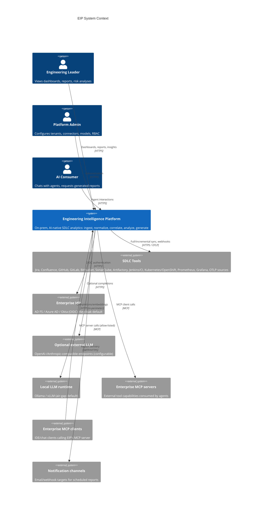
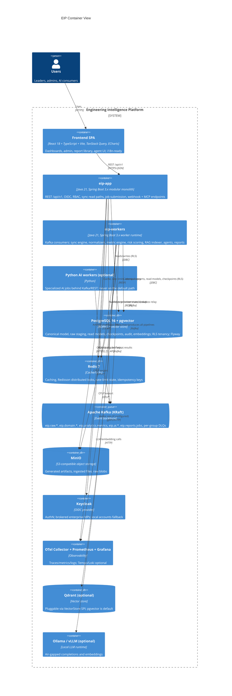

# Architecture Overview

This document defines the system-level architecture of the **Engineering Intelligence Platform (EIP)**: the architectural drivers derived from non-functional requirements, the chosen architectural style and its rationale, C4 context and container views, the backend module map with dependency rules, cross-cutting concerns, key architecture decisions (ADR summary), the scalability model, and failure/degradation behavior.

Related documents: component-level design in [ComponentModel.md](./ComponentModel.md), end-to-end flows in [DataFlow.md](./DataFlow.md), canonical entities in [DomainModel.md](./DomainModel.md), event contracts in [../engineering/EventModel.md](../engineering/EventModel.md), and connector SPI details in [../engineering/ConnectorFramework.md](../engineering/ConnectorFramework.md).

## 1. Architectural Drivers

EIP is an on-premise, AI-native platform that integrates with enterprise SDLC tools to collect, normalize, correlate, and analyze engineering data. The architecture is shaped by the following drivers, in priority order:

| # | Driver | Source NFR | Architectural consequence |
|---|--------|-----------|---------------------------|
| D1 | **On-premise first, no SaaS dependencies** | NFR-050, NFR-051 | Every runtime dependency (PostgreSQL 16, Redis 7, Kafka KRaft, MinIO, Keycloak, OTel Collector/Prometheus/Grafana) must be self-hostable via Docker Compose and Kubernetes/OpenShift. No cloud-managed services assumed. |
| D2 | **Air-gapped operation with local LLMs** | NFR-051, NFR-013 | LLM access goes through a provider SPI (Ollama, vLLM OpenAI-compatible, OpenAI-compatible generic, Anthropic-compatible, custom enterprise endpoint). All AI features must function with Ollama/vLLM on the local network; external providers are optional and configurable per tenant. No telemetry leaves the perimeter. |
| D3 | **Scale targets** | NFR-001–NFR-004 | Target envelope: up to 50 tenants per installation, 5,000 active engineers, 500 connected tool instances, 2,000 sync jobs/hour, sustained ingest ≥ 100,000 raw events/hour (≈ 2.4M events/day) with a 3× burst (300,000/hour) for 15 minutes (NFR-003). NFR-003 is the single binding capacity number every topology is sized and load-tested against; the internal design headroom (~10×, ≈ 300 events/s) is a design point for domain-event fan-out, replay, and topic/consumer sizing — not a load-tested ingest rating. 100M canonical work-item/SCM/CI records, 10M RAG chunks. Ingestion and analytics must scale horizontally without scaling the API tier. |
| D4 | **Multi-tenancy with hard isolation** | NFR-004, NFR-041 | Row-level tenant isolation: every tenant-scoped table carries `tenant_id` and is protected by Postgres RLS. Kafka event keys include `tenantId`; caches, vector search, RAG retrieval, and object-storage prefixes are tenant-partitioned. Cross-tenant reads are structurally impossible, not merely filtered. |
| D5 | **Partial-failure tolerance** | NFR-020–NFR-022, NFR-030 | A failing connector, a saturated LLM endpoint, or a Kafka consumer lag must never take down dashboards or the API. Async boundaries (Kafka), circuit breakers, DLQs, and read models decouple failure domains. Degradation is graceful and explicit (see §9). |
| D6 | **Operability by small platform teams** | NFR-050, NFR-052 | Enterprise customers run EIP with 1–2 platform engineers. Deployment unit count must stay small (two backend deployables + infra), upgrades must be single-version Flyway migrations, and self-observability dashboards ship in `/infra/grafana`. |
| D7 | **Auditability and non-toxic analytics** | NFR-042, NFR-071 | Every mutating action, secret access, and LLM call is audited. Metrics are team-level with stated caveats, uncertainty, and gaming risks; the platform is explicitly not an individual-surveillance or stack-ranking tool. |
| D8 | **Evolvability toward services** | NFR-060, NFR-061 | Module boundaries follow Spring Modulith conventions so that high-churn or high-scale modules (`eip-ingestion`, `eip-ai`) can be extracted to standalone services later without rewriting contracts. |

## 2. Architectural Style Decision

**Decision: modular monolith (Spring Modulith conventions) with a separately deployable worker runtime.**

The backend is a single Gradle multi-module Spring Boot 3.x codebase (Java 21) producing two deployables:

- **`eip-app`** — the composition root and main API application. Serves REST `/api/v1` (OpenAPI 3 via springdoc), authenticates via OIDC, executes synchronous read paths (dashboards, admin, configuration), and publishes commands/jobs to Kafka.
- **`eip-workers`** — the deployable async worker runtime. Hosts Kafka consumers: connector sync executors, normalizers, the metric engine consumers, risk scoring, RAG indexing, agent execution, and report generation. Scales horizontally and independently of the API.

Both deployables link the same domain modules (`eip-core`, `eip-tenancy`, `eip-connectors`, `eip-ingestion`, `eip-analytics`, `eip-ai`, `eip-reports`); Spring profiles select which components activate in which runtime.

### 2.1 Rationale vs. microservices

| Concern | Modular monolith + workers | Microservices |
|---------|---------------------------|---------------|
| On-prem operability (D6) | 2 backend images, 1 DB, 1 broker. A 1–2 person platform team can run it. | 10+ services, per-service DBs/config/versioning — operationally unaffordable for typical on-prem customers. |
| Air-gap installs (D2) | One artifact bundle, one Flyway migration chain. | Coordinated multi-service upgrade choreography in disconnected environments. |
| Transactional consistency | Canonical upserts + outbox writes in one ACID transaction. | Distributed sagas for the core ingestion path — accidental complexity. |
| Independent scaling (D3) | Achieved where it matters: `eip-workers` scales horizontally; Kafka partitions parallelize per tenant/entity. | Fully independent scaling — more than required by the scale targets. |
| Failure isolation (D5) | Achieved at the async boundary: worker crash-loops never affect `eip-app`; consumer groups isolate pipelines. | Stronger isolation, at high operational cost. |
| Team topology | Single product team; module ownership via package boundaries enforced by Spring Modulith verification tests. | Multiple autonomous teams — not the current organization. |

### 2.2 Extraction path

Module boundaries are service-ready by construction:

1. Modules communicate through Java interfaces (in-process) and Kafka events (cross-runtime); no module reaches into another's tables.
2. Each module owns its schema (separate Flyway history per logical schema area) and its Kafka topics (see [../engineering/EventModel.md](../engineering/EventModel.md)).
3. To extract a module (e.g., `eip-ai` under heavy GPU-adjacent load): package it as its own Spring Boot app, replace in-process interface calls with the already-defined REST/Kafka contracts, and split its schema into a dedicated database. The event envelope (`eventId`, `tenantId`, `schemaVersion`, `traceparent`, …) already supports cross-process tracing and versioning.
4. Python AI workers are the first proof of this seam: optional Python workers consume `eip.ai.jobs` and produce `eip.ai.results` behind Kafka/REST, isolated from the Java runtime. Default AI orchestration remains Java + LangChain4j.

## 3. C4 Level 1 — System Context

## 4. C4 Level 2 — Containers

## 5. Module Map and Dependency Rules

Backend Gradle modules (see [ComponentModel.md](./ComponentModel.md) for C4 level 3):

| Module | Purpose | May depend on |
|--------|---------|---------------|
| `eip-app` | Composition root / main API app: REST controllers, security config, OpenAPI, webhook and MCP server endpoints, outbox relay | all modules (composition root only) |
| `eip-core` | Domain model (canonical entities incl. `WorkItem` supertype and `ExternalRef`), shared kernel: event envelope, IDs (UUIDv7), Result types, VectorStore SPI, KMS SPI | — (no module dependencies) |
| `eip-tenancy` | Organizations, tenants, RBAC (roles + fine-grained permissions), audit trail, secret vault | `eip-core` |
| `eip-connectors` | Connector SPI + built-in connectors (Jira, Confluence, GitHub, GitLab, Bitbucket, SonarQube, Artifactory, Kubernetes, OpenShift, Docker Registry, Prometheus, Grafana, OTLP intake, Generic CI/CD, Generic REST, Generic SQL, Generic File/Document, custom internal demand/project tool) | `eip-core`, `eip-tenancy` |
| `eip-ingestion` | Queue consumers, sync engine, checkpointing, raw staging, normalization pipeline, domain event publication | `eip-core`, `eip-tenancy`, `eip-connectors` |
| `eip-analytics` | Metric engines (flow, DORA, quality, ops, team health), risk scoring, projector-maintained read models (ADR-015) | `eip-core`, `eip-tenancy`, `eip-ingestion` (`CanonicalEnrichmentService` api — ADR-019); events-only: `eip-ingestion` (`eip.domain.*` topics); plus the rule-4 read-only canonical SQL grant |
| `eip-ai` | Agent orchestration (LangChain4j), LLM provider SPI, RAG pipeline, MCP client/server | `eip-core`, `eip-tenancy`, `eip-analytics` (read-model queries via `MetricQueryService` interface), `eip-ingestion` (`CanonicalEnrichmentService` for agent-raised `Risk` rows — ADR-019); events-only: `eip-ingestion` (`eip.domain.*`), `eip-analytics` (`eip.analytics.metrics`); produces: `eip.reports.jobs` (Report Composition enqueues renders) |
| `eip-reports` | Report/template engine, exports, artifact library, scheduling | `eip-core`, `eip-tenancy`, `eip-analytics` (`MetricQueryService`), `eip-ai` (`AgentOrchestrator`); events-only: `eip-ai` (`eip.ai.results`) |
| `eip-workers` | Deployable async worker runtime; wires consumers from ingestion/analytics/ai/reports | all modules (composition root only) |

"Events-only" edges are Kafka topic consumption with no compile-time dependency; the full `api`/`evt` matrix is [ComponentModel.md](./ComponentModel.md) §10, with which this column is aligned.

**Dependency rules** (compile-time module dependencies are enforced by Spring Modulith verification tests; topic-consumption rules are enforced by ArchUnit/convention tests — Spring Modulith verifies compile-time package dependencies only):

1. `eip-core` depends on nothing; everything may depend on `eip-core`.
2. Excluding `eip-core` (which everything may use), no module other than the two composition roots (`eip-app`, `eip-workers`) depends on more than three modules.
3. No module accesses another module's tables or repositories; cross-module interaction is via exported Java interfaces (the module's `api` package) or Kafka events. `eip-ingestion` is the single canonical writer (ADR-019): derived canonical fields (`work_item.blocked`, `deployment.caused_incident`, `release.readiness_score`) and agent-raised `Risk` rows are written by `eip-analytics` and `eip-ai` exclusively through `eip-ingestion`'s exported `CanonicalEnrichmentService`. Conflict rule: enrichment writes touch only enrichment-owned columns/rows, never normalizer-owned fields; normalizer upserts never clear enrichment columns. At module extraction the service call becomes an API call. The only read-side exception is rule 4's analytics read-only grant.
4. `eip-analytics` never calls `eip-connectors`. It consumes `eip.domain.*` topics and holds READ-ONLY SQL access to the canonical schemas (`work`, `scm`, `cicd`, `quality`, `ops`) via a dedicated read-only DB grant — for full recomputation and rollups only; reads of `staging.raw_*` and any canonical writes under that grant are forbidden (derived-field writes go through `CanonicalEnrichmentService`, rule 3). At module extraction this read path becomes a canonical read replica or an API. This rule is stated identically in [ComponentModel.md](./ComponentModel.md) §5, [../engineering/BackendPlan.md](../engineering/BackendPlan.md) §5, and [../engineering/EventModel.md](../engineering/EventModel.md) §11.
5. `eip-ai` reads analytics only through the exported `MetricQueryService` interface; it never joins analytics tables.
6. Cyclic dependencies are build failures.

## 6. Cross-Cutting Concerns

### 6.1 Tenancy
- Every tenant-scoped table has `tenant_id`; Postgres RLS policies bind to a transaction-scoped `app.tenant_id` setting (`SET LOCAL app.tenant_id`, never session/connection-scoped) established by a tenancy filter (API) or the event envelope's `tenantId` (workers). Because `SET LOCAL` is transaction-scoped, any connection pooler in front of PostgreSQL (e.g. PgBouncer) must run in transaction pooling mode.
- Kafka messages are keyed per [EventModel §7](../engineering/EventModel.md): `tenantId:entityId` on domain topics (`tenantId:externalId` on raw, `tenantId:jobId` on job topics, `tenantId:metricKey` on metrics), giving per-tenant/entity ordering and enabling tenant-aware partition assignment.
- Redis keys, MinIO object keys (shared buckets `eip-ingest`/`eip-artifacts` with a mandatory `<tenantId>/...` key prefix — ADR-018), vector-store collections/filters, and LLM budgets are all tenant-prefixed. RAG retrieval is permission-aware and tenant-isolated.

### 6.2 Security
- AuthN: OIDC via Keycloak (default), pluggable enterprise IdP (AD FS/Azure AD/Okta), local accounts fallback. AuthZ: RBAC with roles + fine-grained permissions, tenant-scoped.
- Secrets: AES-256-GCM envelope encryption; master key from env/file/Vault via pluggable KMS SPI. Secrets never stored or logged in plaintext, masked in UI, access audited, rotation supported.
- MCP server capabilities are allow-listed with per-capability RBAC and audit. All inbound webhooks are signature-verified where the source supports it.

### 6.3 Audit
- `AuditTrail` (in `eip-tenancy`) records every mutating API call, RBAC change, secret access, connector config change, and every LLM call (prompt, model, tokens, cost, latency; prompts redacted per policy). Audit records are append-only and queryable per tenant. See flow (h) in [DataFlow.md](./DataFlow.md).

### 6.4 Resilience
- **Retries:** exponential backoff + jitter on all outbound connector and LLM calls; bounded consumer retries before DLQ.
- **Circuit breakers:** per connector instance and per LLM provider endpoint (Resilience4j); open circuits mark the connector/provider degraded rather than failing requests platform-wide.
- **Rate limiting:** token-bucket per connector instance (respecting source-tool limits) and per tenant on the API; state in Redis.
- **Idempotency:** at-least-once delivery everywhere, compensated by idempotent consumers (dedup on `eventId`), idempotent upserts keyed by `ExternalRef`, checkpoint table per connector+stream, and idempotency keys on mutating batch endpoints.
- **DLQs:** one DLQ per consumer group, named `<group>.dlq` after the group name (groups follow `eip.<module>.<purpose>`, e.g. `eip.analytics.flow-metrics.dlq` — see [EventModel §8/§10](../engineering/EventModel.md)), with an operator replay tool.

### 6.5 Caching strategy
| Layer | What | TTL / invalidation |
|-------|------|--------------------|
| Redis, per tenant | Dashboard metric aggregates, connector health snapshots | 30–60 s TTL; invalidated on read-model refresh events |
| Redis | RBAC permission sets per principal | 5 min TTL; invalidated on role change |
| Caffeine (in-process) | Connector JSON Schemas, metric definitions, LLM routing tables | Invalidated on config change events |
| HTTP | ETag/`Cache-Control` on read APIs; cursor pagination keeps pages cache-friendly | Standard revalidation |
| Never cached | Secrets, audit queries, RAG retrieval results | — |

## 7. Key Architecture Decisions (ADR Summary)

| ADR | Decision | Status | Rationale |
|-----|----------|--------|-----------|
| ADR-001 | Modular monolith (Spring Modulith) + separately deployable `eip-workers` runtime | Accepted | On-prem operability (D6), transactional ingestion, service-ready seams (§2.2); microservices rejected for operational cost |
| ADR-002 | Apache Kafka (KRaft) as the event backbone, topic prefix `eip.` | Accepted | Replayable at-least-once pipelines, partitioned ordering per `tenantId:entityId`, decoupled failure domains; KRaft removes ZooKeeper from the on-prem footprint |
| ADR-003 | PostgreSQL 16 as single primary store with Flyway migrations | Accepted | One database to operate, ACID canonical upserts, mature on-prem/HA story; polyglot persistence rejected per D6 |
| ADR-004 | Tenant isolation via `tenant_id` + Postgres RLS | Accepted | Structural isolation cheaper and safer than schema-per-tenant at 50-tenant scale; RLS enforced even against application bugs |
| ADR-005 | pgvector as default vector store; Qdrant pluggable via VectorStore SPI | Accepted | Zero extra infrastructure for the default install; SPI keeps a high-scale escape hatch (10M+ chunks) |
| ADR-006 | Java + LangChain4j for AI orchestration; Python only for optional isolated workers | Accepted | One runtime, one deployment story, typed tool-calling; Python-first rejected because it would double the on-prem operational surface — Python allowed only behind Kafka/REST |
| ADR-007 | MinIO as default S3-compatible object storage | Accepted | On-prem parity with S3 API; abstraction allows enterprise S3-compatible appliances |
| ADR-008 | Keycloak as default OIDC provider with pluggable enterprise IdP + local accounts fallback | Accepted | Ships a complete on-prem AuthN story out of the box; brokering covers AD FS/Azure AD/Okta |
| ADR-009 | JSON Schema-driven connector configuration | Accepted | One declarative contract drives validation, UI form generation, and documentation for all 18 connectors; see [../engineering/ConnectorFramework.md](../engineering/ConnectorFramework.md) |
| ADR-010 | At-least-once delivery + idempotent consumers (dedup on `eventId`, UUIDv7) with transactional outbox | Accepted | Exactly-once semantics via idempotency is simpler and more robust on-prem than Kafka EOS transactions across DB+broker |
| ADR-011 | CQRS-lite: projector-maintained read-model tables for dashboards, canonical model as write side | Accepted | Dashboard latency independent of ingestion load; read models rebuildable by topic replay |
| ADR-012 | Redis 7 (Redisson) for distributed locks, rate-limit and idempotency state | Accepted | Sync-scheduler leases and connector rate limiters need low-latency shared state; DB advisory locks rejected for hot paths |
| ADR-013 | OpenTelemetry-first observability (OTel SDK → Collector → Prometheus/Grafana, Tempo/Loki optional) | Accepted | Vendor-neutral, air-gap friendly; `traceparent` propagates through the event envelope for end-to-end traces |
| ADR-014 | AES-256-GCM envelope encryption for secrets with pluggable KMS SPI (env/file/Vault) | Accepted | Air-gapped installs lack cloud KMS; envelope model supports rotation and Vault where available |
| ADR-015 | Read models are projector-maintained plain tables with RLS enabled; PostgreSQL materialized views are forbidden for tenant-scoped data | Accepted | RLS cannot attach to materialized views — MV-based dashboard reads would bypass tenant isolation (FR-128); architecture readiness review, 2026-07-06 |
| ADR-016 | Vector-store tenancy: pgvector (default) uses RLS on `ai.rag_chunk`; Qdrant uses one collection per tenant per embedding space (`eip_<tenantId>_<embeddingSpace>`), plus the SPI-level tenant filter and result-side recheck as defense-in-depth layers | Accepted | Three isolation layers keep D4 structural isolation intact across pluggable vector stores; architecture readiness review, 2026-07-06 |
| ADR-017 | Outbox scope: the transactional outbox is mandatory for domain/analytics/job events (`eip.domain.*`, `eip.analytics.metrics`, `eip.ai.*`, `eip.reports.*`); raw intake (sync `RawEmitter` + webhook intake) produces directly to `eip.raw.<connector>` with the staged `raw_*` row as durability and `staging.webhook_intake_buffer` as outage buffer; `OutboxRelay` runs in both runtimes, each relaying its own writes | Accepted | Preserves the 60 s p95 webhook budget and keeps the outbox sized for domain volume; the staged-row-before-produce rule closes the raw-path dual-write gap; architecture readiness review, 2026-07-06 |
| ADR-018 | Object-storage tenancy: shared buckets (`eip-ingest`, `eip-artifacts`) + mandatory `<tenantId>/...` key prefix + application-enforced scoping in the single storage service, access-audited; per-tenant MinIO credentials are not used | Accepted | One decided, enforced mechanism; accepted risk mitigated by the periodic storage-prefix isolation test in the NFR-041 suite; architecture readiness review, 2026-07-06 |
| ADR-019 | Single canonical writer: `eip-ingestion` owns all canonical writes; derived canonical fields and agent-raised `Risk` rows are written via its exported `CanonicalEnrichmentService` (called in-process by `eip-analytics`/`eip-ai`) | Accepted | One writer eliminates enrichment-vs-normalizer write conflicts; the service call becomes an API call at module extraction; architecture readiness review, 2026-07-06 |
| ADR-020 | AI evals: the CC-5 merge gate uses deterministic prompt-contract tests (no live model); the model-based eval suite runs nightly and at release gates (RG1 for AI-phase releases) on the pinned local model on reference hardware | Accepted | Keeps live models off the PR merge path while release gates verify real-model behavior; architecture readiness review, 2026-07-06 |

## 8. Scalability Model

- **Horizontal workers (primary lever).** `eip-workers` is stateless; all state lives in PostgreSQL/Redis/Kafka/MinIO. Scale-out is `replicas: N`. Kafka consumer groups rebalance partitions automatically. Distinct, fine-grained consumer groups per pipeline stage (named `eip.<module>.<purpose>`, e.g. `eip.analytics.flow-metrics` — [EventModel §8](../engineering/EventModel.md)) let operators scale pipelines independently — or run dedicated worker pools per group via Spring profile flags.
- **Partitioned topics.** `eip.raw.<connector>` and `eip.domain.*` topics are partitioned (default 12; sized to peak events/s ÷ per-consumer throughput). Keying by `tenantId:entityId` (per [EventModel §7](../engineering/EventModel.md)) preserves per-entity ordering while spreading tenants across partitions. Hot tenants are contained to their key range and can be throttled per-tenant.
- **Read models.** Dashboards never query the canonical event stream; they hit pre-aggregated `rm_*` tables (per team/sprint/day grain) maintained by the `ReadModelProjector` (consumer group `eip.analytics.read-models`). Read models are plain projector-maintained tables with RLS enabled — PostgreSQL materialized views are forbidden for tenant-scoped data (ADR-015). API read load therefore scales with users, not with ingestion volume. Read models are rebuildable by replaying `eip.domain.*` topics plus canonical recompute through the analytics read-only grant (§5 rule 4).
- **API tier.** `eip-app` scales horizontally behind a load balancer; it is session-free (OIDC bearer tokens) and does no heavy computation.
- **Database.** Single writer with tuned connection pools; large tables (raw staging, events, metric facts) are time-partitioned; read replicas are a Phase 5 hardening option for report-heavy installs. Scale-out beyond the single primary follows the sanctioned lever order in [../engineering/DatabasePlan.md](../engineering/DatabasePlan.md)'s "Scale-out seam" section — read replicas for `rm_*`/report reads → per-tenant DB sharding via tenant→datasource routing → module extraction (§2.2) — each with numeric triggers; the §12 checklist enforces the invariants that keep sharding migratable.
- **AI tier.** LLM concurrency is governed by per-provider token budgets and circuit breakers; agent jobs queue on `eip.ai.jobs` so bursts backlog rather than overload. GPU capacity (Ollama/vLLM) scales independently of EIP.

## 9. Failure Modes and Degradation Behavior

| Failure | Blast radius | Detection | Degraded behavior | Recovery |
|---------|-------------|-----------|-------------------|----------|
| Source tool down / rate-limited (e.g., Jira outage) | That connector instance only | `healthCheck()`, circuit breaker open, sync job failures | Sync pauses with backoff; dashboards serve last-synced data with staleness indicator; connector marked DEGRADED in admin UI | Automatic retry with exponential backoff + jitter; checkpoint resumes from last committed cursor |
| Kafka broker unavailable | All async pipelines | Producer/consumer errors, lag alerts, `eip_webhook_buffer_depth` growth on the intake path | Domain/analytics/job events buffer in each runtime's `outbox_events` (both `eip-app` and `eip-workers` run an `OutboxRelay` for their own writes — ADR-017); verified webhooks buffer in the bounded `staging.webhook_intake_buffer` (503 on overflow, sources redeliver and polling covers the gap); API reads unaffected; ingestion/analytics/AI pause | Outbox relays and the intake drainer drain on reconnect; consumers resume from committed offsets; no data loss |
| PostgreSQL down | Whole platform (hard dependency) | Health probes fail | API returns 503 problem+json; workers pause consumption (no offset commits) | HA failover (Phase 5); consumers replay from last committed offset; idempotent upserts absorb duplicates |
| Redis down | Locks, rate limits, caches | Redisson connection errors | Fail-safe: caches bypass to DB (slower dashboards); rate limiters fall back to conservative in-process limits; sync scheduling pauses (no lock acquisition) | Reconnect; leases re-acquired; caches warm lazily |
| MinIO down | Artifacts + raw blobs | S3 client errors | Report generation fails fast to the report workers' group DLQ (`eip.reports.job-runner.dlq`); raw-blob ingestion retries; canonical JSONB path unaffected | Replay DLQ after recovery |
| LLM provider down/saturated | AI features only | Provider circuit breaker, latency SLO breach | Per-tenant routing fallback to secondary model; if none, agent jobs queue and UI shows "AI temporarily unavailable"; dashboards/metrics fully functional | Circuit half-open probes; queued jobs drain |
| Poison message / normalization bug | Single consumer group | Retry exhaustion metric | Message parked in the consumer group's `<group>.dlq` with error context; pipeline continues past it | Fix, then operator replay from DLQ; idempotent consumers make replay safe |
| Worker pod crash-loop | One pipeline's throughput | Consumer lag, K8s restarts | Partitions rebalance to healthy replicas; lag grows but nothing is lost | Rollback/fix image; lag drains |
| Keycloak down | New logins | OIDC errors | Existing tokens valid until expiry; local-accounts fallback for break-glass admin | Restore Keycloak; sessions resume |
| Vector store (Qdrant) down | RAG retrieval only | VectorStore SPI health | Agents degrade to non-RAG context with explicit "citations unavailable" notice; if pgvector (in-DB), covered by PostgreSQL row above | Re-index checkpoint resumes incremental indexing |

Backpressure principles: consumers pull at their own rate (Kafka), producers are bounded by outbox + topic retention, sync jobs are paced by per-connector rate limiters, and agent/report jobs are budget-capped. Overload manifests as measured lag — never as cascading failure. See [DataFlow.md](./DataFlow.md) §10 for per-flow latency budgets.

## 10. Runtime and Deployment View (Summary)

Deployment detail lives in [DeploymentModel.md](./DeploymentModel.md); the architectural essentials:

| Topology | Composition | Intended use |
|----------|-------------|--------------|
| Compose (dev/demo) | 1× `eip-app`, 1× `eip-workers`, single-node PostgreSQL/Redis/Kafka/MinIO/Keycloak, OTel Collector + Prometheus + Grafana | `/infra/docker-compose`; Phase 0 dev stack, POCs, simulation data packs |
| K8s small | 2× `eip-app`, 2× `eip-workers` (all pipelines), HA infra services | Up to ~10 tenants / 500 engineers |
| K8s scaled | 3+× `eip-app`, dedicated worker pools per pipeline (`workers.pipelines=ingestion`, `=analytics`, `=ai`, …), partitioned/replicated Kafka, optional Qdrant + GPU-backed Ollama/vLLM nodes | Full scale envelope (D3); OpenShift overlays in `/infra/kubernetes` |

Runtime interaction summary: the SPA talks only to `eip-app`; `eip-app` talks to PostgreSQL/Redis synchronously and to everything else via Kafka; `eip-workers` owns all Kafka consumption — `eip-app` consumes no Kafka topics: agent-run and report-job status is served from database rows (`agent_runs`, `report_jobs`) that workers update, surfaced via polling or Postgres LISTEN/NOTIFY (there is no SSE-on-Kafka bridge); optional Python AI workers attach exclusively at the `eip.ai.jobs`/`eip.ai.results` seam. There are no synchronous calls from `eip-app` into `eip-workers` — the two deployables share a database and a broker, never a request path.

## 11. Quality Attribute Scenarios (Acceptance Criteria)

These scenarios make the drivers testable. Each is verified by automated tests or operational drills before GA (Phase 5).

**Tenancy isolation (D4)**
- Given two tenants A and B with overlapping data shapes, When any API request or agent/RAG query executes in tenant A's context, Then zero rows, chunks, artifacts, or cache entries belonging to B are readable — enforced even if application-level filters are removed (RLS test suite runs with filters deliberately disabled).
- Given a Kafka consumer processing tenant B's event, When it writes canonical or read-model rows, Then RLS binding from the envelope `tenantId` restricts writes to B.

**Partial failure (D5)**
- Given Jira is unreachable for 2 hours, When users open dashboards, Then all pages load with last-synced data and a staleness indicator; no 5xx responses are attributable to the outage.
- Given Kafka is down for 15 minutes, When mutations occur via the API, Then domain events accumulate in `outbox_events` and are fully published within 5 minutes of broker recovery, with zero event loss (verified by envelope `eventId` reconciliation).
- Given a poison message in any consumer group, When retries are exhausted, Then the message is in the group's `<group>.dlq` within the bounded retry window and the consumer group's lag continues to drain past it.

**Air gap (D2)**
- Given an installation with no outbound internet route, When a Sprint Review report is generated using Ollama, Then the run completes and no component attempts an external network call (verified by egress-deny network policy in the air-gap test profile).

**Scale (D3)**
- Given sustained ingest of 100,000 raw events/hour for 1 hour plus a 3× burst (300,000/hour) for 15 minutes (NFR-003, matching the PRD Phase-1 exit load test), When `eip-workers` runs at the scaled topology, Then zero acknowledged events are lost, p95 event-to-read-model freshness stays ≤ 30 s, and dashboard API p95 stays ≤ 800 ms uncached (see [DataFlow.md](./DataFlow.md) §10).
- Given consumer lag exceeding threshold, When operators double worker replicas, Then partition rebalancing completes and lag drains without manual intervention.

**Auditability (D7)**
- Given any mutating API call, RBAC change, secret access, or LLM invocation, When it completes (success or failure), Then a corresponding `audit_log` entry exists with actor, tenant, action, outcome, and the `traceId` extracted from the propagated `traceparent` — and for LLM calls: model, tokens, cost, latency, redacted prompt.

**Evolvability (D8)**
- Given the Spring Modulith verification test suite (compile-time dependencies) and the ArchUnit/convention topic-consumption tests, When any module gains a compile-time dependency or topic consumption outside §5's allowed set, Then the build fails.

## 12. Architecture Conformance Checklist

Checklist applied in design and code review for every feature:

- [ ] New cross-module interaction uses an exported `api` interface or a Kafka topic from [../engineering/EventModel.md](../engineering/EventModel.md) — never another module's tables.
- [ ] Every new tenant-scoped table has `tenant_id`, an RLS policy, and a Flyway migration; time-series tables are partitioned.
- [ ] Tenant-owned tables keep the scale-out seam migratable ([../engineering/DatabasePlan.md](../engineering/DatabasePlan.md) "Scale-out seam"): every unique constraint includes `tenant_id`, IDs are app-side UUIDv7 (no DB-global sequences for tenant-owned rows), and no platform-scoped table FK-references tenant-scoped rows.
- [ ] No cross-tenant SQL joins outside audited `SECURITY DEFINER` platform functions — keeps per-tenant DB sharding via tenant→datasource routing viable.
- [ ] Every new Kafka message uses the standard envelope, is keyed per [EventModel §7](../engineering/EventModel.md) (`tenantId:entityId` on domain topics; key composition varies by topic family), and has a DLQ + replay story; its consumer is idempotent (dedup on `eventId`).
- [ ] Every outbound call (connector, LLM, MCP) has a rate limiter, retry with exponential backoff + jitter, and a circuit breaker; timeouts are explicit.
- [ ] Every new metric has a `MetricDefinitionCatalog` entry: purpose, formula, inputs, grain, caveats/limitations, gaming risks; team-level grain only for people-adjacent metrics.
- [ ] Secrets flow through `SecretVault` only; no plaintext in config, logs, or Kafka payloads.
- [ ] New API endpoints: `/api/v1`, OpenAPI-documented, cursor pagination, RFC 7807 errors, idempotency keys on mutating batch endpoints.
- [ ] New long-running work is a worker-side consumer, not an API-thread task; it emits OTel spans propagating `traceparent`.
- [ ] Degradation behavior for the feature's failure modes is documented in §9 or [DataFlow.md](./DataFlow.md) before merge.
