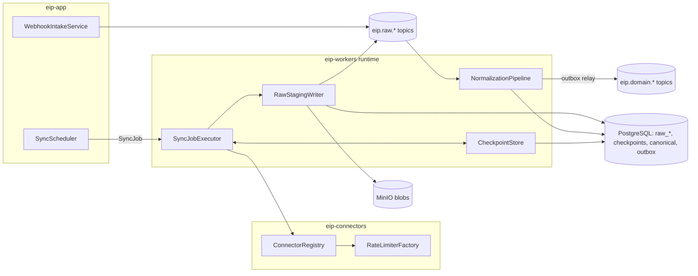
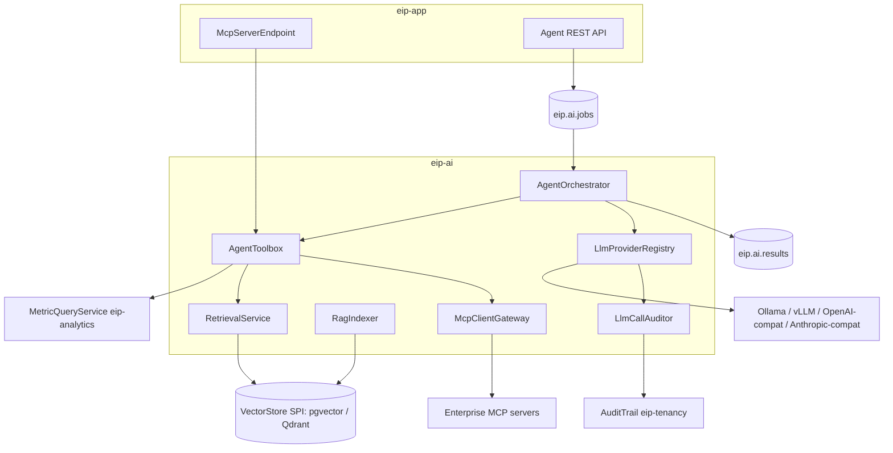

# Component Model

This document is the C4 level 3 view of the EIP backend: the components inside each Gradle module, their responsibilities, the public interfaces modules export to each other, the Kafka events each module publishes and consumes, and the data each module owns. It refines [ArchitectureOverview.md](./ArchitectureOverview.md) (§5 module map) and is consistent with the event contracts in [../engineering/EventModel.md](../engineering/EventModel.md), the entities in [DomainModel.md](./DomainModel.md), and the connector SPI in [../engineering/ConnectorFramework.md](../engineering/ConnectorFramework.md).

Conventions: each module exposes a public `api` package (Java interfaces + DTOs); everything else is module-private and enforced by Spring Modulith verification tests. Interface sketches below are illustrative design signatures, not final implementation.

## 1. eip-core — Domain Model and Shared Kernel

**Responsibilities:** canonical domain types, shared identifiers and envelopes, and SPIs that must be visible platform-wide. No business logic, no persistence, no Spring beans beyond configuration properties. Depends on nothing.

**Key components:**
- **CanonicalModel** — entity types from [DomainModel.md](./DomainModel.md): `WorkItem` supertype (type: `EPIC|FEATURE|STORY|TASK|BUG|INCIDENT_TICKET`), `ExternalRef` (sourceSystem, externalId, url), Repository, Commit, PullRequest, Build, Pipeline, Deployment, Release, Incident, Sprint, Board, WorkflowState, etc.
- **EventEnvelope** — `eventId (UUIDv7), tenantId, source, entityType, entityId, eventType, occurredAt, ingestedAt, schemaVersion, payload, traceparent`.
- **IdGenerator** — UUIDv7 generation (time-ordered, index-friendly).
- **VectorStore SPI** — `VectorStore` interface implemented by pgvector (default) and Qdrant adapters.
- **KmsProvider SPI** — master-key acquisition (env/file/Vault) for envelope encryption.
- **ProblemTypes / Result** — RFC 7807 problem+json error taxonomy, shared result types.

```java
public interface VectorStore {
    void upsert(TenantId tenant, String collection, List<EmbeddedChunk> chunks);
    List<ScoredChunk> search(TenantId tenant, String collection, float[] query,
                             MetadataFilter filter, int topK);
    void deleteBySource(TenantId tenant, String collection, DocumentSourceId source);
}
```

**Events:** none (defines the envelope; publishes nothing). **Data owned:** none (types only).

## 2. eip-tenancy — Tenants, RBAC, Audit, Secrets

**Responsibilities:** organizations and tenants, role-based access control (roles + fine-grained permissions, tenant-scoped), the append-only audit trail, and the secret vault.

**Key components:**
- **TenantDirectory** — CRUD for Organization/BusinessUnit/Team/Member; tenant lifecycle (provision, suspend); establishes the RLS `app.tenant_id` binding contract.
- **RbacService / PermissionEvaluator** — role and permission resolution; method-security integration; permission-set caching (Redis, 5 min TTL).
- **AuditTrail** — append-only audit writer + query API; consumes audit events from all modules; entries: actor, tenant, action, resource, outcome, timestamp, traceId (extracted from the propagated `traceparent`).
- **SecretVault** — AES-256-GCM envelope encryption over `KmsProvider`; versioned secrets, rotation, masked reads, audited access. Used by connectors (credentials) and `eip-ai` (provider API keys).
- **OidcIdentityBridge** — maps OIDC claims (Keycloak or brokered enterprise IdP) and local-account principals to Members and roles.

```java
public interface SecretVault {
    SecretRef store(TenantId tenant, String name, SecretValue value);
    SecretValue reveal(TenantId tenant, SecretRef ref, AccessContext ctx); // audited
    void rotate(TenantId tenant, SecretRef ref, SecretValue newValue);
}

public interface AuditTrail {
    void record(AuditEvent event);                       // append-only
    Page<AuditEntry> query(TenantId tenant, AuditFilter filter, Cursor cursor);
}
```

**Events:** publishes internal `audit.recorded` application events (persisted transactionally; see [DataFlow.md](./DataFlow.md) flow h); consumes none from Kafka. **Data owned:** `tenants`, `orgs`, `business_units`, `teams`, `members`, `roles`, `permissions`, `role_assignments`, `audit_log` (append-only, time-partitioned), `secrets` (ciphertext + key metadata).

## 3. eip-connectors — Connector SPI and Built-in Connectors

**Responsibilities:** the connector SPI (see [../engineering/ConnectorFramework.md](../engineering/ConnectorFramework.md)), JSON Schema-driven configuration, and the 18 built-in connectors (Jira, Confluence, GitHub, GitLab, Bitbucket, SonarQube, Artifactory, Kubernetes, OpenShift, Docker Registry, Prometheus, Grafana, OTLP intake, Generic CI/CD, Generic REST, Generic SQL, Generic File/Document, custom internal demand/project tool).

**Key components:**
- **ConnectorRegistry** — discovers connector plugins, exposes their JSON Schema config, instantiates configured connector instances per tenant.
- **ConnectorConfigService** — validates configs against JSON Schema (`validate()`), stores them with credentials in `SecretVault`, runs `testConnection()`.
- **ConnectorHealthMonitor** — periodic `healthCheck()` per instance; feeds admin UI status and circuit-breaker state.
- **RateLimiterFactory** — per-instance token-bucket limiters (Redis-backed) honoring source-tool limits.
- **WebhookVerifier** — signature verification for inbound webhooks per connector type.
- **SimulationConnector support** — every connector offers a simulation/mock mode for demo/data packs.

```java
public interface Connector {
    ConnectorDescriptor descriptor();                    // id, JSON Schema, capabilities
    ValidationResult validate(JsonNode config);
    TestResult testConnection(ConnectorContext ctx);
    HealthStatus healthCheck(ConnectorContext ctx);
    SyncResult fullSync(ConnectorContext ctx, RawEmitter emitter);
    SyncResult incrementalSync(ConnectorContext ctx, Checkpoint checkpoint, RawEmitter emitter);
    Optional<WebhookHandler> webhookHandler();
}
```

**Events:** publishes to `eip.raw.<connector>` (raw records, via `RawEmitter` handed in by `eip-ingestion`); consumes none. **Data owned:** `connector_instances`, `connector_configs` (JSON, credentials as `SecretRef`), `connector_health`.

## 4. eip-ingestion — Sync Engine, Staging, Normalization

**Responsibilities:** orchestrates connector syncs, stages raw data, normalizes into the canonical model, and publishes domain events. Implements the pattern: collectors → raw staging (`raw_*` JSONB + object storage for blobs) → normalizers → canonical model → domain events on Kafka.

**Key components:**
- **SyncScheduler** — cron/interval scheduling of full and incremental syncs per connector instance; Redisson leases prevent concurrent syncs of the same instance; enqueues `SyncJob`s.
- **SyncJobExecutor** (workers) — runs `fullSync`/`incrementalSync` through the connector's rate limiter and circuit breaker; retries with exponential backoff + jitter.
- **CheckpointStore** — checkpoint table per connector+stream (cursor, watermark, updatedAt); committed transactionally with staged raw batches.
- **RawStagingWriter** — persists raw records to `raw_<connector>` JSONB tables, large payloads/blobs to MinIO; produces directly to `eip.raw.<connector>` with dedup keys — the staged `raw_*` row is written before the produce and is the durability guarantee on the raw path (ADR-017).
- **NormalizationPipeline** — per-connector mappers raw → canonical (`WorkItem`, `Commit`, `PullRequest`, `Build`, `Deployment`, `Incident`, …); resolves `ExternalRef` identity, dedups, performs idempotent canonical upserts, and emits domain events via the transactional outbox.
- **CanonicalEnrichmentService** (exported `api`) — the single write path for derived canonical fields (`work_item.blocked`, `deployment.caused_incident`, `release.readiness_score`) and agent-raised `Risk` rows, called in-process by `eip-analytics` and `eip-ai` (ADR-019). Conflict rule: enrichment writes touch only enrichment-owned columns/rows, never normalizer-owned fields; normalizer upserts never clear enrichment columns. At module extraction this call becomes an API call.
- **WebhookIntakeService** (app) — receives verified webhooks, wraps them as raw records and produces directly onto `eip.raw.<connector>` for the same normalization path; during Kafka outages it buffers to the bounded `staging.webhook_intake_buffer` (see "Data owned" below).
- **DlqReplayService** — operator-facing inspection and replay of per-consumer-group `<group>.dlq` topics.

Publication scope (ADR-017): the raw path (`RawStagingWriter`, `WebhookIntakeService`) produces directly to `eip.raw.<connector>` — durability comes from the staged `raw_*` row written before produce; domain events, and all analytics/job events platform-wide, are published only through the transactional outbox relayed by `OutboxRelay` (§8).

```java
public interface CheckpointStore {
    Optional<Checkpoint> load(ConnectorInstanceId id, String stream);
    void commit(ConnectorInstanceId id, String stream, Checkpoint next); // tx with staged batch
}

public interface NormalizationPipeline {
    NormalizationResult normalize(RawRecordBatch batch); // upserts + outbox events
}

public interface CanonicalEnrichmentService { // exported api — ADR-019
    void applyEnrichment(TenantId t, EnrichmentBatch batch); // enrichment-owned columns/rows only
}
```

**Events:** produces `eip.raw.<connector>`; consumes `eip.raw.<connector>`; produces `eip.domain.workitem`, `eip.domain.scm`, `eip.domain.cicd`, `eip.domain.quality`, `eip.domain.ops`; parks failures on the consuming group's DLQ (`eip.ingestion.<purpose>.dlq`, e.g. `eip.ingestion.workitem-normalizer.dlq`). **Data owned:** `raw_*` staging tables (JSONB, time-partitioned), `checkpoints`, `sync_jobs`, `external_refs`, canonical entity tables (write ownership; other modules read via domain events, never via SQL joins), `outbox_events`, `webhook_intake_buffer` (`staging.webhook_intake_buffer` — bounded Kafka-outage buffer for verified webhooks, default cap 100,000 rows: on overflow intake returns 503 so sources redeliver and polling covers the gap; drained oldest-first by `eip-app`'s intake drainer after broker recovery at a capped rate that yields to live intake; depth exported as `eip_webhook_buffer_depth` with alert `EipWebhookBufferGrowing`; see [DataFlow.md](./DataFlow.md) flow C).



## 5. eip-analytics — Metric Engines, Risk Scoring, Read Models

**Responsibilities:** compute the canonical metric set (flow, DORA, quality, delivery risk, ops, team health — team-level only, anti-toxic-ranking by design) from domain events, maintain projector-maintained read models for dashboards (ADR-015), and score delivery risks.

**Key components:**
- **MetricEngine** — consumes `eip.domain.*`; incrementally updates metric facts per definition (velocity, throughput, cycle time, lead time, WIP, flow efficiency, blocked time, sprint predictability, scope churn; deployment frequency, lead time for changes, change failure rate, MTTR; coverage, code smells, duplication, quality gate status, escaped defects, bug aging, technical debt ratio, security finding aging; incident frequency/impact, SLO health, alert noise; load balance, review bottlenecks, knowledge concentration).
- **MetricDefinitionCatalog** — declarative registry: purpose, formula, inputs, grain, caveats/limitations, gaming risks for every metric; served to the UI so caveats render beside every chart.
- **ReadModelProjector** — maintains `rm_*` aggregates (team/sprint/day grain) consumed by dashboard APIs; runs as consumer group `eip.analytics.read-models` (DLQ `eip.analytics.read-models.dlq`) consuming `eip.analytics.metrics`, and also owns dashboard-cache warming (there is no separate cache-warmer group). Read models are plain projector-maintained tables with RLS enabled — PostgreSQL materialized views are forbidden for tenant-scoped data (ADR-015); rebuildable by replaying `eip.domain.*` plus canonical recompute via the read-only grant below.
- **RiskScoringService** — epic delivery risk, project delay prediction, dependency risk, release readiness score; combines multiple signals with confidence intervals; emits `Risk` entities and alerts. Derived canonical fields (`work_item.blocked`, `deployment.caused_incident`, `release.readiness_score`) are written exclusively through `eip-ingestion`'s exported `CanonicalEnrichmentService` (ADR-019) — never by direct canonical writes.
- **MetricQueryService** — the module's exported read interface (used by `eip-app` dashboards, `eip-ai` agents, `eip-reports`).

Canonical data access (stated identically in [ArchitectureOverview.md](./ArchitectureOverview.md) §5 rule 4, BackendPlan §5, and EventModel §11): `eip-analytics` holds READ-ONLY SQL access to the canonical schemas (`work`, `scm`, `cicd`, `quality`, `ops`) via a dedicated read-only DB grant, used only for full recomputation and rollups; reads of `staging.raw_*` and any canonical writes are forbidden. At module extraction this becomes a canonical read replica or an API.

```java
public interface MetricQueryService {
    MetricSeries series(TenantId t, MetricId metric, Grain grain, Scope scope, TimeRange range);
    SprintSummary sprintSummary(TenantId t, SprintId sprint);
    List<RiskAssessment> risks(TenantId t, RiskScope scope);
    MetricDefinition definition(MetricId metric);        // formula, caveats, gaming risks
}
```

**Events:** consumes `eip.domain.workitem`, `eip.domain.scm`, `eip.domain.cicd`, `eip.domain.quality`, `eip.domain.ops`, and `eip.analytics.metrics` (read-model projection, group `eip.analytics.read-models`); produces `eip.analytics.metrics` (metric-updated / risk-detected events); one DLQ per consumer group (`eip.analytics.<purpose>.dlq`, e.g. `eip.analytics.flow-metrics.dlq`, `eip.analytics.dora-metrics.dlq`, `eip.analytics.read-models.dlq`). **Data owned:** `metric_facts` (time-partitioned), `rm_*` read-model tables, `metric_definitions`, `risk_assessments`, `analytics_watermarks` (per-partition processed offsets for rebuild safety).

## 6. eip-ai — Agents, LLM Providers, RAG, MCP

**Responsibilities:** agent runtime (plan/execute with tool-calling, budgets, guardrails), LLM provider SPI with per-tenant + per-agent routing, the RAG pipeline, and MCP client/server integration. Default orchestration is Java + LangChain4j (ADR-006); optional Python workers hang off `eip.ai.jobs`/`eip.ai.results`.

**Key components:**
- **AgentOrchestrator** — plans and executes agent runs (LangChain4j); enforces step limits, token budgets, and guardrails; supports the canonical agents: Data Ingestion, Data Quality, Engineering Metrics, Delivery Risk, Sprint Review, Release Notes, Documentation, Use Case Diagram, Architecture Diagram, Executive Summary, Incident Analysis, Code Quality, Team Health, RAG Retrieval, Report Composition, Validation, Security Review, Configuration Assistant.
- **AgentToolbox** — typed tools agents may call: `MetricQueryService`, `RetrievalService`, `McpClientGateway`, `CanonicalEnrichmentService` (agent-raised `Risk` rows — the single canonical write path, ADR-019), report drafting utilities; every tool call is RBAC-checked in the caller's tenant context.
- **LlmProviderRegistry** — LLM provider SPI (Ollama, vLLM OpenAI-compatible, OpenAI-compatible generic, Anthropic-compatible, custom enterprise endpoint); per-tenant + per-agent model routing, fallback chains, token budgets, circuit breakers.
- **LlmCallAuditor** — audits every LLM call (prompt, model, tokens, cost, latency; prompts redacted per policy) into `AuditTrail` + `llm_calls`.
- **RagIndexer** — document ingestion → chunking → embedding (configurable model) → `VectorStore`; incremental re-indexing on domain/document events; scheduled full re-index.
- **RetrievalService** — permission-aware, tenant-isolated retrieval with metadata filters and source citations; audit-logged.
- **McpClientGateway** — connects to enterprise MCP servers and exposes their tools to agents (allow-listed, audited).
- **McpServerEndpoint** (hosted in `eip-app`) — exposes selected, allow-listed internal capabilities as an MCP server with per-capability RBAC + audit.

```java
public interface AgentOrchestrator {
    AgentRunId submit(TenantId t, AgentType agent, AgentInput input, Budget budget);
    AgentRunStatus status(AgentRunId id);
}

public interface RetrievalService {
    RetrievalResult retrieve(TenantId t, Principal caller, Query q, MetadataFilter f, int topK);
    // result chunks carry source citations; access filtered by caller permissions
}
```

**Events:** consumes `eip.ai.jobs` (agent/RAG/embedding jobs), `eip.domain.workitem`, `eip.domain.scm`, `eip.domain.quality` (incremental re-index triggers), `eip.analytics.metrics` (risk-narrative triggers); produces `eip.ai.jobs` (fan-out sub-jobs), `eip.ai.results`, and `eip.reports.jobs` (the Report Composition agent enqueues report renders — topic owned by `eip-reports`); DLQs per consumer group: `eip.ai.orchestrator.dlq` (job consumers), `eip.ai.rag-indexer.dlq` (re-index consumers). **Data owned:** `agent_runs`, `agent_steps`, `llm_calls`, `llm_providers` (routing config; keys via `SecretVault`), `rag_documents`, `rag_chunks` + `rag_embeddings` (pgvector default), `rag_index_state`, `mcp_capabilities` (allow-lists).



## 7. eip-reports — Report Engine, Exports, Artifact Library

**Responsibilities:** report templates and rendering, scheduled and on-demand report jobs, exports (Markdown/HTML/PDF/PPTX/diagrams), and the tenant artifact library.

**Key components:**
- **ReportTemplateEngine** — versioned templates binding metric queries, agent-composed narrative sections, and rendering directives; renders to target formats.
- **ReportJobService** — accepts on-demand and scheduled report requests; publishes `eip.reports.jobs`; tracks job state.
- **ReportScheduler** — cron schedules per tenant/report; Redisson-leased to fire exactly one job per schedule tick.
- **ReportCompositionCoordinator** (workers) — drives the Report Composition agent and the Validation agent (via `AgentOrchestrator`), assembles sections, invokes rendering.
- **ArtifactStore** — persists rendered artifacts to MinIO (tenant-prefixed), records metadata (`GeneratedReport`), serves presigned download URLs, applies retention policy.
- **DeliveryService** — pushes finished reports to notification channels (email/webhook) per subscription.

```java
public interface ReportJobService {
    ReportJobId submit(TenantId t, ReportTemplateId template, ReportParams params, Trigger trigger);
    ReportJobStatus status(ReportJobId id);
}

public interface ArtifactStore {
    ArtifactRef store(TenantId t, GeneratedReport meta, ContentStream content);
    Url presignedDownload(TenantId t, ArtifactRef ref, Duration ttl);
}
```

**Events:** produces and consumes `eip.reports.jobs` (also produced by `eip-app` — API/schedule submissions — and by `eip-ai`'s Report Composition agent; job status events such as `reports.job.completed` travel on the same topic); consumes `eip.ai.results` (agent outputs for compositions); DLQ `eip.reports.job-runner.dlq` (the report workers' consumer group — the canonical group name per EventModel §8). **Data owned:** `report_templates`, `report_jobs`, `report_schedules`, `generated_reports` (artifact metadata; binaries in MinIO), `report_subscriptions`.

## 8. eip-app — Composition Root / Main API Application

**Responsibilities:** the deployable API application. Owns HTTP concerns only; delegates everything to module `api` interfaces.

**Key components:**
- **ApiGatewayLayer** — REST `/api/v1` controllers per module facade; OpenAPI 3 (springdoc); cursor pagination; RFC 7807 problem+json; idempotency keys on mutating batch endpoints.
- **SecurityConfig / TenantContextFilter** — OIDC (Keycloak default), RBAC enforcement via `PermissionEvaluator`, binds `app.tenant_id` for RLS per request.
- **WebhookController** — inbound connector webhooks → `WebhookVerifier` → `WebhookIntakeService`.
- **McpServerEndpoint** — MCP server surface (allow-listed capabilities; §6).
- **OutboxRelay** — polls `outbox_events` and publishes to Kafka with the event envelope (shared component, active in both runtimes, each relaying its own writes — ADR-017; no "workers down = app events stall" mode exists).
- **RunStatusService** — serves agent-run and report-job status/progress from `agent_runs`/`report_jobs` rows that workers update, via polling or Postgres LISTEN/NOTIFY. `eip-app` consumes no Kafka topics — there is no SSE-on-Kafka bridge.
- **AdminConsoleApi** — tenants, connectors (JSON Schema-driven config forms), model routing, DLQ replay, health.

**Events:** produces `eip.ai.jobs`, `eip.reports.jobs`, and domain events through its transactional outbox (relayed by its own `OutboxRelay`); produces `eip.raw.<connector>` directly for webhook intake (staged raw row + bounded intake buffer, ADR-017); consumes none — run/job status is read from the database (polling / LISTEN-NOTIFY), never from Kafka. **Data owned:** none beyond composition (each table belongs to a domain module).

## 9. eip-workers — Async Worker Runtime

**Responsibilities:** the second deployable. No business logic of its own; it activates consumer components contributed by `eip-ingestion`, `eip-analytics`, `eip-ai`, and `eip-reports` and provides the operational chassis.

**Key components:**
- **WorkerRuntime** — profile-driven activation (`workers.pipelines=ingestion,normalization,analytics,ai,reports`) so operators can run mixed or dedicated pools.
- **ConsumerGroupManager** — consumer group wiring, concurrency per topic partition count, pause/resume on backpressure signals.
- **RetryAndDlqSupport** — bounded retries with exponential backoff + jitter, then park to the consumer group's `<group>.dlq` with error context headers.
- **IdempotencyGuard** — dedup on `eventId` (Redis fast path + `processed_events` durable ledger) before any consumer handler runs; the ledger insert commits in the same transaction as the handler's canonical/read-model write. The ledger is used by consumer groups whose effects lack a structural natural key — the `eip.analytics.<purpose>` metric-engine groups (e.g. `eip.analytics.flow-metrics`, `eip.analytics.dora-metrics`) and `eip.analytics.read-models` (≈ 6 ledger-using groups at the committed envelope). Groups with structurally idempotent writes rely on natural keys instead of the ledger, as EventModel §2 permits: `eip.ingestion.<purpose>` normalizers (`ExternalRef`-keyed canonical upserts), `eip.ai.orchestrator` (run state keyed by `jobId`), `eip.ai.rag-indexer` (chunks keyed by `(documentId, contentHash, chunkIndex)`), `eip.reports.job-runner` (jobs keyed by `reportJobId`).
- **WorkerHealthEndpoints** — liveness/readiness, per-pipeline lag gauges via Micrometer/OTel.

**Events:** hosts all consumers listed in §§4–7. **Data owned:** none in the domain sense — `core.processed_events` (dedup ledger; RANGE-partitioned by day/week, disposed by whole-partition drop, never batched hard delete) is an infra-owned `eip-core` platform table accessed via core services only (see DatabasePlan §2/§6).

## 10. Module Dependency Matrix

Rows depend on columns. `api` = compile-time dependency on the column module's exported interfaces; `evt` = Kafka events only; `—` = no dependency (forbidden).

| depends on → | eip-core | eip-tenancy | eip-connectors | eip-ingestion | eip-analytics | eip-ai | eip-reports |
|--------------|----------|-------------|----------------|---------------|---------------|--------|-------------|
| **eip-core** | — | — | — | — | — | — | — |
| **eip-tenancy** | api | — | — | — | — | — | — |
| **eip-connectors** | api | api (SecretVault, AuditTrail) | — | — | — | — | — |
| **eip-ingestion** | api | api (AuditTrail) | api (Connector SPI) | — | — | — | — |
| **eip-analytics** | api | api (AuditTrail) | — | api (CanonicalEnrichmentService) + evt (`eip.domain.*`) | — | — | — |
| **eip-ai** | api | api (SecretVault, AuditTrail, RBAC) | — | api (CanonicalEnrichmentService) + evt (`eip.domain.*`) | api (MetricQueryService) + evt (`eip.analytics.metrics`) | — | evt (produces `eip.reports.jobs`) |
| **eip-reports** | api | api (AuditTrail, RBAC) | — | — | api (MetricQueryService) | api (AgentOrchestrator) + evt (`eip.ai.results`) | — |
| **eip-app** | api | api | api | api | api | api | api |
| **eip-workers** | api | api | api | api | api | api | api |

Composition roots (`eip-app`, `eip-workers`) may depend on everything; all other cells not listed are forbidden. Compile-time `api` dependencies are verified by Spring Modulith tests; `evt` (topic-consumption) rules are verified by ArchUnit/convention tests — Spring Modulith checks compile-time package dependencies only.

Notes: the eip-ai → eip-reports cell is a produce-side event edge — the Report Composition agent enqueues renders on `eip.reports.jobs` (owned by `eip-reports`); it consumes nothing from `eip-reports`. The `CanonicalEnrichmentService` edges are the ADR-019 single-canonical-writer path. `eip-analytics`' read-only canonical SQL grant ([ArchitectureOverview.md](./ArchitectureOverview.md) §5 rule 4) is a database grant, not a compile-time dependency, and does not appear in this matrix.

## 11. Events per Module — Summary

| Module | Produces | Consumes | DLQs |
|--------|----------|----------|------|
| eip-connectors | `eip.raw.<connector>` (via ingestion's RawEmitter) | — | — |
| eip-ingestion | `eip.raw.<connector>`, `eip.domain.workitem`, `eip.domain.scm`, `eip.domain.cicd`, `eip.domain.quality`, `eip.domain.ops` | `eip.raw.<connector>` | `eip.ingestion.<purpose>.dlq` (e.g. `eip.ingestion.workitem-normalizer.dlq`) |
| eip-analytics | `eip.analytics.metrics` | `eip.domain.workitem`, `eip.domain.scm`, `eip.domain.cicd`, `eip.domain.quality`, `eip.domain.ops`, `eip.analytics.metrics` (group `eip.analytics.read-models`) | `eip.analytics.<purpose>.dlq` (e.g. `eip.analytics.flow-metrics.dlq`, `eip.analytics.read-models.dlq`) |
| eip-ai | `eip.ai.jobs`, `eip.ai.results`, `eip.reports.jobs` (Report Composition render enqueue) | `eip.ai.jobs`, `eip.domain.workitem`, `eip.domain.scm`, `eip.domain.quality`, `eip.analytics.metrics` | `eip.ai.orchestrator.dlq`, `eip.ai.rag-indexer.dlq` |
| eip-reports | `eip.reports.jobs` (incl. job status events) | `eip.reports.jobs`, `eip.ai.results` | `eip.reports.job-runner.dlq` |
| eip-app | `eip.ai.jobs`, `eip.reports.jobs` (via outbox), `eip.raw.<connector>` (webhooks, direct), outbox-relayed domain events | — (`eip-app` consumes no Kafka; run/job status is served from `agent_runs`/`report_jobs` rows via polling/LISTEN-NOTIFY) | — |

Topic ownership — exactly one owning module per topic, per the EventModel §3 "Owning module" column: `eip.raw.*` and `eip.domain.*` → `eip-ingestion`; `eip.analytics.metrics` → `eip-analytics`; `eip.ai.jobs`/`eip.ai.results` → `eip-ai`; `eip.reports.jobs` → `eip-reports`. Producing to another module's topic (e.g. `eip-ai` → `eip.reports.jobs`) uses the owner's published contract.

All messages use the shared event envelope and follow at-least-once delivery with idempotent consumers (dedup on `eventId`). Keys follow [EventModel §7](../engineering/EventModel.md): `tenantId:entityId` on domain topics, `tenantId:externalId` on raw, `tenantId:jobId` on job topics, `tenantId:metricKey` on metrics. One DLQ per consumer group, named `<group>.dlq`. Full schemas and versioning rules: [../engineering/EventModel.md](../engineering/EventModel.md).
