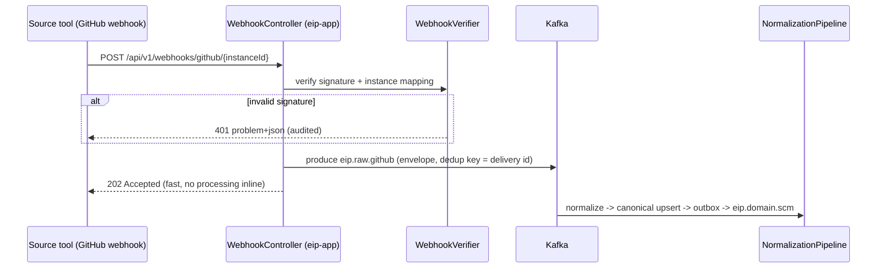
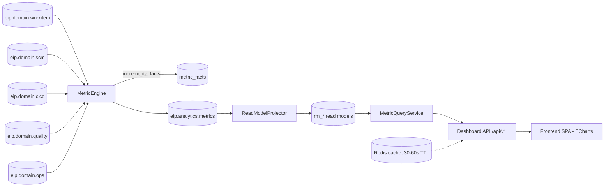
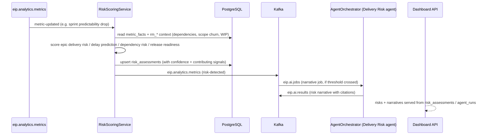
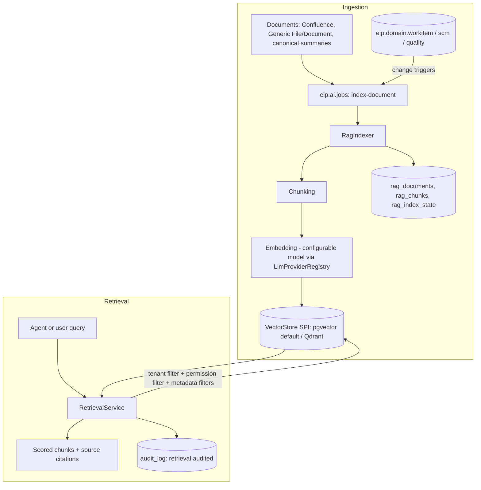
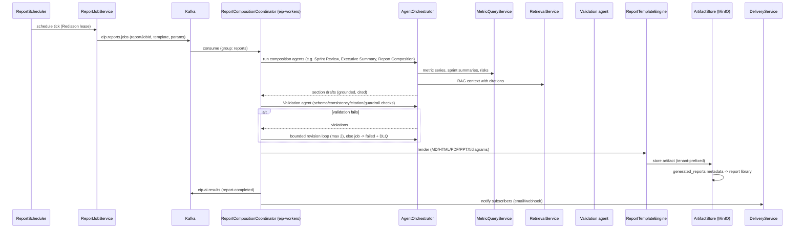
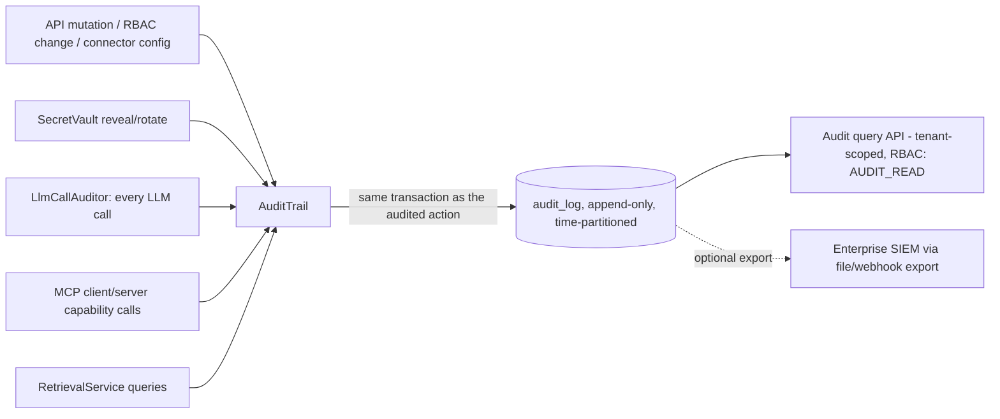

# Data Flow

This document specifies EIP's end-to-end data flows: components involved, Kafka topics, tables touched (logical names), delivery guarantees, idempotency mechanisms, failure handling, and backpressure behavior for each flow, plus data lifecycle/retention and per-flow latency budgets.

Component names refer to [ComponentModel.md](./ComponentModel.md); topic and envelope contracts to [../engineering/EventModel.md](../engineering/EventModel.md); entities to [DomainModel.md](./DomainModel.md); connector SPI semantics to [../engineering/ConnectorFramework.md](../engineering/ConnectorFramework.md).

Global invariants applying to every flow:

- **Delivery:** at-least-once end to end; idempotent consumers dedup on `eventId` (UUIDv7) via `IdempotencyGuard` (Redis fast path + `processed_events` ledger).
- **Ordering:** per key `tenantId+entityId` within a partition.
- **Envelope:** `eventId, tenantId, source, entityType, entityId, eventType, occurredAt, ingestedAt, schemaVersion, payload, traceparent` — `traceparent` gives end-to-end OTel traces across all hops.
- **DLQ:** after bounded retries with exponential backoff + jitter, messages park on `<topic>.<group>.dlq` with error-context headers; `DlqReplayService` supports operator replay, which is safe because all consumers are idempotent.
- **Tenancy:** RLS binding (`app.tenant_id`) is established from the request principal (API) or envelope `tenantId` (workers) before any table access.

## 1. Flow A — Full Sync of a New Connector

Staging raw → normalize → canonical upsert → domain events.

```mermaid
sequenceDiagram
    participant Admin as Admin (SPA)
    participant App as eip-app (ConnectorConfigService)
    participant SS as SyncScheduler
    participant SJE as SyncJobExecutor (eip-workers)
    participant Src as Source tool (e.g. Jira)
    participant RSW as RawStagingWriter
    participant K as Kafka
    participant NP as NormalizationPipeline
    participant PG as PostgreSQL

    Admin->>App: create connector instance (JSON Schema config)
    App->>App: validate(), testConnection(); credentials -> SecretVault
    App->>SS: schedule initial fullSync
    SS->>SJE: SyncJob (Redisson lease per instance)
    loop pages, rate-limited
        SJE->>Src: fetch page (token bucket, circuit breaker)
        Src-->>SJE: raw records
        SJE->>RSW: batch
        RSW->>PG: insert raw_jira (JSONB); blobs -> MinIO
        RSW->>K: produce eip.raw.jira (dedup key)
    end
    SJE->>PG: commit checkpoint (stream watermark)
    K->>NP: consume eip.raw.jira (group: normalization)
    NP->>PG: resolve external_refs; idempotent canonical upsert (work_items, sprints, ...)
    NP->>PG: outbox_events (same transaction)
    PG-->>K: OutboxRelay -> eip.domain.workitem
```

- **Steps:** config + validation → scheduled full sync → paged extraction → raw staging → raw topic → normalization → canonical upsert + outbox → domain events.
- **Topics:** `eip.raw.jira` (example), then `eip.domain.workitem` (and `eip.domain.scm`/`eip.domain.cicd`/`eip.domain.quality`/`eip.domain.ops` for other connectors).
- **Tables:** `connector_instances`, `connector_configs`, `secrets`, `sync_jobs`, `raw_jira`, `checkpoints`, `external_refs`, `work_items`, `sprints`, `boards`, `outbox_events`.
- **Guarantees:** at-least-once at every hop; canonical writes are ACID with outbox in one transaction (no dual-write gap).
- **Idempotency:** raw records carry a source-derived dedup key; canonical upserts key on `ExternalRef (sourceSystem, externalId)` per tenant; re-running a full sync converges to the same state.
- **Failure handling:** page fetch failures retry with backoff+jitter; connector circuit breaker opens on persistent failure and the job resumes from the last committed checkpoint (full syncs checkpoint per stream/page-window, so they are resumable, not restart-from-zero). Normalization poison messages go to `eip.raw.jira.normalization.dlq`.
- **Backpressure:** the rate limiter paces extraction to the source's limits; Kafka absorbs producer bursts; normalization consumes at its own rate — a slow normalizer grows lag, never blocks extraction.

## 2. Flow B — Incremental Sync (Checkpoint + Rate Limit + Retry + DLQ)

```mermaid
sequenceDiagram
    participant SS as SyncScheduler
    participant CS as CheckpointStore
    participant SJE as SyncJobExecutor
    participant RL as RateLimiter (Redis)
    participant Src as Source tool
    participant K as Kafka
    participant DLQ as eip.raw.github.normalization.dlq

    SS->>SJE: incremental SyncJob (lease)
    SJE->>CS: load checkpoint (connector+stream)
    CS-->>SJE: cursor = updatedSince 2026-07-06T09:15Z
    SJE->>RL: acquire permits
    SJE->>Src: fetch changes since cursor
    alt 429 / 5xx
        Src-->>SJE: rate limited
        SJE->>SJE: exponential backoff + jitter (bounded attempts)
        SJE->>Src: retry
    end
    Src-->>SJE: delta records
    SJE->>K: produce eip.raw.github (with staged raw_github insert)
    SJE->>CS: commit new checkpoint (tx with staged batch)
    Note over K: NormalizationPipeline consumes as in Flow A
    alt normalization fails after N retries
        K->>DLQ: park message + error headers
        Note over DLQ: alert fires; operator fixes, DlqReplayService replays
    end
```

- **Steps:** load checkpoint → rate-limited delta fetch (retrying transient errors) → stage + produce → atomically advance checkpoint → normalize → domain events.
- **Topics:** `eip.raw.github` (example), `eip.raw.github.normalization.dlq`, then `eip.domain.scm`.
- **Tables:** `checkpoints`, `sync_jobs`, `raw_github`, `external_refs`, canonical SCM tables (`repositories`, `commits`, `pull_requests`, `code_reviews`), `outbox_events`.
- **Guarantees:** checkpoint commits with the staged batch in one transaction; a crash between produce and commit re-fetches the same delta — duplicates are absorbed by idempotent upserts (at-least-once by design).
- **Idempotency:** cursor/watermark checkpoint per connector+stream; dedup on raw record identity and `eventId` downstream.
- **Failure handling:** transient source errors → backoff+jitter retries; persistent errors → circuit breaker opens, connector marked DEGRADED, `ConnectorHealthMonitor` raises the admin alert; normalization poison messages → DLQ with replay.
- **Backpressure:** token bucket caps outbound request rate per instance; sync leases prevent overlapping jobs; if consumer lag on `eip.raw.*` exceeds threshold, `SyncScheduler` stretches sync intervals for the affected connector (feedback throttle).

## 3. Flow C — Webhook / Real-Time Intake



- **Steps:** signed webhook → verify → wrap as raw record → `eip.raw.<connector>` → same normalization path as syncs (single code path for all intake).
- **Topics:** `eip.raw.<connector>`, then the appropriate `eip.domain.*`.
- **Tables:** `raw_<connector>` (webhook payloads are also staged for replay parity), canonical tables, `outbox_events`.
- **Guarantees:** at-least-once — sources may redeliver webhooks; dedup on source delivery id.
- **Idempotency:** delivery-id dedup key plus canonical `ExternalRef` upserts; a webhook and a later incremental sync covering the same change converge (last-write-wins on source `updatedAt`).
- **Failure handling:** Kafka unavailable → webhook stored to `webhook_intake_buffer` and 202 still returned; buffer drains via relay. Unverifiable requests are rejected and audited.
- **Backpressure:** intake is O(1) per request (verify + produce); burst absorption is Kafka's job. Per-instance rate limits protect against webhook storms.

## 4. Flow D — Metric Computation Pipeline

Domain events → metric engine → materialized read models → dashboard API.



- **Steps:** domain event → `IdempotencyGuard` → `MetricEngine` updates `metric_facts` at the metric's grain → emits metric-updated events on `eip.analytics.metrics` → `ReadModelProjector` refreshes affected `rm_*` aggregates → dashboard API serves from read models (Redis-cached).
- **Topics:** consumes all five `eip.domain.*`; produces `eip.analytics.metrics`; DLQs `eip.domain.<name>.analytics.dlq`.
- **Tables:** `processed_events`, `metric_facts`, `rm_team_flow_daily`, `rm_sprint_summary`, `rm_dora_daily`, `rm_quality_snapshot`, `rm_ops_health`, `analytics_watermarks`, `metric_definitions`.
- **Guarantees:** at-least-once; per-entity ordering ensures state-transition metrics (cycle time, blocked time) see transitions in order.
- **Idempotency:** dedup on `eventId`; fact updates are deterministic merges (recomputing from the same event is a no-op); read models are rebuildable by topic replay from `analytics_watermarks`.
- **Failure handling:** malformed events → analytics DLQ; a projector bug is fixed and read models rebuilt by replay without touching canonical data; dashboards keep serving the last materialized state throughout.
- **Backpressure:** lag on domain topics only delays metric freshness (staleness indicator in UI); dashboard read path is unaffected by ingestion volume by construction (CQRS-lite, ADR-011).

## 5. Flow E — Risk Detection



- **Steps:** metric change triggers scoring → multi-signal risk model computes scores with confidence → `risk_assessments` upsert → risk-detected event → optional Delivery Risk agent narrative (explains contributing signals, uncertainty, and limitations — per the anti-toxic-ranking stance).
- **Topics:** consumes/produces `eip.analytics.metrics`; produces `eip.ai.jobs`; narrative returns on `eip.ai.results`.
- **Tables:** `metric_facts`, `rm_*`, `risk_assessments`, `agent_runs`, `llm_calls`.
- **Guarantees:** at-least-once; scoring is deterministic per input watermark so replays converge.
- **Idempotency:** `risk_assessments` keyed by (tenant, scope, riskType, evaluationWindow); duplicate triggers re-score to the same row.
- **Failure handling:** scoring errors DLQ without blocking metric flow; LLM narrative failure degrades to score-only display (never blocks the risk itself).
- **Backpressure:** narrative jobs are budget-capped and queue on `eip.ai.jobs`; scoring itself is cheap and inline with analytics consumption.

## 6. Flow F — RAG Ingestion and Retrieval



- **Steps (ingestion):** document event or scheduled re-index → index job on `eip.ai.jobs` → fetch content (MinIO/canonical) → chunk → embed → upsert vectors + chunk metadata → advance `rag_index_state`. Incremental re-indexing replaces only chunks of changed documents; scheduled full re-index runs off-peak.
- **Steps (retrieval):** query → embed query → vector search constrained by `tenantId` and caller permission filters + metadata filters → return chunks with source citations → audit the retrieval.
- **Topics:** `eip.ai.jobs` (index jobs), `eip.ai.jobs.ai.dlq`.
- **Tables:** `rag_documents`, `rag_chunks`, `rag_embeddings` (pgvector default; Qdrant collection when configured), `rag_index_state`, `audit_log`, `llm_calls` (embedding calls audited).
- **Guarantees:** at-least-once indexing; retrieval is a synchronous read.
- **Idempotency:** chunks keyed by (documentId, contentHash, chunkIndex); re-indexing an unchanged document is a no-op; changed documents delete-then-insert by `DocumentSourceId`.
- **Failure handling:** embedding-provider failure → provider fallback chain, then job retry/DLQ; retrieval failure degrades agents to non-RAG context with explicit "citations unavailable" notice.
- **Backpressure:** indexing is queue-paced and yields to interactive AI jobs (consumer priority via separate worker pools); embedding calls respect per-provider token budgets and circuit breakers.

## 7. Flow G — Scheduled Report Generation via Agents

Report job → agents → validation agent → artifact store → library.



- **Steps:** schedule fires once (lease) → job on `eip.reports.jobs` → coordinator drives composition agents with metric + RAG inputs → Validation agent gates output → template engine renders → `ArtifactStore` persists to MinIO + `generated_reports` → library + notifications.
- **Topics:** `eip.reports.jobs`, `eip.ai.results`, `eip.reports.jobs.reports.dlq`.
- **Tables:** `report_schedules`, `report_jobs`, `report_templates`, `agent_runs`, `agent_steps`, `llm_calls`, `generated_reports`, `report_subscriptions`; binaries in MinIO.
- **Guarantees:** at-least-once job delivery; job state machine (`PENDING → RUNNING → VALIDATING → RENDERED → DELIVERED | FAILED`) in `report_jobs`.
- **Idempotency:** jobs keyed by `reportJobId`; a redelivered job in a terminal state is skipped; artifact writes are content-addressed (same input → same object key), so duplicate renders don't duplicate library entries.
- **Failure handling:** LLM failures → provider fallback → bounded retries → DLQ with job marked FAILED and operator-visible reason; validation failures allow a bounded revision loop (max 2) before failing — never silently shipping unvalidated AI output; MinIO failure fails fast to DLQ for replay.
- **Backpressure:** report jobs are budget-capped (tokens, wall-clock) and queue behind interactive agent traffic; schedules that repeatedly overrun are flagged in admin UI rather than piling up (scheduler skips a tick if the previous run is still active).

## 8. Flow H — Audit Event Flow



- **Steps:** audited action → `AuditTrail.record()` in the same transaction as the action (an unaudited mutation cannot commit) → append-only `audit_log` → tenant-scoped query API and optional SIEM export.
- **Topics:** none required for correctness — audit is transactional with the action; worker-side audited actions (LLM calls, retrievals) write via the same component in their own transactions.
- **Tables:** `audit_log` (append-only, time-partitioned, no UPDATE/DELETE grants), `llm_calls` (detailed LLM telemetry: prompt redacted per policy, model, tokens, cost, latency).
- **Guarantees:** exactly-once per audited action (transactional coupling); LLM call audits are at-least-once with dedup on call id.
- **Idempotency:** audit entries carry the action's idempotency key/eventId; replayed consumer actions produce audit entries deduplicated on that key.
- **Failure handling:** audit write failure aborts the audited mutation (fail-closed for mutations); for high-volume read audits (retrievals) a bounded async buffer is used with loss alarms (fail-open with detection, to avoid making audit a read-path availability dependency).
- **Backpressure:** audit writes are single-row inserts on a partitioned table; volume scales with actions already bounded by rate limits and budgets.

## 9. Data Lifecycle and Retention

| Data class | Store | Contents | Default retention | Disposal / notes |
|-----------|-------|----------|-------------------|------------------|
| Raw staging | `raw_*` JSONB (time-partitioned) + MinIO blobs | Verbatim source payloads | 30 days (configurable per connector) | Partition drop + object lifecycle rule; long enough to re-normalize after mapper fixes |
| Raw topics | `eip.raw.<connector>` | In-flight raw records | 7 days topic retention | Kafka retention; replays beyond 7 days re-normalize from `raw_*` tables |
| Canonical model | `work_items`, SCM/CI-CD/quality/ops tables, `external_refs` | Normalized source of truth | Life of tenant (soft-delete via source tombstones) | Tenant offboarding = RLS-scoped purge job; GDPR-style member erasure remaps to anonymized principals |
| Domain topics | `eip.domain.*` | Domain event stream | 30 days | Read models rebuild from canonical if replay window is exceeded |
| Analytics facts | `metric_facts` (partitioned) | Metric grains | 25 months (2 full year-over-year windows) | Partition drop; coarser rollups retained indefinitely |
| Read models | `rm_*` | Dashboard aggregates | Derived — rebuildable at will | Never backed up individually; rebuilt by replay |
| RAG index | `rag_chunks`/`rag_embeddings` (pgvector) or Qdrant | Chunks + vectors | Derived from documents; pruned on source deletion | Re-indexable from sources; deletion propagates within one index cycle |
| AI telemetry | `agent_runs`, `agent_steps`, `llm_calls` | Runs, steps, redacted prompts, tokens/cost | 12 months | Cost rollups retained; step payloads pruned |
| Artifacts | MinIO + `generated_reports` | Rendered reports/exports | 24 months (configurable per tenant) | Object lifecycle + metadata soft-delete; library shows expiry |
| Audit | `audit_log` | Append-only audit entries | 24+ months (compliance-driven, configurable upward only) | Export to SIEM; partitions archived, never edited |
| Dedup ledger | `processed_events` | Consumed eventIds | 14 days | Must exceed max topic retention + replay window |
| Checkpoints | `checkpoints` | Sync cursors | Life of connector instance | Deleted with instance |

## 10. Latency Budget per Flow

Budgets are p95 targets at the reference scale (ArchitectureOverview §1 D3: 1,000 domain events/s peak, 2,000 sync jobs/hour). "Freshness" flows are event-time to visible-state; interactive flows are request to response.

| Flow | Path measured | p95 budget | Dominant cost | Overload behavior |
|------|---------------|-----------|---------------|-------------------|
| A. Full sync (new connector) | Job start → canonical complete | Rate-limit bound; target ≥ 50 records/s/instance sustained; 100k-item Jira ≤ 60 min | Source API rate limits | Longer sync, progress % visible; never impacts dashboards |
| B. Incremental sync | Source change → canonical upsert | ≤ 5 min (interval-dominated) + ≤ 10 s pipeline | Sync interval | Intervals stretch under lag; staleness indicator |
| C. Webhook intake | Webhook receipt → canonical upsert | ≤ 5 s (202 response ≤ 150 ms) | Normalization consume | Lag grows; intake stays O(1) |
| D. Metric pipeline | Domain event → read model visible | ≤ 30 s | Projector batching | Freshness degrades; dashboards serve last state |
| D'. Dashboard API | Request → response (cached / uncached) | ≤ 200 ms / ≤ 800 ms | `rm_*` query | Redis bypass adds DB load only |
| E. Risk detection | Metric event → risk_assessment row | ≤ 60 s (score); narrative ≤ 5 min async | Multi-signal reads; LLM | Score-only display if LLM degraded |
| F. RAG indexing | Document change → searchable | ≤ 10 min incremental | Embedding throughput | Queue grows; retrieval unaffected |
| F'. RAG retrieval | Query → cited chunks | ≤ 700 ms (excl. LLM) | Vector search | Top-K reduced under pressure |
| G. Report generation | Job start → artifact in library | ≤ 10 min typical, ≤ 30 min budget cap | LLM composition + validation | Job queues; overrun ticks skipped |
| H. Audit | Action → durable audit row | Same transaction (0 added user-visible latency ≤ 10 ms) | Row insert | Buffered for read audits with loss alarms |

Budgets are enforced observationally: each flow emits OTel spans linked via `traceparent`, Micrometer gauges for consumer lag and freshness, and Grafana dashboards in `/infra/grafana` alert at 80% of budget.
