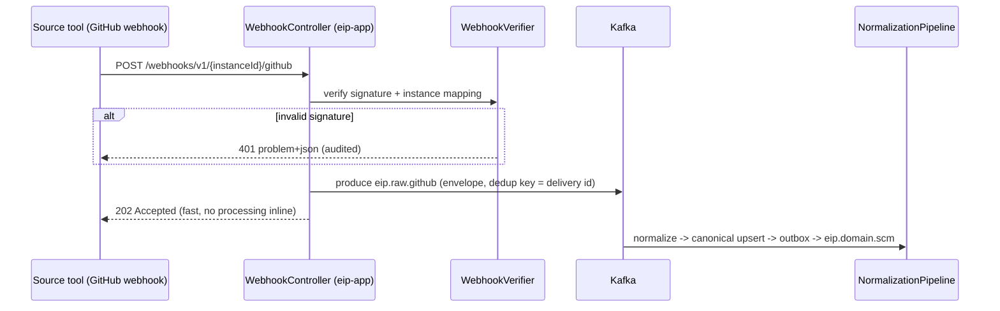
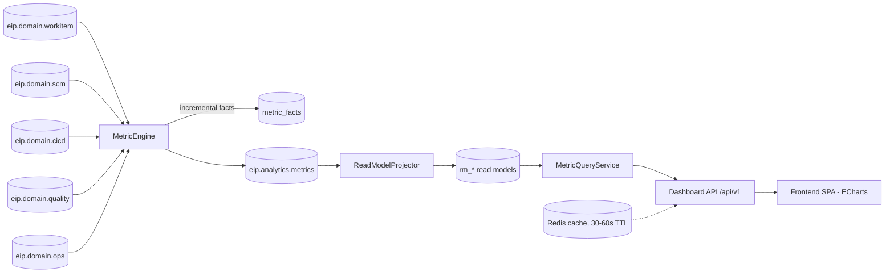
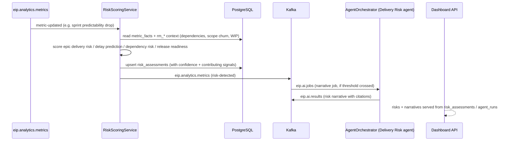
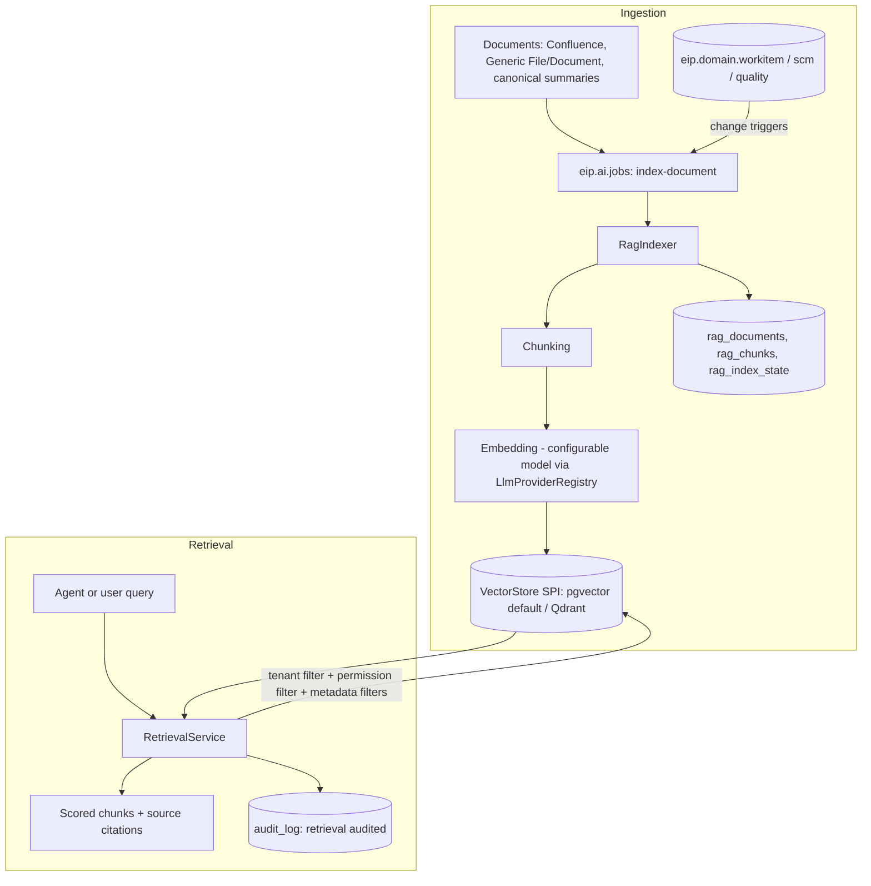
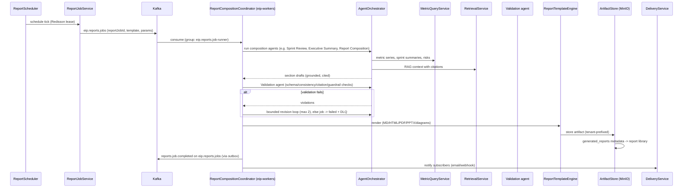
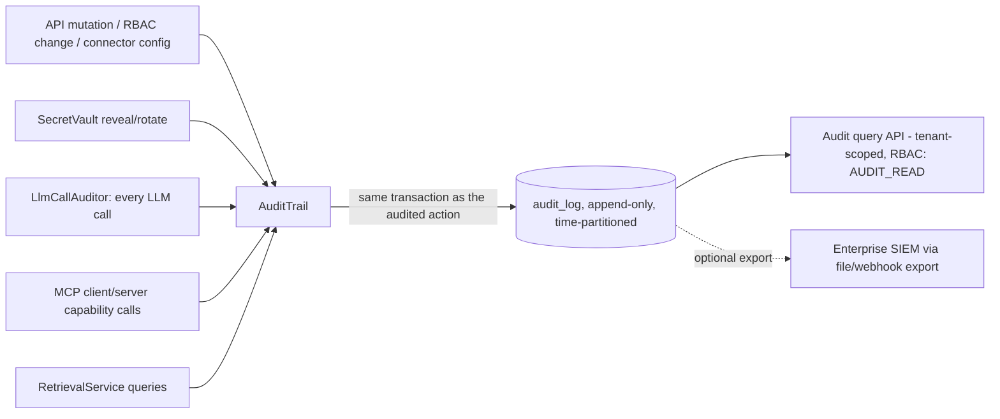

# Data Flow

This document specifies EIP's end-to-end data flows: components involved, Kafka topics, tables touched (logical names), delivery guarantees, idempotency mechanisms, failure handling, and backpressure behavior for each flow, plus data lifecycle/retention and per-flow latency budgets.

Component names refer to [ComponentModel.md](./ComponentModel.md); topic and envelope contracts to [../engineering/EventModel.md](../engineering/EventModel.md); entities to [DomainModel.md](./DomainModel.md); connector SPI semantics to [../engineering/ConnectorFramework.md](../engineering/ConnectorFramework.md).

Global invariants applying to every flow:

- **Delivery:** at-least-once end to end; idempotent consumers dedup on `eventId` (UUIDv7) via `IdempotencyGuard` (Redis fast path + `processed_events` ledger).
- **Ordering:** per key within a partition; keys follow [EventModel §7](../engineering/EventModel.md) — `tenantId:entityId` on domain topics (`tenantId:externalId` on raw, `tenantId:jobId` on job topics, `tenantId:metricKey` on metrics).
- **Envelope:** `eventId, tenantId, source, entityType, entityId, eventType, occurredAt, ingestedAt, schemaVersion, payload, traceparent` — `traceparent` gives end-to-end OTel traces across all hops.
- **Publication (ADR-017):** raw intake — sync `RawEmitter` emissions and webhook intake — produces directly to `eip.raw.<connector>`; durability comes from the staged `raw_*` row written before the produce, with the bounded `staging.webhook_intake_buffer` as the webhook-path outage buffer. All domain, analytics, and job events (`eip.domain.*`, `eip.analytics.metrics`, `eip.ai.*`, `eip.reports.*`) are published only through the transactional outbox ([EventModel §9](../engineering/EventModel.md)); `OutboxRelay` runs in both runtimes, each relaying its own writes. Backpressure-by-outbox ([EventModel §11](../engineering/EventModel.md)): sync staging pauses when the unpublished outbox backlog exceeds 500,000 rows or relay lag (`eip_outbox_lag_seconds`, alert `EipOutboxRelayStalled` at > 60 s) exceeds 300 s, and resumes below half those bounds.
- **Failure classification** (mirrors [EventModel §10](../engineering/EventModel.md)'s taxonomy, carried in the `x-eip-failure-class` header): **TRANSIENT_INFRA** (DB/Kafka/Redis/source unavailable) → the consumer pauses the partition and retries indefinitely with backoff — never DLQs; **DATA_POISON** (deserialization/validation failures) → DLQ immediately, no retry; **LOGIC_BUG** (handler logic failures) → bounded retries (1 s/10 s/60 s ×3) then DLQ + alert; **UNKNOWN_SCHEMA** (unknown major schema version) → immediate DLQ + alert (FR-038). A 5-minute infrastructure outage therefore never floods DLQs with in-flight messages.
- **DLQ:** for the DLQ-eligible classes above, messages park on the consumer group's DLQ — `<group>.dlq`, one per group, with groups named `eip.<module>.<purpose>` per [EventModel §8](../engineering/EventModel.md) (e.g. `eip.analytics.flow-metrics.dlq`) — with error-context headers; `DlqReplayService` supports operator replay, which is safe because all consumers are idempotent.
- **Tenancy:** RLS binding (`app.tenant_id`) is established from the request principal (API) or envelope `tenantId` (workers) before any table access.

## 1. Flow A — Full Sync of a New Connector

Staging raw → normalize → canonical upsert → domain events.

```mermaid
sequenceDiagram
    participant Admin as Admin (SPA)
    participant App as eip-app (ConnectorConfigService)
    participant SS as SyncScheduler
    participant SJE as SyncJobExecutor (eip-workers)
    participant Src as Source tool (e.g. Jira)
    participant RSW as RawStagingWriter
    participant K as Kafka
    participant NP as NormalizationPipeline
    participant PG as PostgreSQL

    Admin->>App: create connector instance (JSON Schema config)
    App->>App: validate(), testConnection(); credentials -> SecretVault
    App->>SS: schedule initial fullSync
    SS->>SJE: SyncJob (Redisson lease per instance)
    loop pages, rate-limited
        SJE->>Src: fetch page (token bucket, circuit breaker)
        Src-->>SJE: raw records
        SJE->>RSW: batch
        RSW->>PG: insert raw_jira (JSONB); blobs -> MinIO
        RSW->>K: produce eip.raw.jira (dedup key)
    end
    SJE->>PG: commit checkpoint (stream watermark)
    K->>NP: consume eip.raw.jira (group: eip.ingestion.workitem-normalizer)
    NP->>PG: resolve external_refs; idempotent canonical upsert (work_items, sprints, ...)
    NP->>PG: outbox_events (same transaction)
    PG-->>K: OutboxRelay -> eip.domain.workitem
```

- **Steps:** config + validation → scheduled full sync → paged extraction → raw staging → raw topic → normalization → canonical upsert + outbox → domain events.
- **Topics:** `eip.raw.jira` (example), then `eip.domain.workitem` (and `eip.domain.scm`/`eip.domain.cicd`/`eip.domain.quality`/`eip.domain.ops` for other connectors).
- **Tables:** `connector_instances`, `connector_configs`, `secrets`, `sync_jobs`, `raw_jira`, `checkpoints`, `external_refs`, `work_items`, `sprints`, `boards`, `outbox_events`.
- **Guarantees:** at-least-once at every hop; canonical writes are ACID with outbox in one transaction (no dual-write gap). On the raw path the staged `raw_*` insert commits before the direct produce (ADR-017) — a crash between them re-fetches from the checkpoint, and the source-derived dedup key absorbs the duplicates.
- **Idempotency:** raw records carry a source-derived dedup key; canonical upserts key on `ExternalRef (sourceSystem, externalId)` per tenant; re-running a full sync converges to the same state.
- **Failure handling:** page fetch failures retry with backoff+jitter; connector circuit breaker opens on persistent failure and the job resumes from the last committed checkpoint (full syncs checkpoint per stream/page-window, so they are resumable, not restart-from-zero). Normalization poison messages go to the normalizer group's DLQ (`eip.ingestion.workitem-normalizer.dlq`).
- **Backpressure:** the rate limiter paces extraction to the source's limits; Kafka absorbs producer bursts; normalization consumes at its own rate — a slow normalizer grows lag, never blocks extraction.

## 2. Flow B — Incremental Sync (Checkpoint + Rate Limit + Retry + DLQ)

```mermaid
sequenceDiagram
    participant SS as SyncScheduler
    participant CS as CheckpointStore
    participant SJE as SyncJobExecutor
    participant RL as RateLimiter (Redis)
    participant Src as Source tool
    participant K as Kafka
    participant DLQ as eip.ingestion.github-normalizer.dlq

    SS->>SJE: incremental SyncJob (lease)
    SJE->>CS: load checkpoint (connector+stream)
    CS-->>SJE: cursor = updatedSince 2026-07-06T09:15Z
    SJE->>RL: acquire permits
    SJE->>Src: fetch changes since cursor
    alt 429 / 5xx
        Src-->>SJE: rate limited
        SJE->>SJE: exponential backoff + jitter (bounded attempts)
        SJE->>Src: retry
    end
    Src-->>SJE: delta records
    SJE->>K: produce eip.raw.github (with staged raw_github insert)
    SJE->>CS: commit new checkpoint (tx with staged batch)
    Note over K: NormalizationPipeline consumes as in Flow A
    alt normalization fails after N retries
        K->>DLQ: park message + error headers
        Note over DLQ: alert fires; operator fixes, DlqReplayService replays
    end
```

- **Steps:** load checkpoint → rate-limited delta fetch (retrying transient errors) → stage + produce → atomically advance checkpoint → normalize → domain events.
- **Topics:** `eip.raw.github` (example), `eip.ingestion.github-normalizer.dlq` (the normalizer group's DLQ), then `eip.domain.scm`.
- **Tables:** `checkpoints`, `sync_jobs`, `raw_github`, `external_refs`, canonical SCM tables (`repositories`, `commits`, `pull_requests`, `code_reviews`), `outbox_events`.
- **Guarantees:** checkpoint commits with the staged batch in one transaction; a crash between produce and commit re-fetches the same delta — duplicates are absorbed by idempotent upserts (at-least-once by design).
- **Idempotency:** cursor/watermark checkpoint per connector+stream; dedup on raw record identity and `eventId` downstream.
- **Failure handling:** transient source errors → backoff+jitter retries; persistent errors → circuit breaker opens, connector marked DEGRADED, `ConnectorHealthMonitor` raises the admin alert; normalization poison messages → DLQ with replay.
- **Deletion detection:** polling cannot observe deletes, so every connector declares a deletion-detection mechanism per its [ConnectorFramework §11](../engineering/ConnectorFramework.md) catalog entry — delete webhooks and/or periodic key-set reconciliation sweeps (or an explicit "no delete signal — entities age out" declaration). Sweeps and delete webhooks emit tombstone raw records (`fetchKind: reconciliation`, `op: delete` per the ConnectorFramework §2/§7 `RawSink` contract) that flow through the same normalization path, producing canonical soft-deletes and `*.deleted` domain events (§9 "source tombstones").
- **Backpressure:** token bucket caps outbound request rate per instance; sync leases prevent overlapping jobs; if consumer lag on `eip.raw.*` exceeds threshold, `SyncScheduler` stretches sync intervals for the affected connector (feedback throttle); staging additionally pauses on the outbox backlog bound (global invariants, backpressure-by-outbox).

## 3. Flow C — Webhook / Real-Time Intake



- **Steps:** signed webhook → verify → wrap as raw record → `eip.raw.<connector>` → same normalization path as syncs (single code path for all intake).
- **Topics:** `eip.raw.<connector>`, then the appropriate `eip.domain.*`.
- **Tables:** `raw_<connector>` (webhook payloads are also staged for replay parity), canonical tables, `outbox_events`, `webhook_intake_buffer` (Kafka-outage buffering only; see failure handling).
- **Guarantees:** at-least-once — sources may redeliver webhooks; dedup on source delivery id.
- **Idempotency:** delivery-id dedup key plus canonical `ExternalRef` upserts; a webhook and a later incremental sync covering the same change converge (last-write-wins on source `updatedAt`).
- **Failure handling:** Kafka unavailable → webhook stored to `webhook_intake_buffer` (`staging.webhook_intake_buffer`, owned by `eip-ingestion` — see [ComponentModel.md](./ComponentModel.md) §4) and 202 still returned. The buffer is bounded (default cap 100,000 rows, configurable — ≈ 20 minutes of full Kafka outage at the NFR-003 burst rate of ~83 events/s): on overflow intake returns 503 problem+json so sources redeliver and polling covers the gap — the buffer never grows unboundedly. The buffer lives in PostgreSQL, so it does not help during a DB outage (DB down → 503 regardless). After broker recovery, `eip-app`'s intake drainer drains oldest-first (FIFO per instance) at a capped rate (default ≤ 1,000 records/s) that yields to live intake. Buffer depth is exported as `eip_webhook_buffer_depth` (alert `EipWebhookBufferGrowing`, [ObservabilityModel.md](./ObservabilityModel.md) §7) — depth growth is the Kafka-outage detection signal on the intake path. Unverifiable requests are rejected and audited.
- **Backpressure:** intake is O(1) per request (verify + produce); burst absorption is Kafka's job. Per-instance rate limits protect against webhook storms; the bounded buffer's 503 overflow response is the intake path's final backpressure valve.

## 4. Flow D — Metric Computation Pipeline

Domain events → metric engine → projector-maintained read models → dashboard API.



- **Steps:** domain event → `IdempotencyGuard` → `MetricEngine` updates `metric_facts` at the metric's grain → emits metric-updated events on `eip.analytics.metrics` → `ReadModelProjector` (consumer group `eip.analytics.read-models`, which also owns dashboard-cache warming) refreshes affected `rm_*` aggregates → dashboard API serves from read models (Redis-cached). `metric_facts` and `rm_*` are plain projector-maintained tables with RLS enabled — PostgreSQL materialized views are forbidden for tenant-scoped data (ADR-015).
- **Topics:** consumes all five `eip.domain.*` (metric engines) and `eip.analytics.metrics` (read-model projector); produces `eip.analytics.metrics`; one DLQ per analytics consumer group (`eip.analytics.<purpose>.dlq`, e.g. `eip.analytics.flow-metrics.dlq`, `eip.analytics.read-models.dlq`).
- **Tables:** `processed_events`, `metric_facts`, `rm_team_flow_daily`, `rm_sprint_summary`, `rm_dora_daily`, `rm_quality_snapshot`, `rm_ops_health`, `analytics_watermarks`, `metric_definitions`.
- **Guarantees:** at-least-once; per-entity ordering ensures state-transition metrics (cycle time, blocked time) see transitions in order.
- **Idempotency:** dedup on `eventId` (the analytics groups are `processed_events`-ledger users — [ComponentModel.md](./ComponentModel.md) §9); fact updates are deterministic merges (recomputing from the same event is a no-op); read models are rebuildable by topic replay from `analytics_watermarks` plus canonical recompute through the analytics read-only grant ([ArchitectureOverview.md](./ArchitectureOverview.md) §5 rule 4).
- **Failure handling:** malformed events → analytics DLQ; a projector bug is fixed and read models rebuilt by replay without touching canonical data; dashboards keep serving the last projected state throughout.
- **Backpressure:** lag on domain topics only delays metric freshness (staleness indicator in UI); dashboard read path is unaffected by ingestion volume by construction (CQRS-lite, ADR-011).

## 5. Flow E — Risk Detection



- **Steps:** metric change triggers scoring → multi-signal risk model computes scores with confidence → `risk_assessments` upsert → risk-detected event → optional Delivery Risk agent narrative (explains contributing signals, uncertainty, and limitations — per the anti-toxic-ranking stance).
- **Topics:** consumes/produces `eip.analytics.metrics`; produces `eip.ai.jobs`; narrative returns on `eip.ai.results`.
- **Tables:** `metric_facts`, `rm_*`, `risk_assessments`, `agent_runs`, `llm_calls`.
- **Guarantees:** at-least-once; scoring is deterministic per input watermark so replays converge.
- **Idempotency:** `risk_assessments` keyed by (tenant, scope, riskType, evaluationWindow); duplicate triggers re-score to the same row.
- **Failure handling:** scoring errors DLQ without blocking metric flow; LLM narrative failure degrades to score-only display (never blocks the risk itself).
- **Backpressure:** narrative jobs are budget-capped and queue on `eip.ai.jobs`; scoring itself is cheap and inline with analytics consumption.

## 6. Flow F — RAG Ingestion and Retrieval



- **Steps (ingestion):** document event or scheduled re-index → index job on `eip.ai.jobs` → fetch content (MinIO/canonical) → chunk → embed → upsert vectors + chunk metadata → advance `rag_index_state`. Incremental re-indexing replaces only chunks of changed documents; scheduled full re-index runs off-peak.
- **Steps (retrieval):** query → embed query → vector search constrained by `tenantId` and caller permission filters + metadata filters → return chunks with source citations → audit the retrieval.
- **Topics:** `eip.ai.jobs` (index jobs), `eip.ai.rag-indexer.dlq` (the indexer group's DLQ).
- **Tables:** `rag_documents`, `rag_chunks`, `rag_embeddings` (pgvector default; Qdrant collection when configured), `rag_index_state`, `audit_log`, `llm_calls` (embedding calls audited).
- **Guarantees:** at-least-once indexing; retrieval is a synchronous read.
- **Idempotency:** chunks keyed by (documentId, contentHash, chunkIndex); re-indexing an unchanged document is a no-op; changed documents delete-then-insert by `DocumentSourceId`.
- **Failure handling:** embedding-provider failure → provider fallback chain, then job retry/DLQ; retrieval failure degrades agents to non-RAG context with explicit "citations unavailable" notice.
- **Backpressure:** indexing is queue-paced and yields to interactive AI jobs (consumer priority via separate worker pools); embedding calls respect per-provider token budgets and circuit breakers.

## 7. Flow G — Scheduled Report Generation via Agents

Report job → agents → validation agent → artifact store → library.



- **Steps:** schedule fires once (lease) → job on `eip.reports.jobs` → coordinator drives composition agents with metric + RAG inputs → Validation agent gates output → template engine renders → `ArtifactStore` persists to MinIO + `generated_reports` → library + notifications.
- **Topics:** `eip.reports.jobs` (job requests — from API/schedules and the Report Composition agent — plus job status events like `reports.job.completed`; topic owned by `eip-reports`), `eip.ai.results` (consumed for asynchronous agent outputs), `eip.reports.job-runner.dlq` (the report workers' group DLQ).
- **Tables:** `report_schedules`, `report_jobs`, `report_templates`, `agent_runs`, `agent_steps`, `llm_calls`, `generated_reports`, `report_subscriptions`; binaries in MinIO.
- **Guarantees:** at-least-once job delivery; job state machine (`PENDING → RUNNING → VALIDATING → RENDERED → DELIVERED | FAILED`) in `report_jobs`. This process state machine is distinct from the artifact-level `GeneratedReport` status (`QUEUED | GENERATING | READY | FAILED`, see [DomainModel.md](./DomainModel.md)); mapping: `PENDING` ↔ `QUEUED`, `RUNNING`/`VALIDATING` ↔ `GENERATING`, `RENDERED`/`DELIVERED` ↔ `READY`, `FAILED` ↔ `FAILED`.
- **Idempotency:** jobs keyed by `reportJobId`; a redelivered job in a terminal state is skipped; artifact writes are content-addressed (same input → same object key), so duplicate renders don't duplicate library entries.
- **Failure handling:** LLM failures → provider fallback → bounded retries → DLQ with job marked FAILED and operator-visible reason; validation failures allow a bounded revision loop (max 2) before failing — never silently shipping unvalidated AI output; MinIO failure fails fast to DLQ for replay.
- **Backpressure:** report jobs are budget-capped (tokens, wall-clock) and queue behind interactive agent traffic; schedules that repeatedly overrun are flagged in admin UI rather than piling up (scheduler skips a tick if the previous run is still active).

## 8. Flow H — Audit Event Flow



- **Steps:** audited action → `AuditTrail.record()` in the same transaction as the action (an unaudited mutation cannot commit) → append-only `audit_log` → tenant-scoped query API and optional SIEM export.
- **Topics:** none required for correctness — audit is transactional with the action; worker-side audited actions (LLM calls, retrievals) write via the same component in their own transactions.
- **Tables:** `audit_log` (append-only, time-partitioned, no UPDATE/DELETE grants), `llm_calls` (detailed LLM telemetry: prompt redacted per policy, model, tokens, cost, latency).
- **Guarantees:** exactly-once per audited action (transactional coupling); LLM call audits are at-least-once with dedup on call id.
- **Idempotency:** audit entries carry the action's idempotency key/eventId; replayed consumer actions produce audit entries deduplicated on that key.
- **Failure handling:** audit write failure aborts the audited mutation (fail-closed for mutations); for high-volume read audits (retrievals) a bounded async buffer is used with loss alarms (fail-open with detection, to avoid making audit a read-path availability dependency).
- **Backpressure:** audit writes are single-row inserts on a partitioned table; volume scales with actions already bounded by rate limits and budgets.

## 9. Data Lifecycle and Retention

The authoritative retention policy table lives in [SecurityModel.md](./SecurityModel.md) §7; the table below restates the canonical defaults for pipeline context — where the two differ, SecurityModel governs.

| Data class | Store | Contents | Default retention | Disposal / notes |
|-----------|-------|----------|-------------------|------------------|
| Raw staging | `raw_*` JSONB (time-partitioned) + MinIO blobs | Verbatim source payloads | 90 days (NFR-070 default; configurable per tenant/connector) | Partition drop + object lifecycle rule; long enough to re-normalize after mapper fixes |
| Raw topics | `eip.raw.<connector>` | In-flight raw records | 7 days topic retention | Kafka retention; replays beyond 7 days re-normalize from `raw_*` tables |
| Canonical model | `work_items`, SCM/CI-CD/quality/ops tables, `external_refs` | Normalized source of truth | Indefinite by default (NFR-070); tenant policy may shorten. Soft-delete via source tombstones — delete webhooks and periodic key-set reconciliation sweeps emit tombstone raw records (`fetchKind: reconciliation`, `op: delete` per [ConnectorFramework §2/§7](../engineering/ConnectorFramework.md)) that normalize to canonical soft-deletes and `*.deleted` domain events | Tenant offboarding = RLS-scoped purge job; GDPR-style member erasure remaps to anonymized principals |
| Domain topics | `eip.domain.*` | Domain event stream | 30 days | Read models rebuild from canonical if replay window is exceeded |
| DLQ topics | `<group>.dlq` | Parked failed envelopes + failure metadata | 30 days topic retention | Undrained DLQ messages are permanently lost after retention — drain alerts fire long before (see [ObservabilityModel.md](./ObservabilityModel.md) §7); same number stated in OperationsGuide §3.1/§10 |
| Analytics facts | `metric_facts` (partitioned) | Metric grains | Indefinite by default (NFR-070); tenant policy may shorten (example policies in [SecurityModel.md](./SecurityModel.md) §7) | Partition drop when tenant policy shortens; coarser rollups retained indefinitely |
| Read models | `rm_*` | Dashboard aggregates | Derived — rebuildable at will | Never backed up individually; rebuilt by replay |
| RAG index | `rag_chunks`/`rag_embeddings` (pgvector) or Qdrant | Chunks + vectors | Derived from documents; pruned on source deletion | Re-indexable from sources; deletion propagates within one index cycle |
| AI telemetry | `agent_runs`, `agent_steps`, `llm_calls` | Runs, steps, redacted prompts, tokens/cost | 13 months | Cost rollups retained; step payloads pruned |
| Artifacts | MinIO + `generated_reports` | Rendered reports/exports | 24 months (configurable per tenant) | Object lifecycle + metadata soft-delete; library shows expiry |
| Audit | `audit_log` | Append-only audit entries | 25 months minimum (compliance-driven, configurable upward only) | Export to SIEM; partitions archived, never edited |
| Dedup ledger | `processed_events` | Consumed eventIds | 35 days | Must exceed max domain-topic retention (30 d) + replay window |
| Checkpoints | `checkpoints` | Sync cursors | Life of connector instance | Deleted with instance |

**Object-storage tenancy (ADR-018, stated identically in [SecurityModel.md](./SecurityModel.md) §5):** all MinIO access goes through the shared buckets `eip-ingest` (raw blobs, ingested files) and `eip-artifacts` (rendered reports/exports) with a mandatory tenant-id key prefix (`<tenantId>/...`). Scoping is application-enforced in the single storage service, and every access is audited. Per-tenant MinIO credentials are not used — an accepted risk mitigated by the periodic storage-prefix isolation test in the NFR-041 suite. Object lifecycle rules (retention table above) apply per bucket and prefix.

Budgets are p95 targets at the reference scale (ArchitectureOverview §1 D3 / NFR-003: sustained 100,000 raw events/hour with a 3× burst — 300,000/hour — for 15 minutes, plus ~10× internal design headroom (≈ 300 events/s) for domain-event fan-out and replay; 2,000 sync jobs/hour). "Freshness" flows are event-time to visible-state; interactive flows are request to response.

| Flow | Path measured | p95 budget | Dominant cost | Overload behavior |
|------|---------------|-----------|---------------|-------------------|
| A. Full sync (new connector) | Job start → canonical complete | Rate-limit bound; target ≥ 50 records/s/instance sustained; 100k-item Jira ≤ 60 min | Source API rate limits | Longer sync, progress % visible; never impacts dashboards |
| B. Incremental sync | Source change → canonical upsert | ≤ poll interval + 5 min (NFR-012); pipeline itself ≤ 10 s | Sync interval | Intervals stretch under lag; staleness indicator |
| C. Webhook intake | Webhook receipt → canonical upsert | ≤ 60 s end-to-end (NFR-012); intake-ack stage: 202 response ≤ 500 ms | Normalization consume | Lag grows; intake stays O(1) |
| D. Metric pipeline | Domain event → read model visible | ≤ 30 s | Projector batching | Freshness degrades; dashboards serve last state |
| D'. Dashboard API | Request → response (cached / uncached) | ≤ 200 ms / ≤ 800 ms | `rm_*` query | Redis bypass adds DB load only |
| E. Risk detection | Metric event → risk_assessment row | ≤ 60 s (score); narrative ≤ 5 min async | Multi-signal reads; LLM | Score-only display if LLM degraded |
| F. RAG indexing | Document change → searchable | ≤ 10 min incremental | Embedding throughput | Queue grows; retrieval unaffected |
| F'. RAG retrieval | Query → cited chunks | ≤ 700 ms (excl. LLM) | Vector search | Top-K reduced under pressure |
| G. Report generation | Job start → artifact in library | ≤ 10 min typical, ≤ 30 min budget cap | LLM composition + validation | Job queues; overrun ticks skipped |
| H. Audit | Action → durable audit row | Same transaction (0 added user-visible latency ≤ 10 ms) | Row insert | Buffered for read audits with loss alarms |

Budgets are enforced observationally: each flow emits OTel spans linked via `traceparent`, Micrometer gauges for consumer lag and freshness, and Grafana dashboards in `/infra/grafana` alert at 80% of budget.
