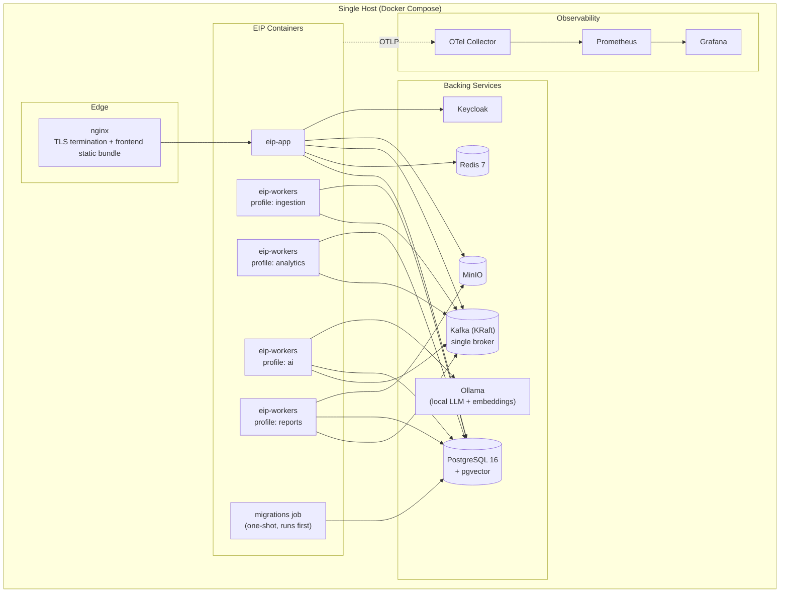
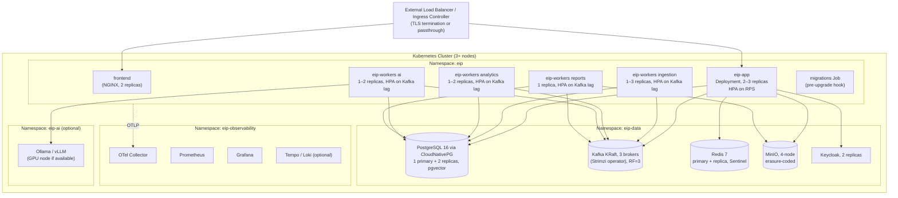
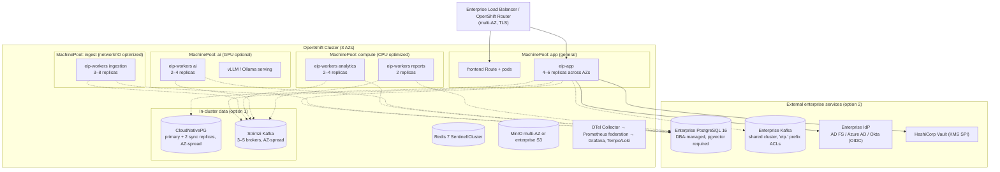
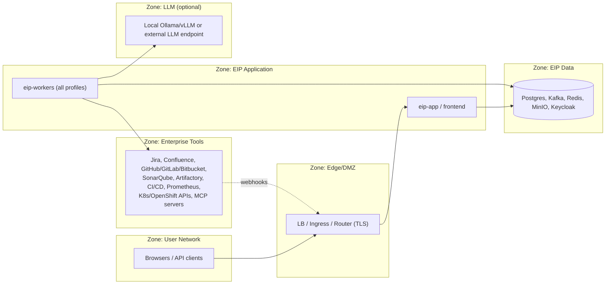

# Deployment Model

This document defines the supported deployment topologies for the Engineering Intelligence Platform (EIP), the deployable units that compose every topology, sizing guidance, scaling behavior, air-gapped installation, upgrade strategy, HA/DR targets, network zoning, environment configuration, and on-prem TLS management. EIP is on-premise first: no SaaS dependency exists except optional, configurable LLM providers, and every topology below runs fully air-gapped with local LLMs (Ollama/vLLM).

Related documents: `../architecture/SecurityModel.md`, `../architecture/ObservabilityModel.md`, `../operations/OperationsGuide.md`.

## 1. Deployable Units

EIP is a Java 21 / Spring Boot 3.x modular monolith (Spring Modulith conventions) plus separately deployable worker processes. The same container image family is used across all topologies; topology only changes replica counts, resource classes, and the backing infrastructure services.

| Unit | Artifact | Contents | Notes |
|---|---|---|---|
| `eip-app` | Container image `eip/app` | Composition root: REST API `/api/v1` (OpenAPI 3 via springdoc), tenancy/RBAC/audit, connector management, dashboard query APIs, webhook intake | Stateless; scales horizontally on RPS |
| `eip-workers` | Container image `eip/workers` | Async worker runtime hosting Kafka consumers; started with a `WORKER_PROFILE` | One image, four profiles (below) |
| — profile `ingestion` | `WORKER_PROFILE=ingestion` | Connector sync engine, raw staging writers, normalizers, checkpointing, dedup | Consumes `eip.raw.<connector>`, produces `eip.domain.*` |
| — profile `analytics` | `WORKER_PROFILE=analytics` | Metric engines (flow, DORA, quality, delivery risk, ops, team health), risk scoring | Consumes `eip.domain.*`, produces `eip.analytics.metrics` |
| — profile `ai` | `WORKER_PROFILE=ai` | Agent runtime, LLM provider SPI, RAG indexing/retrieval, MCP client/server | Consumes `eip.ai.jobs`, produces `eip.ai.results` |
| — profile `reports` | `WORKER_PROFILE=reports` | Report/template engine, exports, artifact writes to object storage | Consumes `eip.reports.jobs` |
| Frontend | Static bundle (React 18 + TypeScript + Vite) | Admin UI + dashboards (ECharts) | Served by NGINX sidecar/container or the platform ingress; no server-side runtime |
| Migrations job | Container image `eip/app` with `--migrate-only` | Flyway migrations against PostgreSQL 16 | Runs to completion before app/worker rollout (Compose: one-shot service; K8s/OpenShift: `Job` + Helm/Kustomize pre-upgrade hook) |
| Optional Python AI workers | Container image `eip/ai-python` | Optional AI workers only, isolated behind Kafka queues/REST | Default AI orchestration is Java + LangChain4j; deploy only when a Python-only model runtime is required |

Backing services in every topology: PostgreSQL 16 (with pgvector; Qdrant optional via VectorStore SPI), Redis 7, Apache Kafka (KRaft), MinIO or other S3-compatible object storage, Keycloak (or enterprise IdP), and the observability stack (OTel Collector, Prometheus, Grafana, optional Tempo/Loki).

## 2. Topology A — Single-Node Docker Compose (Demo / Evaluation)

Source: `/infra/docker-compose`. Everything runs on one host. Suitable for demos, evaluations, and development — not for production (no HA, single failure domain).

Characteristics:

- All four worker profiles may be collapsed into a single `eip-workers` container (`WORKER_PROFILE=ingestion,analytics,ai,reports`) for minimal footprint.
- Kafka runs as a single KRaft broker; replication factor 1.
- Simulation connectors (`/simulation` data packs, later phase) make the demo self-contained without real tool endpoints.
- Ollama serves both chat and embedding models locally; no egress required.

## 3. Topology B — Small-Production Kubernetes (Single Cluster)

Source: `/infra/kubernetes` (Kustomize base + `small-prod` overlay). One Kubernetes cluster, HA within the cluster.

Characteristics:

- PostgreSQL is managed by an operator (CloudNativePG recommended): synchronous replica, automated failover, scheduled base backups + WAL archiving to MinIO.
- Kafka via Strimzi (or equivalent): 3 KRaft brokers, replication factor 3, `min.insync.replicas=2` for all `eip.` topics.
- Pod anti-affinity spreads replicas of each Deployment across nodes; PodDisruptionBudgets keep at least 1 replica of `eip-app` and each worker profile during node drains.
- KEDA (or Prometheus-adapter HPA) drives worker autoscaling on `eip_kafka_consumer_lag` (see Section 6).

## 4. Topology C — Large-Enterprise OpenShift (Multi-AZ)

Source: `/infra/kubernetes` OpenShift overlay plus OpenShift notes. Targets Phase 5 (Enterprise hardening) deployments: multi-AZ OpenShift, dedicated worker pools, and the option to use externally managed enterprise PostgreSQL and Kafka instead of in-cluster operators.

Characteristics:

- Dedicated worker pools: ingestion on network/IO-optimized nodes, analytics/reports on CPU-optimized nodes, AI on GPU nodes (GPU is optional — CPU inference via Ollama is supported at reduced throughput).
- External Postgres/Kafka option: EIP requires PostgreSQL 16 with `pgvector` installed and the ability to enable RLS; on shared enterprise Kafka, EIP requires topic-create rights (or pre-created topics) under the `eip.` prefix and dedicated consumer-group ACLs.
- OpenShift specifics: images run as arbitrary UID (`restricted-v2` SCC compatible), Routes instead of Ingress, `ServiceMonitor` objects for the in-cluster Prometheus, and `NetworkPolicy` objects per namespace (Section 9).
- Keycloak may be replaced entirely by the enterprise IdP over OIDC; local accounts remain as break-glass fallback.

## 5. Sizing Guidance

Baseline assumption: 1 tenant ≈ 500 developers, ~20 connectors, ~2M domain events/day unless stated. Storage is for 13 months of hot retention (see `../architecture/SecurityModel.md` §7 for retention policy).

| Component | A: Compose (demo) | B: Small-prod K8s | C: Enterprise OpenShift |
|---|---|---|---|
| Host/node count | 1 host: 8 vCPU / 32 GB / 250 GB SSD | 3–5 nodes: 8 vCPU / 32 GB each | 9+ nodes across 3 AZs, pool-specific sizes |
| `eip-app` | 1× (1 vCPU / 2 GB) | 2–3× (2 vCPU / 4 GB) | 4–6× (4 vCPU / 8 GB) |
| `eip-workers` ingestion | shared 1× (1 vCPU / 2 GB) | 1–3× (2 vCPU / 4 GB) | 3–8× (4 vCPU / 8 GB) |
| `eip-workers` analytics | (shared) | 1–2× (2 vCPU / 4 GB) | 2–4× (8 vCPU / 16 GB) |
| `eip-workers` ai | (shared) | 1–2× (2 vCPU / 8 GB) | 2–4× (4 vCPU / 16 GB) |
| `eip-workers` reports | (shared) | 1× (1 vCPU / 2 GB) | 2× (2 vCPU / 4 GB) |
| PostgreSQL 16 | 2 vCPU / 4 GB / 50 GB | 3× (4 vCPU / 16 GB / 200 GB SSD) | 3× (8–16 vCPU / 64 GB / 1–4 TB NVMe) or external |
| Kafka | 1 broker: 1 vCPU / 2 GB / 20 GB | 3 brokers: 2 vCPU / 8 GB / 100 GB each | 3–5 brokers: 4 vCPU / 16 GB / 500 GB each or external |
| Redis 7 | 0.5 vCPU / 1 GB | 2× (1 vCPU / 4 GB) | 3+× (2 vCPU / 8 GB) |
| MinIO / S3 | 0.5 vCPU / 1 GB / 50 GB | 4× (1 vCPU / 4 GB / 250 GB) | multi-AZ, 2+ TB usable, or enterprise S3 |
| Keycloak / IdP | 1× (1 vCPU / 1 GB) | 2× (1 vCPU / 2 GB) | 2–3× or external enterprise IdP |
| LLM serving (Ollama/vLLM) | 4 vCPU / 8 GB (7B quantized, CPU) | 1 GPU node (24 GB VRAM) or 8 vCPU / 32 GB CPU | 2+ GPU nodes (48–80 GB VRAM) for vLLM |
| Observability stack | 1 vCPU / 2 GB / 20 GB | 2 vCPU / 8 GB / 100 GB | 4+ vCPU / 16 GB / 500 GB (federated) |

## 6. Scaling Model

| Unit | Signal | Mechanism | Bounds (small-prod defaults) |
|---|---|---|---|
| `eip-app` | Request rate + p95 latency (`eip_api_request_duration_seconds`) | HPA on RPS via custom metric (Prometheus adapter), fallback CPU 70% | min 2, max 6 |
| `eip-workers` ingestion | Kafka consumer lag on `eip.raw.*`, `eip.domain.*` (`eip_kafka_consumer_lag`) | KEDA ScaledObject / HPA on lag threshold (e.g. lag > 10k per replica) | min 1, max 8 |
| `eip-workers` analytics | Lag on `eip.domain.*` → `eip.analytics.metrics` | KEDA/HPA on lag | min 1, max 4 |
| `eip-workers` ai | Lag on `eip.ai.jobs` | KEDA/HPA on lag; ceiling additionally bounded by LLM serving capacity and per-tenant token budgets | min 1, max 4 |
| `eip-workers` reports | Lag on `eip.reports.jobs` | KEDA/HPA on lag | min 1, max 3 |
| Kafka partitions | Peak per-key throughput | Partitions per topic sized so max worker replicas ≤ partition count (default 12 partitions on high-volume topics); ordering preserved per key `tenantId+entityId` | resize requires planned change |
| PostgreSQL | Connection count, replication lag | Vertical scaling + read replicas for dashboard queries; PgBouncer/connection pool in front | operator-managed |
| Frontend | RPS | Replica count on the static server; content is cacheable | min 2 |

Scaling rules of thumb: workers are the elastic tier (consumers are idempotent, at-least-once, dedup on `eventId`, so scale-out is safe); `eip-app` scales on interactive load; databases scale vertically first.

## 7. Air-Gapped Installation

EIP must run with zero internet egress. The air-gapped procedure:

1. **Image mirroring.** All images (EIP images, PostgreSQL/CloudNativePG, Strimzi/Kafka, Redis, MinIO, Keycloak, NGINX, OTel Collector, Prometheus, Grafana, Ollama/vLLM) are published in a versioned release manifest (`images.yaml`) with digests. Mirror with `oc mirror`, `skopeo copy --all`, or `crane` into the enterprise registry; deployments reference images by digest through a single registry-prefix variable in the Kustomize overlay.
2. **Offline model bundles.** LLM chat models and embedding models are shipped as offline bundles: Ollama model blobs (exported via `ollama pull` on a connected staging host, packaged as an OCI artifact or tarball, imported into the air-gapped Ollama model dir) and Hugging Face-format weights for vLLM and the embedding model, mounted as PVC/volume content. The release manifest lists tested model/version pairs; the RAG embedding model version is recorded per index so re-indexing is triggered on model change.
3. **Charts/manifests.** Kustomize bases and overlays are shipped in the release archive; no remote bases.
4. **Dependency-free runtime.** No container downloads anything at start: JDBC drivers, fonts for report/PDF rendering, and dashboard assets are baked into images.
5. **Verification.** Post-mirror checklist: verify image signatures (cosign, see `../architecture/SecurityModel.md` §10), run the migrations job against a staging DB, start with simulation connectors, confirm `NetworkPolicy` default-deny egress shows no drops other than expected.

Air-gapped constraint on features: external LLM providers (OpenAI-compatible, Anthropic-compatible) are simply not configured; the LLM provider SPI routes all tenants/agents to local Ollama/vLLM endpoints.

## 8. Upgrade Strategy

- **Rolling upgrades.** `eip-app` and `eip-workers` use rolling Deployments (`maxUnavailable: 0`, `maxSurge: 1` for app). Kafka consumers rebalance on rollout; at-least-once + idempotent consumers make this safe. Frontend bundles are versioned; the app serves API version `/api/v1` compatibly across one minor-version skew between frontend and backend.
- **Expand–contract DB migrations.** Flyway migrations are strictly expand–contract:
  1. *Expand* (release N): additive changes only — new columns nullable/defaulted, new tables, dual-write where needed. Old and new code both run correctly.
  2. *Migrate/backfill* (release N, async): backfill jobs run as workers, chunked and resumable.
  3. *Contract* (release N+1 or later): drop/rename only after no running code references the old shape.
  The migrations job runs before rollout (pre-upgrade hook) and is gated: it refuses to run if a pending migration is marked `contract` while the previous app version is still deployed (version handshake table).
- **Order of operations.** migrations job → `eip-app` → workers (ingestion, analytics, ai, reports) → frontend. Rollback: redeploy previous images; expand-phase schemas remain compatible, so DB rollback is not required. Backing services (Postgres/Kafka operators) upgrade on their own operator-managed cadence, decoupled from EIP releases.
- **Kafka schema evolution.** Event envelope carries `schemaVersion`; consumers tolerate unknown fields and support N-1 payload versions.

## 9. High Availability and Disaster Recovery

Targets (small-prod defaults; enterprise deployments may tighten via the same mechanisms):

| Objective | Small-prod K8s | Enterprise OpenShift |
|---|---|---|
| RPO (Postgres) | ≤ 5 min (WAL archiving) | ≤ 1 min (sync replica + WAL) or per enterprise DBA SLA |
| RPO (Kafka) | 0 within cluster (RF=3, acks=all) | 0 within cluster; cross-site per MirrorMaker2 policy |
| RPO (object storage) | ≤ 24 h (scheduled bucket replication/backup) | ≤ 15 min (multi-AZ MinIO or enterprise S3 replication) |
| RTO (full platform) | ≤ 4 h | ≤ 1 h |
| Availability SLO (API) | 99.5%/30d | 99.9%/30d (see `../architecture/ObservabilityModel.md` §8) |

Component failover behavior:

| Component | Failure | Behavior | Data impact |
|---|---|---|---|
| `eip-app` replica | Pod/node loss | LB removes instance; sessions unaffected (stateless, token-based) | None |
| `eip-workers` replica | Pod/node loss | Kafka group rebalance; another replica resumes from committed offsets | None; possible reprocessing, absorbed by idempotent dedup on `eventId` |
| PostgreSQL primary | Instance loss | Operator promotes replica (CloudNativePG), ~30–60 s write outage; apps reconnect via service endpoint | In-flight transactions rolled back; RPO 0 with sync replica |
| Kafka broker | Broker loss | Partition leadership moves (RF=3, min ISR 2); producers with `acks=all` retry | None |
| Redis primary | Instance loss | Sentinel failover; Redisson locks re-acquired; cache is warm-up-only data | Cache misses; rate-limit counters may reset (fail-open documented) |
| MinIO node | Node loss | Erasure coding tolerates configured parity loss | None within parity |
| Keycloak/IdP | Outage | New logins fail; existing tokens valid until expiry; local break-glass admin available | None |
| LLM endpoint | Outage | LLM provider SPI fallback chain (per-tenant/per-agent routing); AI jobs retry with backoff, then park in `eip.ai.jobs.<group>.dlq` | Delayed AI outputs; no data loss |
| Connector target (Jira, GitHub, …) | Outage | Sync pauses at last checkpoint; `eip_connector_health` degrades; resumes incrementally | None; freshness SLO at risk |

DR: restore order is Postgres (PITR from base backup + WAL) → object storage bucket restore → Kafka topics recreated (event stream is rebuildable: connectors re-sync from checkpoints, or full re-sync as last resort) → redeploy manifests from the versioned release archive. Runbooks live in `../operations/OperationsGuide.md`.

## 10. Network Zones, Ingress and Egress

Required flows (default-deny everything else via `NetworkPolicy`):

| Direction | From → To | Port/Protocol | Purpose |
|---|---|---|---|
| Ingress | Users → LB → frontend/`eip-app` | 443/HTTPS | UI, `/api/v1`, OIDC redirects |
| Ingress | Tool endpoints → LB → `eip-app` | 443/HTTPS | Webhook intake (where supported), OTLP intake connector |
| Internal | app/workers → Postgres | 5432/TLS | Primary store |
| Internal | app/workers → Kafka | 9093/TLS | Event pipeline (`eip.` topics) |
| Internal | app/workers → Redis | 6380/TLS | Cache, Redisson locks, rate-limit state |
| Internal | app/workers → MinIO | 9000/TLS | Artifacts, raw blobs |
| Internal | app → Keycloak/IdP | 443/HTTPS | OIDC token/JWKS |
| Internal | all → OTel Collector | 4317/gRPC-TLS | Telemetry |
| Egress | `eip-workers` ingestion → configured connector endpoints only | 443/HTTPS | Tool sync (Jira, GitHub, SonarQube, …) |
| Egress | `eip-workers` ai → configured LLM endpoint only (optional) | 443/HTTPS | External LLM provider, if enabled |
| Egress | `eip-workers` ai → allow-listed enterprise MCP servers | 443/HTTPS | MCP client connections |

There is **no other outbound traffic**: no telemetry phone-home, no license checks, no dependency downloads. Egress destinations are exactly the tenant-configured connector endpoints plus the optional LLM endpoint and allow-listed MCP servers, and the egress `NetworkPolicy` is generated from that configuration.

## 11. Environment Configuration Strategy

12-factor configuration; identical images across environments.

- **Env vars** for non-secret config: profile selection (`WORKER_PROFILE`), endpoints (`EIP_DB_HOST`, `EIP_KAFKA_BOOTSTRAP`, `EIP_REDIS_URL`, `EIP_S3_ENDPOINT`, `EIP_OIDC_ISSUER_URI`, `EIP_OTEL_EXPORTER_OTLP_ENDPOINT`), feature flags, tuning. Naming convention `EIP_*`, mapped to Spring properties.
- **Mounted secrets** for credentials: Kubernetes `Secret` volumes (files, not env vars, to avoid exposure via `/proc` and crash dumps) — DB password, Kafka credentials, S3 keys, OIDC client secret, and the KMS master key when the `env/file` KMS SPI provider is used. With the Vault KMS SPI provider, only the Vault auth material is mounted (or Kubernetes auth is used) and data keys are unwrapped at runtime.
- **Connector/tenant secrets** (tool tokens, webhook secrets) are never in env/manifests: they are stored in Postgres under AES-256-GCM envelope encryption (see `../architecture/SecurityModel.md` §6) and managed via the admin UI/API.
- **Per-environment overlays**: `/infra/kubernetes` Kustomize overlays (`demo`, `small-prod`, `openshift-enterprise`) change only replicas, resources, storage classes, ingress hosts, and the registry prefix — never application logic.
- **Config precedence**: baked defaults < profile YAML < env vars < mounted config files. Startup fails fast on missing required config (no silent defaults for endpoints or keys).

## 12. Certificate and TLS Management On-Prem

- **TLS everywhere**: user → LB, LB → app, app/workers → Postgres/Kafka/Redis/MinIO/Keycloak, OTLP, and worker → tool/LLM egress. Minimum TLS 1.2, prefer 1.3.
- **Issuance**: cert-manager with an enterprise CA issuer (ACME to an internal CA, Vault PKI, or CA/intermediate provided as a secret). Docker Compose topology ships a `scripts/` helper that generates a local CA and certs for evaluation.
- **Trust**: the enterprise root CA bundle is mounted into all EIP containers (JVM truststore built at startup from the mounted PEM bundle); required because connector endpoints (Jira, GitHub Enterprise, SonarQube, …) commonly use enterprise-issued certificates. Per-connector additional CA and (where required) mTLS client certificates are configurable in the connector configuration schema.
- **Rotation**: cert-manager renews automatically; EIP watches mounted cert files and hot-reloads server TLS without restart. Truststore updates roll via normal Deployment restart.
- **Validation is never disabled**: connector config offers *additional trust anchors*, not an "insecure skip verify" switch; simulation/mock mode is the supported path for endpoint-less testing.

## 13. Acceptance Criteria

- [ ] Given the Compose topology on a single 8 vCPU/32 GB host, when `docker compose up` completes, then migrations run first, all services become healthy, and simulation connectors ingest without any internet egress.
- [ ] Given the small-prod K8s topology, when a node hosting the Postgres primary is drained, then failover completes within 60 s and no acknowledged domain event is lost (RPO 0 with sync replica).
- [ ] Given ingestion lag above the KEDA threshold, when lag persists for the configured window, then ingestion workers scale out up to max replicas and lag returns below threshold.
- [ ] Given an air-gapped cluster with mirrored images and offline model bundles, when the release manifest digests are verified, then installation completes with default-deny egress and all AI features function on local models.
- [ ] Given release N+1 with expand-phase migrations, when the migrations job and rolling rollout run, then zero-downtime upgrade completes and rollback to release N requires no database restore.
- [ ] Given the network zone model, when egress policies are generated, then the only outbound destinations are tenant-configured connector endpoints, allow-listed MCP servers, and the optional LLM endpoint.
