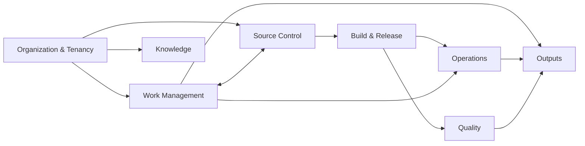
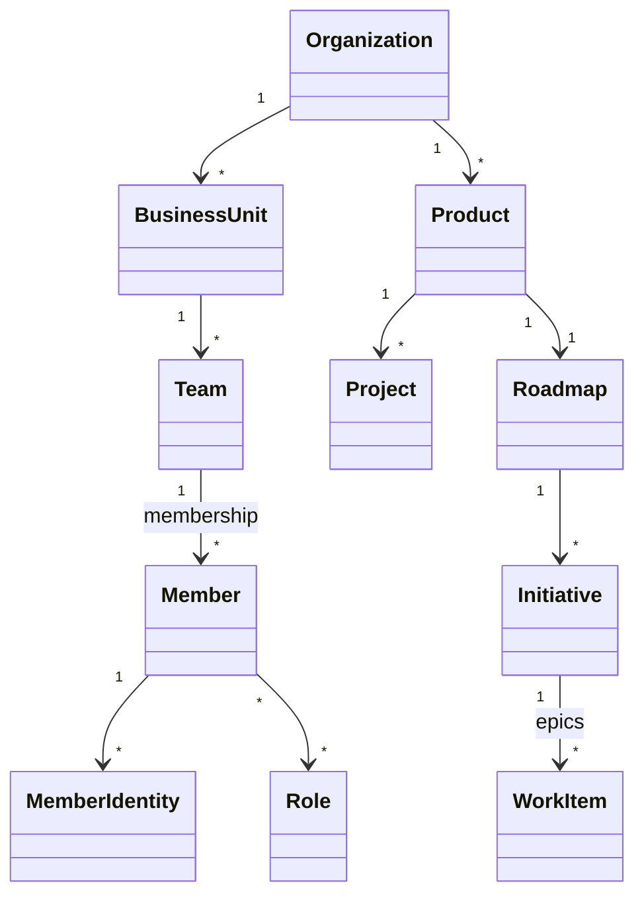
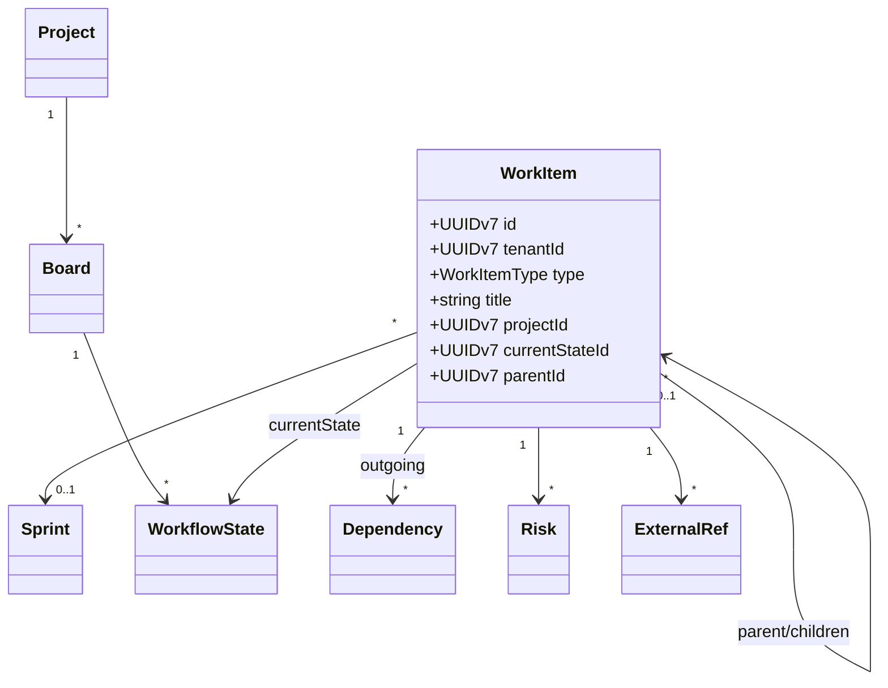
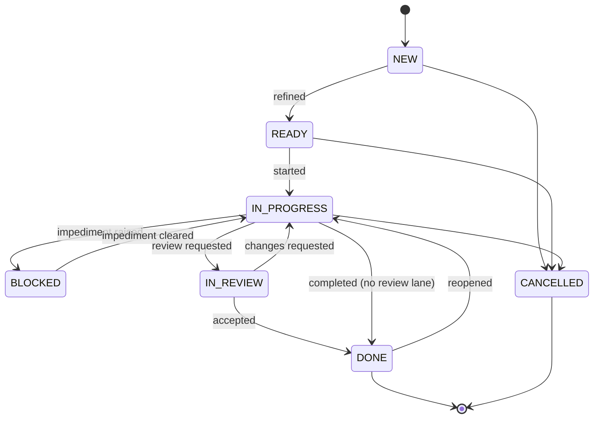
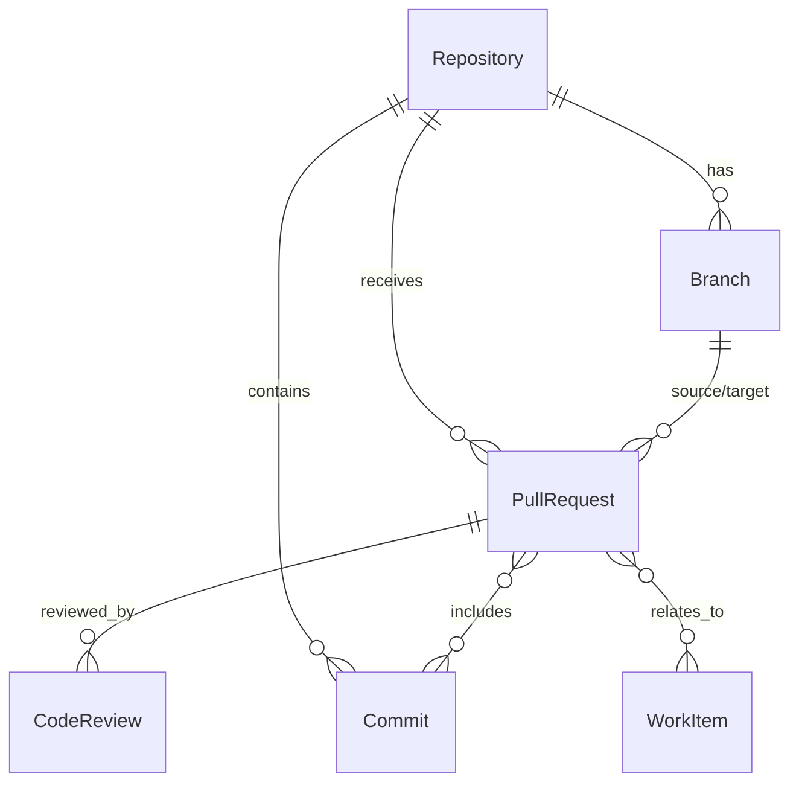
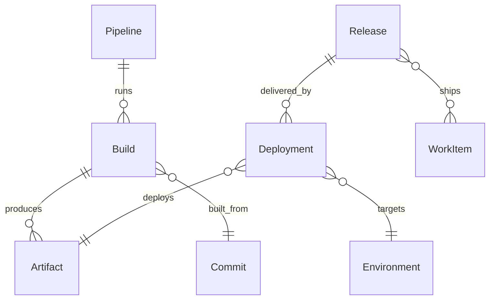
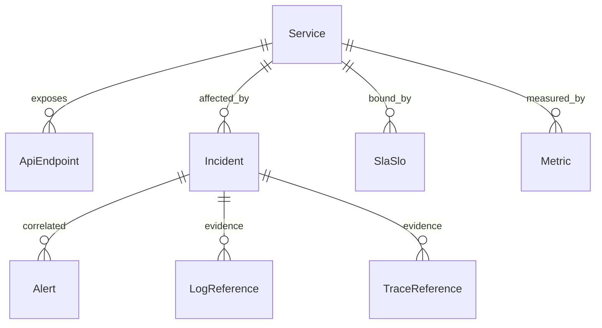
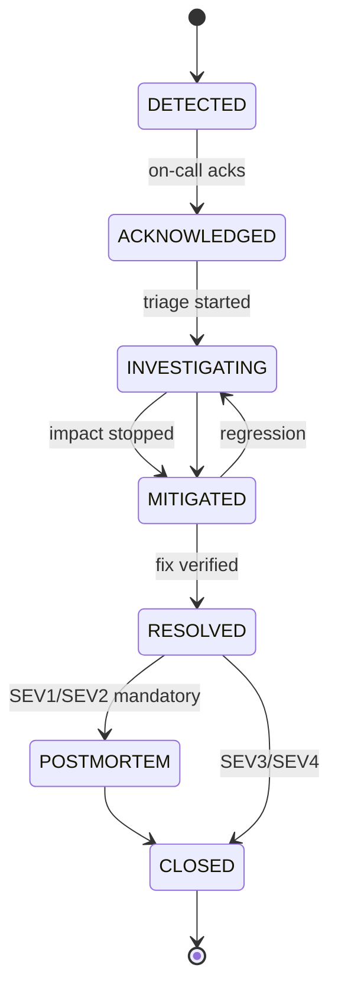

# Domain Model

Normalized engineering domain model for the **Engineering Intelligence Platform (EIP)**. This document is the canonical reference for entity names, attributes, relationships, identity, and state machines used by `eip-core` (shared kernel), the connector normalizers in `eip-connectors`/`eip-ingestion`, the metric engines in `eip-analytics`, and the physical design in `../engineering/DatabasePlan.md`.

All entity names below match the canonical vocabulary of the EIP design brief. The model is tool-agnostic: Jira, GitHub, GitLab, Bitbucket, SonarQube, Jenkins, Prometheus, and every other connector normalizes into these entities; no downstream consumer ever reads raw connector payloads.

## 1. Modeling Principles

1. **Canonical over raw.** Collectors write raw payloads to `raw_*` staging; normalizers map them into the canonical entities in this document. Analytics, RAG, and reports consume only the canonical model and domain events (`eip.domain.*` topics).
2. **Multi-tenant by construction.** Every tenant-scoped entity carries `tenantId`. Tenant isolation is enforced at the database layer with Postgres RLS (see `../engineering/DatabasePlan.md`).
3. **Supertype for work.** All plannable work normalizes to a single `WorkItem` supertype with `type ∈ {EPIC, FEATURE, STORY, TASK, BUG, INCIDENT_TICKET}`. Epic, Feature, Story, Task, Bug, and Incident tickets are *types*, not separate tables.
4. **Identity is internal; provenance is explicit.** Every entity has an internal UUIDv7 identifier. Links to source tools live exclusively in `ExternalRef` records (`sourceSystem`, `externalId`, `url`).
5. **Team-level analytics.** The model supports individual attribution (author, assignee, reviewer) because correlation requires it, but metric definitions aggregate at team level and never produce individual rankings (anti-goal of the platform).
6. **Events over polling.** Every create/update on a canonical entity emits a domain event with the standard envelope (`eventId (UUIDv7), tenantId, source, entityType, entityId, eventType, occurredAt, ingestedAt, schemaVersion, payload, traceparent`).

## 2. Identity Strategy

### 2.1 Internal identifiers

- Every entity's primary key is a **UUIDv7** generated by EIP at first normalization. UUIDv7 gives time-ordered keys (index-friendly, cursor-pagination-friendly) without a central sequence.
- Internal IDs never leak into source systems and are stable across re-syncs.

### 2.2 ExternalRef

`ExternalRef` maps one internal entity to one identity in one source tool. An entity may have many `ExternalRef`s (e.g., a `WorkItem` mirrored in Jira and a custom internal demand tool).

| Attribute | Type | Req | Semantics |
|---|---|---|---|
| id | UUIDv7 | yes | Internal PK |
| tenantId | UUIDv7 | yes | Owning tenant |
| entityType | enum | yes | Canonical entity name (e.g., `WorkItem`, `PullRequest`) |
| entityId | UUIDv7 | yes | Internal ID of the referenced entity |
| sourceSystem | string | yes | Connector identity, e.g. `jira`, `github`, `gitlab`, `sonarqube` |
| sourceInstance | string | yes | Instance discriminator (base URL hash / configured connector id) — enterprises run multiple Jiras |
| externalId | string | yes | Native ID in the source (`PROJ-1234`, GitHub node ID, Sonar issue key) |
| externalKey | string | no | Human-readable secondary key where distinct from `externalId` |
| url | string | no | Deep link into the source tool |
| lastSeenAt | timestamptz | yes | Last time the connector observed this identity |

**Resolution algorithm (upsert path, executed by normalizers):**

1. Look up `(tenantId, sourceSystem, sourceInstance, entityType, externalId)` — unique.
2. Hit → update the existing canonical entity (idempotent upsert; dedup on event id).
3. Miss → run type-specific correlation heuristics before creating a new entity:
   - `Commit`: match by `(repository, sha)` across mirrors of the same repo.
   - `PullRequest` ↔ `WorkItem`: parse issue keys from branch name, PR title, and commit trailers (`PROJ-1234`, `Fixes #42`) to create `relatesTo` links, never to merge identities.
   - `Repository`: match by normalized clone URL when a repo appears via both GitHub and a CI connector.
4. Still miss → create the entity with a fresh UUIDv7 and attach the `ExternalRef`.

### 2.3 User identity merging (Member resolution)

People appear under different identities per tool: Jira `accountId` + email, GitHub login + commit email(s), GitLab username, SSO subject. EIP resolves them to a single `Member`:

1. **OIDC subject** (Keycloak/enterprise IdP) is the anchor identity when present.
2. **Verified email match**: normalized (lowercased, trimmed, plus-suffix-stripped per policy) email equality merges tool identities into one `Member`. Corporate alias domains are configurable per tenant (`@corp.com` ≡ `@corp.example`).
3. **Commit-email graph**: Git commit author/committer emails link to a Member if that email is a verified email of exactly one GitHub/GitLab identity already merged; noreply emails (`*@users.noreply.github.com`) resolve via the embedded login.
4. **Manual override**: admins can merge/split identities in the UI; overrides win over heuristics and are audited.
5. Each merged identity is kept as a `MemberIdentity` row (a specialization of ExternalRef semantics: `sourceSystem`, `externalId`, `email`, `displayName`, `confidence`, `mergedBy: HEURISTIC|ADMIN`). Merging is reversible: splitting re-partitions identities without rewriting historical facts, because facts (commits, work items) reference `MemberIdentity` and derive `Member` through it.

## 3. Bounded Contexts Overview

Cross-context references are by internal UUID only (no foreign objects embedded), keeping module boundaries in the Spring Modulith layout clean (`eip-core` owns the shared kernel types; each module owns its context aggregate roots).

## 4. Organization & Tenancy Context

Owned by `eip-tenancy`. Root of all scoping.

| Entity | Key attributes (type, req) | Semantics |
|---|---|---|
| Organization | id UUIDv7 (req); tenantId UUIDv7 (req, = id for root org); name string (req); slug string (req, unique per tenant); settings JSONB (opt) | Tenant root. One tenant = one Organization aggregate. |
| BusinessUnit | id; tenantId; organizationId FK (req); name (req); parentId FK (opt, self) | Hierarchical org structure (divisions, departments). |
| Team | id; tenantId; businessUnitId FK (req); name (req); type enum STREAM_ALIGNED\|PLATFORM\|ENABLING\|COMPLICATED_SUBSYSTEM (opt); active bool (req, default true) | Delivery team; primary aggregation grain for team-health metrics. |
| Member | id; tenantId; displayName (req); primaryEmail string (opt); oidcSubject string (opt, unique per tenant); active bool (req) | Resolved person. See §2.3. |
| MemberIdentity | id; tenantId; memberId FK (req); sourceSystem (req); externalId (req); email (opt); displayName (opt); confidence numeric 0–1 (req); mergedBy enum (req) | Per-tool identity of a Member. |
| Role | id; tenantId; name (req); permissions string[] (req) | RBAC role; fine-grained permissions, tenant-scoped. |
| Product | id; tenantId; organizationId FK (req); name (req); description (opt) | Long-lived product; owns Projects and a Roadmap. |
| Project | id; tenantId; productId FK (req); name (req); key string (req, e.g. Jira project key mirror); status enum ACTIVE\|ON_HOLD\|DONE\|CANCELLED (req) | Delivery container; WorkItems and Sprints belong to a Project. |
| Roadmap | id; tenantId; productId FK (req); name (req) | Ordered set of Initiatives with target quarters. |
| Initiative | id; tenantId; roadmapId FK (req); name (req); targetStart/targetEnd date (opt); status enum (req) | Strategic slice; links to EPIC-type WorkItems. |

**Invariants:** a Member has ≥1 MemberIdentity or an oidcSubject; Team membership intervals must not overlap for the same (member, team); deleting an Organization is forbidden (soft-delete only, cascades logically).

## 5. Work Management Context

| Entity | Key attributes | Semantics |
|---|---|---|
| WorkItem | id; tenantId; type enum EPIC\|FEATURE\|STORY\|TASK\|BUG\|INCIDENT_TICKET (req); title (req); description text (opt); projectId FK (req); parentId FK (opt); currentStateId FK→WorkflowState (req); status enum (derived category, see §5.1); priority enum P1..P4 (opt); severity enum (opt, BUG/INCIDENT_TICKET only); storyPoints numeric (opt); estimateSeconds bigint (opt); sprintId FK (opt); assigneeMemberId FK (opt); reporterMemberId FK (opt); teamId FK (opt); labels string[] (opt); dueDate date (opt); createdInSource timestamptz (req); resolvedAt timestamptz (opt); blocked bool (req, derived); customFields JSONB (opt) | Unified supertype for all plannable work. Type-specific rules in §5.2. |
| Sprint | id; tenantId; projectId FK (req); name (req); goal text (opt); startAt/endAt timestamptz (req); state enum FUTURE\|ACTIVE\|CLOSED (req); committedPoints numeric (opt, snapshot at start) | Timebox; source for velocity and sprint predictability. |
| Board | id; tenantId; projectId FK (req); name (req); type enum SCRUM\|KANBAN (req); columnOrder UUIDv7[] (req) | Visual flow surface; maps WorkflowStates to columns. |
| WorkflowState | id; tenantId; boardId FK (req); name (req, e.g. "In Review"); category enum TODO\|IN_PROGRESS\|DONE (req); wipLimit int (opt); isBlockedState bool (req, default false) | Normalized WIP state. Source workflows map onto these; category drives cycle/lead time. |
| Dependency | id; tenantId; fromWorkItemId FK (req); toWorkItemId FK (req); type enum BLOCKS\|IS_BLOCKED_BY\|RELATES_TO\|DUPLICATES (req); crossTeam bool (derived); active bool (req) | Directed edge for dependency-risk analytics. |
| Risk | id; tenantId; subjectType enum WORK_ITEM\|PROJECT\|RELEASE (req); subjectId FK (req); title (req); probability enum LOW\|MEDIUM\|HIGH (req); impact enum LOW\|MEDIUM\|HIGH (req); score numeric (derived); status enum OPEN\|MITIGATING\|ACCEPTED\|CLOSED (req); mitigation text (opt); raisedBy enum HUMAN\|AGENT (req) | Risk register entry; Delivery Risk agent writes AGENT-raised rows. |
| WorkItemTransition | id; tenantId; workItemId FK (req); fromStateId/toStateId FK (req); occurredAt timestamptz (req); actorMemberId FK (opt) | Append-only state history; source of blocked time, cycle time, flow efficiency. |

### 5.1 WorkItem state machine

Source workflows are arbitrary; every `WorkflowState` maps to one normalized status. Transitions below are the normalized machine; source-specific transitions are recorded verbatim in `WorkItemTransition`.

### 5.2 Invariants and validation rules

- `parentId` type hierarchy: EPIC ← FEATURE ← STORY ← TASK; BUG and INCIDENT_TICKET may parent to any of EPIC/FEATURE/STORY. Cycles are rejected.
- An EPIC cannot belong to a Sprint; STORY/TASK/BUG may.
- `resolvedAt` is set iff normalized status is DONE or CANCELLED; clearing on reopen is mandatory.
- `blocked = true` iff currentState.isBlockedState or an active `Dependency(type=IS_BLOCKED_BY)` exists.
- `Dependency.fromWorkItemId ≠ toWorkItemId`; at most one active edge per (from, to, type).
- Sprint: `startAt < endAt`; a WorkItem may reference only Sprints of its own Project; `committedPoints` is immutable after `state=ACTIVE` (scope churn is measured against it).
- `storyPoints ≥ 0`; `severity` required when `type ∈ {BUG, INCIDENT_TICKET}`.

## 6. Source Control Context

| Entity | Key attributes | Semantics |
|---|---|---|
| Repository | id; tenantId; name (req); defaultBranch (req); visibility enum PRIVATE\|INTERNAL\|PUBLIC (req); primaryLanguage (opt); teamId FK (opt); archived bool (req) | Normalized repo from GitHub/GitLab/Bitbucket. |
| Branch | id; tenantId; repositoryId FK (req); name (req); headSha char(40) (req); protected bool (req); lastActivityAt timestamptz (req) | Tracked branches (default + active feature branches). |
| Commit | id; tenantId; repositoryId FK (req); sha char(40) (req, unique per repo); authorIdentityId FK→MemberIdentity (opt); committedAt timestamptz (req); message text (req); additions/deletions int (opt); filesChanged int (opt) | Immutable. Attribution via MemberIdentity, never raw email in analytics. |
| PullRequest | id; tenantId; repositoryId FK (req); number int (req); title (req); state enum OPEN\|MERGED\|CLOSED (req); draft bool (req); authorMemberId FK (opt); sourceBranch/targetBranch (req); createdAt/mergedAt/closedAt timestamptz; firstReviewAt timestamptz (opt); additions/deletions int; commentCount int; mergeCommitSha (opt) | Unit of change for review-bottleneck and DORA lead-time metrics. |
| CodeReview | id; tenantId; pullRequestId FK (req); reviewerMemberId FK (req); state enum APPROVED\|CHANGES_REQUESTED\|COMMENTED\|DISMISSED (req); submittedAt timestamptz (req) | One review submission event. |

**Invariants:** `mergedAt` set iff `state=MERGED`; `firstReviewAt = min(CodeReview.submittedAt)`; a Commit's `(repositoryId, sha)` is globally unique per tenant; PR↔WorkItem links are `RELATES_TO` edges derived from key parsing (§2.2) and are advisory, never destructive.

## 7. Build & Release Context

| Entity | Key attributes | Semantics |
|---|---|---|
| Pipeline | id; tenantId; name (req); repositoryId FK (opt); tool enum JENKINS\|GITHUB_ACTIONS\|GITLAB_CI\|AZURE_DEVOPS\|GENERIC (req); definitionPath (opt) | CI/CD pipeline definition. |
| Build | id; tenantId; pipelineId FK (req); number bigint (req); status enum QUEUED\|RUNNING\|SUCCESS\|FAILED\|CANCELLED (req); commitId FK (opt); startedAt/finishedAt timestamptz; durationSeconds int (derived); triggeredBy enum PUSH\|PR\|SCHEDULE\|MANUAL\|API (req) | One pipeline execution. |
| Artifact | id; tenantId; buildId FK (req); name (req); type enum CONTAINER_IMAGE\|JAR\|NPM\|GENERIC (req); version (req); digest (opt); storageUrl (opt) | Produced binary; identity for deployment traceability. |
| Environment | id; tenantId; name (req, e.g. dev/test/staging/prod); tier enum DEV\|TEST\|STAGING\|PROD (req); serviceIds UUIDv7[] (opt) | Deployment target. Exactly one PROD-tier chain per Service for DORA. |
| Deployment | id; tenantId; environmentId FK (req); artifactId FK (req); serviceId FK (opt); status enum PENDING\|IN_PROGRESS\|SUCCEEDED\|FAILED\|ROLLED_BACK (req); startedAt/finishedAt timestamptz; deployerMemberId FK (opt); causedIncident bool (derived) | Grain for deployment frequency and change failure rate. |
| Release | id; tenantId; name/version (req); projectId FK (opt); status enum PLANNED\|IN_PROGRESS\|RELEASED\|CANCELLED (req); targetDate date (opt); releasedAt timestamptz (opt); readinessScore numeric (derived) | Business-visible release; Release Notes agent input. |

**Invariants:** `finishedAt ≥ startedAt`; `causedIncident = true` iff an `Incident` links to the Deployment within the configured attribution window (default 48h, per-tenant); a `Release.releasedAt` requires ≥1 SUCCEEDED Deployment to a PROD-tier Environment.

## 8. Quality Context

| Entity | Key attributes | Semantics |
|---|---|---|
| QualityGate | id; tenantId; repositoryId FK (req); source (req, e.g. `sonarqube`); status enum PASSED\|WARN\|FAILED (req); evaluatedAt timestamptz (req); conditions JSONB (req: metric, operator, threshold, actual) | Latest + historical gate evaluations per repo/branch. |
| SecurityFinding | id; tenantId; repositoryId FK (opt); serviceId FK (opt); source (req); ruleId (req); severity enum INFO\|LOW\|MEDIUM\|HIGH\|CRITICAL (req); status enum OPEN\|CONFIRMED\|MITIGATED\|RESOLVED\|ACCEPTED_RISK (req); firstSeenAt/resolvedAt timestamptz; location JSONB (opt) | Feeds security-finding-aging metric. |
| TechnicalDebtItem | id; tenantId; repositoryId FK (opt); workItemId FK (opt); title (req); category enum CODE\|ARCHITECTURE\|TEST\|DOC\|INFRA (req); effortHours numeric (opt); interest enum LOW\|MEDIUM\|HIGH (req); status enum OPEN\|SCHEDULED\|PAID\|WONT_FIX (req); raisedBy enum HUMAN\|AGENT\|TOOL (req) | Debt register; technical debt ratio input. |
| CoverageSnapshot | id; tenantId; repositoryId FK (req); branch (req); measuredAt timestamptz (req); lineCoverage/branchCoverage numeric 0–100; linesToCover/uncoveredLines bigint; source (req) | Time series of test coverage metrics (per repo/branch); duplication and code smells are stored as `Metric` series (§9) keyed to the Repository. |

**Invariants:** one QualityGate row per (repository, branch, evaluatedAt); `resolvedAt` set iff SecurityFinding status ∈ {RESOLVED, ACCEPTED_RISK}; coverage values in [0,100].

## 9. Operations Context

| Entity | Key attributes | Semantics |
|---|---|---|
| Service | id; tenantId; name (req); teamId FK (opt); repositoryIds UUIDv7[] (opt); tier enum CRITICAL\|HIGH\|STANDARD (req); runtime JSONB (opt: k8s namespace/deployment) | Catalog entry linking code, deploys, and ops signals. |
| ApiEndpoint | id; tenantId; serviceId FK (req); method (req); pathTemplate (req); deprecated bool (req) | Endpoint inventory for SLO scoping. |
| Incident | id; tenantId; title (req); severity enum SEV1..SEV4 (req); status enum (see §9.1); serviceId FK (opt); deploymentId FK (opt, suspected cause); detectedAt (req); acknowledgedAt/mitigatedAt/resolvedAt timestamptz; postmortemDocumentId FK (opt); workItemId FK (opt, follow-up INCIDENT_TICKET) | Operational incident; MTTR and change-failure-rate input. |
| Alert | id; tenantId; source (req, e.g. `prometheus`, `grafana`); fingerprint (req); name (req); severity (req); state enum FIRING\|RESOLVED (req); startsAt/endsAt timestamptz; incidentId FK (opt); labels JSONB | Alert instances; alert-noise metric input. |
| Metric | id; tenantId; name (req, e.g. `flow.cycle_time_p50`); grain enum TEAM\|PROJECT\|SERVICE\|REPO\|SPRINT\|TENANT (req); unit (req); definitionRef (req: link to metric catalog entry with purpose/formula/inputs/caveats/gaming risks) | Metric *definition*; values are `MetricValue` time series (physical design in DatabasePlan §4). |
| LogReference | id; tenantId; incidentId FK (opt); serviceId FK (opt); system enum LOKI\|ELASTIC\|OTHER (req); query text (req); fromTs/toTs timestamptz (req); url (opt) | Pointer to logs — EIP stores references, never raw log bodies. |
| TraceReference | id; tenantId; incidentId FK (opt); serviceId FK (opt); traceId (req); system enum TEMPO\|JAEGER\|OTHER (req); url (opt) | Pointer to a distributed trace. |
| SlaSlo | id; tenantId; serviceId FK (req); kind enum SLA\|SLO (req); name (req); objective numeric (req, e.g. 99.9); window (req, e.g. `30d`); indicator JSONB (req: metric query); errorBudgetPolicy text (opt) | Objective definition; SLO-health metric evaluates attainment. |

### 9.1 Incident state machine

**Invariants:** timestamps are monotonic (`detectedAt ≤ acknowledgedAt ≤ mitigatedAt ≤ resolvedAt`); SEV1/SEV2 cannot reach CLOSED without a `postmortemDocumentId`; MTTR = `resolvedAt − detectedAt`, computed only on CLOSED incidents.

## 10. Knowledge Context

| Entity | Key attributes | Semantics |
|---|---|---|
| Document | id; tenantId; title (req); source (req, e.g. `confluence`, `file`); spaceOrPath (opt); contentRef (req: object-storage key or URL); mimeType (req); version int (req); authorMemberId FK (opt); updatedInSource timestamptz (req); aclHash (req, for permission-aware RAG retrieval) | Ingested knowledge artifact; chunked/embedded into the RAG store (`ai.rag_document`/`ai.rag_chunk`). |
| DecisionRecord | id; tenantId; documentId FK (opt); title (req); status enum PROPOSED\|ACCEPTED\|SUPERSEDED\|DEPRECATED (req); decidedAt date (opt); supersededById FK (opt, self); context/decision/consequences text (req) | ADR-style record; Architecture Diagram and Documentation agents read these. |

## 11. Outputs Context

| Entity | Key attributes | Semantics |
|---|---|---|
| GeneratedReport | id; tenantId; type enum SPRINT_REVIEW\|RELEASE_NOTES\|EXEC_SUMMARY\|DELIVERY_RISK\|INCIDENT_ANALYSIS\|CUSTOM (req); title (req); templateId (opt); parameters JSONB (req); status enum QUEUED\|GENERATING\|READY\|FAILED (req); artifactKeys string[] (req when READY: object-storage keys for MD/PDF/PPTX); generatedByAgent (req, canonical agent name); llmCallIds UUIDv7[] (req, audit linkage); citations JSONB (opt, RAG source citations); createdAt/completedAt timestamptz | AI-generated output with full provenance: every report links to the audited LLM calls and retrieval citations that produced it. |

**Invariants:** `artifactKeys` non-empty iff status=READY; reports are immutable once READY (regeneration creates a new row); every GeneratedReport must be reproducible from `parameters` + template version.

## 12. Source-Tool Field Mapping Examples

Normalizers are table-driven; these two mappings are the reference examples (full per-connector maps live with each connector in `eip-connectors`).

### 12.1 Jira issue → WorkItem

| Jira field | WorkItem attribute | Transform |
|---|---|---|
| `key` (e.g. PROJ-1234) | ExternalRef.externalId + externalKey | Verbatim; `sourceSystem=jira`, `url=<base>/browse/<key>` |
| `fields.issuetype.name` | type | Epic→EPIC; New Feature→FEATURE; Story→STORY; Task/Sub-task→TASK; Bug→BUG; Incident→INCIDENT_TICKET; per-tenant override map for custom types |
| `fields.summary` | title | Verbatim |
| `fields.description` (ADF) | description | ADF → Markdown |
| `fields.status` + `statusCategory` | currentStateId (WorkflowState) | Status name → WorkflowState per board; `statusCategory.key` (new/indeterminate/done) → category TODO/IN_PROGRESS/DONE |
| `fields.priority.name` | priority | Highest→P1, High→P2, Medium→P3, Low/Lowest→P4 |
| `fields.customfield_<storyPoints>` | storyPoints | Configured custom-field id per Jira instance |
| `fields.assignee.accountId` | assigneeMemberId | Via MemberIdentity resolution (§2.3) |
| `fields.parent.key` / epic link | parentId | Resolved through ExternalRef lookup; deferred link if parent not yet synced |
| `fields.sprint` (board API) | sprintId | Sprint ExternalRef by Jira sprint id |
| `fields.labels` | labels | Verbatim array |
| `fields.created` / `resolutiondate` | createdInSource / resolvedAt | ISO-8601 → timestamptz UTC |
| `changelog.histories[]` (status items) | WorkItemTransition rows | One row per status change; actor via MemberIdentity |
| `fields.issuelinks[]` | Dependency | "blocks"→BLOCKS, "is blocked by"→IS_BLOCKED_BY, "relates to"→RELATES_TO, "duplicates"→DUPLICATES |
| everything unmapped | customFields JSONB | Namespaced `jira.*`, retained for drill-down |

### 12.2 GitHub pull request → PullRequest

| GitHub field | PullRequest attribute | Transform |
|---|---|---|
| `node_id` | ExternalRef.externalId | Verbatim; `sourceSystem=github`, `url=html_url` |
| `number` | number | Verbatim |
| `title` | title | Verbatim |
| `state` + `merged_at` | state | `open`→OPEN; `closed` with `merged_at`→MERGED; `closed` without→CLOSED |
| `draft` | draft | Verbatim |
| `user.login` (+ noreply email) | authorMemberId | Via MemberIdentity resolution (§2.3) |
| `head.ref` / `base.ref` | sourceBranch / targetBranch | Verbatim |
| `created_at` / `merged_at` / `closed_at` | createdAt / mergedAt / closedAt | UTC timestamptz |
| `merge_commit_sha` | mergeCommitSha | Verbatim; links Deployment traceability via Commit |
| `additions` / `deletions` | additions / deletions | Verbatim |
| `review_comments` + `comments` | commentCount | Sum |
| `reviews[]` (REST/GraphQL) | CodeReview rows | One per submission; APPROVED/CHANGES_REQUESTED/COMMENTED/DISMISSED map 1:1 |
| earliest review `submitted_at` | firstReviewAt | min() over CodeReview |
| branch name / title / body issue keys | WorkItem RELATES_TO links | Regex `[A-Z][A-Z0-9]+-\d+` and `#\d+` → ExternalRef lookup |

## 13. Domain Events per Context

Every canonical entity mutation publishes to a context topic using the standard envelope (§1.6). Consumers (analytics, RAG indexer, report engine) subscribe per context; ordering is per key `tenantId+entityId`; delivery is at-least-once with idempotent consumers deduplicating on `eventId`.

| Context | Kafka topic | entityType values | Representative eventType values |
|---|---|---|---|
| Work Management | `eip.domain.workitem` | WorkItem, Sprint, Board, WorkflowState, Dependency, Risk | `workitem.created`, `workitem.transitioned`, `sprint.closed`, `dependency.linked` |
| Source Control | `eip.domain.scm` | Repository, Branch, Commit, PullRequest, CodeReview | `pullrequest.opened`, `pullrequest.merged`, `codereview.submitted`, `commit.ingested` |
| Build & Release | `eip.domain.cicd` | Pipeline, Build, Deployment, Release, Environment, Artifact | `build.finished`, `deployment.succeeded`, `release.released` |
| Quality | `eip.domain.quality` | QualityGate, SecurityFinding, TechnicalDebtItem, CoverageSnapshot | `qualitygate.evaluated`, `securityfinding.opened`, `securityfinding.resolved` |
| Operations | `eip.domain.ops` | Service, ApiEndpoint, Incident, Alert, SlaSlo, LogReference, TraceReference | `incident.detected`, `incident.resolved`, `alert.firing`, `slo.breached` |
| Analytics outputs | `eip.analytics.metrics` | Metric (values) | `metric.computed` |
| AI / Reports | `eip.ai.jobs`, `eip.ai.results`, `eip.reports.jobs` | GeneratedReport, agent jobs | `report.requested`, `report.ready` |

Failed processing lands in the consumer group's DLQ (`.<group>.dlq`) with the original envelope intact for replay.

## 14. Cross-Cutting Validation Rules

1. Every tenant-scoped entity write is rejected unless `tenantId` matches the session tenant (defense in depth above RLS).
2. Normalizers must be idempotent: re-processing the same raw payload yields byte-identical canonical state (dedup on `eventId`; upsert keyed by ExternalRef).
3. Timestamps are stored UTC; `occurredAt` (source time) is never overwritten by `ingestedAt`.
4. No entity may hold plaintext credentials or tokens; connector secrets live only in the secrets subsystem (AES-256-GCM envelope encryption).
5. Derived fields (`blocked`, `durationSeconds`, `causedIncident`, `readinessScore`, `Risk.score`) are recomputed by `eip-analytics` consumers, never written by connectors.
6. Referential links across bounded contexts are soft (UUID + existence check at read time) to keep module extraction possible; hard FKs exist only inside a context's schema (see `../engineering/DatabasePlan.md` §3).
