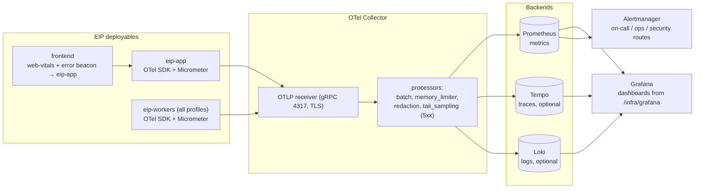
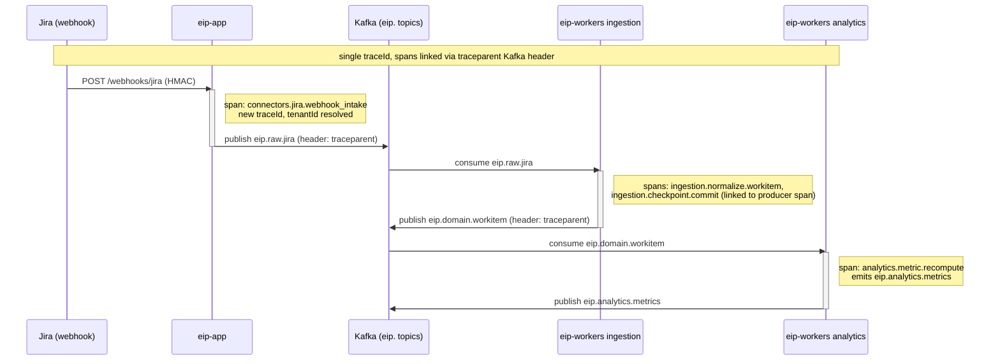

# Observability Model

This document defines how the Engineering Intelligence Platform (EIP) observes itself: metrics, traces, logs, dashboards, alerts, SLOs, and health checks for the platform's own runtime — distinct from the engineering analytics EIP computes about its tenants' SDLC data. The platform is instrumented with the OpenTelemetry SDK (traces/metrics/logs) exporting to an OTel Collector, with Micrometer as the metrics facade and Prometheus + Grafana + optional Tempo/Loki as the backend, exactly the stack EIP also integrates with as connectors.

Related documents: `../architecture/DeploymentModel.md` (topologies, scaling signals), `../architecture/SecurityModel.md` (audit taxonomy), `../operations/OperationsGuide.md` (runbooks referenced by alerts).

## 1. Principles

1. **Dogfooding: the platform observes itself with the same OTel stack it integrates with.** EIP ships Prometheus/Grafana/OTel connectors for tenant tooling; the platform's own telemetry uses the identical pipeline (OTel SDK → OTel Collector → Prometheus/Tempo/Loki → Grafana). Any gap that hurts our own operators would hurt connector users, so self-observability doubles as continuous integration-testing of the observability connectors.
2. **Three signals, one correlation key.** Metrics, traces, and logs share `traceId`/`spanId` (W3C Trace Context) and `tenantId`; every user-visible symptom must be walkable from dashboard → trace → logs → audit event.
3. **Tenant-dimensioned, cardinality-bounded.** Operational metrics carry `tenantId` where per-tenant behavior matters (ingestion, LLM cost), but never carry unbounded labels (no `entityId`, no user ids, no free-text). Cardinality budgets are reviewed per metric at code review.
4. **Async-first visibility.** Because the architecture is queue-centric (Kafka), lag, freshness, and DLQ depth are first-class golden signals alongside RED metrics on the API.
5. **Observability is not audit.** Telemetry may be sampled and expires quickly; the audit log (see `../architecture/SecurityModel.md` §11) is complete and tamper-evident. They correlate (§10) but never substitute for each other. Telemetry must not contain secrets or PII (§5 redaction).

## 2. Telemetry Pipeline

One pipeline for all deployables and all three signals; only exporters and retention differ per topology (see `../architecture/DeploymentModel.md` §2–§4).

Signal routing and retention defaults:

| Signal | Source | Transport | Backend | Default retention |
|---|---|---|---|---|
| Metrics | Micrometer → OTel SDK | OTLP → Collector → Prometheus (remote-write or scrape of Collector exporter) | Prometheus | 30 days raw (enterprise: + long-term store) |
| Traces | OTel SDK auto + manual spans | OTLP gRPC, TLS | Tempo (optional) | 14 days |
| Logs | JSON stdout | Collector filelog/K8s stdout scrape | Loki (optional) or enterprise SIEM | 30 days (audit log is separate, 25 months, §10) |
| Alerts | Prometheus rules | Alertmanager | on-call / ops / security channels | n/a |

The Collector is the single egress point for telemetry: deployables never talk to backends directly, so swapping Grafana/Tempo/Loki for an enterprise APM only reconfigures the Collector. In air-gapped installs everything above is in-cluster; nothing phones home.

## 3. Metrics Catalog

All metrics are produced via Micrometer with OTel/Prometheus export, prefix `eip_`. Common labels on every metric: `deployable` (`eip-app`|`eip-workers`), `worker_profile` (`ingestion|analytics|ai|reports`, when applicable), `pod`. Additional labels listed per metric. Naming follows Prometheus conventions (`_total` counters, `_seconds` histograms, gauges unsuffixed).

| Metric | Type | Labels | Purpose |
|---|---|---|---|
| `eip_ingestion_events_total` | counter | `tenantId, connector, entityType, outcome=ok\|dedup\|error` | Ingestion throughput and dedup/error ratio per connector |
| `eip_ingestion_event_lag_seconds` | histogram | `connector` | `ingestedAt - occurredAt` distribution; drives freshness SLO |
| `eip_connector_sync_duration_seconds` | histogram | `tenantId, connector, mode=full\|incremental` | Sync run latency; regression detection per connector |
| `eip_connector_sync_runs_total` | counter | `tenantId, connector, mode, outcome=ok\|error\|rate_limited` | Sync attempt/success accounting |
| `eip_connector_health` | gauge | `tenantId, connector` | 1 healthy / 0 unhealthy from `healthCheck()`; primary connector alert signal |
| `eip_connector_checkpoint_age_seconds` | gauge | `tenantId, connector, stream` | Age of last committed checkpoint; stuck-sync detection |
| `eip_connector_rate_limit_waits_total` | counter | `connector` | Backoff pressure from tool endpoints |
| `eip_webhook_events_total` | counter | `connector, outcome=ok\|invalid_signature\|rejected` | Webhook intake volume and spoofing attempts |
| `eip_kafka_consumer_lag` | gauge | `topic, consumer_group` | Records behind head; HPA/KEDA scaling signal for workers |
| `eip_kafka_dlq_messages_total` | counter | `consumer_group, topic` | Poison/parked messages per `.<group>.dlq`; must-investigate signal |
| `eip_normalization_failures_total` | counter | `connector, entityType, reason` | Raw→canonical mapping failures (schema drift detection) |
| `eip_analytics_metric_compute_duration_seconds` | histogram | `metric_family=flow\|dora\|quality\|risk\|ops\|team_health` | Metric engine cost per family |
| `eip_analytics_metric_staleness_seconds` | gauge | `metric_family` | Time since last successful recompute; dashboard trust signal |
| `eip_llm_calls_total` | counter | `tenantId, provider, model, agent, outcome=ok\|error\|timeout\|budget_exhausted` | LLM call volume and failure modes per agent |
| `eip_llm_tokens_total` | counter | `tenantId, provider, model, direction=input\|output` | Token consumption; capacity and budget tracking |
| `eip_llm_cost_estimate` | counter (monetary units) | `tenantId, provider, model` | Estimated spend for external providers; 0-cost for local |
| `eip_llm_call_duration_seconds` | histogram | `provider, model` | Inference latency; provider/fallback health |
| `eip_agent_runs_total` | counter | `tenantId, agent, outcome=ok\|failed\|validation_failed\|budget_exhausted` | Agent reliability per canonical agent |
| `eip_rag_retrieval_latency_seconds` | histogram | `store=pgvector\|qdrant` | Vector retrieval latency incl. permission filtering |
| `eip_rag_index_documents` | gauge | `tenantId, store` | Corpus size; re-index progress observable |
| `eip_report_generation_duration_seconds` | histogram | `tenantId, report_type` | Report job latency end-to-end |
| `eip_report_jobs_total` | counter | `tenantId, report_type, outcome=ok\|failed` | Report success rate SLO input |
| `eip_api_request_duration_seconds` | histogram | `method, route, status` | RED metrics for `/api/v1`; HPA signal for `eip-app`; route is the template, never raw path |
| `eip_api_requests_inflight` | gauge | `deployable` | Saturation on the API tier |
| `eip_cache_hit_ratio` | gauge | `cache` | Redis/Caffeine cache effectiveness per named cache |
| `eip_db_pool_connections_active` | gauge | `pool` | Hikari pool saturation |
| `eip_job_failures_total` | counter | `job` | Scheduled job failures (audit-verify, retention-purge, re-index, backup, DEK re-wrap) |
| `eip_secret_decrypt_operations_total` | counter | `purpose` | Envelope-decryption volume; anomaly input for security alerting |
| `eip_audit_events_total` | counter | `category` | Audit write volume; silence indicates a broken audit path |

JVM, Kafka client, HTTP client/server, and Hikari metrics come from Micrometer's standard binders and are shipped alongside (not re-listed here).

## 4. Tracing Model

- **Propagation.** W3C Trace Context end-to-end. The `traceparent` field is part of the canonical event envelope (`eventId, tenantId, source, ..., traceparent`) **and** is written into Kafka record headers; consumers continue the trace as a new span with a link to the producing span, so one ingestion flow is a single walkable trace: `webhook/sync → raw staging → normalizer → domain event → analytics/RAG consumer`.

- **Span naming conventions.** `<module>.<component>.<operation>` in lower-case dot notation:
  - API server spans: HTTP semantic conventions (`GET /api/v1/workitems`), route template only.
  - Connectors: `connectors.jira.incremental_sync`, `connectors.github.fetch_pull_requests`.
  - Ingestion: `ingestion.normalize.workitem`, `ingestion.checkpoint.commit`.
  - Kafka: `eip.domain.workitem publish` / `process` per messaging conventions, with `messaging.kafka.consumer.group` attributes.
  - AI: `ai.agent.sprint_review.run` (parent), child spans `ai.llm.call` (attributes: provider, model, token counts — never prompt text), `ai.rag.retrieve`, `ai.mcp.invoke`.
  - Reports: `reports.generate.executive_summary`, `reports.export.pdf`.
  - Span attributes always include `eip.tenant_id`; never payload content, secrets, or member identities.
- **Sampling policy.** Head sampling defaults: API traffic 10% (parent-based), background sync spans 1–10% by volume tier. **Always-on (100%)**: agent runs and LLM calls (cost/latency accountability), report jobs, DLQ handling, migrations, secret/KMS operations, and any request that ends in 5xx (tail-sampling rule in the OTel Collector when Tempo is deployed). Sampling rates are env-configurable per `../architecture/DeploymentModel.md` §11.
- **Trace backend optionality.** Tempo is optional; without it, traces export nowhere but `traceId` still flows through logs, metrics exemplars, and audit events, so correlation survives in reduced form.

## 5. Structured Logging

All logs are structured JSON on stdout (12-factor), shipped by the collector (Loki optional). Schema:

| Field | Type | Notes |
|---|---|---|
| `timestamp` | RFC3339 nanos | UTC |
| `level` | `DEBUG\|INFO\|WARN\|ERROR` | No `TRACE` in production profiles |
| `tenantId` | UUID or `-` | From context; `-` for platform-scope work |
| `traceId` / `spanId` | hex | From active OTel context; `-` when absent |
| `module` | string | Spring Modulith module: `tenancy`, `connectors`, `ingestion`, `analytics`, `ai`, `reports`, `core` |
| `event` | string | Machine-readable snake_case event key, e.g. `connector_sync_completed`, `dlq_message_parked` |
| `message` | string | Human-readable, single line |
| additional context | object | Bounded, allow-listed keys per event (e.g. `connector`, `topic`, `durationMs`) |

Redaction rules (enforced by a logging filter, tested in CI):

- Secrets never logged: known secret field names, `Authorization`/token-shaped values, and high-entropy strings matching secret patterns are replaced with `[REDACTED]`.
- No prompt/completion bodies in logs (audit store handles them under its own redaction policy).
- No Member names/emails; identities appear only as ids (or pseudonyms when the tenant enables pseudonymization).
- No raw payloads from `raw_*` staging; log payload digests + sizes instead.
- Stack traces allowed at `ERROR`, with message-part redaction applied.

## 6. Dashboards Shipped in `/infra/grafana`

Provisioned automatically in all topologies; JSON dashboards live in `/infra/grafana` and are versioned with the release.

| Dashboard | Panels |
|---|---|
| **System Health** | Global status row (per-deployable up/ready), API availability vs SLO, error-budget burn gauges, pod restarts, JVM heap/GC per deployable, CPU/memory vs requests, active alerts list |
| **Ingestion & Connectors** | `eip_connector_health` heatmap (connector × tenant), sync duration p50/p95 by connector, events/sec by connector and outcome, dedup + normalization-failure rates, checkpoint age table, rate-limit waits, webhook outcomes (incl. invalid signatures), ingestion freshness (`eip_ingestion_event_lag_seconds` p95 vs SLO) |
| **Kafka & Queues** | Consumer lag by group/topic (with HPA thresholds drawn), produce/consume throughput per `eip.` topic, DLQ depth and arrival rate per group, rebalance events, broker ISR/under-replicated partitions, oldest unconsumed message age |
| **API & Latency** | RED per route (rate, error %, p50/p95/p99 from `eip_api_request_duration_seconds`), in-flight requests, top slow routes, 4xx breakdown (401/403/429 separated), idempotency-key replay hits, RPS vs HPA replica count |
| **AI/LLM Usage & Cost** | Tokens/hour by provider+model, `eip_llm_cost_estimate` cumulative by tenant, LLM latency p95 by model, agent run outcomes stacked by agent, budget-exhaustion events, validation-failure rate, RAG retrieval latency p95, RAG corpus size and re-index progress, external vs local call split |
| **Database & Cache** | Postgres connections vs pool max, query latency (pg_stat_statements top-N), replication lag, table/index bloat, WAL rate, vacuum activity, pgvector index size, Redis hit ratio per cache (`eip_cache_hit_ratio`), Redis memory/evictions, Redisson lock wait times |
| **Report Jobs** | Report jobs by outcome and type, generation duration p95 per type, queue depth on `eip.reports.jobs`, success-rate SLO gauge, artifact storage growth, failed-job table with `traceId` links |

## 7. Alerting Rules

Prometheus rules ship in `/infra/kubernetes` (PrometheusRule) and `/infra/docker-compose` (rules file). Every alert carries a `runbook` annotation pointing at `../operations/OperationsGuide.md` anchors.

| Alert | Expr sketch | Severity | Runbook |
|---|---|---|---|
| `EipApiHighErrorRate` | 5xx ratio over 5m > 2% | critical | `../operations/OperationsGuide.md#api-errors` |
| `EipApiLatencySloBurn` | p95 `eip_api_request_duration_seconds` > 1.5s for 10m, or fast burn (14×) on latency SLO | warning/critical | `../operations/OperationsGuide.md#api-latency` |
| `EipConnectorDown` | `eip_connector_health == 0` for 15m | warning (critical at 2h) | `../operations/OperationsGuide.md#connector-down` |
| `EipConnectorCheckpointStuck` | `eip_connector_checkpoint_age_seconds > 4×` expected sync interval | warning | `../operations/OperationsGuide.md#sync-stuck` |
| `EipIngestionFreshnessSloBurn` | p95 `eip_ingestion_event_lag_seconds` > 900 for 15m | warning/critical | `../operations/OperationsGuide.md#ingestion-freshness` |
| `EipKafkaConsumerLagGrowing` | `eip_kafka_consumer_lag` above threshold and `deriv() > 0` for 15m despite max HPA replicas | critical | `../operations/OperationsGuide.md#consumer-lag` |
| `EipDlqNonEmpty` | `increase(eip_kafka_dlq_messages_total[10m]) > 0` | warning (critical > 100/h) | `../operations/OperationsGuide.md#dlq-drain` |
| `EipNormalizationFailuresSpike` | failure ratio per connector > 5% over 15m | warning | `../operations/OperationsGuide.md#schema-drift` |
| `EipLlmProviderErrors` | LLM `outcome=error\|timeout` ratio > 10% over 10m per provider | warning | `../operations/OperationsGuide.md#llm-provider` |
| `EipLlmCostAnomaly` | `increase(eip_llm_cost_estimate[1h])` > tenant policy threshold | warning | `../operations/OperationsGuide.md#llm-cost` |
| `EipAgentValidationFailures` | `outcome=validation_failed` ratio > 20% per agent over 1h | warning | `../operations/OperationsGuide.md#agent-quality` |
| `EipReportSuccessSloBurn` | success ratio of `eip_report_jobs_total` < 99% over 6h | warning | `../operations/OperationsGuide.md#report-failures` |
| `EipDbPoolSaturated` | `eip_db_pool_connections_active / max` > 0.9 for 10m | critical | `../operations/OperationsGuide.md#db-pool` |
| `EipPostgresReplicationLag` | replica lag > 30s | critical | `../operations/OperationsGuide.md#pg-replication` |
| `EipCacheHitRatioLow` | `eip_cache_hit_ratio < 0.5` for 30m on a hot cache | info | `../operations/OperationsGuide.md#cache` |
| `EipScheduledJobFailed` | `increase(eip_job_failures_total[1h]) > 0` for `backup`, `audit-verify`, `retention-purge` | critical | `../operations/OperationsGuide.md#scheduled-jobs` |
| `EipAuditChainMismatch` | `increase(eip_job_failures_total{job="audit-verify"}[1h]) > 0` | critical (security) | `../operations/OperationsGuide.md#audit-tamper` |
| `EipWebhookSignatureFailures` | `invalid_signature` rate > 10/min | warning (security) | `../operations/OperationsGuide.md#webhook-spoofing` |
| `EipAuditSilence` | `increase(eip_audit_events_total[30m]) == 0` while API traffic > 0 | critical (security) | `../operations/OperationsGuide.md#audit-pipeline` |
| `EipPodCrashLooping` | restarts > 3 in 15m per deployable | critical | `../operations/OperationsGuide.md#crashloop` |

Severity policy: `critical` pages on-call; `warning` goes to the operations channel; `info` is dashboard-only. Security-tagged alerts additionally route to the security channel per `../architecture/SecurityModel.md` §14.

## 8. SLOs for the Platform Itself

SLOs are measured from the metrics above, evaluated over a rolling 30 days, with multi-window burn-rate alerting (fast 1h/5m at 14×, slow 6h/30m at 6×). Targets shown are small-production defaults; enterprise deployments may raise them (see `../architecture/DeploymentModel.md` §9).

| SLO | SLI definition | Target (30d) | Error budget (30d) |
|---|---|---|---|
| API availability | Non-5xx responses / all responses on `/api/v1` (`eip_api_request_duration_seconds` count by status) | 99.5% (enterprise 99.9%) | 3h 39m (enterprise 43m) of full outage-equivalent |
| Dashboard latency | Share of dashboard-serving API requests with p95-eligible duration < 1.5s | 95% of 5-min windows compliant | 36h of degraded windows |
| Ingestion freshness | Share of domain events with `ingestedAt - occurredAt` ≤ 15 min (webhook-driven) / ≤ 1 sync interval + 15 min (poll-driven), from `eip_ingestion_event_lag_seconds` | 99% | 1% of events may exceed freshness |
| Report success rate | `eip_report_jobs_total{outcome="ok"}` / all terminal report jobs | 99% | 1% failed jobs (excluding user-cancelled) |
| AI job completion | Agent runs completing without platform-caused failure (`outcome!="ok"` excluding validation/budget outcomes attributable to tenant policy) | 98% | 2% |

Burn-rate alert windows (applied to the availability, freshness, and report-success SLOs):

| Window pair | Burn rate threshold | Budget consumed if sustained | Action |
|---|---|---|---|
| 5m / 1h | 14× | 2% of 30d budget in 1h | page on-call (critical) |
| 30m / 6h | 6× | 5% in 6h | page on-call (critical) |
| 2h / 24h | 3× | 10% in 24h | ops channel (warning) |
| 6h / 72h | 1× | steady full-budget pace | weekly ops review (info) |

Error-budget policy: when a budget is exhausted, feature rollout to that deployment pauses in favor of reliability work; budget burn is visible on the System Health dashboard and reported in the operations review. The freshness SLO deliberately excludes connector-target outages (tracked separately via `eip_connector_health`) — EIP cannot be fresher than the tool it reads.

### 8.1 Meta-Monitoring

The observability pipeline itself is monitored so that "no data" is never mistaken for "no problem":

- Collector health: exporter queue drops, refused spans/metrics, memory-limiter activations (Collector's own metrics scraped by Prometheus).
- Absence alerts: `absent(up{job="eip-app"})`, `absent_over_time(eip_ingestion_events_total[30m])` during business hours with connectors enabled, and the `EipAuditSilence` rule (§7).
- Prometheus self-metrics: rule evaluation failures, TSDB head cardinality (guards the label budgets from §1), remote-write lag in enterprise long-term-store setups.
- Dead-man switch: a `Watchdog` always-firing alert routed to a heartbeat integration; its silence means the alerting path itself is down.

## 9. Health Check Endpoints

Spring Boot Actuator-based, wired to Kubernetes probes for every deployable (`eip-app` and each `eip-workers` profile):

| Endpoint | Probe | Semantics |
|---|---|---|
| `/actuator/health/liveness` | livenessProbe | Process is not deadlocked (event-loop/threadpool watchdog). Never checks dependencies — a Postgres outage must not restart pods |
| `/actuator/health/readiness` | readinessProbe | Ready for work: DB pool connective, Kafka client connected, Redis reachable, migrations at expected version. Workers additionally require consumer assignment. Failing readiness sheds traffic/pauses consumption without restart |
| `/actuator/health/startup` | startupProbe | Startup completed: config validated, KMS master key unwrap succeeded, truststore loaded; generous `failureThreshold` to tolerate slow first boot (JIT, migrations wait) |
| `/actuator/health/deep` (auth-gated) | operators/diagnostics only | Per-subsystem detail: `db`, `kafka` (per consumer group + lag snapshot), `redis`, `objectStorage`, `vectorStore`, `kms`, `oidc` (JWKS reachable), `llm` (per configured provider, cached probe), `connectors` (aggregate of `healthCheck()` results), `mcp` (client connections). Returns component status + latency; never returns secrets or endpoints' credentials |

Deep health is the source for the `eip_connector_health` gauge and the System Health dashboard status row. LLM and connector probes are cached (default 60s) so health polling never becomes load on external systems.

## 10. Correlation of Audit Events with Traces

Every audit event (see `../architecture/SecurityModel.md` §11) records the active `traceId`. This yields a two-way join:

- **From audit to telemetry:** given an audit event (e.g. `secret.access`, `llm.call`, `report.download`), the `traceId` opens the full distributed trace in Tempo and filters logs in Loki — reconstructing exactly which request, worker, and downstream calls surrounded the audited action.
- **From telemetry to audit:** given an anomalous trace or alert, its `traceId` queries the audit store for the security-relevant actions inside that flow (who triggered it, what was accessed, which agent/tools ran).

Rules that make this reliable:

1. Audit writes happen inside the active span context; if no context exists (rare batch paths), a root span is created first so `traceId` is never `-` for auditable actions.
2. Auditable flows are always-sampled (§4): traces backing audit events are never dropped by head sampling.
3. Metrics exemplars (where the backend supports them) attach `traceId` to latency histogram samples, letting Grafana panels deep-link from a spike to a representative trace, and from there to audit.
4. Retention alignment: trace retention (default 14 days) is shorter than audit retention (25 months) by design; the audit record remains the durable anchor and stores enough context (`actor`, `target`, `details`) to stand alone after traces expire.

## 11. Acceptance Criteria

- [ ] Given any request to `/api/v1`, when it completes, then `eip_api_request_duration_seconds` is observed with route-template labels and the response carries the trace context header.
- [ ] Given a webhook-ingested Jira event, when its ingestion completes, then a single trace exists spanning webhook intake → raw staging → normalizer → `eip.domain.workitem` publish → analytics consume, connected via `traceparent` Kafka headers.
- [ ] Given an LLM call by any agent, when it finishes, then it is 100%-sampled in tracing, incremented in `eip_llm_tokens_total`/`eip_llm_cost_estimate`, and joined to an `llm.call` audit event by `traceId`.
- [ ] Given a log statement containing a value matching secret patterns, when it is emitted, then the shipped log line contains `[REDACTED]` (verified by CI redaction tests).
- [ ] Given consumer lag above the scaling threshold at max replicas for 15 minutes, when evaluated, then `EipKafkaConsumerLagGrowing` fires with a working runbook link.
- [ ] Given a fresh install of any topology, when Grafana starts, then all seven dashboards from `/infra/grafana` are provisioned and render data within one scrape interval.
- [ ] Given a Postgres outage, when liveness probes run, then no pod restarts occur; readiness fails and traffic/consumption is shed until recovery.
