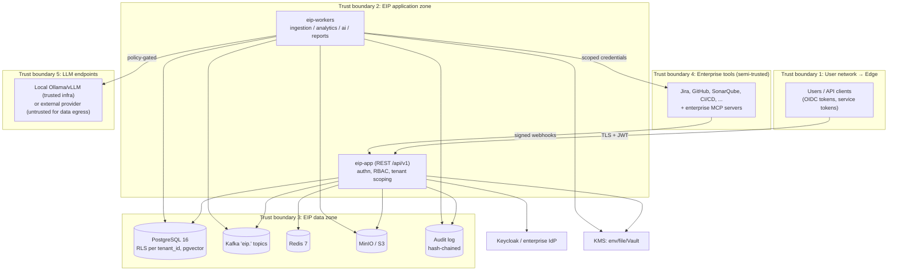

# Security Model

This document defines the threat-model-driven security architecture of the Engineering Intelligence Platform (EIP). EIP is an on-premise, multi-tenant, AI-native platform that ingests sensitive SDLC data (work items, source-control metadata, quality findings, incidents) from enterprise tools; its security model must protect that data, the credentials used to obtain it, and the AI pipeline that reasons over it. A core product constraint shapes the model throughout: EIP is **not** an individual-surveillance tool, and the security model enforces that stance technically (role-gated individual-level signals, pseudonymization, audited access).

Related documents: `../architecture/DeploymentModel.md` (network zones, TLS), `../architecture/ObservabilityModel.md` (audit/trace correlation), `../operations/OperationsGuide.md` (runbooks).

## 1. Assets and Trust Boundaries

Primary assets, in priority order:

| # | Asset | Why it matters |
|---|---|---|
| A1 | Connector credentials (tool tokens, webhook secrets) | Grant read access to enterprise Jira/GitHub/SonarQube/etc.; highest-value theft target |
| A2 | Ingested SDLC data (canonical model, `raw_*` staging, object storage blobs) | Confidential engineering data; cross-tenant leakage is the worst-case product failure |
| A3 | Developer identity data (Member records, ExternalRef identity mappings) | PII; misuse enables surveillance, violating product anti-goals and privacy law |
| A4 | RAG corpus and vector embeddings | Derived confidential data; retrievable via AI features |
| A5 | LLM prompts/outputs and agent tool-call traces | May embed A2/A3 content; egress risk with external providers |
| A6 | Audit log | Integrity target for attackers covering tracks |
| A7 | Platform availability | Executive reporting and delivery-risk workflows depend on it |
| A8 | KMS master key / data keys | Compromise unwraps A1 |

Trust decisions: ingested tool content (TB4) and LLM output (TB5) are treated as **untrusted input** even though the tools are enterprise-internal — this drives the prompt-injection and output-validation controls in Section 8. Tenants are mutually untrusted within one deployment.

## 2. STRIDE Summary

| Threat | Representative scenario | Mitigations |
|---|---|---|
| **S**poofing | Forged webhook posts fake CI events; stolen service token calls API | Webhook HMAC signature validation per connector + per-connector secret; OIDC JWT validation (issuer, audience, expiry, JWKS); service tokens hashed at rest, scoped, expiring; mTLS optional at ingress |
| **T**ampering | Attacker mutates canonical data or audit trail; Kafka message alteration | RLS + least-privilege DB roles; TLS on all links; audit log hash chaining (§11); event envelope `eventId` (UUIDv7) + idempotent consumers reject replays; image signing (§10) |
| **R**epudiation | Admin denies exporting a report or reading a secret | Audit event taxonomy covers every sensitive action with actor, tenant, `traceId`; audit is append-only and tamper-evident |
| **I**nformation disclosure | Cross-tenant read; secret leak in logs/UI; RAG retrieval returning another team's documents; prompts sent to external LLM | Postgres RLS on `tenant_id` + application-layer tenant scoping (defense in depth); AES-256-GCM envelope encryption for secrets; UI masking; log redaction; permission-aware RAG filters (§5); LLM egress policy (§8) |
| **D**enial of service | Connector floods ingestion; runaway agent burns tokens; API abuse | Rate limiting per token/tenant (Redis-backed); Kafka backpressure + DLQ per consumer group; agent budgets (token/cost/time); HPA bounds; request size limits |
| **E**levation of privilege | MEMBER escalates to TENANT_ADMIN; prompt injection makes agent call privileged tool | RBAC with deny-by-default permission checks at controller and service layers; per-agent capability sandboxing and tool allow-lists (§8); MCP per-capability RBAC (§9); no dynamic role grants without TENANT_ADMIN + audit |

## 3. Authentication

- **Primary: OIDC.** Keycloak on-prem by default; pluggable enterprise IdP (AD FS, Azure AD, Okta) via standard OIDC. Authorization Code + PKCE for the React frontend; the backend validates JWTs (issuer, audience, signature via JWKS, expiry, clock skew ≤ 60 s). Group/role claims can be mapped to EIP roles per tenant (claim-mapping config).
- **Local accounts fallback.** For air-gapped bootstrap and break-glass: Argon2id password hashing, configurable password policy, lockout with exponential backoff, mandatory MFA-capable (TOTP) for PLATFORM_ADMIN local accounts. Local login can be disabled per deployment once OIDC is live, except one break-glass admin.
- **Service tokens for API automation.** Long-lived credentials for CI/scripts: created by TENANT_ADMIN (tenant-scoped) or PLATFORM_ADMIN (platform-scoped), bound to a role + optional permission subset, stored as SHA-256 hash, prefix-identifiable (`eipt_...`), expiring (default 90 days, max 365), revocable immediately, last-used timestamp tracked, creation/revocation/use audited.
- **Session policy.** Access tokens ≤ 15 min, refresh via OIDC (refresh token rotation, reuse detection at the IdP); idle timeout 30 min and absolute session lifetime 12 h enforced platform-side; concurrent session limit configurable; logout triggers OIDC back-channel logout where supported. Cookies (if used for the SPA BFF mode): `Secure`, `HttpOnly`, `SameSite=Lax`, CSRF token on mutating requests.

## 4. Authorization — RBAC

Deny-by-default RBAC: roles bundle fine-grained permissions; every `/api/v1` endpoint declares required permissions; service-layer checks repeat the enforcement (defense in depth against controller gaps).

Canonical roles:

| Role | Scope | Intended holder | Summary |
|---|---|---|---|
| `PLATFORM_ADMIN` | Platform (all tenants) | Platform operators | Deployment-wide config, tenant lifecycle, KMS operations, platform health. Cannot silently read tenant business data: cross-tenant data access requires explicit, audited support-access grant |
| `TENANT_ADMIN` | Tenant | Customer IT owner | Tenant config, connectors + secrets, users/roles, AI/LLM policy, MCP allow-lists, retention settings |
| `ORG_ADMIN` | Organization(s) within tenant | Engineering ops lead | Manage Organization/BusinessUnit/Team structure, member mappings, org-level dashboards and reports |
| `MANAGER` | Team(s)/Project(s) | EM / delivery manager | Team-level metrics and reports, sprint/kanban analytics, delivery-risk views, report generation for owned scope |
| `MEMBER` | Own teams | Engineer | Team dashboards, own work-item context, RAG queries within permitted scope |
| `VIEWER` | Granted scope | Stakeholder/exec | Read-only dashboards and published reports |
| `AUDITOR` | Tenant (read-only) | Security/compliance | Read audit log, security config, retention evidence; no business-data mutation, no secret values |

Permission catalog (representative; the catalog is the authoritative enum in `eip-tenancy`):

| Permission | PLATFORM_ADMIN | TENANT_ADMIN | ORG_ADMIN | MANAGER | MEMBER | VIEWER | AUDITOR |
|---|---|---|---|---|---|---|---|
| `tenant.manage` | ✓ | ✓ | — | — | — | — | — |
| `user.manage` / `role.assign` | ✓ | ✓ | org scope | — | — | — | — |
| `connector.configure` | — | ✓ | — | — | — | — | — |
| `connector.secret.write` | — | ✓ | — | — | — | — | — |
| `connector.secret.reveal` | — | opt-in, audited | — | — | — | — | — |
| `dashboard.view` | — | ✓ | ✓ | ✓ | ✓ | ✓ | — |
| `metric.individual.view` (individual-level signals) | — | policy-gated | policy-gated | — | — | — | — |
| `report.generate` | — | ✓ | ✓ | ✓ | — | — | — |
| `report.export` | — | ✓ | ✓ | ✓ | — | scope-gated | — |
| `ai.agent.invoke` | — | ✓ | ✓ | ✓ | ✓ (subset) | — | — |
| `ai.policy.manage` (models, budgets, egress) | — | ✓ | — | — | — | — | — |
| `mcp.capability.invoke:<capability>` | — | per allow-list | per allow-list | per allow-list | — | — | — |
| `audit.read` | ✓ (platform events) | ✓ | — | — | — | — | ✓ |
| `retention.manage` / `erasure.execute` | — | ✓ | — | — | — | — | — |
| `platform.operate` (health, upgrades, KMS rotate) | ✓ | — | — | — | — | — | — |

Enforcement layers:

1. **Tenant scoping.** Every request resolves a `TenantContext` from the token; every table carries `tenant_id` and Postgres Row-Level Security policies filter on the session tenant (set via `SET LOCAL`). Application code never queries without tenant context; RLS is the backstop if it does. Kafka consumers propagate `tenantId` from the event envelope into the same context.
2. **Resource-level checks.** Beyond role checks, ownership/scope checks apply per resource: MANAGER on Team A cannot read Team B's delivery-risk detail; report artifacts and GeneratedReport records carry an access scope evaluated on download; connectors and secrets are tenant-bound objects.
3. **Permission-aware RAG retrieval.** Vector search (pgvector/Qdrant via VectorStore SPI) always applies: (a) tenant isolation (hard filter, enforced in the SPI, not the caller), (b) metadata filters derived from the caller's permissions and scope (source system, project/team visibility, document ACL where the source tool exposes one), (c) result-side re-check before chunks enter the prompt. An agent acting for a user retrieves with that user's effective permissions — never with a service-level superuser context. Retrievals are audit-logged (§11).

## 5. Multi-Tenancy Isolation Summary

| Layer | Mechanism |
|---|---|
| Database | `tenant_id` column + Postgres RLS on every tenant table; per-request `SET LOCAL` tenant binding; Flyway-managed policies |
| Vector store | Tenant filter enforced inside VectorStore SPI; separate Qdrant collections per tenant when Qdrant is used |
| Kafka | `tenantId` in every event envelope; consumers validate envelope tenant against target rows; ordering key `tenantId+entityId` |
| Object storage | Bucket-per-tenant or tenant prefix + per-tenant credentials/policies |
| Cache | Redis key namespace `eip:{tenantId}:...`; no cross-tenant key access in code review checklist |
| AI | Per-tenant model routing, token budgets, RAG isolation, per-tenant MCP allow-lists |
| Rate limits | Per-tenant and per-token quotas |

## 6. Secret Management

- **Envelope encryption.** Every stored secret (connector tokens, webhook secrets, LLM API keys, SMTP credentials) is encrypted with AES-256-GCM using a per-secret data encryption key (DEK); DEKs are wrapped by the master key from the KMS SPI. Ciphertext records: key id, wrap algorithm, nonce, AAD (`tenantId + secretId`), created/rotated timestamps. Secrets are never stored or logged in plaintext.
- **KMS SPI providers.** `env` (master key from environment — demo only), `file` (mounted key file, permissions-checked at startup), `vault` (HashiCorp Vault Transit for wrap/unwrap; key never leaves Vault). Provider is deployment-selected; the SPI allows enterprise HSM adapters later.
- **Rotation procedure.** (1) Master key rotation: introduce new key version → background job re-wraps all DEKs (no data re-encryption needed) → retire old version after re-wrap completes; both versions valid during the window; progress observable via metric and audit events. (2) Secret value rotation: TENANT_ADMIN updates a connector secret; old value overwritten (previous ciphertext retained for one grace period only if the connector supports dual credentials); `connector.testConnection()` validates before commit.
- **UI masking.** Secret values are write-only in the UI/API: displayed as `••••` with last-4 hint where safe; `connector.secret.reveal` is a distinct, default-disabled, always-audited permission. API responses never echo secret fields; OpenAPI marks them `writeOnly`.
- **Access audit.** Every decrypt is an audit event (`secret.access`) with actor (user or worker identity + purpose, e.g. `connector-sync:jira-prod`), secret id, and `traceId`. Anomalous decrypt patterns (volume, unfamiliar purpose) are alertable via the observability stack.

## 7. Data Protection

- **Encryption at rest.** Options by layer: Postgres — volume/filesystem encryption (LUKS/storage-class) as baseline, plus column-level AES-256-GCM for secrets (always) and optionally for identity-mapping tables; Kafka — encrypted volumes (broker-side); MinIO — SSE-S3/SSE-KMS; backups encrypted with a distinct key. At-rest encryption of infrastructure volumes is the deployer's storage-class choice and is documented in the hardening checklist.
- **TLS everywhere.** All internal and external links, minimum TLS 1.2 (prefer 1.3); no plaintext listener anywhere; see `../architecture/DeploymentModel.md` §12.
- **PII: developer identity data.** EIP stores Member records and `ExternalRef` identity mappings (sourceSystem, externalId, url) — this is PII. Controls: identity mapping tables are access-restricted (ORG_ADMIN+), individual-level signals are aggregated to team grain by default per the anti-surveillance stance, and every metric that could resolve to an individual is gated behind `metric.individual.view`, which is disabled by default and requires explicit tenant policy opt-in.
- **Pseudonymization option.** Per-tenant setting: individual-level signals are keyed by a salted pseudonym (`member_pseudo_id`) instead of the Member identity; the mapping table is separately encrypted and readable only by TENANT_ADMIN under audit. Dashboards, reports, and RAG chunks then carry pseudonyms for individual-grain data; team-level analytics (the default product surface: load balance, review bottlenecks, knowledge concentration) are unaffected.
- **Retention and erasure.** Per-tenant retention policies per data class: raw staging (`raw_*` + blobs, default 90 days), canonical model (default 25 months), metrics aggregates (default 37 months), AI call logs (default 13 months), audit (default 25 months, tenant-extendable). Erasure: member off-boarding erases/pseudonymizes identity data across canonical model, vector store (chunk metadata re-index), report artifacts index, and caches; erasure runs produce a signed completion record in the audit log. Kafka topics rely on retention expiry (topics are transport, not the store of record).

## 8. AI-Specific Security

The AI pipeline (agent runtime in `eip-ai`, RAG, MCP) treats all retrieved and tool-returned content as untrusted.

- **Prompt injection defenses (RAG/MCP content).** Retrieved chunks and MCP tool results are: (a) wrapped in delimited data blocks with explicit "data, not instructions" framing in system prompts; (b) sanitized (strip markup that mimics prompt structure, control characters, known injection markers); (c) never allowed to change the agent's tool allow-list, budgets, or system prompt — those are set by platform config only; (d) source-attributed, so an output influenced by a poisoned document is traceable to it. Ingested documents flagged by injection heuristics are quarantined from the RAG index pending review.
- **LLM output validation.** Agent outputs pass through the Validation agent / structured validators before side effects: JSON-schema validation for structured outputs, citation checks (claims in narrative outputs must map to retrieved sources), numeric cross-checks against the metric engine for any quoted metric, and policy filters (no secrets patterns, no individual-ranking language per anti-goals). Invalid outputs are retried within budget, then failed with an auditable reason — never silently accepted.
- **Tool allow-lists and per-agent capability sandboxing.** Each canonical agent (Data Ingestion, Data Quality, Engineering Metrics, Delivery Risk, Sprint Review, Release Notes, Documentation, Use Case Diagram, Architecture Diagram, Executive Summary, Incident Analysis, Code Quality, Team Health, RAG Retrieval, Report Composition, Validation, Security Review, Configuration Assistant) declares a static capability manifest: callable tools, readable data domains, writable outputs, token/cost/time budgets. The runtime enforces the manifest; an agent cannot invoke a tool outside it regardless of model output. Agents execute with the invoking user's effective permissions intersected with the manifest.
- **Model/data egress controls.** Per-tenant LLM policy governs the provider SPI (Ollama, vLLM, OpenAI-compatible generic, Anthropic-compatible, custom enterprise endpoint): which providers are enabled, per-agent model routing, and an egress classification — tenants can restrict specific data classes (e.g. identity data, source snippets) to local providers only. When an external provider is enabled, prompts pass a redaction filter (identity pseudonymization, secret-pattern stripping) before egress, and the audit record marks the call as external.
- **Audit of every LLM call.** Prompt (redacted per policy), model, provider, token counts, cost estimate, latency, caller (user + agent), tenant, `traceId`, and validation verdict — persisted per call and surfaced in metrics (`eip_llm_tokens_total`, `eip_llm_cost_estimate`; see `../architecture/ObservabilityModel.md`).
- **Budgets as a security control.** Token/cost/time budgets per agent run and per tenant cap blast radius of runaway or adversarially-steered agents; exhaustion is an audited, alertable event.

## 9. MCP Security

EIP is both MCP client and MCP server; both directions are constrained.

- **As MCP client:** only TENANT_ADMIN-registered, allow-listed enterprise MCP servers are reachable (egress policy is generated from this list); each server's tools are imported into agent capability manifests explicitly (no wildcard tool adoption); tool results are untrusted input (§8 defenses apply); server credentials live in the secret store (§6).
- **As MCP server:** EIP exposes only explicitly allow-listed internal capabilities (e.g. `metrics.query`, `report.fetch`, `workitem.search`); each capability has per-capability RBAC (`mcp.capability.invoke:<capability>`) evaluated against the authenticated caller's tenant-scoped identity (service token or OIDC); capabilities are read-only unless individually justified; every invocation is audited with capability, caller, arguments digest, and `traceId`.
- **No transitive escalation:** an inbound MCP call cannot cause an outbound LLM call or MCP call beyond the caller's own permissions.

## 10. Supply Chain Security

| Control | Implementation |
|---|---|
| Image signing | All release images signed with cosign; keyless (CI OIDC) or enterprise key; admission policy (Kyverno/OpenShift image policy) verifies signatures + digests in-cluster; air-gapped installs verify at mirror time (`../architecture/DeploymentModel.md` §7) |
| SBOM | CycloneDX SBOM generated per image and per release archive; shipped with the release manifest; consumable by enterprise scanners |
| Dependency scanning | CI gates: OWASP Dependency-Check / Grype on every build; Renovate-managed updates; critical CVEs block release; base images rebuilt on a fixed cadence |
| Build integrity | Reproducible Gradle builds where feasible; provenance attestation (SLSA-style) attached to release artifacts; no build-time network access beyond the locked dependency mirror |
| Third-party models | Offline model bundles carry checksums in the release manifest; model files verified before load |

## 11. Audit Logging

Event taxonomy (category → representative events):

| Category | Events (examples) | Notes |
|---|---|---|
| `auth` | `auth.login.success/failure`, `auth.token.issued/revoked`, `auth.session.expired`, `auth.breakglass.used` | Break-glass use pages on-call |
| `access` | `access.denied`, `secret.access`, `data.export`, `report.download`, `metric.individual.viewed` | Individual-level metric views always audited |
| `admin` | `tenant.created/updated`, `user.role.assigned`, `connector.configured`, `retention.changed`, `ai.policy.changed`, `mcp.allowlist.changed` | Config diffs recorded (secrets masked) |
| `secrets` | `secret.created/rotated/revealed`, `kms.key.rotated` | Reveal is distinct from access |
| `ai` | `llm.call`, `agent.run.started/completed/failed`, `rag.retrieval`, `agent.budget.exhausted`, `output.validation.failed` | See §8 |
| `mcp` | `mcp.capability.invoked`, `mcp.server.registered`, `mcp.client.connected` | Both directions |
| `data` | `erasure.executed`, `retention.purge.completed`, `ingestion.replay.triggered` | Signed completion records |
| `platform` | `upgrade.applied`, `migration.executed`, `backup.completed/failed`, `support.access.granted` | PLATFORM_ADMIN actions |

Properties:

- **Schema.** Every event: `auditId (UUIDv7), occurredAt, tenantId, actor {type: USER|SERVICE_TOKEN|WORKER|AGENT, id}, category, event, target {type, id}, outcome, traceId, details (redacted)`. `traceId` links audit events to distributed traces (`../architecture/ObservabilityModel.md` §10).
- **Tamper evidence via hash chaining.** Each audit record stores `prevHash` and `hash = SHA-256(prevHash || canonical(record))`, chained per tenant partition; a scheduled verifier job re-walks chains and emits `eip_job_failures_total{job="audit-verify"}` on mismatch; periodic chain-head anchors are written to object storage under WORM/object-lock where available. Audit tables accept only INSERT for application roles (no UPDATE/DELETE grants).
- **Retention and access.** Default 25 months, tenant-extendable, exportable (NDJSON) for SIEM shipping via the Loki/OTLP pipeline or file export. Readable by AUDITOR and TENANT_ADMIN (tenant scope) and PLATFORM_ADMIN (platform events); audit reads are themselves audited.

## 12. Compliance Mapping

| Control family (SOC 2 / ISO 27001) | Platform features |
|---|---|
| Access control (CC6.1–6.3 / A.5.15–A.5.18, A.8.2) | OIDC SSO, RBAC roles + permission catalog, tenant scoping + RLS, resource-level checks, session policy, service token lifecycle |
| Logical access — least privilege (CC6.1 / A.8.3) | Deny-by-default permissions, per-agent capability sandboxing, per-capability MCP RBAC |
| Encryption (CC6.7 / A.8.24) | TLS everywhere, AES-256-GCM envelope encryption, KMS SPI (Vault/HSM path), encrypted backups |
| Audit & monitoring (CC7.2–7.3 / A.8.15–A.8.16) | Hash-chained audit log, event taxonomy, SIEM export, alerting rules, trace correlation |
| Change management (CC8.1 / A.8.32) | Expand–contract migrations, signed images, versioned release manifests, upgrade gating |
| Vulnerability management (CC7.1 / A.8.8) | Dependency scanning gates, SBOM, base-image cadence, security testing checklist (§13) |
| System operations & availability (A1.1–A1.3 / A.8.14) | HA/DR with RPO/RTO targets, backup/restore runbooks, SLOs with error budgets |
| Data lifecycle & privacy (CC6.5, P-series / A.8.10–A.8.12) | Retention policies per data class, erasure workflow with signed completion, pseudonymization option, PII access gating |
| Supplier/third-party (CC9.2 / A.5.19–A.5.23) | LLM egress controls and per-provider policy, MCP allow-lists, connector credential scoping |
| Incident management (CC7.4–7.5 / A.5.24–A.5.27) | Incident response hooks (§14), audit evidence, on-call alert routing |

Compliance mapping is evidence support, not certification: the deploying organization owns the audit; EIP supplies the technical controls and their evidence trails.

## 13. Security Testing Checklist

- [ ] AuthN: JWT validation negative tests (expired, wrong audience/issuer, alg confusion, tampered signature); local-account lockout; break-glass audit.
- [ ] AuthZ: per-endpoint permission matrix tests generated from the permission catalog; resource-level ownership tests (cross-team, cross-org denial); RLS verified by attempting cross-tenant reads with a mis-scoped application session.
- [ ] Tenant isolation: automated cross-tenant probe suite across API, RAG retrieval, report artifacts, cache keys, Kafka consumer handling of mismatched envelope `tenantId`.
- [ ] Secrets: no plaintext secrets in DB dumps, logs, traces, API responses, or heap dumps (sampled); rotation drill for master key and a connector secret; reveal-permission audit verified.
- [ ] AI: prompt-injection regression corpus (poisoned RAG documents, hostile MCP tool results) must not trigger out-of-manifest tool calls or policy-violating outputs; budget exhaustion behaves as specified; external-egress redaction verified.
- [ ] Web: OWASP ASVS L2 baseline — CSRF, XSS (report/dashboard rendering of ingested content), SSRF on connector URL config (deny link-local/metadata ranges, DNS-rebinding protection), injection (SQL/JSONB), file upload handling for Generic File/Document connector.
- [ ] Webhooks: signature bypass attempts, replay attempts (timestamp + nonce window), oversized payloads.
- [ ] Audit: hash-chain verifier detects seeded tampering; INSERT-only grants confirmed.
- [ ] Supply chain: unsigned image rejected by admission policy; SBOM matches image contents; CVE gate blocks a seeded critical.
- [ ] DoS: rate limits enforced per token/tenant; ingestion flood parks in DLQ without starving other tenants.
- [ ] Pen test before GA (Phase 5) and after major architecture changes; findings tracked as SecurityFinding entities with aging metrics.

## 14. Incident Response Hooks

- **Detection:** security-relevant alerts (auth failure spikes, break-glass use, audit-chain mismatch, anomalous secret access, agent budget exhaustion spikes, egress-policy drops) route through Prometheus Alertmanager to the enterprise on-call channel; audit stream is SIEM-exportable in near-real-time.
- **Containment switches (runbook-invocable, all audited):** disable a connector, revoke all service tokens for a tenant, disable external LLM providers platform-wide, disable MCP server exposure, force-logout a tenant's sessions, freeze a tenant (read-only mode).
- **Evidence:** hash-chained audit log + trace correlation gives a per-incident timeline (`traceId` joins audit, logs, traces); export bundle command produces a sealed evidence archive.
- **Recovery:** secret rotation procedure (§6), key rotation, restore-from-backup runbooks in `../operations/OperationsGuide.md`; post-incident review template records actions as DecisionRecord entities.

## 15. Acceptance Criteria

- [ ] Given a user with MANAGER on Team A only, when they request Team B delivery-risk detail via API or RAG query, then the response is 403/empty and an `access.denied` audit event is recorded.
- [ ] Given a tenant with pseudonymization enabled, when any dashboard, report, or RAG retrieval includes individual-grain data, then only `member_pseudo_id` values appear and de-mapping requires TENANT_ADMIN with audit.
- [ ] Given a poisoned document containing instruction-like text, when an agent retrieves it, then no out-of-manifest tool call occurs and the source is traceable in the agent run audit.
- [ ] Given an external LLM provider enabled with identity-egress restricted, when an agent prompt contains Member identity data, then the prompt is redacted before egress and the LLM call audit marks it external.
- [ ] Given any single audit row is modified in the database, when the chain verifier runs, then the tampering is detected and alerted within one verification cycle.
- [ ] Given a revoked service token, when it is presented, then the request fails and `auth.token.revoked` usage attempts are audited.
