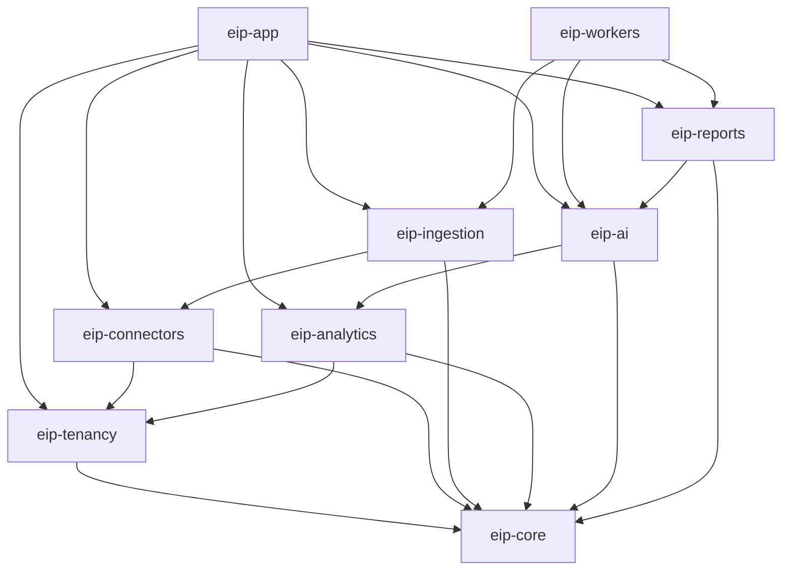

# Backend Implementation Plan

This document is the implementation plan for the Engineering Intelligence Platform (EIP) backend: a Java 21 / Spring Boot 3.x **modular monolith following Spring Modulith conventions**, built as a Gradle multi-module project under `/backend`, with a separately deployable async worker runtime (`eip-workers`). Modules are designed to be extractable to services later.

Sibling documents of record: `../architecture/DomainModel.md` (entities), `APIDesign.md` (REST surface), `EventModel.md` (Kafka topics, envelope, consumer conventions), `DatabasePlan.md` (schema, RLS, Flyway, partitioning), `ConnectorFramework.md` (Connector SPI detail), `../testing/TestingStrategy.md` (test strategy), `../infrastructure/LocalDevelopment.md` (local run story). Where this plan summarizes one of those areas, the sibling document is authoritative.

## 1. Gradle multi-module layout

The `/backend` Gradle build contains exactly the modules from the monorepo plan. `eip-app` is the composition root; every other module is a Spring Modulith application module (or a library consumed by them). Version catalogs (`gradle/libs.versions.toml`) pin all dependency versions; convention plugins under `buildSrc` apply shared compiler, test, and quality settings.

| Module | Description | Key packages | May depend on |
|---|---|---|---|
| `eip-app` | Composition root / main API app. Spring Boot entry point, REST controllers wiring, OpenAPI (springdoc), security filter chain (OIDC + local accounts), problem+json advice, actuator. Contains no business logic. | `com.eip.app`, `com.eip.app.api`, `com.eip.app.security`, `com.eip.app.config` | All modules (composition root only) |
| `eip-core` | Domain model and shared kernel: canonical entities (`WorkItem` supertype, `ExternalRef`, Sprint, Release, Deployment, Incident, …), event envelope, IDs (UUIDv7), time/grain types, common errors, secrets SPI (KMS SPI, AES-256-GCM envelope encryption), object storage abstraction (S3/MinIO), VectorStore SPI. | `com.eip.core.domain`, `com.eip.core.events`, `com.eip.core.secrets`, `com.eip.core.storage`, `com.eip.core.vector`, `com.eip.core.error` | (none — leaf) |
| `eip-tenancy` | Organizations, tenants, BusinessUnits, Teams, Members, RBAC (roles + fine-grained permissions), audit log write/query, tenant context propagation, Postgres RLS session variable management. | `com.eip.tenancy.org`, `com.eip.tenancy.rbac`, `com.eip.tenancy.audit`, `com.eip.tenancy.context` | `eip-core` |
| `eip-connectors` | Connector SPI + built-in connectors (Jira, Confluence, GitHub, GitLab, Bitbucket, SonarQube, Artifactory, Kubernetes, OpenShift, Docker Registry, Prometheus, Grafana, OTLP intake, Generic CI/CD, Generic REST, Generic SQL, Generic File/Document, Custom internal demand/project tool). JSON Schema config, `validate()`, `testConnection()`, `healthCheck()`, `fullSync()`, `incrementalSync(checkpoint)`, webhook intake, simulation/mock mode. | `com.eip.connectors.spi`, `com.eip.connectors.jira`, `com.eip.connectors.github`, `com.eip.connectors.sonarqube`, … (one package per connector), `com.eip.connectors.simulation` | `eip-core`, `eip-tenancy` (tenant context only) |
| `eip-ingestion` | Queue consumers, sync engine, checkpointing, raw staging (`raw_*` JSONB), normalizers to canonical model, dedup, DLQ handling, webhook dispatch to connectors. | `com.eip.ingestion.sync`, `com.eip.ingestion.raw`, `com.eip.ingestion.normalize`, `com.eip.ingestion.checkpoint`, `com.eip.ingestion.dlq` | `eip-core`, `eip-tenancy`, `eip-connectors` |
| `eip-analytics` | Metric engines (flow, DORA, quality, delivery risk, ops, team health), metric definitions registry (purpose, formula, inputs, grain, caveats/limitations, gaming risks), risk scoring, forecasts. | `com.eip.analytics.metrics`, `com.eip.analytics.definitions`, `com.eip.analytics.risk`, `com.eip.analytics.forecast`, `com.eip.analytics.query` | `eip-core`, `eip-tenancy` |
| `eip-ai` | Agent orchestration (LangChain4j), LLM provider SPI (Ollama, vLLM, OpenAI-compatible generic, Anthropic-compatible, custom enterprise endpoint), per-tenant/per-agent model routing, budgets, guardrails, LLM call audit, RAG pipeline (chunking, embedding, pgvector/Qdrant retrieval), MCP client and MCP server. | `com.eip.ai.agents`, `com.eip.ai.llm.spi`, `com.eip.ai.llm.providers`, `com.eip.ai.rag`, `com.eip.ai.mcp.client`, `com.eip.ai.mcp.server`, `com.eip.ai.audit` | `eip-core`, `eip-tenancy`, `eip-analytics` (metric query API only) |
| `eip-reports` | Report/template engine, artifact library (versioned, MinIO-backed), exports (md/pdf/html/json/csv/pptx), scheduled report generation. | `com.eip.reports.templates`, `com.eip.reports.engine`, `com.eip.reports.artifacts`, `com.eip.reports.export` | `eip-core`, `eip-tenancy`, `eip-analytics`, `eip-ai` (Report Composition agent invocation) |
| `eip-workers` | Deployable async worker runtime. A second Spring Boot main class that composes the same modules but activates only Kafka consumers, sync jobs, agent executors, and report generators — no REST API. | `com.eip.workers`, `com.eip.workers.profiles` | All modules (composition root only) |

Dependency rules are enforced, not documented-only: any dependency not listed above fails the Modulith verification test (section 3) and a Gradle `java-library` API/implementation split keeps transitive leakage out.

Build conventions applied by `buildSrc` plugins to every module:

```kotlin
// buildSrc/src/main/kotlin/eip.java-conventions.gradle.kts (excerpt)
plugins { `java-library`; id("com.diffplug.spotless"); id("net.ltgt.errorprone") }
java { toolchain { languageVersion = JavaLanguageVersion.of(21) } }
tasks.withType<JavaCompile> { options.compilerArgs.addAll(listOf("-parameters", "-Werror")) }
tasks.test { useJUnitPlatform(); systemProperty("spring.threads.virtual.enabled", "true") }
```

Two additional convention plugins: `eip.boot-app-conventions` (only `eip-app` and `eip-workers`; produces boot jars and container images) and `eip.modulith-conventions` (adds `spring-modulith-starter-core`, test fixtures, and the `ModularityTests` source set to every application module).



## 2. Spring Boot 3.x conventions

1. **Constructor injection only.** No field or setter injection; `@Autowired` on constructors is omitted (implicit). Beans are `final`-field classes or records where stateless.
2. **Configuration via `@ConfigurationProperties` on validated records.** Every module owns its config record(s), e.g.:

```java
@ConfigurationProperties(prefix = "eip.connectors")
@Validated
public record ConnectorProperties(
    @NotNull @Positive Integer maxConcurrentSyncsPerTenant,
    @NotNull Duration defaultSyncTimeout,
    @Valid RetryDefaults retry) {
  public record RetryDefaults(@Min(0) int maxAttempts, @NotNull Duration initialBackoff, @NotNull Duration maxBackoff) {}
}
```

   No `@Value` in production code. All properties documented via `spring-boot-configuration-processor` metadata.
3. **Profiles.** Exactly three runtime profiles:
   - `local` — developer laptop against the Docker Compose stack (`../infrastructure/LocalDevelopment.md`); relaxed security (local accounts), verbose logging, simulation connectors enabled.
   - `demo` — full stack with simulated enterprise data packs (`/simulation`), Keycloak, seeded tenants; used for demos and Playwright E2E.
   - `prod` — hardened defaults: OIDC required, TLS, secrets from KMS SPI, structured JSON logs only, RLS enforced, actuator restricted.
   Worker role selection uses additional profiles (section 9), never a fourth environment profile.
4. **No `@Transactional` on controllers.** Transactions live in application services; controllers translate DTO ↔ domain and nothing else. Layering inside a module is `api` (controllers, only in `eip-app`) → application service → domain → infrastructure (repositories, clients); MapStruct-free — mapping is explicit static factory methods on DTO records.
5. **Time and IDs.** `Clock` is injected everywhere (testability); entity IDs are UUIDv7 generated in `eip-core`.
6. **Actuator.** `health` (liveness/readiness groups), `info`, `prometheus` exposed; everything else disabled in `prod`. Worker processes expose the same actuator on a management port for K8s probes.
7. **Logging.** Structured JSON (Logback + logstash encoder) in `demo`/`prod`, human-readable in `local`; every log line carries `tenantId`, `traceId`, `spanId` from MDC populated by the tenant-context filter and OTel instrumentation. Log levels are runtime-adjustable via actuator `loggers` for `system:operate` holders only.

## 3. Spring Modulith usage

- Each module directory maps to a Modulith `@ApplicationModule` with an explicit `package-info.java` declaring allowed dependencies and named interfaces (e.g., `eip-analytics` exposes only `com.eip.analytics.query` to `eip-ai`).
- **Verification tests:** every module ships `ModularityTests` asserting `ApplicationModules.of(EipApplication.class).verify()` plus documentation snapshot generation (`Documenter`) committed under `docs/architecture/generated/`. A dependency-rule violation is a compile-red event, not a review comment.
- **Event externalization to Kafka:** domain events are published in-process via `ApplicationEventPublisher` and externalized with `@Externalized("eip.domain.workitem::#{#this.tenantId()}")` style mappings so the Kafka topic (`eip.domain.workitem`, `eip.domain.scm`, `eip.domain.cicd`, `eip.domain.quality`, `eip.domain.ops`, `eip.analytics.metrics`, `eip.ai.jobs`, `eip.ai.results`, `eip.reports.jobs`) and the partition key (`tenantId+entityId`, preserving the per-key ordering guarantee) are declared next to the event type. Externalization is backed by the transactional outbox (section 6), not fire-and-forget.
- Cross-module synchronous calls go through the exposing module's named interface (a Java interface in its API package); everything else communicates via events.

## 4. Coding standards (Java 21 features policy)

| Feature | Policy |
|---|---|
| Records | Mandatory for DTOs, config properties, event payloads, value objects. JPA entities remain classes. |
| Sealed interfaces | Mandatory for event families and closed taxonomies: `sealed interface DomainEvent permits WorkItemEvent, ScmEvent, CicdEvent, QualityEvent, OpsEvent`, connector sync results, agent run states. Enables exhaustive `switch` pattern matching in consumers. |
| Pattern matching / `switch` | Preferred over visitor patterns and `instanceof` chains for event handling and normalizer dispatch. |
| Virtual threads | Enabled (`spring.threads.virtual.enabled=true`) and mandatory for blocking IO in connectors: every connector HTTP/SQL/file call runs on virtual threads via a per-connector `ExecutorService` (`Executors.newVirtualThreadPerTaskExecutor()`), bounded by Resilience4j bulkheads (section 7). No reactive stack; blocking clients (RestClient, JDBC) + virtual threads keep connector code linear and debuggable. |
| Text blocks | For JSON Schema literals, JdbcClient SQL, and prompt templates. |
| Nullness | JSpecify annotations; `Optional` only as return type. |
| Forbidden | `java.util.Date`, field injection, checked-exception tunneling, `synchronized` blocks around IO on virtual threads (pinning) — use `ReentrantLock`. |

Formatting: Spotless + Google Java Format; static analysis: Error Prone + NullAway in CI.

## 5. Persistence approach

**Decision: Spring Data JPA for CRUD + `JdbcClient` for analytics queries** (over jOOQ).

- JPA (Hibernate) owns the transactional CRUD side: tenancy, RBAC, connector configs, checkpoints, jobs, agent runs, report metadata. Aggregates are small; optimistic locking (`@Version`) backs the ETag/If-Match contract in `APIDesign.md`.
- `JdbcClient` owns the analytics read side in `com.eip.analytics.query`: metric rollups, DORA aggregations, risk-score scans over `raw_*` JSONB and canonical tables. Queries are hand-written SQL in text blocks, mapped to records.
- **Why JdbcClient over jOOQ:** the analytics SQL is Postgres-16-specific (JSONB operators, window functions, `date_bin`, RLS session settings) and benefits from being literal SQL reviewable by DBAs; jOOQ's code generation adds a build-time schema dependency and a large API surface for little gain when we do not need type-safe dynamic query construction — the metric query endpoint composes from a small, closed grammar (grain, time range, group-by) that a query-builder class over JdbcClient covers safely with named parameters (no string concatenation of user input). One fewer license/codegen moving part on-premise.
- Flyway owns all schema migration (`db/migration/V*__*.sql`), including RLS policies (`CREATE POLICY tenant_isolation ... USING (tenant_id = current_setting('eip.tenant_id')::uuid)`). Every table carries `tenant_id`; the tenant context filter sets `eip.tenant_id` per transaction via a `ConnectionCustomizer` in `eip-tenancy`.
- Hibernate `ddl-auto=validate` in all profiles; schema truth lives in Flyway only.
- Schema conventions, representative DDL, indexing, partitioning of high-volume event/raw tables, retention, and pgvector setup are specified in `DatabasePlan.md`; this plan defers to it entirely for the physical model.

## 6. Transactions and the transactional outbox

**Decision: transactional outbox table + in-process poller (Debezium-free).**

- Every domain event emitted inside a transaction is written to `event_outbox` (`event_id UUIDv7 PK, tenant_id, topic, partition_key, envelope JSONB, occurred_at, published_at NULL, attempts`) in the same transaction as the state change. Spring Modulith's event publication registry is configured to use this table as its externalization journal.
- A poller (Quartz job, section 8) selects unpublished rows `FOR UPDATE SKIP LOCKED` in `occurred_at` order per partition key, publishes to Kafka with acks=all, marks `published_at`, and retries with capped backoff on failure. Rows older than the retention window with exhausted attempts land in an operator-visible dead-letter state surfaced via the Jobs API.
- **Why not Debezium:** Debezium requires Kafka Connect plus Postgres logical replication slots — two more stateful services to operate in on-premise and air-gapped installs, with WAL-slot disk-growth failure modes that enterprise DBAs must learn. The poller is plain Java in the codebase we already ship, delivers the same at-least-once guarantee (consumers are idempotent, deduping on `eventId` per the ingestion model), and its ~1s polling latency is irrelevant for analytics/RAG/report consumers. If a future tenant needs sub-100ms fan-out, CDC can replace the poller behind the same outbox table without touching producers.
- Event envelope fields are exactly the canonical set: `eventId (UUIDv7), tenantId, source, entityType, entityId, eventType, occurredAt, ingestedAt, schemaVersion, payload, traceparent`.
- Poller mechanics, batch sizes, ordering guarantees per partition key, and outbox monitoring metrics are specified in `EventModel.md` §9; the DLQ policy for exhausted publications in `EventModel.md` §10.

## 7. Resilience stack (Resilience4j)

Every connector gets a named Resilience4j instance set, configured per connector type with per-tenant overrides in the connector config (validated against its JSON Schema):

| Decorator | Default | Notes |
|---|---|---|
| Retry | 5 attempts, exponential backoff 500ms → 30s, jitter 0.5 | Retries only on IO/5xx/429; honors `Retry-After`. Never retries non-idempotent webhook acks. |
| CircuitBreaker | 50% failure rate over sliding window 20, open 60s, half-open 5 probes | Open circuit flips connector `healthCheck()` to DEGRADED and is visible on the connector health endpoint. |
| RateLimiter | Per connector instance, from config (e.g., Jira Cloud 90 req/10s) | Distributed budget state in Redis (Redisson) so app + workers share the limit. |
| Bulkhead | Semaphore bulkhead, default 10 concurrent calls per connector instance | Caps virtual-thread fan-out per external system; prevents one tenant's full sync from starving others. |
| TimeLimiter | 30s per call, 2h per full sync run | Sync-level timeout enforced by the sync engine, call-level by Resilience4j. |

Order: Bulkhead → RateLimiter → CircuitBreaker → Retry → TimeLimiter around the client call. All decorators emit Micrometer metrics (`eip.connector.calls`, tags: connector, tenant, outcome) exported via OpenTelemetry. Connector-level semantics (which SPI operations are retryable, checkpoint interaction on failure) are defined in `ConnectorFramework.md` §5.

Configuration is layered: platform defaults in YAML, per-connector-type overrides shipped with the connector, per-instance overrides from the connector's validated config:

```yaml
resilience4j:
  retry:
    configs:
      connector-default: { max-attempts: 5, wait-duration: 500ms,
        enable-exponential-backoff: true, exponential-max-wait-duration: 30s,
        enable-randomized-wait: true }
    instances:
      jira: { base-config: connector-default }
      sonarqube: { base-config: connector-default, max-attempts: 3 }
  circuitbreaker:
    configs:
      connector-default: { sliding-window-size: 20, failure-rate-threshold: 50,
        wait-duration-in-open-state: 60s, permitted-number-of-calls-in-half-open-state: 5 }
  bulkhead:
    configs:
      connector-default: { max-concurrent-calls: 10 }
```

## 8. Scheduled jobs

**Decision: Quartz in clustered JDBC-store mode** (over ShedLock + `@Scheduled`, and over a bespoke DB-lease).

- Justification: EIP's schedules are user-managed data, not code — tenants configure connector sync cadences, scheduled re-index of RAG sources, and scheduled report generation at runtime. Quartz gives durable, tenant-editable triggers (cron + interval), misfire policies per job class, and cluster-wide exactly-one-node execution via its JDBC job store on the existing Postgres — no extra infrastructure. ShedLock only deduplicates statically-coded `@Scheduled` methods and cannot represent runtime-created per-tenant schedules; a DB-lease reimplements Quartz's hard parts (misfires, recovery) badly.
- Job classes (all idempotent, all tenant-scoped): `ConnectorSyncJob`, `OutboxPollJob` (short interval, non-concurrent), `CheckpointCompactionJob`, `MetricRollupJob`, `RagReindexJob`, `ReportScheduleJob`, `RetentionSweepJob`, `SecretRotationReminderJob`.
- Quartz runs only in worker processes (profile `worker-scheduler`), never in the API app, so API pods stay stateless and horizontally scalable.

## 9. Async worker runtime (`eip-workers`)

- **Same codebase, different composition root.** `eip-workers` reuses module beans; role profiles select what runs:

| Profile | Activates |
|---|---|
| `worker-ingestion` | Kafka consumers for `eip.raw.<connector>`, normalizers, checkpointing |
| `worker-analytics` | Consumers for `eip.domain.*` → metric engines → `eip.analytics.metrics` |
| `worker-ai` | Consumers for `eip.ai.jobs`, agent executors, RAG indexers → `eip.ai.results` |
| `worker-reports` | Consumers for `eip.reports.jobs`, export renderers |
| `worker-scheduler` | Quartz cluster node + outbox poller |

  A single process may combine profiles (local/demo run everything in one worker); prod scales each role independently.
- **Consumer group conventions:** group id = `eip.<module>.<purpose>` (e.g., `eip.ingestion.normalize-workitems`, `eip.analytics.dora`); one group per logical consumer, DLQ topic per group named `<topic>.<group>.dlq` per the ingestion model. Consumers are idempotent (dedup on `eventId` against a processed-events table with TTL), commit offsets after successful processing, and forward poison messages to the DLQ with the failure cause in headers after 3 delivery attempts.
- Kafka listener concurrency maps to partition count; processing inside a partition is single-threaded to preserve per-key ordering (`tenantId+entityId`). Full consumer conventions (offset management, poison-message headers, lag SLOs, backpressure) are in `EventModel.md` §8–§12.
- Workers are horizontally scalable per role; the only stateful coordination is Quartz's JDBC store and Redisson locks. Graceful shutdown drains in-flight Kafka batches and pauses Quartz triggers before SIGTERM deadline (30s).

### 9.1 Kafka topic ownership

Producers and consumer groups per topic (catalog and retention in `EventModel.md` §3):

| Topic | Produced by | Consumed by (groups) |
|---|---|---|
| `eip.raw.<connector>` | `eip-connectors` (via ingestion outbox path) | `eip.ingestion.normalize-*` |
| `eip.domain.workitem` / `eip.domain.scm` / `eip.domain.cicd` / `eip.domain.quality` / `eip.domain.ops` | `eip-ingestion` normalizers | `eip.analytics.*`, `eip.ai.rag-index`, `eip.reports.triggers` |
| `eip.analytics.metrics` | `eip-analytics` engines | dashboard cache warmers, `eip.reports.triggers` |
| `eip.ai.jobs` / `eip.ai.results` | `eip-app` (run creation) / `eip-ai` executors | `eip.ai.executor` / `eip-app` SSE bridge, `eip.reports.compose` |
| `eip.reports.jobs` | `eip-app`, Quartz schedules | `eip.reports.render` |
| `<topic>.<group>.dlq` | consumer error handlers | DLQ inspection/replay API (`APIDesign.md` §4.3) |

## 10. Error handling taxonomy

Sealed hierarchy in `com.eip.core.error`, mapped centrally to RFC 7807 problem+json by a single `@RestControllerAdvice` in `eip-app`:

| Exception | HTTP | `type` URI suffix |
|---|---|---|
| `EipException` (sealed base) | — | — |
| ├ `ValidationException` | 400 | `/problems/validation` (with `errors[]` field detail) |
| ├ `AuthenticationException` | 401 | `/problems/unauthenticated` |
| ├ `PermissionDeniedException` | 403 | `/problems/permission-denied` (includes required permission) |
| ├ `ResourceNotFoundException` | 404 | `/problems/not-found` (never leaks cross-tenant existence) |
| ├ `ConflictException` (version/ETag, duplicate idempotency key with different body) | 409 / 412 | `/problems/conflict`, `/problems/precondition-failed` |
| ├ `RateLimitedException` | 429 | `/problems/rate-limited` (with `Retry-After`) |
| ├ `ConnectorException` (sealed: `ConnectorAuthException`, `ConnectorRateLimitException`, `ConnectorUnavailableException`, `ConnectorConfigException`) | 502/503/400 | `/problems/connector/*` |
| ├ `LlmProviderException` (budget exceeded, provider down, guardrail block) | 502/402-semantics-as-409/422 | `/problems/llm/*` |
| └ `InternalException` (catch-all; logged with traceId, generic detail to client) | 500 | `/problems/internal` |

Every problem+json response carries `traceId` (from `traceparent`) and `tenantId`-safe detail only. Worked example in `APIDesign.md` §7.

## 11. Validation strategy

1. **Bean Validation (Jakarta)** on all request DTO records, config-property records, and domain factory methods; groups for create vs update.
2. **JSON Schema for connector configs** (and LLM provider / MCP server configs): each connector publishes its configuration schema via the Connector SPI (`ConnectorDescriptor.configSchema()`); the platform validates submitted configs against the schema server-side (networknt json-schema-validator, draft 2020-12) before `validate()`/`testConnection()`, and serves the schema to the frontend, which renders JSON-Schema-driven forms (`FrontendPlan.md` §6). Schemas are versioned with the connector; migration of stored configs is a connector responsibility on upgrade.
3. Secrets inside configs are declared in-schema (`"format": "eip-secret"`), stored via the envelope-encryption secrets SPI, and returned masked.

## 12. Observability conventions

- **OpenTelemetry SDK everywhere:** traces, metrics, and logs exported to the OTel Collector (→ Prometheus + Grafana + Tempo/Loki, optional per install). Auto-instrumentation for HTTP server/client, JDBC, and Kafka; manual spans for connector SPI operations (`connector.sync`, `connector.testConnection`), agent steps (`agent.plan`, `agent.tool_call`, `llm.call`), and report rendering.
- **Trace continuity across async hops:** the event envelope's `traceparent` field carries the W3C trace context through the outbox and Kafka, so a Jira webhook can be traced webhook intake → raw topic → normalizer → domain event → metric recompute → dashboard query.
- **Micrometer metric naming:** `eip.<module>.<thing>` with mandatory tags `tenant` (bounded cardinality: tenant id) and module-specific tags — e.g., `eip.ingestion.events.processed{topic,group,outcome}`, `eip.analytics.metric.compute.duration{metricKey}`, `eip.ai.llm.tokens{provider,model,agent,direction}`, `eip.outbox.lag.seconds`, `eip.connector.calls{connector,outcome}`.
- **Golden signals per worker role** (dashboards shipped in `/infra/grafana`): consumer lag, DLQ depth, outbox lag, sync duration/failure rate, LLM latency/cost, report render time.
- Health: liveness = process up; readiness = DB + Kafka + Redis reachable; the aggregate `/api/v1/system/health` endpoint composes these with worker heartbeats (rows in a `worker_heartbeat` table refreshed every 10s).

## 13. Security & secrets conventions

- **Secrets:** AES-256-GCM envelope encryption; data keys per secret, master key from env/file/Vault via the pluggable KMS SPI in `eip-core` (`com.eip.core.secrets`). Secrets never appear in plaintext at rest or in logs, are masked in every API response (`"•••• last4"`), access is audited, and rotation re-wraps data keys without re-encrypting payload history. Connector/LLM/MCP configs declare secret fields with `"format": "eip-secret"` in their JSON Schemas.
- **Tenant isolation is layered:** JWT → tenant context → Postgres RLS session variable → RLS policy on every tenant-scoped table (`DatabasePlan.md` §5). Application-level `WHERE tenant_id = ?` is written anyway (belt and braces) but RLS is the enforcement boundary; an RLS regression test suite runs in CI.
- **AuthN/AuthZ:** OIDC resource server (Keycloak default, pluggable IdP) + local accounts fallback; method-level guards (`@PreAuthorize("hasPermission(...)")`) backed by the RBAC permission evaluator in `eip-tenancy`; every mutating endpoint's permission is declared in OpenAPI via `x-eip-permission` (`APIDesign.md` §10).
- **Audit:** all mutating admin/config actions, secret accesses, LLM calls (prompts redacted per policy), MCP invocations, DLQ discards, and act-as-tenant usages write structured audit events in the same transaction as the action (or the same consumer offset commit for async actions).
- Air-gapped posture: no outbound calls except configured connectors and LLM providers; dependency resolution, container images, and model weights all mirror-able (`../infrastructure/` docs).

## 14. Testing layers per module

The full strategy, tooling versions, and coverage gates live in `../testing/TestingStrategy.md`; the per-module contract is:

| Layer | Scope | Applies to |
|---|---|---|
| Unit (JUnit 5 + AssertJ + Mockito) | Domain logic, metric formulas (golden datasets), normalizers, guardrails | All modules |
| `@DataJpaTest` + Testcontainers Postgres | Repositories, RLS policies (assert cross-tenant reads return empty), Flyway migrations | `eip-tenancy`, `eip-ingestion`, `eip-analytics`, `eip-ai`, `eip-reports` |
| Integration (Testcontainers: Postgres 16, Kafka KRaft, Redis 7, MinIO) | Sync engine end-to-end with WireMock'd connectors, outbox → Kafka → consumer → DLQ paths, agent runs against a stub LLM provider | `eip-connectors`, `eip-ingestion`, `eip-analytics`, `eip-ai`, `eip-reports`, `eip-workers` |
| Modulith verification | `ApplicationModules.verify()`, event externalization mapping tests, `@ApplicationModuleTest` slices | All modules via `eip-app` |
| API contract | REST Assured against `eip-app` with `demo`-like seed; OpenAPI diff gate | `eip-app` |

Connector simulation/mock mode doubles as the test fixture source, so connector tests never need vendor sandboxes.

## 15. Local run story

Local development runs the API app (profile `local`) and one combined worker against the Docker Compose stack (Postgres 16, Kafka KRaft, Redis 7, MinIO, Keycloak, OTel Collector + Prometheus + Grafana) defined in `/infra/docker-compose`; setup, seed data packs, and troubleshooting are documented in `../infrastructure/LocalDevelopment.md`. `./gradlew :eip-app:bootRun -Plocal` and `./gradlew :eip-workers:bootRun -Plocal` are the only commands a new developer needs after `docker compose up -d`.

## 16. Build & CI pipeline stages

| Stage | Runs | Gate |
|---|---|---|
| 1. Compile & static analysis | `compileJava`, Error Prone, NullAway, Spotless check | Zero warnings-as-errors |
| 2. Unit tests | `test` (all modules, parallel) | Green + JaCoCo line ≥ 80% on changed modules |
| 3. Modulith verification | `ModularityTests`, generated module docs diff | No dependency-rule violations |
| 4. Persistence & integration tests | Testcontainers suites | Green |
| 5. API contract | OpenAPI generation + openapi-diff vs `main` | No undocumented breaking change (see `APIDesign.md` §3) |
| 6. Security | OWASP dependency-check, Trivy on image, secret scan | No critical CVEs unwaived |
| 7. Package | Boot jars for `eip-app` + `eip-workers`, multi-arch container images, SBOM (CycloneDX) | Reproducible image labels (git SHA) |
| 8. Deploy demo | Compose-based demo stack, seed simulation data, smoke tests + Playwright E2E (`FrontendPlan.md` §10) | Smoke green |

## 17. Phase mapping

Backend workstream per the canonical roadmap (`../vision/Vision.md`):

| Phase | Backend deliverables from this plan |
|---|---|
| Phase 0 – Foundations | Gradle multi-module skeleton + convention plugins (§1), profiles (§2), Modulith verification harness (§3), Flyway baseline + RLS (`DatabasePlan.md`), tenancy/RBAC/audit in `eip-tenancy`, secrets SPI, error taxonomy + problem+json advice (§10), OpenAPI pipeline, observability wiring (§12), CI stages 1–7 (§16) |
| Phase 1 – Ingestion core | Connector SPI + Jira/GitHub/simulation connectors, sync engine + checkpoints, outbox + poller (§6), Kafka consumers + DLQ (§9), normalized model v1 |
| Phase 2 – Analytics | Metric engine + definitions registry, JdbcClient query side (§5), flow/DORA/quality metrics, metric query endpoint, GitLab/SonarQube/CI-CD/Prometheus connectors, Quartz rollup jobs (§8) |
| Phase 3 – AI core | LLM provider SPI + routing, RAG pipeline (pgvector), Sprint Review / Release Notes / Delivery Risk agents, report engine + artifact library, LLM audit |
| Phase 4 – Full agent suite | Remaining canonical agents, MCP client/server, pptx/diagram outputs, schedules + notification channels |
| Phase 5 – Enterprise hardening | HA workers, performance passes on analytics SQL, backup/restore hooks, remaining connectors, upgrade paths |

## 18. Definition of done — backend stories

A backend story is done only when all of the following hold:

- [ ] Code lives in the correct module; `ModularityTests` pass with no new allowed-dependency edits (or the edit is justified in the PR and this document is updated).
- [ ] Java 21 policy followed (records/sealed events; virtual threads for new blocking connector IO); Spotless/Error Prone clean.
- [ ] Flyway migration included for any schema change, with RLS policy on every new tenant-scoped table, verified by an RLS `@DataJpaTest`.
- [ ] Events published via the outbox with the canonical envelope; consumer idempotent with DLQ path tested.
- [ ] Errors map to the taxonomy (§10); no raw stack traces or cross-tenant leakage in responses.
- [ ] Config additions are validated `@ConfigurationProperties` records with metadata; connector config changes update the JSON Schema and its version.
- [ ] Tests at every applicable layer of §14; new metric logic ships with a golden-dataset test including caveats/limitations text.
- [ ] OpenAPI updated (operationId conventions per `APIDesign.md` §12); generated TS client compiles.
- [ ] Micrometer metrics + trace spans on new external calls and jobs; structured log events with tenantId.
- [ ] Audited action types registered for any new mutating admin/AI capability.
- [ ] `local` and `demo` profiles run the feature end-to-end per `../infrastructure/LocalDevelopment.md`.
