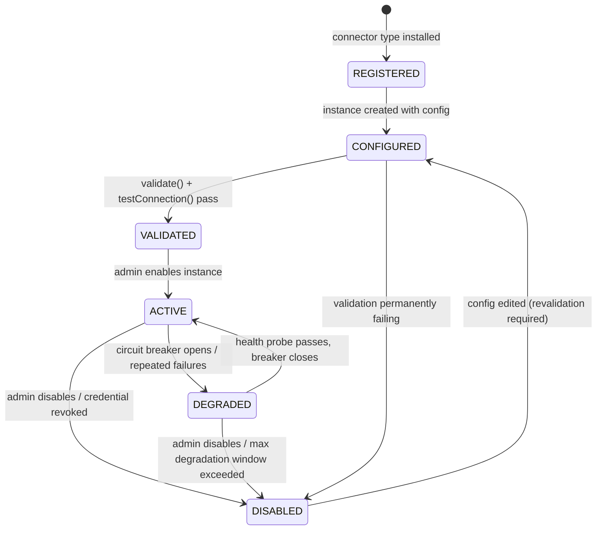

# Connector Framework Specification

Engineering Intelligence Platform (EIP) — connector SPI, sync engine, resilience model, and canonical connector catalog. This document defines the contract every connector in `/backend/eip-connectors` implements and the behavior the sync engine in `/backend/eip-ingestion` guarantees. Event publication downstream of connectors is specified in [EventModel.md](EventModel.md); the overall pipeline is described in [../architecture/ArchitectureOverview.md](../architecture/ArchitectureOverview.md).

## 1. Goals

1. **Uniform lifecycle.** Every connector — from Jira to Generic SQL — is registered, configured, validated, activated, monitored, and disabled through the same state machine and the same admin API/UI. No connector-specific operational snowflakes.
2. **Resilience.** A connector instance that is rate-limited, misconfigured, or facing a dead upstream degrades in isolation. One connector down never blocks others; the platform never loses acknowledged data.
3. **Simulation mode.** Every connector ships a `SimulationDataSource` producing realistic, deterministic fake data so the full platform (ingestion → normalization → analytics → AI → reports) runs air-gapped with zero external systems. This is a first-class delivery requirement, not a test utility.
4. **Config-driven.** Connector behavior is described by a JSON Schema published by the connector itself. The admin UI renders configuration forms from that schema; no per-connector frontend code is required to onboard a new connector.

Non-goals: connectors do not normalize into the canonical model themselves (normalizers in `eip-ingestion` do), do not write domain events directly (they emit raw records; see Section 5), and do not implement per-user data collection — EIP is explicitly not an individual-surveillance tool.

## 2. Connector SPI

The SPI lives in `eip-connectors` and is consumed by the sync engine in `eip-ingestion`. Interfaces below are illustrative sketches, not final signatures.

```java
public interface Connector {
    ConnectorDescriptor descriptor();
    ValidationResult validate(ConnectorConfig config);
    TestConnectionResult testConnection(ConnectorConfig config);
    HealthStatus healthCheck(SyncContext ctx);
    void fullSync(SyncContext ctx);
    void incrementalSync(SyncContext ctx, Checkpoint checkpoint);
    Optional<WebhookHandler> webhookHandler();          // empty if unsupported
    SimulationDataSource simulationDataSource();        // mandatory
    RateLimitPolicy rateLimitPolicy(ConnectorConfig config);
}
```

```java
public record ConnectorDescriptor(
    String type,                  // e.g. "jira", "github", "generic-rest"
    String displayName,
    String version,               // connector implementation version
    ConfigSchema configSchema,    // JSON Schema for instance configuration
    Set<String> streams,          // e.g. ["issues", "sprints", "boards"]
    Set<AuthMethod> authMethods,
    boolean supportsWebhooks,
    boolean supportsIncremental
) {}
```

```java
public interface ConfigSchema {
    String jsonSchema();                        // draft 2020-12 JSON Schema document
    Set<String> secretPointers();               // JSON Pointers to credential-ref fields
}

public record ValidationResult(boolean valid, List<FieldError> errors) {}

public record TestConnectionResult(
    boolean reachable, boolean authenticated,
    Duration latency, String remoteVersion, List<String> warnings) {}

public enum HealthStatus { HEALTHY, DEGRADED, UNHEALTHY }
```

`SyncContext` is the sole channel between a running sync and the platform. Connectors never touch Kafka, Postgres, or Redis directly:

```java
public interface SyncContext {
    TenantId tenantId();
    ConnectorInstanceId instanceId();
    ConnectorConfig config();                    // secrets already resolved to short-lived values
    RawSink rawSink();                           // emits raw records → raw_* staging + eip.raw.<connector>
    CheckpointStore checkpoints();               // per-stream checkpoint persistence
    RateLimiter rateLimiter();                   // Redis-backed, honors RateLimitPolicy
    MeterRegistry metrics();                     // Micrometer, pre-tagged tenant/connector/instance
    boolean isCancelled();                       // cooperative cancellation, checked between pages
}
```

```java
public record Checkpoint(
    String stream,                // e.g. "issues"
    StreamCursor cursor,          // opaque per-stream position
    Instant watermark,            // high-water updatedAt where applicable
    Instant lastSuccessfulSyncAt,
    long recordsSeen
) {}

public sealed interface StreamCursor permits OpaqueCursor, TimestampCursor, PageCursor {}
```

```java
public record RateLimitPolicy(
    int maxRequestsPerMinute,           // static ceiling from config
    boolean honorServerHeaders,         // Retry-After, X-RateLimit-Remaining, etc.
    int maxConcurrentRequests,
    Duration minBackoff, Duration maxBackoff   // exponential backoff + jitter bounds
) {}
```

```java
public interface SimulationDataSource {
    void seed(long seed, SimulationProfile profile);   // deterministic generation
    void fullSync(SyncContext ctx);
    void incrementalSync(SyncContext ctx, Checkpoint checkpoint);
}
```

SPI rules:

- Connectors are stateless between invocations; all durable state lives in the checkpoint store (Postgres table `connector_checkpoint`, keyed by `tenant_id, instance_id, stream`).
- `validate()` is pure schema/semantic validation (no network). `testConnection()` performs a bounded, read-only probe. Both are invoked from the admin UI before activation.
- Every emit through `RawSink` carries the source record's natural key and raw payload; the sink stages to `raw_*` JSONB tables (blobs to MinIO via the S3-compatible abstraction) and publishes to `eip.raw.<connector>`.

## 3. Lifecycle state machine



State semantics:

| State | Scheduler | Webhooks | Health probes | Notes |
|---|---|---|---|---|
| REGISTERED | — | — | — | Type known, no instance config. |
| CONFIGURED | — | — | — | Config saved; not yet proven. |
| VALIDATED | — | — | — | Proven reachable; awaiting enable. |
| ACTIVE | Runs full + incremental syncs | Accepted | Periodic `healthCheck()` | Normal operation. |
| DEGRADED | Suspended; probe-only | Accepted, queued | Aggressive probing | Entered automatically by circuit breaker; auto-recovers. |
| DISABLED | — | Rejected (410) | — | Manual or terminal; checkpoints retained for resume. |

All transitions are audited (actor, reason, timestamp) via `eip-tenancy` audit facilities and emitted as metrics for the Connector Health Monitor (Section 9).

## 4. Sync engine

The sync engine (in `eip-ingestion`) schedules and supervises sync runs per connector instance.

- **Full vs incremental.** A first activation triggers `fullSync()` over the configured backfill window. Thereafter the scheduler invokes `incrementalSync(checkpoint)` per stream on the instance's cron/interval. A full re-sync can be forced per stream from the admin UI (checkpoint reset) without deleting normalized data — idempotent upserts make re-syncs safe.
- **Per-stream checkpoints.** Each stream (e.g. Jira `issues` vs `sprints`) checkpoints independently, so a failure in one stream never rewinds another. Checkpoints are committed only after the corresponding raw records are durably staged and published (see the outbox flow in [EventModel.md](EventModel.md)).
- **Pagination contract.** Connectors must iterate pages via the upstream tool's native mechanism and emit page-by-page; the engine bounds page size per connector and checks `isCancelled()` between pages. A sync interrupted mid-stream resumes from the last committed `StreamCursor`, never from scratch.
- **Watermarking strategy.** Two incremental modes:
  - *updatedAt watermark*: query `updated >= watermark - overlap` (overlap default 5 minutes to absorb clock skew and late index updates), dedup downstream. Used where the API supports update-time filtering (Jira JQL, SonarQube issue search).
  - *cursor API*: store the opaque server cursor (GitHub GraphQL `endCursor`, Kubernetes `resourceVersion`, GitLab keyset pagination). Preferred when available — no skew risk.
- **Backfill windows.** Configurable per instance (`backfillDays`, default 365, max per connector). Backfills run as chunked full syncs (e.g. 30-day slices) so they checkpoint progress and interleave fairly with incremental syncs of other instances.
- **Concurrency limits.** Per connector instance: at most one running sync per stream, and `maxConcurrentStreams` (default 3) streams in parallel. Enforced with Redisson distributed locks so multiple `eip-workers` replicas never double-run a stream. Global worker pool fairness: round-robin across tenants and instances so a large backfill cannot starve other tenants.

## 5. Resilience

- **Rate limiting.** The Redis-backed `RateLimiter` enforces the instance's `RateLimitPolicy` and, when `honorServerHeaders` is set, dynamically tightens on `Retry-After`, `X-RateLimit-Remaining`, and GitHub secondary-rate-limit responses. Budget is shared across worker replicas per instance.
- **Retry with exponential backoff + jitter.** Transient failures (5xx, timeouts, 429) retry with full jitter between `minBackoff` and `maxBackoff` (defaults 1 s → 5 min), max 6 attempts per page. Non-retryable failures (401/403 after refresh, schema violations) fail the stream run immediately with a classified error.
- **Circuit breaker → DEGRADED.** Per instance: when the failure ratio exceeds 50% over a rolling window (20 calls) or 5 consecutive stream runs fail, the breaker opens and the instance transitions to DEGRADED. In DEGRADED, only lightweight health probes run; a successful probe half-opens, and a successful probe sequence closes the breaker and returns the instance to ACTIVE.
- **Partial-failure isolation.** Each instance runs in its own scheduler slot with its own breaker, rate budget, and checkpoint rows. One connector down never blocks others: no shared queues between instances at the sync layer, and downstream consumers partition by tenant/entity, not connector.
- **Poison records.** A raw record that repeatedly fails staging is parked with its error in `raw_ingest_errors` and skipped; the stream continues. Parked records surface in the Connector Health Monitor.

## 6. Idempotency and dedup

- **Natural-key upsert via ExternalRef.** Every raw record maps to a canonical `ExternalRef` (`sourceSystem`, `externalId`, `url`). Normalizers upsert canonical entities keyed on `(tenant_id, sourceSystem, externalId)` with a unique constraint — replays and overlapping watermark windows converge to the same row.
- **Content hashing.** Each raw record stores a SHA-256 of its normalized-relevant payload subset. If the hash is unchanged on re-fetch, the normalizer skips the write and no domain event is emitted — overlap windows and forced re-syncs stay quiet downstream.
- **Event-level dedup** (eventId-based, at-least-once delivery) is specified in [EventModel.md](EventModel.md).

## 7. Webhook intake

Connectors that support webhooks register a `WebhookHandler` exposed at `POST /api/v1/webhooks/{connectorType}/{instanceId}`.

- **Signature verification.** Mandatory where the tool supports it: GitHub `X-Hub-Signature-256` (HMAC-SHA256), GitLab `X-Gitlab-Token`, Bitbucket HMAC, Jira JWT (Connect) or configured shared secret. Unsigned webhooks are accepted only if the instance explicitly opts in (`allowUnsignedWebhooks: true`, flagged in the UI).
- **Replay protection.** Delivery IDs (e.g. GitHub `X-GitHub-Delivery`) are recorded in Redis with a 24 h TTL; duplicates are acknowledged and dropped. Timestamped signatures are rejected outside a ±5 min tolerance.
- **Same pipeline.** A webhook payload is converted to the same raw record shape as a sync fetch and enters the identical staging → normalize path — webhooks are a latency optimization, never a second code path. Periodic incremental syncs remain the source of completeness (webhooks may be lost; syncs reconcile).
- Webhook bursts are buffered to `eip.raw.<connector>` immediately; handlers do no upstream calls and return 202 within 2 s.

## 8. Secrets handling

- Connector configs contain **credential references only** (`credentialRef: "vault://tenant-a/jira-prod-token"`), never raw secrets. `ConfigSchema.secretPointers()` declares which fields are refs so the UI renders them as managed-secret pickers.
- Secrets resolve at sync start via the platform secrets service (AES-256-GCM envelope encryption, pluggable KMS SPI per the platform brief); resolved values live only in memory for the run, are masked in all logs/UI, and every access is audited. Rotation of a credential does not require reconfiguring the instance — the ref is stable.

## 9. Observability per connector

Every instance is tagged `tenant`, `connector_type`, `instance` on all Micrometer metrics, exported via OpenTelemetry:

| Metric | Type | Meaning |
|---|---|---|
| `eip.connector.sync.duration` | timer | Per stream run |
| `eip.connector.records.fetched` / `.staged` | counter | Volume in/out |
| `eip.connector.errors` | counter | Tagged `class` (auth, rate_limit, transient, schema) |
| `eip.connector.rate_limit.remaining` | gauge | From server headers where available |
| `eip.connector.checkpoint.lag_seconds` | gauge | now − watermark, per stream |
| `eip.connector.breaker.state` | gauge | 0 closed / 1 half-open / 2 open |
| `eip.connector.webhook.received` / `.rejected` | counter | Rejection reason tagged |

These feed the **Connector Health Monitor** — the admin dashboard page and Grafana board (in `/infra/grafana`) showing per-instance state, checkpoint lag, error classes, last successful sync per stream, and parked-record counts. `healthCheck()` results are exposed at `/api/v1/connectors/{instanceId}/health` and drive alerting (instance DEGRADED > 30 min, checkpoint lag > SLO).

## 10. Simulation mode

Every connector ships a `SimulationDataSource`; an instance created with `mode: "simulation"` uses it instead of network calls but exercises the entire pipeline (checkpoints, rate limiter, raw staging, normalization, events).

- **Deterministic, seed-based.** `seed(long seed, SimulationProfile profile)` — the same seed always yields the same dataset, so demos, tests, and bug reproductions are exact. Profiles (e.g. `healthy-team`, `overloaded-team`, `release-crunch`) shape distributions: cycle times, PR review latencies, incident rates, quality-gate failures.
- **Realistic.** Generated entities are cross-consistent: simulated Jira stories reference simulated GitHub PRs via commit messages; simulated builds reference those commits; simulated incidents correlate with simulated deployments — so flow, DORA, and risk analytics compute meaningful values.
- **Incremental-aware.** Simulation honors checkpoints: each incremental tick generates a plausible delta (new commits, transitions, alerts) advancing simulated time. Curated enterprise-scale packs live in `/simulation` (later phase); the built-in generator is the SPI-level minimum.

## 11. Canonical connector catalog

All connectors below are mandatory catalog members. "Normalization targets" reference canonical entities from the domain model; work items map to the unified `WorkItem` supertype (EPIC|FEATURE|STORY|TASK|BUG|INCIDENT_TICKET) with `ExternalRef` identity.

### 11.1 Jira

- **Auth:** API token (Basic, Cloud), PAT (Data Center), OAuth 2.0 (3LO).
- **Streams:**

| Stream | Entities pulled |
|---|---|
| projects | Project metadata, components, versions |
| issues | Issues incl. changelogs, links, worklogs |
| sprints | Sprints per board |
| boards | Boards, board configuration (columns → WorkflowState) |
| users | Account metadata (team mapping only) |

- **Incremental:** JQL `updated >= <watermark>` ordered by `updated ASC`, plus changelog expansion for transition history.
- **Rate limits:** Cloud uses undocumented dynamic limits — honor `Retry-After`; Data Center is instance-tuned. Default budget 50 req/min.
- **Webhooks:** Yes (issue created/updated/deleted, sprint events); JWT or shared-secret verification.
- **Normalization targets:** WorkItem (Epic/Feature/Story/Task/Bug), Sprint, Board, WorkflowState, Project, Dependency (issue links), Member (mapped, never ranked).
- **Quirks:** JQL search pagination is unstable when issues are updated mid-pagination — order by `updated ASC` and re-anchor the watermark rather than trusting `startAt` offsets; Cloud's newer `/rest/api/3/search/jql` uses cursor tokens and caps `maxResults` (≤100, often less with expansions); changelog must be fetched with `expand=changelog` (capped per issue, page the rest via `/changelog`); custom fields arrive as opaque `customfield_*` ids requiring the field-metadata stream to map.

### 11.2 Confluence

- **Auth:** API token (Basic), PAT, OAuth 2.0.
- **Streams:** spaces; pages (body + version history); comments; attachments (metadata; blobs → MinIO).
- **Incremental:** CQL `lastmodified >= <watermark>`; page version numbers detect content change (content hash confirms).
- **Rate limits:** Same regime as Jira Cloud; honor `Retry-After`.
- **Webhooks:** Limited (Cloud requires an app); default is polling.
- **Normalization targets:** Document, DecisionRecord (label/template-detected), plus RAG ingestion source.
- **Quirks:** `body.storage` is Confluence XHTML — convert to Markdown for RAG chunking; CQL result ceiling forces windowed backfills; attachment downloads are separately rate-limited.

### 11.3 GitHub

- **Auth:** GitHub App (preferred — installation tokens, higher limits), PAT, OAuth App.
- **Streams:** repositories; commits; pull_requests (+ reviews, review comments); issues; workflows/check_runs (via Generic CI/CD mapping where Actions is used); releases; branches/tags.
- **Incremental:** GraphQL cursor pagination with `updatedAt` filters where supported; REST `since` for commits/issues; PRs via GraphQL ordered by `UPDATED_AT`.
- **Rate limits:** REST 5,000 req/h per installation; GraphQL is **cost-point based** (5,000 points/h) — deep nested queries (PRs + reviews + commits in one query) burn points fast; secondary rate limits trigger on burst concurrency. Honor `X-RateLimit-*` and `Retry-After`.
- **Webhooks:** Yes, first-class (push, pull_request, pull_request_review, issues, workflow_run, release); HMAC-SHA256 verification.
- **Normalization targets:** Repository, Branch, Commit, PullRequest, CodeReview, Release, WorkItem (issues), Build/Pipeline (Actions runs).
- **Quirks:** GraphQL node limits (500,000 nodes/query) require splitting nested queries; commit list `since` filters by committer date, not push time — reconcile via push webhooks; review threads paginate separately from reviews; squash merges break commit↔PR linkage unless resolved via `associatedPullRequests`.

### 11.4 GitLab

- **Auth:** PAT, project/group access tokens, OAuth 2.0.
- **Streams:** projects; commits; merge_requests (+ approvals, discussions); issues; pipelines/jobs; releases; branches/tags.
- **Incremental:** `updated_after` on MRs/issues/pipelines; **keyset pagination** (`pagination=keyset`) preferred — offset pagination is capped and slow on large sets.
- **Rate limits:** Self-managed configurable (default ~600 req/min per user on gitlab.com); honor `RateLimit-*` headers.
- **Webhooks:** Yes (push, MR, pipeline, issue, release); `X-Gitlab-Token` shared-secret verification.
- **Normalization targets:** Repository, Branch, Commit, PullRequest (from MR), CodeReview (approvals/discussions), Build, Pipeline, Release, WorkItem.
- **Quirks:** Offset pagination refuses pages beyond 50,000 records on gitlab.com — keyset is mandatory for backfills; pipeline jobs need per-pipeline calls (N+1 — batch and budget); MR diffs are size-truncated.

### 11.5 Bitbucket

- **Auth:** App passwords / API tokens (Cloud), PAT (Data Center), OAuth 2.0.
- **Streams:** repositories; commits; pullrequests (+ activity for reviews); branches; pipelines (Cloud).
- **Incremental:** `updated_on >= <watermark>` query filters on PRs; commits via branch-head walking (no server-side since-filter on Cloud).
- **Rate limits:** Cloud ~1,000 req/h per user for most endpoints; Data Center instance-tuned.
- **Webhooks:** Yes (repo push, PR events); HMAC verification (Data Center), IP allow-listing guidance (Cloud).
- **Normalization targets:** Repository, Branch, Commit, PullRequest, CodeReview, Build (Pipelines).
- **Quirks:** Cloud and Data Center have **different APIs** (2.0 vs 1.0 shapes) — the connector abstracts both behind one stream set; PR "activity" stream mixes comments, approvals, and updates in one feed requiring type-dispatch; commit listing lacks update filtering, so incremental relies on push webhooks + periodic branch-head reconciliation.

### 11.6 SonarQube

- **Auth:** User token (Bearer), legacy token-as-username Basic.
- **Streams:** projects; measures (coverage, duplication, smells, complexity); issues (code smells, bugs, vulnerabilities, hotspots); quality_gates (status + conditions); analyses (scan events).
- **Incremental:** issues via `createdAfter`/date filters + content hash; measures snapshot per analysis event (`/api/project_analyses/search` with `from`).
- **Rate limits:** No formal API limit — self-throttle (default 20 req/s ceiling) to protect shared on-prem instances.
- **Webhooks:** Yes — analysis-completed webhook with quality gate payload; secret-based HMAC verification.
- **Normalization targets:** QualityGate, SecurityFinding, TechnicalDebtItem, Metric (quality family), Repository/Project linkage via project key.
- **Quirks:** **`ps` (pageSize) caps at 500 and total results at 10,000** for `/api/issues/search` — beyond that, partition queries by module/directory/severity/date to stay under the ceiling; measures history endpoints return sparse series needing forward-fill; branch/PR analyses require `branch`/`pullRequest` params or you silently get main only.

### 11.7 Artifactory

- **Auth:** Access token (Bearer), API key (deprecated upstream — supported for legacy), Basic.
- **Streams:** repositories (repo configs); artifacts (AQL-driven metadata: path, size, checksums, properties); builds (build-info JSON); permissions (optional, for audit context).
- **Incremental:** AQL `modified > <watermark>`; builds via build number monotonic cursor.
- **Rate limits:** None enforced by default — self-throttle; AQL queries can be expensive, keep result fields minimal.
- **Webhooks:** Yes (JFrog event webhooks: artifact deployed, build uploaded); token verification.
- **Normalization targets:** Artifact, Build (build-info), Release linkage (promotion events), Repository (binary repos modeled as Artifact containers, distinct from SCM Repository).
- **Quirks:** AQL pagination via `offset/limit` is unstable if artifacts are deleted mid-scan — order by `modified` and re-anchor; build-info payloads can be very large (stage to MinIO, keep pointer in raw record); checksum-based dedup is essential because re-deploys of identical artifacts are common.

### 11.8 Kubernetes

- **Auth:** ServiceAccount token (in-cluster), kubeconfig (out-of-cluster), OIDC-federated tokens.
- **Streams:** deployments/statefulsets/daemonsets; pods (status transitions, restarts); events; namespaces; rollouts (revision history for Deployment change detection).
- **Incremental:** **list+watch**: initial `list` captures `resourceVersion`, then `watch` streams changes from that cursor. On `410 Gone` (resourceVersion expired), re-list and resume — the connector must treat re-list as a reconciliation, not a data loss event.
- **Rate limits:** Client-side QPS/burst (default 20/40) to protect the API server; server-side priority & fairness may 429 — honor `Retry-After`.
- **Webhooks:** N/A (watch is the push mechanism).
- **Normalization targets:** Service, Environment (namespace/cluster mapping), Deployment (rollout events → canonical Deployment records), Alert-adjacent signals (crash loops → ops events).
- **Quirks:** Watch connections are dropped by design (~5 min timeouts, LB idle limits) — reconnect with last `resourceVersion`; `resourceVersion` is opaque and per-resource-type, never compare across types; large clusters need `limit`+`continue` chunked lists to avoid API-server memory pressure; events are TTL'd (default 1 h) so event capture must be near-real-time.

### 11.9 OpenShift

- **Auth:** ServiceAccount token, OAuth token (`oc whoami -t`), kubeconfig.
- **Streams:** Everything in the Kubernetes connector (shared base) plus: deploymentconfigs; routes; buildconfigs/builds (OpenShift-native builds); projects (OpenShift project metadata over namespaces).
- **Incremental:** Same list+watch model, applied to OpenShift API groups (`apps.openshift.io`, `build.openshift.io`, `route.openshift.io`).
- **Rate limits:** As Kubernetes.
- **Webhooks:** N/A (watch).
- **Normalization targets:** Service, Environment, Deployment, Build (OpenShift builds), Pipeline (BuildConfig).
- **Quirks:** DeploymentConfigs are deprecated in recent OpenShift but common in enterprise estates — connector must handle both DC and Deployment rollout semantics; Routes carry exposure metadata used for Service/ApiEndpoint mapping; cluster-scoped listing frequently forbidden — the connector must operate namespace-scoped with a configured namespace allow-list.

### 11.10 Docker Registry

- **Auth:** Basic, Bearer token (Docker Registry v2 token flow), anonymous (read-only mirrors).
- **Streams:** repositories (catalog); tags; manifests (digest, layers, created, labels).
- **Incremental:** No update-time filtering in the v2 API — periodic tag-list diffing against stored digests (content hash makes this cheap); registries with event notifications (registry notifications, Harbor webhooks) use push.
- **Rate limits:** Registry-specific (Docker Hub pulls are famously limited); default conservative budget, honor 429.
- **Webhooks:** Partial — native registry notification endpoints and Harbor/Quay webhooks where deployed.
- **Normalization targets:** Artifact (image), Release linkage via tag conventions, Deployment correlation via image digest.
- **Quirks:** `/v2/_catalog` pagination uses `Link` headers and may be disabled on hosted registries; manifest schema varies (v2, OCI, manifest lists/multi-arch) — resolve child digests for multi-arch; tag mutation (re-pushing `latest`) means the digest, not the tag, is the identity.

### 11.11 Prometheus

- **Auth:** None (network-trusted), Basic, Bearer token (reverse-proxy setups).
- **Streams:** range_queries (configured PromQL query set → Metric samples); alerts (`/api/v1/alerts` active alerts); rules (recording/alerting rule definitions); targets (scrape health, optional).
- **Incremental:** Time-windowed range queries from watermark to now — inherently incremental by time.
- **Rate limits:** None formal — self-throttle; heavy PromQL can OOM the server, so queries are budgeted by estimated sample count.
- **Webhooks:** Via Alertmanager webhook receiver (alert firing/resolved) pointed at the EIP webhook endpoint.
- **Normalization targets:** Metric (ops family), Alert, SlaSlo (SLO burn queries), Service correlation via labels.
- **Quirks:** **Range queries must be chunked**: the API caps resolution at ~11,000 points per series per query — split long windows into chunks sized by `step`; `query_range` with large label cardinality explodes response size, so query sets must aggregate before export; retention is typically 15 d — backfills beyond retention are impossible and the connector must record the truncated backfill honestly; staleness handling means very recent samples may shift, so keep a 5 min overlap.

### 11.12 Grafana

- **Auth:** Service account token (preferred), API key (legacy).
- **Streams:** dashboards (definitions/metadata); alert_rules (Grafana-managed alerting); annotations (deploy/incident markers); folders/orgs (structure).
- **Incremental:** Dashboard `version` numbers + search API updated filters; annotations via time-window queries.
- **Rate limits:** None formal; self-throttle.
- **Webhooks:** Alerting contact point of type webhook → EIP endpoint (alert notifications).
- **Normalization targets:** Alert (Grafana alerts), Document (dashboard catalog for RAG), Deployment/Incident correlation via annotations.
- **Quirks:** Dashboard JSON is version-sensitive across Grafana majors — store raw, normalize only stable metadata; the search API paginates at 1,000 max; provisioned dashboards can't be distinguished from UI-created ones without checking provenance metadata.

### 11.13 OpenTelemetry (OTLP intake)

- **Auth:** mTLS or Bearer token on the OTLP receiver endpoint.
- **Streams:** traces (span batches), metrics (OTLP metrics), logs (OTLP logs) — this connector is a **push receiver**, not a puller: EIP exposes an OTLP/HTTP (and optional gRPC) endpoint and enterprise OTel Collectors forward selected telemetry.
- **Incremental:** N/A — continuous push; checkpointing tracks last-received offsets per source for gap detection only.
- **Rate limits:** Inbound admission control: per-tenant byte/span budgets with 429 + `Retry-After` back to the sender (Collectors retry natively).
- **Webhooks:** N/A (is itself a push endpoint).
- **Normalization targets:** TraceReference, LogReference, Metric (ops family), Service (from `service.name` resource attribute), ApiEndpoint (from span attributes).
- **Quirks:** EIP stores **references and derived aggregates, not full telemetry** — full-fidelity storage belongs to Tempo/Loki/Prometheus; sampling upstream means counts are estimates and normalizers must carry the sampling metadata; resource attribute conventions vary — mapping rules are per-instance config.

### 11.14 Generic CI/CD (Jenkins / Azure DevOps / GitHub Actions / GitLab CI)

- **Auth:** Per flavor: Jenkins API token (Basic), Azure DevOps PAT, GitHub App/PAT, GitLab PAT.
- **Streams:** pipelines (definitions); builds/runs (status, duration, trigger, artifacts); stages/jobs (step-level timing); deployments (environment-targeted runs where the flavor models them).
- **Incremental:** Per flavor: Jenkins build-number cursor per job; Azure DevOps `minTime`/continuation tokens; Actions `created >=` on workflow runs; GitLab CI `updated_after`.
- **Rate limits:** Inherits the host platform's regime (GitHub/GitLab limits per Sections 11.3/11.4; Jenkins none — self-throttle; Azure DevOps global TSTU throttling — honor `Retry-After`).
- **Webhooks:** Yes for all four flavors (Jenkins via plugin, ADO service hooks, Actions `workflow_run`, GitLab pipeline events).
- **Normalization targets:** Pipeline, Build, Deployment, Environment, Artifact linkage — the flavor adapters exist precisely to converge four vocabularies onto these canonical entities (DORA inputs).
- **Quirks:** One connector type with **flavor adapters** behind a shared stream contract; Jenkins folder/multibranch job naming needs recursive discovery and URL-encoding care; Azure DevOps continuation tokens arrive via response header, not body; Actions `workflow_run` retention (90 d default) bounds backfill; "deployment" is modeled natively only in ADO/Actions environments — Jenkins deployments are inferred from configured job-name/stage conventions.

### 11.15 Generic REST

- **Auth:** None, Basic, Bearer/API key (header or query), OAuth 2.0 client credentials.
- **Streams:** Config-defined: each stream declares endpoint, pagination style (page/offset/cursor/link-header), record JSONPath, and field mappings to a target canonical entity.
- **Incremental:** Config-declared watermark parameter (e.g. `updated_since={{watermark}}`) or cursor persistence; otherwise scheduled full sync + content-hash dedup.
- **Rate limits:** Fully config-driven `RateLimitPolicy`.
- **Webhooks:** Optional generic endpoint with configurable HMAC verification.
- **Normalization targets:** Any single canonical entity family per stream, chosen in config (WorkItem, Incident, Deployment, Metric, Document, Risk...).
- **Quirks:** Mapping is declarative (JSONPath + type coercion rules), validated by `validate()` against the target entity schema; no scripting in v1 — anything needing code becomes a real connector.

### 11.16 Generic SQL

- **Auth:** Username/password (via credential ref), Kerberos where the JDBC driver supports it.
- **Streams:** Config-defined queries: each stream is a read-only SELECT with declared key column, watermark column, and canonical mapping. Drivers: PostgreSQL, MySQL, SQL Server, Oracle.
- **Incremental:** `WHERE <watermarkColumn> > :watermark ORDER BY <watermarkColumn>` keyset iteration; falls back to full query + content hash when no watermark column exists.
- **Rate limits:** Concurrency 1 per stream, fetch-size streaming, statement timeout — protect the source database, which is often production-adjacent.
- **Webhooks:** N/A.
- **Normalization targets:** Config-chosen entity family (commonly WorkItem, Incident, Risk, Dependency from legacy PM databases).
- **Quirks:** Read-only enforcement (`SELECT`-only statement validation + read-only connection); timezone-naive timestamp columns need per-instance zone config; `validate()` runs `EXPLAIN`-level checks without executing the full query.

### 11.17 Generic File/Document

- **Auth:** Per source: S3/MinIO credentials, SMB/NFS mount (filesystem), SFTP key.
- **Streams:** documents (Markdown, PDF, DOCX, HTML, TXT); structured_files (CSV/JSON/Excel mapped like Generic REST streams).
- **Incremental:** Modified-time + content hash per file; S3 uses `ListObjectsV2` with ETag comparison.
- **Rate limits:** I/O concurrency caps; large files streamed to MinIO, never buffered in heap.
- **Webhooks:** S3 event notifications where the store supports them; otherwise polling.
- **Normalization targets:** Document (primary RAG source), DecisionRecord (path/frontmatter conventions), structured rows → configured entity family.
- **Quirks:** Text extraction (PDF/DOCX) is best-effort and versioned — the extractor version is part of the content hash so extractor upgrades trigger re-indexing; encoding detection required for legacy files; directory moves look like delete+create, deduped by content hash.

### 11.18 Custom internal demand/project tool

- **Auth:** Per deployment — typically Bearer token or mTLS against the internal API; built as a thin profile over Generic REST/Generic SQL with a maintained first-class mapping.
- **Streams:** demands (intake requests → WorkItem/Initiative); projects (portfolio metadata); allocations (team/BU assignment); milestones.
- **Incremental:** Whatever the internal tool supports — the reference profile assumes `updatedAt` watermarking.
- **Rate limits:** Config-driven; internal tools are usually fragile — conservative defaults.
- **Webhooks:** If the internal tool can call out; otherwise polling.
- **Normalization targets:** Initiative, Project, WorkItem, Roadmap, BusinessUnit/Team mapping, Dependency.
- **Quirks:** This connector exists to prove the extension path: it is documented, versioned, and simulated exactly like the built-ins, and serves as the template for customer-specific connectors.

## 12. Config schema example (Jira connector)

The descriptor's `ConfigSchema` for Jira (abbreviated only in description text, structurally complete):

```json
{
  "$schema": "https://json-schema.org/draft/2020-12/schema",
  "$id": "https://eip.example.com/schemas/connectors/jira-config/1.json",
  "title": "Jira Connector Configuration",
  "type": "object",
  "required": ["baseUrl", "authMethod", "credentialRef", "projects"],
  "properties": {
    "baseUrl": {
      "type": "string", "format": "uri",
      "description": "Jira base URL, e.g. https://jira.internal.example.com"
    },
    "deployment": {
      "type": "string", "enum": ["cloud", "datacenter"], "default": "datacenter"
    },
    "authMethod": {
      "type": "string", "enum": ["api_token_basic", "pat", "oauth2"]
    },
    "credentialRef": {
      "type": "string", "pattern": "^(vault|kms|local)://.+",
      "description": "Reference to a managed secret; never a raw credential.",
      "x-eip-secret": true
    },
    "projects": {
      "type": "array", "minItems": 1,
      "items": { "type": "string", "pattern": "^[A-Z][A-Z0-9_]+$" },
      "description": "Jira project keys to sync."
    },
    "streams": {
      "type": "array", "uniqueItems": true,
      "items": { "type": "string", "enum": ["projects", "issues", "sprints", "boards", "users"] },
      "default": ["projects", "issues", "sprints", "boards"]
    },
    "backfillDays": { "type": "integer", "minimum": 1, "maximum": 1095, "default": 365 },
    "syncIntervalMinutes": { "type": "integer", "minimum": 5, "default": 15 },
    "watermarkOverlapMinutes": { "type": "integer", "minimum": 0, "maximum": 60, "default": 5 },
    "rateLimit": {
      "type": "object",
      "properties": {
        "maxRequestsPerMinute": { "type": "integer", "minimum": 1, "default": 50 },
        "honorServerHeaders": { "type": "boolean", "default": true },
        "maxConcurrentRequests": { "type": "integer", "minimum": 1, "maximum": 8, "default": 4 }
      },
      "additionalProperties": false
    },
    "webhook": {
      "type": "object",
      "properties": {
        "enabled": { "type": "boolean", "default": true },
        "secretRef": { "type": "string", "pattern": "^(vault|kms|local)://.+", "x-eip-secret": true },
        "allowUnsignedWebhooks": { "type": "boolean", "default": false }
      },
      "additionalProperties": false
    },
    "mode": { "type": "string", "enum": ["live", "simulation"], "default": "live" },
    "simulation": {
      "type": "object",
      "properties": {
        "seed": { "type": "integer", "default": 42 },
        "profile": { "type": "string", "enum": ["healthy-team", "overloaded-team", "release-crunch"], "default": "healthy-team" }
      },
      "additionalProperties": false
    }
  },
  "additionalProperties": false
}
```

## 13. Adding a new connector — checklist

1. Implement `Connector` in a new `eip-connectors` submodule; register the `ConnectorDescriptor` via the SPI service loader.
2. Author the JSON Schema config (draft 2020-12), declare `secretPointers()`, and verify the admin UI renders it.
3. Define streams with per-stream `StreamCursor` types; document the incremental mechanism and its failure modes.
4. Implement `validate()`, `testConnection()`, `healthCheck()` with classified error taxonomy (auth / rate_limit / transient / schema).
5. Implement `fullSync()` and `incrementalSync()` with pagination, watermark overlap, and cooperative cancellation between pages.
6. Declare `RateLimitPolicy` defaults; honor upstream headers where they exist.
7. Implement webhook handler (if supported): signature verification, replay protection, mapping into the same raw pipeline.
8. Implement `SimulationDataSource` with seed-determinism and at least the `healthy-team` profile, cross-consistent with sibling connectors.
9. Write the normalizer mapping to canonical entities with `ExternalRef` upsert keys and content hashing.
10. Add Micrometer metrics per Section 9 and a Connector Health Monitor panel entry.
11. Tests: unit (mapping, cursor logic), WireMock-based contract tests against recorded upstream responses, Testcontainers integration test through raw staging and Kafka, simulation determinism test (same seed ⇒ identical output).
12. Docs: catalog entry in this file (Section 11 format), quirks section based on real API behavior, config example.

## 14. Acceptance criteria for connector GA

A connector graduates to GA only when all of the following hold:

- [ ] **Lifecycle:** Given a fresh instance, when it is configured, validated, and enabled, then it traverses REGISTERED→CONFIGURED→VALIDATED→ACTIVE with every transition audited.
- [ ] **Resume:** Given a sync killed mid-stream (worker crash), when the scheduler restarts it, then it resumes from the last committed checkpoint with zero data loss and no duplicate canonical rows (ExternalRef upsert verified).
- [ ] **Isolation:** Given the upstream tool returns sustained 5xx, when the circuit breaker opens, then the instance transitions to DEGRADED, sibling connector instances continue syncing unaffected, and the instance auto-recovers to ACTIVE when the upstream heals.
- [ ] **Rate limits:** Given upstream 429/`Retry-After`, when syncing at full speed, then the connector backs off per policy and never breaches the configured ceiling (verified in a throttled contract test).
- [ ] **Idempotency:** Given the same stream synced twice with overlapping windows, then canonical entity state and emitted domain events are identical to a single sync (content-hash suppression verified).
- [ ] **Webhooks (if supported):** Given a forged signature or a replayed delivery ID, then the request is rejected/dropped and counted in `eip.connector.webhook.rejected`.
- [ ] **Secrets:** Given any log level and any error path, then no raw credential ever appears in logs, metrics, error payloads, or the UI.
- [ ] **Simulation:** Given `mode: simulation` with a fixed seed, then two runs produce byte-identical raw record streams and the downstream flow/DORA/quality metrics compute non-degenerate values.
- [ ] **Observability:** All Section 9 metrics emit with correct tags; the Connector Health Monitor shows state, checkpoint lag, and last-success per stream.
- [ ] **Docs:** Catalog entry, config schema, quirks, and runbook (common failures and operator actions) exist in this documentation tree.
