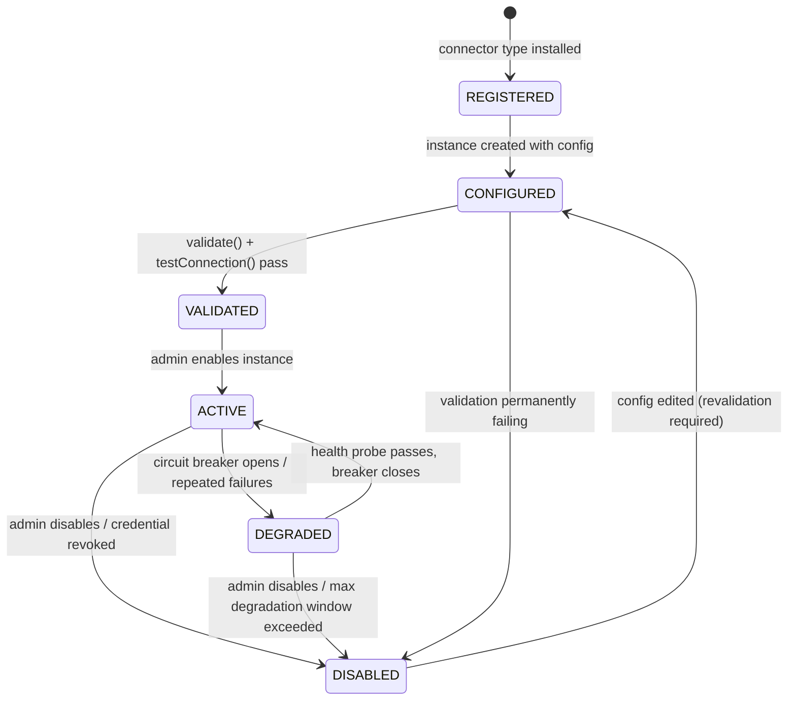

# Connector Framework Specification

Engineering Intelligence Platform (EIP) — connector SPI, sync engine, resilience model, and canonical connector catalog. This document defines the contract every connector in `/backend/eip-connectors` implements and the behavior the sync engine in `/backend/eip-ingestion` guarantees. Event publication downstream of connectors is specified in [EventModel.md](EventModel.md); the overall pipeline is described in [../architecture/ArchitectureOverview.md](../architecture/ArchitectureOverview.md).

## 1. Goals

1. **Uniform lifecycle.** Every connector — from Jira to Generic SQL — is registered, configured, validated, activated, monitored, and disabled through the same state machine and the same admin API/UI. No connector-specific operational snowflakes.
2. **Resilience.** A connector instance that is rate-limited, misconfigured, or facing a dead upstream degrades in isolation. One connector down never blocks others; the platform never loses acknowledged data.
3. **Simulation mode.** Every connector ships a `SimulationDataSource` producing realistic, deterministic fake data so the full platform (ingestion → normalization → analytics → AI → reports) runs air-gapped with zero external systems. This is a first-class delivery requirement, not a test utility.
4. **Config-driven.** Connector behavior is described by a JSON Schema published by the connector itself. The admin UI renders configuration forms from that schema; no per-connector frontend code is required to onboard a new connector.

Non-goals: connectors do not normalize into the canonical model themselves (normalizers in `eip-ingestion` do), do not write domain events directly (they emit raw records; see Section 5), and do not implement per-user data collection — EIP is explicitly not an individual-surveillance tool.

## 2. Connector SPI

The SPI lives in `eip-connectors` and is consumed by the sync engine in `eip-ingestion`. Interfaces below are illustrative sketches, not final signatures.

```java
public interface Connector {
    ConnectorDescriptor descriptor();
    ValidationResult validate(ConnectorConfig config);
    TestConnectionResult testConnection(ConnectorConfig config);
    HealthStatus healthCheck(SyncContext ctx);
    void fullSync(SyncContext ctx);
    void incrementalSync(SyncContext ctx, Checkpoint checkpoint);
    Optional<WebhookHandler> webhookHandler();          // empty if unsupported
    SimulationDataSource simulationDataSource();        // mandatory
    RateLimitPolicy rateLimitPolicy(ConnectorConfig config);
}
```

```java
public record ConnectorDescriptor(
    String type,                  // e.g. "jira", "github", "generic-rest"
    String displayName,
    String version,               // connector implementation version
    ConnectorArchetype archetype, // BATCH_POLL | STREAMING_WATCH | PUSH_INTAKE — see Section 2.2
    ConfigSchema configSchema,    // JSON Schema for instance configuration
    Set<String> streams,          // e.g. ["issues", "sprints", "boards"]
    Set<AuthMethod> authMethods,
    boolean supportsWebhooks,
    boolean supportsIncremental
) {}

public enum ConnectorArchetype { BATCH_POLL, STREAMING_WATCH, PUSH_INTAKE }
```

```java
public interface ConfigSchema {
    String jsonSchema();                        // draft 2020-12 JSON Schema document
    Set<String> secretPointers();               // JSON Pointers to credential-ref fields
}

public record ValidationResult(boolean valid, List<FieldError> errors) {}

public record TestConnectionResult(
    boolean reachable, boolean authenticated,
    Duration latency, String remoteVersion, List<String> warnings) {}

public enum HealthStatus { HEALTHY, DEGRADED, UNHEALTHY }
```

`SyncContext` is the sole channel between a running sync and the platform. Connectors never touch Kafka, Postgres, or Redis directly:

```java
public interface SyncContext {
    TenantId tenantId();
    ConnectorInstanceId instanceId();
    ConnectorConfig config();                    // secrets already resolved to short-lived values
    RawSink rawSink();                           // emits raw records → raw_* staging + eip.raw.<connector>
    CheckpointStore checkpoints();               // per-stream checkpoint persistence
    RateLimiter rateLimiter();                   // Redis-backed, honors RateLimitPolicy
    MeterRegistry metrics();                     // Micrometer, pre-tagged tenant/connector/instance
    boolean isCancelled();                       // cooperative cancellation, checked between pages
}
```

```java
public record Checkpoint(
    String stream,                // e.g. "issues"
    StreamCursor cursor,          // opaque per-stream position
    Instant watermark,            // high-water updatedAt where applicable
    Instant lastSuccessfulSyncAt,
    long recordsSeen
) {}

public sealed interface StreamCursor permits OpaqueCursor, TimestampCursor, PageCursor {}
```

```java
public record RateLimitPolicy(
    int maxRequestsPerMinute,           // static ceiling from config
    boolean honorServerHeaders,         // Retry-After, X-RateLimit-Remaining, etc.
    int maxConcurrentRequests,
    Duration minBackoff, Duration maxBackoff   // exponential backoff + jitter bounds
) {}
```

```java
public interface SimulationDataSource {
    void seed(long seed, SimulationProfile profile);   // deterministic generation
    void fullSync(SyncContext ctx);
    void incrementalSync(SyncContext ctx, Checkpoint checkpoint);
}
```

SPI rules:

- Connectors are stateless between invocations; all durable state lives in the checkpoint store (Postgres table `connector_checkpoint`, keyed by `tenant_id, connector_id, stream` — the connector-instance row; see `core.connector_checkpoint` in [DatabasePlan.md](DatabasePlan.md) §2).
- `validate()` is pure schema/semantic validation (no network). `testConnection()` performs a bounded, read-only probe. Both are invoked from the admin UI before activation.
- Every emit through `RawSink` carries the source record's natural key and raw payload; the sink stages to `raw_*` JSONB tables (blobs to MinIO via the S3-compatible abstraction) and publishes to `eip.raw.<connector>`.
- **Tombstone contract.** Every raw record carries two envelope fields set by the sink API: `op` (`upsert` | `delete`, default `upsert`) and `fetchKind` (`full` | `incremental` | `webhook` | `reconciliation`). A **tombstone** is a raw record with `op: delete` carrying the natural key (and `ExternalRef` identity) of the deleted source entity; its payload may be empty. Tombstones travel the identical staging → `eip.raw.<connector>` → normalize path as any record; the normalizer maps them to a canonical **soft-delete** and emits the corresponding deleted domain event (e.g. `workitem.deleted` on `eip.domain.workitem`, per [EventModel.md](EventModel.md) §4). These are the "source tombstones" that [DataFlow.md](../architecture/DataFlow.md) §9 names as the soft-delete mechanism for canonical rows. Tombstones are emitted from three producers: source delete webhooks (`fetchKind: webhook`), watch `DELETED` events (`fetchKind: incremental`), and the per-connector deletion-detection reconciliation sweep (`fetchKind: reconciliation`) — see Section 7 for sweep semantics and Section 11 for the mandatory per-connector **Deletion detection** row.
- `instanceId` (`ConnectorInstanceId`) is the identity of a connector instance and equals the primary key of its `core.connector` row (see `DatabasePlan.md`) — a connector instance and its `core.connector` row are the same thing; there is no separate instance registry.

### 2.1 SPI versioning and compatibility

The connector SPI is semantically versioned per NFR-060:

- The SPI carries a `MAJOR.MINOR.PATCH` version. MINOR/PATCH changes are strictly additive and backward-compatible (new optional SPI methods with default implementations, new optional descriptor fields); a breaking SPI change bumps MAJOR.
- Every breaking change is preceded by a deprecation window of at least one MINOR release in which the old and new forms coexist and use of the deprecated form is logged at connector registration.
- Every connector declares the SPI version it was built against (`spiVersion`, published alongside the implementation `version` in its `ConnectorDescriptor` metadata).
- At registration, core accepts a connector whose declared SPI MAJOR equals the platform's SPI MAJOR (at any MINOR ≤ the platform's); an incompatible MAJOR is refused at registration with a classified `config` error — an incompatible connector never reaches CONFIGURED.

### 2.2 Connector archetypes

`ConnectorDescriptor.archetype` declares which of three interaction models the connector implements. The archetype is part of the semver'd SPI contract (Section 2.1, NFR-060): the sync engine, scheduler, and resilience machinery all branch on it, and the connector contract test kit selects its test set from it. This field exists because the poll contract alone cannot express the mandatory catalog: Section 11.13 (OTLP) is a push receiver with "Incremental: N/A", and Sections 11.8/11.9 (Kubernetes/OpenShift) are list+watch connectors whose "sync" is a long-lived session, not a scheduled run.

| Aspect | `BATCH_POLL` (default) | `STREAMING_WATCH` | `PUSH_INTAKE` |
|---|---|---|---|
| SPI entry points | `fullSync()` / `incrementalSync(checkpoint)` invoked per scheduled run, bounded page loops | `fullSync()` = initial list (re-list on reconciliation); `incrementalSync(checkpoint)` opens a **long-lived watch session** that streams changes until cancelled or disconnected | `fullSync()` / `incrementalSync()` are never invoked (SPI default no-op); the connector registers a receiver endpoint analogous to `WebhookHandler` |
| Scheduler role | Fires due (instance, stream) runs per the dispatch model (Section 4.1) | **Supervisor**: ensures exactly one live session exists per ACTIVE (instance, stream); re-invokes on session exit | **None** — no scheduler runs; lifecycle states map to endpoint enablement (Section 3) |
| Run mutex / lease | Redisson try-lock per (instance, stream) for the duration of the run | Redisson **lease with heartbeat renewal** (watchdog-renewed) held for the session lifetime; lease lapse on worker crash lets another worker resume the session | N/A (receiver is stateless per request; admission control replaces the mutex) |
| Checkpoint semantics | `StreamCursor` / watermark committed per page/slice after durable staging | Checkpoint = source cursor (e.g. `resourceVersion`) persisted on a **cadence** (default every 30 s or every 500 events, whichever first), not per event | Last-received offsets per source, for gap detection only |
| TimeLimiter (BackendPlan §7) | Applies **per stream-run slice** (Section 4.2), default 2 h; slices checkpoint and resume | **Not applied** — sessions are unbounded by design; a staleness bound (no event and no successful ping within `watchStalenessSeconds`, default 300) forces reconnect instead | Not applied; per-request timeouts and admission control bound work instead |
| Reconnect / repair | Retry with backoff per Section 5; resume from last committed cursor | Reconnect with last cursor; on cursor expiry (e.g. `410 Gone`) **re-list as reconciliation** (never treated as data loss), diffing the list against canonical state (tombstones per Section 2 contract) | Senders retry natively on 429/`Retry-After`; periodic gap detection flags missing offsets |
| DEGRADED trigger | Circuit breaker per Section 5 | **Sustained disconnect**: reconnect attempts failing beyond `disconnectGracePeriod` (default 10 min) opens the breaker | Sustained downstream staging failure past the breaker threshold; intake sheds load with 429 while DEGRADED |
| Admission control | N/A (outbound rate limiter, Section 5) | N/A (client-side QPS caps, Section 11.8) | **Mandatory contract**: per-tenant byte/record budgets enforced at the endpoint, over-budget requests rejected with 429 + `Retry-After`, rejection counted in `eip.connector.webhook.rejected`-family metrics |

Catalog assignment: `STREAMING_WATCH` = Kubernetes (11.8) and OpenShift (11.9); `PUSH_INTAKE` = OpenTelemetry OTLP intake (11.13); every other catalog member is `BATCH_POLL`. Catalog entries declare the archetype only when it is not the default.

## 3. Lifecycle state machine



State semantics:

| State | Scheduler | Webhooks | Health probes | Notes |
|---|---|---|---|---|
| REGISTERED | — | — | — | Type known, no instance config. |
| CONFIGURED | — | — | — | Config saved; not yet proven. |
| VALIDATED | — | — | — | Proven reachable; awaiting enable. |
| ACTIVE | Runs full + incremental syncs | Accepted | Periodic `healthCheck()` | Normal operation. |
| DEGRADED | Suspended; probe-only | Accepted, queued | Aggressive probing | Entered automatically by circuit breaker; auto-recovers. |
| DISABLED | — | Rejected (410) | — | Manual or terminal; checkpoints retained for resume. |

Archetype-specific state semantics (Section 2.2) — the table above reads literally for `BATCH_POLL`; the two other archetypes map onto the same states as follows:

- **STREAMING_WATCH.** In ACTIVE, "Runs full + incremental syncs" means the engine *maintains the long-lived watch session* (initial list = full-sync semantics, watch = incremental). DEGRADED is entered on sustained disconnect (reconnect failing beyond `disconnectGracePeriod`); the session is torn down and only lightweight health probes run until the breaker closes and the session is re-established (with a reconciliation re-list, per Section 2.2).
- **PUSH_INTAKE.** The Scheduler column is N/A — lifecycle states map to **endpoint enablement**: ACTIVE = intake endpoint admits traffic within admission budgets; DEGRADED = endpoint still accepts but sheds load (429 + `Retry-After`) while downstream staging recovers; DISABLED = endpoint returns 410 (same contract as the webhook row above). Health probes verify endpoint liveness and staging-path health rather than upstream reachability.

All transitions are audited (actor, reason, timestamp) via `eip-tenancy` audit facilities and emitted as metrics for the Connector Health Monitor (Section 9).

## 4. Sync engine

The sync engine (in `eip-ingestion`) schedules and supervises sync runs per connector instance.

Scheduling is archetype-driven (Section 2.2): the rules in this section describe `BATCH_POLL` connectors. `STREAMING_WATCH` connectors are supervised as long-lived sessions — the scheduler's job is to ensure exactly one session exists per ACTIVE (instance, stream), held under the same Redisson lease used as the dispatch mutex (Section 4.1), re-invoking on session exit rather than firing periodic runs. `PUSH_INTAKE` connectors receive no scheduler runs at all.

- **Full vs incremental.** A first activation triggers `fullSync()` over the configured backfill window. Thereafter the scheduler invokes `incrementalSync(checkpoint)` per stream on the instance's cron/interval. A full re-sync can be forced per stream from the admin UI (checkpoint reset) without deleting normalized data — idempotent upserts make re-syncs safe.
- **Per-stream checkpoints.** Each stream (e.g. Jira `issues` vs `sprints`) checkpoints independently, so a failure in one stream never rewinds another. Checkpoints are committed only after the corresponding raw records are durably staged and published (see the outbox flow in [EventModel.md](EventModel.md)).
- **Pagination contract.** Connectors must iterate pages via the upstream tool's native mechanism and emit page-by-page; the engine bounds page size per connector and checks `isCancelled()` between pages. A sync interrupted mid-stream resumes from the last committed `StreamCursor`, never from scratch.
- **Watermarking strategy.** Two incremental modes:
  - *updatedAt watermark*: query `updated >= watermark - overlap` (overlap default 5 minutes to absorb clock skew and late index updates), dedup downstream. Used where the API supports update-time filtering (Jira JQL, SonarQube issue search).
  - *cursor API*: store the opaque server cursor (GitHub GraphQL `endCursor`, Kubernetes `resourceVersion`, GitLab keyset pagination). Preferred when available — no skew risk.
- **Backfill windows.** Configurable per instance (`backfillDays`, default 365, max per connector). Backfills run as chunked full syncs in **slices** (default: 30-day watermark windows, further bounded to ≤ 250,000 records per slice — the slice closes early and checkpoints when the record bound is hit) so they checkpoint progress and interleave fairly with incremental syncs of other instances. The per-run TimeLimiter applies per slice, never per logical full sync — see Section 4.2.
- **Concurrency limits.** Per connector instance: at most one running sync per stream, and `maxConcurrentStreams` (default 3) streams in parallel. Enforced with Redisson distributed locks so multiple `eip-workers` replicas never double-run a stream. Node-level and deployment-global executor caps, and the cross-tenant fairness mechanism, are specified in Section 4.1.

### 4.1 Dispatch model

The scheduler stack has exactly two layers with distinct responsibilities — this layering is normative and is stated identically in [BackendPlan.md](BackendPlan.md)'s scheduler section:

1. **Trigger source — Quartz (clustered, JDBC job store).** Quartz decides *when* an (instance, stream) pair becomes *due*. One durable Quartz job exists per ACTIVE connector instance; firing it enqueues the instance's due streams into the dispatcher's due-set for that tick. Quartz's clustered JDBC store guarantees a trigger fires on exactly one worker node, but Quartz is never the mutual-exclusion mechanism for the run itself.
2. **Run mutex — Redisson lock per (instance, stream).** Before executing a stream run, the dispatcher acquires the distributed lock `eip:sync:lock:{instanceId}:{stream}` with **try-lock semantics** (no blocking wait): if the lock is held — a prior run is still going, on any node — the dispatch is skipped and the run waits for its next trigger. For `STREAMING_WATCH` sessions the same key is held as a watchdog-renewed lease for the session lifetime (Section 2.2).

Dispatch rules:

- **Per-node executor cap.** Each worker node executes sync work on a bounded executor: `maxConcurrentSyncsPerNode` (default 8 stream-runs). A dispatch that finds the local executor full returns the work to the due-set rather than queueing unboundedly.
- **Deployment-global cap.** A Redis-backed semaphore `eip:sync:global-permits` bounds total concurrent stream-runs across all worker replicas: `maxConcurrentSyncsGlobal` (default = `maxConcurrentSyncsPerNode` × worker replica count, tunable downward to protect shared infrastructure). Without this cap the theoretical concurrency is unbounded — e.g. 100 instances × `maxConcurrentStreams` 3 = 300 simultaneous runs competing for one node's dispatcher.
- **Misfire policy.** Quartz misfire handling for sync jobs is **reschedule-with-remaining-count**: after scheduler downtime, each missed trigger fires at most once, and re-dispatch is spread with randomized jitter (uniform over `[0, syncInterval)`). Fire-all-missed / `IGNORE_MISFIRE` policies are forbidden — a restart after an outage must produce a jittered, capped resumption, never a thundering herd of every overdue instance at once.
- **Phase offset.** Each instance's schedule carries a stable phase offset `hash(instanceId) mod syncInterval`, so 100+ instances on the default 15-minute interval do not align on the same tick. The offset is deterministic per instance and survives restarts.
- **Redis-down behavior.** If Redis is unavailable at dispatch time, the run is **skipped** (not executed unlocked — double-run protection cannot be guaranteed without the mutex): the dispatcher logs at WARN, increments `eip.connector.sync.skipped{reason="redis_unavailable"}`, and leaves the trigger to fire again on its next tick. This matches the platform-wide Redis failure row in [ArchitectureOverview.md](../architecture/ArchitectureOverview.md) §9: "sync scheduling pauses (no lock acquisition)".
- **Fairness — weighted fair pick from the due-set.** Per dispatch tick, the dispatcher drains the due-set with a weighted fair pick rather than FIFO or naive round-robin: candidates are grouped by tenant, tenants are ordered by least-recently-served (with backfill slices weighted lower than incremental runs, default weight ratio 1:4), and one run is picked per tenant per pass until executor permits are exhausted. Consequence: a single tenant's large backfill can never occupy more than its fair share of the global permits while other tenants have due incremental work; starvation is bounded by one tick.

### 4.2 Sync duration budget and timeouts

- **TimeLimiter scope.** The resilience TimeLimiter of [BackendPlan.md](BackendPlan.md) §7 (2 h) applies **per backfill slice / per stream-run segment**, never per logical full sync. Each slice commits a checkpoint on completion and the next slice is dispatched as a fresh run, so a long onboarding is a chain of bounded, individually-resumable segments. A logical full sync is *never* killed by its own duration: even the committed-envelope 1M-item tenant (~5.6 h at the ≥50 rec/s normalization target of [DataFlow.md](../architecture/DataFlow.md) §10) proceeds as ~5–12 slices, each far inside the 2 h limit. Default slice sizing (30-day window, ≤ 250,000 records) keeps a worst-case slice at ~83 min at 50 rec/s — inside the limiter with headroom.
- **Onboarding-duration formula.** Expected full-sync wall clock per instance:

  `T ≈ Σ over streams ( items_stream ÷ min(50 rec/s, rateBudget × itemsPerCall ÷ 60) )`

  i.e. each stream is bounded by the slower of the platform's per-instance normalization target (≥50 rec/s, DataFlow §10) and the source's effective fetch rate (configured request budget × items returned per call). Streams run up to `maxConcurrentStreams` in parallel, so the instance total is the max over the concurrent groups, not the plain sum, when streams are budget-independent — but against a single rate-limited source the shared budget makes the sum the honest estimate.
- **Single-instance ceiling.** The supported single-instance onboarding envelope is **~1M work items** (≈5.6 h at target rate). A 10M-issue Jira instance at the default 50 req/min budget is explicitly **beyond the single-instance ceiling**: with changelog-overflow amplification (worst case ~1 extra call per issue, Section 11.1) the call count alone reaches ~10M calls ≈ **139 days**. Estates of that size must be partitioned across multiple connector instances (e.g. per project-key group), given a raised per-instance rate budget agreed with the source owner, and/or run with `changelogMode: capped|off` (Section 11.1). The admin UI surfaces the estimate from the formula above at configuration time.

## 5. Resilience

- **Rate limiting.** The Redis-backed `RateLimiter` enforces the instance's `RateLimitPolicy` and, when `honorServerHeaders` is set, dynamically tightens on `Retry-After`, `X-RateLimit-Remaining`, and GitHub secondary-rate-limit responses. Budget is shared across worker replicas per instance.
- **Retry with exponential backoff + jitter.** Transient failures (5xx, timeouts, 429) retry with full jitter between `minBackoff` and `maxBackoff` (defaults 1 s → 5 min), max 6 attempts per page. Non-retryable failures (401/403 after refresh, schema violations) fail the stream run immediately with a classified error.
- **Circuit breaker → DEGRADED.** Per instance: when the failure ratio exceeds 50% over a rolling window (20 calls) or 5 consecutive stream runs fail, the breaker opens and the instance transitions to DEGRADED. In DEGRADED, only lightweight health probes run; a successful probe half-opens, and a successful probe sequence closes the breaker and returns the instance to ACTIVE.
- **Partial-failure isolation.** Each instance runs in its own scheduler slot with its own breaker, rate budget, and checkpoint rows. One connector down never blocks others: no shared queues between instances at the sync layer, and downstream consumers partition by tenant/entity, not connector.
- **Poison records.** A raw record that repeatedly fails staging is parked with its error in `staging.raw_ingest_errors` and skipped; the stream continues. This is the single dead-letter table for the raw pipeline (defined in `DatabasePlan.md`), covering both raw-stage and normalization failures, distinguished by its `stage` column. Parked records surface in the Connector Health Monitor.

## 6. Idempotency and dedup

- **Natural-key upsert via ExternalRef.** Every raw record maps to a canonical `ExternalRef` (`sourceSystem`, `externalId`, `url`). Normalizers upsert canonical entities keyed on `(tenant_id, sourceSystem, externalId)` with a unique constraint — replays and overlapping watermark windows converge to the same row.
- **Content hashing.** Each raw record stores a SHA-256 of its normalized-relevant payload subset. If the hash is unchanged on re-fetch, the normalizer skips the write and no domain event is emitted — overlap windows and forced re-syncs stay quiet downstream.
- **Event-level dedup** (eventId-based, at-least-once delivery) is specified in [EventModel.md](EventModel.md).

## 7. Webhook intake

Connectors that support webhooks register a `WebhookHandler` exposed at `POST /webhooks/v1/{connectorId}/{source}` — a dedicated intake surface outside `/api/v1` (no bearer token; verification is per-source), as defined in [APIDesign.md](APIDesign.md) §8.

- **Signature verification.** Mandatory where the tool supports it: GitHub `X-Hub-Signature-256` (HMAC-SHA256), GitLab `X-Gitlab-Token`, Bitbucket HMAC, Jira JWT (Connect) or configured shared secret. Unsigned webhooks are accepted only if the instance explicitly opts in (`allowUnsignedWebhooks: true`, flagged in the UI).
- **Replay protection.** Delivery IDs (e.g. GitHub `X-GitHub-Delivery`) are recorded in Redis with a 24 h TTL; duplicates are acknowledged and dropped. Timestamped signatures are rejected outside a ±5 min tolerance.
- **Same pipeline.** A webhook payload is converted to the same raw record shape as a sync fetch and enters the identical staging → normalize path — webhooks are a latency optimization, never a second code path. Periodic incremental syncs remain the source of completeness for **upserts** (webhooks may be lost; syncs reconcile). Deletes are the exception: polling by watermark can never observe an absent record, so a missed delete webhook is repaired only by the deletion-detection sweep below.
- Webhook bursts are buffered to `eip.raw.<connector>` immediately; handlers do no upstream calls and return 202 within 500 ms (per [APIDesign.md](APIDesign.md) §8).
- **Deletion reconciliation sweep.** Every connector declares a deletion-detection mechanism in its Section 11 catalog row. Where the source offers no reliable delete signal (or delete webhooks may be missed), the engine runs a periodic **key-set reconciliation sweep** per stream: fetch the source's key set (keys-only/minimal-field pages wherever the API supports them — typically an order of magnitude denser than full-payload pages), diff it against the canonical key set for that instance's scope, and emit a tombstone (`op: delete`, `fetchKind: reconciliation`, Section 2 contract) for every canonical key absent at the source. Sweep contract:
  - **Cadence bounds.** Per stream, `reconcileIntervalHours` — default 24 h, minimum 6 h, maximum 168 h (7 d). The default gives ghost rows a ≤24 h half-life in WIP/aging/flow metrics.
  - **Cost budget.** Sweeps draw from the instance's normal rate budget, capped at a configurable share (`reconcileBudgetShare`, default 20% of `maxRequestsPerMinute`). Cost estimate: ~`items ÷ keysPerPage` calls per sweep (e.g. 1M issues at ~1,000 keys per keys-only page ≈ 1,000 calls). If a sweep cannot finish within one cadence interval at its budget share, the engine stretches the interval, emits `eip.connector.reconcile.lag_seconds`, and flags reduced delete-completeness in the Connector Health Monitor rather than starving upserts.
  - **Safety.** A sweep whose source key fetch is partial (rate-limited, scope error, truncated page set) emits **no tombstones** for the unfetched portion — an incomplete listing must never be interpreted as mass deletion. Tombstone emission per sweep is additionally bounded (`maxDeletesPerSweep`, default 10% of the stream's canonical rows); exceeding the bound parks the sweep result for operator confirmation instead of soft-deleting — the guard against source-side misconfiguration (e.g. a permission change silently emptying the visible key set).

## 8. Secrets handling

- Connector configs contain **credential references only** (`credentialRef: "vault://tenant-a/jira-prod-token"`), never raw secrets. `ConfigSchema.secretPointers()` declares which fields are refs so the UI renders them as managed-secret pickers.
- Secrets resolve at sync start via the platform secrets service (AES-256-GCM envelope encryption, pluggable KMS SPI per the platform brief); resolved values live only in memory for the run, are masked in all logs/UI, and every access is audited. Rotation of a credential does not require reconfiguring the instance — the ref is stable.

## 9. Observability per connector

Every instance is tagged `tenant`, `connector_type`, `instance` on all Micrometer metrics, exported via OpenTelemetry:

| Metric | Type | Meaning |
|---|---|---|
| `eip.connector.sync.duration` | timer | Per stream run |
| `eip.connector.calls` | counter | Outbound upstream API calls, tagged `connector_type`, `outcome` (success, auth, rate_limit, unavailable, config) |
| `eip.connector.records.fetched` / `.staged` | counter | Volume in/out |
| `eip.connector.errors` | counter | Tagged `class` (auth, rate_limit, unavailable, config) — 1:1 with the sealed `Connector*Exception` taxonomy in `BackendPlan.md` (ConnectorAuthException, ConnectorRateLimitException, ConnectorUnavailableException, ConnectorConfigException) |
| `eip.connector.rate_limit.remaining` | gauge | From server headers where available |
| `eip.connector.checkpoint.lag_seconds` | gauge | now − watermark, per stream |
| `eip.connector.breaker.state` | gauge | 0 closed / 1 half-open / 2 open |
| `eip.connector.webhook.received` / `.rejected` | counter | Rejection reason tagged |
| `eip.connector.sync.skipped` | counter | Dispatches skipped, tagged `reason` (`redis_unavailable`, `lock_held`, `executor_full`) — Section 4.1 |
| `eip.connector.reconcile.lag_seconds` | gauge | Time since last completed deletion-reconciliation sweep, per stream — Section 7 |
| `eip.connector.tombstones.emitted` | counter | Tombstones emitted, tagged `fetchKind` (`webhook`, `incremental`, `reconciliation`) |

These feed the **Connector Health Monitor** — the admin dashboard page and Grafana board (in `/infra/grafana`) showing per-instance state, checkpoint lag, error classes, last successful sync per stream, and parked-record counts. `healthCheck()` results are exposed at `/api/v1/connectors/{instanceId}/health` and drive alerting (instance DEGRADED > 30 min, checkpoint lag > SLO).

## 10. Simulation mode

Every connector ships a `SimulationDataSource`; an instance created with `mode: "simulation"` uses it instead of network calls but exercises the entire pipeline (checkpoints, rate limiter, raw staging, normalization, events).

- **Deterministic, seed-based.** `seed(long seed, SimulationProfile profile)` — the same seed always yields the same dataset, so demos, tests, and bug reproductions are exact. Profiles (e.g. `healthy-team`, `overloaded-team`, `release-crunch`) shape distributions: cycle times, PR review latencies, incident rates, quality-gate failures.
- **Realistic.** Generated entities are cross-consistent: simulated Jira stories reference simulated GitHub PRs via commit messages; simulated builds reference those commits; simulated incidents correlate with simulated deployments — so flow, DORA, and risk analytics compute meaningful values.
- **Incremental-aware.** Simulation honors checkpoints: each incremental tick generates a plausible delta (new commits, transitions, alerts) advancing simulated time. Curated enterprise-scale packs live in `/simulation` (later phase); the built-in generator is the SPI-level minimum.

## 11. Canonical connector catalog

All connectors below are mandatory catalog members. "Normalization targets" reference canonical entities from the domain model; work items map to the unified `WorkItem` supertype (EPIC|FEATURE|STORY|TASK|BUG|INCIDENT_TICKET) with `ExternalRef` identity. Every entry carries a mandatory **Deletion detection** row declaring how source-side deletions become tombstones (Section 2 contract, Section 7 sweep semantics) — or explicitly declaring that no delete signal exists and how entities age out instead. Entries declare their archetype (Section 2.2) only when it is not the default `BATCH_POLL`.

### 11.1 Jira

- **Auth:** API token (Basic, Cloud), PAT (Data Center), OAuth 2.0 (3LO).
- **Streams:**

| Stream | Entities pulled |
|---|---|
| projects | Project metadata, components, versions |
| issues | Issues incl. changelogs, links, worklogs |
| sprints | Sprints per board |
| boards | Boards, board configuration (columns → WorkflowState) |
| users | Account metadata (team mapping only) |

- **Incremental:** JQL `updated >= <watermark>` ordered by `updated ASC`, plus changelog expansion for transition history.
- **Rate limits:** Cloud uses undocumented dynamic limits — honor `Retry-After`; Data Center is instance-tuned. Default budget 50 req/min.
- **Webhooks:** Yes (issue created/updated/deleted, sprint events); JWT or shared-secret verification.
- **Deletion detection:** `jira:issue_deleted` webhook for near-real-time tombstones, plus the periodic key-set reconciliation sweep (Section 7): keys-only JQL listing per configured project (`fields=id,key`) diffed against canonical keys — missing keys emit tombstones (`op: delete`, `fetchKind: reconciliation`). Sprint/board/project deletions are covered by the same sweep on their streams (their key sets are small).
- **Normalization targets:** WorkItem (Epic/Feature/Story/Task/Bug), Sprint, Board, WorkflowState, Project, Dependency (issue links), Member (mapped, never ranked).
- **Changelog strategy:** transition history is fetched in three tiers, controlled by per-instance `changelogMode: full | capped | off` (default `capped`). (1) The search page always carries `expand=changelog`, which returns the **first changelog page inline** (Cloud caps this around 100 entries per issue) at zero extra call cost. (2) In `full` mode, issues whose changelog exceeds the inline cap are bulk-paged via `/rest/api/3/issue/{key}/changelog` — **only** those overflow issues, never all issues. (3) `capped` keeps only the inline page (sufficient for the overwhelming majority of issues; long-lived ticket histories are truncated and marked as such on the raw record); `off` skips changelogs entirely (transitions then derive from webhook/update deltas only, with reduced backfill fidelity). Call-count formula: `calls ≈ searchPages + overflowIssues × overflowPages` — worst case (`full` mode, pathological histories) approaches ~1 extra call per issue, which at the default 50 req/min budget puts a 10M-issue estate at ~10M calls ≈ **139 days**; this is why `capped` is the default and why 10M-issue instances exceed the single-instance ceiling (Section 4.2).
- **Quirks:** JQL search pagination is unstable when issues are updated mid-pagination — order by `updated ASC` and re-anchor the watermark rather than trusting `startAt` offsets; Cloud's newer `/rest/api/3/search/jql` uses cursor tokens and caps `maxResults` (≤100, often less with expansions); changelog must be fetched with `expand=changelog` (capped per issue, page the rest via `/changelog` per the changelog strategy above); custom fields arrive as opaque `customfield_*` ids requiring the field-metadata stream to map.

### 11.2 Confluence

- **Auth:** API token (Basic), PAT, OAuth 2.0.
- **Streams:** spaces; pages (body + version history); comments; attachments (metadata; blobs → MinIO).
- **Incremental:** CQL `lastmodified >= <watermark>`; page version numbers detect content change (content hash confirms).
- **Rate limits:** Same regime as Jira Cloud; honor `Retry-After`.
- **Webhooks:** Limited (Cloud requires an app); default is polling.
- **Deletion detection:** No reliable delete webhook by default — periodic key-set reconciliation sweep per space (CQL content-id listing diffed against canonical page ids). Trashed pages count as deleted (tombstone); restore-from-trash re-upserts on the next sync. Tombstones for Documents propagate to RAG: the indexer removes the deleted page's chunks (see [../ai/RAGArchitecture.md](../ai/RAGArchitecture.md)).
- **Normalization targets:** Document, DecisionRecord (label/template-detected), plus RAG ingestion source.
- **Quirks:** `body.storage` is Confluence XHTML — convert to Markdown for RAG chunking; CQL result ceiling forces windowed backfills; attachment downloads are separately rate-limited.

### 11.3 GitHub

- **Auth:** GitHub App (preferred — installation tokens, higher limits), PAT, OAuth App.
- **Streams:** repositories; commits; pull_requests (+ reviews, review comments); issues; workflows/check_runs (via Generic CI/CD mapping where Actions is used); releases; branches/tags.
- **Incremental:** GraphQL cursor pagination with `updatedAt` filters where supported; REST `since` for commits/issues; PRs via GraphQL ordered by `UPDATED_AT`.
- **Rate limits:** REST 5,000 req/h per installation; GraphQL is **cost-point based** (5,000 points/h) — deep nested queries (PRs + reviews + commits in one query) burn points fast; secondary rate limits trigger on burst concurrency. Honor `X-RateLimit-*` and `Retry-After`.
- **Webhooks:** Yes, first-class (push, pull_request, pull_request_review, issues, workflow_run, release); HMAC-SHA256 verification.
- **Deletion detection:** Delete webhooks (`repository` deleted/archived, `delete` for branches/tags, issue deletion/transfer events) plus a periodic list diff per stream: repository list per installation, and per-repo issue/PR id-set diff (GraphQL id-only pages) against canonical ids — missing ids emit tombstones. Force-pushed/orphaned commits are reconciled via branch-head walking, not tombstoned individually (history rewrite is modeled as branch state change).
- **Normalization targets:** Repository, Branch, Commit, PullRequest, CodeReview, Release, WorkItem (issues), Build/Pipeline (Actions runs).
- **Quirks:** GraphQL node limits (500,000 nodes/query) require splitting nested queries; commit list `since` filters by committer date, not push time — reconcile via push webhooks; review threads paginate separately from reviews; squash merges break commit↔PR linkage unless resolved via `associatedPullRequests`.

### 11.4 GitLab

- **Auth:** PAT, project/group access tokens, OAuth 2.0.
- **Streams:** projects; commits; merge_requests (+ approvals, discussions); issues; pipelines/jobs; releases; branches/tags.
- **Incremental:** `updated_after` on MRs/issues/pipelines; **keyset pagination** (`pagination=keyset`) preferred — offset pagination is capped and slow on large sets.
- **Rate limits:** Self-managed configurable (default ~600 req/min per user on gitlab.com); honor `RateLimit-*` headers.
- **Webhooks:** Yes (push, MR, pipeline, issue, release); `X-Gitlab-Token` shared-secret verification.
- **Deletion detection:** Project removal via system hooks where the instance admin enables them; issue/MR deletions have no per-project webhook — covered by the periodic key-set reconciliation sweep (keyset `iids`-only listing per project diffed against canonical ids → tombstones). Branch deletion arrives on push webhooks (zero-SHA after); pipelines are never deleted upstream in practice and are excluded from the sweep.
- **Normalization targets:** Repository, Branch, Commit, PullRequest (from MR), CodeReview (approvals/discussions), Build, Pipeline, Release, WorkItem.
- **Quirks:** Offset pagination refuses pages beyond 50,000 records on gitlab.com — keyset is mandatory for backfills; pipeline jobs need per-pipeline calls (N+1 — batch and budget); MR diffs are size-truncated.

### 11.5 Bitbucket

- **Auth:** App passwords / API tokens (Cloud), PAT (Data Center), OAuth 2.0.
- **Streams:** repositories; commits; pullrequests (+ activity for reviews); branches; pipelines (Cloud).
- **Incremental:** `updated_on >= <watermark>` query filters on PRs; commits via branch-head walking (no server-side since-filter on Cloud).
- **Rate limits:** Cloud ~1,000 req/h per user for most endpoints; Data Center instance-tuned.
- **Webhooks:** Yes (repo push, PR events); HMAC verification (Data Center), IP allow-listing guidance (Cloud).
- **Deletion detection:** Repository deletion via workspace webhooks where available; branch deletion via `repo:push` (closed-branch changes); PR deletion is not modeled upstream (PRs decline, not delete) — declined is a state change, not a tombstone. Periodic repository/branch list diff per workspace covers missed webhooks; commit "deletion" only occurs via force-push and is handled by the existing branch-head reconciliation, not tombstones.
- **Normalization targets:** Repository, Branch, Commit, PullRequest, CodeReview, Build (Pipelines).
- **Quirks:** Cloud and Data Center have **different APIs** (2.0 vs 1.0 shapes) — the connector abstracts both behind one stream set; PR "activity" stream mixes comments, approvals, and updates in one feed requiring type-dispatch; commit listing lacks update filtering, so incremental relies on push webhooks + periodic branch-head reconciliation.

### 11.6 SonarQube

- **Auth:** User token (Bearer), legacy token-as-username Basic.
- **Streams:** projects; measures (coverage, duplication, smells, complexity); issues (code smells, bugs, vulnerabilities, hotspots); quality_gates (status + conditions); analyses (scan events).
- **Incremental:** issues via `createdAfter`/date filters + content hash; measures snapshot per analysis event (`/api/project_analyses/search` with `from`).
- **Rate limits:** No formal API limit — self-throttle (default 20 req/s ceiling) to protect shared on-prem instances.
- **Webhooks:** Yes — analysis-completed webhook with quality gate payload; secret-based HMAC verification.
- **Deletion detection:** No delete signal for issues — SonarQube issues transition to `CLOSED`/resolved rather than disappearing, so issue lifecycle is a state change, never a tombstone. Project deletion is detected by the periodic project key-set sweep (project list diff → tombstones for the project and cascade soft-delete of its findings). Measures/analyses are append-only facts and age out via the platform retention policy (no delete detection).
- **Normalization targets:** QualityGate, SecurityFinding, TechnicalDebtItem, Metric (quality family), Repository/Project linkage via project key.
- **Quirks:** **`ps` (pageSize) caps at 500 and total results at 10,000** for `/api/issues/search` — beyond that, partition queries by module/directory/severity/date to stay under the ceiling; measures history endpoints return sparse series needing forward-fill; branch/PR analyses require `branch`/`pullRequest` params or you silently get main only.

### 11.7 Artifactory

- **Auth:** Access token (Bearer), API key (deprecated upstream — supported for legacy), Basic.
- **Streams:** repositories (repo configs); artifacts (AQL-driven metadata: path, size, checksums, properties); builds (build-info JSON); permissions (optional, for audit context).
- **Incremental:** AQL `modified > <watermark>`; builds via build number monotonic cursor.
- **Rate limits:** None enforced by default — self-throttle; AQL queries can be expensive, keep result fields minimal.
- **Webhooks:** Yes (JFrog event webhooks: artifact deployed, build uploaded); token verification.
- **Deletion detection:** JFrog `artifact deleted` event webhook where configured, plus a periodic AQL path-set sweep per repository (path+checksum listing diffed against canonical artifacts → tombstones). Build-info records have no delete signal — declared: builds age out via the source's own retention policy, mirrored by the platform retention window; no tombstones for builds.
- **Normalization targets:** Artifact, Build (build-info), Release linkage (promotion events), Repository (binary repos modeled as Artifact containers, distinct from SCM Repository).
- **Quirks:** AQL pagination via `offset/limit` is unstable if artifacts are deleted mid-scan — order by `modified` and re-anchor; build-info payloads can be very large (stage to MinIO, keep pointer in raw record); checksum-based dedup is essential because re-deploys of identical artifacts are common.

### 11.8 Kubernetes

- **Archetype:** `STREAMING_WATCH` (Section 2.2) — session supervision, lease heartbeat, cadence-based `resourceVersion` checkpointing, DEGRADED on sustained disconnect.
- **Auth:** ServiceAccount token (in-cluster), kubeconfig (out-of-cluster), OIDC-federated tokens.
- **Streams:** deployments/statefulsets/daemonsets; pods (status transitions, restarts); events; namespaces; rollouts (revision history for Deployment change detection).
- **Incremental:** **list+watch**: initial `list` captures `resourceVersion`, then `watch` streams changes from that cursor. On `410 Gone` (resourceVersion expired), re-list and resume — the connector must treat re-list as a reconciliation, not a data loss event.
- **Rate limits:** Client-side QPS/burst (default 20/40) to protect the API server; server-side priority & fairness may 429 — honor `Retry-After`.
- **Webhooks:** N/A (watch is the push mechanism).
- **Deletion detection:** Native — watch `DELETED` events emit tombstones directly (`fetchKind: incremental`). On every reconciliation re-list (after `410 Gone` or session re-establishment), resources present in canonical state but absent from the fresh list emit tombstones with `fetchKind: reconciliation`; the Section 7 partial-listing safety rule applies per namespace scope.
- **Normalization targets:** Service, Environment (namespace/cluster mapping), Deployment (rollout events → canonical Deployment records), Alert-adjacent signals (crash loops → ops events).
- **Quirks:** Watch connections are dropped by design (~5 min timeouts, LB idle limits) — reconnect with last `resourceVersion`; `resourceVersion` is opaque and per-resource-type, never compare across types; large clusters need `limit`+`continue` chunked lists to avoid API-server memory pressure; events are TTL'd (default 1 h) so event capture must be near-real-time.

### 11.9 OpenShift

- **Archetype:** `STREAMING_WATCH` (Section 2.2), shared base with the Kubernetes connector.
- **Auth:** ServiceAccount token, OAuth token (`oc whoami -t`), kubeconfig.
- **Streams:** Everything in the Kubernetes connector (shared base) plus: deploymentconfigs; routes; buildconfigs/builds (OpenShift-native builds); projects (OpenShift project metadata over namespaces).
- **Incremental:** Same list+watch model, applied to OpenShift API groups (`apps.openshift.io`, `build.openshift.io`, `route.openshift.io`).
- **Rate limits:** As Kubernetes.
- **Webhooks:** N/A (watch).
- **Deletion detection:** As Kubernetes (watch `DELETED` events + reconciliation re-list diff), applied across the OpenShift API groups; project deletion cascades soft-deletes to the project's Environment mapping.
- **Normalization targets:** Service, Environment, Deployment, Build (OpenShift builds), Pipeline (BuildConfig).
- **Quirks:** DeploymentConfigs are deprecated in recent OpenShift but common in enterprise estates — connector must handle both DC and Deployment rollout semantics; Routes carry exposure metadata used for Service/ApiEndpoint mapping; cluster-scoped listing frequently forbidden — the connector must operate namespace-scoped with a configured namespace allow-list.

### 11.10 Docker Registry

- **Auth:** Basic, Bearer token (Docker Registry v2 token flow), anonymous (read-only mirrors).
- **Streams:** repositories (catalog); tags; manifests (digest, layers, created, labels).
- **Incremental:** No update-time filtering in the v2 API — periodic tag-list diffing against stored digests (content hash makes this cheap); registries with event notifications (registry notifications, Harbor webhooks) use push.
- **Rate limits:** Registry-specific (Docker Hub pulls are famously limited); default conservative budget, honor 429.
- **Webhooks:** Partial — native registry notification endpoints and Harbor/Quay webhooks where deployed.
- **Deletion detection:** Registry delete notifications (native notifications, Harbor/Quay webhooks) where deployed; otherwise the existing periodic tag-list diff doubles as the reconciliation sweep — tags absent from the fresh catalog/tag listing emit tombstones, and manifests no longer referenced by any tag are soft-deleted. Digest identity (see quirks) means a re-pushed tag is an upsert to a new digest, never a delete of the old one.
- **Normalization targets:** Artifact (image), Release linkage via tag conventions, Deployment correlation via image digest.
- **Quirks:** `/v2/_catalog` pagination uses `Link` headers and may be disabled on hosted registries; manifest schema varies (v2, OCI, manifest lists/multi-arch) — resolve child digests for multi-arch; tag mutation (re-pushing `latest`) means the digest, not the tag, is the identity.

### 11.11 Prometheus

- **Auth:** None (network-trusted), Basic, Bearer token (reverse-proxy setups).
- **Streams:** range_queries (configured PromQL query set → Metric samples); alerts (`/api/v1/alerts` active alerts); rules (recording/alerting rule definitions); targets (scrape health, optional).
- **Incremental:** Time-windowed range queries from watermark to now — inherently incremental by time.
- **Rate limits:** None formal — self-throttle; heavy PromQL can OOM the server, so queries are budgeted by estimated sample count.
- **Webhooks:** Via Alertmanager webhook receiver (alert firing/resolved) pointed at the EIP webhook endpoint.
- **Deletion detection:** Declared: **no delete signal** — metric samples are append-only time-series facts and are never deleted at the source; alerts *resolve* (state change via the resolved notification / absence from `/api/v1/alerts`), they do not delete. Entities age out via the platform metric retention policy (no tombstones from this connector).
- **Normalization targets:** Metric (ops family), Alert, SlaSlo (SLO burn queries), Service correlation via labels.
- **Quirks:** **Range queries must be chunked**: the API caps resolution at ~11,000 points per series per query — split long windows into chunks sized by `step`; `query_range` with large label cardinality explodes response size, so query sets must aggregate before export; retention is typically 15 d — backfills beyond retention are impossible and the connector must record the truncated backfill honestly; staleness handling means very recent samples may shift, so keep a 5 min overlap.

### 11.12 Grafana

- **Auth:** Service account token (preferred), API key (legacy).
- **Streams:** dashboards (definitions/metadata); alert_rules (Grafana-managed alerting); annotations (deploy/incident markers); folders/orgs (structure).
- **Incremental:** Dashboard `version` numbers + search API updated filters; annotations via time-window queries.
- **Rate limits:** None formal; self-throttle.
- **Webhooks:** Alerting contact point of type webhook → EIP endpoint (alert notifications).
- **Deletion detection:** No delete webhook — dashboard and alert-rule deletions are detected by the periodic reconciliation sweep: search-API uid-set diff against canonical uids → tombstones (dashboard tombstones also remove the corresponding Document from RAG). Annotations are append-only facts — no delete detection; they age out with retention.
- **Normalization targets:** Alert (Grafana alerts), Document (dashboard catalog for RAG), Deployment/Incident correlation via annotations.
- **Quirks:** Dashboard JSON is version-sensitive across Grafana majors — store raw, normalize only stable metadata; the search API paginates at 1,000 max; provisioned dashboards can't be distinguished from UI-created ones without checking provenance metadata.

### 11.13 OpenTelemetry (OTLP intake)

- **Archetype:** `PUSH_INTAKE` (Section 2.2) — no scheduler runs; lifecycle states map to endpoint enablement; the admission-control contract below is mandatory.
- **Auth:** mTLS or Bearer token on the OTLP receiver endpoint.
- **Streams:** traces (span batches), metrics (OTLP metrics), logs (OTLP logs) — this connector is a **push receiver**, not a puller: EIP exposes an OTLP/HTTP (and optional gRPC) endpoint and enterprise OTel Collectors forward selected telemetry.
- **Incremental:** N/A — continuous push; checkpointing tracks last-received offsets per source for gap detection only.
- **Rate limits:** Inbound admission control: per-tenant byte/span budgets with 429 + `Retry-After` back to the sender (Collectors retry natively).
- **Webhooks:** N/A (is itself a push endpoint).
- **Deletion detection:** N/A by design — telemetry references (TraceReference/LogReference) and derived aggregates are append-only observations; the source never deletes them relative to EIP. Declared: **no delete signal — entities age out via the reference retention policy** ([DataFlow.md](../architecture/DataFlow.md) §9).
- **Normalization targets:** TraceReference, LogReference, Metric (ops family), Service (from `service.name` resource attribute), ApiEndpoint (from span attributes).
- **Quirks:** EIP stores **references and derived aggregates, not full telemetry** — full-fidelity storage belongs to Tempo/Loki/Prometheus; sampling upstream means counts are estimates and normalizers must carry the sampling metadata; resource attribute conventions vary — mapping rules are per-instance config.

### 11.14 Generic CI/CD (Jenkins / Azure DevOps / GitHub Actions / GitLab CI)

- **Auth:** Per flavor: Jenkins API token (Basic), Azure DevOps PAT, GitHub App/PAT, GitLab PAT.
- **Streams:** pipelines (definitions); builds/runs (status, duration, trigger, artifacts); stages/jobs (step-level timing); deployments (environment-targeted runs where the flavor models them).
- **Incremental:** Per flavor: Jenkins build-number cursor per job; Azure DevOps `minTime`/continuation tokens; Actions `created >=` on workflow runs; GitLab CI `updated_after`.
- **Rate limits:** Inherits the host platform's regime (GitHub/GitLab limits per Sections 11.3/11.4; Jenkins none — self-throttle; Azure DevOps global TSTU throttling — honor `Retry-After`).
- **Webhooks:** Yes for all four flavors (Jenkins via plugin, ADO service hooks, Actions `workflow_run`, GitLab pipeline events).
- **Deletion detection:** Pipeline *definitions* (jobs, workflow files, ADO pipelines) are detected deleted via a periodic definition-list diff per flavor → tombstones. Builds/runs have **no reliable delete signal** and are declared to age out via the host platform's retention (e.g. Actions 90 d) mirrored by the platform retention window — a run absent from the source because retention expired is *not* tombstoned (the sweep only diffs within the source's live retention horizon, per the Section 7 safety rule).
- **Normalization targets:** Pipeline, Build, Deployment, Environment, Artifact linkage — the flavor adapters exist precisely to converge four vocabularies onto these canonical entities (DORA inputs).
- **Quirks:** One connector type with **flavor adapters** behind a shared stream contract; Jenkins folder/multibranch job naming needs recursive discovery and URL-encoding care; Azure DevOps continuation tokens arrive via response header, not body; Actions `workflow_run` retention (90 d default) bounds backfill; "deployment" is modeled natively only in ADO/Actions environments — Jenkins deployments are inferred from configured job-name/stage conventions.

### 11.15 Generic REST

- **Auth:** None, Basic, Bearer/API key (header or query), OAuth 2.0 client credentials.
- **Streams:** Config-defined: each stream declares endpoint, pagination style (page/offset/cursor/link-header), record JSONPath, and field mappings to a target canonical entity.
- **Incremental:** Config-declared watermark parameter (e.g. `updated_since={{watermark}}`) or cursor persistence; otherwise scheduled full sync + content-hash dedup.
- **Rate limits:** Fully config-driven `RateLimitPolicy`.
- **Webhooks:** Optional generic endpoint with configurable HMAC verification.
- **Deletion detection:** Config-declared per stream, one of: `softDeleteField` (a response field marks deletion — mapped to tombstones on upsert), `keysetSweep` (periodic key-set reconciliation via a declared keys-only endpoint/JSONPath, Section 7 semantics), or `none` (declared no-delete — entities age out via retention; the instance's sync status surfaces this as reduced delete-completeness). `validate()` rejects streams targeting mutable entity families (WorkItem, Incident...) that declare `none` without an explicit `acceptNoDeleteDetection: true` acknowledgment.
- **Normalization targets:** Any single canonical entity family per stream, chosen in config (WorkItem, Incident, Deployment, Metric, Document, Risk...).
- **Quirks:** Mapping is declarative (JSONPath + type coercion rules), validated by `validate()` against the target entity schema; no scripting in v1 — anything needing code becomes a real connector.

### 11.16 Generic SQL

- **Auth:** Username/password (via credential ref), Kerberos where the JDBC driver supports it.
- **Streams:** Config-defined queries: each stream is a read-only SELECT with declared key column, watermark column, and canonical mapping. Drivers: PostgreSQL, MySQL, SQL Server, Oracle.
- **Incremental:** `WHERE <watermarkColumn> > :watermark ORDER BY <watermarkColumn>` keyset iteration; falls back to full query + content hash when no watermark column exists.
- **Rate limits:** Concurrency 1 per stream, fetch-size streaming, statement timeout — protect the source database, which is often production-adjacent.
- **Webhooks:** N/A.
- **Deletion detection:** Config-declared per stream: a `deletedColumn` (soft-delete flag/timestamp mapped to tombstones), or a periodic key-set sweep (`SELECT <keyColumn>` diffed against canonical keys — cheap even on large tables since only the key column streams), or declared `none` with the same acknowledgment rule as Generic REST. The sweep respects the connector's concurrency-1/statement-timeout limits.
- **Normalization targets:** Config-chosen entity family (commonly WorkItem, Incident, Risk, Dependency from legacy PM databases).
- **Quirks:** Read-only enforcement (`SELECT`-only statement validation + read-only connection); timezone-naive timestamp columns need per-instance zone config; `validate()` runs `EXPLAIN`-level checks without executing the full query.

### 11.17 Generic File/Document

- **Auth:** Per source: S3/MinIO credentials, SMB/NFS mount (filesystem), SFTP key.
- **Streams:** documents (Markdown, PDF, DOCX, HTML, TXT); structured_files (CSV/JSON/Excel mapped like Generic REST streams).
- **Incremental:** Modified-time + content hash per file; S3 uses `ListObjectsV2` with ETag comparison.
- **Rate limits:** I/O concurrency caps; large files streamed to MinIO, never buffered in heap.
- **Webhooks:** S3 event notifications where the store supports them; otherwise polling.
- **Deletion detection:** The directory/bucket listing **is** the key-set sweep — every full listing pass doubles as reconciliation: files present in canonical state but absent from the listing emit tombstones (with move-vs-delete disambiguated by content hash, see quirks: a move is delete+create deduped to a path update). S3 `ObjectRemoved` event notifications provide near-real-time tombstones where supported. Document tombstones propagate to RAG chunk removal.
- **Normalization targets:** Document (primary RAG source), DecisionRecord (path/frontmatter conventions), structured rows → configured entity family.
- **Quirks:** Text extraction (PDF/DOCX) is best-effort and versioned — the extractor version is part of the content hash so extractor upgrades trigger re-indexing; encoding detection required for legacy files; directory moves look like delete+create, deduped by content hash.

### 11.18 Custom internal demand/project tool

- **Auth:** Per deployment — typically Bearer token or mTLS against the internal API; built as a thin profile over Generic REST/Generic SQL with a maintained first-class mapping.
- **Streams:** demands (intake requests → WorkItem/Initiative); projects (portfolio metadata); allocations (team/BU assignment); milestones.
- **Incremental:** Whatever the internal tool supports — the reference profile assumes `updatedAt` watermarking.
- **Rate limits:** Config-driven; internal tools are usually fragile — conservative defaults.
- **Webhooks:** If the internal tool can call out; otherwise polling.
- **Deletion detection:** Declared in the deployment profile, using the Generic REST/SQL options: soft-delete field where the internal tool models one (common in demand-management tools: `cancelled`/`withdrawn` states are state changes, true row removal is a tombstone), otherwise the periodic key-set sweep. The reference profile assumes a key-set sweep on the `demands` and `projects` streams.
- **Normalization targets:** Initiative, Project, WorkItem, Roadmap, BusinessUnit/Team mapping, Dependency.
- **Quirks:** This connector exists to prove the extension path: it is documented, versioned, and simulated exactly like the built-ins, and serves as the template for customer-specific connectors.

## 12. Config schema example (Jira connector)

The descriptor's `ConfigSchema` for Jira (abbreviated only in description text, structurally complete):

```json
{
  "$schema": "https://json-schema.org/draft/2020-12/schema",
  "$id": "https://eip.example.com/schemas/connectors/jira-config/1.json",
  "title": "Jira Connector Configuration",
  "type": "object",
  "required": ["baseUrl", "authMethod", "credentialRef", "projects"],
  "properties": {
    "baseUrl": {
      "type": "string", "format": "uri",
      "description": "Jira base URL, e.g. https://jira.internal.example.com"
    },
    "deployment": {
      "type": "string", "enum": ["cloud", "datacenter"], "default": "datacenter"
    },
    "authMethod": {
      "type": "string", "enum": ["api_token_basic", "pat", "oauth2"]
    },
    "credentialRef": {
      "type": "string", "pattern": "^(vault|kms|local)://.+",
      "description": "Reference to a managed secret; never a raw credential.",
      "x-eip-secret": true
    },
    "projects": {
      "type": "array", "minItems": 1,
      "items": { "type": "string", "pattern": "^[A-Z][A-Z0-9_]+$" },
      "description": "Jira project keys to sync."
    },
    "streams": {
      "type": "array", "uniqueItems": true,
      "items": { "type": "string", "enum": ["projects", "issues", "sprints", "boards", "users"] },
      "default": ["projects", "issues", "sprints", "boards"]
    },
    "backfillDays": { "type": "integer", "minimum": 1, "maximum": 1095, "default": 365 },
    "syncIntervalMinutes": { "type": "integer", "minimum": 5, "default": 15 },
    "watermarkOverlapMinutes": { "type": "integer", "minimum": 0, "maximum": 60, "default": 5 },
    "changelogMode": {
      "type": "string", "enum": ["full", "capped", "off"], "default": "capped",
      "description": "Transition-history fetch strategy; see the changelog strategy in the catalog entry."
    },
    "reconcile": {
      "type": "object",
      "properties": {
        "intervalHours": { "type": "integer", "minimum": 6, "maximum": 168, "default": 24 },
        "budgetShare": { "type": "number", "minimum": 0.05, "maximum": 0.5, "default": 0.2 }
      },
      "additionalProperties": false,
      "description": "Deletion-detection reconciliation sweep cadence and rate-budget share (Section 7)."
    },
    "rateLimit": {
      "type": "object",
      "properties": {
        "maxRequestsPerMinute": { "type": "integer", "minimum": 1, "default": 50 },
        "honorServerHeaders": { "type": "boolean", "default": true },
        "maxConcurrentRequests": { "type": "integer", "minimum": 1, "maximum": 8, "default": 4 }
      },
      "additionalProperties": false
    },
    "webhook": {
      "type": "object",
      "properties": {
        "enabled": { "type": "boolean", "default": true },
        "secretRef": { "type": "string", "pattern": "^(vault|kms|local)://.+", "x-eip-secret": true },
        "allowUnsignedWebhooks": { "type": "boolean", "default": false }
      },
      "additionalProperties": false
    },
    "mode": { "type": "string", "enum": ["live", "simulation"], "default": "live" },
    "simulation": {
      "type": "object",
      "properties": {
        "seed": { "type": "integer", "default": 42 },
        "profile": { "type": "string", "enum": ["healthy-team", "overloaded-team", "release-crunch"], "default": "healthy-team" }
      },
      "additionalProperties": false
    }
  },
  "additionalProperties": false
}
```

## 13. Adding a new connector — checklist

1. Implement `Connector` in a new `eip-connectors` submodule; register the `ConnectorDescriptor` via the SPI service loader.
2. Author the JSON Schema config (draft 2020-12), declare `secretPointers()`, and verify the admin UI renders it.
3. Define streams with per-stream `StreamCursor` types; document the incremental mechanism and its failure modes.
4. Implement `validate()`, `testConnection()`, `healthCheck()` with classified error taxonomy (auth / rate_limit / unavailable / config — the sealed `Connector*Exception` taxonomy in `BackendPlan.md`).
5. Implement `fullSync()` and `incrementalSync()` with pagination, watermark overlap, and cooperative cancellation between pages.
6. Declare `RateLimitPolicy` defaults; honor upstream headers where they exist.
7. Implement webhook handler (if supported): signature verification, replay protection, mapping into the same raw pipeline.
8. Implement `SimulationDataSource` with seed-determinism and at least the `healthy-team` profile, cross-consistent with sibling connectors.
9. Write the normalizer mapping to canonical entities with `ExternalRef` upsert keys and content hashing.
10. Add Micrometer metrics per Section 9 and a Connector Health Monitor panel entry.
11. Tests: unit (mapping, cursor logic), WireMock-based contract tests against recorded upstream responses, Testcontainers integration test through raw staging and Kafka, simulation determinism test (same seed ⇒ identical output).
12. Docs: catalog entry in this file (Section 11 format), quirks section based on real API behavior, config example.

## 14. Acceptance criteria for connector GA

A connector graduates to GA only when all of the following hold:

- [ ] **Lifecycle:** Given a fresh instance, when it is configured, validated, and enabled, then it traverses REGISTERED→CONFIGURED→VALIDATED→ACTIVE with every transition audited.
- [ ] **Resume:** Given a sync killed mid-stream (worker crash), when the scheduler restarts it, then it resumes from the last committed checkpoint with zero data loss and no duplicate canonical rows (ExternalRef upsert verified).
- [ ] **Isolation:** Given the upstream tool returns sustained 5xx, when the circuit breaker opens, then the instance transitions to DEGRADED, sibling connector instances continue syncing unaffected, and the instance auto-recovers to ACTIVE when the upstream heals.
- [ ] **Rate limits:** Given upstream 429/`Retry-After`, when syncing at full speed, then the connector backs off per policy and never breaches the configured ceiling (verified in a throttled contract test).
- [ ] **Idempotency:** Given the same stream synced twice with overlapping windows, then canonical entity state and emitted domain events are identical to a single sync (content-hash suppression verified).
- [ ] **Webhooks (if supported):** Given a forged signature or a replayed delivery ID, then the request is rejected/dropped and counted in `eip.connector.webhook.rejected`.
- [ ] **Secrets:** Given any log level and any error path, then no raw credential ever appears in logs, metrics, error payloads, or the UI.
- [ ] **Simulation:** Given `mode: simulation` with a fixed seed, then two runs produce byte-identical raw record streams and the downstream flow/DORA/quality metrics compute non-degenerate values.
- [ ] **Observability:** All Section 9 metrics emit with correct tags; the Connector Health Monitor shows state, checkpoint lag, and last-success per stream.
- [ ] **Docs:** Catalog entry, config schema, quirks, and runbook (common failures and operator actions) exist in this documentation tree.
