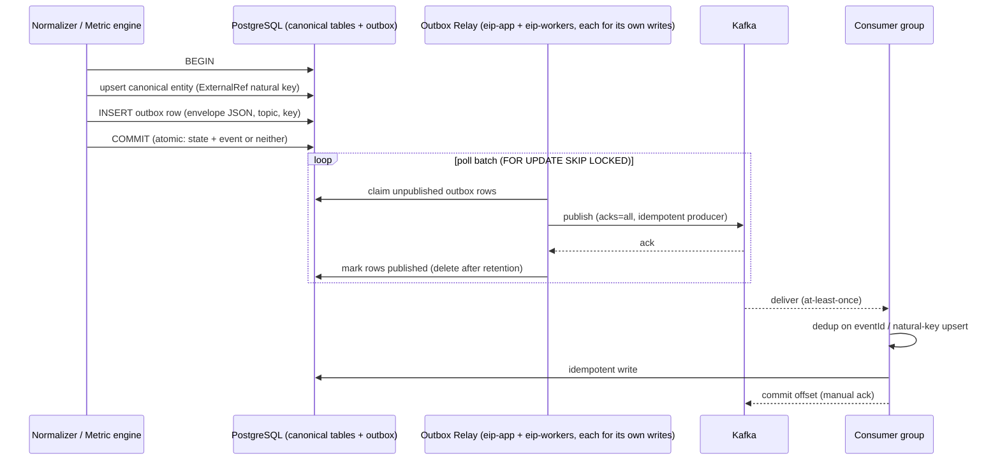

# Event and Messaging Architecture

Engineering Intelligence Platform (EIP) — Kafka topic design, canonical event envelope, delivery guarantees, and operational conventions for the messaging layer. Producers are primarily the ingestion pipeline defined in [ConnectorFramework.md](ConnectorFramework.md); consumers span `eip-ingestion`, `eip-analytics`, `eip-ai`, and `eip-reports`. Platform context: [../architecture/ArchitectureOverview.md](../architecture/ArchitectureOverview.md).

## 1. Principles

1. **At-least-once delivery.** Producers use acks=all with idempotent producer settings; consumers may see duplicates and must tolerate them. We never build on exactly-once semantics across the whole pipeline.
2. **Idempotent consumers.** Every consumer dedups on `eventId` (UUIDv7) against a processed-event record or achieves idempotency structurally via natural-key upserts (`ExternalRef`). Duplicate delivery is a non-event.
3. **Ordered per key.** Ordering is guaranteed only within a partition; all events for one entity share the key `tenantId:entityId`, so per-entity ordering holds. No consumer may assume cross-entity or cross-topic ordering.
4. **Schema-versioned.** Every event carries `schemaVersion`; payload schemas live in-repo and are CI-validated (Section 6). Consumers upcast older minor versions on consume.

The event log is a **derived integration layer, not the system of record** — PostgreSQL is the source of truth (Section 10).

## 2. Canonical event envelope

Every message on every `eip.*` topic (raw, domain, analytics, AI, reports, DLQ) uses this envelope. Fields match the platform brief exactly.

```json
{
  "$schema": "https://json-schema.org/draft/2020-12/schema",
  "$id": "https://eip.example.com/schemas/events/envelope/1.json",
  "title": "EIP Event Envelope",
  "type": "object",
  "required": [
    "eventId", "tenantId", "source", "entityType", "entityId",
    "eventType", "occurredAt", "ingestedAt", "schemaVersion", "payload"
  ],
  "properties": {
    "eventId": {
      "type": "string",
      "format": "uuid",
      "description": "UUIDv7 — time-ordered, globally unique; the dedup key for idempotent consumers."
    },
    "tenantId": {
      "type": "string",
      "format": "uuid",
      "description": "Owning tenant. Consumers MUST enforce tenant isolation on every read."
    },
    "source": {
      "type": "string",
      "description": "Producing component or connector instance, e.g. 'connector:jira:inst-7f2a' or 'module:eip-analytics'.",
      "pattern": "^(connector|module|webhook):[a-z0-9-]+(:[a-z0-9-]+)?$"
    },
    "entityType": {
      "type": "string",
      "description": "Canonical entity name from the domain model, e.g. 'WorkItem', 'PullRequest', 'Deployment', 'Incident', 'Metric'."
    },
    "entityId": {
      "type": "string",
      "description": "Canonical entity id (UUID) for domain events; source-natural id for raw events."
    },
    "eventType": {
      "type": "string",
      "description": "Dotted event name, e.g. 'workitem.transitioned', 'cicd.build.finished'.",
      "pattern": "^[a-z]+(\\.[a-z_]+)+$"
    },
    "occurredAt": {
      "type": "string", "format": "date-time",
      "description": "When the fact happened in the source system (source clock)."
    },
    "ingestedAt": {
      "type": "string", "format": "date-time",
      "description": "When EIP recorded the event (platform clock)."
    },
    "schemaVersion": {
      "type": "string",
      "pattern": "^[0-9]+\\.[0-9]+$",
      "description": "Payload schema version, MAJOR.MINOR. Additive-only within a major."
    },
    "payload": {
      "type": "object",
      "description": "Event-type-specific body, validated against the schema registered for (eventType, schemaVersion)."
    },
    "traceparent": {
      "type": "string",
      "pattern": "^[0-9a-f]{2}-[0-9a-f]{32}-[0-9a-f]{16}-[0-9a-f]{2}$",
      "description": "W3C Trace Context propagation; links the event to the producing OTel trace."
    }
  },
  "additionalProperties": false
}
```

Serialization: JSON (UTF-8) in v1. The envelope is small; payload compression is delegated to Kafka producer compression (`zstd`).

`traceparent` is schema-optional but required by convention for every pipeline-originated event (any event produced by an EIP module, normalizer, sync run, or relay); it may be absent only on externally-injected raw events (e.g. `webhook:*` sources or OTLP push) where no upstream trace context exists. Contract-test fixtures for pipeline producers include it.

## 3. Topic catalog

Partitions guidance assumes the on-prem baseline (3-broker KRaft, Section 11); single-broker dev uses the same topic names with 1–3 partitions (Section 12).

| Topic | Owning module | Key | Partitions | Retention | Producers | Consumers | Payload family |
|---|---|---|---|---|---|---|---|
| `eip.raw.<connector>` (one per connector type, e.g. `eip.raw.jira`, `eip.raw.github`) | `eip-ingestion` | `tenantId:externalId` | 6 | delete, 7 d | Connector sync runs (`RawEmitter`), webhook intake — **direct produce** (Section 9) | Normalizers (`eip.ingestion.*-normalizer`) | Raw source records (as-fetched) |
| `eip.domain.workitem` | `eip-ingestion` | `tenantId:entityId` | 12 | delete, 30 d | Work-item normalizers (outbox) | `eip.analytics.*` metric groups, `eip.ai.rag-indexer` | WorkItem lifecycle events |
| `eip.domain.scm` | `eip-ingestion` | `tenantId:entityId` | 12 | delete, 30 d | SCM normalizers (GitHub/GitLab/Bitbucket) (outbox) | `eip.analytics.*` metric groups, `eip.ai.rag-indexer` | Commit/PR/review events |
| `eip.domain.cicd` | `eip-ingestion` | `tenantId:entityId` | 12 | delete, 30 d | CI/CD + K8s/OpenShift normalizers (outbox) | `eip.analytics.*` metric groups (DORA, ops correlation) | Build/pipeline/deployment events |
| `eip.domain.quality` | `eip-ingestion` | `tenantId:entityId` | 6 | delete, 30 d | SonarQube normalizer, quality analyzers (outbox) | `eip.analytics.*` metric groups, `eip.ai.rag-indexer` | Quality gate/finding/debt events |
| `eip.domain.ops` | `eip-ingestion` | `tenantId:entityId` | 6 | delete, 30 d | Prometheus/Grafana/OTLP normalizers, incident normalizers (outbox) | `eip.analytics.*` metric groups (incident correlation) | Incident/alert/SLO events |
| `eip.analytics.metrics` | `eip-analytics` | `tenantId:metricKey` | 6 | delete, 90 d | Metric engines (`eip-analytics`) (outbox) | `eip.analytics.read-models` (read-model / dashboard-cache projector) | Computed metric points |
| `eip.ai.jobs` | `eip-ai` | `tenantId:jobId` | 6 | delete, 7 d | API layer, schedulers, agents (sub-jobs) — via outbox | `eip.ai.orchestrator` (AI worker runtime, `eip-workers`) | Agent/RAG job requests |
| `eip.ai.results` | `eip-ai` | `tenantId:jobId` | 6 | delete, 7 d | AI workers (outbox) | None in-platform (see note below) | Agent/RAG job outcomes |
| `eip.reports.jobs` | `eip-reports` | `tenantId:jobId` | 3 | delete, 7 d | API layer, schedulers, Report Composition agent (`eip-ai`) — via outbox | `eip.reports.job-runner` (report workers) | Report generation requests |
| `<group>.dlq` (one per consumer group; group names already carry the `eip.` prefix, e.g. group `eip.analytics.flow-metrics` → topic `eip.analytics.flow-metrics.dlq`) | the group's owning module | original key | 3 | delete, 30 d | DLQ router of the owning group | Replay API, operators | Failed envelope + failure metadata |

Notes:

- **Owning module** — exactly one per topic — owns the topic's payload schemas, partition/retention settings, and DLQ policy: `eip.raw.*` + `eip.domain.*` → `eip-ingestion`; `eip.analytics.metrics` → `eip-analytics`; `eip.ai.jobs`/`eip.ai.results` → `eip-ai`; `eip.reports.jobs` → `eip-reports`. `BackendPlan.md` §9.1 and `../architecture/ComponentModel.md` mirror this matrix verbatim.
- **`eip-app` consumes no Kafka topic.** Agent-run status is served from the `agent_runs` row (updated by workers) via polling / Postgres LISTEN-NOTIFY, not from `eip.ai.results` — consequently `eip.ai.results` has no in-platform consumer group and functions as an audit/integration stream within its retention. Reports are triggered via schedules + API + `eip.reports.jobs`, never by subscribing to domain or metric topics. AI agents and the report engine read metric data through the `eip-analytics` query API, not from `eip.analytics.metrics`.
- Raw topics are short-retention transport; durable raw history lives in `raw_*` JSONB staging and MinIO, so 7 d covers replays of consumer bugs without duplicating storage.
- All topics use `cleanup.policy=delete`. Compaction is deliberately not used (Section 11): events are facts, not state snapshots, and the DB rebuilds state.
- Every consumer group owns exactly one DLQ topic named `<group>.dlq` — literally the group name plus the `.dlq` suffix (group `eip.analytics.flow-metrics` → topic `eip.analytics.flow-metrics.dlq`) — created with the group, monitored per Section 9.

## 4. Event taxonomy

### 4.1 Raw events — `eip.raw.<connector>`

`eventType = raw.<connector>.<stream>.upserted` (e.g. `raw.jira.issues.upserted`, `raw.github.pull_requests.upserted`). Payload is the source record as fetched plus fetch metadata (`stream`, `fetchKind: full|incremental|webhook`, `contentHash`). Raw events exist so normalizers scale independently of sync runs; they carry no canonical semantics.

### 4.2 Domain events per family

| Topic | Event types |
|---|---|
| `eip.domain.workitem` | `workitem.created`, `workitem.updated`, `workitem.transitioned`, `workitem.blocked`, `workitem.unblocked`, `workitem.linked`, `workitem.deleted` |
| `eip.domain.scm` | `scm.commit.recorded`, `scm.pr.opened`, `scm.pr.updated`, `scm.pr.reviewed`, `scm.pr.merged`, `scm.pr.closed`, `scm.branch.created`, `scm.release.published` |
| `eip.domain.cicd` | `cicd.pipeline.registered`, `cicd.build.started`, `cicd.build.finished`, `cicd.deployment.recorded`, `cicd.rollback.recorded` |
| `eip.domain.quality` | `quality.gate.evaluated`, `quality.finding.detected`, `quality.finding.resolved`, `quality.measure.snapshotted`, `quality.debt.updated` |
| `eip.domain.ops` | `ops.incident.opened`, `ops.incident.updated`, `ops.incident.resolved`, `ops.alert.fired`, `ops.alert.resolved`, `ops.slo.breached` |
| `eip.analytics.metrics` | `analytics.metric.computed`, `analytics.metric.backfilled` |
| `eip.ai.jobs` / `eip.ai.results` | `ai.job.requested`, `ai.job.started`, `ai.job.progressed`, `ai.job.completed`, `ai.job.failed`, `ai.job.cancelled` |
| `eip.reports.jobs` | `reports.job.requested`, `reports.job.started`, `reports.job.completed`, `reports.job.failed` |

### 4.3 Example events

`externalRef` objects in payloads carry `externalId` — the **immutable source-native id** (Jira numeric issue id, GitHub node id) — and `externalKey`, the human-readable, mutable key (`PAY-1421`, `acme/payments#912`) used for display and text-correlation heuristics only, per `../architecture/DomainModel.md` §12.1. Contract-test fixtures pin `externalId` to the immutable form so source-side renames never destabilize identity.

`workitem.transitioned` on `eip.domain.workitem`:

```json
{
  "eventId": "0197a4c2-6b1e-7c3a-9f4e-2d8a1b3c4d5e",
  "tenantId": "8f14e45f-ceea-467f-a34e-cbb1c0f1a2b3",
  "source": "module:eip-ingestion",
  "entityType": "WorkItem",
  "entityId": "3c9d2f6a-1e4b-4a7c-8d2e-5f6a7b8c9d0e",
  "eventType": "workitem.transitioned",
  "occurredAt": "2026-07-06T09:14:33Z",
  "ingestedAt": "2026-07-06T09:15:02Z",
  "schemaVersion": "1.2",
  "payload": {
    "workItemType": "STORY",
    "externalRef": { "sourceSystem": "jira", "externalId": "10241", "externalKey": "PAY-1421", "url": "https://jira.internal.example.com/browse/PAY-1421" },
    "fromState": "IN_PROGRESS",
    "toState": "IN_REVIEW",
    "workflowStateCategory": "WIP",
    "sprintId": "b7e2a9c4-0d1f-4e6a-9b3c-2a5d8e7f6a1b",
    "boardId": "5a1c3e7d-9b2f-4d8a-8c6e-1f4a7b0d3e9c",
    "teamId": "d4f6a8b0-2c4e-4f6a-8b0d-2e4f6a8b0c1d",
    "blocked": false,
    "transitionedBy": { "memberId": "9e8d7c6b-5a4f-4e3d-2c1b-0a9f8e7d6c5b" },
    "durationInFromStateSeconds": 193480
  },
  "traceparent": "00-4bf92f3577b34da6a3ce929d0e0e4736-00f067aa0ba902b7-01"
}
```

`scm.pr.merged` on `eip.domain.scm`:

```json
{
  "eventId": "0197a4c8-1f0d-7b2e-8a3c-4d5e6f7a8b9c",
  "tenantId": "8f14e45f-ceea-467f-a34e-cbb1c0f1a2b3",
  "source": "module:eip-ingestion",
  "entityType": "PullRequest",
  "entityId": "6d5c4b3a-2e1f-4a9b-8c7d-6e5f4a3b2c1d",
  "eventType": "scm.pr.merged",
  "occurredAt": "2026-07-06T10:02:11Z",
  "ingestedAt": "2026-07-06T10:02:40Z",
  "schemaVersion": "1.0",
  "payload": {
    "externalRef": { "sourceSystem": "github", "externalId": "PR_kwDOEjjQvs5aX9zB", "externalKey": "acme/payments#912", "url": "https://github.internal.example.com/acme/payments/pull/912" },
    "repositoryId": "1a2b3c4d-5e6f-4a7b-8c9d-0e1f2a3b4c5d",
    "targetBranch": "main",
    "sourceBranch": "feat/idempotency-keys",
    "mergeCommitSha": "9f8e7d6c5b4a3f2e1d0c9b8a7f6e5d4c3b2a1f0e",
    "openedAt": "2026-07-03T14:20:00Z",
    "firstReviewAt": "2026-07-04T08:41:00Z",
    "approvals": 2,
    "reviewers": 3,
    "changedFiles": 18,
    "additions": 642,
    "deletions": 187,
    "linkedWorkItems": [
      { "sourceSystem": "jira", "externalKey": "PAY-1421" }
    ]
  },
  "traceparent": "00-7ac93f4588c45eb7b4df03ae1f1f5847-11a178bb1cb013c8-01"
}
```

`cicd.deployment.recorded` on `eip.domain.cicd`:

```json
{
  "eventId": "0197a4d1-3e2f-7d4a-b5c6-7e8f9a0b1c2d",
  "tenantId": "8f14e45f-ceea-467f-a34e-cbb1c0f1a2b3",
  "source": "connector:generic-cicd:inst-ado-01",
  "entityType": "Deployment",
  "entityId": "2b3c4d5e-6f7a-4b8c-9d0e-1f2a3b4c5d6e",
  "eventType": "cicd.deployment.recorded",
  "occurredAt": "2026-07-06T11:30:45Z",
  "ingestedAt": "2026-07-06T11:31:12Z",
  "schemaVersion": "1.1",
  "payload": {
    "externalRef": { "sourceSystem": "azure-devops", "externalId": "5581", "externalKey": "payments-cd/run/5581", "url": "https://ado.internal.example.com/acme/payments/_build/results?buildId=5581" },
    "serviceId": "7c8d9e0f-1a2b-4c3d-8e4f-5a6b7c8d9e0f",
    "environment": "production",
    "releaseId": "4e5f6a7b-8c9d-4e0f-9a1b-2c3d4e5f6a7b",
    "status": "SUCCEEDED",
    "startedAt": "2026-07-06T11:22:10Z",
    "finishedAt": "2026-07-06T11:30:45Z",
    "commitShas": ["9f8e7d6c5b4a3f2e1d0c9b8a7f6e5d4c3b2a1f0e"],
    "artifacts": [
      { "sourceSystem": "artifactory", "externalId": "docker-prod/payments:2.14.0@sha256:ab12...", "url": "https://artifactory.internal.example.com/docker-prod/payments/2.14.0" }
    ],
    "triggeredBy": "pipeline"
  },
  "traceparent": "00-8bd04a5699d56fc8c5ef14bf2a2a6958-22b289cc2dc124d9-01"
}
```

`ops.incident.resolved` on `eip.domain.ops`:

```json
{
  "eventId": "0197a4d9-5a6b-7e8f-9c0d-1e2f3a4b5c6d",
  "tenantId": "8f14e45f-ceea-467f-a34e-cbb1c0f1a2b3",
  "source": "module:eip-ingestion",
  "entityType": "Incident",
  "entityId": "5f6a7b8c-9d0e-4f1a-8b2c-3d4e5f6a7b8c",
  "eventType": "ops.incident.resolved",
  "occurredAt": "2026-07-06T13:05:00Z",
  "ingestedAt": "2026-07-06T13:05:21Z",
  "schemaVersion": "1.0",
  "payload": {
    "externalRef": { "sourceSystem": "jira", "externalId": "30871", "externalKey": "OPS-3327", "url": "https://jira.internal.example.com/browse/OPS-3327" },
    "severity": "SEV2",
    "serviceIds": ["7c8d9e0f-1a2b-4c3d-8e4f-5a6b7c8d9e0f"],
    "openedAt": "2026-07-06T09:47:00Z",
    "resolvedAt": "2026-07-06T13:05:00Z",
    "timeToResolveSeconds": 11880,
    "suspectedDeploymentId": "2b3c4d5e-6f7a-4b8c-9d0e-1f2a3b4c5d6e",
    "alertIds": ["8d9e0f1a-2b3c-4d4e-9f5a-6b7c8d9e0f1a"],
    "resolutionCategory": "rollback"
  },
  "traceparent": "00-9ce15b67aae67fd9d6f025c03b3b7a69-33c39add3ed235ea-01"
}
```

## 5. Schema evolution rules

- `schemaVersion` is `MAJOR.MINOR`. Within a major: **additive-only** — new optional fields, new enum values only where the field is documented as open-enum, never renames, removals, type changes, or semantic changes.
- Breaking changes bump MAJOR. Both majors are produced in parallel during a migration window only if a consumer outside our deploy unit needs it; inside the modular monolith we prefer upgrading consumers first, then producers.
- **Unknown or newer MAJOR on consume:** a consumer that receives an event whose `schemaVersion` MAJOR it does not support never guesses — the event is routed to the group's DLQ (`<group>.dlq`, failure class `UNKNOWN_SCHEMA`, Section 10) and an alert fires immediately (version skew is a deployment/producer bug, not data weather), per FR-038.
- **Upcasting on consume:** consumers register upcasters per (eventType, fromMinor) that transform older payloads to the latest minor before handler code runs. Handlers only ever see the newest minor of their supported major.
- Producers always emit the latest version. Version negotiation does not exist; consumers must accept every minor ≤ latest of a supported major.

## 6. Schema registry decision

**Decision: in-repo JSON Schema registry with CI validation. No Confluent Schema Registry in v1.**

Layout: `/backend/eip-core/src/main/resources/event-schemas/<eventType>/<major>.<minor>.json`, plus the envelope schema. A generated index maps `(eventType, schemaVersion) → schema`.

Justification:

- **On-prem first.** Confluent Schema Registry is another stateful service to deploy, secure, back up, and license-review in air-gapped enterprise environments. The brief's deployment model penalizes every additional moving part.
- **Single deploy unit.** Producers and consumers live in one modular monolith plus workers built from the same repo — schema drift between independently deployed teams, the problem Confluent primarily solves, does not exist here.
- **CI is the enforcement point.** The build (1) validates every schema file against draft 2020-12, (2) diffs each schema against the previous minor and fails on non-additive change, (3) runs contract tests validating every example/produced payload against its schema (Section 13). This gives broker-independent enforcement earlier than a runtime registry would.
- **Revisit trigger:** if modules are extracted to independently released services, or if non-EIP producers must publish to `eip.*` topics, adopt a runtime registry then; the in-repo schemas migrate as-is.

Runtime behavior: producers validate payloads against the registry index before publish in dev/test profiles (sampled in prod); consumers validate on DLQ routing to classify schema failures.

## 7. Partitioning and ordering strategy

- **Key = `tenantId:entityId`** on domain topics (`tenantId:externalId` on raw, `tenantId:jobId` on job topics, `tenantId:metricKey` on metrics). Guarantees: all events of one entity are totally ordered; a consumer processing partition-sequentially never sees `workitem.transitioned` before its `workitem.created` for the same item.
- Implications: cross-entity ordering is undefined — correlation logic (e.g. deployment ↔ incident) must be watermark/time-based, not arrival-order-based; consumers scale up to partition count; changing partition count reshuffles keys, so partition counts are provisioned generously up front (Section 3) and changed only with a drain-and-cutover runbook.
- **Hot-partition mitigation:** including `entityId` in the key already spreads a large tenant across all partitions — a tenant is hot only if a single entity is hot, which is rare (bulk imports hit many entities). Remaining mitigations: producer-side `linger.ms`/batching to flatten bursts; monitoring per-partition throughput skew (alert at 3× median); for pathological single-entity storms (e.g. an alert flapping), the ops normalizer coalesces repeats within a debounce window before publishing. Salting keys is explicitly rejected — it would break per-entity ordering.

## 8. Consumer conventions

- **Group naming:** `eip.<module>.<purpose>`. This section is the **canonical group-name list** — `BackendPlan.md` §9.1 and `../architecture/ComponentModel.md` use exactly these names: `eip.ingestion.<stream>-normalizer` groups (e.g. `eip.ingestion.workitem-normalizer`), `eip.analytics.flow-metrics`, `eip.analytics.dora-metrics`, `eip.analytics.read-models` (read-model / dashboard-cache projector, owned by `eip-analytics`), `eip.ai.rag-indexer`, `eip.ai.orchestrator` (claims `eip.ai.jobs`), `eip.reports.job-runner` (consumes `eip.reports.jobs`). The group name determines the DLQ topic (`eip.analytics.flow-metrics.dlq`).
- **Batching:** `max.poll.records=200` default (raw normalizers 500; AI/report job consumers 1 — jobs are long-running), `fetch.min.bytes=64KB`, `fetch.max.wait.ms=250`.
- **max.poll guidance:** `max.poll.interval.ms` must exceed worst-case batch processing time with margin — 300 s default; AI/report job consumers set 30 min and heartbeat via a separate thread (Spring Kafka default). If a handler can block longer, it must hand off to an internal job table instead of holding the poll loop.
- **Manual ack after idempotent write.** `enable.auto.commit=false`; offsets are acknowledged only after the handler's idempotent write (upsert keyed on `eventId` or natural key) has committed to PostgreSQL. Crash between write and ack ⇒ redelivery ⇒ dedup absorbs it. Never ack-then-write.
- Consumers are tenant-aware: every handler resolves the tenant context from `tenantId` before any DB access so Postgres RLS applies.
- Rebalance: cooperative-sticky assignor; handlers must be interruption-safe at batch boundaries.

## 9. Transactional outbox → Kafka publishing

**Scope (ADR-017):** the transactional outbox is mandatory for **domain, analytics, and job events** — everything on `eip.domain.*`, `eip.analytics.metrics`, `eip.ai.*`, and `eip.reports.*`. For those families, producers never write to the DB and Kafka independently: publication goes through the transactional outbox in PostgreSQL, and no producer of those families (normalizer, metric engine, agent runtime, report scheduler, or API layer) ever publishes to Kafka directly.

**Raw intake is the sole, deliberate exception:** connector sync runs (`RawEmitter`) and webhook intake publish **directly** to `eip.raw.<connector>`. Durability on that path is the staged `raw_*` row, committed **before** the produce — a raw record always exists in staging before it exists on Kafka, so replay re-produces from staging — and `staging.webhook_intake_buffer` buffers webhook intake during Kafka outages. This keeps high-volume raw traffic out of the outbox table and preserves the webhook intake latency budget.

The relay is not a single-runtime component: `OutboxRelay` runs in **both** runtimes — `eip-app` and `eip-workers` — each instance relaying the outbox rows written by its own runtime (`BackendPlan.md` §6/§8), so events originated in the API app never stall when workers are down.



Properties: no lost events (event row commits with the state change), no ghost events (rollback discards both), at-least-once from relay retries, per-key order preserved by publishing outbox rows in insertion order per key. Relay lag is a first-class metric (`eip.outbox.lag_seconds`, exported as `eip_outbox_lag_seconds`); the alert is `EipOutboxRelayStalled` (lag > 60 s) in the `../architecture/ObservabilityModel.md` §7 catalog.

## 10. Dead letter queue policy

- **Failure-class taxonomy (drives every retry/DLQ decision; mirrored in `../architecture/DataFlow.md` global invariants).** Every consumer failure is classified before any retry or DLQ routing, and the class is stamped into the `x-eip-failure-class` header:

| Failure class | Meaning (examples) | Handling |
|---|---|---|
| `TRANSIENT_INFRA` | Platform or source infrastructure unavailable — Postgres, Kafka, Redis, MinIO, or the source system down or timing out | Pause the partition and retry with exponential backoff until the dependency recovers — **never DLQ**. An infrastructure outage must not convert the in-flight stream into DLQ traffic requiring manual replay. |
| `DATA_POISON` | The message itself is unprocessable — deserialization failure, envelope or payload schema-validation failure | **DLQ immediately, no retry** — retrying cannot repair a malformed message. |
| `LOGIC_BUG` | Handler exception on a well-formed message — a consumer-code defect | Bounded in-consumer retry with backoff (1 s, 10 s, 60 s — 3 attempts), then DLQ + alert. |
| `UNKNOWN_SCHEMA` | Unsupported `schemaVersion` MAJOR (Section 5) | **DLQ immediately + alert** — version skew is a deployment/producer bug, not data weather, per FR-038. |

- **DLQ routing:** a DLQ-bound record is routed to the group's `<group>.dlq` topic (e.g. `eip.analytics.flow-metrics.dlq`) with failure metadata headers (`x-eip-failure-class` populated from the taxonomy above, `x-eip-exception`, `x-eip-attempts`, `x-eip-original-topic`, `x-eip-original-partition-offset`) and the offset is committed so the partition keeps flowing. `TRANSIENT_INFRA` is the exception: nothing is routed and the partition stays paused until the dependency recovers.
- **Park + replay API:** the DLQ admin endpoints (`GET /api/v1/dlq/groups`, `GET /api/v1/dlq/groups/{group}/messages`, `POST /api/v1/dlq/groups/{group}/replay`, `DELETE /api/v1/dlq/groups/{group}/messages/{msgId}` — see [APIDesign.md](APIDesign.md) §4.3) list parked events per group (tenant-scoped, RBAC-guarded), support inspect, discard-with-reason (audited), and replay — replay republishes to the original topic with the original key, so ordering relative to new traffic is best-effort and the target consumer's idempotency absorbs any interleaving.
- **Alerting:** alert names, the metric, and thresholds are owned by the single alert catalog in `../architecture/ObservabilityModel.md` §7. Every DLQ route increments `eip_kafka_dlq_messages_total{group, failure_class}`, and `EipDlqNonEmpty` fires on it: any increase over 10 min ⇒ warning; > 100 events/h ⇒ critical. This section defines no separate DLQ metric or threshold set.

## 11. Event sourcing stance

EIP is **not event-sourced**. The event log is a derived integration layer:

- **PostgreSQL is the system of record.** Canonical entities are authoritative rows; events describe changes for downstream consumers but are never replayed to reconstruct primary state. Topic retention (7–90 d) makes this structurally impossible by design — nobody can quietly start depending on infinite replay.
- **Where replay is supported: analytics rebuild.** Metric engines can rebuild derived aggregates from (a) canonical tables — the normal path for full recomputation, and (b) topic replay within retention for recent-window reprocessing after a metric-engine bug fix (`analytics.metric.backfilled` marks recomputed points). RAG re-indexing likewise reads from canonical tables + object storage, not from Kafka history.
- **Analytics data-access rule (ADR-019; stated identically in `../architecture/ArchitectureOverview.md` §5, `BackendPlan.md` §5, and `../architecture/ComponentModel.md`):** the canonical-table rebuild path above uses `eip-analytics`' READ-ONLY SQL access to the canonical schemas (`work`/`scm`/`cicd`/`quality`/`ops`) via a dedicated read-only DB grant, for recomputation/rollups only. Reads of `staging.raw_*` and any canonical writes are forbidden. At module extraction, this access becomes a canonical read replica or an API.
- Rationale: source tools already hold the deep history (and connectors can re-sync); event sourcing would duplicate that burden while complicating tenant deletes (GDPR-style erasure is a DB operation plus retention-bounded topic aging, not a log rewrite).

## 12. Backpressure and lag SLOs

| Consumer group family | Lag SLO (time-lag) | Backpressure behavior |
|---|---|---|
| Raw normalizers | p95 < 2 min | Sync engine slows scheduling when raw-topic lag exceeds 5 min (feedback via lag metric) |
| Domain → analytics | p95 < 5 min | Metric recomputation coalesces (skip-intermediate) under load |
| RAG indexer | p95 < 15 min | Batch re-index; drops to scheduled mode under sustained lag |
| AI / report job consumers | job start p95 < 60 s | Bounded worker pool; queue depth surfaced to UI with position |

Lag is measured as time-lag (now − timestamp of last consumed record), exported via `eip.consumer.lag_seconds` per group/topic and burrow-style offset lag from the broker; both alarm against the SLO via `EipKafkaConsumerLagGrowing` in the `../architecture/ObservabilityModel.md` §7 alert catalog. Producers of outbox-scoped families apply backpressure naturally through the outbox (relay throttles when the broker is slow) — the API layer never blocks on Kafka; on the direct-produce raw path (Section 9), webhook intake falls back to `staging.webhook_intake_buffer` and sync scheduling slows on raw-topic lag.

## 13. Kafka on-prem operations

- **KRaft only** (no ZooKeeper), matching the platform stack decision. Baseline production topology: 3 combined broker+controller nodes (dedicated controllers from ~10 brokers up).
- **Sizing baseline** (mid-size enterprise, ~50 GB/day ingest): 3 brokers, 8 vCPU / 32 GB RAM / 2 TB NVMe each; `replication.factor=3`, `min.insync.replicas=2`, producer `acks=all`, `compression.type=zstd`. Disk sizing = daily volume × retention × RF × 1.4 headroom.
- **Compaction vs delete per topic:** all `eip.*` topics in Section 3 use `cleanup.policy=delete` — events are immutable facts and the DB rebuilds state, so compaction (which keeps only the latest record per key) would destroy event history within retention and provides nothing we need. Compaction is reserved for a future keyed-state topic only if one is introduced; none exists in v1.
- TLS (SASL/SCRAM or mTLS) between all clients and brokers; per-module principals with topic-prefix ACLs (`eip.raw.*` writable by ingestion only, etc.). Quotas per principal guard against a runaway producer.
- Ops runbooks: partition reassignment, broker replacement, and retention change procedures live with `/infra/kubernetes` overlays; Grafana boards for broker health, per-topic throughput, and consumer lag ship in `/infra/grafana`.

## 14. Local development

- The Docker Compose dev stack (`/infra/docker-compose`) runs a **single KRaft broker** (combined mode), `replication.factor=1`, `min.insync.replicas=1`, auto-topic-creation disabled — topics are created by the same declarative topic manifest used in production (partition counts scaled down to 1–3 via profile).
- Same topic names, same envelope, same outbox relay as production — dev differs only in scale knobs, never in code path. Simulation-mode connectors (see [ConnectorFramework.md](ConnectorFramework.md), Section 10) provide realistic traffic without external tools.
- A `kafka-ui` container is included for topic inspection; DLQ replay is exercised locally against the same admin API.

## 15. Testing

- **Decision: Testcontainers Kafka, not embedded Kafka.** `spring-kafka-test`'s embedded broker diverges from real broker behavior (listener config, KRaft vs legacy quirks, timing) and fights Spring context caching. Testcontainers runs the exact broker image pinned in Compose, so integration tests exercise production-equivalent transport. Embedded remains acceptable only for ultra-fast serializer smoke tests, and no test may assert delivery semantics against it.
- **Contract tests in CI:** every schema in the in-repo registry is exercised — (1) each schema file validates as draft 2020-12; (2) each producer's emitted payloads (captured via test fixtures per eventType) validate against the registered schema for the declared `schemaVersion`; (3) each example in this document is a fixture and validates in CI, so the docs cannot drift from the schemas; (4) additive-only evolution is enforced by diffing each schema against the prior minor and failing on removals/renames/type changes.
- **Consumer tests:** idempotency (deliver the same event twice, assert single canonical effect), out-of-order tolerance across entities, upcaster round-trips (oldest supported minor → latest), DLQ routing on poison payloads, and manual-ack ordering (crash-between-write-and-ack simulation asserting redelivery convergence).
- **Outbox tests:** transactional atomicity (rollback publishes nothing), relay ordering per key, and relay crash-recovery (claimed-but-unpublished rows are re-published, consumers dedup).

## 16. Acceptance criteria

- [ ] Given any event published to any `eip.*` topic, then it validates against the envelope schema and its (eventType, schemaVersion) payload schema.
- [ ] Given a consumer crash after DB write but before offset commit, when the group rebalances, then redelivery produces no duplicate canonical rows and no duplicate downstream events.
- [ ] Given two events for the same `tenantId:entityId`, then every consumer observes them in `occurredAt`-consistent publish order.
- [ ] Given a poison message, then the partition continues within one retry cycle, the event lands in the group's `<group>.dlq` topic with full failure metadata, and replay through the admin API converges to correct state.
- [ ] Given a producer transaction rollback, then no event for that transaction ever reaches Kafka (outbox atomicity — domain/analytics/job families per the Section 9 scope; on the raw path, a failed staging transaction produces nothing because the staged row commits before the produce).
- [ ] Given a schema change PR that removes or retypes a field within a major version, then CI fails.
- [ ] Given the single-broker dev stack with simulation connectors, then the full pipeline (raw → domain → analytics → AI jobs → reports) runs end-to-end with all topics from Section 3 present.
