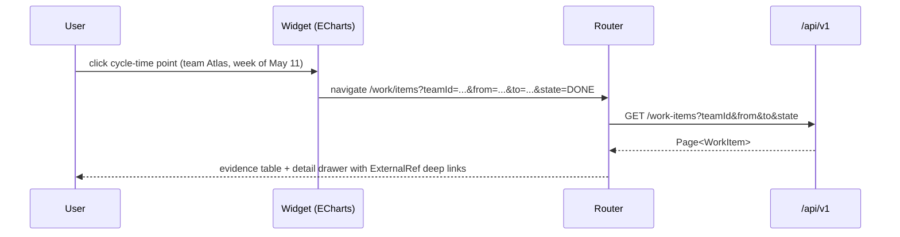

# Frontend Implementation Plan

This document is the implementation plan for the Engineering Intelligence Platform (EIP) frontend under `/frontend`: a React 18 + TypeScript single-page application serving all personas defined in `../product/Personas.md`, consuming the REST API defined in `APIDesign.md`. Backend counterpart: `BackendPlan.md`; test tooling detail: `../testing/TestingStrategy.md`; local stack: `../infrastructure/LocalDevelopment.md`.

## 1. Stack

| Concern | Decision |
|---|---|
| Runtime / build | React 18 + TypeScript (strict) + Vite |
| Server state | TanStack Query (the only cache for API data) |
| Routing | TanStack Router (typed routes, route-level code splitting, search-param-typed global filters) |
| Charts | ECharts (via a thin `<EipChart>` wrapper; SVG renderer for dashboards, canvas for large series) |
| API client | Generated OpenAPI TS client (`openapi-typescript` + typed fetch wrapper, generated in CI into `src/api/generated`; see `APIDesign.md` §10). No hand-written request/response types. |
| Component library | **Mantine** (see §1.1) |
| Styling | Design tokens (CSS custom properties: color, spacing, typography, elevation, chart palette) mapped into the Mantine theme; component-scoped CSS Modules for the rest; no runtime CSS-in-JS |
| Forms | Mantine form primitives + JSON-Schema-driven renderer for config resources (§8) |
| i18n | react-i18next, ICU messages, keys per feature folder (§9) |

### 1.1 Component library decision: Mantine

Chosen over Ant Design for enterprise-density work:

1. **Density is a token, not a fork.** Mantine sizes every input/table/control from a spacing and size scale exposed as CSS variables; we set a compact scale once in the design tokens and every screen (data-heavy tables, monitors, config panels) inherits it. AntD's density story (compact algorithm) is coarser and its visual language is harder to de-brand for an on-premise product that must look neutral in enterprise settings.
2. **Headless hooks + strict TS.** `use-form`, `use-debounced-value`, combobox primitives, and modals are fully typed and tree-shakeable, matching our strict-TS, generated-client approach.
3. **Dark mode and theming** via native CSS variables aligns with the token pipeline and ECharts theme generation (one token source feeds both).
4. **Accessibility** is first-class (focus management, ARIA on all interactive components), which we hold as a baseline (§9).
5. MIT-licensed, no design-language coupling to another vendor's brand, active maintenance.

What we accept: fewer "enterprise mega-components" (e.g., AntD ProTable) — we build one `EipDataTable` (TanStack Table + Mantine styling: server-side cursor pagination, column config, row selection, density toggle) and reuse it everywhere.

### 1.2 Design tokens

Tokens live in `src/design/tokens.css` as CSS custom properties and are the single source for the Mantine theme and the generated ECharts theme:

| Token group | Examples | Consumers |
|---|---|---|
| Color: semantic | `--eip-color-surface`, `--eip-color-text-secondary`, `--eip-color-danger` | Mantine theme, custom components |
| Color: chart | `--eip-chart-cat-1..12` (categorical), `--eip-chart-seq-*`, `--eip-chart-diverging-*`, `--eip-chart-risk-low/med/high` | ECharts theme only — chart series never use semantic UI colors |
| Spacing / density | `--eip-space-1..8`, `--eip-control-height-compact` | Mantine `spacing`/`size` scales, `EipDataTable` density toggle |
| Typography | `--eip-font-sans`, `--eip-font-mono`, `--eip-text-xs..xl` | Everything; mono for ids, cursors, traceIds |
| Elevation / radius | `--eip-shadow-1..3`, `--eip-radius-sm/md` | Cards, drawers, popovers |

Light and dark values are defined per token; ECharts re-themes by regenerating the theme object from computed styles on scheme change. Chart color/form guidance (categorical vs sequential use, contrast checks) is enforced by a lint-time palette validator in `src/design`.

## 2. Application shell

- **Layout:** left nav (persona-grouped sections), top bar with tenant/org switcher, global search, time-range picker, user menu; content outlet with breadcrumbs.
- **Tenant/org switcher:** lists organizations the user's roles grant; switching updates the auth context (token exchange/refresh) and invalidates all TanStack Query caches — tenant is never in the URL path, per `APIDesign.md` §1.3. `PLATFORM_ADMIN` gets an explicit, visually flagged "act as tenant" mode (audited server-side).
- **Nav by persona:** sections shown are derived from permissions, not hardcoded persona names — e.g., the Ops section appears iff the user holds `system:operate` or `ingestion:operate`. Persona defaults (which dashboard is home) come from role → default-view mapping, overridable per user.
- **RBAC-aware routing and permission gates:**
  - Route definitions declare `requiredPermission` (values from the `x-eip-permission` OpenAPI extension); the router guard redirects unauthorized navigation to a 403 view that names the missing permission.
  - `<Can permission="connector:manage">` component-level gate hides/disables mutating controls; disabled-with-tooltip is preferred over hidden for discoverability, hidden for security-sensitive areas (audit, secrets).
  - Permissions arrive once from the session endpoint and live in an auth context; gates never call the API per check.
- **Auth:** OIDC code flow + PKCE against Keycloak (or configured IdP), silent refresh, local-accounts form fallback for air-gapped installs.

Route guard sketch (TanStack Router):

```ts
export const connectorsRoute = createRoute({
  getParentRoute: () => adminRoute,
  path: "connectors",
  beforeLoad: ({ context }) => {
    context.auth.require("connector:read"); // throws RedirectToForbidden(missing)
  },
  component: lazyRouteComponent(() => import("../features/connectors/ConnectorsScreen")),
});
```

Default home view per role (clonable saved views, `/api/v1/dashboards` seeds):

| Role | Default home |
|---|---|
| `PLATFORM_ADMIN` | `/admin` (admin dashboard) |
| `TENANT_ADMIN` | `/admin/connectors` |
| `ENGINEERING_MANAGER` | `/dashboards/productivity` |
| `TEAM_LEAD` | `/dashboards/sprints` |
| `MEMBER` | `/dashboards/kanban` |
| `RELEASE_MANAGER` | `/dashboards/releases` |
| `EXECUTIVE_VIEWER` | `/dashboards/delivery-risk` |
| `SECURITY_AUDITOR` | `/admin/audit` |

## 3. Screen inventory

| Screen | Route | Primary persona | Key components | API endpoints consumed |
|---|---|---|---|---|
| Admin dashboard | `/admin` | Deniz (Platform Administrator) | Fleet health cards, tenant list, worker heartbeat grid, recent audit feed | `/system/health`, `/system/info`, `/connectors/health`, `/audit-events`, `/organizations` |
| Integration management | `/admin/connectors` | Deniz, Tenant Admin | `EipDataTable` of connectors, health badges (circuit state), JSON-Schema config drawer, test-connection runner, sync trigger, checkpoint editor | `/connector-types`, `/connectors*`, `/connectors/{id}/test-connection`, `/sync`, `/checkpoints`, `/health` |
| Configuration wizard | `/admin/connectors/new` | Deniz | Stepper: pick type → schema-driven form → secrets entry (masked) → test-connection → initial sync options | `/connector-types`, `/connectors`, `/test-connection`, `/sync` |
| Team & org management | `/admin/organization` | Deniz, Mira (Engineering Manager) | Org/BU/Team tree, member table with `ExternalRef` identity mapping, drag-assign | `/organizations`, `/business-units`, `/teams*`, `/members*`, `/users` |
| Role & permission management | `/admin/roles` | Deniz | Role list, permission matrix editor (catalog-driven), assignment view, service-token issuance | `/roles*`, `/permissions`, `/users`, `/service-tokens` |
| Productivity dashboard | `/dashboards/productivity` | Mira, Kenji (VP Eng/CTO) | Widget grid: velocity, throughput, cycle/lead time, WIP, flow efficiency, blocked time trends; definition popovers with caveats/gaming risks | `/metrics/query`, `/metric-definitions`, `/dashboards*` |
| Delivery risk dashboard | `/dashboards/delivery-risk` | Mira, Leyla (Product Manager) | Risk score heatmap (epic/project/release), dependency risk graph, delay forecast chart, explanation drawer with uncertainty | `/risk-scores`, `/risk-scores/{id}/explanation`, `/forecasts`, `/metrics/query` |
| Sprint dashboard | `/dashboards/sprints` | Sam (Team Lead/Scrum Master), Rosa (Agile Coach) | Sprint selector, commitment-vs-done, burndown, scope churn timeline, sprint predictability trend, Sprint Review agent launcher | `/sprints*`, `/metrics/query`, `/agent-runs` |
| Kanban / flow dashboard | `/dashboards/kanban` | Sam, Rosa | Cumulative flow diagram, WIP by WorkflowState, aging WIP scatter, blocked-time pareto | `/boards*`, `/work-items`, `/metrics/query` |
| Release dashboard | `/dashboards/releases` | Jonas (Release Manager) | Release readiness score gauge + inputs, DORA panel, deployment timeline, Release Notes agent launcher | `/releases*`, `/deployments`, `/risk-scores`, `/metrics/query`, `/agent-runs` |
| Quality dashboard | `/dashboards/quality` | Mira, Helena (CISO) | Coverage/smells/duplication trends, quality gate status, escaped defects, bug aging, tech-debt ratio, security finding aging | `/metrics/query`, `/metric-definitions`, `/work-items?type=BUG` |
| Operational health dashboard | `/dashboards/ops` | Priya (SRE / Ops Engineer) | Incident frequency/impact, MTTR, SLO health, alert noise, incident drill-down list | `/incidents*`, `/metrics/query`, `/deployments` |
| RAG KB management | `/ai/knowledge-bases` | Tenant Admin, Deniz | KB list, source attach wizard, document/index status table, re-index trigger, query playground with citations | `/knowledge-bases*`, `/sources`, `/documents`, `/index-jobs`, `/query` |
| Agent workflow management | `/ai/agents` | Mira, Deniz | Agent catalog (18 canonical agents), enable/guardrail/budget config, run launcher, live run view (SSE plan/steps/tool calls/citations), run history | `/agents*`, `/agent-runs*`, `/agent-runs/{id}/events` (SSE), `/model-routes`, `/prompts` |
| LLM provider config | `/admin/llm-providers` | Deniz | Provider table (Ollama/vLLM/OpenAI-compatible/Anthropic-compatible/custom), schema-driven config form, test probe, model routing matrix, token budget editor, LLM call audit table | `/llm-providers*`, `/llm-providers/{id}/test`, `/model-routes`, `/llm-calls` |
| MCP config | `/admin/mcp` | Deniz, Helena | Upstream server list + handshake test, tool allow-list editor, exposed-capabilities table with per-capability RBAC binding, invocation audit | `/mcp/servers*`, `/mcp/servers/{id}/test`, `/mcp/exposed-capabilities*`, `/mcp/invocations` |
| Report generation center | `/reports/generate` | Mira, Jonas, Kenji | Template gallery, scope picker (team/sprint/release/org), schedule editor, generation job list with progress | `/report-templates*`, `/report-jobs*` |
| Artifacts library | `/reports/artifacts` | All report consumers | Artifact table with filters, version history panel, inline preview (md/html), export menu (md/pdf/html/json/csv/pptx/png/svg), citation inspector | `/artifacts*`, `/artifacts/{id}/versions`, `/content`, `/exports` |
| Audit log viewer | `/admin/audit` | Helena (CISO / Security Officer) | Filterable audit table (actor/action/resource/time/outcome), before/after diff viewer, compliance export | `/audit-events*`, `/audit-events/exports` |
| System health | `/admin/system` | Deniz, Priya | Dependency health board (DB/Kafka/Redis/MinIO/vector store), worker heartbeats, feature flags panel | `/system/health`, `/system/info`, `/system/feature-flags` |
| Background job monitor | `/admin/jobs` | Deniz, Priya | Job/run tables with live status, cancel, run detail (timings, counts, traceId link) | `/jobs*`, `/job-runs/{runId}` |
| Queue & DLQ monitor | `/admin/queues` | Priya | Consumer-lag chart per group, DLQ depth table, message inspector (envelope + failure cause), replay/discard actions | `/system/queues`, `/dlq/groups*`, `/replay` |
| Cache & rate-limit monitor | `/admin/cache` | Priya | Redis stats, rate-limiter budget gauges, distributed lock table | `/system/cache` |
| Connector monitor | `/admin/connectors/health` | Deniz, Priya | Fleet health rollup, per-connector circuit/rate-limit state, last sync outcomes, checkpoint lag | `/connectors/health`, `/connectors/{id}/health`, `/checkpoints` |
| Work item explorer (drill-down target) | `/work/items` | Sam, Arda (Developer), Leyla | Filterable `EipDataTable` over WorkItems, detail drawer with `ExternalRef` deep links, state history | `/work-items*`, `/sprints`, `/boards` |
| Saved views manager | `/dashboards/views` | All dashboard users | Saved view list, share dialog, set-as-home | `/dashboards*`, `/dashboards/{id}/share` |

Every metric surface renders the anti-surveillance invariant: definition popover with purpose, formula, inputs, grain, caveats/limitations, and gaming risks (from `/metric-definitions`); no screen ranks named individuals.

In the artifacts library, generated report HTML is sanitized against a strict allow-list before it is rendered in the inline preview — a stored-XSS defense for AI-generated content.

## 4. Dashboard architecture

- **Widget grid:** dashboards are a responsive 12-column grid of widgets; a widget = `{ metricKeys[], visualization (line|bar|heatmap|gauge|table|stat), groupBy, localFilterOverrides }`. Widget definitions serialize into the saved-view `Dashboard` resource:

```ts
interface WidgetConfig {
  id: string;
  title: string;
  metricKeys: MetricKey[];               // from /metric-definitions
  visualization: "line" | "bar" | "heatmap" | "gauge" | "table" | "stat";
  groupBy?: ("teamId" | "sprintId" | "workItemType" | "environment")[];
  localFilterOverrides?: Partial<GlobalFilters>;
  layout: { x: number; y: number; w: number; h: number }; // 12-col grid units
}
```
- **Saved views:** load/save/share via `/api/v1/dashboards`; ETag/If-Match on save; per-persona shipped defaults are seed data, cloned on first edit.
- **Global filters:** time range, team(s), sprint — held in typed router search params (shareable URLs), applied to every widget query; widgets may override locally. Changing a global filter invalidates only affected query keys.
- **Data flow:** each widget issues one `POST /metrics/query` (batched per dashboard where metric grain and filters coincide) through a `useMetricQuery(request)` hook; responses cached by structural request key.
- **Drill-down pattern (metric → work items):** every flow/quality point or heatmap cell carries its query context (time bucket, group, filters); clicking navigates to `/work/items` with equivalent filter search params so users always land on the evidence behind a number. Risk widgets drill to the explanation drawer first, then to items.


- **Charts:** single ECharts theme generated from design tokens; shared time axis sync per dashboard; sample-size and uncertainty warnings from `MetricQueryResponse.warnings` render as chart annotations, never silently dropped.

## 5. Real-time updates

- **SSE** for agent runs (`/agent-runs/{id}/events`) and job/queue monitors: a typed `useSse(url, eventSchemas)` hook wraps `EventSource` (with fetch-based fallback to attach the bearer header), parses events against generated payload types, supports `Last-Event-ID` resume, and feeds updates into the relevant TanStack Query cache entries so components stay purely query-driven.

```ts
const { status } = useSse(run.eventsUrl, {
  onEvent: (e: AgentRunEvent) =>
    queryClient.setQueryData(qk.ai.agentRun(run.id), (prev) => applyRunEvent(prev, e)),
  resume: true,               // sends Last-Event-ID on reconnect
  fallback: { pollQueryKey: qk.ai.agentRun(run.id), activeMs: 3000, backgroundMs: 15000 },
});
```
- **Polling fallback:** if SSE is unavailable (proxy strips streaming, air-gapped reverse proxies), the hook downgrades to interval polling of the run/job resource (`refetchInterval` 3s active / 15s background) with identical component behavior. The choice is automatic and surfaced in a connection badge on monitor screens.
- No client-side WebSocket layer in v1; SSE + polling covers all live surfaces.

## 6. Forms strategy

- **JSON-Schema-driven forms** for connector, LLM provider, and MCP server configuration: the backend serves each type's JSON Schema (`APIDesign.md` §4.2, §4.7, §4.9); a `SchemaForm` renderer applies schema validation client-side and re-renders server-side violations (problem+json `errors[]`) onto fields. New connectors require zero frontend code.

| JSON Schema construct | Rendered as |
|---|---|
| `type: string` | `TextInput` (`format: uri` adds protocol validation; `format: duration` a duration input) |
| `type: string, format: eip-secret` | Masked `SecretInput`, write-only; existing value shown as `•••• last4`, "replace" affordance |
| `enum` / `const` | `Select` / read-only badge |
| `type: integer|number` with bounds | `NumberInput` with min/max/step |
| `type: boolean` | `Switch` with description |
| `type: array` of objects | Repeatable group with add/remove/reorder |
| `oneOf` + discriminator | Segmented control switching sub-sections |
| `x-eip-advanced: true` | Collapsed "Advanced" section |
| `description`, `examples` | Field help popover with example values |
- Hand-built forms (Mantine `use-form` + zod schemas derived from generated types) only for non-schema resources: teams, roles, dashboards, report scheduling.
- All config-resource forms carry the ETag through edit sessions and handle 412 with a "reload and merge" prompt.

## 7. State management rules

1. **Server state lives in TanStack Query only.** Query keys are `[area, resource, params]` built by a central `qk` factory; mutations invalidate by key prefix; no copying API data into other stores.

| Query key | Example | Invalidated by |
|---|---|---|
| `qk.connectors.list(params)` | `["connectors","list",{type:"JIRA"}]` | connector create/update/delete, sync completion |
| `qk.connectors.health(id)` | `["connectors","health",id]` | 30s `refetchInterval` on monitor screens |
| `qk.metrics.query(request)` | `["metrics","query",structuralHash]` | global-filter change (prefix `["metrics"]`), tenant switch (full clear) |
| `qk.ai.agentRun(id)` | `["ai","agentRun",id]` | SSE events (§5), cancel mutation |
| `qk.reports.artifacts(params)` | `["reports","artifacts",params]` | report job completion event |

2. **Client state is minimal:** auth/session context, theme, nav collapse, in-progress form state, global filter search params (owned by the router). No Redux/Zustand unless a future feature proves an actual need in an ADR.
3. Optimistic updates only for low-risk toggles (flags, enable/disable); everything job-shaped renders server status truthfully.
4. Derived data is computed in selectors/memos at render, never cached manually.

## 8. Accessibility & i18n baseline

- WCAG 2.1 AA target: full keyboard operability (grid and table navigation included), visible focus, ARIA landmarks per shell region, `aria-live` for job/agent status changes, color-contrast-checked token palette; charts get accessible data-table alternatives (toggle on every widget).
- axe checks run in component tests (`../testing/TestingStrategy.md`); violations fail CI.
- i18n-ready from day one: all strings through react-i18next with ICU plurals, `en-US` as source locale, locale-aware dates/numbers (`Intl`), no string concatenation of translatable fragments; RTL not in v1 scope but no hard-coded directional CSS.

## 9. Error, loading, and empty-state conventions

- **Errors:** one `ApiError` type from problem+json (`APIDesign.md` §1.5); route-level error boundaries render title/detail + `traceId` (copyable for support). Mapping from problem `type` to UI behavior:

| Problem type suffix | UI behavior |
|---|---|
| `/problems/validation` | Bind `errors[]` to form fields; toast only if no bound field |
| `/problems/unauthenticated` | Silent token refresh once, then redirect to login preserving return URL |
| `/problems/permission-denied` | 403 view naming the missing permission; no retry |
| `/problems/not-found` | Route-level empty "not found or no access" view (never distinguishes) |
| `/problems/conflict`, `/problems/precondition-failed` | "Reload and merge" dialog carrying fresh ETag (§6) |
| `/problems/rate-limited` | Inline countdown from `Retry-After`; auto-retry once for reads |
| `/problems/connector/*` | Connector health badge + failure detail drawer on connector screens |
| `/problems/internal` | Boundary with traceId, "report to admin" copy action |
- **Loading:** skeletons matching final layout for first load; subtle inline refresh indicators afterwards (queries keep previous data on refetch); no full-screen spinners after shell load.
- **Empty states:** every list/dashboard distinguishes "no data yet" (with the next action, e.g., "Connect Jira" linking to the wizard) from "filters match nothing" (with a clear-filters action). New-tenant dashboards render an onboarding checklist instead of empty charts.

## 10. Testing

Aligned with `../testing/TestingStrategy.md`:

| Layer | Tooling | Scope |
|---|---|---|
| Unit | Vitest | hooks, cursor/filter utils, SchemaForm mapping, chart option builders |
| Component | Testing Library + MSW (handlers generated from OpenAPI) + axe | screens with mocked API, permission gates, error/empty/loading states |
| E2E | Playwright against the `demo` stack (seeded simulation data, real Keycloak) | persona journeys: admin connects a connector via wizard, team lead runs Sprint Review agent and watches SSE progress, release manager exports release notes to pdf, auditor filters audit log |
| Contract | Generated client compile + MSW handler drift check on OpenAPI change | CI gate |

## 11. Performance budgets

- Initial shell JS ≤ 250 KB gzip; each route chunk ≤ 200 KB gzip (ECharts lazy-loaded per chart type; pdf/pptx preview code split).
- Dashboard interactive < 2.5s on the demo stack reference machine; widget refresh render < 100ms after data arrival.
- Tables virtualize above 200 rows; metric queries debounced 300ms on filter change; SSE reconnect backoff capped at 30s.
- Budgets enforced in CI via bundle-size check and a Playwright-based dashboard timing smoke test.

## 12. Folder structure

```
/frontend
  /src
    /api
      /generated        # OpenAPI TS client (CI-generated, not hand-edited)
      client.ts         # fetch wrapper: auth, problem+json, rate-limit headers
      sse.ts            # typed SSE helper + polling fallback
    /app                # shell, router, providers, auth context, permission gates
    /design             # tokens.css, mantine theme, echarts theme, EipChart, EipDataTable
    /features
      /admin            # admin dashboard, system health, jobs, queues, cache monitors
      /connectors       # integration mgmt, wizard, connector monitor
      /tenancy          # org/team/member, roles & permissions
      /dashboards       # widget grid, saved views, the seven metric dashboards
      /work             # work item explorer, sprints, boards
      /ai               # agents, agent runs, llm providers, mcp, rag KBs
      /reports          # generation center, artifacts library
      /audit
    /forms              # SchemaForm renderer + field registry
    /i18n               # locale resources per feature
    /test               # msw handlers, fixtures, test utils
  /e2e                  # Playwright specs + persona fixtures
```

Feature folders own their routes, components, query hooks, and messages; cross-feature imports only via `/design`, `/api`, `/app`, `/forms`.

## 13. Phase mapping

Frontend workstream per the canonical roadmap:

| Phase | Frontend deliverables from this plan |
|---|---|
| Phase 0 – Foundations | Shell + auth + tenant switcher (§2), design tokens + Mantine theme (§1), generated client pipeline, `EipDataTable`, role & permission management, error/loading/empty conventions (§9), CI with Vitest + component tests |
| Phase 1 – Ingestion core | Integration management + configuration wizard (SchemaForm §6), connector monitor, job/queue monitors, team & org management |
| Phase 2 – Analytics & dashboards | Widget grid + saved views + global filters (§4), productivity / sprint / kanban / quality dashboards, work item explorer drill-down, ECharts theme |
| Phase 3 – AI core | LLM provider config, agent workflow management with SSE run view (§5), RAG KB management, report generation center + artifacts library |
| Phase 4 – Full agent suite | MCP config, remaining dashboards (delivery risk, releases, ops), scheduling UIs, exports incl. pptx preview |
| Phase 5 – Enterprise hardening | Performance budget enforcement at scale (§11), full a11y audit, i18n locale completion, browser-support matrix sign-off |

## 14. Definition of done — frontend stories

- [ ] Uses generated API client types only; no hand-written response types; new endpoints consumed only after OpenAPI regeneration.
- [ ] Route declares `requiredPermission`; mutating controls behind `<Can>` gates matching `x-eip-permission`.
- [ ] Error, loading, and both empty-state variants implemented per §9; problem+json `traceId` surfaced.
- [ ] Metric surfaces show definition popovers (purpose, formula, grain, caveats/limitations, gaming risks); no individual-ranking UI.
- [ ] Global filters via typed search params; URLs shareable and restorable.
- [ ] Strings externalized to i18n resources; axe checks pass; keyboard path verified.
- [ ] Unit + component tests with MSW; E2E updated if a persona journey changed.
- [ ] Bundle-size budget respected (CI check green); heavy deps code-split.
- [ ] Works against the local Docker Compose stack (`../infrastructure/LocalDevelopment.md`) in `local` and `demo` profiles.
