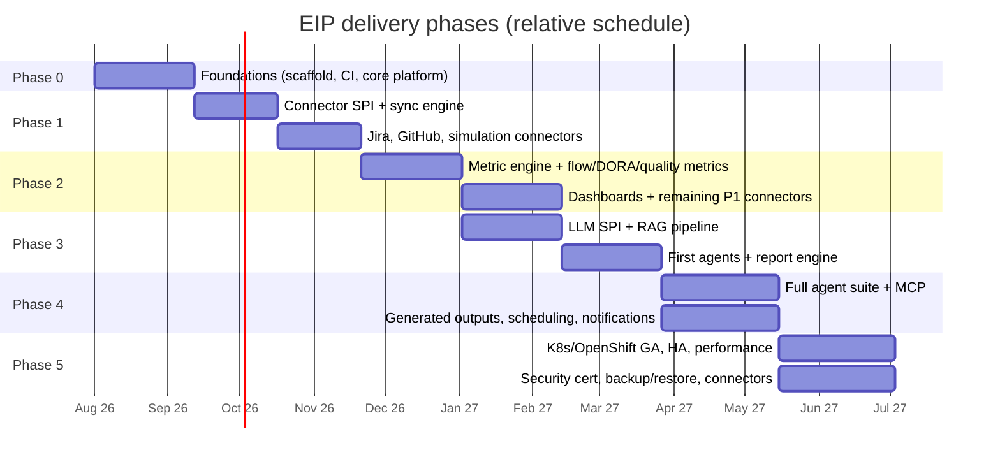

# Phase-Based Implementation Plan

This is the master build plan for the Engineering Intelligence Platform (EIP). It sequences delivery across Phases 0–5 (the canonical roadmap), decomposes each phase into epics and stories, and defines exit criteria and demos. It must be read with `../architecture/ArchitectureOverview.md` (structure), `../architecture/DomainModel.md` (entities), `../testing/TestingStrategy.md` (gates every story must pass), and `../operations/OperationsGuide.md` (what Phase 5 must make operable). Sizes: S ≈ ≤3 dev-days, M ≈ ≤2 weeks, L ≈ ≤4 weeks (split anything larger).

## 1. Phase overview and dependencies

| Phase | Name | Theme |
|---|---|---|
| 0 | Foundations | Monorepo scaffolding, CI, core platform (tenancy, RBAC, audit, secrets, OpenAPI, observability), DB baseline, Docker Compose dev stack |
| 1 | Ingestion core + first connectors | Connector SPI, sync engine, Kafka pipeline, Jira + GitHub + simulation connectors, normalized model v1 |
| 2 | Analytics & dashboards | Metric engine, flow + DORA + quality metrics, productivity/sprint/kanban/quality dashboards, remaining P1 connectors (GitLab, SonarQube, CI/CD, Prometheus) |
| 3 | AI core | LLM provider SPI, RAG pipeline, first agents (Sprint Review, Release Notes, Delivery Risk), report engine + artifact library |
| 4 | Full agent suite + MCP + generated outputs | Presentations, diagrams, exec reports, scheduling, notification channels |
| 5 | Enterprise hardening | K8s/OpenShift GA, HA, performance, security certification checklist, backup/restore, upgrade paths, remaining connectors |

Dates are relative anchors for dependency shape, not commitments; §10 defines how scope and dates are actually tracked. Note the deliberate overlap: Phase 3 (LLM SPI + RAG plumbing) starts once Phase 2's metric engine (`p2a`) stabilizes, because RAG ingestion consumes the same domain events.

## 2. Build order rationale

- **Tenancy, security, observability before connectors (Phase 0 before 1).** Every row written, every event published, every API call carries `tenantId`, RBAC scope, audit trail, and `traceparent`. Retrofitting isolation onto ingested data is the single most expensive mistake this class of product can make — RLS policies, envelope-encrypted secrets, and OTel wiring must exist before the first external byte is ingested. Connectors also need the secret vault (credentials) and audit (compliance) on day one.
- **Jira + GitHub + simulation first (Phase 1).** Jira and GitHub cover the two dominant data families (WorkItems and SCM) and between them exercise every Connector SPI capability: OAuth/token auth, pagination, rate limits, webhooks, incremental checkpoints. The **simulation connector ships in the same phase as the SPI** — not "later" — because it is the test substrate for everything downstream (golden datasets, evals, E2E; see `../testing/TestingStrategy.md` §7–§8) and makes every demo independent of customer credentials.
- **Analytics before AI (Phase 2 before 3).** Agents narrate and reason over metrics; without a trustworthy metric engine, AI output is fluent nonsense. Golden-dataset-verified metrics give agents grounded numbers to cite, and give the Validation Agent something objective to validate against. RAG also needs the canonical model and domain event stream that Phases 1–2 produce.
- **Hardening last but prepared early (Phase 5).** K8s manifests, backup hooks, and performance baselines are built incrementally from Phase 0 (Compose parity, nightly Gatling); Phase 5 is certification and GA polish, not first contact with production concerns.

## 3. Team topology

Six streams; small (2–4 people each), long-lived, aligned to module boundaries so ownership matches Modulith packages:

| Stream | Owns (modules/dirs) | Phase center of gravity |
|---|---|---|
| Platform/core | `eip-app`, `eip-core`, `eip-tenancy`, security, API conventions | Phase 0 heavy; then platform support + Phase 5 hardening |
| Connectors + ingestion | `eip-connectors`, `eip-ingestion`, `/simulation` | Phases 1–2 heavy; long tail of connectors through Phase 5 |
| Analytics | `eip-analytics` | Phase 2 heavy; risk scoring in 3; refinement onward |
| AI | `eip-ai`, `eip-reports` (agent side) | Phases 3–4 heavy |
| Frontend | `/frontend` | Every phase (vertical slices); dashboard-heavy in 2, artifact/agent UX in 3–4 |
| DevX/infra | `/infra`, CI, `/scripts`, observability stack | Phase 0 heavy; Compose→K8s evolution through 5 |

Streams flex: in Phase 0 the connector and analytics streams contribute to core platform; in Phase 5 everyone contributes to hardening. Each stream owns its modules' quality gates and flaky-test budget (`../testing/TestingStrategy.md` §15–§16).

## 4. Cross-phase engineering practices

- **Trunk-based development:** short-lived branches into `main`, PR + green gates only; no release branches before Phase 5 GA cadence requires them.
- **Feature flags for incomplete verticals:** every phase merges work-in-progress behind flags (`eip.features.*`), so `main` is always releasable and demos toggle honestly. Flags are removed within one phase of GA of the feature (flag debt is tracked).
- **Docs-as-code kept in sync:** `/docs` changes ship in the same PR as behavior changes (a merge gate); Modulith documenter output regenerated in CI keeps architecture docs honest.
- **ADR process:** decisions altering the brief-level architecture (stack, module boundaries, event contracts, SPIs) require an ADR under `/docs/architecture/adr/`, referenced from the PR; ADR summaries roll up into `../architecture/ArchitectureOverview.md` §7.
- **Vertical-slice principle:** each phase ends with a runnable demo **through the UI** on the Docker Compose stack — never a backend-only milestone. If the UI slice is thin, it is still real (real auth, real data path, real audit).

## 5. Phase 0 — Foundations

**Objectives:** a monorepo where a new engineer is productive in under a day; the core platform (tenancy, RBAC, audit, secrets, OpenAPI, observability) real and tested; DB baseline with RLS; Compose dev stack; CI enforcing the quality gates from day one.

### 5.1 Epics and stories

| ID | Story | Module(s) | Depends on | Size |
|---|---|---|---|---|
| P0-E1-S1 | Monorepo scaffolding: Gradle multi-module `/backend`, Vite `/frontend`, `/infra`, `/scripts` per canonical layout | all | — | S |
| P0-E1-S2 | CI pipeline: static, unit, integration, Modulith/ArchUnit stages; coverage gates | infra | P0-E1-S1 | M |
| P0-E1-S3 | Docker Compose dev stack: Postgres 16+pgvector, Kafka (KRaft), Redis 7, MinIO, Keycloak, OTel Collector, Prometheus, Grafana | infra/docker-compose | P0-E1-S1 | M |
| P0-E1-S4 | Developer docs: README, onboarding guide, `make dev` one-command bootstrap | docs, scripts | P0-E1-S3 | S |
| P0-E2-S1 | `eip-core` domain skeleton: shared kernel, canonical entity base types (WorkItem supertype, ExternalRef), Instant/UUIDv7 conventions | eip-core | P0-E1-S1 | M |
| P0-E2-S2 | DB baseline: Flyway setup, tenant-scoped schema conventions, RLS policy template, partitioning conventions | eip-core, eip-app | P0-E2-S1 | M |
| P0-E3-S1 | Tenancy: Organization/tenant model, tenant context propagation (web, Kafka, jobs), RLS enforcement | eip-tenancy | P0-E2-S2 | L |
| P0-E3-S2 | RBAC: roles + fine-grained permissions catalog (per Personas §1), method/route guards, permission test matrix generator | eip-tenancy | P0-E3-S1 | L |
| P0-E3-S3 | OIDC integration: Keycloak realm, token→tenant/role mapping, local-account break-glass fallback | eip-tenancy, eip-app | P0-E3-S1 | M |
| P0-E3-S4 | Audit subsystem: append-only audit store, audit API + viewer stub, fail-closed policy for audited actions | eip-tenancy | P0-E3-S1 | M |
| P0-E4-S1 | Secret vault: AES-256-GCM envelope encryption, KMS SPI (env/file/Vault), rotation + re-encrypt-all, masked rendering | eip-tenancy | P0-E3-S4 | L |
| P0-E4-S2 | OpenAPI baseline: springdoc, `/api/v1` conventions, RFC 7807, cursor pagination, idempotency-key filter, committed spec + CI diff | eip-app | P0-E2-S1 | M |
| P0-E4-S3 | Observability wiring: OTel SDK, Micrometer, structured JSON logs, traceparent propagation, Grafana starter dashboards in `/infra/grafana` | eip-app, infra | P0-E1-S3 | M |
| P0-E5-S1 | Frontend shell: login (OIDC), tenant switcher, RBAC-guarded routing, layout, i18n scaffolding, TanStack Query setup | frontend | P0-E3-S3 | M |
| P0-E5-S2 | Admin console skeleton: tenants list/create, users/roles, audit viewer | frontend, eip-app | P0-E5-S1, P0-E3-S4 | M |

### 5.2 First 10 pull requests (unambiguous start)

1. **PR-1 Repo scaffolding** — monorepo layout, Gradle multi-module + Vite skeletons, editorconfig, licenses, CODEOWNERS per stream (P0-E1-S1).
2. **PR-2 CI** — GitHub Actions/Jenkins pipeline: build, unit test stage, lint; branch protection wired (P0-E1-S2 first cut).
3. **PR-3 Compose dev stack** — all infra services + healthchecks + `make dev` (P0-E1-S3).
4. **PR-4 Core domain module** — `eip-core` with WorkItem supertype, ExternalRef, event envelope types, Modulith verification test (P0-E2-S1).
5. **PR-5 Tenancy + RBAC skeleton** — tenant entity, tenant context filter, role/permission model, first RLS policy + Testcontainers proof (P0-E3-S1/S2 skeleton).
6. **PR-6 Audit** — audit store, `@Audited` aspect, first audited action (P0-E3-S4 skeleton).
7. **PR-7 Secret vault** — envelope encryption, KMS SPI with env-key impl, secret entity + masked API (P0-E4-S1 skeleton).
8. **PR-8 OpenAPI baseline** — springdoc config, problem+json handler, pagination envelope, committed `openapi.json` + CI diff check (P0-E4-S2).
9. **PR-9 Observability wiring** — OTel/Micrometer config, JSON logging, trace propagation test, Grafana provisioning stub (P0-E4-S3).
10. **PR-10 README + dev docs** — onboarding guide, architecture pointer, contribution rules incl. gates (P0-E1-S4).

### 5.3 Milestones, deliverables, exit criteria, demo

**Technical milestones:** M0.1 CI green on empty modules; M0.2 login via Keycloak with tenant-scoped token; M0.3 first RLS-proven write/read; M0.4 secret stored/rotated with audit trail.

**Integration points:** first contact with Keycloak (OIDC), PostgreSQL 16 + RLS, Redis, MinIO, Kafka (topic creation only), OTel Collector → Prometheus/Grafana/Tempo. Everything downstream assumes these are wired here.

**Deliverables:** Compose dev stack; core platform modules with integration tests; committed OpenAPI baseline; Grafana starter dashboards; onboarding docs; ADR-0001 (modular monolith) through ADR-0005 (secrets design) recorded.

**Exit criteria:**
- [ ] `make dev` boots the full stack from a clean machine in ≤ 15 min
- [ ] CI enforces unit+integration+Modulith gates; coverage ratchet active
- [ ] Two seeded tenants; cross-tenant read provably blocked (RLS test + API probe)
- [ ] RBAC matrix test generator running over all existing endpoints
- [ ] Secret create/rotate flows audited and masked end-to-end
- [ ] OTel traces from HTTP → DB visible in the dev stack

**Demo script:** clean clone → `make dev` → log in as Deniz via Keycloak → create tenant, invite a `TENANT_ADMIN` → store a secret, rotate it → show masked value, audit entries, and the trace of the request in Grafana/Tempo → show CI on a PR failing a Modulith boundary violation, then passing.

**Risks & mitigations:** RLS + connection pooling pitfalls (mitigate: spike in week 1, dedicated integration test pattern); Keycloak learning curve (mitigate: pre-built realm export in `/infra`); over-engineering the platform (mitigate: everything must be consumed by a Phase 1 story or it's cut).

## 6. Phase 1 — Ingestion core + first connectors

**Objectives:** the Connector SPI and sync engine proven with three connectors (Jira, GitHub, simulation); Kafka pipeline raw→canonical live; normalized model v1 populated; connector contract test kit binding all future connectors.

### 6.1 Epics and stories

| ID | Story | Module(s) | Depends on | Size |
|---|---|---|---|---|
| P1-E1-S1 | Connector SPI: config JSON Schema, validate(), testConnection(), healthCheck(), fullSync(), incrementalSync(checkpoint), simulation/mock mode hooks | eip-connectors | P0-E4-S1 | L |
| P1-E1-S2 | Sync engine: scheduling, checkpoint table per connector+stream, retry with exponential backoff + jitter, rate limiting (Redis state) | eip-ingestion | P1-E1-S1 | L |
| P1-E1-S3 | Kafka pipeline: event envelope (UUIDv7, traceparent), `eip.raw.<connector>` producers, raw staging (`raw_*` JSONB + MinIO blobs), DLQ per consumer group | eip-ingestion | P0-E4-S3 | L |
| P1-E1-S4 | Connector contract test kit K1–K7 as shipping test fixture | eip-connectors | P1-E1-S1 | M |
| P1-E2-S1 | Normalizer framework: raw→canonical mapping, idempotent upserts, dedup on eventId/ExternalRef, `eip.domain.*` publication | eip-ingestion, eip-core | P1-E1-S3 | L |
| P1-E2-S2 | Normalized model v1: WorkItem hierarchy, Sprint/Board/WorkflowState, Repository/Branch/Commit/PullRequest/CodeReview persistence | eip-core | P1-E2-S1 | L |
| P1-E3-S1 | Jira connector: projects, WorkItems, sprints, boards, transitions; webhooks + polling; kit-passing | eip-connectors | P1-E1-S4 | L |
| P1-E3-S2 | GitHub connector: repos, commits, PRs, reviews, Actions runs (raw only); webhooks; kit-passing | eip-connectors | P1-E1-S4 | L |
| P1-E3-S3 | Simulation connector + first data pack (`packs/demo-small`): seeded, deterministic org/team/sprint/SCM history | eip-connectors, /simulation | P1-E1-S4 | L |
| P1-E4-S1 | Connector admin UI: onboarding wizard (configure→validate→test→enable), Connector Health, Sync Checkpoint browser, DLQ inspector | frontend, eip-app | P1-E1-S2, P0-E5-S2 | L |
| P1-E4-S2 | Data browser (canonical entities, read-only, RBAC-scoped) | frontend, eip-app | P1-E2-S2 | M |

### 6.2 Milestones, deliverables, exit criteria, demo

**Technical milestones:** M1.1 kit K1–K7 green on simulation connector; M1.2 first Jira full sync lands canonical WorkItems; M1.3 GitHub webhook→dashboard-visible < freshness SLO; M1.4 kill-worker-mid-sync resumes from checkpoint (E8 precursor).

**Integration points:** first external tool APIs (Jira, GitHub — auth, pagination, rate limits, webhooks); Kafka becomes the live backbone (`eip.raw.*` → `eip.domain.*`, DLQs); MinIO used for raw blobs; Redis for rate-limit state and Redisson sync locks; `eip-workers` deployed as a separate process for the first time.

**Deliverables:** three kit-certified connectors; sync engine + checkpointing; raw/canonical pipeline with DLQs; normalized model v1 + event JSON Schemas; connector admin UI; simulation pack v1 with manifest; connector developer guide in `/docs`.

**Exit criteria:**
- [ ] All three connectors pass contract kit K1–K7 in CI
- [ ] Full + incremental sync from a real Jira and GitHub sandbox verified (recorded WireMock fixtures committed, scrubbed)
- [ ] Re-sync produces zero duplicates (K6 at integration and E2E level)
- [ ] DLQ replay procedure works as documented in `../operations/OperationsGuide.md` §3.1
- [ ] Event schemas versioned + compatibility-tested per `../testing/TestingStrategy.md` §5.1
- [ ] E2E smoke E1–E3 running on PR

**Demo script:** as Deniz, onboard the Jira connector through the wizard (validate → test connection → enable) → watch checkpoint browser during first sync → open data browser: Epics/Stories/Sprints present → push a change in GitHub sandbox, webhook lands, entity updates → kill the worker mid-sync, restart, show resume → switch to the simulation connector and load `demo-small` in under a minute.

**Risks & mitigations:** vendor API quirks eat the schedule (mitigate: recorded fixtures early, kit isolates SPI from vendor pain); event contract churn (mitigate: schemas + compatibility CI from the first event); simulation pack realism debated endlessly (mitigate: pack shape reviewed once by analytics stream, then frozen per version).

## 7. Phase 2 — Analytics & dashboards

**Objectives:** metric engine computing flow + DORA + quality metrics with golden-dataset-proven correctness; productivity/sprint/kanban/quality dashboards live; remaining P1 connectors (GitLab, SonarQube, Generic CI/CD, Prometheus) certified.

### 7.1 Epics and stories

| ID | Story | Module(s) | Depends on | Size |
|---|---|---|---|---|
| P2-E1-S1 | Metric engine core: metric registry (purpose, formula, inputs, grain, caveats, gaming risks as data), computation scheduling, `eip.analytics.metrics` publication | eip-analytics | P1-E2-S1 | L |
| P2-E1-S2 | Flow metrics: velocity, throughput, cycle time, lead time, WIP, flow efficiency, blocked time, sprint predictability, scope churn | eip-analytics | P2-E1-S1 | L |
| P2-E1-S3 | DORA metrics: deployment frequency, lead time for changes, change failure rate, MTTR | eip-analytics | P2-E1-S1, P2-E3-S2 | L |
| P2-E1-S4 | Quality metrics: coverage, code smells, duplication, quality gate status, escaped defects, bug aging, technical debt ratio, security finding aging | eip-analytics | P2-E3-S1 | L |
| P2-E1-S5 | Golden dataset harness + first golden packs for all shipped metrics | eip-analytics, /simulation | P2-E1-S2 | M |
| P2-E2-S1 | Dashboard framework: ECharts components, metric API (cursor-paginated), caveat/limitation rendering baked into every metric panel | frontend, eip-app | P2-E1-S1 | L |
| P2-E2-S2 | Sprint + Kanban dashboards (Sam): burn views, cycle-time scatter, WIP aging, blocked items | frontend | P2-E2-S1, P2-E1-S2 | L |
| P2-E2-S3 | Delivery Health dashboard (Mira): multi-team flow + DORA rollups | frontend | P2-E2-S1, P2-E1-S3 | M |
| P2-E2-S4 | Quality dashboard (Arda/Jonas): quality + security-finding views | frontend | P2-E2-S1, P2-E1-S4 | M |
| P2-E3-S1 | SonarQube connector (kit-passing): measures, quality gates, findings | eip-connectors | P1-E1-S4 | M |
| P2-E3-S2 | Generic CI/CD connector (Jenkins/Azure DevOps/GitHub Actions/GitLab CI): Build/Pipeline/Deployment/Release entities | eip-connectors | P1-E1-S4 | L |
| P2-E3-S3 | GitLab connector (kit-passing) | eip-connectors | P1-E1-S4 | M |
| P2-E3-S4 | Prometheus connector: Metric/Alert intake for ops signals | eip-connectors | P1-E1-S4 | M |
| P2-E4-S1 | Simulation pack v2 (`packs/enterprise-large`): multi-team, incidents, deployments — feeds golden + perf suites | /simulation | P2-E1-S5 | M |

### 7.2 Milestones, deliverables, exit criteria, demo

**Technical milestones:** M2.1 first golden case green end-to-end (events→metric value); M2.2 all four dashboards render from simulation data; M2.3 DORA computed from real CI/CD connector data; M2.4 nightly Gatling baseline established (ingestion 100k events/hour target first measured here).

**Integration points:** `eip-analytics` consumes `eip.domain.*` and publishes `eip.analytics.metrics`; SonarQube, GitLab, Prometheus, and CI/CD tool APIs join the connector fleet; ECharts dashboards consume the metric API through TanStack Query; Redis becomes the dashboard cache layer.

**Deliverables:** metric engine + registry; complete flow/DORA/quality metric set with definitions (each stating purpose, formula, inputs, grain, caveats/limitations, gaming risks); golden dataset packs; four persona dashboards; four new kit-certified connectors; metrics reference doc in `/docs`.

**Exit criteria:**
- [ ] Every shipped metric has a golden dataset case (`../testing/TestingStrategy.md` §7) and a complete registry definition
- [ ] Dashboards show caveats inline; no individual-ranking view exists (anti-surveillance guard test green)
- [ ] GitLab, SonarQube, CI/CD, Prometheus connectors pass kit K1–K7
- [ ] p95 metric query latency < 500 ms on `enterprise-large` pack
- [ ] E2E E4 (dashboard render) in nightly; persona journeys for Mira, Sam, Arda automated

**Demo script:** load `enterprise-large` simulation pack → as Sam, open the Sprint dashboard mid-"sprint": WIP aging, blocked items, cycle-time scatter → as Mira, Delivery Health across three simulated teams; drill into a slow team's DORA panel; hover a metric to show formula + caveats + gaming risks → as Arda, quality dashboard fed by SonarQube connector → change a simulated deployment's outcome, re-run analytics, watch change failure rate move.

**Risks & mitigations:** metric definition debates stall coding (mitigate: registry definitions reviewed asynchronously; golden case is the tie-breaker); dashboard scope creep (mitigate: four persona dashboards only, everything else is Phase 4); DORA needs deployment data quality that connectors can't guarantee (mitigate: data-quality flags surfaced, caveats state confidence).

## 8. Phase 3 — AI core

**Objectives:** LLM provider SPI with local-first providers; RAG pipeline with permission-aware retrieval; first three agents (Sprint Review, Release Notes, Delivery Risk) producing cited, validated outputs; report engine + artifact library.

### 8.1 Epics and stories

| ID | Story | Module(s) | Depends on | Size |
|---|---|---|---|---|
| P3-E1-S1 | LLM provider SPI: Ollama, vLLM (OpenAI-compatible), OpenAI-compatible generic, Anthropic-compatible, custom endpoint; per-tenant + per-agent routing, fallbacks, token budgets | eip-ai | P0-E4-S1 | L |
| P3-E1-S2 | LLM call audit: prompt/model/tokens/cost/latency recording, prompt redaction policy | eip-ai, eip-tenancy | P3-E1-S1 | M |
| P3-E1-S3 | FakeLlmProvider + eval harness skeleton (golden prompts from simulation data) | eip-ai | P3-E1-S1 | M |
| P3-E2-S1 | RAG pipeline: chunking, configurable embedding, VectorStore SPI (pgvector default, Qdrant option), incremental + scheduled re-index | eip-ai | P1-E2-S1 | L |
| P3-E2-S2 | Permission-aware retrieval: tenant isolation, metadata filters, source citations, retrieval audit | eip-ai, eip-tenancy | P3-E2-S1 | L |
| P3-E3-S1 | Agent runtime: plan/execute with tool-calling, budgets, guardrails, structured output schemas + repair/reject path | eip-ai | P3-E1-S1 | L |
| P3-E3-S2 | Sprint Review agent (grounded in WorkItems/PRs/Deployments, citations) | eip-ai | P3-E3-S1, P3-E2-S2 | L |
| P3-E3-S3 | Release Notes agent | eip-ai | P3-E3-S1 | M |
| P3-E3-S4 | Delivery Risk agent + risk scoring integration (epic delivery risk, dependency risk, release readiness inputs) | eip-ai, eip-analytics | P3-E3-S1, P2-E1-S1 | L |
| P3-E3-S5 | Validation Agent v1 + regression suite (numeric fidelity, citation presence, grounding) | eip-ai | P3-E3-S2 | L |
| P3-E4-S1 | Report engine: templates, composition from agent outputs, exports to MinIO | eip-reports | P3-E3-S1 | L |
| P3-E4-S2 | Artifact library UI + agent invocation UX (progress, citations, validation status) | frontend, eip-app | P3-E4-S1 | L |

### 8.2 Milestones, deliverables, exit criteria, demo

**Technical milestones:** M3.1 same prompt answered by Ollama and vLLM through the SPI with routing/fallback; M3.2 RAG answer with correct citations and proven tenant isolation; M3.3 first Sprint Review artifact passes Validation Agent; M3.4 eval harness in nightly CI.

**Integration points:** first LLM providers (Ollama, vLLM) via LangChain4j behind the SPI; pgvector in anger (VectorStore SPI, with Qdrant compatibility verified once); `eip.ai.jobs`/`eip.ai.results` and `eip.reports.jobs` topics go live; report exports land in MinIO; the optional Python AI worker path (isolated behind Kafka/REST) is exercised by one reference worker to prove the seam.

**Deliverables:** LLM SPI + providers; RAG pipeline + retrieval; agent runtime; three agents + Validation Agent; report engine + artifact library; eval harness + golden prompt sets; AI operations sections feeding `../operations/OperationsGuide.md` §9 T3.

**Exit criteria:**
- [ ] Fully air-gapped run: all AI features function with local Ollama, zero egress (verified by network policy test)
- [ ] RAG isolation test: no cross-tenant/team retrieval (security checklist item green)
- [ ] Every agent output schema-validated; malformed output takes repair/reject path, never publishes
- [ ] Validation Agent regression suite green and gating
- [ ] Every LLM call audited with tokens/cost; prompt redaction policy enforced
- [ ] E2E E5 (report generation) automated

**Demo script:** as Deniz, configure Ollama provider, show routing config and a fallback firing → as Sam, invoke Sprint Review on simulated Sprint 14; open artifact: narrative with citations linking back to WorkItems; numbers match the dashboard exactly → show Validation Agent status on the artifact → as Jonas, generate Release Notes for a simulated Release → as Helena, open LLM audit: every call with model/tokens/cost, prompts redacted → pull the network cable (air-gap sim), regenerate: still works.

**Risks & mitigations:** local model quality varies wildly (mitigate: structured outputs + validation, model routing per agent, eval scores per model documented); prompt injection via ingested content (mitigate: adversarial corpus tests from day one, `../testing/TestingStrategy.md` §12); token costs/latency on big tenants (mitigate: budgets enforced in runtime, retrieval caps).

## 9. Phase 4 — Full agent suite + MCP + generated outputs

**Objectives:** the complete canonical agent set; MCP client and server; generated presentations, diagrams, executive reports; scheduling and notification channels.

### 9.1 Epics and stories

| ID | Story | Module(s) | Depends on | Size |
|---|---|---|---|---|
| P4-E1-S1 | Remaining analysis agents: Data Ingestion, Data Quality, Engineering Metrics, Incident Analysis, Code Quality, Team Health (team-level only, anti-toxic-ranking guardrails) | eip-ai | P3-E3-S1 | L |
| P4-E1-S2 | Authoring agents: Documentation, Executive Summary, Use Case Diagram, Architecture Diagram | eip-ai | P3-E3-S1 | L |
| P4-E1-S3 | Orchestration agents: RAG Retrieval, Report Composition, Security Review, Configuration Assistant | eip-ai | P3-E3-S5 | L |
| P4-E2-S1 | MCP client: connect enterprise MCP servers as agent tools, allow-listing, per-capability RBAC + audit | eip-ai | P3-E3-S1 | L |
| P4-E2-S2 | MCP server: expose selected internal capabilities, allow-list registry, per-capability RBAC + audit | eip-ai, eip-tenancy | P4-E2-S1 | L |
| P4-E3-S1 | Generated outputs: presentation export (sprint review decks), Mermaid/diagram rendering, executive report formats (PDF/HTML) | eip-reports | P3-E4-S1 | L |
| P4-E3-S2 | Scheduling: cron-style report/agent schedules per tenant, `eip.reports.jobs` orchestration | eip-reports, eip-workers | P3-E4-S1 | M |
| P4-E3-S3 | Notification channels: email/SMTP, webhook, chat-webhook (Slack/Teams-compatible), in-app | eip-reports | P4-E3-S2 | M |
| P4-E4-S1 | Persona UX completion: Leyla (roadmap/initiative), Priya (ops/SLO), Kenji (exec rollup), Rosa (cross-team flow), Helena (security/audit views) | frontend | P2-E2-S1, P4-E1-S2 | L |
| P4-E4-S2 | Eval expansion: golden prompts + Validation coverage for every new agent | eip-ai | P4-E1-S1 | M |

### 9.2 Milestones, deliverables, exit criteria, demo

**Technical milestones:** M4.1 all 18 canonical agents invocable with schema-validated outputs; M4.2 agent uses an external MCP tool under RBAC + audit; M4.3 external MCP client consumes an EIP-exposed capability; M4.4 scheduled weekly report delivered via notification channel unattended.

**Integration points:** MCP protocol in both directions (enterprise MCP servers as tools; EIP as MCP server); SMTP and chat-webhook endpoints for notifications; presentation/PDF rendering toolchain inside `eip-reports`; scheduler drives `eip.reports.jobs` from tenant-configured crons.

**Deliverables:** full agent suite with evals; MCP client + server with capability registry; presentation/diagram/exec outputs; scheduler + notifications; remaining persona journeys automated in Playwright.

**Exit criteria:**
- [ ] All canonical agents pass schema validation + eval coverage; Validation Agent gates every publishing agent
- [ ] MCP capabilities are deny-by-default, allow-listed, RBAC-checked, audited (both directions)
- [ ] Scheduled reports run for a full simulated week without operator intervention
- [ ] Team Health outputs are team-grain only (anti-surveillance guard extended to agent outputs)
- [ ] All 10 persona journeys green in nightly E2E

**Demo script:** as Kenji, receive the scheduled Monday Executive Summary by email; open the artifact: org rollups, risks, citations → as Mira, ask the Configuration Assistant to tune a connector schedule (MCP-audited tool call shown) → generate an Architecture Diagram artifact from ingested Confluence docs → as Helena, audit the whole chain: schedule → agent → MCP call → notification → show an external MCP client (demo script) querying EIP's exposed metric capability, denied without the right role, allowed with it.

**Risks & mitigations:** 18 agents dilute quality (mitigate: shared runtime + Validation gate; agents ship only with eval coverage — P4-E4-S2 is non-negotiable); MCP security surface (mitigate: deny-by-default, capability RBAC, prompt-injection corpus extended to MCP lures); notification sprawl (mitigate: channel SPI, three channels max in this phase).

## 10. Phase 5 — Enterprise hardening

**Objectives:** production GA on Kubernetes/OpenShift; HA; performance certification against NFRs; security certification checklist; backup/restore and upgrade paths proven; remaining canonical connectors.

### 10.1 Epics and stories

| ID | Story | Module(s) | Depends on | Size |
|---|---|---|---|---|
| P5-E1-S1 | Kubernetes GA: Kustomize base + overlays, probes, resource tuning, NetworkPolicies; OpenShift notes (SCC, routes) | infra/kubernetes | P0-E1-S3 | L |
| P5-E1-S2 | HA: multi-replica app/workers, Postgres HA guidance + read replica support, Kafka/Redis resilience settings, zero-downtime rolling upgrade | infra, eip-app | P5-E1-S1 | L |
| P5-E1-S3 | Offline release bundle: image packaging, air-gapped install path (`scripts/package-offline-release`) | scripts, infra | P5-E1-S1 | M |
| P5-E2-S1 | Performance certification: Gatling targets met on reference K8s deployment (100k events/hour, p95 < 500 ms, 200 concurrent dashboards) | all | P5-E1-S2 | L |
| P5-E2-S2 | Security certification checklist execution: full authz matrix, isolation, scanning, prompt injection, pen-test findings closed | all | P5-E1-S1 | L |
| P5-E3-S1 | Backup/restore productization: pgBackRest integration, restore drill automation, RPO/RTO verification (per `../operations/OperationsGuide.md` §6) | infra, scripts | P5-E1-S1 | L |
| P5-E3-S2 | Upgrade path: rolling upgrade with one-version schema compatibility, rollback rehearsal, release-notes tooling | eip-app, infra | P5-E1-S2 | L |
| P5-E4-S1 | Remaining connectors: Confluence, Bitbucket, Artifactory, Kubernetes, OpenShift, Docker Registry, Grafana, OpenTelemetry (OTLP intake), Generic REST, Generic SQL, Generic File/Document, Custom internal demand/project tool — all kit-certified | eip-connectors | P1-E1-S4 | L (multiple) |
| P5-E4-S2 | Operations polish: support bundle generator, housekeeping jobs, alert rules shipped, runbook completeness review against `../operations/OperationsGuide.md` | eip-app, infra | P5-E3-S1 | M |

### 10.2 Milestones, deliverables, exit criteria, demo

**Technical milestones:** M5.1 reference K8s deployment survives node kill with zero data loss; M5.2 timed restore drill inside RTO; M5.3 rolling upgrade under load with < 20% interactive degradation; M5.4 all canonical connectors kit-certified.

**Integration points:** Kubernetes/OpenShift primitives (Kustomize overlays, probes, NetworkPolicies, SCC), pgBackRest and WAL archiving, the remaining tool APIs (Confluence, Bitbucket, Artifactory, Kubernetes/OpenShift APIs, Docker Registry, Grafana, OTLP intake), and enterprise IdPs beyond Keycloak (AD FS/Azure AD/Okta) verified against the OIDC abstraction.

**Deliverables:** GA K8s/OpenShift manifests; HA reference architecture; offline bundle; performance + security certification reports; automated restore drill; complete connector catalog; final documentation pass across `/docs`.

**Exit criteria:**
- [ ] Full nightly suite (E2E, evals, perf, security) green on the K8s reference deployment
- [ ] RPO ≤ 15 min / RTO ≤ 4 h demonstrated in a timed drill
- [ ] Rolling upgrade + rollback rehearsed under load
- [ ] Security checklist 100% with waivers documented; images scan-clean of criticals
- [ ] Every canonical connector passes kit K1–K7
- [ ] Air-gapped install from offline bundle verified on a disconnected cluster

**Demo script:** install from the offline bundle onto a disconnected OpenShift cluster → run the activation sequence → kill a node during sync: no data loss, dashboards stay up → execute a rolling upgrade during a Gatling load run, show latency panel → perform a restore drill into a scratch namespace, timed → close with the certification checklist review.

**Risks & mitigations:** performance surprises at reference scale (mitigate: nightly Gatling since Phase 2 means no first-contact surprises); OpenShift-specific constraints (mitigate: SCC-compatible containers enforced from Phase 0 image standards); connector long tail underestimated (mitigate: kit + SPI make each connector a bounded M/L; Generic REST/SQL/File cover gaps for launch customers).

## 11. Measuring the plan itself

- **Burnup per phase:** each phase tracks scope (story count from the tables above, adjusted by change control) vs. completed stories, weekly. Burnup, not burndown — scope changes must be visible, not hidden.
- **Scope control rules:** a story enters a phase only via the phase table; additions require an equal-size removal or an explicit phase-length change agreed by stream leads (recorded in the phase's change log). Cut stories move to the next phase's candidate list, never silently vanish. Estimates (S/M/L) are re-baselined once, at phase start.
- **Leading indicators:** PR cycle time, CI duration vs. the 20-min budget, flaky-test count, and flag-debt count are reviewed monthly — the platform should eventually measure its own build (dogfooding via the GitHub/Generic CI/CD connectors from Phase 2 onward).
- **Phase reviews:** every phase ends with the demo script above run live from `main` on a clean environment, plus a retro that feeds the next phase's risk list.

## 12. Story lifecycle and definition of done

Stories flow: `candidate → committed (in phase table) → in progress → in review → done`. A story is **done** only when all of the following hold — this is the story-level contract that makes the phase exit criteria achievable rather than aspirational:

- [ ] Merged to `main` behind a feature flag if the vertical is incomplete (§4)
- [ ] All quality gates from `../testing/TestingStrategy.md` §16 passed (unit, integration, contract, coverage ratchet)
- [ ] Layer-specific artifacts exist: connector stories pass kit K1–K7; metric stories ship a golden case + registry definition; agent stories ship output schema + eval coverage; API stories update the committed OpenAPI spec
- [ ] `/docs` updated in the same PR where behavior changed (docs-as-code, §4)
- [ ] Observability included: new components emit metrics/traces/logs and, where operationally relevant, ship a Grafana panel or alert rule (`../operations/OperationsGuide.md` §4 grows with the system, not after it)
- [ ] Demoable: the story's outcome can be shown in the phase demo script or a test run — "done but not demonstrable" is not done

Estimates are set at phase planning (S/M/L per §1's definitions) and re-baselined only once, at phase start. A story that grows beyond L mid-flight is split, and the remainder re-enters as a candidate through scope control (§11).

## 13. Cross-phase risk register

Top standing risks tracked across the whole plan (phase-local risks live in each phase section):

| Risk | Phase(s) most exposed | Mitigation | Early-warning trigger |
|---|---|---|---|
| Tenant isolation defect discovered late | All | RLS + isolation tests from Phase 0; E7 in every E2E run; security deep stage nightly | Any isolation test flake — treated as S1, never quarantined |
| Event contract churn breaks consumers | 1–3 | Versioned JSON Schemas + compatibility CI (`../testing/TestingStrategy.md` §5.1) | Rising count of schema-version branches in consumers |
| Metric trust collapse (one wrong number in a demo) | 2+ | Golden datasets as the single source of truth; caveats rendered inline; Validation Agent checks numeric fidelity in narratives | Golden expectation edited without analytics-owner review |
| Local LLM quality below usefulness bar | 3–4 | Structured outputs + repair/reject; per-agent model routing; eval scores per model published; graceful AI degradation keeps core product valuable | Eval scores trending down on a model upgrade |
| Connector long tail starves other streams | 2–5 | Kit + SPI bound each connector's cost; Generic REST/SQL/File as coverage backstop; connector stream staffed for the tail | Two consecutive phases where connector stories displace committed platform stories |
| Compose/K8s drift ("works in demo, fails in prod") | 0–5 | Same images, same probes, same config surface; E2E runs on both from Phase 5 RC onward; SCC-compatible images from Phase 0 | Any K8s-only defect class appearing twice |
| Plan overload (this document becomes fiction) | All | Burnup + scope control rules (§11); phase demos run from `main` on clean environments — reality checks that cannot be faked | Burnup scope line growing faster than done line for 3 consecutive weeks |

## 14. Traceability

Story IDs (`P<phase>-E<epic>-S<story>`) are the traceability spine: branch names and PR titles reference them; ADRs cite the stories that motivated them; phase demo scripts exercise them; and once the platform dogfoods itself (§11), its own WorkItem records for this repo map back to these IDs via `ExternalRef` — EIP tracking the building of EIP is the standing acceptance test of the whole design.
