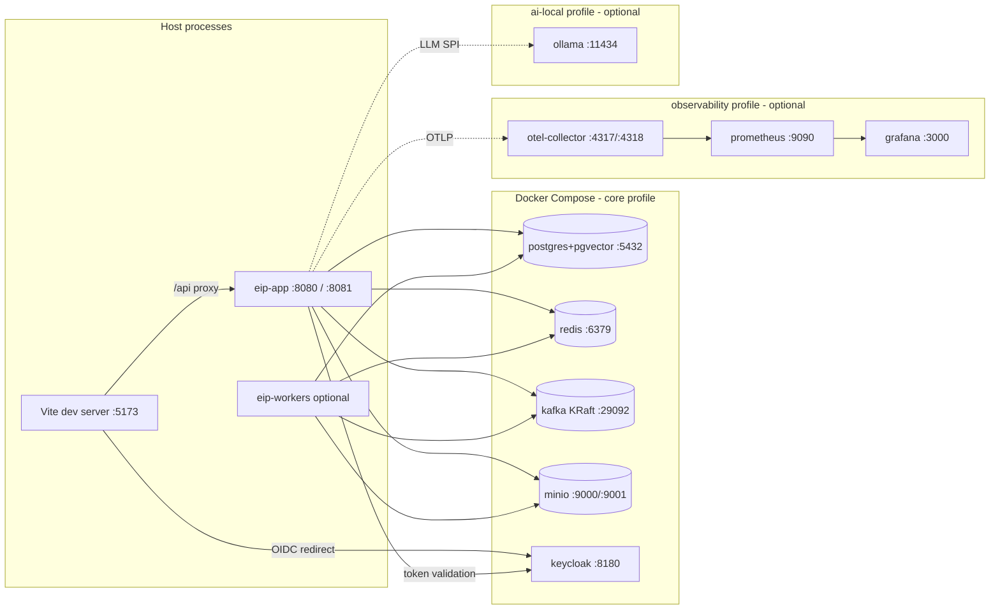

# Local Development Guide

This document is the authoritative specification for the local development environment of the **Engineering Intelligence Platform (EIP)**. It defines the tooling, the Docker Compose dev infrastructure stack, the backend/frontend run workflows, and the day-1 developer journey. The compose files, Makefile, and Gradle/Vite projects described here are Phase 0 deliverables (see `../implementation/PhaseBasedImplementationPlan.md`); this document specifies their intended content and behavior precisely so they can be built to match.

For the overall system design see `../architecture/ArchitectureOverview.md`; for entity vocabulary see `../architecture/DomainModel.md`. The demo/eval deployment (full application containers, not just infrastructure) is specified in `./DockerCompose.md`.

## 1. Prerequisites

| Tool | Version | Purpose | Verify with |
|---|---|---|---|
| JDK | 21 (Temurin recommended) | Backend build/run (Spring Boot 3.x, Gradle toolchain pinned to 21) | `java -version` |
| Docker Engine + Compose plugin | Docker 25+, Compose v2.24+ | Dev infrastructure stack (`/infra/docker-compose`) | `docker compose version` |
| Node.js | 20 LTS or newer | Frontend build/run (React 18 + Vite) | `node --version` |
| pnpm | 9+ | Frontend package manager (enforced via `packageManager` field) | `pnpm --version` |
| GNU make | 4+ | Entry point for all dev workflows (`make dev-up`, etc.) | `make --version` |
| git | 2.40+ | Source control | `git --version` |

Notes:

- Gradle is **not** a prerequisite: the repo ships the Gradle wrapper (`./gradlew`). Never install or use a system Gradle.
- On macOS/Windows, allocate Docker at least **6 CPUs / 10 GB RAM** for the core profile; add 4+ GB when enabling the `ai-local` (Ollama) profile.
- Linux users must be able to run Docker without `sudo` (member of the `docker` group), or all `make` targets that wrap `docker compose` will fail.

## 2. Repository Bootstrap

1. Clone the monorepo:
   ```bash
   git clone <git-remote>/eKingProductivityMeter.git
   cd eKingProductivityMeter
   ```
2. Copy the local environment template (never commit the copy):
   ```bash
   cp infra/docker-compose/.env.example infra/docker-compose/.env
   ```
   The example file contains working dev defaults (Section 14); editing it is only required to resolve port conflicts.
3. Install frontend dependencies:
   ```bash
   cd frontend && pnpm install && cd ..
   ```
4. Prime the backend build (downloads the toolchain and dependencies, runs no tests):
   ```bash
   ./gradlew :eip-app:assemble
   ```
5. Optional: install the git hooks (`make hooks`) which run `make lint` on pre-commit.

## 3. Dev Infrastructure Stack (Docker Compose)

Local development runs the **infrastructure only** in containers; the backend and frontend run on the host for fast iteration. The stack is defined in `/infra/docker-compose/compose.yaml` and shared with the demo deployment (`./DockerCompose.md`); the dev workflow simply omits the application services by starting only the `core` (and optionally `observability`, `ai-local`, `simulation`) profiles without `eip-app`/`eip-workers`/`frontend`.



`make dev-up` is specified as:

```bash
docker compose -f infra/docker-compose/compose.yaml --profile core up -d \
  postgres redis kafka minio keycloak
```

with `--profile observability` and `--profile ai-local` appended when `OBS=1` / `AI=1` are passed (e.g. `make dev-up OBS=1`).

### 3.1 Service table (dev defaults)

All credentials below are **development-only** values from `.env.example`. They must never be used outside a developer workstation.

| Service | Image (specified) | Host port(s) | Dev credentials | Notes |
|---|---|---|---|---|
| postgres | `pgvector/pgvector:pg16` | 5432 | `eip` / `eip_dev_password`, DB `eip` | pgvector extension pre-created by init script `00-extensions.sql` (`CREATE EXTENSION IF NOT EXISTS vector;`). Flyway owns all other schema. |
| redis | `redis:7-alpine` | 6379 | no auth (dev only) | Used for cache, Redisson locks, rate-limit state. |
| kafka | `apache/kafka:3.7.0` | 29092 (host listener), 9092 (in-network) | none | Single-broker **KRaft** (no ZooKeeper). Host apps use `localhost:29092`; containers use `kafka:9092`. Topic auto-creation enabled in dev only. |
| minio | `minio/minio:RELEASE.2024-06-13T22-53-53Z` | 9000 (S3 API), 9001 (console) | `eip-minio` / `eip-minio-secret` | Buckets `eip-artifacts`, `eip-ingest` created by the `minio-init` one-shot job. |
| keycloak | `quay.io/keycloak/keycloak:24.0` | 8180 | admin console: `admin` / `admin` | Started with `--import-realm`; realm `eip` pre-seeded (Section 3.2). Port 8180 avoids clashing with the backend on 8080. |
| otel-collector (`observability` profile) | `otel/opentelemetry-collector-contrib:0.102.0` | 4317 (gRPC), 4318 (HTTP) | none | Receives OTLP from backend, exports to Prometheus. |
| prometheus (`observability` profile) | `prom/prometheus:v2.53.0` | 9090 | none | Scrapes otel-collector and (optionally) host-run app on `host.docker.internal:8081`. |
| grafana (`observability` profile) | `grafana/grafana:11.1.0` | 3000 | `admin` / `admin` | Provisioned with dashboards from `/infra/grafana`. Dev profile only — the compose demo/eval deployment maps Grafana to host port 3001 (`./DockerCompose.md`). |
| ollama (`ai-local` profile) | `ollama/ollama:0.3.9` | 11434 | none | Local LLM + embedding models for air-gapped-style AI development. |

### 3.2 Keycloak pre-seeded realm `eip`

The realm export at `/infra/docker-compose/keycloak/eip-realm.json` is imported on startup and specifies:

- Realm `eip`, issuer `http://localhost:8180/realms/eip`.
- Clients: `eip-frontend` (public, PKCE, redirect `http://localhost:5173/*`) and `eip-backend` (confidential, dev secret `eip-backend-dev-secret`, used for service-to-service and token introspection).
- Realm roles matching the platform RBAC roles, and one demo user per role (all with password `Dev123!`, no forced reset in dev):

| Demo user | Realm role | Persona (see `../product/Personas.md`) |
|---|---|---|
| `admin@eip.local` | `PLATFORM_ADMIN` | Platform administrator: tenants, connectors, secrets, AI config |
| `orgadmin@eip.local` | `TENANT_ADMIN` | Tenant administrator within tenant `demo` |
| `lead@eip.local` | `TEAM_LEAD` | Team lead: team dashboards, sprint/flow views |
| `engineer@eip.local` | `MEMBER` | Engineer persona (MEMBER role template): read access to team-level metrics and reports |
| `exec@eip.local` | `EXECUTIVE_VIEWER` | Executive: portfolio dashboards, generated reports, read-only |

All demo users belong to tenant `demo` (claim `tenant_id=demo` via a protocol mapper). Fine-grained permissions on top of these roles are enforced by the backend (`eip-tenancy` module), not by Keycloak.

## 4. Backend Run Workflow

The backend is a Gradle multi-module build under `/backend` (modules `eip-app`, `eip-core`, `eip-tenancy`, `eip-connectors`, `eip-ingestion`, `eip-analytics`, `eip-ai`, `eip-reports`, `eip-workers`; see `../architecture/ArchitectureOverview.md`).

### 4.1 Run the API application

```bash
./gradlew :eip-app:bootRun --args='--spring.profiles.active=local'
```

The `local` Spring profile is the committed dev configuration (`application-local.yaml`) and pins: Postgres at `localhost:5432`, Kafka at `localhost:29092`, Redis at `localhost:6379`, MinIO at `http://localhost:9000`, OIDC issuer `http://localhost:8180/realms/eip`, a fixed dev secrets master key (Section 12), OTLP export to `http://localhost:4318` (no-op if the collector is down), and human-readable console logging instead of structured JSON.

- API: `http://localhost:8080/api/v1`, OpenAPI UI: `http://localhost:8080/api/v1/docs` (springdoc).
- Management/actuator: `http://localhost:8081/actuator` (health, prometheus, modulith endpoints).
- Flyway migrations run automatically on startup against the dev database.

### 4.2 Live reload

Spring Boot DevTools is enabled for the `local` profile only. Recompile-on-save from the IDE (or `./gradlew :eip-app:classes --continuous` in a second terminal) triggers an automatic restart in ~2–4 s. DevTools is excluded from all packaged images.

### 4.3 Running workers locally

Async work (connector syncs, metric computation, AI jobs, report generation) runs in the `eip-workers` runtime, which loads the same modules but only their Kafka consumers/schedulers. Locally you have two options:

1. **In-process (default for day-to-day dev):** run `eip-app` with embedded workers enabled — `--spring.profiles.active=local,embedded-workers`. Suitable whenever you do not need to test worker isolation.
2. **Separate process (matches production topology):**
   ```bash
   ./gradlew :eip-workers:bootRun \
     --args='--spring.profiles.active=local --eip.worker.profiles=ingestion,analytics'
   ```
   `eip.worker.profiles` selects worker groups: `ingestion`, `analytics`, `ai`, `reports`. Each group binds only its consumer groups (topics per the event model in `../architecture/ArchitectureOverview.md`). Multiple worker processes with different profiles may run concurrently; Kafka consumer groups keep them from double-processing.

## 5. Frontend Run Workflow

```bash
cd frontend
pnpm dev            # Vite dev server on http://localhost:5173
```

- **Proxy:** `vite.config.ts` proxies `/api` to `http://localhost:8080`, so the SPA calls same-origin `/api/v1/...` in dev exactly as it does behind nginx in deployment. Auth redirects go directly to Keycloak at `localhost:8180`.
- **Generated API client:** the frontend consumes a TypeScript client generated from the backend's OpenAPI 3 document. Regenerate after any API change:
  ```bash
  make api-client     # = ./gradlew :eip-app:generateOpenApiDocs && pnpm --dir frontend run generate:api
  ```
  The generated client lives in `frontend/src/api/generated/` and **is committed**, so `pnpm dev` works without a running backend. CI fails if the committed client is stale relative to the OpenAPI document.
- Other scripts: `pnpm test` (Vitest), `pnpm lint` (ESLint + Prettier check), `pnpm build` (production bundle), `pnpm e2e` (Playwright, expects the full local stack).

## 6. Day-1 Developer Journey

- [ ] 1. Install prerequisites (Section 1) and verify each `Verify with` command.
- [ ] 2. Clone the repo and run the bootstrap steps (Section 2).
- [ ] 3. `make dev-up` — starts Postgres, Redis, Kafka, MinIO, Keycloak; waits until every container's healthcheck passes (the target blocks on `docker compose ... wait` semantics and prints per-service status).
- [ ] 4. `make seed-demo` — creates tenant `demo`, org/team/member records, and RBAC bindings for the Keycloak demo users.
- [ ] 5. Start the backend: `./gradlew :eip-app:bootRun --args='--spring.profiles.active=local,embedded-workers'`. Wait for `Started EipApplication` and confirm `http://localhost:8081/actuator/health` returns `UP`.
- [ ] 6. Start the frontend: `pnpm --dir frontend dev`, open `http://localhost:5173`.
- [ ] 7. Log in as `lead@eip.local` / `Dev123!` (redirects through Keycloak realm `eip`).
- [ ] 8. Enable the **simulation connector**: Admin → Connectors → Add → type `Simulation`, data pack `demo-midsize`, then Run full sync. (Requires re-login as `admin@eip.local`, or grant `PLATFORM_ADMIN` to your user.)
- [ ] 9. Watch ingestion: the sync fans out through `eip.raw.simulation` → normalizers → domain topics; the connector detail page shows checkpoint progress.
- [ ] 10. Open Dashboards → Team Flow: velocity, cycle time, WIP, and DORA panels render from the simulated data. **You are done when the sprint dashboard shows non-empty charts.**

## 7. Simulation Mode for Development

The simulation connector (part of the canonical connector list, see `../architecture/ArchitectureOverview.md`) is the primary development data source — no enterprise Jira/GitHub credentials are ever needed for local work.

- Data packs live under `/simulation/packs/` and describe a synthetic enterprise: orgs, teams, sprints, `WorkItem`s of every type, repositories, commits, pull requests, pipelines, deployments, incidents, SonarQube-style quality snapshots.
- Pack catalog: `/simulation/packs/demo-small` (1 team, 3 sprints — fast tests; the CI smoke pack), `/simulation/packs/demo-midsize` (4 teams, 12 sprints, 2 products — the Day-1 default for dashboards, Section 6 step 8), `/simulation/packs/demo-troubled` (injected delays, blocked items, incident spikes — for Delivery Risk and Incident Analysis agent development), `/simulation/packs/enterprise-large` (large synthetic enterprise — performance/load testing, see `../testing/TestingStrategy.md`).
- The connector supports `fullSync()` and `incrementalSync(checkpoint)` like any real connector — incremental mode replays the pack's event timeline so you can develop checkpointing, dedup, and streaming analytics realistically.
- Every other connector's SPI mandates a `simulation/mock mode`; integration tests for connector logic run against recorded fixtures, never live SaaS endpoints.

## 8. Testing Locally

The local test pyramid, all runnable offline:

| Layer | Tooling | Command | Infra needed |
|---|---|---|---|
| Unit (backend) | JUnit 5, AssertJ | `./gradlew :<module>:test` | none |
| Module boundaries | ArchUnit + Spring Modulith verification tests | included in `test` | none |
| Integration (backend) | Testcontainers: pgvector Postgres, Kafka (KRaft), Redis, MinIO, mock OIDC | `./gradlew test` (tagged `@IntegrationTest`) | Docker daemon only — tests never touch the `dev-up` stack |
| Connector contract | `AbstractConnectorContractTest` against recorded fixtures + simulation mode | per-connector test classes in `eip-connectors` | none |
| Frontend unit/component | Vitest + Testing Library | `pnpm --dir frontend test` | none |
| End-to-end | Playwright: login via Keycloak, simulation sync, dashboard assertions | `make e2e` | full local stack |

Rules:

- Integration tests own their containers via Testcontainers and run against a schema created by Flyway from scratch — they must pass with `make dev-down` executed, guaranteeing no hidden coupling to developer-local state.
- Tests never call external SaaS APIs. Connector tests use fixtures; AI tests use a stub LLM provider (`EIP_LLM_PROVIDER=stub`) that returns canned completions and records prompts for assertions.
- `make test` is the same entry point CI uses; a change is not done until `make test` and `make lint` pass locally.

## 9. Debugging and Inspection

- **Remote debug:** `./gradlew :eip-app:bootRun --debug-jvm` listens on 5005; the committed IntelliJ configs include an attach configuration.
- **Actuator (port 8081):** `/actuator/health` (component detail), `/actuator/prometheus` (Micrometer metrics), `/actuator/modulith` (module structure and event externalization), `/actuator/flyway` (applied migrations), `/actuator/loggers` (runtime log-level changes, e.g. `io.eip.connectors=DEBUG` while debugging a sync).
- **Database:** `docker compose -f infra/docker-compose/compose.yaml exec postgres psql -U eip eip`. Remember RLS: as a superuser you bypass tenant policies; to reproduce app-visible data use `SET app.tenant_id = 'demo';` after `SET ROLE eip_app;` (the application itself always sets this GUC transaction-scoped via `SET LOCAL`).
- **Kafka:** console consumer per the Common Tasks table (Section 10); `kafka-consumer-groups.sh --describe --all-groups` shows lag per worker consumer group — the first thing to check when dashboards lag behind ingestion.
- **Redis:** `docker compose ... exec redis redis-cli` — `KEYS eip:lock:*` lists live Redisson locks during sync debugging.
- **Traces:** with `OBS=1`, spans flow app → otel-collector; the `traceparent` field on every Kafka event envelope lets you follow one entity end-to-end from connector fetch to dashboard query.

## 10. Common Tasks

| Task | Procedure |
|---|---|
| Add a DB migration | Create `backend/eip-app/src/main/resources/db/migration/V<next>__<description>.sql` (Flyway naming, one concern per migration, expand-contract for anything touching live data). Run `make db-reset` locally to verify a clean-slate apply, and ensure the repeatable RLS policy migration still covers any new tenant-scoped table (`tenant_id` column + policy). |
| Add a connector | Implement the Connector SPI in `backend/eip-connectors` (config JSON Schema, `validate()`, `testConnection()`, `healthCheck()`, `fullSync()`, `incrementalSync(checkpoint)`, simulation mode). Register it via the SPI's `@Connector` descriptor; add a raw topic `eip.raw.<connector>` constant; add contract tests extending `AbstractConnectorContractTest`. |
| Add a metric | Add the metric definition in `backend/eip-analytics` including the mandatory metadata block: purpose, formula, inputs, grain, caveats/limitations, gaming risks (definitions without complete metadata fail the build). Emit to `eip.analytics.metrics`; add a dashboard panel in the frontend. |
| Regenerate the OpenAPI client | `make api-client` after changing any controller/DTO. Commit the regenerated files together with the backend change. |
| Reset all local data | `make db-reset` (drops/recreates the `eip` database and re-runs Flyway) then `make seed-demo`. Kafka topics and MinIO buckets are cleared by `make dev-down PURGE=1` (removes volumes) followed by `make dev-up`. |
| Inspect Kafka traffic | `docker compose -f infra/docker-compose/compose.yaml exec kafka /opt/kafka/bin/kafka-console-consumer.sh --bootstrap-server localhost:9092 --topic eip.domain.workitem --from-beginning` |

## 11. Troubleshooting

| Symptom | Cause | Fix |
|---|---|---|
| `make dev-up` fails: `port is already allocated` (5432/6379/8180/9000/29092) | Another local service (often a host Postgres or Redis) owns the port | Stop the host service, or override the host port in `infra/docker-compose/.env` (e.g. `EIP_DEV_POSTGRES_PORT=5433`) and mirror the change in your run config / `application-local.yaml` override. |
| Backend logs `Connection to node -1 (localhost:29092) could not be established` shortly after `dev-up` | Kafka KRaft broker not yet past its healthcheck; or app configured with the in-network address `kafka:9092` instead of the host listener | Wait for `make dev-up` to report healthy (it blocks on healthchecks); from the host always use `localhost:29092`. If the broker crash-loops after an unclean shutdown, `make dev-down PURGE=1 && make dev-up` to reset the KRaft metadata volume. |
| Keycloak starts but realm `eip` is missing (login redirect 404s on `/realms/eip`) | Realm import only runs against an empty Keycloak DB volume; a stale volume predates the realm file or a broken edit was persisted | `docker compose ... rm -sf keycloak && docker volume rm eip_keycloak_data && make dev-up`. Never hand-edit the realm in the admin console for shared config — change `eip-realm.json` and re-import. |
| Flyway migration fails: `type "vector" does not exist` | Database container was created from a plain `postgres` image or the init script did not run (pre-existing volume) | Ensure the image is `pgvector/pgvector:pg16`; for a pre-existing volume run `CREATE EXTENSION vector;` as superuser or `make db-reset`. |
| Frontend login loops back to Keycloak | Clock skew, or `eip-frontend` client redirect URI does not match the Vite origin | Confirm you are on `http://localhost:5173` (not `127.0.0.1`, which is a different origin for the registered redirect). |
| `pnpm dev` API calls return 401 | Backend not running with `local` profile (issuer mismatch) | Restart backend with `--spring.profiles.active=local`; verify issuer in the JWT `iss` claim is `http://localhost:8180/realms/eip`. |

## 12. IDE Setup (IntelliJ IDEA)

- Open the repo root; IntelliJ imports the Gradle multi-module build. Set Project SDK and the Gradle JVM to **JDK 21**.
- Import code style: `Settings → Editor → Code Style → Import Scheme` from `/scripts/idea/eip-codestyle.xml` (2-space continuation, 120-col, import order matching the Spotless config so IDE formatting and `make lint` agree).
- Shared run configurations are committed under `.idea/runConfigurations/` (specified set):
  - **EIP App (local)** — `:eip-app:bootRun`, profiles `local,embedded-workers`.
  - **EIP App (local, no workers)** — profiles `local`.
  - **EIP Workers (ingestion+analytics)** — `:eip-workers:bootRun`, `--eip.worker.profiles=ingestion,analytics`.
  - **EIP Frontend (Vite)** — pnpm `dev` in `/frontend`.
  - **All backend tests** — `./gradlew test`.
- Recommended plugins: Spring Modulith support comes via standard Spring plugin; install the Mermaid plugin to preview `/docs` diagrams.
- Enable annotation processing (MapStruct/Lombok-free codebase is the default; only springdoc and MapStruct processors are configured).

## 13. Make Target Catalog

All developer entry points are `make` targets; targets are thin wrappers so the underlying commands stay copy-pasteable.

| Target | Effect |
|---|---|
| `make dev-up` | Start the core infra stack (add `OBS=1` for observability profile, `AI=1` for Ollama); blocks until healthchecks pass. |
| `make dev-down` | Stop the stack, keep volumes. `PURGE=1` also removes volumes (destroys all local data). |
| `make db-reset` | Drop + recreate the `eip` database, re-run Flyway migrations. |
| `make seed-demo` | Seed tenant `demo`, orgs/teams/members, RBAC bindings for Keycloak demo users. |
| `make test` | Backend unit + integration tests (`./gradlew test`, Testcontainers-based) and frontend `pnpm test`. |
| `make e2e` | Playwright end-to-end suite against the full local stack (requires app + frontend running or starts them via the compose `simulation` profile). |
| `make lint` | Spotless + Checkstyle + ArchUnit module-boundary checks (backend), ESLint + Prettier + `tsc --noEmit` (frontend). |
| `make api-client` | Regenerate OpenAPI document and the frontend TypeScript client. |
| `make hooks` | Install git pre-commit hooks (runs `make lint`). |

## 14. Environment Variable Reference (local dev)

The `local` Spring profile hardcodes dev defaults; environment variables override them (Spring relaxed binding). The same names are the contract used by the compose deployment (`./DockerCompose.md`) and Kubernetes manifests (`./KubernetesOpenShift.md`).

| Variable | Local default | Purpose |
|---|---|---|
| `EIP_DB_URL` | `jdbc:postgresql://localhost:5432/eip` | Primary datasource |
| `EIP_DB_USERNAME` / `EIP_DB_PASSWORD` | `eip` / `eip_dev_password` | DB credentials |
| `EIP_KAFKA_BOOTSTRAP_SERVERS` | `localhost:29092` | Kafka bootstrap |
| `EIP_REDIS_URL` | `redis://localhost:6379` | Redis / Redisson |
| `EIP_S3_ENDPOINT` | `http://localhost:9000` | MinIO S3 endpoint |
| `EIP_S3_ACCESS_KEY` / `EIP_S3_SECRET_KEY` | `eip-minio` / `eip-minio-secret` | Object storage credentials |
| `EIP_S3_BUCKET_ARTIFACTS` | `eip-artifacts` | Generated artifacts bucket |
| `EIP_OIDC_ISSUER_URI` | `http://localhost:8180/realms/eip` | OIDC issuer (Keycloak) |
| `EIP_OIDC_CLIENT_ID` / `EIP_OIDC_CLIENT_SECRET` | `eip-backend` / `eip-backend-dev-secret` | Confidential client |
| `EIP_SECRETS_MASTER_KEY` | fixed dev key in `application-local.yaml` (32-byte base64) | AES-256-GCM envelope-encryption master key. **Dev only** — real deployments use file/Vault delivery. |
| `EIP_LLM_PROVIDER` | `ollama` | LLM provider SPI selection (`ollama`, `vllm`, `openai-compatible`, `anthropic-compatible`, `custom`) |
| `EIP_LLM_BASE_URL` | `http://localhost:11434` | Provider endpoint (Ollama when `ai-local` profile is up) |
| `EIP_EMBEDDINGS_MODEL` | `nomic-embed-text` | Embedding model for RAG indexing |
| `EIP_VECTORSTORE_PROVIDER` | `pgvector` | VectorStore SPI (`pgvector` default, `qdrant` optional) |
| `OTEL_EXPORTER_OTLP_ENDPOINT` | `http://localhost:4318` | OTLP export target (silent no-op when collector absent) |
| `EIP_WORKER_PROFILES` | (unset; CLI arg in dev) | Worker group selection for `eip-workers` |

## 15. Performance Tips

- **Testcontainers reuse:** put `testcontainers.reuse.enable=true` in `~/.testcontainers.properties`. The shared Postgres (pgvector), Kafka, and Redis test containers are declared reusable, cutting integration-test warm-up from ~40 s to ~3 s after first run.
- **Gradle configuration cache and build cache:** both are enabled in `gradle.properties` (`org.gradle.configuration-cache=true`, `org.gradle.caching=true`). Do not disable them; if a plugin breaks the configuration cache, fix or report it rather than turning the cache off.
- Run only the module you changed: `./gradlew :eip-analytics:test` instead of the full `make test` during inner-loop work.
- Keep the observability profile off unless you are working on telemetry; Prometheus + Grafana add memory pressure with no dev benefit otherwise.
- For Ollama on laptops, prefer a small model (e.g. an 8B-class model) for agent-loop development; model quality matters for output review, not for exercising the agent runtime, budgets, and audit paths.
- If Kafka is the only thing you need reset, delete topics with the console tools rather than `PURGE=1` — volume purge forces Keycloak realm re-import and MinIO re-init too.
