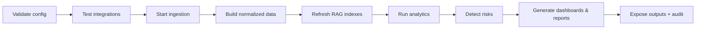

# Operations Guide

This guide is for on-prem operators of the Engineering Intelligence Platform (EIP) — primarily the Platform Administrator persona ("Deniz", see `../product/Personas.md`). It covers day-2 operations for both deployment forms: Docker Compose (pilot/demo, `/infra/docker-compose`) and Kubernetes/OpenShift (production, `/infra/kubernetes`). Architecture background is in `../architecture/ArchitectureOverview.md`; verification suites referenced here are defined in `../testing/TestingStrategy.md`; the rollout sequence that produced these components is in `../implementation/PhaseBasedImplementationPlan.md`.

## 1. Operational model overview

EIP is a modular monolith (single API app) plus separately deployable workers, with on-prem infrastructure services. Everything runs air-gapped; the only optional egress is to a configured LLM provider endpoint.

| Component | What it is | Failure blast radius | Runbook sections |
|---|---|---|---|
| `eip-app` (API) | Spring Boot composition root: REST `/api/v1`, dashboards backend, admin console | UI/API unavailable; ingestion and jobs continue | §2, §5, §8, §9 |
| `eip-workers` | Async worker runtime: sync engine, normalizers, analytics consumers, AI jobs, report jobs | Data freshness degrades; UI stays up | §4, §5, §7 |
| PostgreSQL 16 (+pgvector) | Primary store, canonical model, metrics, vectors; Flyway-managed | Total outage | §5, §7, §8 |
| Apache Kafka (KRaft) | Event backbone, topics prefixed `eip.` | Ingestion/analytics stall; API reads still work | §4, §5, §7 |
| Redis 7 | Cache, distributed locks (Redisson), rate-limit state | Slow dashboards, duplicate-work risk if locks lost | §4, §5 |
| MinIO (or enterprise S3) | Generated artifacts (`eip-artifacts`), ingested file blobs (`eip-ingest`) | Report exports and raw ingest staging fail | §5, §8 |
| Keycloak (or enterprise IdP) | OIDC authentication; local accounts fallback | Logins fail (local fallback for break-glass) | §5, §9 |
| OTel Collector + Prometheus/Grafana (+Tempo/Loki optional) | Self-observability | Blind operations — treat as production-critical | §4, §5 |
| LLM provider (Ollama/vLLM/other via SPI) | AI inference | AI features degrade; core analytics unaffected | §5, §9 |

Operator entry points: Admin Console (Connector Health, Sync Checkpoint browser, DLQ inspector, background job monitor, secret management, audit viewer) and the Grafana dashboards shipped in `/infra/grafana`.

### 1.1 Health endpoints and default ports (Compose reference)

| Component | Health check | Default port |
|---|---|---|
| `eip-app` | `GET /actuator/health` (liveness `/actuator/health/liveness`, readiness `/actuator/health/readiness`) | 8081 (management; app HTTP 8080, not host-published) |
| `eip-workers` | `GET /actuator/health` per worker instance | 8081 |
| Frontend | `GET /healthz` on the static server/ingress | 5173 (dev) / 80 |
| PostgreSQL | `pg_isready` | 5432 |
| Kafka | broker API versions probe (`kafka-broker-api-versions`) | 9092 |
| Redis | `redis-cli PING` | 6379 |
| MinIO | `GET /minio/health/ready` | 9000 (API) / 9001 (console) |
| Keycloak | `GET /health/ready` | 9000 (health/management; HTTP host port 8180) |
| OTel Collector | `GET :13133/` (health extension) | 4317 (OTLP) |
| Prometheus / Grafana | `/-/ready` / `GET /api/health` | 9090 / 3001 |

Kubernetes probes in `/infra/kubernetes` use exactly these endpoints; if you change a port in an overlay, change the probe with it.

### 1.2 Kafka topic reference

All topics carry the `eip.` prefix; DLQs are per consumer group (`<group>.dlq`). The families an operator watches: `eip.raw.<connector>` (one per connector, staging intake), `eip.domain.workitem`, `eip.domain.scm`, `eip.domain.cicd`, `eip.domain.quality`, `eip.domain.ops` (canonical domain events), `eip.analytics.metrics` (computed metrics), `eip.ai.jobs` / `eip.ai.results` (agent work), `eip.reports.jobs` (report scheduling). Ordering is per key (`tenantId:entityId`); delivery is at-least-once with idempotent consumers, which is why replay (§3.1) and re-sync (§3.2) are always safe.

## 2. Startup, shutdown, and the "Start" activation sequence

### 2.1 Process start order

1. PostgreSQL → 2. Redis → 3. Kafka → 4. MinIO → 5. Keycloak → 6. OTel Collector/Prometheus/Grafana → 7. `eip-app` (runs Flyway migrations, then serves) → 8. `eip-workers` (scale from 1, verify, then scale out) → 9. Frontend (static, any time after `eip-app`).

Shutdown is the reverse. `eip-workers` first (they drain in-flight sync batches and commit checkpoints on SIGTERM, grace 60 s), then `eip-app`, then infrastructure. Never stop PostgreSQL while workers run.

### 2.2 The "Start" activation sequence

Beyond process startup, EIP has a logical activation pipeline that runs when a tenant (or the whole installation) is started or re-activated. Each stage gates the next; failures halt with an audited, operator-visible reason.

| Stage | What happens | Operator verification |
|---|---|---|
| Validate config | Connector configs checked against JSON Schemas (`validate()`); secrets decrypt; LLM provider config parsed | Admin Console shows per-connector validation results |
| Test integrations | `testConnection()` per enabled connector; LLM provider ping; MCP server reachability | All connectors "connected" in Connector Health |
| Start ingestion | Full or incremental syncs scheduled; webhook intake armed; raw events to `eip.raw.<connector>` | Checkpoint browser advancing; consumer lag panels active |
| Build normalized data | Normalizers produce canonical entities and domain events (`eip.domain.*`) | Raw vs. canonical counts converge |
| Refresh RAG indexes | Chunking, embedding, vector upserts (pgvector/Qdrant), incremental re-index | RAG index freshness timestamp current |
| Run analytics | Metric engines compute the canonical metric set onto `eip.analytics.metrics` | Metric freshness panel green |
| Detect risks | Delivery Risk agent + risk scoring produce Risk entities | Risk views populated with explanations |
| Generate dashboards/reports | Dashboard caches warmed; scheduled report jobs (`eip.reports.jobs`) run | Artifact library receives outputs |
| Expose outputs + audit | Outputs visible per RBAC; every stage's actions in the audit log | Audit viewer shows the activation trail |

### 2.3 Pre-flight checklist (new installation)

Before first startup:

- [ ] Volumes provisioned and writable: Postgres data, Kafka data, MinIO data, backup target reachable
- [ ] Backup target resides in a **separate failure domain** from the primary deployment (second data center / off-site object store) — colocated backups void NFR-021/NFR-022 on site loss (§6.1)
- [ ] Secrets master key present at the configured KMS SPI source (env/file/Vault) and escrowed (§6.1)
- [ ] TLS certificates in place for ingress, Keycloak, and (if enabled) Kafka/MinIO TLS; expiry > 90 days
- [ ] Keycloak realm imported (or enterprise IdP client registered) with the EIP role/claim mapping
- [ ] Network policy verified: connectors can reach source tools; nothing else has egress; LLM endpoint reachable if configured
- [ ] NTP: all hosts within 60 s skew (OIDC token validation and event ordering both depend on it)
- [ ] Resource floor met: reference single-node sizing from `../infrastructure/DockerCompose.md` §10 (or K8s overlay requests) satisfied
- [ ] Enterprise network integration configured where required: egress proxy (`HTTPS_PROXY`/`NO_PROXY`) for connectors and the LLM SPI, custom CA bundle injected (see the enterprise network integration sections in `../infrastructure/DockerCompose.md` and `../infrastructure/KubernetesOpenShift.md`)
- [ ] Grafana dashboards and alert rules provisioned from `/infra/grafana`; a test alert routes to the operator channel

## 3. Routine operations

- **System health dashboard (daily):** Grafana "EIP Overview" — component up/down, consumer lag, error rates, freshness SLO panels, JVM health. Anything red maps to an alert runbook in §4.
- **Connector health monitor:** Admin Console → Connectors. States: `CONNECTED`, `DEGRADED` (retries/backoff active), `RATE_LIMITED`, `AUTH_FAILED`, `DISABLED`. Each shows last successful sync, checkpoint position, and error history.
- **Background job monitor:** AI jobs (`eip.ai.jobs`/`eip.ai.results`), report jobs, re-index jobs — queued/running/failed with retry controls.
- **Queue monitor:** per-topic depth and per-consumer-group lag for all `eip.*` topics; DLQ depth per group (`<group>.dlq`).
- **Cache monitor:** Redis hit rate (target > 80% warm), evictions, Redisson lock wait times.

### 3.1 DLQ replay procedure (step-by-step)

1. Admin Console → Queues → DLQ inspector; select the group's DLQ (e.g., `eip.analytics.flow-metrics.dlq`).
2. Inspect a sample: envelope (`eventId`, `tenantId`, `eventType`, `schemaVersion`) plus recorded error cause and stack hash.
3. Classify: (a) transient (dependency was down) → replay as-is; (b) poison (bad payload/schema mismatch) → fix root cause first; (c) bug → file issue, leave in DLQ.
4. For transient: select messages (or "all before timestamp") → **Replay**. Replay re-publishes to the source topic with the original `eventId`; idempotent consumers make replay safe.
5. For poison after a fix/upgrade: replay a single message first, confirm consumption, then replay the rest.
6. Verify DLQ depth returns to 0 and consumer lag normal; the replay action itself is audited.
7. Never delete DLQ messages without an issue reference; deletion requires `system:operate` and is audited.

DLQ topics have a **30-day retention**: undrained DLQ messages are permanently lost after it. The daily DLQ ageing report (§10) flags items older than 7 days — classify and drain (or explicitly decide and document) well before the 30-day deadline.

### 3.2 Sync recovery

- **Re-run a failed sync:** Connectors → connector → Runs → failed run → **Retry**. Resumes from the last committed checkpoint (per connector+stream checkpoint table).
- **Force full re-sync:** Connectors → connector → **Full re-sync**. Clears the checkpoint (not the data); idempotent upserts + dedup on `ExternalRef` mean no duplicates. Expect elevated load; prefer maintenance windows (§10) for large tools.
- **RAG re-index:** AI → RAG indexes → tenant → **Re-index** (incremental) or **Rebuild** (full: re-chunk, re-embed, swap index atomically). Rebuild after changing the embedding model — mandatory, old vectors are incompatible.

### 3.3 Rotating secrets (step-by-step)

1. Confirm the master key source (env/file/Vault via KMS SPI) is reachable: Admin Console → Secrets → key status.
2. For a connector credential: Secrets → entry → **Rotate** → enter the new value (old value retained, encrypted, until cutover confirmed).
3. Run `testConnection()` on affected connectors with the new credential (button in the rotation dialog).
4. **Confirm cutover**; the old value is destroyed and the rotation audited (who, when, which secret — never the value).
5. For the **master key**: generate the new key in the KMS/env; Admin Console → Secrets → **Re-encrypt all** (envelope re-encryption of DEKs, online, no downtime); verify count re-encrypted = total; then retire the old master key. Keep the old key available until re-encryption reports success.
6. Verify: no `AUTH_FAILED` connectors, no secret-related errors in logs, audit entries present.

#### Master-key compromise recovery

Distinct from routine rotation (step 5, which re-wraps existing DEKs under a new master key): re-wrapping is **cryptographically insufficient after a compromise** — an attacker holding the old master key plus ciphertext has already unwrapped the DEKs, so re-wrapping the same DEKs protects nothing. On suspected or confirmed master-key compromise (see also `../architecture/SecurityModel.md` §6):

1. Generate a new master key at the KMS/env source (as in step 5) — do **not** stop there.
2. Generate **fresh DEKs** and re-encrypt every stored secret under them: Admin Console → Secrets → **Compromise recovery: re-key all** (not "Re-encrypt all", which only re-wraps). Verify count re-keyed = total secrets in inventory.
3. Rotate **all downstream credentials** the old DEKs protected — connector credentials, webhook secrets, LLM provider keys, MCP service tokens — at their sources (steps 2–4 per credential; webhook secrets per §12). Until rotated, they must be treated as exposed.
4. Verify: re-key count matches the secret inventory; `testConnection()` green on all connectors; no `AUTH_FAILED`; audit events present for every step (new-key generation, re-key completion with counts, each downstream rotation).
5. Retire and destroy the compromised master key; update escrow (§6.1); handle as an S1 security incident per §13.1 with the audit trail preserved.

### 3.4 Tenant and user lifecycle

- **Adding a tenant:** Admin Console → Tenants → New (name, slug, quotas) → creates tenant row, RLS scope, Kafka key-space, MinIO prefix, default roles → assign a `TENANT_ADMIN` → run the §2.2 activation sequence for the tenant → verify with the tenant-isolation smoke (E7 in `../testing/TestingStrategy.md` §10).
- **User offboarding:** disable the user in Keycloak/IdP (blocks new tokens) → Admin Console → Users → revoke sessions and API tokens → reassign owned schedules/report subscriptions → audit query for the user's last-30-day actions if required by security → do **not** delete the Member entity (historical WorkItem attribution stays intact; the account is marked inactive).
- **Suspending a tenant:** Admin Console → Tenants → tenant → **Suspend** → logins, API tokens, connector syncs, schedules, and agent jobs for the tenant stop (in-flight jobs drain and commit checkpoints); data, RLS scope, and secrets stay intact. Suspension is audited and reversible — **Resume** re-runs the §2.2 activation sequence for the tenant.
- **Deleting / decommissioning a tenant:** suspend first, take a fresh backup (§6), then Admin Console → Tenants → **Decommission** (explicit confirmation + `system:operate`). Decommission purges the tenant's PostgreSQL RLS scope (canonical model, metrics, checkpoints), vector/RAG rows, and MinIO prefix; destroys the tenant's secrets; and lets the tenant's Kafka key-space age out via topic retention (no tenant-keyed messages remain after the retention window). The decommission itself and its completion report are recorded in the platform audit log.
- **Tenant data export and erasure:** tenant-scoped DSAR export and Member-level erasure/anonymization run as audited background jobs per FR-142 (`../product/PRD.md` §5.8). Erasure propagates across canonical PII columns, RAG chunks/embeddings for member-authored content where applicable, generated artifacts, and caches (the per-store erasure map in `../architecture/SecurityModel.md` §11). The audit log itself is **never mutated**: audit events carry only pseudonymous member references (`memberId`), never direct PII, so erasure hard-deletes or crypto-shreds the member-identity/PII mapping store — audit rows become irreversibly pseudonymous while the hash chain stays intact and verifiable. Verify completion in the background job monitor and the audit viewer before confirming the request as fulfilled.

## 4. Monitoring and alert response runbooks

The alert catalog — names, expression sketches, severities — is defined once in `../architecture/ObservabilityModel.md` §7 (the single source of record); rules ship in `/infra/kubernetes` (PrometheusRule) and `/infra/docker-compose` (rules file) and fire via Alertmanager. Every alert's `runbook` annotation points at one of the stable anchors below — the subsection headings are the anchor contract and must not be renamed. Diagnosis always starts from the alert's linked Grafana panel and correlated traces (Tempo) / logs (Loki) via `traceparent`.

#### API errors

`EipApiHighErrorRate` — 5xx ratio on `/api/v1` above 2% over 5 min. **Diagnose:** 5xx are 100%-trace-sampled — open failing traces; check recent deploys/config changes (audit viewer, last 24 h); co-firing `EipDbPoolSaturated` or `EipPostgresPrimaryDown`? **Remediate:** roll back the last release (§7 step 6) if correlated; fix the failing downstream dependency; scale `eip-app` (§5) only if saturation-driven.

#### API latency

`EipApiLatencySloBurn` (dashboard routes) / `EipApiNonAnalyticalLatencySloBurn` (non-analytical routes, NFR-011). **Diagnose:** top slow routes panel; DB query latency and pool waits; cache hit ratio (co-firing `EipCacheHitRatioLow`?); sync running (see T5)? **Remediate:** per T5 (§9); scale `eip-app`; restore cache; move heavy syncs to maintenance windows (§10).

#### Connector down

`EipConnectorDown` — `eip_connector_health == 0` > 15 min (critical at 2 h); connector in `DEGRADED`/`AUTH_FAILED`/`RATE_LIMITED`. **Diagnose:** connector error history; upstream tool status; token expiry. **Remediate:** rotate credential (§3.3), fix network, or lower sync frequency; upstream outage: wait — backoff handles it.

#### Sync stuck

`EipConnectorCheckpointStuck` — checkpoint age > 4× expected sync interval. **Diagnose:** per T2 (§9): run state vs. checkpoint advance, rate limiting, lock contention, poison source record. **Remediate:** retry from checkpoint (§3.2); worker thread dump via diagnostics; skip-window for poison records.

#### Ingestion freshness

`EipIngestionFreshnessSloBurn` — `eip_canonical_visibility_lag_seconds` p95 beyond the NFR-012 budget. **Diagnose:** which stage lags — connector runs, `eip.raw.*` lag, normalizer lag, analytics lag. **Remediate:** address the lagging stage: connector (§3.2), consumers (scale, §5), or DLQ backlog (§3.1).

#### Consumer lag

`EipKafkaConsumerLagGrowing` — lag above threshold and still growing at max HPA replicas. **Diagnose:** queue monitor: which group/topic; worker CPU/GC; error rate on the consumer. **Remediate:** scale workers (§5); if errors, check DLQ (§3.1); if after a big sync, allow drain and raise the threshold temporarily. Inhibited by `EipKafkaBrokerDown` (root cause first).

#### DLQ drain

`EipDlqNonEmpty` — the single DLQ alerting contract: `increase(eip_kafka_dlq_messages_total[10m]) > 0` warns, > 100/h pages (EventModel §10 uses this same metric and threshold set). **Diagnose:** DLQ inspector: which group (`<group>.dlq`); sample messages for error cause and stack hash; co-firing `EipKafkaConsumerLagGrowing`? **Remediate:** classify and replay per §3.1; poison messages need the root-cause fix before replay; never delete without an issue reference. Remember the 30-day DLQ retention (§3.1) — parked messages do not wait forever.

#### Schema drift

`EipNormalizationFailuresSpike` — normalization failure ratio > 5% per connector. **Diagnose:** which connector/entityType/reason; source tool upgraded recently? **Remediate:** check connector compatibility notes; apply connector update; replay affected DLQ messages after the fix (§3.1).

#### LLM provider

`EipLlmProviderErrors` — LLM SPI `error|timeout` ratio > 10% per provider. **Diagnose:** provider health endpoint; token budget exhaustion; model loaded (Ollama/vLLM)? VRAM/OOM on the inference host? **Remediate:** restart/redeploy provider; switch tenant routing to fallback model; AI degrades gracefully — core analytics unaffected (S3, §13.1).

#### LLM cost

`EipLlmCostAnomaly` — hourly cost estimate above tenant policy threshold. **Diagnose:** which tenant/model/agent (AI/LLM dashboard); runaway agent retries or unusually large contexts? **Remediate:** apply/lower tenant budgets and quotas; route the tenant to a local model; pause the offending agent schedule pending review.

#### Agent quality

`EipAgentValidationFailures` — `validation_failed` ratio > 20% per agent. **Diagnose:** Validation Agent findings in job detail (fabricated citation, numeric mismatch); recent model or routing change? **Remediate:** route back to a known-good model; file as regression with the audit record attached; artifacts stay quarantined, never force-published (§12).

#### Report failures

`EipReportSuccessSloBurn` — report success ratio below 99% over 6 h. **Diagnose:** job monitor: failing template/agent; artifact storage reachable; LLM alert co-firing? **Remediate:** fix template or dependency; re-run failed jobs from job monitor; check MinIO if export-stage failures (see #object-storage-down).

#### DB pool

`EipDbPoolSaturated` — Hikari pool > 90% for 10 min on app or workers. **Diagnose:** pg activity: long transactions; lock waits; recent deploy. **Remediate:** kill runaway queries; raise pool/DB `max_connections` deliberately; check for missing pagination in a new endpoint.

#### PG replication

`EipPostgresReplicationLag` — replica lag > 30 s. **Diagnose:** WAL rate spike (backfill/recompute running?); replica I/O or network; operator events. **Remediate:** throttle batch/backfill work; verify replica health (CNPG status); rebuild the replica if persistently diverged.

#### PG primary down

`EipPostgresPrimaryDown` — primary absent or failover in progress. **Diagnose:** operator status/events (CloudNativePG on K8s); readiness sheds app traffic by design (no restarts). **Remediate:** verify automated promotion completes (~30–60 s, `../architecture/DeploymentModel.md` §9); if promotion is stuck, follow the operator's failover runbook; treat as S1 (§13.1) if no replica can be promoted — then restore per §6.2. Inhibits `EipDbPoolSaturated` and `EipPostgresReplicationLag`.

#### Kafka broker down

`EipKafkaBrokerDown` — broker count below expected; full-outage form (`absent(up{job="kafka"})`) inhibits `EipKafkaConsumerLagGrowing`, `EipDlqNonEmpty`, `EipOutboxRelayStalled`. **Diagnose:** broker pod/host state; disk pressure co-firing? ISR status. **Remediate:** restart/recover the broker (Strimzi reconciles on K8s); wait for ISR to rejoin before any partition changes; producers (`acks=all`) and the outbox/webhook buffers absorb the outage — verify drain afterwards (#outbox-stalled, #webhook-buffer).

#### Kafka URP

`EipKafkaUnderReplicatedPartitions` — under-replicated partitions > 0 for 10 min. **Diagnose:** broker down or slow (co-firing `EipKafkaBrokerDown`/`EipDiskPressure`?); network partitions. **Remediate:** restore the lagging broker; wait for ISR ≥ `min.insync.replicas`; never trigger partition reassignment during recovery.

#### Disk pressure

`EipDiskPressure` — Postgres, Kafka, or MinIO volume > 80%. **Diagnose:** which volume; Kafka retention vs. topic growth; Postgres partition sizes; MinIO artifact growth. **Remediate:** run housekeeping (§10); extend volume; verify retention configs applied. A disk-pressure root cause often fires several downstream alerts — fix it first.

#### Redis down

`EipRedisDown` — cache/locks unavailable (Redis is fail-open: degraded, not down). **Diagnose:** Redis memory, evictions, connectivity; Redisson lock wait times. **Remediate:** restart Redis (state is reconstructable); investigate lock holders via Redisson metrics; scale Redis memory. Expect slower dashboards and duplicate-work risk until locks recover.

#### Object storage down

`EipObjectStorageDown` — MinIO/S3 unreachable or nodes offline. **Diagnose:** MinIO node/quorum state, disk health, network; erasure-coding parity margin. **Remediate:** restore node/quorum; report exports and raw-blob staging fail meanwhile — affected jobs retry; verify bucket replication resumes (§6.1).

#### OIDC probe

`EipOidcProbeFailing` — issuer/JWKS unreachable; new logins will fail (existing tokens remain valid until expiry). **Diagnose:** per T4 (§9): Keycloak/IdP up, certificate validity, clock skew. **Remediate:** restart/recover the IdP; renew certificates (#cert-expiry); break-glass local account for urgent access (T4).

#### Cert expiry

`EipCertExpirySoon` — a TLS certificate (ingress, Keycloak, Kafka, MinIO) expires < 21 days. **Diagnose:** which endpoint; cert-manager/operator-managed (K8s) or manual (Compose/BYO)? **Remediate:** renew/rotate the cert; rolling restart affected component; verify with `openssl s_client`.

#### Cache

`EipCacheHitRatioLow` — hit ratio < 0.5 on a hot cache for 30 min. **Diagnose:** cold cache after restart (self-heals) vs. evictions (memory pressure) vs. key-pattern regression after deploy. **Remediate:** per T5 (§9); raise Redis memory; investigate changed cache keys.

#### Scheduled jobs

`EipScheduledJobFailed` — a critical scheduled job (`backup`, `audit-verify`, `retention-purge`, re-index) failed. **Diagnose:** job monitor error detail; dependency health (DB, MinIO, embedding provider for re-index). **Remediate:** fix the dependency and re-run from the job monitor; failed backups are S2 until a subsequent run succeeds; a stale RAG index is re-run per §3.2 (full rebuild if the embedding model changed).

#### Audit tamper

`EipAuditChainMismatch` — the audit-verify job detected a hash-chain break. **Security-critical (S1):** preserve evidence, do not touch audit partitions, escalate per §13.1; correlate with `traceId` into access logs; audit archives in MinIO carry tamper-evident hashes for cross-checking (§10).

#### Audit pipeline

`EipAuditSilence` — no audit events written while API traffic flows: the audit path is broken. **Diagnose:** DB health; audit table partition full; errors in the audit writer. **Remediate:** treat as security-critical (S1): fix immediately; EIP fails closed on audit-required actions, so user-visible failures may co-occur.

#### Webhook spoofing

`EipWebhookSignatureFailures` — invalid-signature rate > 10/min on webhook intake. **Diagnose:** signature/secret mismatch vs. actual spoofing attempt (source IPs); payload schema drift after a tool upgrade. **Remediate:** rotate the webhook secret on both sides (§12); if tool upgraded, check connector compatibility notes; polling covers the intake gap meanwhile; persistent unexplained spoofing escalates to security.

#### Webhook buffer

`EipWebhookBufferGrowing` — `staging.webhook_intake_buffer` depth growing: Kafka is unreachable from the intake path (this buffer is the outage-detection signal there). **Diagnose:** co-firing `EipKafkaBrokerDown`? Buffer depth vs. its configured bound. **Remediate:** restore Kafka (#kafka-broker-down); the buffer drains automatically after recovery — verify depth returns to 0; at the bound, intake returns 503 and sources retry / polling covers the gap.

#### Outbox stalled

`EipOutboxRelayStalled` — `eip_outbox_lag_seconds` > 60 s: domain/analytics/job events are not being published. **Diagnose:** which runtime's relay lags (label `deployable` — the relay runs in both `eip-app` and `eip-workers`, each relaying its own writes); DB and Kafka health. **Remediate:** restart the affected runtime; verify outbox backlog drains; sustained backlog triggers ingestion backpressure by design (EventModel §11) — clear the cause rather than raising bounds.

#### Crashloop

`EipPodCrashLooping` — a deployable restarts > 3 times in 15 min. **Diagnose:** container logs and last state (OOMKilled?); config/secret errors at startup; schema-version gate failing readiness (deployed ahead of its migrations job — `../infrastructure/KubernetesOpenShift.md` §13). **Remediate:** fix config; run the pending migrations job; roll back the image (§7 step 6); raise memory limits only with evidence.

## 5. Capacity management

Growth indicators to watch monthly (Grafana "Capacity" dashboard): events/hour trend vs. the 100k/hour reference target, p95 metric query latency vs. 500 ms, consumer lag recovery time after nightly syncs, Postgres size growth per tenant, vector row counts, artifact storage growth, Redis memory, Kafka partition skew.

Scale-up triggers and actions:

- **Workers:** sustained consumer lag with healthy consumers → add `eip-workers` replicas (stateless; Redisson locks and consumer-group rebalancing handle coordination). Scale per workload class (sync vs. analytics vs. AI) using worker role flags.
- **Kafka partitions:** a single partition pegged while others idle, or worker count = partition count → raise partitions on the hot `eip.*` topic (ordering per `tenantId:entityId` key is preserved; plan during a maintenance window).
- **PostgreSQL:** p95 queries degrading with CPU/IO headroom exhausted → vertical scale first; add read replica for dashboard-heavy installs (Phase 5 HA overlay); consider Qdrant (VectorStore SPI) when pgvector query latency dominates.
- **API:** `eip-app` replicas scale horizontally behind the ingress; session state lives in tokens/Redis, none in the JVM.

## 6. Backup and restore

### 6.1 What to back up

| Asset | Method | Frequency |
|---|---|---|
| PostgreSQL (all schemas incl. vectors, checkpoints, audit) | WAL archiving + base backups via pgBackRest (production, Compose and K8s alike); `pg_dump` logical only for demo/eval installs | Continuous WAL + nightly base (production); nightly dump acceptable for demo/eval only — RPO explicitly relaxed to 24 h |
| MinIO buckets (`eip-artifacts`, `eip-ingest`) | Continuous replication: `mc mirror --watch` (single-node) / multi-AZ replication (K8s); storage-level snapshot as backstop | Continuous (production); nightly mirror acceptable for demo/eval only |
| Kafka topic configs (not payloads) | Export topic list/configs/ACLs via script `scripts/backup-kafka-config` | On change + weekly |
| Keycloak realm | `kc.sh export` realm JSON (or IdP-side backup for enterprise IdP) | On change + weekly |
| Secrets master key | Escrow per KMS policy: sealed offline copy, dual control. **Losing the master key makes all secrets unrecoverable** — key escrow is verified quarterly |
| Config (Compose files / Kustomize overlays, `/infra`) | Git — the deployment repo is the backup | Every change |

Kafka message payloads are deliberately not backed up: canonical state lives in Postgres, and raw data can be re-synced from source tools; topics are recreated from config and repopulated.

**Failure-domain requirement (binding):** all backup targets — PostgreSQL base backups + WAL archive, the MinIO mirror target, and the config/master-key escrow — MUST reside in a **separate failure domain** from the primary deployment: a second data center or an off-site object store. A backup on the same storage array, cluster, or site as the primary provides no recovery point when the site is lost — **colocated backups void NFR-021/NFR-022 in a site-loss scenario**. "Backup target reachable" (§2.3) is necessary but not sufficient; verify separation as part of the pre-flight checklist and re-verify at the quarterly drill.

### 6.2 Restore procedure

1. Provision infrastructure from `/infra` (Compose or Kustomize).
2. Restore the secrets master key from escrow first.
3. Restore PostgreSQL (PITR to target time via WAL, or latest dump).
4. Restore MinIO buckets; recreate Kafka topics from config backup; import Keycloak realm.
5. Start components in §2.1 order; `eip-app` verifies Flyway history matches binaries.
6. Run the activation sequence (§2.2); connectors resume from restored checkpoints — incremental syncs backfill the gap between backup time and now from source tools.
7. Verify: E2E smoke (E1, E3, E7 from `../testing/TestingStrategy.md` §10), audit log continuity, artifact library spot check.

### 6.3 Objectives and tested-restore policy

- **RPO:** ≤ 15 minutes for production deployments (NFR-021): PostgreSQL via WAL archiving/streaming, object storage via continuous replication (`mc mirror --watch` single-node, multi-AZ replication on K8s). Demo/eval installs may explicitly relax to 24 h (nightly dump/mirror) — document the relaxation. Connector re-sync closes any raw-data gap, so effective analytical RPO after re-sync approaches zero.
- **RTO:** ≤ 30 minutes on HA Kubernetes/OpenShift (component/AZ failover, NFR-022); ≤ 4 hours on single-node deployments (Compose or single-replica K8s — restore from backup). A full-platform rebuild-from-backup on an HA deployment is a separate scenario, also ≤ 4 hours; do not conflate it with the failover RTO.
- **Tested-restore policy:** a full restore drill into a scratch environment runs **quarterly**, timed against the ≤ 4 h restore RTO, with the §6.2 verification checklist; results are recorded in the operations log. The drill MUST restore from the **off-site copy** (the separate-failure-domain target of §6.1), not from any local replica or same-site snapshot — a restore that never crossed the failure-domain boundary proves nothing about site loss. A backup that has not been restore-tested is treated as nonexistent.
- **HA-failover drill (distinct from the restore drill):** on HA deployments, a failover drill runs **quarterly**, timed against the ≤ 30 min failover RTO — kill a node/replica of each stateful component (Postgres primary, one Kafka broker, one app/worker replica) under load and verify recovery with zero acknowledged-event loss. Failover exercises redundancy; restore exercises backups — both must pass.

## 7. Upgrade procedure

1. **Read the release notes**: breaking changes, new required config, Flyway migration list, connector compatibility notes, event `schemaVersion` changes.
2. **Backup** per §6 (fresh base backup + realm/config exports) immediately before upgrading.
3. **Migrate:** deploy the new `eip-app` image to one instance (or run `flywayMigrate` job on K8s); Flyway applies forward-only migrations. Migrations are backward-compatible for one minor version, enabling rolling upgrade.
4. **Rolling restart — canonical order:** migrations job → `eip-app` → workers (ingestion, analytics, ai, reports) → frontend (identical to `../architecture/DeploymentModel.md` §8 and `../infrastructure/KubernetesOpenShift.md` §13). With migrations applied in step 3, update the remaining `eip-app` replicas, then the `eip-workers` profiles (they tolerate both schema versions), then frontend assets.
5. **Verification checklist:**
   - [ ] `/actuator/health` green on all instances; version endpoint shows target version
   - [ ] Flyway history clean, no pending migrations
   - [ ] Connector Health all green; one incremental sync completes per critical connector
   - [ ] Consumer lag drains to baseline; DLQs not growing
   - [ ] Dashboards render; one report job completes; one RAG query answers with citations
   - [ ] Audit log receiving events; no new ERROR-level log signatures
6. **Rollback:** redeploy previous images (schema is one-version backward compatible). If a migration must be undone, restore Postgres from the pre-upgrade backup and re-sync the delta from connectors (§6.2 step 6). Never hand-edit `flyway_schema_history`.

Upgrades that change the embedding model additionally require a RAG full rebuild (§3.2). Air-gapped installs import images via the offline bundle produced by `scripts/package-offline-release`.

## 8. Log management

- **Format/locations:** structured JSON to stdout everywhere. Compose: `docker compose logs` + local json-file driver with rotation (max-size 100 MB, max-file 5). Kubernetes: stdout → node agent → Loki (optional but recommended). Every line carries `tenantId` (where applicable), `traceparent`, logger, level.
- **Levels:** default INFO; connector HTTP wire logging OFF by default (secrets-adjacent); audit events are data, not logs — they go to the audit store regardless of log level.
- **Changing at runtime:** Admin Console → System → Log levels (per logger, per instance), or `POST /actuator/loggers/{logger}` with `system:operate`. Runtime changes revert on restart; persist via config for durable changes. Level changes are audited.
- **Retention:** Loki 30 days default (operator-configurable); audit store retention is a compliance setting (default **25 months, minimum** — configurable upward only; `../architecture/SecurityModel.md` §7 is the governing retention source of record) with archival to MinIO (§10). Do not rely on container logs for anything compliance-relevant — that is the audit store's job.

## 9. Troubleshooting decision trees

**T1 — No data on dashboard**
1. Is the tenant activated (§2.2 all stages green)? → run/resume activation.
2. Connector Health green? No → §3.2 / alert `EipConnectorDown`.
3. Checkpoints advancing but dashboard empty? → check normalizer lag and `eip.domain.*` consumer lag → scale/DLQ (§3.1).
4. Canonical data present (Admin → Data browser) but metrics empty? → analytics consumers: job monitor + `eip.analytics.metrics` lag → re-run metric computation for the window.
5. Metrics present but UI empty? → RBAC scope of the viewing user; then browser console/API errors; then Redis cache flush for the dashboard key.

**T2 — Sync stuck**
1. Run state `RUNNING` with advancing checkpoint? → it's slow, not stuck: check rate limiting (`RATE_LIMITED` state) and upstream latency; leave it.
2. Checkpoint frozen > 30 min? → worker thread dump via Admin Console diagnostics; look for lock contention (Redisson panel).
3. Repeated retries in error history? → classify the error: auth (rotate secret §3.3), schema drift after upstream upgrade (check compatibility notes), network.
4. Worker crashed mid-sync? → restart resumes from checkpoint by design; if it re-crashes at the same spot, capture support bundle (§11) — likely a poison source record; skip-window feature marks the record and continues, with a data-quality flag.

**T3 — AI outputs failing**
1. `EipLlmProviderErrors` alert active? → provider first (§4 #llm-provider): reachable, model loaded, VRAM/OOM on the inference host.
2. Provider healthy, jobs failing? → job monitor error class: schema-validation failures (agent output malformed → often a model change; route tenant to a known-good model), token budget exceeded (raise budget or reduce context), retrieval empty (RAG index stale → re-index §3.2).
3. Outputs generate but are flagged? → Validation Agent findings in the job detail: fabricated citation / numeric mismatch → treat as regression, file with the audit record attached; the artifact stays quarantined, not published.
4. Only one tenant affected? → per-tenant model routing config and per-tenant budgets.

**T4 — Login issues**
1. All users? → Keycloak/IdP up (`EipOidcProbeFailing`)? Cert valid (§4 `EipCertExpirySoon`)? Clock skew between IdP and app > 60 s?
2. New users only? → realm role/group mapping to EIP roles; tenant claim present in token (inspect with the Admin Console token debugger).
3. One user? → account disabled/offboarded (§3.4), locked in IdP, or missing tenant membership.
4. IdP outage, urgent access needed? → break-glass local account (`PLATFORM_ADMIN` only, audited, auto-expiring password).

**T5 — Slow dashboards**
1. Redis hit rate dropped? → cache monitor; cold cache after restart warms itself; evictions → raise memory.
2. p95 metric query latency high (alert)? → Postgres: long queries, missing partition pruning, vacuum backlog; check the Capacity dashboard (§5).
3. Only during syncs? → known contention: verify interactive degradation < 20% (perf target); otherwise lower sync parallelism or move full syncs to maintenance windows.
4. Only one dashboard? → its query plan changed with data shape; capture the slow query from traces and file with the support bundle.

**T6 — Suspected tenant-isolation / RLS misconfiguration**
1. Treat as **S1** (§13.1) and fail closed: suspend the affected tenant(s) (§3.4) or stop `eip-app`/`eip-workers` — do not keep serving while investigating; escalate per §13 step 5.
2. Probe: in a scoped session run `SET LOCAL app.tenant_id = '<tenant-A>'` and query a tenant-owned table for Tenant B rows — any row returned confirms the misconfiguration (record the probe output as evidence).
3. Check recent changes: migrations touching RLS policies (the RLS-after-migration suite in `../testing/TestingStrategy.md` §3.1 should have caught these), connection-pooler changes (PgBouncer must run in transaction pooling mode — `SET LOCAL` is transaction-scoped), and new endpoints or maintenance jobs bypassing the tenancy context.
4. Before re-enabling, re-run the CI tenant-isolation suite against the environment: RLS repository probes (`../testing/TestingStrategy.md` §3), API cross-tenant probes (§12 checklist), and E7.
5. Preserve the audit chain and probe evidence; the security incident process applies regardless of confirmed data exposure.

## 10. Maintenance windows and housekeeping

Preferred window: weekly, low-usage hours, announced in-app. Kafka partition changes, large full re-syncs, embedding rebuilds, and Postgres major-version work go here; everything else in this guide is online.

Automatic housekeeping jobs (visible in the background job monitor, schedules configurable):

| Job | Default schedule | Action |
|---|---|---|
| Partition pruning | Nightly | Drop expired Postgres time partitions (raw staging, metrics history) per retention config |
| Artifact retention | Nightly | Delete generated artifacts past retention (default 24 months, per the retention source of record `../architecture/SecurityModel.md` §7 / `../architecture/DataFlow.md` §9) unless pinned; MinIO lifecycle rules as backstop |
| Audit archival | Monthly | Move audit records past hot retention to compressed archives in MinIO (tamper-evident hashes), keep index — total retention ≥ 25 months (§8) |
| Raw staging cleanup | Weekly | Purge `raw_*` rows already normalized and past the reprocessing window (default 90 days per NFR-070 — this window is the re-normalization safety net; do not shorten it casually) |
| Checkpoint compaction | Weekly | Compact checkpoint history, keep last N per connector+stream |
| Vector index maintenance | Weekly | pgvector index reindex/analyze; orphan chunk cleanup |
| DLQ ageing report | Daily | Summarize DLQ items > 7 days into an operator notification |

DLQ topic retention is **30 days**: undrained DLQ messages are permanently lost after it (§3.1). Retention defaults above are governed by `../architecture/SecurityModel.md` §7; tenant policy may raise them, never silently lower them below the stated defaults.

## 11. Support bundle generation

For escalations, generate a support bundle: Admin Console → System → **Generate support bundle**, or `scripts/support-bundle` (works even when the UI is down). It collects, sanitized (secrets masked, payload bodies excluded by default):

- Version/build info, active config (redacted), enabled feature flags
- Component health snapshots, thread dumps and heap histograms from app/workers
- Last 4 h of logs per component; ERROR-signature summary for 7 days
- Connector states, checkpoint positions, last 20 run summaries per connector
- Queue/DLQ depths and consumer lag snapshot; Kafka topic configs
- Flyway history; Postgres stat snapshots (`pg_stat_statements` top 50, table/index sizes)
- Prometheus snapshot of EIP metrics (last 24 h); recent alert history
- AI job failure summaries with prompt-redaction policy applied (no prompt bodies unless the operator explicitly opts in per policy)

The bundle is written to MinIO under an operator-only prefix and its generation is audited. Review the manifest before sharing outside the security boundary.

## 12. Security operations routine

Recurring security tasks for the operator (complementing the security testing gates in `../testing/TestingStrategy.md` §12):

| Task | Cadence | Procedure |
|---|---|---|
| Audit log review | Weekly | Audit viewer saved queries: failed logins, permission denials, secret accesses, `system:operate` actions, MCP capability calls; anomalies filed to security |
| Connector credential rotation | Per org policy (≤ 180 days recommended) | §3.3 per credential; track due dates in the Secrets screen's rotation-age column |
| Master key rotation (routine) | Annually | §3.3 step 5 (online re-wrap of DEKs under the new master key); update escrow |
| Master key compromise recovery | On suspicion or confirmation of compromise | §3.3 **Master-key compromise recovery**: fresh DEKs + re-encrypt all secrets + rotate all downstream credentials — never the routine step 5 re-wrap alone |
| Access review | Quarterly | Export role assignments per tenant; tenant admins confirm; stale accounts offboarded (§3.4) |
| CVE watch (air-gapped) | Per release import | Review the release's bundled scan report (Trivy + dependency scan results ship inside the offline bundle) before applying §7 |
| Break-glass account check | Quarterly | Verify the local fallback account is disabled, password sealed, last-use audit empty |
| LLM audit sampling | Monthly | Sample LLM call audit records: redaction policy applied, no cross-tenant references in retrieval sets, budgets respected |
| Webhook secret rotation | With connector credential rotation | Rotate on both sides; verify intake with a test delivery |

Prompt-injection posture: operators do not tune this at runtime — mitigations are built in and regression-tested. If an artifact is quarantined by the Validation Agent with an injection-suspect finding, preserve the artifact and its audit chain and escalate; do not force-publish.

## 13. On-call quick reference

**First five minutes for any page:**

1. Open Grafana "EIP Overview" — which layer is unhealthy (app, workers, Kafka, DB, IdP, LLM)?
2. Check for co-firing alerts (§4) — an `EipDiskPressure` root cause often fires three downstream alerts, and full-outage alerts (`EipKafkaBrokerDown`, `EipPostgresPrimaryDown`) inhibit their downstream symptoms by design.
3. Check recent changes: upgrades (§7), config edits, secret rotations (audit viewer, last 24 h).
4. Match the symptom to a decision tree (§9) or alert runbook (§4).
5. If data-integrity or security-related (`EipAuditSilence`, `EipAuditChainMismatch`, suspected cross-tenant access), escalate immediately per §13.1 — do not experiment.

### 13.1 Severity classification

| Severity | Definition | Examples | Response |
|---|---|---|---|
| S1 | Platform down or security/data-integrity incident | DB down, audit failing, suspected tenant leakage | Page immediately; incident channel; fix before anything else |
| S2 | Major function degraded, no workaround | All connectors failing, logins down (IdP), report pipeline dead | Respond < 1 h; workaround or fix same day |
| S3 | Partial degradation with workaround | One connector degraded, AI features down (analytics fine), slow dashboards | Next business day; runbook-driven |
| S4 | Cosmetic / single-tenant nuisance | One dashboard panel stale, one scheduled report late | Backlog; batch with maintenance window (§10) |

AI-feature outages are S3 by design: the platform degrades gracefully to non-AI operation (§4 `EipLlmProviderErrors`).

## 14. Command-line quick reference

For UI-down situations; all commands assume the Compose deployment (translate to `kubectl exec` for K8s):

| Need | Command |
|---|---|
| Overall app health | `docker compose exec eip-app curl -fsS localhost:8081/actuator/health` (eip-app is not host-published; management port 8081) |
| Change a log level at runtime | `docker compose exec eip-app curl -fsS -X POST localhost:8081/actuator/loggers/com.eip.ingestion -H 'Content-Type: application/json' -d '{"configuredLevel":"DEBUG"}'` |
| Consumer lag snapshot | `docker compose exec kafka kafka-consumer-groups --bootstrap-server localhost:9092 --describe --all-groups` |
| DLQ depth for a group | `docker compose exec kafka kafka-run-class kafka.tools.GetOffsetShell --topic eip.analytics.flow-metrics.dlq ...` (or DLQ inspector API `GET /api/v1/dlq/groups`) |
| Postgres activity | `psql -c "select pid, state, wait_event, query from pg_stat_activity where state <> 'idle'"` |
| Redis health | `redis-cli PING && redis-cli INFO memory | head` |
| MinIO bucket sizes | `mc du eip/eip-artifacts eip/eip-ingest` |
| Trigger support bundle headlessly | `scripts/support-bundle --output /backups/bundles` |
| Backup Kafka config | `scripts/backup-kafka-config` |
| Export Keycloak realm | `kc.sh export --realm eip --file /backups/realm-eip.json` |

All mutating admin APIs require `system:operate` and are audited; the CLI paths above go through the same authorization as the UI.

## 15. Operational readiness checklist

An EIP installation is production-ready when every item holds. Re-verify after major upgrades and annually:

- [ ] Pre-flight checklist (§2.3) completed and archived
- [ ] Activation sequence (§2.2) runs green for every production tenant
- [ ] All alert rules from the `../architecture/ObservabilityModel.md` §7 catalog provisioned, routed to a monitored channel, and test-fired once; every runbook anchor in §4 resolves
- [ ] Backup jobs running on schedule (§6.1) and the most recent quarterly restore drill — plus, on HA deployments, the failover drill — passed within the applicable RTO (§6.3)
- [ ] Secrets master key escrowed under dual control; rotation rehearsed (§3.3)
- [ ] On-call rotation staffed with access to this guide, the Admin Console, Grafana, and the break-glass procedure (§9 T4)
- [ ] Support bundle generation (§11) tested from both the UI and the headless script
- [ ] Housekeeping jobs (§10) enabled with retention values matching the organization's compliance policy
- [ ] Upgrade procedure (§7) rehearsed once on a staging copy, including rollback
- [ ] Security operations routine (§12) scheduled with named owners

Operators inheriting an existing installation should start with §1 (component map), then run this checklist as an audit.
