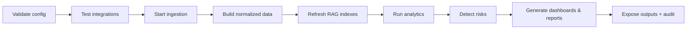

# Operations Guide

This guide is for on-prem operators of the Engineering Intelligence Platform (EIP) — primarily the Platform Administrator persona ("Deniz", see `../product/Personas.md`). It covers day-2 operations for both deployment forms: Docker Compose (pilot/demo, `/infra/docker-compose`) and Kubernetes/OpenShift (production, `/infra/kubernetes`). Architecture background is in `../architecture/ArchitectureOverview.md`; verification suites referenced here are defined in `../testing/TestingStrategy.md`; the rollout sequence that produced these components is in `../implementation/PhaseBasedImplementationPlan.md`.

## 1. Operational model overview

EIP is a modular monolith (single API app) plus separately deployable workers, with on-prem infrastructure services. Everything runs air-gapped; the only optional egress is to a configured LLM provider endpoint.

| Component | What it is | Failure blast radius | Runbook sections |
|---|---|---|---|
| `eip-app` (API) | Spring Boot composition root: REST `/api/v1`, dashboards backend, admin console | UI/API unavailable; ingestion and jobs continue | §2, §5, §8, §9 |
| `eip-workers` | Async worker runtime: sync engine, normalizers, analytics consumers, AI jobs, report jobs | Data freshness degrades; UI stays up | §4, §5, §7 |
| PostgreSQL 16 (+pgvector) | Primary store, canonical model, metrics, vectors; Flyway-managed | Total outage | §5, §7, §8 |
| Apache Kafka (KRaft) | Event backbone, topics prefixed `eip.` | Ingestion/analytics stall; API reads still work | §4, §5, §7 |
| Redis 7 | Cache, distributed locks (Redisson), rate-limit state | Slow dashboards, duplicate-work risk if locks lost | §4, §5 |
| MinIO (or enterprise S3) | Generated artifacts, ingested file blobs | Report exports and raw blob staging fail | §5, §8 |
| Keycloak (or enterprise IdP) | OIDC authentication; local accounts fallback | Logins fail (local fallback for break-glass) | §5, §9 |
| OTel Collector + Prometheus/Grafana (+Tempo/Loki optional) | Self-observability | Blind operations — treat as production-critical | §4, §5 |
| LLM provider (Ollama/vLLM/other via SPI) | AI inference | AI features degrade; core analytics unaffected | §5, §9 |

Operator entry points: Admin Console (Connector Health, Sync Checkpoint browser, DLQ inspector, background job monitor, secret management, audit viewer) and the Grafana dashboards shipped in `/infra/grafana`.

### 1.1 Health endpoints and default ports (Compose reference)

| Component | Health check | Default port |
|---|---|---|
| `eip-app` | `GET /actuator/health` (liveness `/actuator/health/liveness`, readiness `/actuator/health/readiness`) | 8080 |
| `eip-workers` | `GET /actuator/health` per worker instance | 8081 |
| Frontend | `GET /healthz` on the static server/ingress | 5173 (dev) / 80 |
| PostgreSQL | `pg_isready` | 5432 |
| Kafka | broker API versions probe (`kafka-broker-api-versions`) | 9092 |
| Redis | `redis-cli PING` | 6379 |
| MinIO | `GET /minio/health/ready` | 9000 (API) / 9001 (console) |
| Keycloak | `GET /health/ready` | 8443 |
| OTel Collector | `GET :13133/` (health extension) | 4317 (OTLP) |
| Prometheus / Grafana | `/-/ready` / `GET /api/health` | 9090 / 3000 |

Kubernetes probes in `/infra/kubernetes` use exactly these endpoints; if you change a port in an overlay, change the probe with it.

### 1.2 Kafka topic reference

All topics carry the `eip.` prefix; DLQs are per consumer group (`.<group>.dlq`). The families an operator watches: `eip.raw.<connector>` (one per connector, staging intake), `eip.domain.workitem`, `eip.domain.scm`, `eip.domain.cicd`, `eip.domain.quality`, `eip.domain.ops` (canonical domain events), `eip.analytics.metrics` (computed metrics), `eip.ai.jobs` / `eip.ai.results` (agent work), `eip.reports.jobs` (report scheduling). Ordering is per key (`tenantId+entityId`); delivery is at-least-once with idempotent consumers, which is why replay (§3.1) and re-sync (§3.2) are always safe.

## 2. Startup, shutdown, and the "Start" activation sequence

### 2.1 Process start order

1. PostgreSQL → 2. Redis → 3. Kafka → 4. MinIO → 5. Keycloak → 6. OTel Collector/Prometheus/Grafana → 7. `eip-app` (runs Flyway migrations, then serves) → 8. `eip-workers` (scale from 1, verify, then scale out) → 9. Frontend (static, any time after `eip-app`).

Shutdown is the reverse. `eip-workers` first (they drain in-flight sync batches and commit checkpoints on SIGTERM, grace 60 s), then `eip-app`, then infrastructure. Never stop PostgreSQL while workers run.

### 2.2 The "Start" activation sequence

Beyond process startup, EIP has a logical activation pipeline that runs when a tenant (or the whole installation) is started or re-activated. Each stage gates the next; failures halt with an audited, operator-visible reason.

| Stage | What happens | Operator verification |
|---|---|---|
| Validate config | Connector configs checked against JSON Schemas (`validate()`); secrets decrypt; LLM provider config parsed | Admin Console shows per-connector validation results |
| Test integrations | `testConnection()` per enabled connector; LLM provider ping; MCP server reachability | All connectors "connected" in Connector Health |
| Start ingestion | Full or incremental syncs scheduled; webhook intake armed; raw events to `eip.raw.<connector>` | Checkpoint browser advancing; consumer lag panels active |
| Build normalized data | Normalizers produce canonical entities and domain events (`eip.domain.*`) | Raw vs. canonical counts converge |
| Refresh RAG indexes | Chunking, embedding, vector upserts (pgvector/Qdrant), incremental re-index | RAG index freshness timestamp current |
| Run analytics | Metric engines compute the canonical metric set onto `eip.analytics.metrics` | Metric freshness panel green |
| Detect risks | Delivery Risk agent + risk scoring produce Risk entities | Risk views populated with explanations |
| Generate dashboards/reports | Dashboard caches warmed; scheduled report jobs (`eip.reports.jobs`) run | Artifact library receives outputs |
| Expose outputs + audit | Outputs visible per RBAC; every stage's actions in the audit log | Audit viewer shows the activation trail |

### 2.3 Pre-flight checklist (new installation)

Before first startup:

- [ ] Volumes provisioned and writable: Postgres data, Kafka data, MinIO data, backup target reachable
- [ ] Secrets master key present at the configured KMS SPI source (env/file/Vault) and escrowed (§6.1)
- [ ] TLS certificates in place for ingress, Keycloak, and (if enabled) Kafka/MinIO TLS; expiry > 90 days
- [ ] Keycloak realm imported (or enterprise IdP client registered) with the EIP role/claim mapping
- [ ] Network policy verified: connectors can reach source tools; nothing else has egress; LLM endpoint reachable if configured
- [ ] NTP: all hosts within 60 s skew (OIDC token validation and event ordering both depend on it)
- [ ] Resource floor met: reference single-node sizing from `/infra/docker-compose/README` (or K8s overlay requests) satisfied
- [ ] Grafana dashboards and alert rules provisioned from `/infra/grafana`; a test alert routes to the operator channel

## 3. Routine operations

- **System health dashboard (daily):** Grafana "EIP Overview" — component up/down, consumer lag, error rates, freshness SLO panels, JVM health. Anything red maps to an alert runbook in §4.
- **Connector health monitor:** Admin Console → Connectors. States: `CONNECTED`, `DEGRADED` (retries/backoff active), `RATE_LIMITED`, `AUTH_FAILED`, `DISABLED`. Each shows last successful sync, checkpoint position, and error history.
- **Background job monitor:** AI jobs (`eip.ai.jobs`/`eip.ai.results`), report jobs, re-index jobs — queued/running/failed with retry controls.
- **Queue monitor:** per-topic depth and per-consumer-group lag for all `eip.*` topics; DLQ depth per group (`.<group>.dlq`).
- **Cache monitor:** Redis hit rate (target > 80% warm), evictions, Redisson lock wait times.

### 3.1 DLQ replay procedure (step-by-step)

1. Admin Console → Queues → DLQ inspector; select the group's DLQ (e.g., `eip.domain.workitem.analytics.dlq`).
2. Inspect a sample: envelope (`eventId`, `tenantId`, `eventType`, `schemaVersion`) plus recorded error cause and stack hash.
3. Classify: (a) transient (dependency was down) → replay as-is; (b) poison (bad payload/schema mismatch) → fix root cause first; (c) bug → file issue, leave in DLQ.
4. For transient: select messages (or "all before timestamp") → **Replay**. Replay re-publishes to the source topic with the original `eventId`; idempotent consumers make replay safe.
5. For poison after a fix/upgrade: replay a single message first, confirm consumption, then replay the rest.
6. Verify DLQ depth returns to 0 and consumer lag normal; the replay action itself is audited.
7. Never delete DLQ messages without an issue reference; deletion requires `system:operate` and is audited.

### 3.2 Sync recovery

- **Re-run a failed sync:** Connectors → connector → Runs → failed run → **Retry**. Resumes from the last committed checkpoint (per connector+stream checkpoint table).
- **Force full re-sync:** Connectors → connector → **Full re-sync**. Clears the checkpoint (not the data); idempotent upserts + dedup on `ExternalRef` mean no duplicates. Expect elevated load; prefer maintenance windows (§10) for large tools.
- **RAG re-index:** AI → RAG indexes → tenant → **Re-index** (incremental) or **Rebuild** (full: re-chunk, re-embed, swap index atomically). Rebuild after changing the embedding model — mandatory, old vectors are incompatible.

### 3.3 Rotating secrets (step-by-step)

1. Confirm the master key source (env/file/Vault via KMS SPI) is reachable: Admin Console → Secrets → key status.
2. For a connector credential: Secrets → entry → **Rotate** → enter the new value (old value retained, encrypted, until cutover confirmed).
3. Run `testConnection()` on affected connectors with the new credential (button in the rotation dialog).
4. **Confirm cutover**; the old value is destroyed and the rotation audited (who, when, which secret — never the value).
5. For the **master key**: generate the new key in the KMS/env; Admin Console → Secrets → **Re-encrypt all** (envelope re-encryption of DEKs, online, no downtime); verify count re-encrypted = total; then retire the old master key. Keep the old key available until re-encryption reports success.
6. Verify: no `AUTH_FAILED` connectors, no secret-related errors in logs, audit entries present.

### 3.4 Tenant and user lifecycle

- **Adding a tenant:** Admin Console → Tenants → New (name, slug, quotas) → creates tenant row, RLS scope, Kafka key-space, MinIO prefix, default roles → assign a `TENANT_ADMIN` → run the §2.2 activation sequence for the tenant → verify with the tenant-isolation smoke (E7 in `../testing/TestingStrategy.md` §10).
- **User offboarding:** disable the user in Keycloak/IdP (blocks new tokens) → Admin Console → Users → revoke sessions and API tokens → reassign owned schedules/report subscriptions → audit query for the user's last-30-day actions if required by security → do **not** delete the Member entity (historical WorkItem attribution stays intact; the account is marked inactive).

## 4. Monitoring and alert response runbooks

Alerts are defined in `/infra/grafana` provisioning and fire via Alertmanager. Diagnosis always starts from the alert's linked Grafana panel and correlated traces (Tempo) / logs (Loki) via `traceparent`.

| Alert | Meaning | Diagnosis | Remediation |
|---|---|---|---|
| `ConsumerLagHigh` | A consumer group's lag exceeds threshold for 10 min | Queue monitor: which group/topic; worker CPU/GC; error rate on the consumer | Scale workers (§5); if errors, check DLQ (§3.1); if after big sync, allow drain and raise threshold temporarily |
| `ConnectorDegraded` | Connector in `DEGRADED`/`AUTH_FAILED`/`RATE_LIMITED` > 15 min | Connector error history; upstream tool status; token expiry | Rotate credential (§3.3), fix network, or lower sync frequency; upstream outage: wait, backoff handles it |
| `DbConnectionsExhausted` | Hikari pool saturation on app or workers | pgActivity: long transactions; lock waits; recent deploy | Kill runaway queries; raise pool/DB `max_connections` deliberately; check for missing pagination in a new endpoint |
| `DiskPressure` | Postgres, Kafka, or MinIO volume > 80% | Which volume; Kafka retention vs. topic growth; Postgres partition sizes; MinIO artifact growth | Run housekeeping (§10); extend volume; verify retention configs applied |
| `LlmProviderFailing` | LLM SPI error rate > threshold or provider unreachable | Provider health endpoint; token budget exhaustion; model loaded (Ollama/vLLM)? | Restart/redeploy provider; switch tenant routing to fallback model; AI degrades gracefully — core analytics unaffected |
| `ReportJobsFailing` | Report job failure ratio > threshold | Job monitor: failing template/agent; artifact storage reachable; LLM alert co-firing? | Fix template or dependency; re-run failed jobs from job monitor; check MinIO if export-stage failures |
| `IngestionFreshnessSloBreach` | Data freshness (event `occurredAt` → dashboard-visible) exceeds SLO | Which stage lags: connector runs, `eip.raw.*` lag, normalizer lag, analytics lag | Address the lagging stage: connector (§3.2), consumers (scale, §5), or DLQ backlog (§3.1) |
| `CertExpirySoon` | TLS cert (ingress, Keycloak, Kafka, MinIO) expires < 21 days | Which endpoint; cert-manager (K8s) or manual | Renew/rotate cert; rolling restart affected component; verify with `openssl s_client` |
| `AuditWriteFailure` | Audit events failing to persist | DB health; audit table partition full | Treat as security-critical: fix immediately; EIP fails closed on audit-required actions |
| `RagIndexStale` | RAG index freshness beyond schedule | Re-index job failures in job monitor; embedding provider health | Re-run incremental re-index (§3.2); if embedding model changed, full rebuild |
| `RedisDown` / `LockContentionHigh` | Cache/locks unavailable or slow | Redis memory, evictions, connectivity | Restart Redis (state is reconstructable); investigate lock-holder via Redisson metrics; scale Redis memory |
| `WebhookIntakeErrors` | Webhook endpoint rejecting deliveries | Signature/secret mismatch, payload schema drift after tool upgrade | Rotate webhook secret both sides; if tool upgraded, check connector compatibility notes; polling covers the gap meanwhile |

## 5. Capacity management

Growth indicators to watch monthly (Grafana "Capacity" dashboard): events/hour trend vs. the 100k/hour reference target, p95 metric query latency vs. 500 ms, consumer lag recovery time after nightly syncs, Postgres size growth per tenant, vector row counts, artifact storage growth, Redis memory, Kafka partition skew.

Scale-up triggers and actions:

- **Workers:** sustained consumer lag with healthy consumers → add `eip-workers` replicas (stateless; Redisson locks and consumer-group rebalancing handle coordination). Scale per workload class (sync vs. analytics vs. AI) using worker role flags.
- **Kafka partitions:** a single partition pegged while others idle, or worker count = partition count → raise partitions on the hot `eip.*` topic (ordering per `tenantId+entityId` key is preserved; plan during a maintenance window).
- **PostgreSQL:** p95 queries degrading with CPU/IO headroom exhausted → vertical scale first; add read replica for dashboard-heavy installs (Phase 5 HA overlay); consider Qdrant (VectorStore SPI) when pgvector query latency dominates.
- **API:** `eip-app` replicas scale horizontally behind the ingress; session state lives in tokens/Redis, none in the JVM.

## 6. Backup and restore

### 6.1 What to back up

| Asset | Method | Frequency |
|---|---|---|
| PostgreSQL (all schemas incl. vectors, checkpoints, audit) | `pg_dump` logical (pilot) / WAL archiving + base backups via pgBackRest (production) | Continuous WAL + nightly base; nightly dump on Compose |
| MinIO buckets (artifacts, raw blobs) | `mc mirror` to backup target / storage-level snapshot | Nightly |
| Kafka topic configs (not payloads) | Export topic list/configs/ACLs via script `scripts/backup-kafka-config` | On change + weekly |
| Keycloak realm | `kc.sh export` realm JSON (or IdP-side backup for enterprise IdP) | On change + weekly |
| Secrets master key | Escrow per KMS policy: sealed offline copy, dual control. **Losing the master key makes all secrets unrecoverable** — key escrow is verified quarterly |
| Config (Compose files / Kustomize overlays, `/infra`) | Git — the deployment repo is the backup | Every change |

Kafka message payloads are deliberately not backed up: canonical state lives in Postgres, and raw data can be re-synced from source tools; topics are recreated from config and repopulated.

### 6.2 Restore procedure

1. Provision infrastructure from `/infra` (Compose or Kustomize).
2. Restore the secrets master key from escrow first.
3. Restore PostgreSQL (PITR to target time via WAL, or latest dump).
4. Restore MinIO buckets; recreate Kafka topics from config backup; import Keycloak realm.
5. Start components in §2.1 order; `eip-app` verifies Flyway history matches binaries.
6. Run the activation sequence (§2.2); connectors resume from restored checkpoints — incremental syncs backfill the gap between backup time and now from source tools.
7. Verify: E2E smoke (E1, E3, E7 from `../testing/TestingStrategy.md` §10), audit log continuity, artifact library spot check.

### 6.3 Objectives and tested-restore policy

- **RPO:** ≤ 15 minutes for PostgreSQL (WAL); ≤ 24 h for artifacts (nightly). Connector re-sync closes any raw-data gap, so effective analytical RPO after re-sync approaches zero.
- **RTO:** ≤ 4 hours production (K8s), ≤ 8 hours pilot (Compose).
- **Tested-restore policy:** a full restore drill into a scratch environment runs **quarterly**, timed, with the §6.2 verification checklist; results are recorded in the operations log. A backup that has not been restore-tested is treated as nonexistent.

## 7. Upgrade procedure

1. **Read the release notes**: breaking changes, new required config, Flyway migration list, connector compatibility notes, event `schemaVersion` changes.
2. **Backup** per §6 (fresh base backup + realm/config exports) immediately before upgrading.
3. **Migrate:** deploy the new `eip-app` image to one instance (or run `flywayMigrate` job on K8s); Flyway applies forward-only migrations. Migrations are backward-compatible for one minor version, enabling rolling upgrade.
4. **Rolling restart:** update `eip-workers` first (they tolerate both schema versions), then remaining `eip-app` replicas, then frontend assets.
5. **Verification checklist:**
   - [ ] `/actuator/health` green on all instances; version endpoint shows target version
   - [ ] Flyway history clean, no pending migrations
   - [ ] Connector Health all green; one incremental sync completes per critical connector
   - [ ] Consumer lag drains to baseline; DLQs not growing
   - [ ] Dashboards render; one report job completes; one RAG query answers with citations
   - [ ] Audit log receiving events; no new ERROR-level log signatures
6. **Rollback:** redeploy previous images (schema is one-version backward compatible). If a migration must be undone, restore Postgres from the pre-upgrade backup and re-sync the delta from connectors (§6.2 step 6). Never hand-edit `flyway_schema_history`.

Upgrades that change the embedding model additionally require a RAG full rebuild (§3.2). Air-gapped installs import images via the offline bundle produced by `scripts/package-offline-release`.

## 8. Log management

- **Format/locations:** structured JSON to stdout everywhere. Compose: `docker compose logs` + local json-file driver with rotation (max-size 100 MB, max-file 5). Kubernetes: stdout → node agent → Loki (optional but recommended). Every line carries `tenantId` (where applicable), `traceparent`, logger, level.
- **Levels:** default INFO; connector HTTP wire logging OFF by default (secrets-adjacent); audit events are data, not logs — they go to the audit store regardless of log level.
- **Changing at runtime:** Admin Console → System → Log levels (per logger, per instance), or `POST /actuator/loggers/{logger}` with `system:operate`. Runtime changes revert on restart; persist via config for durable changes. Level changes are audited.
- **Retention:** Loki 30 days default (operator-configurable); audit store retention is a compliance setting (default 400 days) with archival to MinIO (§10). Do not rely on container logs for anything compliance-relevant — that is the audit store's job.

## 9. Troubleshooting decision trees

**T1 — No data on dashboard**
1. Is the tenant activated (§2.2 all stages green)? → run/resume activation.
2. Connector Health green? No → §3.2 / alert `ConnectorDegraded`.
3. Checkpoints advancing but dashboard empty? → check normalizer lag and `eip.domain.*` consumer lag → scale/DLQ (§3.1).
4. Canonical data present (Admin → Data browser) but metrics empty? → analytics consumers: job monitor + `eip.analytics.metrics` lag → re-run metric computation for the window.
5. Metrics present but UI empty? → RBAC scope of the viewing user; then browser console/API errors; then Redis cache flush for the dashboard key.

**T2 — Sync stuck**
1. Run state `RUNNING` with advancing checkpoint? → it's slow, not stuck: check rate limiting (`RATE_LIMITED` state) and upstream latency; leave it.
2. Checkpoint frozen > 30 min? → worker thread dump via Admin Console diagnostics; look for lock contention (Redisson panel).
3. Repeated retries in error history? → classify the error: auth (rotate secret §3.3), schema drift after upstream upgrade (check compatibility notes), network.
4. Worker crashed mid-sync? → restart resumes from checkpoint by design; if it re-crashes at the same spot, capture support bundle (§11) — likely a poison source record; skip-window feature marks the record and continues, with a data-quality flag.

**T3 — AI outputs failing**
1. `LlmProviderFailing` alert active? → provider first (§4): reachable, model loaded, VRAM/OOM on the inference host.
2. Provider healthy, jobs failing? → job monitor error class: schema-validation failures (agent output malformed → often a model change; route tenant to a known-good model), token budget exceeded (raise budget or reduce context), retrieval empty (RAG index stale → re-index §3.2).
3. Outputs generate but are flagged? → Validation Agent findings in the job detail: fabricated citation / numeric mismatch → treat as regression, file with the audit record attached; the artifact stays quarantined, not published.
4. Only one tenant affected? → per-tenant model routing config and per-tenant budgets.

**T4 — Login issues**
1. All users? → Keycloak/IdP up? Cert valid (§4 `CertExpirySoon`)? Clock skew between IdP and app > 60 s?
2. New users only? → realm role/group mapping to EIP roles; tenant claim present in token (inspect with the Admin Console token debugger).
3. One user? → account disabled/offboarded (§3.4), locked in IdP, or missing tenant membership.
4. IdP outage, urgent access needed? → break-glass local account (`PLATFORM_ADMIN` only, audited, auto-expiring password).

**T5 — Slow dashboards**
1. Redis hit rate dropped? → cache monitor; cold cache after restart warms itself; evictions → raise memory.
2. p95 metric query latency high (alert)? → Postgres: long queries, missing partition pruning, vacuum backlog; check the Capacity dashboard (§5).
3. Only during syncs? → known contention: verify interactive degradation < 20% (perf target); otherwise lower sync parallelism or move full syncs to maintenance windows.
4. Only one dashboard? → its query plan changed with data shape; capture the slow query from traces and file with the support bundle.

## 10. Maintenance windows and housekeeping

Preferred window: weekly, low-usage hours, announced in-app. Kafka partition changes, large full re-syncs, embedding rebuilds, and Postgres major-version work go here; everything else in this guide is online.

Automatic housekeeping jobs (visible in the background job monitor, schedules configurable):

| Job | Default schedule | Action |
|---|---|---|
| Partition pruning | Nightly | Drop expired Postgres time partitions (raw staging, metrics history) per retention config |
| Artifact retention | Nightly | Delete generated artifacts past retention (default 180 days) unless pinned; MinIO lifecycle rules as backstop |
| Audit archival | Monthly | Move audit records past hot retention to compressed archives in MinIO (tamper-evident hashes), keep index |
| Raw staging cleanup | Weekly | Purge `raw_*` rows already normalized and past the reprocessing window (default 30 days) |
| Checkpoint compaction | Weekly | Compact checkpoint history, keep last N per connector+stream |
| Vector index maintenance | Weekly | pgvector index reindex/analyze; orphan chunk cleanup |
| DLQ ageing report | Daily | Summarize DLQ items > 7 days into an operator notification |

## 11. Support bundle generation

For escalations, generate a support bundle: Admin Console → System → **Generate support bundle**, or `scripts/support-bundle` (works even when the UI is down). It collects, sanitized (secrets masked, payload bodies excluded by default):

- Version/build info, active config (redacted), enabled feature flags
- Component health snapshots, thread dumps and heap histograms from app/workers
- Last 4 h of logs per component; ERROR-signature summary for 7 days
- Connector states, checkpoint positions, last 20 run summaries per connector
- Queue/DLQ depths and consumer lag snapshot; Kafka topic configs
- Flyway history; Postgres stat snapshots (`pg_stat_statements` top 50, table/index sizes)
- Prometheus snapshot of EIP metrics (last 24 h); recent alert history
- AI job failure summaries with prompt-redaction policy applied (no prompt bodies unless the operator explicitly opts in per policy)

The bundle is written to MinIO under an operator-only prefix and its generation is audited. Review the manifest before sharing outside the security boundary.

## 12. Security operations routine

Recurring security tasks for the operator (complementing the security testing gates in `../testing/TestingStrategy.md` §12):

| Task | Cadence | Procedure |
|---|---|---|
| Audit log review | Weekly | Audit viewer saved queries: failed logins, permission denials, secret accesses, `system:operate` actions, MCP capability calls; anomalies filed to security |
| Connector credential rotation | Per org policy (≤ 180 days recommended) | §3.3 per credential; track due dates in the Secrets screen's rotation-age column |
| Master key rotation | Annually or on suspicion of compromise | §3.3 step 5 (online re-encrypt); update escrow |
| Access review | Quarterly | Export role assignments per tenant; tenant admins confirm; stale accounts offboarded (§3.4) |
| CVE watch (air-gapped) | Per release import | Review the release's bundled scan report (Trivy + dependency scan results ship inside the offline bundle) before applying §7 |
| Break-glass account check | Quarterly | Verify the local fallback account is disabled, password sealed, last-use audit empty |
| LLM audit sampling | Monthly | Sample LLM call audit records: redaction policy applied, no cross-tenant references in retrieval sets, budgets respected |
| Webhook secret rotation | With connector credential rotation | Rotate on both sides; verify intake with a test delivery |

Prompt-injection posture: operators do not tune this at runtime — mitigations are built in and regression-tested. If an artifact is quarantined by the Validation Agent with an injection-suspect finding, preserve the artifact and its audit chain and escalate; do not force-publish.

## 13. On-call quick reference

**First five minutes for any page:**

1. Open Grafana "EIP Overview" — which layer is unhealthy (app, workers, Kafka, DB, IdP, LLM)?
2. Check for co-firing alerts (§4) — a `DiskPressure` root cause often fires three downstream alerts.
3. Check recent changes: upgrades (§7), config edits, secret rotations (audit viewer, last 24 h).
4. Match the symptom to a decision tree (§9) or alert runbook (§4).
5. If data-integrity or security-related (`AuditWriteFailure`, suspected cross-tenant access), escalate immediately per §13.1 — do not experiment.

### 13.1 Severity classification

| Severity | Definition | Examples | Response |
|---|---|---|---|
| S1 | Platform down or security/data-integrity incident | DB down, audit failing, suspected tenant leakage | Page immediately; incident channel; fix before anything else |
| S2 | Major function degraded, no workaround | All connectors failing, logins down (IdP), report pipeline dead | Respond < 1 h; workaround or fix same day |
| S3 | Partial degradation with workaround | One connector degraded, AI features down (analytics fine), slow dashboards | Next business day; runbook-driven |
| S4 | Cosmetic / single-tenant nuisance | One dashboard panel stale, one scheduled report late | Backlog; batch with maintenance window (§10) |

AI-feature outages are S3 by design: the platform degrades gracefully to non-AI operation (§4 `LlmProviderFailing`).

## 14. Command-line quick reference

For UI-down situations; all commands assume the Compose deployment (translate to `kubectl exec` for K8s):

| Need | Command |
|---|---|
| Overall app health | `curl -s localhost:8080/actuator/health` |
| Change a log level at runtime | `curl -X POST localhost:8080/actuator/loggers/com.eip.ingestion -H 'Content-Type: application/json' -d '{"configuredLevel":"DEBUG"}'` |
| Consumer lag snapshot | `kafka-consumer-groups --bootstrap-server kafka:9092 --describe --all-groups` |
| DLQ depth for a group | `kafka-run-class kafka.tools.GetOffsetShell --topic eip.domain.workitem.analytics.dlq ...` (or DLQ inspector API `GET /api/v1/admin/dlq`) |
| Postgres activity | `psql -c "select pid, state, wait_event, query from pg_stat_activity where state <> 'idle'"` |
| Redis health | `redis-cli PING && redis-cli INFO memory | head` |
| MinIO bucket sizes | `mc du eip/artifacts eip/raw-blobs` |
| Trigger support bundle headlessly | `scripts/support-bundle --output /backups/bundles` |
| Backup Kafka config | `scripts/backup-kafka-config` |
| Export Keycloak realm | `kc.sh export --realm eip --file /backups/realm-eip.json` |

All mutating admin APIs require `system:operate` and are audited; the CLI paths above go through the same authorization as the UI.
