# Engineering Intelligence Platform (EIP) — Product Requirements Document

## 1. Overview

The Engineering Intelligence Platform (EIP, repo codename eKingProductivityMeter) is an on-premise, AI-native platform that integrates with enterprise SDLC tools to collect, normalize, correlate, and analyze engineering data — measuring productivity, delivery health, sprint/kanban flow, release readiness, code quality, operational maturity, blockers, risks, delays, dependencies, incidents, and technical debt — and generating dashboards, reports, and narrative outputs.

EIP is built as a Java 21 / Spring Boot 3.x modular monolith (Spring Modulith conventions) with separately deployable worker processes, PostgreSQL 16 as the primary store, Kafka (KRaft) for async messaging, Redis 7 for cache/locks, pgvector (default) or Qdrant for vectors, MinIO for object storage, and a React 18 + TypeScript frontend. It is secure, scalable, async, multi-tenant, observable, AI-native, RAG-enabled, MCP-ready, and enterprise-grade. Strategic context: see ../vision/Vision.md.

### System Context (C4 Level 1)

```mermaid
graph TB
    subgraph Enterprise["Enterprise network (on-premise, optionally air-gapped)"]
        EIP["EIP<br/>Engineering Intelligence Platform<br/>[Software System]"]

        Jira["Jira / Confluence"]
        SCM["GitHub / GitLab / Bitbucket"]
        CICD["Generic CI/CD<br/>(Jenkins / Azure DevOps /<br/>GitHub Actions / GitLab CI)"]
        Quality["SonarQube / Artifactory /<br/>Docker Registry"]
        Runtime["Kubernetes / OpenShift"]
        Obs["Prometheus / Grafana /<br/>OpenTelemetry (OTLP)"]
        Generic["Generic REST / SQL /<br/>File-Document / Custom internal<br/>demand-project tool"]
        IdP["Enterprise IdP<br/>(Keycloak default; AD FS /<br/>Azure AD / Okta)"]
        LocalLLM["Local LLM providers<br/>(Ollama / vLLM)"]
        MCPSrv["Enterprise MCP servers"]
        MCPCli["Enterprise MCP clients /<br/>AI assistants"]
        Notif["Notification channels<br/>(email / chat webhooks)"]
    end

    RemoteLLM["Optional external LLM APIs<br/>(OpenAI-compatible /<br/>Anthropic-compatible / custom)"]

    Lead["Engineering leaders,<br/>team leads, PMO, SRE,<br/>executives [Person]"]
    Admin["Platform admins /<br/>tenant admins [Person]"]

    Lead -->|"dashboards, reports,<br/>AI insights (browser)"| EIP
    Admin -->|"configure connectors,<br/>tenants, RBAC, models"| EIP
    EIP -->|"pull sync + webhooks"| Jira
    EIP -->|"pull sync + webhooks"| SCM
    EIP -->|"pull sync + webhooks"| CICD
    EIP -->|"pull sync"| Quality
    EIP -->|"API polling"| Runtime
    EIP -->|"queries + OTLP intake"| Obs
    EIP -->|"pull sync"| Generic
    EIP -->|"OIDC"| IdP
    EIP -->|"inference"| LocalLLM
    EIP -.->|"inference (optional,<br/>configurable)"| RemoteLLM
    EIP -->|"MCP client: tool calls"| MCPSrv
    MCPCli -->|"MCP server: allow-listed<br/>capabilities"| EIP
    EIP -->|"scheduled deliveries"| Notif
```

## 2. Goals and Non-Goals

### 2.1 Goals
1. Provide one canonical, correlated model of the SDLC across the canonical connector set, with source-tool identity preserved via `ExternalRef` (sourceSystem, externalId, url).
2. Compute the canonical metric set (flow, DORA, quality, delivery risk, ops, team health) with fully documented definitions: purpose, formula, inputs, grain, caveats/limitations, gaming risks.
3. Deliver dashboards for productivity, sprint, kanban, and quality views, plus delivery-risk and release-readiness insight.
4. Provide an AI layer — agent runtime, canonical agent suite, RAG with citations, MCP client and server — that generates reports, narratives, diagrams, and answers grounded in tenant data.
5. Operate fully on-premise, including air-gapped with local LLMs; be multi-tenant, secure, observable, and operable by enterprise platform teams.
6. Uphold the humane-metrics stance: team-level measurement, no individual surveillance or stack ranking.

### 2.2 Non-Goals
1. No individual-surveillance, stack-ranking, or commit-counting features (foundational anti-goal).
2. No replacement of source tools (Jira, GitHub, CI, SonarQube, Grafana); no write-back to source tools in the canonical phases.
3. No project-management features (backlog editing, sprint planning, assignment).
4. No general-purpose self-service BI modeling; customers' BI tools may query the canonical model directly instead.
5. No SaaS/managed offering in the canonical roadmap; no SaaS dependencies except optional, configurable LLM providers.
6. No proprietary model training or hosting; models come through the LLM provider SPI.
7. No native security scanning; SecurityFindings are ingested, not produced.

## 3. Users

Detailed personas are defined in ../product/Personas.md. Summary of roles this PRD assumes:

| Persona | Primary needs |
| --- | --- |
| VP Engineering / CTO (buyer, exec consumer) | Org-level delivery health, risk, exec summaries; data sovereignty guarantees |
| Engineering Manager / Team Lead | Sprint/kanban flow, team health (team-level only), review bottlenecks, generated sprint reviews |
| Delivery / Program Manager (PMO) | Cross-project risk, dependencies, delays, release readiness, roadmap-to-delivery traceability |
| SRE / Ops Lead | Incident frequency/impact, SLO health, alert noise, DORA metrics |
| Platform Admin / Tenant Admin | Connector setup, tenancy, RBAC, secrets, LLM/model routing, observability of EIP itself |
| Report Consumer (executive, stakeholder) | Scheduled generated reports and presentations via notification channels |

## 4. Scope by Capability Area

| # | Capability area | Scope summary | Owning module(s) |
| --- | --- | --- | --- |
| 1 | Integrations (connectors) | Connector SPI + canonical connector list: Jira, Confluence, GitHub, GitLab, Bitbucket, SonarQube, Artifactory, Kubernetes, OpenShift, Docker Registry, Prometheus, Grafana, OpenTelemetry (OTLP intake), Generic CI/CD (Jenkins/Azure DevOps/GitHub Actions/GitLab CI), Generic REST, Generic SQL, Generic File/Document, Custom internal demand/project tool | /backend/eip-connectors |
| 2 | Ingestion & normalization | collectors → raw staging (`raw_*` JSONB + object storage) → normalizers → canonical model → Kafka domain events → consumers; checkpointing, dedup, DLQs | /backend/eip-ingestion, /backend/eip-workers |
| 3 | Analytics | Metric engine computing the canonical metric set; risk scoring (epic delivery risk, project delay prediction, dependency risk, release readiness score) | /backend/eip-analytics |
| 4 | Dashboards | React 18 + TypeScript + Vite frontend, TanStack Query, ECharts dashboards (productivity, sprint, kanban, quality, risk, ops), i18n-ready | /frontend |
| 5 | AI agents | Agent runtime (plan/execute, tool-calling, budgets, guardrails, LLM-call audit); canonical agent suite | /backend/eip-ai |
| 6 | RAG | Ingestion → chunking → embedding → vector store (pgvector default / Qdrant via VectorStore SPI) → permission-aware retrieval with citations; incremental + scheduled re-indexing | /backend/eip-ai |
| 7 | MCP | MCP client (enterprise MCP servers as agent tools) and MCP server (allow-listed internal capabilities), per-capability RBAC + audit | /backend/eip-ai |
| 8 | Report generation | Report/template engine, artifact library, exports (documents, presentations, diagrams), scheduling, notification channels | /backend/eip-reports |
| 9 | Admin & configuration | Tenant/org/team management, connector configuration, metric configuration, LLM provider + model routing, scheduling | /backend/eip-tenancy, /backend/eip-app |
| 10 | Security | OIDC (Keycloak default, pluggable IdP, local fallback), tenant-scoped RBAC, AES-256-GCM envelope-encrypted secrets, audit | /backend/eip-tenancy, /backend/eip-core |
| 11 | Observability | OpenTelemetry SDK → OTel Collector → Prometheus + Grafana (+ Tempo/Loki optional), Micrometer, structured JSON logs, self-observability dashboards | all modules, /infra/grafana |
| 12 | Multi-tenancy | Row-level tenant isolation (tenant_id + Postgres RLS); per-tenant config, quotas, model routing | /backend/eip-tenancy |

## 5. Functional Requirements

Requirement IDs are stable; do not renumber. Priority: P0 = must-have for the phase where the capability first ships, P1 = should-have, P2 = later.

### 5.1 Integrations / Connector Framework (FR-001–FR-019)

| ID | Requirement | Priority | Phase |
| --- | --- | --- | --- |
| FR-001 | The system SHALL provide a Connector SPI with: configuration schema (JSON Schema), validate(), testConnection(), healthCheck(), fullSync(), incrementalSync(checkpoint), webhook intake where supported, rate limiting, retry with exponential backoff + jitter, idempotent upserts, checkpointing, dedup, and simulation/mock mode. | P0 | 1 |
| FR-002 | The system SHALL provide a Jira connector (projects, boards, sprints, epics/features/stories/tasks/bugs, workflow states, links, changelogs; webhooks + polling). | P0 | 1 |
| FR-003 | The system SHALL provide a GitHub connector (repositories, branches, commits, pull requests, code reviews, GitHub Actions runs; webhooks + polling). | P0 | 1 |
| FR-004 | The system SHALL provide a simulation connector that emits realistic synthetic data conforming to the canonical model, usable without any external system. | P0 | 1 |
| FR-005 | The system SHALL provide GitLab, SonarQube, Generic CI/CD (Jenkins/Azure DevOps/GitHub Actions/GitLab CI), and Prometheus connectors. | P0 | 2 |
| FR-006 | The system SHALL provide Confluence, Bitbucket, Artifactory, Kubernetes, OpenShift, Docker Registry, Grafana, and OpenTelemetry (OTLP intake) connectors. | P1 | 5 |
| FR-007 | The system SHALL provide Generic REST, Generic SQL, Generic File/Document, and Custom internal demand/project tool connectors. | P1 | 5 |
| FR-008 | Each connector instance SHALL be tenant-scoped, individually enabled/disabled, and configured through the admin UI and REST API using its JSON Schema. | P0 | 1 |
| FR-009 | Connector credentials SHALL be stored via the platform secrets service (FR-113) and never returned in plaintext by any API. | P0 | 1 |
| FR-010 | The system SHALL persist a checkpoint per connector + stream and resume incremental sync from the last committed checkpoint after restart or failure. | P0 | 1 |
| FR-011 | The system SHALL expose per-connector sync status: last full/incremental sync time, records processed, error counts, current health, and rate-limit state. | P0 | 1 |
| FR-012 | Webhook intake endpoints SHALL authenticate requests (shared secret/signature per connector type) and enqueue payloads to `eip.raw.<connector>` without synchronous processing. | P0 | 1 |
| FR-013 | Connector sync failures SHALL be retried with exponential backoff + jitter; poison payloads SHALL be routed to the consumer group's `.<group>.dlq` topic with replay tooling. | P0 | 1 |
| FR-014 | Operators SHALL be able to trigger on-demand full or incremental sync per connector instance via UI and API. | P0 | 1 |
| FR-015 | The system SHALL rate-limit outbound calls per connector instance according to configured limits and observed provider headers. | P0 | 1 |
| FR-016 | All connector upserts SHALL be idempotent, keyed on `ExternalRef` (sourceSystem, externalId). | P0 | 1 |
| FR-017 | The system SHALL support connector-level scope filters (e.g., selected Jira projects, repository allowlists) to bound ingestion. | P1 | 2 |
| FR-018 | Third parties SHALL be able to implement and register new connectors against the published SPI without modifying core modules. | P1 | 2 |
| FR-019 | Every connector SHALL support simulation/mock mode for demos and tests, selectable per instance. | P0 | 1 |

### 5.2 Ingestion & Normalization (FR-030–FR-041)

| ID | Requirement | Priority | Phase |
| --- | --- | --- | --- |
| FR-030 | Ingestion SHALL follow the pattern: collectors → raw staging (`raw_*` JSONB tables + object storage for blobs) → normalizers → canonical model → domain events on Kafka → analytics/RAG/report consumers. | P0 | 1 |
| FR-031 | Every event SHALL use the canonical envelope: `eventId (UUIDv7), tenantId, source, entityType, entityId, eventType, occurredAt, ingestedAt, schemaVersion, payload, traceparent`. | P0 | 1 |
| FR-032 | The system SHALL publish to the canonical topics: `eip.raw.<connector>`, `eip.domain.workitem`, `eip.domain.scm`, `eip.domain.cicd`, `eip.domain.quality`, `eip.domain.ops`, `eip.analytics.metrics`, `eip.ai.jobs`, `eip.ai.results`, `eip.reports.jobs`, with a DLQ per consumer group named `.<group>.dlq`. | P0 | 1 |
| FR-033 | Delivery SHALL be at-least-once with idempotent consumers (dedup on eventId) and ordering per key (tenantId+entityId). | P0 | 1 |
| FR-034 | Normalizers SHALL map source records to the canonical domain vocabulary (Organization, BusinessUnit, Team, Member, Product, Project, Roadmap, Initiative, Epic, Feature, Story, Task, Bug, Incident, Risk, Dependency, Repository, Branch, Commit, PullRequest, CodeReview, Build, Pipeline, Deployment, Release, Environment, Artifact, Service, ApiEndpoint, Metric, Alert, LogReference, TraceReference, Document, DecisionRecord, Sprint, Board, WorkflowState, SlaSlo, SecurityFinding, QualityGate, TechnicalDebtItem, GeneratedReport). | P0 | 1 |
| FR-035 | Work items SHALL be normalized to the unified `WorkItem` supertype (type: EPIC\|FEATURE\|STORY\|TASK\|BUG\|INCIDENT_TICKET) with `ExternalRef` identity mapping. | P0 | 1 |
| FR-036 | The system SHALL correlate entities across tools (e.g., WorkItem ↔ Branch/Commit/PullRequest via key patterns and links; Deployment ↔ Release ↔ Incident) and persist correlation edges with provenance. | P0 | 1 |
| FR-037 | Raw payloads SHALL be retained in `raw_*` staging (JSONB) with large blobs offloaded to S3-compatible object storage (MinIO default), enabling re-normalization without re-fetch. | P0 | 1 |
| FR-038 | Schema evolution SHALL be supported via `schemaVersion` in the envelope and versioned normalizers; unknown versions route to DLQ with alerting. | P0 | 1 |
| FR-039 | Operators SHALL be able to replay raw staging data through normalizers for a tenant/connector/time-range (backfill and re-normalization). | P1 | 2 |
| FR-040 | Ingestion lag (event `occurredAt` → canonical model visibility) SHALL be measured and exposed as a platform metric per connector. | P0 | 1 |
| FR-041 | Data-quality checks (missing links, orphaned refs, stale checkpoints, duplicate rates) SHALL be computed and surfaced; the Data Quality agent (FR-070) consumes them. | P1 | 2 |

### 5.3 Analytics (FR-050–FR-062)

| ID | Requirement | Priority | Phase |
| --- | --- | --- | --- |
| FR-050 | The metric engine SHALL compute flow metrics: velocity, throughput, cycle time, lead time, WIP, flow efficiency, blocked time, sprint predictability (commitment vs done), scope churn. | P0 | 2 |
| FR-051 | The metric engine SHALL compute DORA metrics: deployment frequency, lead time for changes, change failure rate, MTTR. | P0 | 2 |
| FR-052 | The metric engine SHALL compute quality metrics: coverage, code smells, duplication, quality gate status, escaped defects, bug aging, technical debt ratio, security finding aging. | P0 | 2 |
| FR-053 | The metric engine SHALL compute delivery-risk analytics: epic delivery risk, project delay prediction, dependency risk, release readiness score. | P0 | 3 |
| FR-054 | The metric engine SHALL compute ops metrics: incident frequency/impact, SLO health, alert noise. | P1 | 2 |
| FR-055 | The metric engine SHALL compute team-health metrics — load balance, review bottlenecks, knowledge concentration (bus factor) — at team level only, with explicit anti-toxic-ranking design. | P1 | 2 |
| FR-056 | Every metric definition SHALL include purpose, formula, inputs, grain, caveats/limitations, and gaming risks, and SHALL be viewable in-product next to every chart using the metric. | P0 | 2 |
| FR-057 | The system SHALL NOT provide individual-level productivity rankings, leaderboards, or raw activity counts (e.g., commits per person) as metrics or exports. | P0 | 0 |
| FR-058 | Metrics SHALL be computed asynchronously from domain events and published to `eip.analytics.metrics`; recomputation SHALL be idempotent. | P0 | 2 |
| FR-059 | Metrics SHALL support grains of team, project, product, business unit, and organization, with sprint/weekly/monthly/quarterly time windows. | P0 | 2 |
| FR-060 | Metric values SHALL carry data-completeness/uncertainty indicators when inputs are partial (e.g., missing coverage data, unlinked PRs). | P0 | 2 |
| FR-061 | Tenant admins SHALL be able to configure metric parameters (e.g., WorkflowState-to-WIP-stage mapping, working calendar, failure classification) per tenant. | P0 | 2 |
| FR-062 | Historical metric series SHALL be immutable per computation version; definition changes create a new series version rather than silently rewriting history. | P1 | 2 |

### 5.4 Dashboards (FR-070 numbering note: dashboards use FR-065–FR-074; agents start at FR-080)

| ID | Requirement | Priority | Phase |
| --- | --- | --- | --- |
| FR-065 | The frontend SHALL provide productivity, sprint, kanban, and quality dashboards built on ECharts, scoped by tenant, team, project, and time range. | P0 | 2 |
| FR-066 | The frontend SHALL provide delivery-risk and release-readiness views (risk scores with contributing factors and evidence links). | P0 | 3 |
| FR-067 | Dashboards SHALL support drill-down from aggregate metric to underlying canonical entities (e.g., cycle-time chart → the WorkItems in the cohort) with links out to source tools via `ExternalRef.url`. | P0 | 2 |
| FR-068 | Every chart SHALL expose its metric definition (per FR-056) including caveats and gaming risks. | P0 | 2 |
| FR-069 | Dashboard access SHALL respect RBAC and tenant isolation; users see only entities within their permitted scope. | P0 | 2 |
| FR-071 | Dashboards SHALL be shareable within a tenant via stable URLs encoding scope and time-range state. | P1 | 2 |
| FR-072 | The frontend SHALL be i18n-ready (externalized strings, locale-aware dates/numbers), shipping with US English. | P1 | 2 |
| FR-073 | The frontend SHALL use TanStack Query against REST `/api/v1` with cursor pagination; no direct DB access. | P0 | 2 |
| FR-074 | The frontend SHALL degrade gracefully with explicit staleness indicators when ingestion or analytics lag exceeds thresholds. | P1 | 2 |

### 5.5 AI Agents (FR-080–FR-092)

| ID | Requirement | Priority | Phase |
| --- | --- | --- | --- |
| FR-080 | The `eip-ai` module SHALL provide an agent runtime with plan/execute agents, tool-calling, per-run budgets (tokens, cost, time, steps), and guardrails. | P0 | 3 |
| FR-081 | Every LLM call SHALL be audited: prompt, model, tokens, cost, latency — with prompts redacted per tenant policy. | P0 | 3 |
| FR-082 | The system SHALL ship the canonical agents: Data Ingestion, Data Quality, Engineering Metrics, Delivery Risk, Sprint Review, Release Notes, Documentation, Use Case Diagram, Architecture Diagram, Executive Summary, Incident Analysis, Code Quality, Team Health, RAG Retrieval, Report Composition, Validation, Security Review, Configuration Assistant. | P0 | 3–4 |
| FR-083 | Phase 3 SHALL deliver at minimum the Sprint Review, Release Notes, and Delivery Risk agents; the remaining canonical agents ship in Phase 4. | P0 | 3 |
| FR-084 | The LLM provider SPI SHALL support Ollama, vLLM (OpenAI-compatible), OpenAI-compatible generic, Anthropic-compatible, and custom enterprise endpoints. | P0 | 3 |
| FR-085 | Model routing SHALL be configurable per tenant and per agent, with fallback chains and per-tenant token budgets. | P0 | 3 |
| FR-086 | Agent jobs SHALL run asynchronously via `eip.ai.jobs` / `eip.ai.results` topics on the deployable worker runtime (eip-workers), with status, cancellation, and retry semantics. | P0 | 3 |
| FR-087 | Agent outputs SHALL include source citations and confidence/uncertainty statements; the Validation agent SHALL check generated outputs against retrieved evidence before publication. | P0 | 3 |
| FR-088 | Guardrails SHALL include tenant-data isolation in prompts, allow-listed tools per agent, output schema validation, and budget enforcement with hard stops. | P0 | 3 |
| FR-089 | Optional Python AI workers SHALL be supported only as isolated processes behind Kafka queues/REST; default AI orchestration is Java + LangChain4j. | P1 | 4 |
| FR-090 | Users SHALL be able to trigger agents on demand (e.g., "generate sprint review for Sprint N") and via schedules (FR-105). | P0 | 3 |
| FR-091 | Agent run history, artifacts, budgets consumed, and audit records SHALL be browsable by authorized users per tenant. | P0 | 3 |
| FR-092 | The Configuration Assistant agent SHALL help admins configure connectors and metrics via guided, tool-calling interactions, restricted to admin-permitted actions. | P1 | 4 |

### 5.6 RAG (FR-095–FR-101)

| ID | Requirement | Priority | Phase |
| --- | --- | --- | --- |
| FR-095 | The RAG pipeline SHALL implement: ingestion → chunking → embedding (configurable model) → vector store → permission-aware retrieval. | P0 | 3 |
| FR-096 | The vector store SHALL default to pgvector with Qdrant as a pluggable option via the VectorStore SPI. | P0 | 3 |
| FR-097 | Retrieval SHALL enforce tenant isolation and user permissions, support metadata filters, and return source citations with every chunk. | P0 | 3 |
| FR-098 | Indexing SHALL support incremental re-indexing on entity change events and scheduled full re-indexing. | P0 | 3 |
| FR-099 | RAG retrieval operations SHALL be audit-logged (who, what query, which sources returned). | P0 | 3 |
| FR-100 | RAG SHALL index canonical entities (WorkItems, Documents, DecisionRecords, incidents, reports) and ingested files from object storage. | P0 | 3 |
| FR-101 | Embedding model choice SHALL be configurable per tenant and function air-gapped via local providers. | P0 | 3 |

### 5.7 MCP (FR-104–FR-108) and Report Generation (FR-110–FR-118)

| ID | Requirement | Priority | Phase |
| --- | --- | --- | --- |
| FR-104 | EIP SHALL act as an MCP client, connecting to enterprise MCP servers and exposing their tools to agents, subject to per-agent allow-lists. | P0 | 4 |
| FR-105 | EIP SHALL act as an MCP server, exposing selected, allow-listed internal capabilities with per-capability RBAC and audit. | P0 | 4 |
| FR-106 | MCP capability exposure SHALL be deny-by-default; each capability requires explicit enablement per tenant. | P0 | 4 |
| FR-107 | All MCP interactions (client and server) SHALL be audited with caller identity, capability, parameters (redacted per policy), and outcome. | P0 | 4 |
| FR-108 | MCP server capabilities SHALL enforce the same tenant isolation and RBAC as the REST API. | P0 | 4 |
| FR-110 | The report engine SHALL render templated reports from metric data and agent narratives into an artifact library, stored in object storage (MinIO default). | P0 | 3 |
| FR-111 | Phase 4 SHALL add generated presentations, use-case and architecture diagrams, and executive report outputs. | P0 | 4 |
| FR-112 | Reports SHALL be schedulable (cron-style per tenant) and deliverable via notification channels (email, chat webhooks). | P0 | 4 |
| FR-114 | Every GeneratedReport SHALL record provenance: generating agent(s), model(s), data time-range, input sources, and validation status. | P0 | 3 |
| FR-115 | Report jobs SHALL flow through `eip.reports.jobs` asynchronously with status tracking and retry. | P0 | 3 |
| FR-116 | Report templates SHALL be versioned and tenant-customizable (branding, sections, locale). | P1 | 4 |
| FR-117 | Exports SHALL include at minimum Markdown, HTML, and PDF for documents; PNG/SVG for diagrams. | P1 | 4 |
| FR-118 | The artifact library SHALL support browsing, RBAC-scoped sharing, retention policies, and full-text search of generated artifacts. | P1 | 4 |

### 5.8 Admin & Configuration, Security, Observability, Multi-Tenancy (FR-120–FR-141)

| ID | Requirement | Priority | Phase |
| --- | --- | --- | --- |
| FR-120 | The admin UI/API SHALL manage Organizations, BusinessUnits, Teams, Members, and Roles, including mapping source-tool users/teams to canonical Members/Teams. | P0 | 0–1 |
| FR-121 | AuthN SHALL support OIDC with Keycloak as on-prem default, pluggable enterprise IdP (AD FS/Azure AD/Okta), and local accounts fallback. | P0 | 0 |
| FR-122 | AuthZ SHALL be RBAC with roles plus fine-grained permissions, tenant-scoped; permission checks enforced server-side on every API and MCP capability. | P0 | 0 |
| FR-123 | All administrative and security-relevant actions SHALL be recorded in an append-only, tenant-scoped audit log with actor, action, target, timestamp, and outcome. | P0 | 0 |
| FR-113 | Secrets SHALL use AES-256-GCM envelope encryption with master key from env/file/Vault (pluggable KMS SPI); never stored or returned in plaintext, masked in UI, access audited, rotation supported. | P0 | 0 |
| FR-125 | The REST API SHALL be `/api/v1`, documented via OpenAPI 3 (springdoc), with cursor pagination, RFC 7807 problem+json errors, and idempotency keys on mutating batch endpoints. | P0 | 0 |
| FR-126 | The platform SHALL emit OpenTelemetry traces, metrics, and logs (Micrometer metrics, structured JSON logging) to an OTel Collector, with Prometheus + Grafana dashboards shipped in /infra/grafana; Tempo/Loki optional. | P0 | 0 |
| FR-127 | Trace context (`traceparent`) SHALL propagate through the event envelope across ingestion, analytics, AI, and report pipelines. | P0 | 1 |
| FR-128 | Every tenant-owned row SHALL carry `tenant_id` enforced by Postgres RLS; no query path may bypass RLS. | P0 | 0 |
| FR-129 | Tenants SHALL be isolated across data, vector indexes, Kafka processing keys, object storage prefixes, budgets/quotas, and configuration. | P0 | 0–3 |
| FR-130 | Per-tenant quotas SHALL cover ingest rate, storage, AI token budgets, and concurrent agent runs, with enforcement and alerting. | P1 | 3 |
| FR-131 | Database schema changes SHALL be managed exclusively via Flyway migrations. | P0 | 0 |
| FR-132 | Deployment artifacts SHALL include Docker Compose (local/demo) and Kubernetes Kustomize base + overlays with OpenShift notes. | P0 | 0 (Compose), 5 (K8s GA) |
| FR-140 | Redis 7 (with Redisson) SHALL back caching, distributed locks, and rate-limit state; the platform SHALL remain correct (degraded performance permitted) on cache loss. | P0 | 0 |
| FR-141 | The platform SHALL provide backup/restore procedures and tested upgrade paths (DB migrations, topic schema evolution, artifact compatibility). | P0 | 5 |

## 6. Non-Functional Requirements

| ID | Category | Requirement and measurable target |
| --- | --- | --- |
| NFR-001 | Scale — repositories | Support ≥ 10,000 Repositories per deployment across tenants with full correlation. |
| NFR-002 | Scale — work items | Support ≥ 1,000,000 WorkItems (plus associated Commits/PullRequests/Builds) with dashboard queries meeting NFR-010. |
| NFR-003 | Scale — ingest throughput | Sustain ≥ 100,000 events/hour ingest per deployment with peak burst 3× for 15 minutes without data loss (backpressure via Kafka permitted). |
| NFR-004 | Scale — tenants | Support ≥ 50 active tenants per deployment with enforced isolation and quotas. |
| NFR-010 | Latency — dashboards | Dashboard API queries: p50 < 500 ms, p95 < 2 s for standard views over NFR-002 volumes. |
| NFR-011 | Latency — API | Non-analytical REST endpoints: p95 < 300 ms. |
| NFR-012 | Freshness — ingestion lag | Webhook-driven events visible in the canonical model within 60 s p95; polled connectors within one poll interval + 5 min p95. |
| NFR-013 | Latency — AI jobs | Interactive agent runs (e.g., Sprint Review) complete within 5 min p95 with local models on reference hardware; long-running report jobs within 30 min p95. |
| NFR-020 | Availability | 99.5% monthly availability single-node reference deployment; 99.9% for HA Kubernetes deployment (Phase 5). |
| NFR-021 | RPO | ≤ 15 minutes (PostgreSQL WAL archiving/streaming + object storage replication; Kafka retention ≥ 7 days permits replay). |
| NFR-022 | RTO | ≤ 4 hours single-node; ≤ 30 minutes HA (Phase 5). |
| NFR-030 | Durability & correctness | At-least-once delivery with idempotent consumers; zero acknowledged-event loss; dedup on eventId; per-key ordering (tenantId+entityId). |
| NFR-040 | Security — transport & at-rest | TLS on all external interfaces; secrets AES-256-GCM envelope encrypted; DB/object-store encryption at rest supported via platform/infra configuration. |
| NFR-041 | Security — isolation | No cross-tenant data access in any API, dashboard, vector query, agent context, or MCP capability; verified by automated isolation test suite in CI. |
| NFR-042 | Security — audit | 100% of admin actions, secret accesses, LLM calls, RAG retrievals, and MCP interactions audited; audit log append-only. |
| NFR-050 | Deployability | Full stack (app, workers, PostgreSQL, Kafka, Redis, MinIO, Keycloak, OTel/Prometheus/Grafana) starts via Docker Compose in ≤ 15 minutes on a 16 GB host; Kubernetes/OpenShift GA in Phase 5. |
| NFR-051 | Air-gap | All features, including RAG and agents with local LLMs, function with zero external network access; no telemetry or license phone-home. |
| NFR-052 | Observability of EIP | Every module exposes OTel traces/metrics/logs; shipped Grafana dashboards cover ingest lag, queue depth, DLQ size, sync health, AI budgets/latency, API latency. |
| NFR-060 | Extensibility | Connector, VectorStore, LLM provider, and KMS SPIs are published, semver-versioned, and implementable without core changes. |
| NFR-061 | Maintainability | Modular monolith with Spring Modulith conventions; module boundaries CI-verified; modules extractable to services later. |
| NFR-070 | Data retention | Raw staging retention configurable per tenant (default 90 days); canonical model and metric series retained indefinitely unless tenant policy dictates otherwise. |
| NFR-071 | Ethics guardrail | No release may add individual-ranking capability; team-health metrics pass anti-toxic-ranking review before GA (release-blocking check). |

## 7. Constraints

1. **On-premise only.** All components run inside the customer network; no SaaS dependencies except optional, configurable LLM providers.
2. **Air-gap support is mandatory.** The platform, including AI features via local LLMs (Ollama, vLLM), must run fully disconnected.
3. **Fixed technology stack** per the design brief: Java 21, Spring Boot 3.x modular monolith (Spring Modulith conventions) + separately deployable workers; PostgreSQL 16 + Flyway + RLS; pgvector default / Qdrant optional (VectorStore SPI); Redis 7 (Redisson); Kafka (KRaft, `eip.` topic prefix); S3-compatible object storage (MinIO default); React 18 + TypeScript + Vite + TanStack Query + ECharts; OIDC (Keycloak default); OpenTelemetry observability; REST `/api/v1` with OpenAPI 3.
4. **Python only for optional AI workers**, isolated behind Kafka queues/REST; default AI orchestration is Java + LangChain4j.
5. **Read-only toward source tools** in the canonical phases (webhook registration and API reads only).
6. **The /docs tree is the documentation of record**; behavior must trace to documented requirements.

## 8. Assumptions

1. Customers can provision the reference infrastructure (Linux hosts or a Kubernetes/OpenShift cluster; CPU-only LLM inference is possible but GPU improves NFR-013).
2. Source tools expose their standard APIs/webhooks with service accounts of sufficient read scope; API rate limits are within connector rate-limiter capabilities.
3. An enterprise IdP exists or Keycloak (bundled default) is acceptable.
4. Work-item ↔ code correlation conventions (issue keys in branch names/commit messages/PR titles) are at least partially followed; correlation coverage targets (see ../vision/Vision.md §7) assume this.
5. Tenants correspond to organizations, business units, or clients under one legal operator of the deployment.
6. For air-gapped AI, the customer supplies local model weights compatible with Ollama/vLLM.

## 9. Dependencies

| Dependency | Type | Notes |
| --- | --- | --- |
| PostgreSQL 16, Kafka (KRaft), Redis 7, MinIO, Keycloak | Bundled infrastructure | Shipped in Docker Compose / Kubernetes manifests under /infra |
| OTel Collector, Prometheus, Grafana (Tempo/Loki optional) | Bundled observability | Self-observability dashboards in /infra/grafana |
| Source SDLC tools (canonical connector list) | External, customer-owned | Availability and API stability of Jira, GitHub, GitLab, SonarQube, etc. |
| LLM providers via SPI | Optional external or local | Ollama/vLLM local; OpenAI-compatible/Anthropic-compatible/custom endpoints optional |
| Enterprise IdP (AD FS/Azure AD/Okta) | Optional external | Keycloak default; local accounts fallback |
| Vault (or env/file master key) | Optional external | KMS SPI for envelope-encryption master key |
| Enterprise MCP servers | Optional external | Consumed by EIP as MCP client (Phase 4) |

## 10. Release Criteria per Phase

Phases are the canonical roadmap; each phase releases only when its checklist passes.

### Phase 0 — Foundations
- [ ] Monorepo scaffolding per planned layout; CI green (build, tests, module-boundary checks).
- [ ] Tenancy + RBAC + audit + secrets (FR-113, FR-120–FR-123, FR-128) operational with isolation tests passing.
- [ ] OpenAPI 3 published for `/api/v1` skeleton; RFC 7807 errors; DB baseline via Flyway.
- [ ] OTel → Prometheus/Grafana self-observability live; Docker Compose dev stack meets NFR-050.

### Phase 1 — Ingestion Core + First Connectors
- [ ] Connector SPI (FR-001) complete; Jira, GitHub, and simulation connectors pass full + incremental sync, webhook intake, checkpoint resume, and DLQ replay tests.
- [ ] Kafka pipeline with canonical envelope and topics (FR-030–FR-033); normalized model v1 (FR-034–FR-036) with WorkItem + ExternalRef mapping.
- [ ] Ingestion lag metric live (FR-040); 100k events/hour sustained in load test (NFR-003) on reference hardware.

### Phase 2 — Analytics & Dashboards
- [ ] Metric engine computes flow + DORA + quality metrics (FR-050–FR-052) with complete definitions (FR-056) and uncertainty indicators (FR-060).
- [ ] Productivity, sprint, kanban, and quality dashboards (FR-065) with drill-down (FR-067) meeting NFR-010 at NFR-002 volumes.
- [ ] GitLab, SonarQube, Generic CI/CD, Prometheus connectors GA (FR-005).
- [ ] Anti-surveillance verification: no individual-ranking surface exists (FR-057, NFR-071).

### Phase 3 — AI Core
- [ ] LLM provider SPI with Ollama, vLLM, OpenAI-compatible, Anthropic-compatible, custom endpoint (FR-084); per-tenant/per-agent routing + budgets (FR-085).
- [ ] RAG pipeline GA (FR-095–FR-101) with permission-aware retrieval, citations, and audit; works air-gapped (NFR-051).
- [ ] Sprint Review, Release Notes, Delivery Risk agents GA (FR-083) with validation and full LLM-call audit (FR-081, FR-087).
- [ ] Report engine + artifact library GA (FR-110, FR-114, FR-115).

### Phase 4 — Full Agent Suite + MCP + Generated Outputs
- [ ] All canonical agents GA (FR-082); MCP client and server GA with deny-by-default allow-listing, RBAC, audit (FR-104–FR-108).
- [ ] Presentations, diagrams, exec reports (FR-111); scheduling + notification channels (FR-112); template versioning (FR-116).

### Phase 5 — Enterprise Hardening
- [ ] Kubernetes/OpenShift GA with HA meeting NFR-020/NFR-022; backup/restore + upgrade paths tested (FR-141, NFR-021).
- [ ] Performance at full scale targets (NFR-001–NFR-004); security certification checklist complete.
- [ ] Remaining connectors GA (FR-006, FR-007).

## 11. Open Questions

| # | Question | Impacted requirements | Target resolution |
| --- | --- | --- | --- |
| 1 | Correlation heuristics: which key patterns (issue-key regexes, PR title conventions) ship as defaults, and how configurable per tenant? | FR-036 | Phase 1 design |
| 2 | Metric series versioning UX: how are definition-version changes surfaced on dashboards without confusing trend readers? | FR-062, FR-068 | Phase 2 design |
| 3 | Delay-prediction approach: statistical baseline vs learned model; explainability requirements for risk scores? | FR-053 | Phase 3 design |
| 4 | Prompt redaction policy defaults: what is redacted from audited prompts out of the box, per tenant policy? | FR-081 | Phase 3 design |
| 5 | Which internal capabilities are in the initial MCP server allow-list catalog? | FR-105, FR-106 | Phase 4 design |
| 6 | PDF/PPTX rendering approach for air-gapped deployments (bundled renderer selection)? | FR-111, FR-117 | Phase 4 design |
| 7 | Tenant-level data-retention and right-to-erasure workflows for Member-linked data under works-council/GDPR constraints? | NFR-070, FR-034 | Phase 2 design |
| 8 | Reference hardware specification for published NFR benchmarks (CPU/GPU tiers)? | NFR-003, NFR-010, NFR-013 | Phase 1 design |

---
*Sibling documents: ../vision/Vision.md (vision), ../product/Personas.md (personas). Source of record: the /docs tree.*
