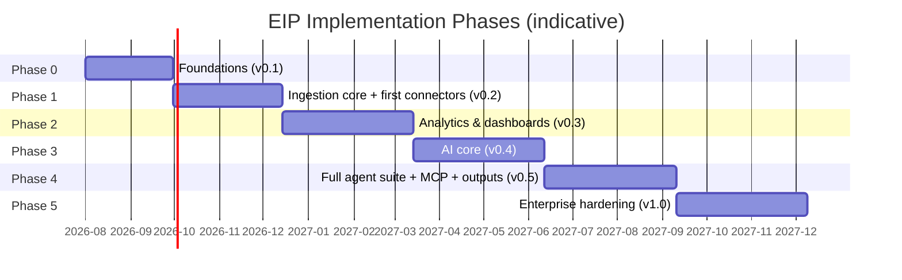

# EIP Roadmap

Phase-based implementation roadmap for the **Engineering Intelligence Platform (EIP)**, following the canonical Phase 0-5 plan from the shared design brief. Feature IDs reference `./FeatureCatalog.md`; behavior is verified against `./AcceptanceCriteria.md`. Dates are indicative planning anchors (phases are exit-criteria-gated, not date-gated); durations reflect relative effort.

## 1. Timeline overview

## 2. Phase gate process

Each phase ends with a formal gate. A phase is exited — and its version cut — only when:

1. All acceptance criteria listed under the phase's exit criteria pass in CI (see `./AcceptanceCriteria.md`).
2. Every feature in the phase's scope meets the Definition of Done (`./AcceptanceCriteria.md`, section 1).
3. The demo milestone is performed live from the Docker Compose stack (air-gapped from Phase 3 onward).
4. No open critical defect or unwaived critical security finding exists against phase scope.
5. Documentation of record in `/docs` reflects what shipped.

Cross-phase engineering principles that hold from Phase 0 onward:

- **Simulation-first**: every connector-, agent-, or report-facing feature is developed and demoed against the simulated enterprise data packs before live integrations; simulation and live share code paths (AC-035).
- **Isolation always-on**: the cross-tenant sweep test grows with every phase's new endpoints; a phase cannot exit with an isolation gap.
- **No metric without caveats**: a metric that cannot state its purpose, formula, inputs, grain, caveats/limitations, and gaming risks does not ship.
- **Anti-goal enforcement**: any surface resembling individual surveillance or stack ranking fails the gate regardless of other criteria (FEAT-200).

## 3. Scope by capability area

Legend: ● = primary delivery in this phase, ◐ = partial/extended, — = not in phase.

| Capability area | P0 | P1 | P2 | P3 | P4 | P5 |
|-----------------|----|----|----|----|----|----|
| Platform & Tenancy | ● | ◐ | — | — | — | ● (K8s GA, HA, backup) |
| Admin & Configuration | ● (org/team/user/roles, credentials) | ● (data sources, jobs, queue/storage) | ◐ (metrics, risk rules, retention) | ◐ (LLM, RAG, agents, templates) | ◐ (MCP, notifications) | — |
| Connectors | — | ● (SPI, Jira, GitHub, simulation) | ● (GitLab, SonarQube, CI/CD, Prometheus) | — | — | ● (remaining connectors) |
| Ingestion & Normalization | — | ● | ◐ (tuning) | — | — | ◐ (scale validation) |
| Analytics & Metrics | — | — | ● | — | — | ◐ (performance) |
| Dashboards | — | ◐ (admin, system health, monitors) | ● (productivity, sprint, kanban, quality, risk, release, ops) | — | — | — |
| AI Agents | — | — | — | ● (runtime, SPI, first agents) | ● (full 18-agent suite) | — |
| RAG | — | — | — | ● | ◐ (scale, re-index SLAs) | — |
| MCP | — | — | — | — | ● | — |
| Report Center & Artifacts Library | — | — | — | ● (engine, library, first reports) | ● (all output types, scheduling) | — |
| Security & Audit | ● (secrets, audit) | — | ◐ (rotation, governance) | ◐ (LLM audit) | — | ● (certification checklist) |
| Observability | ● | ◐ (monitors) | ◐ (SLO alerting) | — | — | ◐ (HA observability) |

## 3. Phase 0 – Foundations (v0.1)

### 3.1 Objectives
Establish the monorepo, CI, and the core platform every later phase builds on: tenancy, RBAC, audit, secrets, OpenAPI-governed API, observability, database baseline, and a one-command Docker Compose dev stack.

### 3.2 Feature scope
FEAT-001, FEAT-002, FEAT-003, FEAT-004, FEAT-005, FEAT-006, FEAT-007, FEAT-011, FEAT-020, FEAT-021, FEAT-022, FEAT-023, FEAT-025, FEAT-195, FEAT-197, FEAT-205, FEAT-206, FEAT-207, FEAT-208, FEAT-209.

### 3.3 Deliverables
- Monorepo per the planned layout (`/backend` Gradle multi-module modular monolith, `/frontend`, `/infra`, `/docs`) with CI (build, tests, module-boundary verification, container images).
- PostgreSQL 16 baseline schema via Flyway with tenant_id + RLS on all tenant-scoped tables.
- OIDC login (Keycloak default) with local-accounts fallback; RBAC with built-in and custom roles.
- Secrets service (AES-256-GCM envelope encryption, KMS SPI) and append-only audit log.
- `/api/v1` skeleton with OpenAPI 3, cursor pagination, RFC 7807 errors, idempotency keys.
- OTel traces/metrics/logs, Micrometer metrics, structured JSON logging, shipped Grafana self-observability dashboards, health/readiness probes.
- Docker Compose stack: app, workers, PostgreSQL+pgvector, Redis 7, Kafka (KRaft), MinIO, Keycloak, OTel Collector, Prometheus, Grafana.
- Frontend shell (React 18 + TS + Vite, TanStack Query, ECharts primitives, i18n-ready) with login, org/team/user administration.

### 3.4 Exit criteria
- AC-001–AC-011, AC-013, AC-016–AC-018, AC-085–AC-088, AC-091–AC-095 pass in CI.
- `docker compose up` brings the full stack healthy in under 10 minutes on a clean host (AC-009).
- Cross-tenant sweep test covers 100% of shipped endpoints with zero leaks.
- CI green on every merge; Spring Modulith boundary verification enforced.

### 3.5 Demo milestone — what can be shown
Log in via Keycloak as admins of two different Organizations; create business units, teams, users, and roles; store a masked, encrypted credential; show the audit trail of every action; show a live trace of an API request in Grafana/Tempo — all from one `docker compose up`.

### 3.6 Risks & mitigations
- **RLS + application-layer double enforcement adds complexity** → single tenant-context abstraction in `eip-core`; automated cross-tenant sweep in CI from day one.
- **Over-engineering the foundation delays visible value** → strict scope: no connector or analytics code in Phase 0; timebox platform gold-plating via exit criteria.
- **Keycloak/IdP integration edge cases** → local-accounts fallback ships first; IdP matrix (AD FS/Azure AD/Okta) validated later behind the OIDC abstraction.

## 4. Phase 1 – Ingestion core + first connectors (v0.2)

### 4.1 Objectives
Prove the end-to-end data spine: connector SPI, sync engine with checkpointing, Kafka pipeline with the canonical envelope, normalization to the canonical model v1 (WorkItem supertype + ExternalRef), with Jira, GitHub, and simulation connectors.

### 4.2 Feature scope
FEAT-024, FEAT-035, FEAT-036, FEAT-050, FEAT-051, FEAT-052, FEAT-053, FEAT-075, FEAT-076, FEAT-077, FEAT-078, FEAT-079, FEAT-080, FEAT-081, FEAT-082, FEAT-083, FEAT-111, FEAT-119, FEAT-120.

### 4.3 Deliverables
- Connector SPI (JSON Schema config, validate/testConnection/healthCheck, full/incremental sync, webhooks, rate limiting, retry with backoff+jitter, idempotent upserts, checkpointing, dedup, simulation mode).
- Jira and GitHub connectors (live + simulation); first simulated enterprise data pack in `/simulation`.
- Raw staging (`raw_*` JSONB + MinIO blobs), Kafka topics (`eip.raw.*`, `eip.domain.*`) with envelope, DLQs with replay tooling.
- Normalizers producing canonical model v1 with cross-tool correlation (PR↔WorkItem, Deployment↔Release).
- Data source administration UI, scheduled jobs administration, admin dashboard, system health dashboard, job/queue/cache/connector monitors.

### 4.4 Exit criteria
- AC-014, AC-015, AC-019, AC-023, AC-025–AC-037, AC-054, AC-055 pass.
- Kill-and-resume test: interrupted incremental sync resumes from checkpoint with zero loss/duplication (AC-025); double re-ingestion produces zero duplicates (AC-027).
- Simulation pack round-trip: simulated Jira+GitHub tenant fully populated through the same code paths as live (AC-035).
- Sustained ingest of the reference simulation pack (≥100k WorkItems, ≥500k events) within agreed lag SLOs on the Compose stack.

### 4.5 Demo milestone — what can be shown
Connect a real Jira and GitHub, click "Test connection", run a full sync, watch entities flow through Kafka into the canonical model; kill a worker mid-sync and watch it resume from checkpoint; flip the same tenant to simulation mode and show identical behavior air-gapped; show connector health, queue lag, and DLQ monitors.

### 4.6 Risks & mitigations
- **Source-API rate limits and schema quirks (Jira custom fields)** → simulation-first development; per-connector contract tests against recorded fixtures; adaptive rate limiting (AC-032).
- **Correlation quality (PR↔WorkItem) below expectations** → correlation coverage metric reported honestly as a caveat; heuristics improved iteratively without blocking exit.
- **Kafka operational complexity for small deployments** → single-broker KRaft profile in Compose; operator monitors (FEAT-120) shipped in the same phase.

## 5. Phase 2 – Analytics & dashboards (v0.3)

### 5.1 Objectives
Turn ingested data into trustworthy, caveated insight: metric engine with the full canonical metric set (flow, DORA, quality, delivery risk, ops, team health), the user-facing dashboard suite, and the remaining P1 connectors (GitLab, SonarQube, Generic CI/CD, Prometheus).

### 5.2 Feature scope
FEAT-031, FEAT-032, FEAT-033, FEAT-037, FEAT-054, FEAT-056, FEAT-058, FEAT-059, FEAT-090, FEAT-091, FEAT-092, FEAT-093, FEAT-094, FEAT-095, FEAT-096, FEAT-097, FEAT-098, FEAT-110, FEAT-112, FEAT-113, FEAT-114, FEAT-115, FEAT-116, FEAT-117, FEAT-118, FEAT-196, FEAT-200, FEAT-210.

### 5.3 Deliverables
- Metric engine + time-series store + metrics API; every metric shipped with purpose, formula, inputs, grain, caveats/limitations, gaming risks.
- Flow metrics (velocity, throughput, cycle time, lead time, WIP, flow efficiency, blocked time, sprint predictability, scope churn); DORA (deployment frequency, lead time for changes, change failure rate, MTTR); quality metrics; delivery-risk metrics and risk scoring engine; ops metrics; team-health metrics (team-grain only).
- Dashboards: productivity, delivery risk, sprint, kanban, release, quality, operational health, on the shared dashboard framework.
- GitLab, SonarQube, Generic CI/CD (Jenkins/Azure DevOps/GitHub Actions/GitLab CI), Prometheus connectors.
- Metric definition and risk rule administration, retention policies, secret rotation, metric governance guardrails, platform SLO alerting.

### 5.4 Exit criteria
- AC-012, AC-021, AC-022, AC-024, AC-038–AC-053, AC-089, AC-096 pass, including the concrete cycle-time (AC-039) and change-failure-rate (AC-042) fixtures.
- Sprint dashboard freshness: webhook-driven updates visible within 5 minutes (AC-049).
- Metric governance scan: no individual-ranking surface anywhere (AC-047, AC-089).
- Simulation pack extended with CI/CD, quality, and ops data; all dashboards render fully from simulation alone.

### 5.5 Demo milestone — what can be shown
A product-complete analytics demo on simulated or live data: sprint and kanban dashboards updating live from a Jira webhook, DORA metrics with drill-down to the deployments behind change failure rate, a release readiness score with its contributing signals, and every metric explaining its own formula, caveats, and gaming risks in the UI.

### 5.6 Risks & mitigations
- **Metric distrust ("these numbers are wrong")** → fixture-verified formulas (AC-039–AC-044), drill-down to underlying entities from every widget, explicit coverage caveats when correlation is incomplete.
- **Anti-goal drift toward individual measurement** → FEAT-200 guardrails enforced by contract tests; team-grain-only APIs; design review gate for every new metric surface.
- **Four new connectors in one phase** → all built on the proven SPI with simulation fixtures first; Generic CI/CD abstracts four CI systems behind one canonical Build/Pipeline/Deployment mapping.

## 6. Phase 3 – AI core (v0.4)

### 6.1 Objectives
Introduce the AI layer safely: LLM provider SPI with routing/failover, the agent runtime with budgets/guardrails/audit, the RAG pipeline with permission-aware retrieval, and the first agents (Sprint Review, Release Notes, Delivery Risk) delivering through the report engine and Artifacts Library.

### 6.2 Feature scope
FEAT-026, FEAT-027, FEAT-029, FEAT-030, FEAT-130, FEAT-131, FEAT-132, FEAT-136, FEAT-137, FEAT-138, FEAT-146, FEAT-147, FEAT-155, FEAT-156, FEAT-157, FEAT-158, FEAT-159, FEAT-160, FEAT-170, FEAT-171, FEAT-172, FEAT-174, FEAT-175, FEAT-177, FEAT-198.

### 6.3 Deliverables
- `eip-ai` agent runtime (Java + LangChain4j): plan/execute, tool-calling, budgets, guardrails, full LLM-call audit; optional Python worker path isolated behind Kafka/REST.
- LLM provider SPI (Ollama, vLLM, OpenAI-compatible generic, Anthropic-compatible, custom endpoint) with per-tenant/per-agent routing, fallbacks, token budgets; LLM provider administration UI.
- RAG: ingestion→chunking→embedding→vector store (pgvector default, Qdrant option via VectorStore SPI), permission-aware retrieval with citations, incremental + scheduled re-indexing, RAG audit.
- Report Generation Center, template engine, versioned Artifacts Library in MinIO.
- Agents: Sprint Review, Release Notes, Delivery Risk, RAG Retrieval, Report Composition; first report types: sprint review presentation, release notes, risk report.

### 6.4 Exit criteria
- AC-020, AC-056–AC-062, AC-067–AC-074, AC-078–AC-083 pass.
- Air-gapped run: all Phase 3 AI features work with local Ollama only, zero egress (AC-058).
- Provider failover test: primary down → transparent fallback with audited model switch (AC-059).
- Adversarial cross-tenant RAG test: zero foreign-tenant chunks retrieved (AC-070).
- Every generated artifact carries resolvable citations and immutable versioning (AC-079, AC-083).

### 6.5 Demo milestone — what can be shown
On a fully air-gapped laptop: run the Sprint Review Agent against the simulation tenant, watch the agent plan, retrieve permission-scoped context, and produce a cited sprint review presentation stored as version 1 in the Artifacts Library; kill the primary LLM provider mid-run and show transparent failover; show the complete LLM-call audit with tokens and cost.

### 6.6 Risks & mitigations
- **Hallucinated claims in generated outputs** → mandatory citations (AC-060/061/071), Report Composition citation-index enforcement, Validation Agent hardening in Phase 4; humans review before external sharing.
- **Local-model quality varies across customer hardware** → provider SPI benchmarked with a model qualification guide; per-agent routing lets strong models serve hard tasks.
- **RAG permission leakage** → permission metadata filtered at query time (never post-filtered only), adversarial isolation tests in CI (AC-069/070), RAG audit for detection.
- **LLM cost/latency runaways** → hard token budgets per run and per tenant (AC-056), cost counters on dashboards.

## 7. Phase 4 – Full agent suite + MCP + generated outputs (v0.5)

### 7.1 Objectives
Complete the AI-native promise: all 18 canonical agents, MCP client and server with per-capability RBAC and audit, the full generated-output catalog (presentations, diagrams, exec reports, and the rest), plus scheduling and notification channels.

### 7.2 Feature scope
FEAT-028, FEAT-034, FEAT-133, FEAT-134, FEAT-135, FEAT-139, FEAT-140, FEAT-141, FEAT-142, FEAT-143, FEAT-144, FEAT-145, FEAT-148, FEAT-149, FEAT-150, FEAT-165, FEAT-166, FEAT-167, FEAT-173, FEAT-176, FEAT-178, FEAT-179, FEAT-180, FEAT-181, FEAT-182, FEAT-183, FEAT-184, FEAT-185, FEAT-186, FEAT-187, FEAT-188, FEAT-189, FEAT-190, FEAT-191.

### 7.3 Deliverables
- Remaining agents: Data Ingestion, Data Quality, Engineering Metrics, Documentation, Use Case Diagram, Architecture Diagram, Executive Summary, Incident Analysis, Code Quality, Team Health, Validation, Security Review, Configuration Assistant — completing the 18-agent canonical suite.
- MCP client (enterprise MCP servers as agent tools) and MCP server (allow-listed internal capabilities), with per-capability RBAC + audit and the MCP server registry UI.
- Full output catalog: executive report, status report, blocker analysis, incident summary, tech debt report, security findings report, code quality report, user manual, use case diagram, architecture diagram, dependency map, API/service inventory, readiness reports, change impact, stakeholder comms draft.
- Report scheduling and distribution; notification channel administration (email, webhooks).

### 7.4 Exit criteria
- AC-063–AC-066, AC-075–AC-077, AC-084 pass; all 18 agents runnable against the simulation pack with cited outputs.
- Validation Agent gates publication: uncited claims block or annotate per policy (AC-063).
- MCP allow-list and RBAC enforced both directions with full audit (AC-075–AC-077).
- Every catalog output type generates successfully from simulation data with versioned artifacts.
- Scheduled weekly exec report delivered end-to-end via a notification channel (AC-084).

### 7.5 Demo milestone — what can be shown
A full "AI engineering office" demo: a scheduled Monday run generates the executive report, sprint reviews, risk and readiness reports, and an architecture diagram; the Validation Agent blocks a deliberately corrupted report; an enterprise MCP client queries EIP metrics through the MCP server under RBAC; the Configuration Assistant drafts a new connector configuration that the admin approves.

### 7.6 Risks & mitigations
- **18 agents dilute quality** → shared runtime, shared evaluation harness on simulation packs, per-agent quality bars before enablement; agents ship disabled-by-default until they pass.
- **MCP exposure widens attack surface** → default-deny allow-list, per-capability RBAC, full audit (FEAT-167), no mutating capabilities exposed in 1.0.
- **Diagram/presentation rendering fidelity** → editable diagram sources (Mermaid/PlantUML) as the artifact of record; rendered PPTX/PNG derived, not hand-tuned.

## 8. Phase 5 – Enterprise hardening (v1.0)

### 8.1 Objectives
Make EIP boringly deployable in demanding enterprises: Kubernetes/OpenShift GA, HA, performance at scale, security certification checklist, backup/restore and upgrade paths, and the remaining connectors.

### 8.2 Feature scope
FEAT-008, FEAT-009, FEAT-010, FEAT-055, FEAT-057, FEAT-060, FEAT-061, FEAT-062, FEAT-063, FEAT-064, FEAT-065, FEAT-066, FEAT-067, FEAT-068, FEAT-069, FEAT-199.

### 8.3 Deliverables
- Kubernetes GA (Kustomize base + overlays) with OpenShift notes; HA topology (replicated API, partitioned consumers, Redisson-locked singletons); documented capacity model and load-test results.
- Backup/restore runbooks and scripts (PostgreSQL, MinIO, Kafka offsets); tested version-to-version upgrade path from v0.x.
- Security certification checklist completed: scanning gates, TLS everywhere, penetration-test remediation.
- Remaining connectors: Confluence, Bitbucket, Artifactory, Kubernetes, OpenShift, Docker Registry, Grafana, OpenTelemetry (OTLP intake), Generic REST, Generic SQL, Generic File/Document, Custom internal demand/project tool.
- Performance hardening of ingestion, metric computation, and RAG at reference enterprise scale.

### 8.4 Exit criteria
- AC-010, AC-090 pass; all connector-SPI ACs (AC-025–AC-037) green for every new connector, live and simulation.
- HA fault-injection suite: node kill, broker loss, DB failover — no data loss, degradation within SLOs.
- Upgrade test: v0.5 → v1.0 in place with zero data loss and completed Flyway migrations.
- Reference-scale load test (multi-tenant, full simulation packs) meets published latency/lag SLOs.
- Security checklist signed off; no unwaived critical findings.

### 8.5 Demo milestone — what can be shown
A production-shaped deployment on OpenShift: kill pods and a Kafka broker live while dashboards keep serving; restore last night's backup to a parallel environment; run the same demo air-gapped; show the completed security certification checklist and the full connector catalog syncing — the 1.0 story.

### 8.6 Risks & mitigations
- **Twelve remaining connectors compress into one phase** → they are P2 by design; SPI + simulation-first pattern proven since Phase 1 makes each connector incremental; scope can shed to 1.1 without breaking 1.0 (see section 10).
- **HA surprises late in the program** → HA-relevant patterns (idempotency, checkpoints, locks) enforced since Phase 1; fault-injection tests start in Phase 2 CI, not Phase 5.
- **Certification findings force rework** → security features (RLS, secrets, audit) are Phase 0 foundations; Phase 5 verifies rather than introduces.

## 9. Release train & versioning

- One minor version per phase on the 0.x train: Phase 0 → **v0.1**, Phase 1 → **v0.2**, Phase 2 → **v0.3**, Phase 3 → **v0.4**, Phase 4 → **v0.5**; Phase 5 exit ships **v1.0**.
- A phase's version is cut only when its exit criteria pass; patch releases (v0.x.y) may ship fixes between phases. No feature backports across the train.
- From v0.3 onward, every release is demoable end-to-end from the Docker Compose stack and the simulation packs, air-gapped.
- Flyway migrations are forward-only from v0.1; v1.0 commits to a supported upgrade path from any v0.x ≥ 0.3 and, post-1.0, semantic versioning with deprecation windows on `/api/v1`.

## 10. Out of scope for 1.0

Explicitly not in the 1.0 release (candidates for 1.x, subject to demand):

- SaaS/multi-region hosted offering — EIP 1.0 is on-premise first, single-region.
- Mobile applications (dashboards are responsive web only).
- Individual-level productivity measurement or ranking of any kind — permanent anti-goal, not deferred scope.
- Fine-tuning or training of LLMs inside the platform (only inference via the provider SPI).
- Autonomous write-back to source tools (agents never modify Jira/GitHub/etc.; drafts like stakeholder comms are never auto-sent).
- Real-time streaming analytics below the minute-level freshness targets; sub-second dashboards.
- Built-in incident paging/on-call management (PagerDuty-class functionality) — EIP analyzes incidents, it does not page.
- Additional vector stores beyond pgvector and Qdrant; additional IdP protocols beyond OIDC (SAML-only IdPs via gateway guidance).
- Marketplace/third-party plugin distribution for connectors and agents (SPI is public, but no marketplace tooling).
- Cross-tenant benchmarking or anonymized industry comparisons.

## 11. Cross-references

- Feature definitions and dependencies: `./FeatureCatalog.md`.
- Verification of behavior per phase: `./AcceptanceCriteria.md`.
- Architecture decisions backing phase sequencing: `../architecture/DomainModel.md`.
