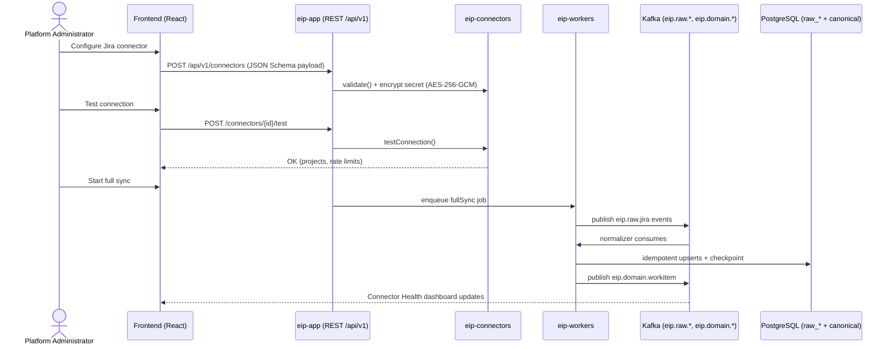
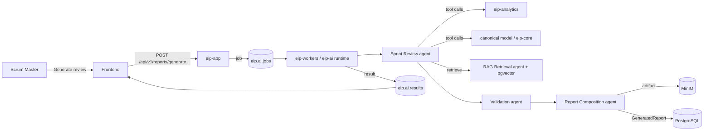
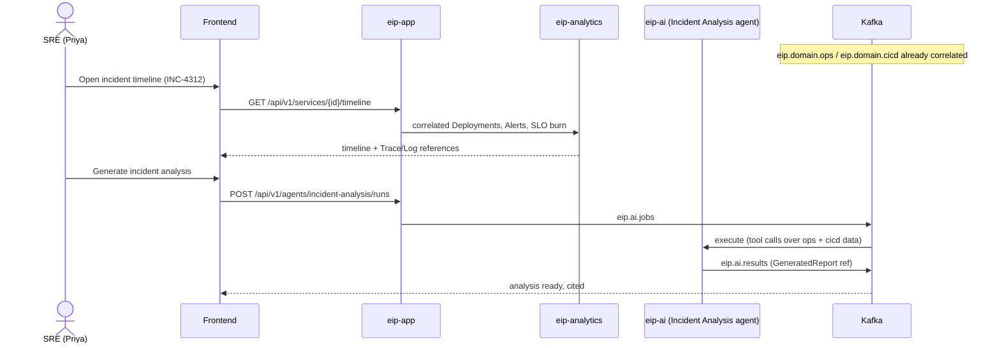

# User Journeys

End-to-end journeys through the Engineering Intelligence Platform (EIP), written to guide implementation and acceptance testing. Personas are defined in `./Personas.md`; formal use cases with requirement traceability are in `./UseCases.md`. Component names refer to the monorepo modules (`eip-app`, `eip-core`, `eip-tenancy`, `eip-connectors`, `eip-ingestion`, `eip-analytics`, `eip-ai`, `eip-reports`, `eip-workers`, React frontend) and infrastructure (PostgreSQL 16, Redis 7, Kafka, MinIO, Keycloak, pgvector, OTel Collector/Prometheus/Grafana).

Conventions: each journey lists persona, trigger, preconditions, numbered steps, touched components, outcome, and failure/edge paths. Kafka topics use the `eip.` prefix per the event model.

## 1. Journey J-01 — Admin installs and configures EIP on-prem, connects Jira + GitHub, runs first sync

- **Persona:** Platform Administrator (Deniz), role `PLATFORM_ADMIN`.
- **Trigger:** Organization approves an EIP pilot; Deniz receives the release bundle (container images + `/infra/docker-compose` for pilot or `/infra/kubernetes` Kustomize overlays for production).
- **Preconditions:** Host resources available; network route (or allow-listed egress via proxy) to on-prem Jira and GitHub Enterprise; a Keycloak realm or willingness to use the bundled one; master key material available via env/file/Vault for the secrets KMS SPI.

**Steps:**
1. Deniz deploys the stack: PostgreSQL 16, Redis 7, Kafka (KRaft), MinIO, Keycloak, OTel Collector + Prometheus + Grafana, `eip-app`, and one `eip-workers` instance. Flyway migrations run automatically on `eip-app` startup and establish the DB baseline including RLS policies.
2. He opens the frontend, authenticates against Keycloak via OIDC, and completes the first-run wizard: sets the installation name, confirms the master key source, and creates the first tenant with himself as `PLATFORM_ADMIN` and a delegated `TENANT_ADMIN`.
3. In Admin Console → Connectors, he adds a **Jira** connector. The UI renders the connector's JSON Schema configuration form (base URL, auth method, project filters). Credentials are submitted once, envelope-encrypted (AES-256-GCM), and never redisplayed (masked in UI).
4. He clicks **Test connection**; `eip-connectors` runs `validate()` then `testConnection()` and reports reachable projects and API rate-limit headroom.
5. He repeats steps 3–4 for **GitHub** (app credentials or PAT, org/repo filters) and registers webhook endpoints where the source system supports them.
6. He triggers **Full sync** for both connectors. `eip-workers` executes `fullSync()`: raw payloads land in `raw_*` JSONB staging (blobs to MinIO), raw events publish to `eip.raw.jira` / `eip.raw.github`, normalizers emit canonical entities (WorkItem, Sprint, Board, Repository, Branch, Commit, PullRequest, CodeReview) to `eip.domain.workitem` and `eip.domain.scm`, and checkpoints are written per connector+stream.
7. He watches the Connector Health dashboard: sync progress, throughput, retry counts (exponential backoff + jitter), and checkpoint positions. Analytics consumers in `eip-analytics` begin materializing first metrics onto `eip.analytics.metrics`.
8. He verifies data: opens a Sprint dashboard, spot-checks a WorkItem against Jira via its `ExternalRef` URL, and confirms the audit log recorded connector creation and secret access.
9. He enables scheduled `incrementalSync(checkpoint)` (default cadence) and hands the tenant to the `TENANT_ADMIN`.

- **Touched components:** `/infra/docker-compose` or `/infra/kubernetes`, Keycloak, `eip-app`, `eip-tenancy`, `eip-connectors`, `eip-ingestion`, `eip-workers`, Kafka, PostgreSQL, MinIO, Redis (rate-limit state, locks via Redisson), frontend, Grafana.
- **Outcome:** Both connectors green; canonical model populated; incremental sync scheduled; first dashboards live.
- **Failure/edge paths:** `testConnection()` fails → actionable RFC 7807 error (DNS, TLS, credential, permission) with no partial connector activation. Rate limiting mid-sync → backoff + jitter, checkpoint preserved, sync resumes automatically. Worker crash → at-least-once redelivery; idempotent upserts (dedup on `eventId`) prevent duplicates. Poison message → routed to the consumer group DLQ (`.<group>.dlq`), visible in the DLQ inspector (see J-… and UC-004).

## 2. Journey J-02 — Engineering Manager reviews sprint health and drills into blockers

- **Persona:** Engineering Manager (Mira), role `ENGINEERING_MANAGER`.
- **Trigger:** Mid-sprint check ahead of a stakeholder sync.
- **Preconditions:** Jira + GitHub synced; sprint metrics materialized by `eip-analytics`.

**Steps:**
1. Mira opens the Delivery Health dashboard scoped to her BusinessUnit; TanStack Query fetches `/api/v1/metrics` (cursor-paginated) and ECharts renders sprint predictability, WIP, blocked time, and scope churn per team.
2. One team shows blocked time trending up and sprint predictability at 62%. She clicks the blocked-time panel; the metric definition drawer shows purpose, formula, inputs, grain, and caveats before any drill-down — context travels with the number.
3. Drill-down lists blocked WorkItems with WorkflowState history, days blocked, linked Dependency records, and owning Team (aggregate view; no individual leaderboards).
4. She opens the worst Epic; the Delivery Risk agent's latest assessment (epic delivery risk, dependency risk) is shown with its reasoning summary and citations to the underlying WorkItems and PullRequests.
5. She asks the Configuration Assistant-style inline query ("what changed on this epic this week?"); `eip-ai` routes the question through the RAG Retrieval agent with permission-aware retrieval, returning cited changes.
6. She exports the drill-down as a snapshot into a report draft (`eip-reports`) and shares it with the Team Lead with two concrete unblock actions.

- **Touched components:** Frontend, `eip-app`, `eip-analytics`, `eip-ai` (Delivery Risk, RAG Retrieval agents), `eip-reports`, PostgreSQL, Kafka (`eip.analytics.metrics`, `eip.ai.jobs`/`eip.ai.results`).
- **Outcome:** Two blockers escalated with evidence; stakeholder sync uses live data instead of a stale spreadsheet.
- **Failure/edge paths:** Metrics stale because a connector is degraded → dashboard shows freshness watermark and links to Connector Health (read-only for Mira). Risk assessment older than the sprint's last change → UI flags staleness and offers on-demand re-run within her `agent:invoke` budget. RAG query touches documents she lacks permission for → results silently exclude them (permission-aware retrieval), never leaking titles.

## 3. Journey J-03 — Scrum Master generates a sprint review presentation via the Sprint Review Agent

- **Persona:** Team Lead / Scrum Master (Sam), role `TEAM_LEAD`.
- **Trigger:** Sprint ends tomorrow; review meeting scheduled.
- **Preconditions:** Sprint data synced; an LLM provider configured for the tenant (local Ollama by default); Sprint Review agent enabled with a token budget.

**Steps:**
1. Sam opens Team → Sprint 24 → **Generate sprint review**. He selects the template (goals vs. outcomes, completed/carry-over, scope churn, demo highlights, flow snapshot) and output format (presentation).
2. `eip-app` enqueues a job on `eip.ai.jobs`; an `eip-workers` instance running the `eip-ai` agent runtime picks it up.
3. The Sprint Review agent plans, then executes tool calls: sprint metrics from `eip-analytics`, WorkItems/PullRequests/Deployments from the canonical model, and RAG Retrieval over linked Documents for context — all tenant-isolated and permission-checked against Sam's grant.
4. The agent drafts the narrative via the LLM provider SPI (routed per tenant+agent); the Validation agent checks the draft for uncited claims and metric misquotes; the Report Composition agent assembles the presentation.
5. Every LLM call is audited (prompt per redaction policy, model, tokens, cost, latency) and counted against the agent budget.
6. The artifact is stored in MinIO, registered as a GeneratedReport with provenance (inputs, agent versions, citations), and the result lands on `eip.ai.results`; the frontend notifies Sam.
7. Sam previews the deck, edits one slide, marks it final, and presents from the artifact library (export to PPTX/PDF available).

- **Touched components:** Frontend, `eip-app`, `eip-ai` (Sprint Review, RAG Retrieval, Validation, Report Composition agents; LLM provider SPI), `eip-analytics`, `eip-reports`, `eip-workers`, Kafka, MinIO, pgvector, PostgreSQL.
- **Outcome:** Cited, editable sprint review presentation in under 5 minutes of Sam's time.
- **Failure/edge paths:** LLM provider down → fallback provider per routing config, or job parks with a clear status and retry. Token budget exceeded → agent degrades to a shorter template and flags truncation, never silently drops sections. Validation agent finds uncited claims → sections regenerated once, then flagged for human review. Sprint has almost no data (e.g., new team) → agent states data limitations explicitly instead of fabricating.

## 4. Journey J-04 — Release Manager checks release readiness and generates release notes

- **Persona:** Release Manager (Jonas), role `RELEASE_MANAGER`.
- **Trigger:** Release 2026.07 go/no-go meeting in two days.
- **Preconditions:** GitHub, Jira, SonarQube, and Generic CI/CD connectors synced; Release entity mapped to its Epics, PullRequests, Builds, Pipelines, and target Environments.

**Steps:**
1. Jonas opens Release 2026.07 → Readiness. The release readiness score is shown with its component signals: QualityGate status, coverage delta, open Bugs by severity, escaped defects trend, security finding aging, pending Deployments, and unfinished WorkItems in scope.
2. He drills into two red signals: a failing QualityGate on one Repository (SonarQube evidence linked) and three unresolved SecurityFindings past SLA.
3. He assigns follow-ups, then re-checks after fixes land; incremental sync + webhook intake refresh the signals without manual refresh rituals.
4. He clicks **Generate release notes**. The Release Notes agent collects merged PullRequests and completed WorkItems in the release scope, groups by Feature/component, drafts customer-facing and internal variants, and cites every entry to its `ExternalRef`.
5. Validation agent passes; the GeneratedReport is stored with provenance; Jonas edits phrasing on two entries and publishes.
6. At go/no-go he presents the readiness dashboard; the decision and the evidence snapshot are exported to the artifact library for compliance.

- **Touched components:** Frontend, `eip-app`, `eip-analytics` (release readiness score), `eip-connectors` (SonarQube, GitHub, Jira, Generic CI/CD), `eip-ai` (Release Notes, Validation agents), `eip-reports`, MinIO, Kafka (`eip.domain.quality`, `eip.domain.cicd`, `eip.reports.jobs`).
- **Outcome:** Evidence-backed go decision; published release notes with citations; compliance snapshot archived.
- **Failure/edge paths:** A PullRequest lacks a linked WorkItem → release notes list it under "unlinked changes" for manual triage rather than omitting it. Readiness inputs partially stale → score shows per-signal freshness and confidence. Release scope changes after generation → regeneration diffs against the previous GeneratedReport version.

## 5. Journey J-05 — Executive consumes the quarterly engineering health report

- **Persona:** VP Engineering / CTO (Kenji), role `EXECUTIVE_VIEWER`.
- **Trigger:** Scheduled quarterly report (configured by the `TENANT_ADMIN` in `eip-reports` scheduling) lands in Kenji's notification channel; board meeting next week.
- **Preconditions:** Two or more quarters of synced data; Executive Summary agent enabled; schedule configured on `eip.reports.jobs`.

**Steps:**
1. The scheduler fires; the Report Composition agent orchestrates the Executive Summary agent over org-level rollups: DORA trends, flow health, quality/technical debt ratio trend, incident posture, top delivery risks per BusinessUnit.
2. The generated report opens with a one-page narrative; every number links to its Metric definition, and a standing "Limitations" section states data coverage and caveats (product invariant, not optional).
3. Kenji reads the narrative, expands one outlier (a BusinessUnit with rising change failure rate), and follows the citation trail two levels down to the Deployment metrics — without needing dashboard fluency.
4. He annotates two sections with questions; annotations notify the responsible Engineering Managers.
5. He exports the board-ready PDF variant from the artifact library.

- **Touched components:** `eip-reports` (scheduler, template engine, exports), `eip-ai` (Executive Summary, Report Composition, Validation agents), `eip-analytics`, MinIO, frontend, Kafka (`eip.reports.jobs`, `eip.ai.results`).
- **Outcome:** Board-ready, cited quarterly report with zero manual collation; questions routed to owners.
- **Failure/edge paths:** Data coverage below threshold for a BusinessUnit → report includes it with an explicit low-confidence banner instead of excluding it silently. Scheduled generation fails → retry with backoff; on final failure, notification to `TENANT_ADMIN` with the job's problem+json error. Kenji lacks permission to a cited raw entity → citation resolves to an aggregate view (permission-aware rendering).

## 6. Journey J-06 — SRE investigates incident impact correlated to deployments

- **Persona:** SRE / Ops Engineer (Priya).
- **Trigger:** PagerDuty-style alert at 02:10; Incident INC-4312 opened for checkout Service latency SLO burn.
- **Preconditions:** Kubernetes, Prometheus, and OTLP intake connectors active; Deployment events flowing on `eip.domain.cicd`; Incident records ingested (via Jira incident tickets as `INCIDENT_TICKET` WorkItems or ops connector).

**Steps:**
1. Priya opens the Incident timeline for the checkout Service: Incidents, Alerts, Deployments, and SLO burn plotted on one axis, with LogReference and TraceReference links out to Loki/Tempo.
2. The timeline shows a Deployment 22 minutes before alert onset. She opens the Deployment: linked Pipeline, Build, Artifact, source PullRequests, and the diff summary.
3. She initiates rollback in her CD tool (EIP links out; it does not orchestrate deployments), and the subsequent Deployment event confirms recovery on the timeline.
4. Post-incident, she invokes the Incident Analysis agent; it drafts an impact analysis — duration, affected SLO, correlated change, customer-facing impact estimate, contributing factors — citing the correlated entities, and files it as a GeneratedReport linked to the Incident.
5. MTTR, change failure rate, and incident frequency/impact metrics update; the team's next retro consumes the analysis.

- **Touched components:** `eip-connectors` (Kubernetes, Prometheus, OpenTelemetry OTLP intake, Generic CI/CD), `eip-ingestion`, `eip-analytics` (ops metrics, correlation), `eip-ai` (Incident Analysis agent), `eip-reports`, frontend, Kafka.
- **Outcome:** Change-to-incident correlation in under a minute; cited post-incident analysis attached to the Incident; DORA/ops metrics updated.
- **Failure/edge paths:** No candidate Deployment in the window → timeline says so explicitly; the agent must not invent a causal change (Validation agent enforces). Clock skew between sources → correlation uses `occurredAt` with tolerance bands and shows uncertainty. OTLP intake backlog during the incident → freshness watermark on the timeline.

## 7. Journey J-07 — Admin configures a local LLM (Ollama) and a RAG knowledge base from Confluence

- **Persona:** Platform Administrator (Deniz), role `PLATFORM_ADMIN` (RAG source config may be delegated to `TENANT_ADMIN`).
- **Trigger:** Security sign-off requires all AI to run air-gapped; teams want agents grounded in their Confluence documentation.
- **Preconditions:** Ollama reachable on the internal network with pulled chat + embedding models; Confluence connector credentials available.

**Steps:**
1. In Admin Console → AI Providers, Deniz registers an **Ollama** provider via the LLM provider SPI: endpoint, available models, timeouts. He runs the built-in provider test (health + short completion) and confirms zero external egress.
2. He sets model routing: per-tenant default chat model, per-agent overrides (e.g., larger model for Executive Summary, small fast model for Validation), fallbacks, and token budgets per agent.
3. He selects the embedding model for RAG and confirms the vector store — pgvector by default (Qdrant available via the VectorStore SPI).
4. He configures the **Confluence** connector (space filters, permission mapping) and enables it as a RAG source. `fullSync()` ingests pages into `raw_*` staging and MinIO.
5. The RAG pipeline runs: chunking → embedding via Ollama → vectors into pgvector with tenant_id and permission metadata → source citations preserved. Incremental re-indexing binds to the connector's `incrementalSync(checkpoint)`; he also sets a weekly scheduled re-index.
6. He validates with a test query in the RAG console; results return chunks with citations and respect a test user's permissions (a restricted space's content does not appear).
7. All configuration changes and the test queries appear in the audit log; RAG retrieval logging is confirmed enabled.

- **Touched components:** `eip-ai` (LLM provider SPI, RAG pipeline, RAG Retrieval agent, model routing), `eip-connectors` (Confluence), `eip-ingestion`, pgvector (PostgreSQL), MinIO, `eip-tenancy` (permission metadata, audit), frontend Admin Console, `eip-workers`.
- **Outcome:** Air-gapped LLM serving all agents; permission-aware Confluence knowledge base with citations and scheduled re-indexing.
- **Failure/edge paths:** Embedding model changed later → re-index required; UI blocks mixed-model indexes and offers a background re-embed job. Ollama saturated → per-provider rate limits (Redis-backed) queue jobs rather than failing them. Confluence permission model drifts → permission metadata refreshed on incremental sync; stale-permission window documented and bounded by sync cadence. Oversized page/attachment → blob to MinIO, chunker skips non-text with a logged notice.

## 8. Journey J-08 — Security officer audits AI usage and secret access

- **Persona:** CISO / Security Officer (Helena), role `SECURITY_AUDITOR`.
- **Trigger:** Quarterly compliance audit; item: "verify AI data handling and secret hygiene of EIP".
- **Preconditions:** Audit logging enabled since installation (it is not disableable); Helena holds `audit:read`, `secret:audit`, `llm:audit`, `mcp:audit`.

**Steps:**
1. Helena opens Audit → LLM Usage and filters the quarter: every LLM call listed with agent, model, provider, tokens, cost, latency, and the prompt stored per the tenant's redaction policy. She verifies all providers are the internal Ollama/vLLM endpoints — no external provider configured.
2. She cross-checks egress: EIP's OTel metrics in Grafana show outbound calls only to registered internal endpoints.
3. She opens Audit → Secret Access: every decryption event of connector credentials with actor (human or system component), purpose, and timestamp. She confirms secrets are masked in UI everywhere and rotation events exist for the credentials rotated last month (see UC-014).
4. She reviews MCP activity: which allow-listed capabilities EIP exposes as MCP server, which enterprise MCP servers EIP consumed as client, and per-capability RBAC checks logged for each invocation.
5. She samples RAG retrieval logs to verify permission-aware retrieval (queries by a restricted user never returned restricted chunks).
6. She runs the Security Review agent to compile the evidence pack (findings, coverage, anomalies — e.g., one service account with an unusual secret-access spike, which she flags to Deniz), and exports it from the artifact library.

- **Touched components:** `eip-tenancy` (audit store), `eip-ai` (LLM call audit, RAG audit, Security Review agent, MCP audit), `eip-reports` (evidence export), frontend Audit views, Grafana (egress verification).
- **Outcome:** Audit evidence pack exported; one anomaly flagged with a tracked follow-up; AI data-handling posture verified.
- **Failure/edge paths:** Redaction policy makes a prompt unreadable for investigation → break-glass reveal requires a second approver and is itself audited. Audit query over a large window → cursor pagination and async export instead of timeouts. Anomaly confirmed malicious → Helena escalates; Deniz rotates the secret (UC-014) and the rotation is visible in her next audit pass.

## 9. Journey J-09 — Team runs in simulation mode for evaluation/demo

- **Persona:** Platform Administrator (Deniz) preparing; Engineering Manager (Mira) and Team Lead (Sam) evaluating.
- **Trigger:** Pre-purchase evaluation, a demo to leadership, or a training environment — with no production credentials allowed.
- **Preconditions:** Standard deployment (Docker Compose is sufficient); simulation data packs from `/simulation` available; a demo tenant created.

**Steps:**
1. Deniz creates a dedicated tenant `demo` and enables **simulation mode** on it: connectors are instantiated in their simulation/mock mode (part of the Connector SPI) instead of contacting real systems.
2. He loads a simulated enterprise data pack (e.g., "mid-size org: 3 BusinessUnits, 12 Teams, 18 months of Jira/GitHub/SonarQube/CI/incident history") from `/simulation`.
3. The simulated connectors replay the pack through the *real* pipeline: `eip.raw.<connector>` → normalizers → canonical model → `eip.domain.*` → analytics and RAG — exercising the same code paths as production, including checkpointing and idempotent upserts.
4. Mira and Sam log in with demo accounts (roles `ENGINEERING_MANAGER`, `TEAM_LEAD`) and walk journeys J-02, J-03, and J-04 against simulated data; agents run against the configured LLM with simulated context.
5. The tenant banner marks all screens and GeneratedReports as **SIMULATED DATA** — artifacts carry the marker in metadata and rendered output.
6. After evaluation, Deniz either resets the demo tenant (replay from scratch, deterministic seeds) or deletes it; deletion cascades via tenant-scoped RLS-backed data and is audited.

- **Touched components:** `/simulation` data packs, `eip-connectors` (simulation/mock mode), full ingestion pipeline (`eip-ingestion`, Kafka, PostgreSQL), `eip-analytics`, `eip-ai`, `eip-reports`, `eip-tenancy` (isolated demo tenant), frontend.
- **Outcome:** Faithful, safe, resettable evaluation of the full platform — including AI outputs — without touching production systems or data.
- **Failure/edge paths:** Simulation and real connectors on the same tenant → blocked; simulation mode is a tenant-level flag to prevent mixed provenance. Data pack schema version newer than the platform → pack loader refuses with a version error. Demo LLM absent → agents degrade to template-only reports with a clear notice, so metric/dashboard evaluation still works.

## 10. Journey index and phase mapping

| ID | Journey | Primary persona | Earliest phase (roadmap) |
|---|---|---|---|
| J-01 | Install, connect Jira+GitHub, first sync | Platform Administrator | Phase 1 |
| J-02 | Sprint health review and blocker drill-down | Engineering Manager | Phase 2 |
| J-03 | Sprint review presentation via Sprint Review agent | Team Lead / Scrum Master | Phase 3 |
| J-04 | Release readiness + release notes | Release Manager | Phase 3 |
| J-05 | Quarterly engineering health report | VP Engineering / CTO | Phase 4 |
| J-06 | Incident impact correlated to deployments | SRE / Ops Engineer | Phase 2 (metrics) / Phase 4 (Incident Analysis agent) |
| J-07 | Local LLM (Ollama) + Confluence RAG setup | Platform Administrator | Phase 3 |
| J-08 | AI usage and secret access audit | CISO / Security Officer | Phase 0 (audit core) / Phase 3 (LLM audit) |
| J-09 | Simulation mode evaluation/demo | Platform Administrator + evaluators | Phase 1 (sim connectors) onward |

Acceptance criteria for each journey are formalized per use case in `./UseCases.md`; architectural detail for touched components is in `../architecture/` (see `../architecture/DomainModel.md` for entities referenced above).
