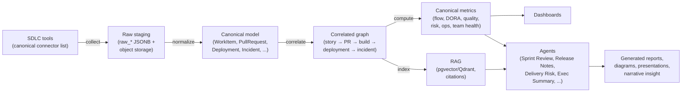
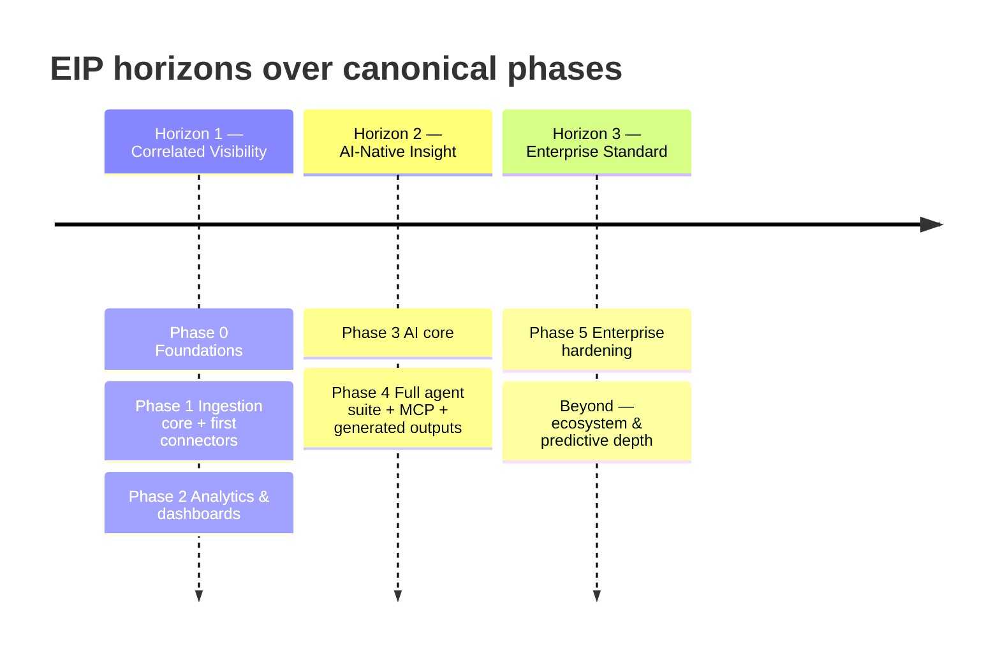

# Engineering Intelligence Platform (EIP) — Product Vision

## 1. Problem Statement

Enterprise engineering organizations run their software delivery lifecycle across a dozen or more disconnected tools: Jira and Confluence for planning and knowledge, GitHub/GitLab/Bitbucket for source control and review, Jenkins/Azure DevOps/GitHub Actions/GitLab CI for build and deployment, SonarQube for quality, Artifactory and Docker Registry for artifacts, Kubernetes/OpenShift for runtime, and Prometheus/Grafana/OpenTelemetry for operations. Each tool holds a partial, locally-consistent view of engineering reality. None of them answers the questions leadership actually asks:

- Is this release ready to ship, and what is the concrete evidence for or against?
- Which epics and projects are at risk of delay, why, and which dependency or blocker is driving it?
- Is our delivery flow improving quarter over quarter — cycle time, throughput, predictability — and where is the constraint?
- Where are technical debt, incident load, or review bottlenecks actively taxing delivery?
- Did that process change (new branching model, new sprint cadence, new quality gate) actually help?

Today these questions are answered by hand: engineers export CSVs, program managers assemble slide decks, and the resulting picture is stale by the time it is presented, non-reproducible, and uncorrelated — the Jira story is not linked to its pull requests, the deployment is not linked to the incident it caused, the sprint commitment is not linked to what actually shipped. The result is a systematic lack of **correlated, trustworthy insight across SDLC tools**. Five root causes:

| # | Root cause | Consequence |
| --- | --- | --- |
| 1 | **Fragmentation.** Signals live in tool-specific silos with tool-specific identities; nothing joins a `WorkItem` to its commits, pull requests, builds, deployments, quality gates, and incidents end-to-end. | Cross-tool questions (release readiness, delay causes) are unanswerable without manual archaeology. |
| 2 | **No shared semantics.** "Cycle time" and "lead time" mean different things in every team's spreadsheet. Metrics lack stated formulas, inputs, grain, caveats, and gaming risks. | Numbers cannot be compared across teams or trusted by anyone who did not compute them. |
| 3 | **Manual, lossy reporting.** Sprint reviews, release notes, executive summaries, and risk reports are hand-assembled narratives detached from underlying data. | Days of skilled labor per reporting cycle; conclusions unverifiable; insight decays immediately. |
| 4 | **Data sovereignty walls.** Banks, telecoms, defense, and public-sector organizations cannot ship SDLC data — source metadata, incident details, personnel activity — to SaaS analytics vendors; many environments are fully air-gapped. | The dominant SaaS analytics products are simply unavailable to a large, high-value market segment. |
| 5 | **Surveillance backlash.** Naive per-individual activity counting (commits, lines, tickets closed) destroys trust, invites gaming, and measures the wrong thing. | Measurement initiatives are rejected by engineers and works councils; orgs end up with no measurement at all. |

The cost is concrete: delayed releases discovered late, risk reviews built on intuition, engineering investment decisions made without evidence, and recurring reporting overhead that scales linearly with organization size.

## 2. Target Market

### 2.1 Segments

| Segment | Profile | Why EIP |
| --- | --- | --- |
| Regulated enterprises | Banking, insurance, telecom, healthcare, energy; 200–10,000+ engineers; strict data-residency and audit obligations | On-premise deployment, air-gap support, local LLMs, envelope-encrypted secrets, full audit trail |
| Public sector & defense | Air-gapped or classified networks; no external SaaS permitted | Runs fully disconnected with local LLM providers (Ollama, vLLM); no SaaS dependencies |
| Large product/engineering organizations | Multi-business-unit companies consolidating engineering visibility across acquisitions and heterogeneous toolchains | Connector framework spanning Jira, Confluence, GitHub, GitLab, Bitbucket, SonarQube, Artifactory, Kubernetes, OpenShift, Docker Registry, Prometheus, Grafana, OpenTelemetry, generic CI/CD, REST, SQL, file/document, and custom internal demand/project tools |
| IT service providers / holding companies | Operate engineering for multiple internal or external clients | Multi-tenancy with row-level tenant isolation; per-tenant configuration, model routing, and RBAC |

### 2.2 Roles

Primary buyer: VP Engineering / CTO / Head of Engineering Excellence. Primary champions: engineering managers, delivery/program managers, platform teams. Primary daily users: engineering leadership, team leads, PMO, SRE/ops leads, and executives consuming generated reports. Detailed personas: see ../product/Personas.md; requirements per role: see ../product/PRD.md §3.

### 2.3 Environment Assumptions

The target customer already operates a subset of the canonical connector toolchain, has an enterprise IdP (or accepts the bundled Keycloak), and can host Docker Compose (evaluation) or Kubernetes/OpenShift (production) workloads. AI features assume either an optional external OpenAI-compatible/Anthropic-compatible endpoint or, for air-gapped sites, locally hosted model weights served by Ollama or vLLM.

## 3. Vision Statement

**EIP is the on-premise, AI-native system of intelligence for enterprise software delivery: it integrates with the SDLC tools an organization already runs, normalizes and correlates their data into one canonical model, computes transparent and humane engineering metrics, and uses agentic AI with RAG over the organization's own knowledge to turn that correlated data into dashboards, reports, and narrative insight — all without a single byte leaving the enterprise boundary.**

In its target state, EIP is where an engineering organization looks first: to see delivery health, to understand risk before it becomes delay, to generate the sprint review, release notes, and executive summary that used to consume days of manual work, and to ask free-form questions of its own engineering reality — with every answer citing its sources and stating its uncertainty.

The value chain the vision commits to:

Every stage adds trust: raw data is retained for re-processing, canonical entities keep `ExternalRef` provenance back to source tools, metrics carry documented formulas and caveats, and AI outputs carry citations and validation status.

## 4. Strategic Pillars

### 4.1 On-Prem Sovereignty

EIP is on-premise first, not on-premise eventually. It deploys via Docker Compose for evaluation and Kubernetes/OpenShift for production, runs fully air-gapped, and has **no SaaS dependencies except optional, configurable LLM providers** — with local LLMs (Ollama, vLLM) as first-class citizens so even AI features work disconnected. Data residency, secrets handling (AES-256-GCM envelope encryption, master key from env/file/Vault via pluggable KMS SPI), and audit are designed for regulated-industry review, not retrofitted.

Commitments this pillar imposes on every roadmap decision:
- No feature may require external network access to function; external LLM endpoints are the single permitted optional exception.
- No telemetry, license phone-home, or vendor callback of any kind.
- All bundled infrastructure (PostgreSQL 16, Kafka, Redis 7, MinIO, Keycloak, OTel/Prometheus/Grafana) ships in the /infra deployment artifacts and is operable by the customer alone.

### 4.2 Correlation Over Collection

Collecting events is commodity; the product is the join. EIP normalizes heterogeneous tool data into the canonical domain model — the unified `WorkItem` supertype (EPIC|FEATURE|STORY|TASK|BUG|INCIDENT_TICKET) with `ExternalRef` source-tool identity mapping (sourceSystem, externalId, url), plus Repository, Branch, Commit, PullRequest, CodeReview, Build, Pipeline, Deployment, Release, Incident, and the rest of the canonical vocabulary — and correlates entities across tool boundaries: story → branch → commits → pull request → build → deployment → release → incident.

Why this is the pillar rather than a feature: metrics computed on single-tool feeds are approximations (Jira-only "lead time" ignores code and deployment reality; Git-only "throughput" ignores what the work was for). Metrics, risk scores, and AI insights computed on the correlated graph are explainable end-to-end — a release readiness score can enumerate the unmerged PRs, failing quality gates, and open SecurityFindings behind it. Correlation coverage is therefore a first-class, measured product KPI (see §7).

### 4.3 AI-Native Insight

AI is an architectural layer, not a bolt-on chat box. A dedicated agent runtime in `eip-ai` (plan/execute agents with tool-calling, budgets, guardrails, and full audit of every LLM call — prompt, model, tokens, cost, latency, with prompts redacted per policy) powers the canonical agent suite: Data Ingestion, Data Quality, Engineering Metrics, Delivery Risk, Sprint Review, Release Notes, Documentation, Use Case Diagram, Architecture Diagram, Executive Summary, Incident Analysis, Code Quality, Team Health, RAG Retrieval, Report Composition, Validation, Security Review, and Configuration Assistant.

Three design commitments make "AI-native" more than a label:
1. **Grounded, not generative-for-its-own-sake.** RAG grounds every narrative in the organization's actual data and documents, with permission-aware retrieval, tenant isolation, metadata filters, and source citations; the Validation agent checks outputs against retrieved evidence before publication.
2. **Governed.** Per-tenant and per-agent model routing across the LLM provider SPI (Ollama, vLLM, OpenAI-compatible, Anthropic-compatible, custom enterprise endpoints), fallbacks, token budgets, and audited calls make AI operable under enterprise governance.
3. **Composable.** MCP makes EIP both a client of enterprise MCP servers (their tools become agent tools) and a server exposing selected, allow-listed internal capabilities with per-capability RBAC and audit — so EIP participates in the enterprise's broader AI estate instead of being an island.

### 4.4 Humane Metrics — the Anti-Surveillance Stance

EIP is explicitly **not** an individual-surveillance or stack-ranking tool. Metrics combine multiple signals, always presented with context, uncertainty, and stated limitations. There is no simplistic commit counting. Team-health analytics (load balance, review bottlenecks, knowledge concentration / bus factor) are computed at team level only and are explicitly anti-toxic-ranking.

Every metric definition ships with its purpose, formula, inputs, grain, caveats/limitations, and gaming risks — because a metric whose weaknesses are hidden is a metric that will be gamed and mistrusted. This stance is a product requirement, not a documentation footnote:

- The platform is designed so that individual-level ranking views cannot be casually constructed (enforced by requirement FR-057 and release-blocking check NFR-071 in ../product/PRD.md).
- Metric definitions, including gaming risks, are viewable in-product next to every chart.
- The stance is also commercial strategy: it is what makes EIP deployable in works-council and union environments where surveillance-style tools are contractually or legally blocked.

### 4.5 Enterprise-Grade Operations

EIP is built to be operated by enterprise platform teams:

| Quality | Concrete mechanism |
| --- | --- |
| Secure | OIDC (Keycloak on-prem default; pluggable AD FS/Azure AD/Okta; local accounts fallback); tenant-scoped RBAC with fine-grained permissions; AES-256-GCM envelope-encrypted secrets, masked in UI, audited access, rotation support |
| Scalable & async | Kafka-based (KRaft) ingestion with `eip.` topic conventions; separately deployable worker processes; modular monolith with modules extractable to services later |
| Multi-tenant | Row-level tenant isolation (tenant_id + Postgres RLS); per-tenant configuration, quotas, and model routing |
| Observable | OpenTelemetry traces/metrics/logs → OTel Collector → Prometheus + Grafana (Tempo/Loki optional); Micrometer; structured JSON logging; self-observability dashboards shipped in /infra/grafana |
| Reliable | At-least-once delivery with idempotent consumers (dedup on eventId), per-key ordering, DLQ per consumer group, checkpointed connectors |
| Operable | Docker Compose local/demo stack; Kubernetes Kustomize base + overlays with OpenShift notes; documented backup/restore and upgrade paths (Phase 5) |

## 5. Differentiation

### 5.1 Versus SaaS Engineering Analytics (LinearB/Jellyfish/Swarmia-class)

| Dimension | SaaS analytics tools | EIP |
| --- | --- | --- |
| Deployment | Vendor cloud only; data leaves the enterprise | On-premise first; air-gap capable; data never leaves |
| AI | Cloud LLMs, vendor-controlled | Configurable LLM provider SPI incl. local Ollama/vLLM; per-tenant, per-agent model routing |
| Data model access | Vendor-defined dashboards; limited raw access | Full canonical model in the customer's PostgreSQL; open REST `/api/v1` with OpenAPI 3 |
| SDLC coverage | Primarily Git + issue trackers | Full SDLC: planning, knowledge, SCM, CI/CD, quality (SonarQube), artifacts, runtime (Kubernetes/OpenShift), observability (Prometheus/Grafana/OTel), plus generic REST/SQL/file connectors and custom internal tools |
| Measurement philosophy | Varies; individual metrics often exposed | Enforced humane-metrics stance; team-level health metrics; every metric documents caveats and gaming risks |
| Extensibility | Closed connector set | Connector SPI, VectorStore SPI, LLM provider SPI, KMS SPI, MCP client + server |
| Multi-tenancy | Vendor-side | Customer-side: one deployment serves multiple business units or clients with RLS isolation |
| Narrative outputs | Limited summaries | Full agentic report generation: sprint reviews, release notes, executive summaries, diagrams, presentations |

The structural difference: SaaS tools cannot serve air-gapped and data-sovereign customers at all, and none combines full-SDLC correlation with an on-prem agentic AI layer grounded in the customer's own knowledge base. EIP does not primarily compete on chart quality; it competes on being permissible, complete, and trustworthy inside the enterprise boundary.

### 5.2 Versus Raw BI (data warehouse + Tableau/Power BI/Metabase)

Raw BI on top of tool exports gives an organization charts, but the organization must itself build and forever maintain everything below the chart. EIP ships that stack as product:

| Layer the org would have to build | What EIP ships instead |
| --- | --- |
| Connectors with auth, rate limiting, retries, checkpoints | Connector SPI + canonical connector list with validate/testConnection/healthCheck, full + incremental sync, webhook intake, exponential backoff + jitter, idempotent upserts, dedup, simulation mode |
| Identity resolution across tools | `ExternalRef` mapping and cross-tool correlation with provenance, built into the canonical model |
| Canonical schema + evolution | Versioned canonical domain model with Flyway-managed migrations and schemaVersion-aware event envelopes |
| Metric semantics | Canonical metric set (flow, DORA, quality, delivery risk, ops, team health) with documented purpose, formula, inputs, grain, caveats, gaming risks |
| Freshness pipeline | Kafka-based async ingestion with measured lag, at-least-once + idempotency guarantees, DLQ replay |
| Permissions on analytics | Tenant-scoped RBAC enforced on every API, dashboard, and retrieval path |
| AI layer | Agent suite, RAG with citations, MCP integration — absent from BI stacks entirely |

**Escape hatch preserved:** because the canonical model lives in the customer's PostgreSQL and the API is open, existing BI tools can still query EIP's model directly. EIP complements rather than blocks BI investment; it removes the undifferentiated pipeline burden, not the customer's analyst tooling.

## 6. Guiding Principles

1. **Trust before insight.** Every number is explainable: formula, inputs, grain, caveats, gaming risks. Every AI narrative cites sources. Uncertainty is stated, never hidden. If a metric's inputs are incomplete, the metric says so.
2. **Teams, not individuals.** Measurement targets systems and flow. No stack ranking, no individual leaderboards, no commit counting. When in doubt, aggregate up.
3. **Sovereign by default.** Design for the air-gapped deployment first; anything requiring egress must be optional and configurable, and the only permitted category is LLM providers.
4. **Correlate, then compute.** Metrics and AI operate on the correlated canonical model, never on raw single-tool feeds. A metric that cannot cite its canonical inputs does not ship.
5. **Async and idempotent.** Ingestion and AI work flows through Kafka with at-least-once delivery, idempotent consumers, per-key ordering, and checkpointing; the platform degrades gracefully and never corrupts on retry.
6. **Boring, durable technology.** Java 21 + Spring Boot 3.x modular monolith (Spring Modulith conventions), PostgreSQL 16, Redis 7, Kafka — chosen for enterprise operability and a clean extraction path to services when scale demands. Python only for optional AI workers, isolated behind Kafka/REST.
7. **Every capability has an SPI.** Connectors, vector stores (pgvector default, Qdrant option), LLM providers, KMS — pluggable, so no enterprise environment is a dead end and no vendor decision is a lock-in.
8. **Secure and audited by construction.** Tenant isolation via RLS on every tenant-owned row, RBAC on every capability including MCP-exposed ones, secrets encrypted and masked, access audited append-only.
9. **Simulation-first development.** Simulated enterprise data packs and per-connector mock modes make the platform demonstrable, testable, and benchmarkable without customer data — and make evaluation possible before any connector credentials are granted.
10. **Documentation is product.** The /docs tree is the source of record; behavior-defining docs carry explicit acceptance criteria, and requirements carry stable IDs (see ../product/PRD.md §5–§6).

## 7. Success Measures for the Product

| Measure | Target | How measured | Rationale |
| --- | --- | --- | --- |
| Time-to-first-insight | < 1 day from install to first correlated dashboard (Jira + GitHub, or simulation pack) | Timed installation runbook; simulation-pack demo path | Adoption lives or dies on setup friction |
| Correlation coverage | ≥ 80% of pull requests in connected repos auto-linked to a WorkItem; ≥ 90% of deployments linked to a release/pipeline | Built-in correlation-coverage metric per tenant | Correlation is the core value; must be measurable in-product |
| Report displacement | ≥ 70% of pilot teams replace a previously manual recurring report (sprint review, release notes, or exec summary) with a generated one within one quarter | Pilot program tracking; artifact library usage | Proves the AI layer saves real work |
| Metric trust | 100% of shipped metrics carry complete definitions (purpose, formula, inputs, grain, caveats, gaming risks); "I don't trust this number" reports trending to zero | Definition-completeness CI check; feedback tracker | Trust is the differentiator |
| Air-gap viability | Full platform including RAG + agents operable with zero external network access using local LLMs | Air-gapped CI environment test per release | Non-negotiable market requirement |
| Operational health | Reference deployment meets published NFR targets (ingest throughput, dashboard latency, availability — see ../product/PRD.md §6) | Load/performance suite on reference hardware per release | Enterprise-grade is a testable claim |
| Anti-surveillance integrity | Zero individual-ranking features shipped; team-health metrics pass anti-toxic-ranking review before GA | Release-blocking review gate (NFR-071) | The stance must survive roadmap pressure |
| Extensibility proof | ≥ 1 connector, ≥ 1 LLM provider, and ≥ 1 MCP integration built outside the core team against published SPIs | Partner/community build tracking | SPIs are real only if third parties succeed with them |

## 8. Three-Horizon Outlook

Horizons map onto the canonical implementation phases (release criteria per phase: ../product/PRD.md §10).

### 8.1 Horizon 1 — Correlated Visibility (Phases 0–2)

Foundations, ingestion core, and analytics:
- **Phase 0 – Foundations:** monorepo scaffolding, CI, core platform (tenancy, RBAC, audit, secrets, OpenAPI, observability), DB baseline, Docker Compose dev stack.
- **Phase 1 – Ingestion core + first connectors:** connector SPI, sync engine, Kafka pipeline, Jira + GitHub + simulation connectors, normalized model v1.
- **Phase 2 – Analytics & dashboards:** metric engine, flow + DORA + quality metrics, productivity/sprint/kanban/quality dashboards, remaining P1 connectors (GitLab, SonarQube, CI/CD, Prometheus).

**Outcome:** an engineering org sees trustworthy, correlated delivery metrics across its core toolchain — the "single pane" problem solved without AI. Success looks like teams retiring their spreadsheet metrics because the platform's numbers are better documented and drill down to evidence.

### 8.2 Horizon 2 — AI-Native Insight (Phases 3–4)

- **Phase 3 – AI core:** LLM provider SPI, RAG pipeline, first agents (Sprint Review, Release Notes, Delivery Risk), report engine + artifact library.
- **Phase 4 – Full agent suite + MCP + generated outputs:** all canonical agents, MCP client/server, presentations, diagrams, exec reports, scheduling, notification channels.

**Outcome:** the platform moves from showing data to producing work products — recurring reports generate themselves on schedule and arrive through notification channels, risk is narrated with evidence and citations, and EIP participates in the enterprise AI ecosystem via MCP in both directions. Success looks like the sprint review meeting starting from a generated, validated document rather than a blank page.

### 8.3 Horizon 3 — Enterprise Standard (Phase 5 and beyond)

- **Phase 5 – Enterprise hardening:** Kubernetes/OpenShift GA, HA, performance at published scale targets, security certification checklist, backup/restore, upgrade paths, remaining connectors.
- **Beyond Phase 5:** deeper predictive analytics on the correlated graph, richer simulation packs, and an ecosystem of third-party connectors and agents built on the published SPIs.

**Outcome:** EIP is the default engineering-intelligence layer in sovereignty-constrained enterprises — as standard in the stack as the observability platform. Success looks like EIP appearing in enterprise reference architectures next to Keycloak, Kafka, and Grafana.

## 9. Non-Goals

EIP deliberately does **not** aim to be:

| # | Non-goal | Rationale / boundary |
| --- | --- | --- |
| 1 | An individual-surveillance or stack-ranking tool | Foundational anti-goal. No per-person productivity scores, leaderboards, or commit counting — ever. Enforced as a release-blocking requirement, not a preference. |
| 2 | A replacement for source SDLC tools | EIP does not replace Jira, GitHub, Jenkins, SonarQube, or Grafana; it correlates and analyzes their data. Write-back to source tools is out of scope for the canonical phases. |
| 3 | A project management tool | No backlog editing, sprint planning boards, or work assignment. EIP reads Sprints, Boards, and WorkflowStates; it does not manage them. |
| 4 | A general-purpose BI platform | EIP ships opinionated engineering analytics; arbitrary self-service data modeling remains the customer's BI stack's job — which can query EIP's canonical PostgreSQL model directly. |
| 5 | A SaaS product (in this roadmap) | All canonical phases target on-premise deployment. A managed offering is not on the roadmap; no SaaS dependencies except optional LLM providers. |
| 6 | An APM/observability platform | EIP consumes Prometheus/Grafana/OTel signals for engineering intelligence (incident frequency/impact, SLO health, alert noise); it does not replace runtime monitoring or alerting. |
| 7 | An LLM vendor or model host | EIP orchestrates models through the LLM provider SPI (Ollama, vLLM, OpenAI-compatible, Anthropic-compatible, custom enterprise endpoints); it does not train or ship models. |
| 8 | A code hosting, CI, or security scanning engine | SecurityFindings and QualityGates are ingested from tools like SonarQube, not produced by EIP's own scanners. |

## 10. Risks to the Vision (and Stances)

| Risk | Stance |
| --- | --- |
| Pressure to add individual metrics ("just this one customer needs per-developer numbers") | Refused by policy; NFR-071 makes it release-blocking. The anti-surveillance stance is a market position, not a default setting. |
| Correlation quality below target in orgs with weak linking conventions | Ship configurable correlation heuristics, measure coverage in-product, and make the Data Quality agent surface unlinked entities as actionable work. |
| Local-LLM output quality below expectations for narrative agents | Validation agent gates publication; per-agent model routing lets tenants assign stronger models to high-stakes agents; uncertainty is always stated. |
| Scope gravity toward becoming a PM tool or BI tool | Non-goals table above is normative; features that edit source-of-truth work items or offer freeform modeling are rejected at design review. |
| On-prem operational burden deterring adoption | Docker Compose evaluation path, simulation-first demos, shipped self-observability dashboards, and Phase 5 hardening (backup/restore, upgrade paths) directly target operability. |

---
*Sibling documents: ../product/PRD.md (requirements), ../product/Personas.md (personas). Source of record: the /docs tree.*
