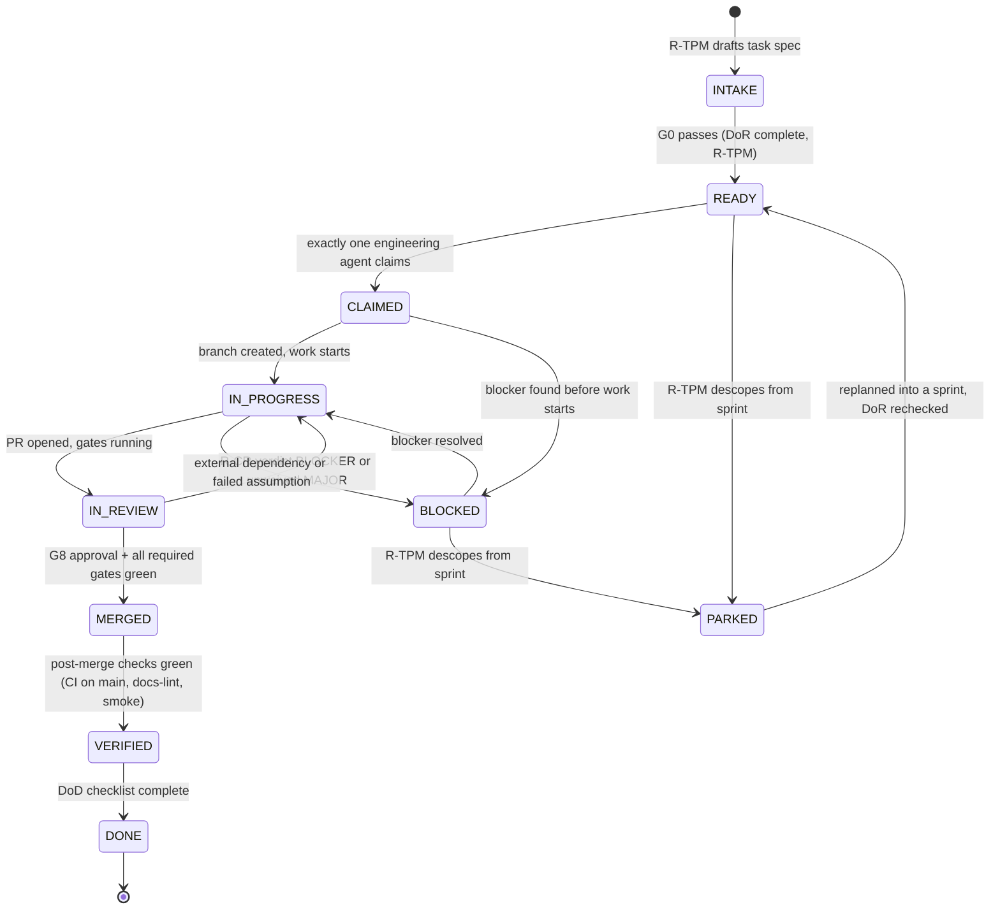

# Development Lifecycle

This document defines the only path work takes from the phase plan to a DONE task. It is read by every engineering role: R-TPM uses §2–§3 to create and sequence tasks; implementing roles (R-IE, R-TE, R-RE, R-DE) follow §4 for every task they claim; every role uses §5 when work stalls. Terminology note: "engineering agent" here means a builder of EIP (see [./EngineeringOperatingSystem.md](./EngineeringOperatingSystem.md) §0), never one of the product's 18 runtime agents.

## 1. The planning chain: phase → story → sprint → task

| Level | Artifact | ID format | Owner | Source of truth |
|---|---|---|---|---|
| Phase | Phase sections of the master build plan | Phase 0–5 → v0.1…v1.0 | R-PO (scope) + R-CA (architecture) | [../docs/implementation/PhaseBasedImplementationPlan.md](../docs/implementation/PhaseBasedImplementationPlan.md), [../docs/product/Roadmap.md](../docs/product/Roadmap.md) §1, exit criteria in [../docs/product/PRD.md](../docs/product/PRD.md) §10 |
| Story | Row in a phase epic table | `P<phase>-E<epic>-S<story>` | R-PO; scope control per plan §11 | [../docs/implementation/PhaseBasedImplementationPlan.md](../docs/implementation/PhaseBasedImplementationPlan.md) §5–§10 |
| Sprint | `/work/sprints/SPRINT-NN.md` | `SPRINT-NN`, 2 weeks | R-TPM | [./SprintExecutionGuide.md](./SprintExecutionGuide.md) |
| Task | `/work/tasks/TASK-NNNN.md` | `TASK-NNNN` (zero-padded, monotonic) | R-TPM creates; one engineering agent executes | This document + [./DefinitionOfReady.md](./DefinitionOfReady.md) |

Traceability is mandatory in both directions: every task MUST cite its story (`P-E-S`) and the FR/AC IDs it serves; branch names and PR titles MUST reference the task ID; commits use `type(scope): summary [TASK-NNNN]` per [./RepositoryRules.md](./RepositoryRules.md).

**Two size scales exist — do not confuse them.** Story sizes in the phase tables are S ≈ ≤ 3 dev-days, M ≈ ≤ 2 weeks, L ≈ ≤ 4 weeks ([../docs/implementation/PhaseBasedImplementationPlan.md](../docs/implementation/PhaseBasedImplementationPlan.md) §0). Task sizes are session-based: **S ≤ ½ session, M ≤ 1 session, L = must split**. A single story therefore decomposes into one or (usually) many tasks.

## 2. Task creation — who and how

**WHO:** R-TPM, and only R-TPM, creates task files. Any role MAY propose a task (including retro, DoD-audit, and escalation outcomes) by writing an INTAKE-state draft or asking R-TPM; R-TPM decides sequencing and sprint placement. This keeps status truth and dependency management in one place (R-TPM mission, [./AIAgentCatalog.md](./AIAgentCatalog.md)).

**HOW:** R-TPM decomposes committed P-E-S stories into task specs that each satisfy the Definition of Ready ([./DefinitionOfReady.md](./DefinitionOfReady.md)). Decomposition rules:

- Every task MUST be size S or M. Anything that cannot fit one session is split before it enters a sprint.
- A task's write-set SHOULD stay within one module (per [./ModuleOwnership.md](./ModuleOwnership.md)). Cross-module stories are split at the contract seam: the contract-side task (interface, schema, event) lands first; consumer tasks depend on it.
- Every task spec MUST contain the canonical fields: id · title · sprint · story ref (P-E-S) · FR/AC refs · change class(es) · module(s)/write-set · assigned role · context pack (ordered reading list with paths/sections) · problem statement · acceptance criteria (testable) · test plan · observability plan (or "none — justified") · docs impact · out-of-scope · dependencies (TASK ids) · size · DoR check.
- The context pack MUST fit a single session and MUST cite paths + sections, never paste document bodies ([./ContextManagementStrategy.md](./ContextManagementStrategy.md)). The task spec IS the implementation prompt payload ([./PromptEngineeringStandards.md](./PromptEngineeringStandards.md)).
- Dependencies MUST be DONE or explicitly stubbed before the dependent task can pass G0.

## 3. Task state machine

Canonical states — no others exist, and none may be skipped except as drawn:

| State | Meaning | Exit owner |
|---|---|---|
| INTAKE | Drafted, not yet DoR-complete | R-TPM (runs G0) |
| READY | G0 passed; claimable | Claiming engineering agent |
| CLAIMED | Exactly one agent owns it (single-writer law) | Same agent |
| IN_PROGRESS | Being implemented on its branch | Same agent (opens PR) |
| IN_REVIEW | PR open; gates G1–G7 running; R-CR reviewing | R-CR (G8) |
| MERGED | On `main` | Automation + R-TPM |
| VERIFIED | Post-merge truth: CI on `main` green including the merged commit, docs-lint green, Compose smoke (E1, E3, E7 per [../docs/testing/TestingStrategy.md](../docs/testing/TestingStrategy.md) §14) green | R-TPM records |
| DONE | DoD checklist complete in the task file ([./DefinitionOfDone.md](./DefinitionOfDone.md)) | R-TPM confirms |
| BLOCKED | Cannot proceed; reason recorded in task file | Per §5 |
| PARKED | Deliberately shelved with reason + re-entry condition | R-TPM |

## 4. The per-task flow

1. **Claim.** An engineering agent claims exactly one READY task matching its role; the claim is written into the task file (agent, date). One AI session ≈ one task claim. Claiming a task another agent holds is prohibited (single-writer law).
2. **Read the context pack** — in the listed order, nothing more, nothing less. Missing context is a G0 defect: return the task to INTAKE via R-TPM rather than improvising.
3. **Branch** as `feature/TASK-NNNN-slug` (or `fix/`, `refactor/`, `docs/`, `adr/` per [./BranchingStrategy.md](./BranchingStrategy.md)). Branch lifetime ≤ 5 working days; split the task if it will not fit.
4. **Implement to spec.** Stay inside the declared write-set; touching files outside it requires R-TPM approval recorded in the task file. If the spec conflicts with `/docs`, stop and apply the docs-first law ([./EngineeringOperatingSystem.md](./EngineeringOperatingSystem.md) §5, law 1) — the doc/ADR change lands first.
5. **Self-check (validation L0)**: run the local suites mirroring CI ([../docs/testing/TestingStrategy.md](../docs/testing/TestingStrategy.md) §17) before opening the PR.
6. **Open the PR** with the canonical description fields: task ref · change class(es) · what/why (≤ 10 lines) · contract impact (none | anchor diff summary) · test evidence (commands + results) · docs updated (paths) · observability delta · rollback note. PR size target ≤ ~400 net lines excluding generated/lock files; larger requires declared justification. Declaring the change class honestly is load-bearing: it selects the conditional gates, and misclassification is a BLOCKER.
7. **Pass the gates.** Always: G1 (build/static), G2 (tests + coverage ratchet), G3 (automated security), G7 (docs), G8 (review). Conditionally by change class: G4 for CC-1/CC-4, G5 for CC-3, G6 for endpoint/consumer/job additions, full G3 checklist + R-SA sign-off for CC-2, AI eval suite + R-AIA sign-off for CC-5. Full matrix: [./QualityGatePolicy.md](./QualityGatePolicy.md).
8. **Review (G8).** R-CR reviews with fresh context — task spec + diff + cited docs only, never the author's session reasoning — and issues BLOCKER/MAJOR/MINOR/NIT verdicts per [./CodeReviewChecklist.md](./CodeReviewChecklist.md). The author never merges without R-CR approval; CC-1 needs two approvals (R-CR + owning architect, + R-CA).
9. **Merge.** Squash-free per [./BranchingStrategy.md](./BranchingStrategy.md) rules; state → MERGED.
10. **Verify.** Post-merge checks per §3 table; state → VERIFIED. A red `main` caused by the merge is the merging task's problem: fixing it preempts all other work of the responsible agent.
11. **Close.** Complete the DoD checklist in the task file (all gates green · ACs demonstrated with evidence · tests + observability + docs landed · no new warnings · DEBT filed for accepted shortcuts · task file updated); state → DONE.

**Session ends before DONE?** The agent MUST write a handoff note at `/work/handoffs/TASK-NNNN-<seq>.md` with the canonical fields: task ref · state reached · commits/branch · what works/what doesn't (verified how) · next 3 concrete steps · open questions · files touched · gotchas. The next session resumes from the handoff, not from scratch.

### 4.1 Gates at a glance (full definitions: [./QualityGatePolicy.md](./QualityGatePolicy.md))

| Gate | Name | Fires at lifecycle point | Applies to | Owner |
|---|---|---|---|---|
| G0 | Ready | INTAKE → READY | every task | R-TPM |
| G1 | Build & Static | PR open / update | every PR | R-DOA |
| G2 | Tests | PR open / update | every PR | R-QAA |
| G3 | Security | PR (automated) + full checklist review for CC-2 | every PR | R-SA |
| G4 | Architecture | IN_REVIEW, before G8 | CC-1 / CC-4 changes | R-CA (with owning architect; R-DBA for CC-4) |
| G5 | Performance | IN_REVIEW, before G8 | CC-3 changes | R-PE (A4 verdict) |
| G6 | Observability | IN_REVIEW, before G8 | new endpoints/consumers/jobs | R-OE (A4 verdict) |
| G7 | Documentation | every PR | every PR | R-DE (A4 verdict) |
| G8 | Review & Done | IN_REVIEW → MERGED; DoD at close | every PR | R-CR (A4 verdict) |

### 4.2 Lifecycle responsibilities (RACI)

| Step | Responsible | Approves/blocks | Consulted | Informed via |
|---|---|---|---|---|
| Task creation + G0 | R-TPM | R-TPM | R-PO (scope), owning architect (design fit) | task file |
| Claim + implement | Executing role (R-IE/R-TE/R-RE/R-DE) | — | context pack sources | task file, daily log |
| PR + gates G1–G7 | Executing role | Gate owners above | owning architect on conditional gates | PR description |
| G8 review + merge | R-CR | R-CR (+ owning architect + R-CA for CC-1) | — | PR verdicts |
| VERIFIED + DONE | R-TPM | R-TPM (DoD complete) | R-QAA (audit sampling later) | task file, sprint file |

## 5. BLOCKED and PARKED — handling and escalation SLAs

A task becomes BLOCKED the moment its agent cannot make progress without an external decision, dependency, or fix. The agent MUST immediately record in the task file: what blocks, options considered, and a recommendation (escalation-record fields: blocker · options considered · recommendation · decision + decider + date).

| Condition | Required action | SLA |
|---|---|---|
| Blocker found mid-session | Record blocker in task file; attempt within-session resolution; else write handoff | Same session |
| BLOCKED at end of 1 full session | MUST escalate to the owning domain architect (per [./ModuleOwnership.md](./ModuleOwnership.md)); R-TPM notified via task file state | Before next session starts |
| Escalation unresolved after 1 further session | Escalate to R-CA | 1 session |
| R-CA cannot resolve (or conflict of interest) | Escalate to human repository owner; decision recorded | Next human checkpoint |
| Security-related blocker or dispute | Straight to R-SA (A4 block); only the human owner may override, recorded | Immediate |
| Scope/priority blocker | R-PO decides | 1 session |
| Schedule/sequencing blocker | R-TPM decides | 1 session |

Rules:

- Escalation is never a failure; sitting silently BLOCKED is. **Blocked longer than 1 session without an escalation record is a process violation** surfaced at the sprint review.
- Every escalation outcome MUST be written as a decision in the task file's escalation record. Decisions that change `/docs` facts additionally require the docs-first flow.
- R-TPM MAY move a BLOCKED task to PARKED to free the sprint lane (see mid-sprint replanning, [./SprintExecutionGuide.md](./SprintExecutionGuide.md) §5). PARKED tasks MUST carry the reason and a concrete re-entry condition.
- PARKED work never silently vanishes (mirrors scope control in [../docs/implementation/PhaseBasedImplementationPlan.md](../docs/implementation/PhaseBasedImplementationPlan.md) §11): R-TPM reviews all PARKED tasks at every sprint planning; a task PARKED for more than 2 sprints is either re-planned or returned to INTAKE with a recorded rationale.

## 6. Feature flags and incomplete verticals

Work-in-progress that would break a vertical slice merges behind `eip.features.*` flags so `main` stays releasable ([../docs/implementation/PhaseBasedImplementationPlan.md](../docs/implementation/PhaseBasedImplementationPlan.md) §4). Flags MUST be removed within one phase of the feature's GA; every live flag is tracked as a DEBT entry (flag debt) per [./TechnicalDebtPolicy.md](./TechnicalDebtPolicy.md).

## 7. Bug-fix lifecycle

Bugs are tasks (`TASK-NNNN`, branch `fix/TASK-NNNN-slug`) with one extra, non-negotiable rule: **the failing regression test lands in a commit BEFORE the fix commit**, with red→green evidence in CI or the PR description. A bug fix without its regression test fails G8 outright. Escaped defects (bugs whose cause merged in an earlier sprint) are counted in the sprint metrics ([./SprintReviewGuide.md](./SprintReviewGuide.md) §4) and MUST cite the originating TASK/PR when identifiable.

## Related documents

- [./EngineeringOperatingSystem.md](./EngineeringOperatingSystem.md) — constitution, laws, precedence
- [./DefinitionOfReady.md](./DefinitionOfReady.md) / [./DefinitionOfDone.md](./DefinitionOfDone.md) — G0 entry and DONE exit contracts
- [./QualityGatePolicy.md](./QualityGatePolicy.md) — G0–G8 and RG1–RG4 in full
- [./CodeReviewChecklist.md](./CodeReviewChecklist.md) — G8 protocol and verdict scale
- [./BranchingStrategy.md](./BranchingStrategy.md), [./RepositoryRules.md](./RepositoryRules.md) — branches, commits, protections
- [./SprintExecutionGuide.md](./SprintExecutionGuide.md), [./SprintReviewGuide.md](./SprintReviewGuide.md) — the sprint wrapper around this lifecycle
- [./ContextManagementStrategy.md](./ContextManagementStrategy.md), [./PromptEngineeringStandards.md](./PromptEngineeringStandards.md) — context packs and prompts
- [../docs/implementation/PhaseBasedImplementationPlan.md](../docs/implementation/PhaseBasedImplementationPlan.md) — the P-E-S story spine and story-level DoD (§12)
- [../docs/product/PRD.md](../docs/product/PRD.md) §10 — phase release criteria
- [../docs/testing/TestingStrategy.md](../docs/testing/TestingStrategy.md) — CI stages (§14), merge gates (§16), local workflow (§17)
