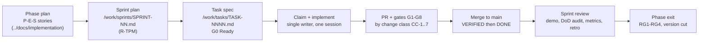

# Engineering Operating System (EOS)

This document is the constitution of the engineering organization that builds the Engineering Intelligence Platform (EIP). Every engineering agent — AI or human — MUST read it once before their first task and MUST return to it whenever precedence, authority, or process is in doubt. It defines the operating model (tiers, roles, gates, artifacts), the ten non-negotiable laws of this repository, and the map of all 33 EOS documents. The product specification under [`/docs`](../docs/product/PRD.md) defines WHAT we build; the EOS defines HOW we build it without architectural drift over months of parallel work.

## 0. Critical disambiguation — engineering roles vs. product runtime agents

The PRODUCT ships 18 runtime AI agents (Sprint Review Agent, Validation Agent, Delivery Risk Agent, …) defined by FR-082 in [../docs/product/PRD.md](../docs/product/PRD.md) §5.5 and specified in [../docs/ai/AgentArchitecture.md](../docs/ai/AgentArchitecture.md). The EOS defines **engineering agent roles** — the 21 AI agents and humans (R-CA … R-RM) that BUILD the product. These are entirely different things and MUST never be conflated:

| Term | Meaning | Catalog |
|---|---|---|
| Engineering role / engineering agent (R-XX) | A builder of EIP, operating under this EOS | [./AIAgentCatalog.md](./AIAgentCatalog.md) |
| Runtime agent / product agent | A feature of EIP itself (FR-082) | [../docs/ai/AgentArchitecture.md](../docs/ai/AgentArchitecture.md) |

Every EOS document says "engineering role" / "engineering agent" for the former and never uses the bare word "agent" where the two could be confused.

## 1. Normative language (RFC 2119)

The key words **MUST**, **MUST NOT**, **SHALL**, **SHALL NOT**, **SHOULD**, **SHOULD NOT**, and **MAY** in all EOS documents are to be interpreted as described in RFC 2119. This note appears once, here; every sibling document inherits it. Text that is not phrased with these keywords is explanatory, not binding.

## 2. What the EOS governs

Dozens of engineering agents will work on this codebase in short, memoryless sessions across Phases 0–5 ([../docs/product/Roadmap.md](../docs/product/Roadmap.md) §1). Without shared law, that produces drift: renamed concepts, silently diverging contracts, unverifiable claims. The EOS prevents this by fixing four things:

1. **Vocabulary** — role IDs (R-XX), gates (G0–G8, RG1–RG4), change classes (CC-1…CC-7), task states, and ID formats (`TASK-NNNN`, `SPRINT-NN`, `DEBT-NNN`, `RISK-NNN`, `ADR-NNN`, `P<phase>-E<epic>-S<story>`) are law. No document, task, or PR MAY rename, renumber, or invent parallel concepts.
2. **Precedence** — see §6.
3. **Process** — the lifecycle in [./DevelopmentLifecycle.md](./DevelopmentLifecycle.md) is the only way work reaches `main`.
4. **Memory** — the repository is the shared memory ([./ContextManagementStrategy.md](./ContextManagementStrategy.md)). Anything not written into an artifact before session end is lost by design.

## 3. Operating model — four tiers

Every engineering role belongs to exactly one tier. Authority levels: **A1** binding platform-wide · **A2** binding within domain · **A3** executes/advises · **A4** independent blocking verdict. Full role cards live in [./AgentResponsibilities.md](./AgentResponsibilities.md).

| Tier | Purpose | Roles |
|---|---|---|
| **Governance** | Owns direction, scope, schedule, and architectural integrity platform-wide (A1) | R-CA (Chief Architect), R-PO (Product Owner), R-TPM (Technical Program Manager) |
| **Domain** | Owns design conformance within a bounded domain (A2; some hold A4 verdicts on specific gates) | R-BA, R-FA, R-AIA, R-DA, R-DBA, R-CNA, R-DOA, R-SA, R-PA, R-QAA, R-PE, R-OE |
| **Execution** | Implements tasks to spec (A3) | R-IE (Implementation Engineer), R-TE (Test Engineer), R-RE (Refactoring Engineer), R-DE (Documentation Engineer) |
| **Assurance** | Independent verdicts, outside the author's chain (A4) | R-CR (Code Reviewer), R-RM (Release Manager) |

Default escalation chain: R-IE/R-TE → owning domain architect → R-CA → human repository owner. Architect-vs-architect disagreements → R-CA. Scope/priority disputes → R-PO. Schedule disputes → R-TPM. Security disputes → R-SA holds an A4 block; only the human owner may override, and the override MUST be recorded in the task file's escalation record.

## 4. How the pieces fit — lifecycle → gates → roles → artifacts

| Piece | Rule | Defined in |
|---|---|---|
| Lifecycle | Work flows phase → sprint → task → PR → merge → verify → done; no other path exists | [./DevelopmentLifecycle.md](./DevelopmentLifecycle.md) |
| Gates | G0–G8 gate every task/PR; RG1–RG4 gate every release; change classes CC-1…CC-7 decide which conditional gates apply | [./QualityGatePolicy.md](./QualityGatePolicy.md) |
| Roles | Each gate has an owning role; each module has an owning role; authority is bounded by tier | [./AgentResponsibilities.md](./AgentResponsibilities.md), [./ModuleOwnership.md](./ModuleOwnership.md) |
| Artifacts | Task specs, PR descriptions, handoff notes, ADRs, escalation records, DEBT/RISK entries carry ALL inter-role state | [./AgentCommunicationProtocol.md](./AgentCommunicationProtocol.md) |

## 5. The ten laws

These are non-negotiable. A PR, task, or release that violates one of them MUST be blocked regardless of any other merit.

1. **Docs-first.** [`/docs`](../docs/product/PRD.md) is the documentation of record ([../docs/product/PRD.md](../docs/product/PRD.md) §7, constraint 6). If implementation must deviate from `/docs`, the doc change (plus ADR when decision-level) lands first, or in the same PR for small clarifications. Code MUST NOT silently diverge. Enforced at G7 (R-DE) and G8 (R-CR).
2. **Single-writer.** A task is CLAIMED by exactly one engineering agent at a time. Tasks scheduled in parallel within a sprint MUST have disjoint write-sets or an explicit ordering declared in the sprint plan ([./SprintExecutionGuide.md](./SprintExecutionGuide.md) §3). Enforced by R-TPM at planning and G0.
3. **Gates are law.** Nothing merges without its required gates G1–G8 green; nothing releases without RG1–RG4. Waivers exist only via the MAJOR-waive mechanism in [./CodeReviewChecklist.md](./CodeReviewChecklist.md), justified and recorded. Misdeclaring a change class to dodge a conditional gate is a BLOCKER.
4. **CI is truth.** CI is the only accepted evidence that builds, tests, or checks pass. "Tests pass locally" is not evidence; an unverifiable claim in a PR is a BLOCKER ([./AIValidationWorkflow.md](./AIValidationWorkflow.md)). Reviewers MUST require CI links or re-run.
5. **No individual surveillance.** FR-057 and NFR-071 ([../docs/product/PRD.md](../docs/product/PRD.md) §5.3, §6) are release-blocking: no individual-level rankings, leaderboards, or per-person activity counts, ever. Any surface resembling individual surveillance fails its gate regardless of other criteria ([../docs/product/Roadmap.md](../docs/product/Roadmap.md) §2). Guarded by R-PO (anti-goals) and R-SA at RG2.
6. **No unregistered debt.** Register-or-fix: every accepted shortcut becomes a `DEBT-NNN` entry in `/work/debt-register.md` in the same PR, or it does not merge. ≤ 15% of sprint capacity is reserved for paydown; DEBT older than 2 phases escalates to R-CA ([./TechnicalDebtPolicy.md](./TechnicalDebtPolicy.md)).
7. **Contract anchors need G4.** Changes to the contract anchors — [../docs/product/PRD.md](../docs/product/PRD.md), [../docs/architecture/DomainModel.md](../docs/architecture/DomainModel.md), [../docs/engineering/EventModel.md](../docs/engineering/EventModel.md), [../docs/engineering/APIDesign.md](../docs/engineering/APIDesign.md), [../docs/engineering/ConnectorFramework.md](../docs/engineering/ConnectorFramework.md) (SPI sections), [../docs/architecture/SecurityModel.md](../docs/architecture/SecurityModel.md), and published SPI interfaces — are CC-1: G4 review by the owning architect plus R-CA, two-approval G8, ADR when decision-level. Restating an anchor's facts elsewhere is prohibited; reference, never restate ([../docs/reviews/DocumentationQualityReview.md](../docs/reviews/DocumentationQualityReview.md) §5.3).
8. **Regression test before fix.** Every bug-fix PR contains the failing regression test in a commit BEFORE the fix commit, with red→green evidence in CI or the PR description ([./DevelopmentLifecycle.md](./DevelopmentLifecycle.md) §7).
9. **Observability is mandatory.** No new endpoint, consumer, or job merges without metrics, traces, and structured logs per [../docs/architecture/ObservabilityModel.md](../docs/architecture/ObservabilityModel.md) (`eip_*` naming), dashboard/alert updates for new failure modes, and an SLO impact statement. Enforced at G6 (R-OE) per [./ObservabilityRequirements.md](./ObservabilityRequirements.md).
10. **Everything in artifacts.** Engineering agents MUST NOT exchange state outside the canonical artifacts (task specs, PR descriptions, handoff notes, ADRs, escalation records, DEBT/RISK entries). A session that ends without DONE writes a handoff note. Anything not written into the repository before session end is lost by design ([./ContextManagementStrategy.md](./ContextManagementStrategy.md)).

## 6. Precedence

When sources conflict, the higher entry wins. Discovering a conflict creates work: file a TASK (doc fix) or escalate — never resolve silently.

| Rank | Source | Notes |
|---|---|---|
| 1 | Recorded decisions of the human repository owner | Overrides everything; MUST be recorded in the affected artifact |
| 2 | `/docs` product specification + ADRs | Source of record for all product and architecture facts; changes go through CC-1/G4 and [./ADRProcess.md](./ADRProcess.md) |
| 3 | EOS documents (this directory) | Source of record for process; owned by R-CA; changed only by PR with scope `eos`, G7 + G8, R-CA approval |
| 4 | Sprint plans and task specs (`/work`) | Bind a single sprint/task; MUST cite ranks 2–3, never contradict them |
| 5 | Code comments, commit messages, session output | Never authoritative |

## 7. Document map — the 33 EOS documents

`README.md` in this directory is the navigation index (maintained separately). The 33 governing documents:

| Document | One-line purpose |
|---|---|
| **Constitution & lifecycle** | |
| [EngineeringOperatingSystem.md](./EngineeringOperatingSystem.md) | This constitution: tiers, laws, precedence, document map. |
| [DevelopmentLifecycle.md](./DevelopmentLifecycle.md) | End-to-end flow from phase plan to DONE task; task state machine; BLOCKED/PARKED handling and escalation SLAs. |
| **Engineering-agent workforce** | |
| [AIEngineeringGuide.md](./AIEngineeringGuide.md) | How AI engineering agents operate here: session discipline, claiming, verification duties, handoffs. |
| [AIAgentCatalog.md](./AIAgentCatalog.md) | The 21 engineering roles (R-XX) with tier, authority level, and mission. |
| [AgentResponsibilities.md](./AgentResponsibilities.md) | Full role cards: responsibilities, inputs/outputs, decision authority, reading lists, owned gates, escalation. |
| [AgentCommunicationProtocol.md](./AgentCommunicationProtocol.md) | The artifact-only communication rules between engineering roles; no out-of-band state. |
| [ContextManagementStrategy.md](./ContextManagementStrategy.md) | Context layers L1–L4, context packs, reading lists per task type; the repo as shared memory. |
| [PromptEngineeringStandards.md](./PromptEngineeringStandards.md) | Required structure of every implementation prompt: role card + task spec + context pack + output contract + verification steps. |
| [AIValidationWorkflow.md](./AIValidationWorkflow.md) | The L0–L4 validation ladder for AI-produced work; CI-is-truth enforcement. |
| **Standards** | |
| [RepositoryRules.md](./RepositoryRules.md) | Repo-wide rules: protected `main`, PR-only, required checks, CODEOWNERS, Conventional Commits. |
| [RepositoryStructure.md](./RepositoryStructure.md) | Canonical directory layout including `/work` and the EOS additions. |
| [CodingStandards.md](./CodingStandards.md) | Java 21 / Spring Modulith and React 18 / TypeScript coding rules. |
| [DocumentationStandards.md](./DocumentationStandards.md) | Conventions for `/docs` and EOS documents; docs-lint rules; docs-impact declarations. |
| [ModuleOwnership.md](./ModuleOwnership.md) | Module → owning-role map, co-ownerships, CODEOWNERS mapping. |
| **Architecture governance** | |
| [ArchitecturePrinciples.md](./ArchitecturePrinciples.md) | Binding principles derived from the `/docs` architecture set; module boundary and dependency rules. |
| [ADRProcess.md](./ADRProcess.md) | ADR lifecycle, template, R-CA approval; index of backfilled ADR-001…ADR-014 ([../docs/architecture/ArchitectureOverview.md](../docs/architecture/ArchitectureOverview.md) §7). |
| **Quality machinery** | |
| [DefinitionOfReady.md](./DefinitionOfReady.md) | G0: what a task spec MUST contain before it can be claimed. |
| [DefinitionOfDone.md](./DefinitionOfDone.md) | The DoD checklist that closes a task. |
| [QualityGatePolicy.md](./QualityGatePolicy.md) | G0–G8 and RG1–RG4 in full: checks, owners, evidence, waiver rules, change-class matrix. |
| [CodeReviewChecklist.md](./CodeReviewChecklist.md) | R-CR review protocol and the BLOCKER/MAJOR/MINOR/NIT verdict scale. |
| [SecurityChecklist.md](./SecurityChecklist.md) | G3/CC-2 checklist; RG2 security certification including the NFR-071 anti-surveillance review. |
| [PerformanceChecklist.md](./PerformanceChecklist.md) | G5/CC-3 checklist against the NFR budgets; RG3 phase-scale verification. |
| [TestingChecklist.md](./TestingChecklist.md) | Per-change-class test requirements binding [../docs/testing/TestingStrategy.md](../docs/testing/TestingStrategy.md) to tasks. |
| [ObservabilityRequirements.md](./ObservabilityRequirements.md) | G6 requirements: metric/trace/log coverage, naming, dashboards, alerts, SLO impact statements. |
| **Delivery** | |
| [BranchingStrategy.md](./BranchingStrategy.md) | Trunk-based branching, branch naming, ≤ 5-day branch lifetime, PR size targets. |
| [VersioningStrategy.md](./VersioningStrategy.md) | Platform v0.1→v1.0 train, SPI semver (NFR-060), event schema and `/api/v1` versioning, Flyway rules. |
| [ReleaseManagement.md](./ReleaseManagement.md) | Release trains, RG1–RG4 execution, go/no-go, rollback decisions (R-RM). |
| [DependencyManagement.md](./DependencyManagement.md) | Dependency approval, license allow-list, air-gap fitness, patch cadence. |
| [SprintExecutionGuide.md](./SprintExecutionGuide.md) | Sprint planning mechanics, lanes and write-sets, daily status, mid-sprint replanning, sprint file template. |
| [SprintReviewGuide.md](./SprintReviewGuide.md) | Sprint review: demo against phase exit criteria, DoD audit, sprint metrics, retro protocol. |
| **Long-term health** | |
| [TechnicalDebtPolicy.md](./TechnicalDebtPolicy.md) | Register-or-fix, DEBT-NNN lifecycle, ≤ 15% paydown reserve, aging escalation. |
| [RefactoringPolicy.md](./RefactoringPolicy.md) | Boy-scout vs. structural refactors; behavior-preservation evidence requirements. |
| [RiskManagementPolicy.md](./RiskManagementPolicy.md) | RISK-NNN register, likelihood×impact scoring, review cadence, PRD §11 open questions as standing risks. |

## 8. Bootstrap order

A new engineering agent MUST read, in order: `/CLAUDE.md` (session bootstrap) → this document → its role card in [./AgentResponsibilities.md](./AgentResponsibilities.md) → the claimed task's context pack. Nothing else is required pre-reading; context packs are curated by R-TPM to fit a single session ([./ContextManagementStrategy.md](./ContextManagementStrategy.md)).

## Related documents

- [./DevelopmentLifecycle.md](./DevelopmentLifecycle.md) — how work flows end to end
- [./QualityGatePolicy.md](./QualityGatePolicy.md) — the gates this constitution makes law
- [./AIAgentCatalog.md](./AIAgentCatalog.md), [./AgentResponsibilities.md](./AgentResponsibilities.md) — who does what
- [./ContextManagementStrategy.md](./ContextManagementStrategy.md) — the repo as shared memory
- [./SprintExecutionGuide.md](./SprintExecutionGuide.md), [./SprintReviewGuide.md](./SprintReviewGuide.md) — the sprint cadence
- [../docs/product/PRD.md](../docs/product/PRD.md) — product source of record (FR/NFR IDs, §10 release criteria)
- [../docs/product/Roadmap.md](../docs/product/Roadmap.md) — phases, versions, phase gate process
- [../docs/implementation/PhaseBasedImplementationPlan.md](../docs/implementation/PhaseBasedImplementationPlan.md) — the P-E-S story spine
- [../docs/reviews/DocumentationQualityReview.md](../docs/reviews/DocumentationQualityReview.md) — why anchors are referenced, never restated
