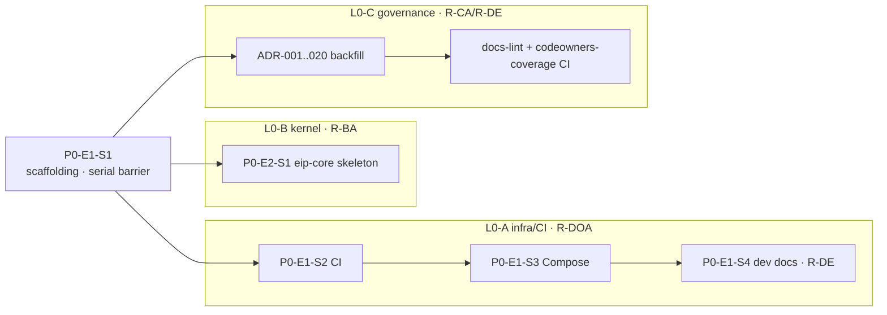
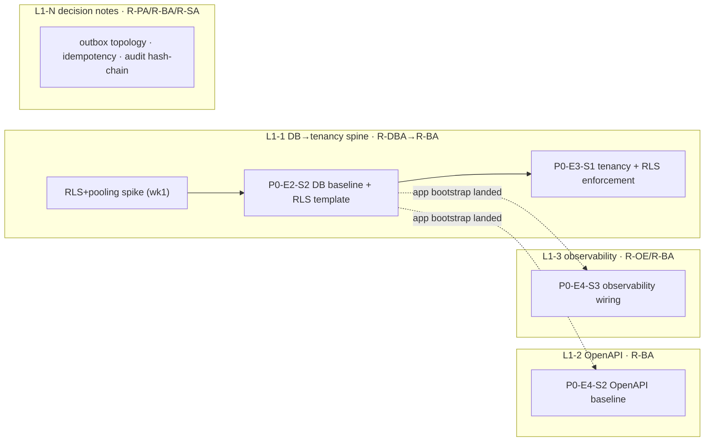
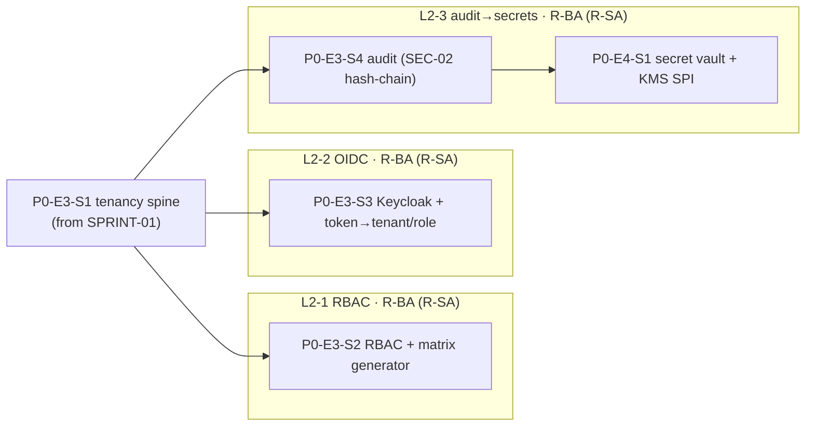
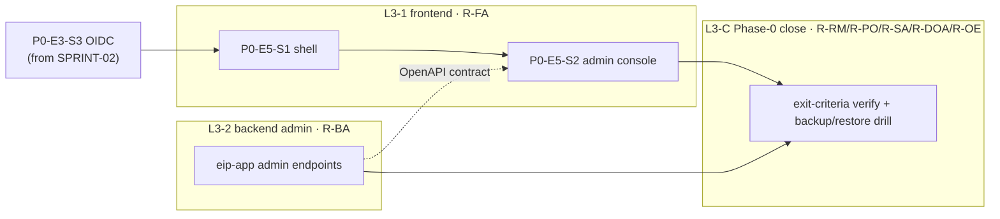

# Parallelization Plan

The concurrent-lane plan for Sprints 00–03: for each sprint, the lanes bound to **disjoint write-sets**, which stories run in parallel versus serial and why, the lane→owning-role assignment, and the synchronization/barrier points. It **sequences** the stories of [../docs/implementation/PhaseBasedImplementationPlan.md](../docs/implementation/PhaseBasedImplementationPlan.md) §5 over the DAG in [./DependencyMatrix.md](./DependencyMatrix.md) — it does not re-specify them.

## 0. The single-writer lane rule

> **Parallel tasks MUST have disjoint module/file write-sets, or a declared ordering** (one lane rebases onto another lane's already-landed change). This is the EOS single-writer rule ([../engineering-operating-system/DevelopmentLifecycle.md](../engineering-operating-system/DevelopmentLifecycle.md), [../engineering-operating-system/AIAgentCatalog.md](../engineering-operating-system/AIAgentCatalog.md) §lanes).

- A **lane** is one R-IE + one R-TE pair working under exactly **one** supervising domain architect on **one** module set ([AIAgentCatalog §lanes](../engineering-operating-system/AIAgentCatalog.md)). A domain architect supervises ≤3 lanes.
- **Cross-lane needs are never resolved by direct edits into another lane's write-set** — they become dependency-linked TASKs sequenced by R-TPM.
- When two stories must touch the **same module**, the lanes bind to **disjoint packages/files** within it (stated per sprint below); the shared bootstrap/config file is owned by exactly one lane and the others rebase (a **declared ordering**).
- Flyway migrations are append-only forward-only files; concurrent stories add distinct `Vn__` files, and **R-DBA sequences their numbers** (CC-4, [../engineering-operating-system/QualityGatePolicy.md](../engineering-operating-system/QualityGatePolicy.md) G4) — never an edit to a landed migration.

## 1. SPRINT-00 — Repo & platform bootstrap

Scaffolding gates everything, then three disjoint lanes run concurrently.

| Lane | Stories | Owning role (lane pair) | Write-set (disjoint) | Parallel / serial |
|---|---|---|---|---|
| **barrier** | P0-E1-S1 scaffolding | R-DOA (R-BA, R-CA) | whole-tree skeleton: Gradle multi-module, Vite, `CODEOWNERS`, module dirs | **serial prerequisite** — creates the skeleton every lane writes into |
| **L0-A infra/CI** | P0-E1-S2 CI → P0-E1-S3 Compose → P0-E1-S4 dev docs | R-DOA (P0-E1-S4: R-DE) | `/.github`, `/infra`, `/Makefile`, `/scripts`; `/README.md` (S4) | parallel to B/C; internally serial (S4 needs S3) |
| **L0-B kernel** | P0-E2-S1 `eip-core` skeleton | R-BA (R-CA advises SPI surface) | `/backend/eip-core` | parallel |
| **L0-C governance** | ADR-001..020 backfill; docs-lint + `codeowners-coverage` CI | R-CA + R-DE | `/docs/adr`; docs-lint config (does **not** re-touch `CODEOWNERS`) | parallel |

**Barriers.** B0: P0-E1-S1 lands before any lane starts. B1: P0-E1-S3 (Compose) before P0-E1-S4 (dev docs). B2: all module skeletons + `CODEOWNERS` exist before L0-C's `codeowners-coverage` check can pass ([ModuleOwnership §6](../engineering-operating-system/ModuleOwnership.md) orphaned-code rule). **Why serial-then-parallel:** the scaffolding PR is a single write across the whole tree (no disjoint partition possible); once it lands, infra, kernel, and governance touch three non-overlapping subtrees.

**Max parallelism: 3 lanes** (after the scaffolding barrier).

## 2. SPRINT-01 — Persistence & tenancy spine

A serial security-spine lane runs beside two disjoint platform lanes; the RLS+pooling spike and the decision-notes sub-lane de-risk downstream work.

| Lane | Stories | Owning role (lane pair) | Write-set (disjoint) | Parallel / serial |
|---|---|---|---|---|
| **L1-1 DB→tenancy spine** | RLS+pooling spike (wk1) → P0-E2-S2 DB baseline + RLS template → P0-E3-S1 tenancy + context propagation + RLS enforcement | R-DBA → R-BA (R-PA, R-SA) | `eip-core` `V1__baseline.sql`; `eip-tenancy`; app bootstrap wiring | **serial spine** — RLS template gates every tenancy query |
| **L1-2 OpenAPI** | P0-E4-S2 OpenAPI baseline | R-BA | `eip-app` `.../api` + `openapi.json` under `/docs/api` | parallel |
| **L1-3 observability** | P0-E4-S3 observability wiring | R-OE (R-BA) | `eip-app` OTel/Micrometer/logging config; `/infra/grafana` | parallel |
| **L1-N decision notes** | outbox relay topology note; consumer idempotency note; audit hash-chain approach note (feeds P0-E3-S4) | R-PA / R-BA / R-SA | `/docs` design notes (no code) | parallel (docs write-set) |

**Barriers.** B1 (hard): P0-E2-S2 **RLS template lands before** P0-E3-S1 tenancy queries — the spine's internal ordering. B2: the RLS+PgBouncer transaction-pooling spike concludes in **week 1** before the RLS template design is finalized (see [./RiskDrivenImplementation.md](./RiskDrivenImplementation.md) R1). B3: the spine lane lands `eip-app` bootstrap wiring **first**; L1-2 and L1-3 rebase onto it (declared ordering — all three touch `eip-app`, partitioned by file). **Why parallel:** OpenAPI conventions and OTel wiring share no files with the migration dir or the tenancy package once the app bootstrap exists.

**Max parallelism: 3 code lanes + 1 docs sub-lane.**

## 3. SPRINT-02 — AuthN/Z, audit, secrets

All four stories live in `eip-tenancy` (OIDC also touches `eip-app`), so lanes bind to **disjoint packages** inside one module. Every story is CC-2 (security-relevant) → full G3 SecurityChecklist + R-SA sign-off.

| Lane | Stories | Owning role (lane pair) | Write-set (disjoint packages) | Parallel / serial |
|---|---|---|---|---|
| **L2-1 RBAC** | P0-E3-S2 RBAC catalog + guards + permission-matrix generator | R-BA (R-SA sign-off) | `com.eip.tenancy.rbac` | parallel to L2-2 |
| **L2-2 OIDC** | P0-E3-S3 Keycloak realm + token→tenant/role + break-glass | R-BA (R-SA sign-off) | `com.eip.tenancy.oidc` + `eip-app` auth filter | parallel to L2-1 |
| **L2-3 audit→secrets** | P0-E3-S4 audit subsystem (SEC-02 hash-chain) → P0-E4-S1 secret vault + KMS SPI + rotation | R-BA (R-SA sign-off) | `com.eip.tenancy.audit` + `audit.audit_event`; then `com.eip.tenancy.secret` + `core.secret` | **serial** — secrets consume audit |

**Barriers.** B1: the tenancy spine (P0-E3-S1, landed in SPRINT-01) gates all four stories. B2 (hard): P0-E3-S4 **audit lands before** P0-E4-S1 secrets — secret create/rotate must be audited, so audit's trail must exist before secrets consume it (the `Depends-on` edge of [DependencyMatrix §2](./DependencyMatrix.md)). B3: R-DBA sequences the `Vn__` migration numbers for the RBAC, audit, and secret tables (no concurrent edit to a landed migration). **Why RBAC ∥ OIDC but audit→secrets serial:** RBAC and OIDC touch disjoint packages and both depend only on the tenancy spine; audit and secrets share a consumption dependency, so they are ordered, not parallel.

**Max parallelism: 2 lanes** at peak (RBAC ∥ OIDC), then the audit→secrets lane runs serially.

## 4. SPRINT-03 — Console shell & Phase-0 close (v0.1)

Frontend is serial (admin console extends the shell); the backend admin endpoints run in parallel behind the OpenAPI contract; the sprint closes with the Phase-0 exit verification and the RG1–RG4 dry-run.

| Lane | Stories | Owning role (lane pair) | Write-set (disjoint) | Parallel / serial |
|---|---|---|---|---|
| **L3-1 frontend** | P0-E5-S1 shell (OIDC login, tenant switcher, RBAC routing, i18n, TanStack Query) → P0-E5-S2 admin console skeleton | R-FA | `/frontend` | **serial** — S2 depends on S1 |
| **L3-2 backend admin** | `eip-app` admin endpoints (tenants, users/roles, audit viewer) backing P0-E5-S2 | R-BA | `/backend/eip-app` admin controllers | parallel to L3-1 |
| **L3-C Phase-0 close** | Phase-0 exit-criteria verification (PRD §10); RG1–RG4 dry-run for v0.1 | R-RM records; R-PO (RG1), R-SA (RG2 anti-surveillance+security), R-DOA+R-OE (RG4 backup/restore drill) | no code (checklist + drill) | **serial at close** |

**Barriers.** B1: P0-E3-S3 OIDC (landed SPRINT-02) gates the frontend shell — no shell without real authN. B2: P0-E5-S2 admin console follows P0-E5-S1 shell (in-lane) **and** consumes the backend admin endpoints — L3-1 integrates against the **committed `openapi.json` contract**, so the frontend builds contract-first while L3-2 implements (declared ordering, disjoint `/frontend` vs `/backend/eip-app`). B3: all stories DONE before the L3-C exit + RG dry-run runs. **Why parallel:** `/frontend` and `/backend/eip-app` are disjoint trees; the OpenAPI contract from SPRINT-01 decouples them.

**Max parallelism: 2 lanes** (frontend serial-internal + backend admin), then the exit/RG governance lane runs serially at close.

## 5. Parallelism summary

| Sprint | Peak concurrent lanes | Serial spine | Governing barrier |
|---|---|---|---|
| SPRINT-00 | 3 (+scaffolding barrier) | scaffolding P0-E1-S1 | skeleton + `CODEOWNERS` before `codeowners-coverage` |
| SPRINT-01 | 3 code + 1 docs | DB→tenancy (P0-E2-S2→P0-E3-S1) | **RLS template before tenancy queries** |
| SPRINT-02 | 2 | audit→secrets (P0-E3-S4→P0-E4-S1) | **audit before secrets consume it** |
| SPRINT-03 | 2 | frontend (P0-E5-S1→P0-E5-S2) | OIDC before shell; OpenAPI contract before admin console |

## Related documents

- [./DependencyMatrix.md](./DependencyMatrix.md) — the DAG (and forbidden edges) these lanes respect
- [./ModuleBuildOrder.md](./ModuleBuildOrder.md) — the module tiers the lanes build
- [./RiskDrivenImplementation.md](./RiskDrivenImplementation.md) — the spikes/notes seeded in the SPRINT-01 lanes
- [./SprintCatalog.md](./SprintCatalog.md) · [./Sprint00.md](./Sprint00.md) · [./Sprint01.md](./Sprint01.md) · [./Sprint02.md](./Sprint02.md) · [./Sprint03.md](./Sprint03.md) — per-sprint objectives, gates, context
- [../engineering-operating-system/AIAgentCatalog.md](../engineering-operating-system/AIAgentCatalog.md) — lane definition and the ≤3-lanes-per-architect rule
- [../engineering-operating-system/DevelopmentLifecycle.md](../engineering-operating-system/DevelopmentLifecycle.md) — single-writer / one-task-per-session rule
- [../engineering-operating-system/ModuleOwnership.md](../engineering-operating-system/ModuleOwnership.md) — owning roles and CODEOWNERS behind lane assignment
- [../docs/implementation/PhaseBasedImplementationPlan.md](../docs/implementation/PhaseBasedImplementationPlan.md) §5 — the Phase-0 stories (source of record)
