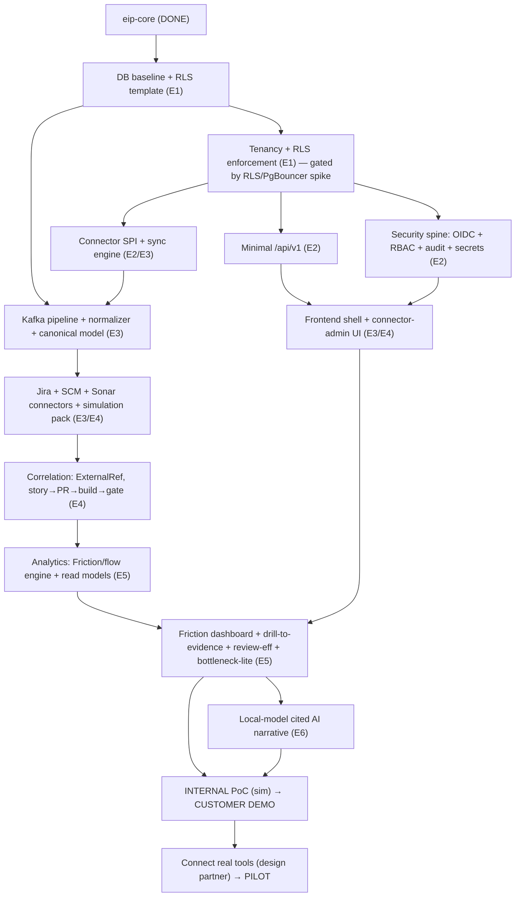

# Sprint-01 Execution Plan — 90-Day Execution-Order Optimization

> Read-only execution plan · Date: 2026-07-08 · Authors (hats): CPO + Chief Architect + Enterprise CTO.
> **This is not a redesign.** Architecture, modular monolith, governance, tenancy, AI strategy, and the long-term roadmap are unchanged. This document re-orders *execution* to reach the earliest customer value, and classifies existing planned work. It creates no tasks, modifies no backlog/PRD/roadmap/ADR, and is not committed. If leadership accepts it, the re-sequencing is applied later through the normal planning process — not by editing this file.
> Sources (strict scope): Sprint01PlanningWorkshop, ExecutiveArchitectureAudit, Vision, PRD, SprintCatalog, Phase-2-Analytics-Enhancements.

## 0. The one objective this plan optimizes

Reach — inside 90 days, on simulation data, then a design-partner's real tools — the single value-proving vertical slice:

> **Install (on-prem) → Connect Jira / Bitbucket / SonarQube → Correlate (story → PR → build → quality gate) → Engineering-Friction "where-time-is-lost" dashboard → Drill-to-evidence → one cited, local-model AI narrative.**

Everything below is classified by whether it serves that slice now, can wait, or must be preserved at full rigor regardless.

## 1. What does NOT change (guardrails — architecture & principles preserved)

These are re-affirmed, not touched: the modular-monolith + `eip-workers` + extraction seams; tenancy-by-construction (`tenant_id` + RLS via transaction-scoped `SET LOCAL app.tenant_id`); the event envelope / outbox / idempotency contracts; module boundaries enforced by Modulith/ArchUnit; deterministic engine as the source of truth with AI additive/cited/validation-gated/local-first; the humane, team-level, anti-surveillance stance (FR-057/NFR-071); metric-definition completeness (purpose/formula/inputs/grain/caveats/gaming-risks); on-prem/air-gap sovereignty. **The re-order changes sequence and depth of *build*, never these invariants.**

## 2. Re-ordered 90-day sequence (six two-week execution sprints, E1–E6)

The official Phase-0 close ceremony (RG dry-run) and Phase-1/Phase-2 breadth are *re-sequenced*, not removed: a thin vertical slice of Phase-1 (connector SPI + Jira/SCM/Sonar + pipeline) and Phase-2 (one Friction dashboard) is pulled forward and run **on the simulation pack first**, so the pipeline and demo exist before real credentials. Existing SprintCatalog story IDs are referenced where the work maps to already-planned stories.

| Exec sprint | Weeks | Focus | Maps to planned stories |
|---|---|---|---|
| **E1** | 1–2 | Leaned persistence + RLS + tenancy spine. **Week-1 RLS+PgBouncer spike.** Define the simulation-pack shape (Jira/Bitbucket/Sonar-like). | P0-E2-S2 (leaned), P0-E3-S1 (full rigor on RLS) |
| **E2** | 3–4 | Security spine (OIDC + RBAC + audit + secret vault, leaned) + **minimal** `/api/v1` + start connector SPI. | P0-E3-S2/S3/S4 (leaned), P0-E4-S1, P0-E4-S2 (minimal) |
| **E3** | 5–6 | Connector SPI + sync engine + Kafka pipeline + normalizer + canonical `WorkItem`/`PullRequest`/build/quality model **on simulation** (transitions & wait-time first-class) + frontend shell. *Replaces the "empty Phase-0 close" scope.* | P1-E1-S1/S2/S3, P1-E2-S1/S2 (thin, sim-first), P0-E5-S1 |
| **E4** | 7–8 | Jira + one SCM (Bitbucket DC / GitLab self-managed) + SonarQube connectors (sim, then real-stubs) + **correlation** (ExternalRef resolution, story→PR→build→gate) + **minimal connector-admin UI** (pulled forward from Sprint-07). | P1-E3-S1/S2/S3, P1-E4-S1 (minimal) |
| **E5** | 9–10 | Analytics: Friction/flow metric engine + read models + **the Where-time-is-lost dashboard + drill-to-evidence + review-efficiency + bottleneck-lite**. → **Internal PoC**. | Phase-2 analytics (thin), Phase-2-planning ideas #1/#4/#7/#9 |
| **E6** | 11–12 | Thin `eip-ai` slice: **one cited, local-model narrative** + demo polish + security/deploy packet. → **Customer demo**; begin connecting a design partner's real tools on their sandbox. | Phase-3 AI (thin, cited-narrative only) |

**Why this order:** each exec sprint ends with something demonstrable; the security spine (E2) runs early because it gates a *pilot's* security review, not because an internal PoC needs it; the pipeline is built on simulation (E3) so the demo (E6) does not wait on customer credentials.

## 3. Minimum vertical slice (the critical path, nothing more)

Anything not reachable from a node on this path is, by definition, deferrable within the 90 days.

## 4. Backlog classification (every relevant item marked)

### Protect Exactly As Is (full rigor — never thinned; these are the trust/architecture core)
- **RLS tenancy** — `tenant_id` + `SET LOCAL app.tenant_id` (transaction-scoped) + the `TENANT_A/TENANT_B` isolation suite (P0-E3-S1). The crux of trust and future scale.
- **Security essentials** — OIDC auth, RBAC enforcement, audit-on-every-mutation, AES-256-GCM secret vault via KMS SPI (P0-E3-S3/S4 core, P0-E4-S1 core). Non-negotiable for a regulated pilot.
- **Module boundaries** — Modulith/ArchUnit verification on every new module; `eip-core` stays a leaf.
- **Event envelope / outbox / idempotency** — pipeline correctness (dedup on `eventId`, checkpointing) is not a corner to cut.
- **Deterministic-first + AI discipline** — metric engine is the source of truth; the AI narrative is additive, cited, validation-gated, local-model, off-by-default-safe.
- **Anti-surveillance** — team-level only; no individual metric can be constructed. Zero exceptions.
- **Metric-definition completeness** — every shipped metric carries purpose/formula/inputs/grain/caveats/gaming-risks. This *is* the differentiation ("numbers you can trust").

### Critical Now (on the vertical-slice critical path — build in the 90 days)
- DB baseline + RLS **template** (P0-E2-S2, leaned).
- Tenancy + context propagation (P0-E3-S1).
- Minimal `/api/v1` (subset of P0-E4-S2) — enough to serve the dashboard.
- OIDC + RBAC + audit + secret vault (leaned P0-E3-S2/S3/S4, P0-E4-S1) — for pilot security review.
- Frontend shell (P0-E5-S1) + **minimal connector-admin UI** (pulled forward from P1-E4-S1) — demo screen #1.
- Connector SPI + sync engine (P1-E1-S1/S2, thin).
- Kafka pipeline + normalizer + canonical `WorkItem`/`PullRequest`/build/quality-gate model **with `WorkItemTransition`/wait-time and PR-review timings first-class** (P1-E1-S3, P1-E2-S1/S2, thin).
- **Jira + one SCM (Bitbucket DC / GitLab self-managed) + SonarQube** connectors + the simulation pack (P1-E3-*).
- Correlation + `ExternalRef` resolution (story→PR→build→gate).
- Analytics: **Friction / where-time-is-lost engine + read models + the one dashboard + drill-to-evidence + review-efficiency + bottleneck-lite** (Phase-2 analytics, thin; Phase-2-planning ideas #1 Friction, #7 Bottleneck-lite, #9 Review Queue).
- One cited, local-model AI narrative (thin `eip-ai`).

### Can Move Later (defer or thin — does not block the demo/pilot)
- Full observability wiring / Grafana starter dashboards (P0-E4-S3) — keep basic OTel HTTP→DB tracing only.
- Heavy time-partitioning conventions (P0-E2-S2 depth) — template now, partitioning at volume.
- Full OpenAPI catalog (P0-E4-S2 breadth) — minimal now.
- RBAC **permission-matrix generator** over all endpoints + break-glass sophistication (P0-E3-S2 depth).
- Full connector **contract-test kit K1–K7** (P1-E1-S4) — basic connector tests now.
- Admin-console breadth (P0-E5-S2: tenants/users/roles/audit-viewer) beyond the demo's needs; the standalone **data browser** (P1-E4-S2).
- **RG1–RG4 dry-run / Phase-0 close ceremony** — fold in later as a checkpoint; timeboxed; must not gate the demo slice.
- Governance *depth* (full 8-gate ceremony per task) — dial to team size; re-expand as the team grows. (The gates themselves stay; the ceremony weight is reduced.)
- Connectors beyond Jira + one SCM + Sonar.

## 5. Do NOT pull forward — even though it is technically attractive

These stay in their planned phases (Vision §8 Horizons 2–3); pulling them forward would burn the 90 days and *dilute the demo*:
- The full **18-agent AI suite**, **MCP client/server**, generated **presentations/diagrams**, executive-summary automation, report scheduling/notification center.
- **Qdrant**, GPU-scale AI, multi-model routing, per-agent budgets, the full **RAG pipeline** (one cited narrative ≠ full RAG).
- The rest of the **~20-connector catalog** (Artifactory, Docker Registry, K8s/OpenShift ingestion, Grafana, generic SQL/file), **Confluence-for-RAG**.
- **K8s/OpenShift GA + HA/DR + multi-AZ** — a pilot runs on Compose or one namespace.
- **50-tenant multi-tenancy at scale / per-tenant sharding** — RLS is designed-in; do not *build* sharding.
- The full **experience-index family** (Analyst/Tester/Requirement indices) beyond the DevEx-composite/Friction hero — this is the *land-and-expand* story for releases 2–3, and the reason a customer renews. Shipping it all in v1 both delays the demo and gives away the expansion narrative.

## 6. Earliest realistic dates

Assumptions: a small but highly capable team (≈3–5 engineers), ruthless scope discipline per this plan, **simulation-first** so the pipeline/demo do not wait on customer credentials, and the guardrails in §1 held at full rigor.

| Milestone | Earliest realistic | Gated by |
|---|---|---|
| **Internal PoC** (simulation → Friction dashboard + drill-to-evidence, local) | **~8 weeks** (end of E4/E5) | Leaned spine + connectors-on-sim + pipeline + one dashboard |
| **Customer demo** (the five screens on sim data + cited AI narrative + security brief) | **~10–12 weeks** (end of E6) | + AI narrative + connector-admin UI + demo polish + security packet |
| **Design-partner pilot** (their Jira/Bitbucket/Sonar, their infra, security-reviewed) | **~4–5 months** | + real-connector hardening + security spine complete + deploy/security packet + their security review |
| **First production deployment** (paying install) | **~6–8 months** | + connector hardening at their scale + the customer's security/procurement cycle (usually the longer pole) |

On the *current* breadth-and-governance-first sequencing, add ~1–3 months to each; the delta is scope discipline, not capability.

## 7. Vision-preservation check (Q8)

Does this execution order still deliver **"On-prem Enterprise SDLC Intelligence Platform focused on Engineering Productivity Intelligence"**? **Yes — it sharpens it, and here is the line-by-line proof:**

| Vision element | Preserved? | How |
|---|---|---|
| On-prem / air-gap sovereignty | ✅ strengthened | The demo *leads* with "runs inside your firewall, nothing leaves"; no deferred item introduces egress. |
| SDLC-tool integration | ✅ | The slice connects Jira + Bitbucket/GitLab + SonarQube — real SDLC tools — earlier than the current plan, aligned to the actual buyer. |
| Deterministic productivity intelligence | ✅ strengthened | The Friction/where-time-is-lost + bottleneck + review-efficiency engine is deterministic and is the *hero*, not an afterthought. Metric-definition rigor is a protected guardrail. |
| Correlation over collection | ✅ | Correlation (story→PR→build→gate with provenance) is on the critical path (E4) — the moat, demoed. |
| AI as assistive interpretation only | ✅ | AI enters last (E6), as one cited, local-model, validation-gated narrative; deterministic engine remains source of truth; everything works with AI off. |
| Humane, team-level, no surveillance | ✅ non-negotiable | Protected guardrail; the demo explicitly shows there is no individual leaderboard (the compliance/works-council unlock). |
| Horizon focus (Vision §8) | ✅ aligned | Everything pulled forward is **Horizon 1 (Correlated Visibility)**; everything deferred is Horizon 2–3 (agents/MCP/scale). The plan simply executes Horizon 1 *faster and in demo order*. |

Nothing in this plan cuts, weakens, or contradicts the vision. It defers only Horizon-2/3 breadth and dials governance/observability *depth* to stage — and it moves the differentiating deterministic metrics **into** the near-term, correcting the audit's finding that the moat was parked in "future planning."

## 8. The three decisions this plan asks leadership to make (not to build — to decide)

1. **Commit to one design-partner profile now** (regulated enterprise on Jira DC + Bitbucket DC / GitLab self-managed + SonarQube) and align E4 connectors to *their* stack — the single highest-leverage choice. (Corrects the GitHub-first mismatch.)
2. **Authorize the re-sequence:** lean E1/E2 (defer full observability/OpenAPI/permission-matrix), and pull a thin Phase-1/Phase-2 slice + connector-admin UI forward, treating the RG dry-run as a later checkpoint — without touching the architecture or the roadmap doc.
3. **Hold the "do-not-pull-forward" line (§5)** against scope gravity toward AI breadth, MCP, and connector breadth for the full 90 days.

---
*Read-only analysis. No tasks, backlog, roadmap, PRD, ADR, or commits were created or modified.*
