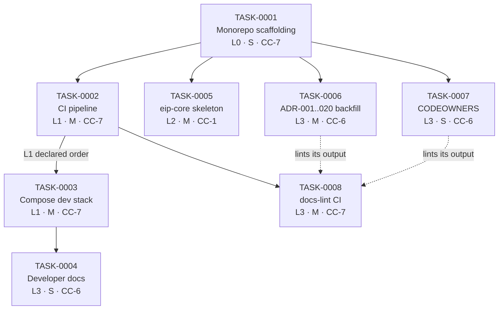

# SPRINT-00 Task Dependency Graph

The task DAG and its lanes. Dependencies come from [Sprint00.md §12](../../program/Sprint00.md) (lanes) and each spec's `Dependencies` field ([TaskSpecs.md](./TaskSpecs.md)). Rule: a task may CLAIM only when every dependency is DONE or a named stub is in place ([DefinitionOfReady §1](../../engineering-operating-system/DefinitionOfReady.md)); parallel tasks have **disjoint write-sets** ([SprintExecutionGuide §2.3](../../engineering-operating-system/SprintExecutionGuide.md)).

## Graph

Solid = hard dependency (must be DONE). Dashed = soft (target consumes the source's output; ordering preferred, not blocking).

## Dependency table

| Task | Hard deps | Soft deps | Write-set (disjoint check) |
|---|---|---|---|
| TASK-0001 | — | — | repo root, `settings.gradle.kts`, `buildSrc`, module skeletons |
| TASK-0002 | TASK-0001 | — | `/.github/workflows`, `buildSrc` coverage config |
| TASK-0003 | TASK-0001 | after TASK-0002 (L1 order) | `/infra/docker-compose`, `/infra/grafana`, `/Makefile` |
| TASK-0004 | TASK-0003 | TASK-0002 (gates), TASK-0008 (lint) | `/README.md`, `/docs/onboarding` or `/CONTRIBUTING.md` |
| TASK-0005 | TASK-0001 | — | `/backend/eip-core` |
| TASK-0006 | TASK-0001 | — | `/docs/adr`, ArchOverview §7 links |
| TASK-0007 | TASK-0001 | — | `/CODEOWNERS` |
| TASK-0008 | TASK-0002 | TASK-0006, TASK-0007 (real content to lint) | `/scripts/docs-lint`, CI docs-lint stage |

**Write-set disjointness:** after TASK-0001 merges, the remaining seven touch non-overlapping paths — TASK-0002 (`/.github`) vs TASK-0003 (`/infra`) vs TASK-0005 (`/backend/eip-core`) vs TASK-0006 (`/docs/adr`) vs TASK-0007 (`/CODEOWNERS`) — so they satisfy the single-writer rule and run concurrently. The only shared file is `/.github/workflows/ci.yml`, touched by TASK-0002 (creates) then TASK-0008 (adds a stage) — sequenced by the hard dep, never concurrent.

## Critical path

`TASK-0001 → TASK-0002 → TASK-0003 → TASK-0004` (scaffolding → CI → Compose → docs). Length ≈ S+M+M+S. TASK-0005 (L2) and TASK-0006/0007 (L3) run off TASK-0001 in parallel and do not extend the critical path; TASK-0008 joins after TASK-0002. See [Sprint00ExecutionOrder.md](./Sprint00ExecutionOrder.md) for the wave schedule.

## Related documents

- [Sprint00ExecutionOrder.md](./Sprint00ExecutionOrder.md) · [TaskSpecs.md](./TaskSpecs.md) · [Sprint00Plan.md](./Sprint00Plan.md)
- [../../program/ParallelizationPlan.md](../../program/ParallelizationPlan.md) · [../../engineering-operating-system/SprintExecutionGuide.md](../../engineering-operating-system/SprintExecutionGuide.md)
